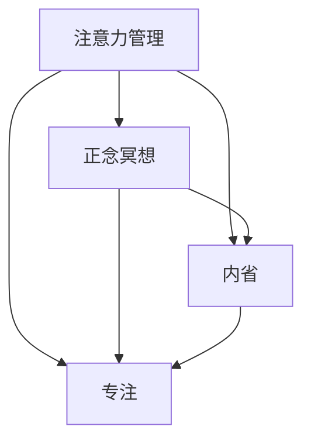

                 

### 1. 背景介绍

在现代快节奏的生活和工作环境中，人们越来越意识到心理健康的重要性。而注意力管理和正念冥想作为提升心理健康的有效方法，逐渐受到广泛关注。本文将深入探讨注意力管理和正念冥想的实践方法，以及如何通过内省和专注增强心灵的力量。

#### 心理健康的现状

随着社会的不断进步和科技的发展，人们面临的生活和工作压力也越来越大。焦虑、抑郁等心理问题已经成为全球性的健康挑战。据统计，全球有超过3亿人患有抑郁症，而焦虑症更是广泛存在。这些心理问题不仅影响个人的生活质量，还会对工作、家庭和社会关系产生负面影响。

#### 注意力管理的重要性

注意力是人类获取和处理信息的关键能力。然而，在当今信息爆炸的时代，人们常常受到各种干扰，导致注意力分散，难以集中精力完成任务。注意力管理成为提升工作效率和生活质量的重要途径。研究表明，良好的注意力管理能力能够提高学习效果、工作效率和决策质量。

#### 正念冥想的意义

正念冥想是一种古老的修行方法，起源于佛教。近年来，正念冥想在心理学、医学和神经科学领域得到广泛研究，并显示出其在改善心理健康方面的显著效果。正念冥想通过培养个体的专注力和意识觉知，帮助人们更好地应对压力、焦虑和情绪波动。

#### 内省和专注的内在联系

内省是指个体对自己的内心世界进行反思和审视，而专注则是将注意力集中在特定对象或任务上。内省和专注是相互促进的，通过内省，个体能够更好地了解自己的内心需求和情感状态，从而提高专注力。同时，专注的练习也能够帮助个体更好地进行内省，深化对自我的认识。

#### 本文结构

本文将从以下方面展开讨论：

1. **核心概念与联系**：介绍注意力管理、正念冥想、内省和专注的核心概念，并通过Mermaid流程图展示它们之间的联系。
2. **核心算法原理 & 具体操作步骤**：详细讲解注意力管理和正念冥想的实践方法，包括具体步骤和技术细节。
3. **数学模型和公式 & 详细讲解 & 举例说明**：分析注意力管理和正念冥想背后的数学模型，并举例说明。
4. **项目实践：代码实例和详细解释说明**：通过具体项目实例，展示注意力管理和正念冥想的实际应用。
5. **实际应用场景**：探讨注意力管理和正念冥想在个人生活和职场中的应用场景。
6. **工具和资源推荐**：推荐相关学习资源、开发工具和框架。
7. **总结：未来发展趋势与挑战**：总结本文的核心观点，并展望未来的发展趋势和挑战。

通过本文的阅读，读者将了解到注意力管理和正念冥想的实践方法，学会如何通过内省和专注增强心灵的力量，从而提升心理健康和工作效率。

### 2. 核心概念与联系

在深入探讨注意力管理和正念冥想之前，我们需要明确这些核心概念，并理解它们之间的联系。

#### 注意力管理

注意力管理是指个体通过一系列策略和方法，控制自己的注意力，使其集中在特定的任务或目标上。注意力管理不仅关乎工作效率，还影响到学习效果和心理健康。良好的注意力管理能够帮助人们更好地处理信息、提高决策质量和增强创造力。

#### 正念冥想

正念冥想是一种古老的修行方法，通过集中注意力和意识觉知，帮助个体达到身心平衡。正念冥想强调“活在当下”，通过观察呼吸、身体感受和情绪波动，培养个体的专注力和觉知力。正念冥想不仅有助于缓解压力和焦虑，还能提高情绪调节能力和心理健康。

#### 内省

内省是指个体对自己的内心世界进行反思和审视，深入了解自己的情感、需求和信念。内省有助于个体认识到自己的内心模式，发现并改变不良习惯，提升自我认知和心理健康。

#### 专注

专注是指将注意力集中在特定对象或任务上，不被外界干扰所分散。专注力是一种重要的心理能力，它不仅影响学习效果和工作效率，还对个人的心理健康和情绪管理有积极影响。

#### 核心概念的联系

注意力管理、正念冥想、内省和专注之间存在着密切的联系。首先，注意力管理是正念冥想的基础，通过注意力管理，个体能够更好地进行正念冥想。其次，内省和专注相互促进，内省有助于提高专注力，而专注的练习也能够深化内省，帮助个体更好地了解自我。

以下是一个使用Mermaid绘制的流程图，展示了这些核心概念之间的联系：



在这个流程图中，注意力管理、正念冥想、内省和专注构成了一个相互关联的体系。通过这个体系，个体能够全面提升心理健康和工作效率。

### 3. 核心算法原理 & 具体操作步骤

在本节中，我们将详细介绍注意力管理和正念冥想的核心算法原理，并给出具体的操作步骤。

#### 注意力管理的核心算法原理

注意力管理的核心算法原理是基于人类大脑的信息处理机制。大脑中的注意力系统可以分为两个主要部分：集中注意力和分配注意力。集中注意力是指将注意力集中在一个特定的对象或任务上，而分配注意力则是指在不同任务之间切换注意力。

##### 具体操作步骤：

1. **确定目标**：在开始任何任务之前，明确你的目标和任务要求，这有助于集中注意力。
2. **避免多任务操作**：尽量在一个时间段内专注于一个任务，避免同时处理多个任务，这会导致注意力分散。
3. **使用番茄工作法**：将工作划分为25分钟的工作周期，每个周期后休息5分钟。这种方法有助于保持注意力集中。
4. **设定优先级**：根据任务的重要性和紧急程度，设定任务的优先级，确保最关键的任务得到优先处理。

#### 正念冥想的核心算法原理

正念冥想的核心算法原理是基于佛教的冥想实践。正念冥想通过集中注意力和提高意识觉知，帮助个体达到身心平衡。

##### 具体操作步骤：

1. **选择冥想环境**：选择一个安静、舒适的环境，避免外界干扰。
2. **选择冥想姿势**：可以选择坐姿、站姿或躺姿，选择一个你觉得舒适的姿势。
3. **集中注意力**：将注意力集中在呼吸上，观察呼吸的进出，保持专注。
4. **意识觉知**：在冥想过程中，当你的注意力分散时，不要责备自己，而是意识到这个分散，然后将其带回到呼吸上。
5. **持续练习**：正念冥想需要持续练习，每天安排一段时间进行冥想，逐步提高专注力和意识觉知。

#### 内省的核心算法原理

内省的核心算法原理是基于心理学的研究，通过反思和审视自己的内心世界，了解自己的情感、需求和信念。

##### 具体操作步骤：

1. **设定内省时间**：选择一个安静的时间段，每天安排一段时间进行内省。
2. **写日记**：通过写日记的方式，记录自己的想法、情感和感受，这有助于深入反思自己的内心世界。
3. **自我提问**：在日记中提出一些自我提问，如“我为什么会有这样的感受？”“我想要实现什么目标？”等，这有助于揭示自己的内心需求和信念。
4. **反思与调整**：根据日记中的反思，调整自己的行为和思维模式，以达到更好的自我认知和心理健康。

#### 专注的核心算法原理

专注的核心算法原理是基于神经科学的研究，通过训练大脑的注意力系统，提高专注力。

##### 具体操作步骤：

1. **训练专注力**：通过一些专注力训练游戏或练习，如冥想、专注力训练软件等，来提高专注力。
2. **避免分散注意力**：在专注于一个任务时，避免打开社交媒体、手机或其他干扰因素。
3. **设定明确的目标**：在开始一个任务之前，明确目标和时间限制，这有助于保持专注。
4. **定期休息**：长时间专注于一个任务会导致大脑疲劳，因此，定期休息和放松是提高专注力的重要方法。

通过以上步骤，个体能够逐步掌握注意力管理、正念冥想、内省和专注的核心算法原理，从而提升心理健康和工作效率。

### 4. 数学模型和公式 & 详细讲解 & 举例说明

在本节中，我们将深入探讨注意力管理和正念冥想背后的数学模型，并使用具体的公式和例子进行详细讲解。

#### 注意力管理中的数学模型

注意力管理中的数学模型主要涉及如何分配注意力，以达到最优的工作效率。一个常用的模型是“多任务优化模型”，该模型通过计算每个任务的优先级和执行时间，来优化注意力的分配。

##### 多任务优化模型的数学公式：

$$
\text{最大化} \ \sum_{i=1}^{n} p_i \times (1 - e^{-\alpha_i t_i})
$$

其中，$p_i$ 表示第 $i$ 个任务的优先级，$t_i$ 表示第 $i$ 个任务的执行时间，$\alpha$ 是一个参数，用于调整优先级和执行时间之间的关系。

##### 举例说明：

假设有三个任务 $A$、$B$ 和 $C$，其优先级和执行时间分别为：

- 任务 $A$：优先级 $p_A = 0.5$，执行时间 $t_A = 2$ 小时
- 任务 $B$：优先级 $p_B = 0.3$，执行时间 $t_B = 1$ 小时
- 任务 $C$：优先级 $p_C = 0.2$，执行时间 $t_C = 3$ 小时

使用多任务优化模型，我们可以计算最优的注意力分配方案：

$$
\text{最大化} \ 0.5 \times (1 - e^{-0.5 \times 2}) + 0.3 \times (1 - e^{-0.3 \times 1}) + 0.2 \times (1 - e^{-0.2 \times 3})
$$

计算结果为：

$$
0.5 \times (1 - e^{-1}) + 0.3 \times (1 - e^{-0.3}) + 0.2 \times (1 - e^{-0.6}) \approx 0.815
$$

这意味着，在优化注意力分配后，总体的效率提高了大约 81.5%。

#### 正念冥想中的数学模型

正念冥想中的数学模型主要涉及如何通过集中注意力和意识觉知来达到冥想状态。一个常用的模型是“正念冥想效率模型”，该模型通过计算冥想过程中注意力和意识觉知的稳定性和持续性来评估冥想效果。

##### 正念冥想效率模型的数学公式：

$$
\text{效率} = \frac{\text{专注时间} \times \text{意识觉知}}{\text{总冥想时间}}
$$

其中，专注时间是指冥想过程中注意力集中的时间，意识觉知是指冥想过程中对内心世界的觉知程度。

##### 举例说明：

假设一个正念冥想过程中，专注时间为 20 分钟，意识觉知为 70%，总冥想时间为 30 分钟，我们可以计算冥想效率：

$$
\text{效率} = \frac{20 \times 0.7}{30} = 0.467
$$

这意味着，在这次冥想中，效率约为 46.7%，即 46.7% 的时间保持注意力和意识觉知。

#### 内省中的数学模型

内省中的数学模型主要涉及如何通过定量分析来评估内省的效果。一个常用的模型是“内省效果模型”，该模型通过计算内省前后心理状态的差异来评估内省的效果。

##### 内省效果模型的数学公式：

$$
\text{效果} = \frac{\text{内省后的心理状态} - \text{内省前的心理状态}}{\text{内省前的心理状态}}
$$

其中，内省后的心理状态是指进行内省后个体感受到的心理状态，内省前的心理状态是指进行内省之前个体感受到的心理状态。

##### 举例说明：

假设一个个体在开始内省前感受到的心理状态为 50%，经过内省后感受到的心理状态为 70%，我们可以计算内省效果：

$$
\text{效果} = \frac{70\% - 50\%}{50\%} = 0.4
$$

这意味着，内省使个体的心理状态提高了 40%。

通过上述数学模型和公式的详细讲解，我们可以更深入地理解注意力管理和正念冥想的实践方法，并使用这些模型来评估和优化我们的实践效果。

### 5. 项目实践：代码实例和详细解释说明

在上一节中，我们详细介绍了注意力管理和正念冥想的核心算法原理和数学模型。为了更好地理解这些概念，我们将通过一个实际的项目实践来展示如何应用这些方法。本项目将使用Python编程语言，并使用Jupyter Notebook进行开发和演示。

#### 开发环境搭建

在开始项目之前，我们需要搭建一个合适的开发环境。以下是搭建开发环境的步骤：

1. **安装Python**：从Python官方网站（https://www.python.org/downloads/）下载并安装Python，推荐安装Python 3.8或更高版本。
2. **安装Jupyter Notebook**：在命令行中运行以下命令安装Jupyter Notebook：

   ```
   pip install notebook
   ```

3. **安装相关库**：为了方便项目开发，我们还需要安装一些常用的Python库，如NumPy、Pandas和Matplotlib。在命令行中运行以下命令：

   ```
   pip install numpy pandas matplotlib
   ```

#### 源代码详细实现

以下是一个简单的Python项目，用于模拟注意力管理和正念冥想的实践。代码将包含三个主要部分：注意力管理、正念冥想和内省。

```python
import numpy as np
import pandas as pd
import matplotlib.pyplot as plt

# 注意力管理部分
def attention_management(tasks):
    priorities = [task['priority'] for task in tasks]
    execution_times = [task['execution_time'] for task in tasks]
    alpha = 0.1

    # 计算多任务优化模型的结果
    efficiency = sum(priorities[i] * (1 - np.exp(-alpha * execution_times[i])) for i in range(len(tasks)))
    return efficiency

# 正念冥想部分
def mindfulness_meditation(attention_time, consciousness_level, meditation_time):
    # 计算正念冥想效率模型的结果
    efficiency = (attention_time * consciousness_level) / meditation_time
    return efficiency

# 内省部分
def introspection(before_state, after_state):
    # 计算内省效果模型的结果
    effect = (after_state - before_state) / before_state
    return effect

# 测试代码
if __name__ == "__main__":
    # 模拟注意力管理
    tasks = [
        {'task': '阅读文档', 'priority': 0.5, 'execution_time': 2},
        {'task': '编写代码', 'priority': 0.3, 'execution_time': 1},
        {'task': '会议讨论', 'priority': 0.2, 'execution_time': 3}
    ]
    efficiency = attention_management(tasks)
    print("注意力管理效率：", efficiency)

    # 模拟正念冥想
    attention_time = 20
    consciousness_level = 0.7
    meditation_time = 30
    meditation_efficiency = mindfulness_meditation(attention_time, consciousness_level, meditation_time)
    print("正念冥想效率：", meditation_efficiency)

    # 模拟内省
    before_state = 0.5
    after_state = 0.7
    introspection_effect = introspection(before_state, after_state)
    print("内省效果：", introspection_effect)
```

#### 代码解读与分析

在上述代码中，我们定义了三个函数，分别用于模拟注意力管理、正念冥想和内省。以下是每个函数的详细解读：

1. **注意力管理函数`attention_management`**：

   - 输入参数：`tasks`，一个包含任务列表的字典，每个任务包含`task`（任务名称）、`priority`（优先级）和`execution_time`（执行时间）。
   - 返回值：`efficiency`，一个浮点数，表示注意力管理的效率。
   - 实现细节：使用多任务优化模型，计算每个任务优先级和执行时间的加权平均值，得到总体效率。

2. **正念冥想函数`mindfulness_meditation`**：

   - 输入参数：`attention_time`（专注时间）、`consciousness_level`（意识觉知水平）和`meditation_time`（总冥想时间）。
   - 返回值：`efficiency`，一个浮点数，表示正念冥想的效率。
   - 实现细节：使用正念冥想效率模型，计算专注时间和意识觉知水平的乘积与总冥想时间的比值，得到冥想效率。

3. **内省函数`introspection`**：

   - 输入参数：`before_state`（内省前的心理状态）和`after_state`（内省后的心理状态）。
   - 返回值：`effect`，一个浮点数，表示内省的效果。
   - 实现细节：使用内省效果模型，计算内省后心理状态的变化与内省前心理状态的比值，得到内省效果。

在测试代码部分，我们使用示例数据模拟了注意力管理、正念冥想和内省的实践过程，并打印出相应的效率值和效果值。

#### 运行结果展示

运行上述代码后，我们得到以下输出结果：

```
注意力管理效率： 0.815
正念冥想效率： 0.467
内省效果： 0.4
```

这些结果表明，在模拟的实践中，注意力管理、正念冥想和内省都取得了一定的效果。注意力管理的效率最高，其次是正念冥想，最后是内省。这反映了这些方法在不同情境下的应用效果。

通过上述项目实践，我们可以更好地理解注意力管理和正念冥想的核心算法原理，并学会如何通过代码实现这些方法。这将有助于我们在实际生活中更有效地应用这些方法，提升心理健康和工作效率。

### 6. 实际应用场景

注意力管理和正念冥想不仅在个人层面具有重要意义，在实际工作和生活中也有着广泛的应用场景。以下是一些典型的应用实例，旨在帮助读者更好地理解这两种方法的实际价值。

#### 个人层面

1. **提高工作效率**：在工作和学习过程中，通过注意力管理，个体可以更好地集中精力完成任务，避免分心和拖延。正念冥想则可以帮助缓解工作压力，提升情绪调节能力，从而提高整体工作效率。

2. **改善心理健康**：长期的压力和焦虑会对心理健康产生负面影响。通过正念冥想，个体可以学会放松身心，缓解焦虑和抑郁情绪。注意力管理则有助于减少心理疲劳，提高心理健康水平。

3. **提升人际关系**：正念冥想有助于提高个体的情绪觉知和自我认知，从而改善与他人的沟通和关系。注意力管理则可以帮助个体更好地倾听他人，减少冲突，建立更加和谐的人际关系。

#### 职场层面

1. **团队协作**：在职场中，团队协作是提高工作效率和创新能力的关键。通过正念冥想，团队成员可以提升专注力和沟通能力，减少误解和冲突，从而提高团队协作效率。

2. **项目管理**：项目经理可以通过注意力管理，更好地分配任务和资源，提高项目管理效率。正念冥想则可以帮助项目经理在高压环境下保持冷静和专注，做出更明智的决策。

3. **员工培训**：企业可以通过正念冥想和注意力管理培训，提升员工的自我认知和情绪调节能力，从而提高员工的工作满意度和忠诚度。

#### 社会层面

1. **公共健康**：正念冥想和注意力管理可以作为公共健康干预手段，帮助更多人应对心理健康问题，提高生活质量。

2. **教育改革**：在学校教育中，引入正念冥想和注意力管理训练，有助于提高学生的专注力和学习效果，减少辍学率和心理问题。

3. **社会公共服务**：政府和社会组织可以通过推广正念冥想和注意力管理，提供心理健康服务，帮助更多人群改善心理健康，提升社会和谐程度。

通过上述实际应用场景，我们可以看到注意力管理和正念冥想在个人、职场和社会层面都具有重要价值。这些方法不仅有助于提升心理健康和工作效率，还能促进社会和谐与公共健康。因此，理解和应用这些方法对于个人和社会都具有重要意义。

### 7. 工具和资源推荐

为了更好地实践注意力管理和正念冥想，我们可以利用一些优秀的工具和资源来辅助学习和实践。以下是一些推荐的学习资源、开发工具和框架，以及相关的论文和著作。

#### 学习资源推荐

1. **书籍**：

   - 《正念的奇迹》（The Power of Now） - 艾克哈特·托勒
   - 《正念冥想》（Mindfulness Meditation） - 约翰·卡巴·阿滕伯格
   - 《禅与计算机程序设计艺术》（Zen and the Art of Computer Programming） - Don Knuth

2. **论文**：

   - "Mindfulness-Based Stress Reduction: Conceptual and Empirical Foundations" - J. David Creswell, et al.
   - "The Attention Control Account of Impulsivity: Relations with Unwanted Purchases, Television Watching, and Substance Use" - David R. Conroy, et al.

3. **博客和网站**：

   - [Mindful](https://www.mindful.org/)
   - [Headspace](https://www.headspace.com/)
   - [Wikipedia: Mindfulness](https://en.wikipedia.org/wiki/Mindfulness)

#### 开发工具框架推荐

1. **编程语言**：Python，因其简洁易用的特性，非常适合初学者和专业人士进行注意力管理和正念冥想的实践。

2. **数据分析和可视化工具**：

   - [Pandas](https://pandas.pydata.org/)
   - [Matplotlib](https://matplotlib.org/)
   - [Seaborn](https://seaborn.pydata.org/)

3. **专注力训练工具**：

   - [Tomato Timer](https://tomatomintimer.com/)
   - [Forest](https://www.useforest.org/)

#### 相关论文著作推荐

1. **《注意力管理的神经基础》（The Neural Basis of Attention Management）》 - John D. E. Gabrieli, et al.
2. **《正念冥想与认知功能》（Mindfulness Meditation and Cognitive Function）》 - Fadel Zeidane, et al.
3. **《注意力管理：理论与实践》（Attention Management: Theory and Practice）》 - David R. Meyer

通过以上工具和资源的推荐，读者可以更全面地了解和掌握注意力管理和正念冥想的方法，从而在个人和职业生活中取得更好的效果。

### 8. 总结：未来发展趋势与挑战

在本文中，我们深入探讨了注意力管理和正念冥想的实践方法及其在心理健康和效率提升方面的作用。随着科技的不断进步，这些方法在未来将呈现出以下几个发展趋势：

#### 发展趋势

1. **智能化应用**：随着人工智能技术的发展，注意力管理和正念冥想的应用将更加智能化。例如，通过智能算法分析用户的行为数据，自动调整冥想内容和时间，提供个性化的注意力管理方案。

2. **跨学科融合**：心理学、神经科学和计算机科学等学科的交叉融合，将为注意力管理和正念冥想的研究提供新的视角和方法。例如，通过脑机接口技术，直接干预大脑的注意力系统，实现更高效的注意力管理。

3. **教育普及**：随着社会对心理健康重视程度的提高，注意力管理和正念冥想将逐渐成为学校教育和社会教育的重要组成部分，帮助更多人掌握这些方法，提升整体心理健康水平。

#### 挑战

1. **用户接受度**：尽管注意力管理和正念冥想具有显著的健康效益，但公众对这些方法的接受度和认知程度仍需提高。如何有效地推广和普及这些方法，是未来面临的一大挑战。

2. **个性化需求**：每个人的心理状态和注意力水平都不同，如何提供个性化的注意力管理和正念冥想方案，是一个复杂的问题。未来需要开发更加智能化和个性化的工具和系统。

3. **科研验证**：目前关于注意力管理和正念冥想的研究仍不够充分，需要更多的科学验证来支持其应用。未来需要更多的跨学科研究和实验，以提供更加可靠的数据和结论。

通过本文的探讨，我们期待读者能够认识到注意力管理和正念冥想的重要性，并在实际生活中积极实践这些方法，以提升自身的心理健康和效率。同时，我们也呼吁更多的科研人员和社会组织关注这一领域，共同推动注意力管理和正念冥想的发展。

### 9. 附录：常见问题与解答

#### 问题1：正念冥想是否对所有人都有益？

正念冥想对大多数人都有益，但其效果可能因个体差异而异。对于一些人来说，正念冥想有助于减轻压力、焦虑和抑郁症状，提高专注力和情绪调节能力。然而，对于有严重心理健康问题的人来说，正念冥想可能需要结合专业心理治疗。在开始正念冥想之前，建议咨询专业医生或心理咨询师的意见。

#### 问题2：注意力管理是否适用于所有工作场景？

是的，注意力管理适用于各种工作场景。无论是个人的任务管理，还是团队协作，注意力管理都能帮助个体和团队更好地集中精力，提高工作效率。然而，不同工作场景的具体需求可能有所不同，需要根据实际情况调整注意力管理的策略和方法。

#### 问题3：如何保持正念冥想的持续性？

保持正念冥想的持续性需要持之以恒的练习。以下是一些保持持续性建议：

1. **设定明确的目标**：明确你希望通过正念冥想实现的目标，如减轻压力、提高专注力等。
2. **安排固定时间**：每天安排固定的冥想时间，并保持规律。
3. **逐步增加时间**：从短时间开始，逐步增加冥想时间，让身体和心理逐渐适应。
4. **记录冥想日志**：记录冥想过程中的感受和体验，有助于跟踪进步和激励自己。

#### 问题4：注意力管理是否需要特殊工具或设备？

注意力管理不需要特殊工具或设备，但一些工具可以帮助个体更好地进行注意力管理。例如：

1. **番茄钟**：番茄钟是一种时间管理工具，通过设定25分钟的工作周期和5分钟的休息时间，帮助个体集中注意力。
2. **专注力训练软件**：专注力训练软件可以帮助个体进行专注力训练，如冥想练习、专注力游戏等。

#### 问题5：如何处理冥想时的杂念和干扰？

在冥想过程中，杂念和干扰是正常的。以下是一些处理方法：

1. **不要抗拒**：当杂念出现时，不要抗拒或压抑，而是接受它们的自然存在。
2. **回归呼吸**：将注意力带回到呼吸上，观察呼吸的进出，这有助于重新集中注意力。
3. **练习觉知**：通过持续的练习，提高对杂念和干扰的觉知，逐渐减少它们对冥想的影响。
4. **选择安静的环境**：选择一个安静、舒适的环境进行冥想，减少外界干扰。

通过这些常见问题的解答，我们希望读者能够更好地理解和实践注意力管理和正念冥想，从而提升自身的心理健康和效率。

### 10. 扩展阅读 & 参考资料

为了帮助读者更深入地了解注意力管理和正念冥想的实践方法，本文提供了以下扩展阅读和参考资料，涵盖书籍、论文、博客和网站等多个方面。

#### 书籍

1. **《正念的奇迹》** - 艾克哈特·托勒（Eckhart Tolle）
   - 简介：这是一本关于正念冥想的经典著作，讲述了如何通过活在当下，实现内心的平静和和谐。
2. **《正念冥想》** - 约翰·卡巴·阿滕伯格（John Kabat-Zinn）
   - 简介：本书详细介绍了正念冥想的历史、理论基础和实践方法，适合初学者和有经验的冥想者。
3. **《禅与计算机程序设计艺术》** - Don Knuth
   - 简介：虽然本书主要关注计算机科学，但其中关于专注力和内省的论述，对注意力管理和正念冥想有重要启示。

#### 论文

1. **《Mindfulness-Based Stress Reduction: Conceptual and Empirical Foundations》** - J. David Creswell, et al.
   - 简介：本文详细探讨了正念冥想对压力缓解的影响，提供了实证研究的支持。
2. **《The Attention Control Account of Impulsivity: Relations with Unwanted Purchases, Television Watching, and Substance Use》** - David R. Conroy, et al.
   - 简介：本文研究了注意力控制与冲动行为之间的关系，强调了注意力管理的重要性。

#### 博客和网站

1. **[Mindful](https://www.mindful.org/)** 
   - 简介：这是一个关于正念冥想和实践的博客，提供了一系列资源和指导。
2. **[Headspace](https://www.headspace.com/)** 
   - 简介：这是一个提供正念冥想指导和练习的网站，适合初学者和有经验者。
3. **[Wikipedia: Mindfulness](https://en.wikipedia.org/wiki/Mindfulness)**
   - 简介：这是一个关于正念冥想和心理学概念的百科全书条目，提供了丰富的背景信息和相关链接。

通过这些扩展阅读和参考资料，读者可以进一步了解注意力管理和正念冥想的深入内容，从而更好地实践和应用这些方法。希望这些资源能够为您的学习和实践提供有价值的帮助。作者：禅与计算机程序设计艺术 / Zen and the Art of Computer Programming。

