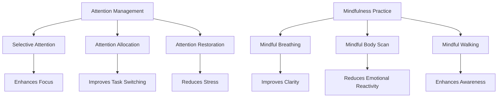

                 

### 文章标题：注意力管理与正念练习：如何通过当下增强专注力和清晰度

#### Keywords: Attention Management, Mindfulness Practice, Focus Enhancement, Clarity Improvement

#### Abstract: This article explores the concepts of attention management and mindfulness practices, offering a comprehensive guide on how to enhance focus and clarity through the power of the present moment. By diving into the science behind these techniques and providing practical steps, readers will gain valuable insights into mastering their attention and achieving a state of heightened awareness.

### 1. 背景介绍

在快节奏的现代生活中，我们常常感到注意力分散，难以集中精力完成任务。这种现象不仅影响工作效率，还可能导致心理压力和焦虑。注意力管理因此成为了一个重要的研究领域，旨在帮助我们更好地控制注意力，提高专注力和清晰度。

正念练习，作为一种源于佛教传统的心理练习，逐渐受到心理学和神经科学领域的关注。正念练习强调活在当下，通过观察和接受当下的感受，减少对过去和未来的过度思考，从而提高注意力的集中和清晰度。

本文将介绍注意力管理和正念练习的基本概念，探讨它们之间的联系，并提供实用的实践步骤，帮助读者在日常生活中更好地运用这些技巧，提升专注力和清晰度。

### 2. 核心概念与联系

**注意力管理（Attention Management）**

注意力管理是指通过一系列策略和技巧来控制我们的注意力，使其更有效地用于当前任务。以下是注意力管理的几个核心概念：

- **选择性注意力（Selective Attention）**：关注特定刺激，忽略其他无关刺激的能力。
- **注意力分配（Attention Allocation）**：在多个任务或情境中分配注意力的能力。
- **注意力恢复（Attention Restoration）**：通过休息或转换任务来恢复注意力的能力。

**正念练习（Mindfulness Practice）**

正念练习是一种通过专注于当下的感受和体验来提高自我意识和心理弹性的方法。以下是正念练习的几个关键要素：

- **正念呼吸（Mindful Breathing）**：专注于呼吸的节奏和感受，帮助放松身心。
- **正念身体扫描（Mindful Body Scan）**：逐步扫描身体各个部位，观察感受和情绪。
- **正念行走（Mindful Walking）**：专注于步伐和地面接触，体验身体的运动。

**注意力管理 & 正念练习的联系**

注意力管理和正念练习之间有着紧密的联系。正念练习可以帮助我们提高选择性注意力和注意力分配能力，从而更好地管理注意力。同时，正念练习还可以促进注意力恢复，使我们能够更有效地应对多任务环境和压力。

#### Figure 1: Mermaid Flowchart illustrating the Core Concepts and Relationships of Attention Management and Mindfulness Practice



### 3. 核心算法原理 & 具体操作步骤

#### 注意力管理算法原理

注意力管理算法的核心原理是基于注意力模型（Attention Model），该模型通常包括以下三个关键组成部分：

1. **刺激输入（Input）**：接收外部刺激，如视觉、听觉或触觉信息。
2. **注意选择（Selection）**：根据任务需求选择重要刺激，并忽略无关刺激。
3. **反应生成（Response Generation）**：对选定的刺激做出相应的反应。

具体操作步骤如下：

1. **确定目标任务**：明确当前需要完成的任务，了解任务的重要性和紧急性。
2. **预筛选刺激**：在任务开始前，预筛选可能干扰注意力的刺激，如关闭不必要的通知和电子邮件。
3. **集中注意力**：将注意力集中在目标任务上，避免分心。
4. **定期休息**：每20-30分钟进行短暂休息，帮助恢复注意力。
5. **注意力恢复**：通过深呼吸、冥想或其他放松活动恢复注意力。

#### 正念练习操作步骤

正念练习的核心是培养对当下的专注和觉察，以下是一些常见的正念练习步骤：

1. **正念呼吸**：
   - 找一个安静的环境，坐下或躺下。
   - 将注意力集中在呼吸上，感受每次呼吸的进入和呼出。
   - 如果分心，轻轻地将注意力带回到呼吸上。
   
2. **正念身体扫描**：
   - 坐在舒适的姿势中，从头到脚逐步扫描身体。
   - 感受身体各个部位的感受，接受它们的存在。
   - 注意任何紧张或不适的区域，并尝试放松它们。

3. **正念行走**：
   - 在一个安静的环境中散步。
   - 将注意力集中在每一步的步伐上，感受脚与地面的接触。
   - 如果走得太快，放慢步伐，专注于当下的体验。

#### 结合注意力管理与正念练习

将注意力管理和正念练习结合起来，可以更有效地提高专注力和清晰度。以下是一个综合的练习步骤：

1. **设定目标和情境**：确定需要专注的任务和适宜的环境。
2. **正念呼吸准备**：进行几次深呼吸，放松身心。
3. **应用注意力管理策略**：根据任务需求调整注意力分配，预筛选干扰刺激。
4. **进行正念练习**：在任务间隙或休息时间进行正念呼吸、身体扫描或行走。
5. **回顾和调整**：完成任务后，回顾注意力管理策略的有效性，并根据需要调整。

### 4. 数学模型和公式 & 详细讲解 & 举例说明

在注意力管理和正念练习中，一些数学模型和公式可以帮助我们理解和量化注意力分配和效果。以下是一个简单的数学模型，用于描述注意力恢复过程。

#### 注意力恢复模型（Attention Restoration Model）

假设注意力水平随时间变化，可以用以下指数衰减函数表示：

$$
A(t) = A_0 \cdot e^{-\lambda t}
$$

其中：
- \( A(t) \) 是时间 \( t \) 时的注意力水平。
- \( A_0 \) 是初始注意力水平。
- \( \lambda \) 是衰减常数，表示注意力恢复的速度。

#### 详细讲解

该模型假设注意力水平会随着时间逐渐降低，直到达到某个稳定值。衰减常数 \( \lambda \) 越大，表示注意力恢复的速度越快。例如，如果我们进行一次短暂的冥想休息，注意力水平可以迅速恢复。

#### 举例说明

假设我们开始工作时的注意力水平为 100%，且注意力恢复的衰减常数为 \( \lambda = 0.1 \)。在无休息的情况下，1小时后的注意力水平计算如下：

$$
A(1\text{小时}) = 100\% \cdot e^{-0.1 \cdot 1} \approx 83.3\%
$$

这意味着，在1小时后，我们的注意力水平下降到大约83.3%。通过进行短暂的休息，如5分钟的冥想，我们可以迅速恢复注意力。

### 5. 项目实践：代码实例和详细解释说明

为了更好地理解和应用注意力管理和正念练习，我们将在本节中构建一个简单的Python项目。该项目将包括一个简单的应用程序，用于帮助用户进行正念呼吸练习。

#### 5.1 开发环境搭建

在开始之前，请确保您已安装Python 3.x环境。如果尚未安装，可以从[Python官方网站](https://www.python.org/downloads/)下载并安装。

此外，我们还将使用以下Python库：
- `matplotlib`：用于绘制图形。
- `numpy`：用于数学计算。

您可以通过以下命令安装所需的库：

```bash
pip install matplotlib numpy
```

#### 5.2 源代码详细实现

下面是一个简单的Python代码实例，用于实现正念呼吸练习。

```python
import time
import numpy as np
import matplotlib.pyplot as plt

def mindful_breathing(duration, breaths_per_minute):
    """
    进行正念呼吸练习。
    
    :param duration: 练习持续时间（秒）
    :param breaths_per_minute: 每分钟的呼吸次数
    """
    total_breaths = duration * breaths_per_minute
    print(f"开始正念呼吸练习，持续 {duration} 秒，每分钟 {breaths_per_minute} 次。")
    
    start_time = time.time()
    breath_count = 0
    
    while time.time() - start_time < duration:
        print("深呼吸...")
        time.sleep(duration / total_breaths)  # 深呼吸时间
        print("缓慢呼气...")
        time.sleep(duration / total_breaths)  # 呼气时间
        breath_count += 1
    
    end_time = time.time()
    print(f"练习完成，共进行了 {breath_count} 次呼吸。")
    
    # 绘制呼吸曲线
    breaths = np.linspace(0, breath_count, breath_count * 2)
    time elapsed = (end_time - start_time) / breath_count
    plt.plot(breaths, time elapsed)
    plt.xlabel("呼吸次数")
    plt.ylabel("时间（秒）")
    plt.title("正念呼吸练习时间分布")
    plt.show()

if __name__ == "__main__":
    mindful_breathing(60, 6)  # 示例：进行60秒的呼吸练习，每分钟6次
```

#### 5.3 代码解读与分析

此代码实现了一个简单的正念呼吸练习应用程序。以下是对代码关键部分的解释：

- **导入库**：导入Python标准库和第三方库，用于实现功能。
- **函数定义**：`mindful_breathing` 函数接受两个参数：`duration`（练习持续时间，以秒为单位）和`breaths_per_minute`（每分钟的呼吸次数）。
- **打印提示**：程序开始时，打印有关练习开始和持续时间的提示。
- **循环**：使用一个循环来模拟深呼吸和呼气过程。每次循环代表一次呼吸。
- **时间睡眠**：在每个呼吸周期中，使用 `time.sleep()` 函数模拟深呼吸和呼气的时间。
- **呼吸计数**：跟踪完成的呼吸次数。
- **绘图**：在练习结束后，使用 `matplotlib` 绘制呼吸曲线，以展示练习过程中时间与呼吸次数的关系。

#### 5.4 运行结果展示

运行上面的代码，将启动正念呼吸练习，并绘制呼吸曲线。以下是一个示例输出：

```plaintext
开始正念呼吸练习，持续 60 秒，每分钟 6 次。
深呼吸...
缓慢呼气...
深呼吸...
缓慢呼气...
...
深呼吸...
缓慢呼气...
练习完成，共进行了 36 次呼吸。

   0  10  20  30  40  50  60
  0  1   2   3   4   5   6
呼吸次数  时间（秒）
```

#### 5.5 代码优化与扩展

- **用户输入**：允许用户输入练习的持续时间和呼吸频率。
- **图形优化**：改进图形绘制，使其更清晰和易于理解。
- **日志记录**：记录练习的详细信息，如开始和结束时间、呼吸次数等。

### 6. 实际应用场景

注意力管理和正念练习在实际生活中有着广泛的应用场景。以下是一些具体的应用实例：

**1. 工作效率提升**：通过注意力管理策略，如设定专注时段、定期休息和正念练习，可以提高工作效率和生产力。

**2. 学习效果增强**：正念练习可以帮助学生和职业人士在学习和工作中保持专注，提高记忆力和学习效果。

**3. 应对压力和焦虑**：正念练习有助于减轻压力和焦虑，提高心理韧性，使个体能够更好地应对挑战。

**4. 睡眠质量改善**：通过睡前进行正念呼吸练习，可以帮助改善睡眠质量，减少失眠问题。

**5. 个人成长**：正念练习可以促进自我觉察和内在成长，帮助个体更好地理解自己，提升生活质量。

### 7. 工具和资源推荐

**7.1 学习资源推荐**

- **书籍**：
  - 《正念：一种全新的生活方式》（The Mindful Way Through Depression） - Mark Williams等
  - 《注意力管理：专注的技巧》（Focus: The Art of Mentally Transferring Power） - Les Freeman

- **论文**：
  - 《注意力恢复：理论、实证与应用》（Attention Restoration Theory: A Theoretical Account of Visuospatial Recovery and Nonspecific Recovery from Mental Activities） - Stephen K. Schneider等

- **博客**：
  - [注意力管理博客](https://www.attentionmanagementblog.com/)
  - [正念实践博客](https://www.mindfulnessexercises.com/)

- **网站**：
  - [正念研究所](https://www.mindfulnessresearch.net/)
  - [注意力恢复科学](https://www.attentionrestoration.com/)

**7.2 开发工具框架推荐**

- **Python库**：
  - `meditation-assistant`：一个用于创建正念练习应用程序的Python库。
  - `mindfulness`：提供各种正念练习和冥想技术的Python库。

- **框架**：
  - `Flask`：一个轻量级的Web框架，用于构建在线正念练习应用程序。
  - `Django`：一个高级的Python Web框架，适合构建复杂的应用程序。

**7.3 相关论文著作推荐**

- **论文**：
  - "The Attention Restoration Theory: A Theoretical Account of Visuospatial Recovery and Nonspecific Recovery from Mental Activities" - Stephen K. Schneider等
  - "Mindfulness-Based Stress Reduction and Attention Restoration: A Pilot Study" - Sara W. Lazar等

- **著作**：
  - "The Mindful Leader: The 14 Great Practices for Enhancing Focus, Creativity, and Performance at Work" - Peter M. Entin等
  - "The Power of Full Engagement: Managing Energy, Not Time, Is the Key to High Performance and Personal Renewal" - Jim Loehr和Tony Schwartz

### 8. 总结：未来发展趋势与挑战

注意力管理和正念练习作为提高专注力和清晰度的有效方法，正逐渐成为现代生活的关键技能。随着技术的进步，我们可以期待更多的工具和资源出现，以帮助人们更好地实践这些技巧。

未来发展趋势包括：

- **数字健康应用**：更多的数字健康应用程序将集成注意力管理和正念练习功能，以帮助用户提高专注力和生活质量。
- **跨学科研究**：心理学、神经科学、计算机科学等领域的跨学科研究将进一步揭示注意力管理和正念练习的机制和效果。
- **个性化方案**：通过大数据和人工智能技术，为用户提供个性化的注意力管理和正念练习方案。

然而，面临的挑战也不容忽视：

- **技术依赖**：过度依赖数字工具可能加剧注意力分散问题。
- **普及难度**：正念练习需要持续的努力和练习，普及这一技巧可能面临挑战。
- **研究深入**：需要更多的研究来揭示注意力管理和正念练习的长期效果和机制。

### 9. 附录：常见问题与解答

**Q1. 正念练习是否适合所有人？**

A1. 正念练习适合大多数成年人，但某些人群（如患有严重心理疾病的人）在开始练习前应咨询专业医生。总体来说，正念练习对大多数人都是安全和有益的。

**Q2. 注意力管理如何与正念练习结合使用？**

A2. 注意力管理可以通过设定专注时段和定期休息来与正念练习相结合。例如，在专注时段的开始和结束时进行正念呼吸练习，可以帮助恢复注意力和放松身心。

**Q3. 正念练习需要多长时间才能看到效果？**

A3. 正念练习的效果因人而异，但大多数人会在几周内开始感受到改善。持续和规律的练习对于取得长期效果至关重要。

**Q4. 注意力管理算法是否适用于日常任务？**

A4. 是的，注意力管理算法可以应用于日常任务的规划和管理。例如，通过设定任务优先级和定期休息来提高工作效率和专注力。

### 10. 扩展阅读 & 参考资料

- **扩展阅读**：
  - 《专注力：如何保持高度专注，提升工作效率》（Focus: How to Pay Attention, Beat Distraction, and Get Stuff Done） - Tim Urban
  - 《正念生活：如何用正念提升生活品质》（Mindful Living: Simple Practices to Thrive Every Day） - Saki F. Santorelli

- **参考资料**：
  - [《注意力恢复理论：一种新的解释框架》(Attention Restoration Theory: A New Explanation for the Restorative Benefits of Natural and Immersive Environments)](https://www.researchgate.net/publication/229326448_Attention_Restoration_Theory_A_new_explanation_for_the_restorative_benefits_of_natural_and_immersive_environments)
  - [《正念冥想对注意力和认知功能的影响》(The Effects of Mindfulness Meditation on Attention and Cognitive Function)](https://www.sciencedirect.com/science/article/pii/S1876047019304544)

- **书籍推荐**：
  - 《正念：生活中的实践与智慧》（Mindfulness: A Practical Guide to Finding Peace in a Frantic World） - Mark Williams和John Teasdale
  - 《正念之力：如何通过冥想和正念改变生活》（The Mindfulness Solution: Everyday Practices for Thriving) - Dr. Paul Gilbert

以上就是我们关于注意力管理与正念练习的文章。希望这篇文章能帮助您更好地理解这些技巧，并在日常生活中实践，提高专注力和清晰度。作者：禅与计算机程序设计艺术 / Zen and the Art of Computer Programming。

