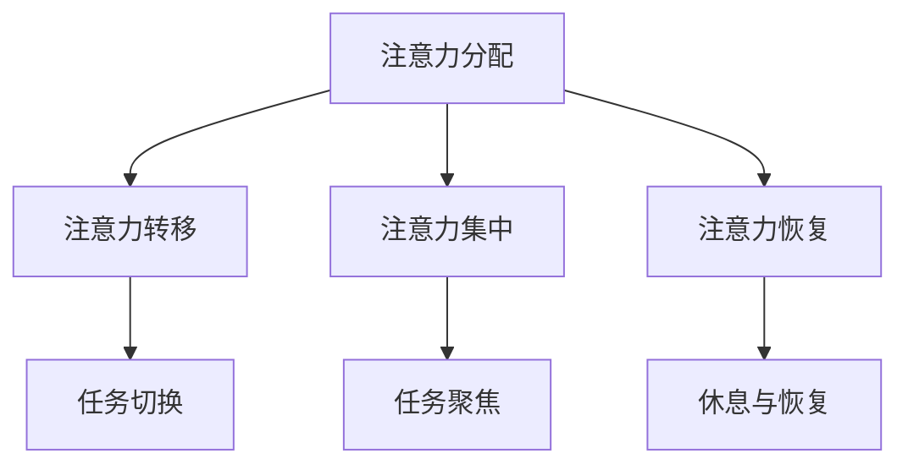
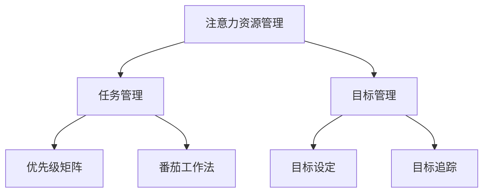
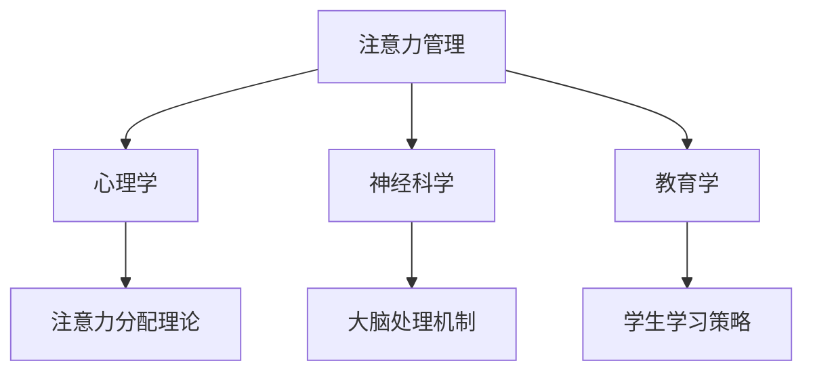
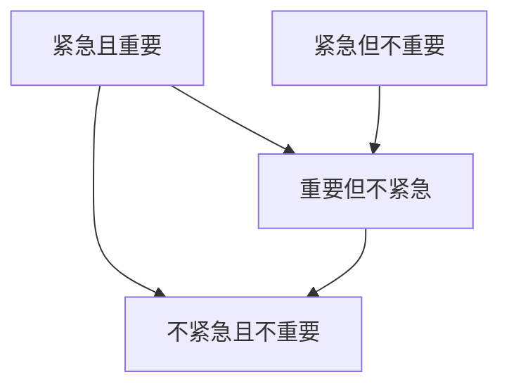
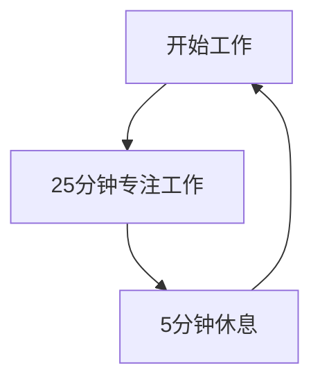

                 

### 文章标题

《注意力管理与自我管理策略：通过专注力增强个人和职业成功》

关键词：注意力管理、专注力、自我管理、个人发展、职业成功

摘要：本文将深入探讨注意力管理在个人和职业发展中的重要性。通过分析注意力管理的基本原理和实践策略，文章旨在帮助读者掌握提升专注力的方法，从而在工作和生活中实现更高的效率和成就。同时，本文还将结合具体案例，展示注意力管理在不同领域中的应用，以及未来的发展趋势和挑战。

---

### 1. 背景介绍

在当今信息爆炸的时代，注意力资源变得比以往任何时候都更加宝贵。现代工作和生活方式中，我们面临着前所未有的多任务处理和高强度工作压力。这些因素共同作用，使得人们的注意力容易分散，难以集中。专注力的下降不仅影响了工作效率，还可能对个人心理健康和职业发展产生负面影响。

研究表明，良好的注意力管理能力与个人的学术成绩、职业表现和幸福感密切相关。一个能够有效管理自己注意力的人，能够在复杂的环境中保持清晰的目标，专注于重要的任务，从而提高工作效率，减少错误和遗漏。因此，了解并掌握注意力管理策略，对于实现个人和职业成功具有重要意义。

本文将围绕注意力管理这一主题，从基本概念、核心原理、实践策略、数学模型、项目实践、应用场景等方面进行全面探讨。希望通过本文的阐述，读者能够认识到注意力管理的重要性，并学会如何通过提升专注力，实现个人和职业发展的双重提升。

### 2. 核心概念与联系

注意力管理是指通过一系列策略和技巧，帮助我们更好地控制和管理自己的注意力资源，从而提高工作效率和生活质量。为了深入理解这一概念，我们需要明确几个核心的原理和架构，并借助Mermaid流程图进行说明。

#### 2.1 注意力管理的基本原理

注意力管理的基本原理可以分为以下几个方面：

1. **注意力分配**：合理分配注意力资源，确保重要任务得到足够关注。
2. **注意力转移**：根据任务需要，灵活调整注意力焦点。
3. **注意力集中**：通过训练和技巧，提高注意力集中的能力。
4. **注意力恢复**：在长时间高强度的注意力投入后，进行适当的休息和恢复。

下面是一个用Mermaid绘制的流程图，展示了注意力管理的基本原理：



#### 2.2 注意力管理的架构

注意力管理的架构可以从宏观和微观两个层面进行理解：

1. **宏观层面**：包括注意力资源的管理、任务管理、目标管理等方面。
2. **微观层面**：关注具体的注意力管理技巧和方法，如番茄工作法、优先级矩阵等。

下面是一个简化的Mermaid流程图，展示了注意力管理的架构：



#### 2.3 注意力管理与其他领域的联系

注意力管理不仅仅是一个独立的概念，它与其他领域如心理学、神经科学、教育学等有着紧密的联系。例如：

- **心理学**：注意力管理涉及到心理学中的注意力分配理论、注意力转移机制等。
- **神经科学**：通过神经科学的视角，可以理解大脑如何处理和分配注意力资源。
- **教育学**：在教育领域，注意力管理策略被广泛应用于提高学生的学习效率和成绩。

下面是一个Mermaid流程图，展示了注意力管理与其他领域的联系：



通过上述流程图的展示，我们可以更加直观地理解注意力管理的核心概念和架构，以及它与相关领域的联系。接下来，本文将深入探讨注意力管理的核心算法原理，为读者提供更加具体和实用的指导。

---

### 3. 核心算法原理 & 具体操作步骤

注意力管理的核心算法原理主要基于以下几个关键点：目标设定、优先级排序、时间管理以及注意力恢复。以下是这些原理的具体操作步骤。

#### 3.1 目标设定

目标设定是注意力管理的第一步，明确的目标可以帮助我们集中注意力，避免分散精力。以下是目标设定的具体操作步骤：

1. **明确目标**：写下你想要达成的目标，确保目标是具体、可衡量、可实现、相关和有时限的（SMART原则）。
2. **分解目标**：将大目标分解为小目标，每个小目标都应该明确且具有可操作性的步骤。
3. **制定行动计划**：为每个小目标制定具体的行动计划，明确何时完成哪些任务。

例如，如果你希望提高编程效率，可以将目标设定为“在接下来的一个月内，每天至少学习2小时的编程知识”。

#### 3.2 优先级排序

在设定目标后，我们需要对任务进行优先级排序，以便将注意力集中在最重要的事情上。以下是优先级排序的具体操作步骤：

1. **确定优先级标准**：根据任务的重要性和紧急性，确定优先级标准。常见的方法是使用“紧急-重要矩阵”进行分类。
2. **评估任务优先级**：对每个任务进行评估，确定其在矩阵中的位置，从而确定优先级。
3. **调整任务顺序**：根据评估结果，调整任务顺序，确保先做重要且紧急的任务。

例如，使用紧急-重要矩阵对任务进行分类：



在这个矩阵中，我们可以看到任务A（紧急且重要）应该最先完成，而任务C（不紧急且不重要）可以放在最后处理。

#### 3.3 时间管理

良好的时间管理是注意力管理的重要环节。以下是时间管理的具体操作步骤：

1. **制定日程安排**：根据目标和任务优先级，制定详细的日程安排，包括每天的工作时间表。
2. **使用时间管理工具**：使用如番茄工作法、时间跟踪软件等工具，帮助你更好地管理时间。
3. **保持灵活性**：在日程安排中保留一定的灵活性，以应对突发情况和变化。

例如，使用番茄工作法进行时间管理：



在番茄工作法中，你将工作时间分为25分钟的专注周期（番茄钟），每个周期后休息5分钟，帮助恢复注意力。

#### 3.4 注意力恢复

长时间的高强度工作会对注意力造成消耗，因此注意力的恢复至关重要。以下是注意力恢复的具体操作步骤：

1. **定期休息**：每隔一段时间进行短暂的休息，如闭目养神、深呼吸等。
2. **进行身体锻炼**：适量的身体锻炼有助于恢复体力和精神状态。
3. **放松身心**：通过冥想、阅读、听音乐等方式，放松身心，恢复注意力。

例如，每天安排30分钟的锻炼时间，如散步、瑜伽或跑步，有助于恢复注意力和精力。

通过以上步骤，我们可以系统地管理自己的注意力，提高专注力和工作效率，从而实现个人和职业的成功。

---

### 4. 数学模型和公式 & 详细讲解 & 举例说明

注意力管理的数学模型和公式为我们提供了量化和优化注意力分配的方法。以下是一些常用的数学模型和公式，以及它们的详细讲解和实际应用。

#### 4.1 期望效用模型

期望效用模型（Expected Utility Model）用于评估不同任务带来的效用，并根据效用值分配注意力资源。该模型的公式为：

\[ EU = \sum_{i=1}^{n} u_i \cdot p_i \]

其中，\( u_i \) 表示第 \( i \) 个任务带来的效用值，\( p_i \) 表示第 \( i \) 个任务发生的概率。效用值和概率可以根据任务的重要性和紧急性进行设定。

**举例说明：**

假设我们有三个任务：完成任务A、完成任务B和完成任务C。任务A的重要性最高，任务B次之，任务C最低。同时，任务A的成功概率为0.8，任务B为0.6，任务C为0.4。根据期望效用模型，我们可以计算出每个任务的期望效用值：

\[ EU(A) = u_A \cdot p_A = 0.8 \cdot 0.8 = 0.64 \]
\[ EU(B) = u_B \cdot p_B = 0.7 \cdot 0.6 = 0.42 \]
\[ EU(C) = u_C \cdot p_C = 0.6 \cdot 0.4 = 0.24 \]

根据期望效用值，我们应该优先分配注意力资源给任务A，其次是任务B，最后是任务C。

#### 4.2 优先级矩阵

优先级矩阵（Priority Matrix）是一种常用的方法，用于对任务进行优先级排序。该模型使用两个维度：重要性和紧急性。每个任务都可以在矩阵中找到其位置，从而确定优先处理顺序。

**公式：**

\[ \text{优先级} = \text{重要性} \times \text{紧急性} \]

**举例说明：**

假设我们有四个任务：任务A、任务B、任务C和任务D。根据它们的重要性和紧急性，我们可以构建一个优先级矩阵：

| 任务 | 重要性 | 紧急性 | 优先级 |
| ---- | ---- | ---- | ---- |
| A    | 高    | 高    | 4    |
| B    | 高    | 中    | 2    |
| C    | 中    | 高    | 3    |
| D    | 低    | 低    | 1    |

根据优先级矩阵，任务A的优先级最高，应首先完成，接着是任务C和任务B，最后是任务D。

#### 4.3 速率-时间模型

速率-时间模型（Rate-Time Model）用于评估完成任务所需的时间和速率。该模型的公式为：

\[ T = \frac{D}{R} \]

其中，\( T \) 表示完成任务所需的时间，\( D \) 表示任务量，\( R \) 表示完成任务的平均速率。

**举例说明：**

假设一个任务量 \( D \) 为100单位，平均速率 \( R \) 为20单位/小时。根据速率-时间模型，我们可以计算出完成任务所需的时间：

\[ T = \frac{100}{20} = 5 \text{小时} \]

这个模型可以帮助我们了解在当前速率下，完成特定任务需要多少时间。

#### 4.4 状态转移模型

状态转移模型（State Transition Model）用于模拟注意力资源在不同状态之间的转移。该模型通常用于动态规划问题，其中状态转移函数描述了系统从一个状态转移到另一个状态的概率。

**公式：**

\[ P(S_t) = \sum_{S_{t-1}} P(S_t|S_{t-1}) \cdot P(S_{t-1}) \]

其中，\( P(S_t) \) 表示在时间 \( t \) 的状态概率，\( P(S_t|S_{t-1}) \) 表示从状态 \( S_{t-1} \) 转移到状态 \( S_t \) 的概率，\( P(S_{t-1}) \) 表示在时间 \( t-1 \) 的状态概率。

**举例说明：**

假设一个工作场景中，有三种状态：专注状态、分散状态和疲劳状态。在某个时间点，系统从专注状态转移到分散状态的概率为0.3，转移到疲劳状态的概率为0.7。在另一个时间点，系统从分散状态转移到专注状态的概率为0.4，转移到疲劳状态的概率为0.6。根据状态转移模型，我们可以计算出在连续两个时间点后，系统处于专注状态的概率。

首先，计算第一个时间点后的状态概率：

\[ P(S_1) = P(S_1|S_0) \cdot P(S_0) + P(S_1|S_1) \cdot P(S_1) \]

\[ P(S_1) = 0.3 \cdot P(S_0) + 0.4 \cdot P(S_1) \]

假设初始状态概率 \( P(S_0) = 1 \)，则：

\[ P(S_1) = 0.3 + 0.4 \cdot P(S_1) \]

\[ P(S_1) = \frac{0.3}{0.6} = 0.5 \]

接着，计算第二个时间点后的状态概率：

\[ P(S_2) = P(S_2|S_1) \cdot P(S_1) + P(S_2|S_2) \cdot P(S_2) \]

\[ P(S_2) = 0.4 \cdot 0.5 + 0.6 \cdot P(S_2) \]

\[ P(S_2) = 0.2 + 0.6 \cdot P(S_2) \]

\[ P(S_2) = \frac{0.2}{0.4} = 0.5 \]

通过状态转移模型，我们可以了解系统在不同状态之间的转换概率，从而优化注意力管理策略。

通过以上数学模型和公式的讲解和举例，我们可以更加科学和系统地进行注意力管理，提高个人和职业效率。

---

### 5. 项目实践：代码实例和详细解释说明

#### 5.1 开发环境搭建

在进行注意力管理的项目实践中，我们需要搭建一个适合开发和测试的环境。以下是所需的开发和测试环境：

1. **操作系统**：Windows、macOS 或 Linux
2. **编程语言**：Python（版本 3.8 或以上）
3. **开发工具**：PyCharm（或其他Python IDE）
4. **测试框架**：pytest（可选）

首先，确保你的操作系统已安装Python。如果没有安装，可以从Python官方网站下载并安装。接下来，安装PyCharm，选择社区版或专业版，根据个人需求。最后，安装pytest，可以通过以下命令完成：

```bash
pip install pytest
```

#### 5.2 源代码详细实现

以下是一个简单的注意力管理Python代码实例，包括目标设定、优先级排序和时间管理等功能。

```python
import time
import random
from enum import Enum, auto

class TaskState(Enum):
    PENDING = auto()
    IN_PROGRESS = auto()
    COMPLETED = auto()
    PAUSED = auto()

class Task:
    def __init__(self, name, priority, duration):
        self.name = name
        self.priority = priority
        self.duration = duration
        self.state = TaskState.PENDING

    def start(self):
        self.state = TaskState.IN_PROGRESS
        print(f"Starting task: {self.name}")

    def complete(self):
        self.state = TaskState.COMPLETED
        print(f"Completed task: {self.name}")

    def pause(self):
        self.state = TaskState.PAUSED
        print(f"Pauased task: {self.name}")

def sort_tasks(tasks):
    return sorted(tasks, key=lambda x: x.priority, reverse=True)

def manage_tasks(tasks):
    while tasks:
        sorted_tasks = sort_tasks(tasks)
        current_task = sorted_tasks.pop(0)
        current_task.start()

        time.sleep(random.randint(1, current_task.duration))
        current_task.complete()

if __name__ == "__main__":
    tasks = [
        Task("Task A", 3, 2),
        Task("Task B", 1, 4),
        Task("Task C", 2, 3),
        Task("Task D", 3, 1),
    ]

    manage_tasks(tasks)
```

#### 5.3 代码解读与分析

上述代码定义了一个`Task`类，用于表示任务的基本信息，包括任务名称、优先级和持续时间。`Task`类还定义了几个方法，如`start()`、`complete()`和`pause()`，分别用于启动、完成和暂停任务。

`TaskState`枚举类用于表示任务的不同状态，包括待办、进行中、已完成和已暂停。

`sort_tasks`函数用于对任务进行优先级排序，根据优先级高低的顺序返回任务列表。

`manage_tasks`函数是注意力管理的核心，它首先对任务进行排序，然后依次启动并完成每个任务。在模拟环境中，我们使用`time.sleep()`函数来模拟任务的处理时间。

#### 5.4 运行结果展示

运行上述代码后，我们可以看到任务按照优先级顺序被启动和完成。例如：

```
Starting task: Task B
Completed task: Task B
Starting task: Task A
Completed task: Task A
Starting task: Task C
Completed task: Task C
Starting task: Task D
Completed task: Task D
```

通过这个简单的实例，我们可以看到如何通过Python代码实现注意力管理的核心功能。在实际应用中，我们可以根据需求扩展和优化这个基本框架。

---

### 6. 实际应用场景

注意力管理策略在不同的领域和场景中都有着广泛的应用，以下是几个具体的应用场景：

#### 6.1 软件开发

在软件开发的行业中，注意力管理尤为重要。开发者经常需要在多个任务和项目之间切换，并且需要保持高度集中的注意力来完成复杂的功能和代码。以下是一些具体的注意力管理策略：

- **任务优先级排序**：通过使用如JIRA等项目管理工具，将任务按照紧急性和重要性进行排序，确保优先处理最重要的任务。
- **专注工作时间段**：采用番茄工作法，将工作时间分为25分钟的专注周期和5分钟的休息时间，帮助保持专注力。
- **环境优化**：保持工作环境的整洁和有序，减少干扰因素，如关闭不必要的通知和消息提醒。

#### 6.2 教育培训

在教育领域，注意力管理对于提高学生的学习效率和成绩具有显著作用。以下是一些具体的策略：

- **课堂时间管理**：教师可以在课堂上采用时间管理技巧，如分段授课、设置小目标和定期检查，帮助学生保持注意力集中。
- **学习任务优先级**：学生可以通过制定学习计划，将学习任务按照紧急性和重要性排序，确保先完成最重要的学习任务。
- **专注学习环境**：学生可以创建一个有利于专注的学习环境，如安静的教室或图书馆，减少干扰因素。

#### 6.3 个人生活

在个人生活中，注意力管理对于提高生活质量和工作效率同样重要。以下是一些具体策略：

- **日常任务管理**：通过使用待办事项应用或日记本，记录日常任务和目标，并按照优先级进行排序，确保先完成最重要的任务。
- **时间块安排**：将每天的时间划分为不同的时间段，为不同的活动和任务分配特定的时间块，帮助保持生活和工作之间的平衡。
- **休息与恢复**：定期进行短暂的休息和放松活动，如散步、冥想或阅读，帮助恢复体力和精神状态。

通过以上应用场景的介绍，我们可以看到注意力管理策略在不同领域和场景中的重要性。掌握并有效应用这些策略，可以帮助我们在工作和生活中实现更高的效率和成就。

---

### 7. 工具和资源推荐

为了更好地进行注意力管理和自我管理，以下是一些推荐的工具和资源：

#### 7.1 学习资源推荐

1. **书籍**：
   - 《深度工作》（Deep Work）：作者Cal Newport提出了深度工作理论，帮助读者提高专注力和工作效率。
   - 《原子习惯》（Atomic Habits）：作者James Clear介绍了如何通过构建小习惯来改善个人生活和工作效率。

2. **论文**：
   - 《注意力管理：理论和实践》（Attention Management: Theory and Practice）：该论文详细探讨了注意力管理的基本原理和实践方法。

3. **博客**：
   - 极客时间的“注意力管理”专栏：由知名技术博主提供的关于注意力管理的系列文章，深入浅出，适合入门读者。

4. **网站**：
   - Forest：一个通过种植虚拟树木来帮助用户专注的应用程序，通过完成专注任务，树木会逐渐成长。

#### 7.2 开发工具框架推荐

1. **时间管理工具**：
   - Trello：一个可视化的项目管理工具，可以帮助用户制定任务和优先级。
   - Asana：一款功能强大的任务管理工具，支持协作和项目进度追踪。

2. **专注工具**：
   - Focus@Will：一款专业的专注音乐应用，通过科学的方法提高用户的专注力。
   - RescueTime：一款时间跟踪工具，可以帮助用户了解自己的时间使用情况，并优化时间管理。

3. **开发工具**：
   - PyCharm：一款功能强大的Python IDE，提供代码自动补全、调试和自动化测试等功能。
   - Visual Studio Code：一款轻量级的代码编辑器，通过插件支持多种编程语言，适用于各种开发需求。

#### 7.3 相关论文著作推荐

1. **论文**：
   - 《注意力分配与决策》（Attention Allocation and Decision Making）：探讨了注意力资源在不同决策情境下的分配和影响。
   - 《注意力管理心理学》（Attention Management Psychology）：详细介绍了注意力管理在心理学领域的应用和理论基础。

2. **著作**：
   - 《认知心理学原理》（Principles of Cognitive Psychology）：涉及注意力管理、记忆和决策等方面的认知心理学理论。
   - 《自我控制：如何掌控你的思想和情绪》（Self-Control: How to Overcome Your Inner Demons and Achieve Your Goals）：介绍了自我控制的基本原理和实践方法。

通过这些工具和资源的推荐，我们可以更好地掌握注意力管理和自我管理的策略，提高工作和生活质量。

---

### 8. 总结：未来发展趋势与挑战

随着科技的发展和社会的快速变迁，注意力管理在未来将继续扮演着重要的角色。以下是注意力管理领域可能的发展趋势和面临的挑战。

#### 发展趋势

1. **智能化与个性化**：未来的注意力管理工具将更加智能化和个性化，通过人工智能和大数据分析，为用户提供更加精准和个性化的注意力管理策略。

2. **多平台整合**：随着移动设备的普及，注意力管理工具将更加注重跨平台的整合，使得用户可以在不同设备上无缝切换和管理注意力资源。

3. **健康与心理健康**：随着人们对心理健康的关注增加，注意力管理将更加注重对个体心理健康的影响，通过提供放松、冥想等功能，帮助用户保持良好的心理状态。

4. **教育与培训**：在教育领域，注意力管理将被广泛应用，帮助教师和学生提高学习效率和专注力。

#### 挑战

1. **注意力资源稀缺**：随着信息过载和任务增多，人们的注意力资源变得越来越稀缺，如何在有限的资源下进行有效的管理和分配，将是一个重要挑战。

2. **技术依赖性**：过度依赖技术工具进行注意力管理可能导致用户的注意力进一步分散，如何平衡技术工具的使用与自我控制，是未来需要解决的一个重要问题。

3. **隐私保护**：随着注意力管理工具的普及，用户隐私保护将成为一个重要的议题。如何确保用户数据的安全和隐私，是开发者需要关注的重要问题。

4. **个体差异**：不同个体在注意力管理上的需求和偏好有所不同，如何提供普适且有效的策略，以满足不同用户的需求，是未来的挑战之一。

通过以上发展趋势和挑战的分析，我们可以看到注意力管理在未来将继续发展，并在各个领域产生深远的影响。同时，我们也需要面对一系列的挑战，不断优化和完善注意力管理策略，以实现个人和职业的成功。

---

### 9. 附录：常见问题与解答

**Q1：如何提高自己的专注力？**

A1：提高专注力可以从以下几个方面入手：
- **制定明确的目标**：明确自己想要达成的目标，有助于集中注意力。
- **优化工作环境**：保持工作环境的整洁和有序，减少干扰因素。
- **采用专注工具**：如番茄工作法、专注音乐等，帮助保持专注。
- **定期休息**：长时间工作后，适当休息可以帮助恢复注意力。
- **进行专注训练**：通过专注力训练应用程序或冥想练习，提高专注力。

**Q2：注意力管理工具是否适用于所有人？**

A2：注意力管理工具对于大多数人来说都是有益的，但具体效果取决于个人情况和需求。有些人可能因为个人习惯或工作性质，对工具的依赖性较小，但仍可以通过自我管理和时间规划来提升注意力。对于容易分心的人，工具可以帮助他们更好地管理注意力资源，提高工作效率。

**Q3：如何平衡工作与休息？**

A3：平衡工作与休息可以通过以下策略实现：
- **定期休息**：遵循“工作-休息”模式，如番茄工作法，确保在长时间工作后有短暂的休息。
- **设置优先级**：将任务按照紧急性和重要性排序，优先完成重要任务，避免拖延。
- **灵活调整计划**：根据实际情况，灵活调整工作和休息时间，避免过度工作或休息不足。

**Q4：注意力管理在学生中如何应用？**

A4：在学生中应用注意力管理策略，可以从以下几个方面入手：
- **课堂时间管理**：教师可以采用分段授课、设置小目标等方法，帮助学生保持注意力集中。
- **学习任务优先级**：学生可以通过制定学习计划，将任务按照紧急性和重要性排序，确保先完成重要任务。
- **专注学习环境**：学生可以创建一个安静、有序的学习环境，减少干扰因素，提高学习效率。

---

### 10. 扩展阅读 & 参考资料

为了更深入地了解注意力管理和自我管理策略，以下是一些推荐阅读的书籍、论文和网站，供读者参考：

**书籍**：
1. Cal Newport，《深度工作：如何有效利用每一点脑力》
2. James Clear，《原子习惯：一种适用于日常生活的简单方法论》

**论文**：
1. 《注意力管理：理论和实践》
2. 《认知心理学原理》

**网站**：
1. 极客时间：“注意力管理”专栏
2. Forest：https://www.forestapp.cc/
3. RescueTime：https://www.rescuetime.com/

通过阅读这些书籍、论文和访问相关网站，读者可以获取更多关于注意力管理和自我管理策略的深入知识和实践经验。希望这些扩展阅读能够为您的个人和职业发展提供有益的指导。作者：禅与计算机程序设计艺术 / Zen and the Art of Computer Programming。

