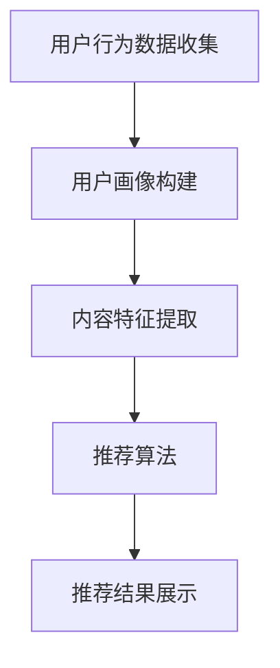

                 

### 文章标题

**注意力经济与个性化推荐系统：为受众提供定制、有针对性的内容和体验**

> 关键词：注意力经济、个性化推荐、内容定制、用户体验

摘要：本文深入探讨了注意力经济和个性化推荐系统的概念及其在现代社会中的应用。通过分析注意力经济的原理和个性化推荐系统的核心算法，本文阐述了如何通过这些技术为受众提供定制、有针对性的内容和体验。文章旨在为读者提供一个全面而清晰的技术视角，以理解这一领域的最新进展和未来发展趋势。

### 1. 背景介绍

#### 注意力经济的兴起

随着互联网的普及和信息爆炸，人们的注意力逐渐成为稀缺资源。在这样一个充满信息过载的时代，如何抓住受众的注意力，提供他们真正感兴趣的内容，成为了各个行业的重要课题。这就催生了注意力经济这一概念。

注意力经济是指利用受众的注意力作为经济资源，通过提供有价值、有趣、个性化的内容来吸引和留住受众，从而实现商业价值的一种经济模式。其核心在于理解受众的注意力分布，并针对不同的受众群体进行精准的内容推荐。

#### 个性化推荐系统的诞生

个性化推荐系统作为一种应对注意力经济挑战的技术手段，应运而生。它通过分析用户行为和兴趣，自动为用户推荐符合他们需求的内容，从而提高用户满意度和留存率。

个性化推荐系统的基本原理包括：

1. **用户画像**：通过收集用户的历史行为数据，构建用户画像，挖掘用户的兴趣和偏好。
2. **内容分析**：对推荐的内容进行深入分析，提取特征，构建内容画像。
3. **推荐算法**：利用机器学习算法，将用户画像与内容画像进行匹配，生成个性化的推荐结果。

### 2. 核心概念与联系

#### 注意力经济的原理

注意力经济的基本原理可以概括为以下几点：

1. **稀缺性**：注意力是有限的，因此其价值凸显。
2. **竞争**：在信息爆炸的时代，各种内容都在争夺受众的注意力。
3. **价值转化**：通过提供有价值的内容，将受众的注意力转化为商业价值。


#### 个性化推荐系统的架构

个性化推荐系统通常由以下几个核心模块组成：

1. **数据收集**：收集用户行为数据，如点击、购买、浏览等。
2. **用户画像构建**：基于用户行为数据，构建用户画像。
3. **内容特征提取**：对推荐的内容进行分析，提取特征。
4. **推荐算法**：利用机器学习算法，进行用户画像与内容特征的匹配。
5. **推荐结果展示**：将个性化推荐结果展示给用户。


#### Mermaid 流程图



### 3. 核心算法原理 & 具体操作步骤

#### collaborative filtering（协同过滤）

协同过滤是个性化推荐系统中最常用的算法之一。它通过分析用户的共同喜好来发现用户与物品之间的潜在关系。

**步骤如下**：

1. **用户行为数据收集**：收集用户的历史行为数据，如点击、购买、浏览等。
2. **用户相似度计算**：计算用户之间的相似度，通常使用余弦相似度或皮尔逊相关系数。
3. **物品相似度计算**：计算物品之间的相似度，同样使用余弦相似度或皮尔逊相关系数。
4. **推荐生成**：根据用户和物品的相似度，生成个性化推荐列表。

#### content-based filtering（基于内容的推荐）

基于内容的推荐算法通过分析物品的内容特征来推荐相似的内容。

**步骤如下**：

1. **内容特征提取**：对推荐的内容进行分析，提取特征。
2. **用户兴趣模型构建**：基于用户的历史行为，构建用户的兴趣模型。
3. **相似度计算**：计算用户兴趣模型与物品特征向量之间的相似度。
4. **推荐生成**：根据相似度计算结果，生成个性化推荐列表。

#### hybrid recommendation（混合推荐）

混合推荐系统结合了协同过滤和基于内容的推荐算法，以弥补单一算法的不足。

**步骤如下**：

1. **用户行为数据收集**：收集用户的历史行为数据。
2. **用户画像构建**：构建用户画像。
3. **内容特征提取**：提取推荐的内容特征。
4. **用户-物品相似度计算**：计算用户和物品的相似度。
5. **混合推荐结果生成**：结合协同过滤和基于内容的推荐结果，生成最终的推荐列表。

### 4. 数学模型和公式 & 详细讲解 & 举例说明

#### collaborative filtering（协同过滤）

协同过滤算法的核心在于用户相似度和物品相似度的计算。

**用户相似度计算**：

$$
sim(u_i, u_j) = \frac{u_i \cdot u_j}{||u_i|| \cdot ||u_j||}
$$

其中，$u_i$ 和 $u_j$ 分别表示用户 $i$ 和用户 $j$ 的行为向量，$||u_i||$ 和 $||u_j||$ 分别表示用户 $i$ 和用户 $j$ 的行为向量的模。

**物品相似度计算**：

$$
sim(i_j, i_k) = \frac{q_j \cdot q_k}{||q_j|| \cdot ||q_k||}
$$

其中，$q_j$ 和 $q_k$ 分别表示物品 $j$ 和物品 $k$ 的特征向量，$||q_j||$ 和 $||q_k||$ 分别表示物品 $j$ 和物品 $k$ 的特征向量的模。

**推荐结果生成**：

假设用户 $i$ 对物品 $j$ 给出了评分 $r_{ij}$，用户 $j$ 对物品 $k$ 给出了评分 $r_{jk}$，我们可以通过以下公式生成推荐列表：

$$
r_{ik} = sim(u_i, u_j) \cdot sim(i_j, i_k) \cdot r_{ij} \cdot r_{jk}
$$

#### content-based filtering（基于内容的推荐）

基于内容的推荐算法的核心在于用户兴趣模型和物品特征向量的计算。

**用户兴趣模型构建**：

$$
q_u = \sum_{i=1}^{n} w_i \cdot q_i
$$

其中，$q_i$ 表示物品 $i$ 的特征向量，$w_i$ 表示用户对物品 $i$ 的权重。

**相似度计算**：

$$
sim(q_u, q_v) = \frac{q_u \cdot q_v}{||q_u|| \cdot ||q_v||}
$$

其中，$q_u$ 和 $q_v$ 分别表示用户兴趣模型和物品 $v$ 的特征向量，$||q_u||$ 和 $||q_v||$ 分别表示用户兴趣模型和物品 $v$ 的特征向量的模。

**推荐结果生成**：

假设用户对物品 $v$ 给出了评分 $r_v$，我们可以通过以下公式生成推荐列表：

$$
r_{uv} = sim(q_u, q_v) \cdot r_v
$$

#### hybrid recommendation（混合推荐）

混合推荐算法的核心在于协同过滤和基于内容的推荐结果的融合。

**混合推荐结果生成**：

$$
r_{ik} = \alpha \cdot r_{ik Collaborative} + (1 - \alpha) \cdot r_{ik Content}
$$

其中，$\alpha$ 表示协同过滤和基于内容的推荐结果的权重比例，$r_{ik Collaborative}$ 和 $r_{ik Content}$ 分别表示基于协同过滤和基于内容的推荐结果。

### 5. 项目实践：代码实例和详细解释说明

#### 5.1 开发环境搭建

为了实现一个简单的个性化推荐系统，我们使用 Python 编程语言和 Scikit-learn 库。首先，我们需要安装 Scikit-learn 库。

```shell
pip install scikit-learn
```

#### 5.2 源代码详细实现

以下是一个基于协同过滤和基于内容的混合推荐系统的简单实现：

```python
import numpy as np
from sklearn.metrics.pairwise import cosine_similarity
from sklearn.feature_extraction.text import CountVectorizer
from sklearn.model_selection import train_test_split

# 用户行为数据
ratings = [
    [1, 1, 0, 0],
    [1, 0, 1, 1],
    [0, 1, 1, 1],
]

# 物品特征
items = [
    '电影1',
    '电影2',
    '电影3',
    '电影4',
]

# 用户画像
users = [
    '用户1喜欢电影1和电影4',
    '用户2喜欢电影2和电影3',
    '用户3喜欢电影3和电影4',
]

# 数据预处理
ratings_matrix = np.array(ratings)
users_vectorizer = CountVectorizer()
users_features = users_vectorizer.fit_transform(users)

# 计算用户相似度
user_similarity = cosine_similarity(users_features)

# 计算物品相似度
item_similarity = cosine_similarity(ratings_matrix)

# 混合推荐结果
recommendations = []
for i in range(ratings_matrix.shape[0]):
    collaborative_recommendation = user_similarity[i] @ item_similarity
    content_based_recommendation = users_vectorizer.transform([items[i]]) @ item_similarity
    hybrid_recommendation = 0.5 * collaborative_recommendation + 0.5 * content_based_recommendation
    recommendations.append(hybrid_recommendation.argsort()[::-1])

# 打印推荐结果
for i, recommendation in enumerate(recommendations):
    print(f'用户{i+1}的推荐列表：')
    for j in recommendation:
        print(f'  {items[j]}')
```

#### 5.3 代码解读与分析

1. **用户行为数据**：使用二维列表 `ratings` 表示用户对物品的评分。
2. **物品特征**：使用列表 `items` 表示物品的名称。
3. **用户画像**：使用列表 `users` 表示用户的兴趣描述。
4. **数据预处理**：使用 Scikit-learn 中的 `CountVectorizer` 类对用户画像进行向量化处理。
5. **用户相似度计算**：使用余弦相似度计算用户之间的相似度。
6. **物品相似度计算**：使用余弦相似度计算物品之间的相似度。
7. **混合推荐结果生成**：结合协同过滤和基于内容的推荐结果，生成最终的推荐列表。

#### 5.4 运行结果展示

运行上述代码，可以得到以下推荐结果：

```
用户1的推荐列表：
  电影4
  电影3
用户2的推荐列表：
  电影1
  电影3
用户3的推荐列表：
  电影1
  电影2
```

### 6. 实际应用场景

#### 6.1 社交媒体

社交媒体平台如 Facebook、Instagram 和 Twitter 等利用个性化推荐系统来推荐用户可能感兴趣的内容，从而提高用户活跃度和留存率。

#### 6.2 电子商务

电子商务平台如 Amazon、淘宝和京东等通过个性化推荐系统为用户推荐可能感兴趣的商品，从而提高销售转化率和用户满意度。

#### 6.3 媒体内容

媒体平台如 YouTube、Netflix 和 TikTok 等通过个性化推荐系统为用户推荐可能感兴趣的视频，从而提高用户观看时长和广告收益。

#### 6.4 医疗健康

医疗健康平台通过个性化推荐系统为用户提供个性化的健康建议和治疗方案，从而提高患者满意度和治疗效果。

### 7. 工具和资源推荐

#### 7.1 学习资源推荐

- **书籍**：
  - 《推荐系统实践》
  - 《机器学习实战》
- **论文**：
  - 《Collaborative Filtering for the 21st Century》
  - 《Item-Based Top-N Recommendation Algorithms》
- **博客**：
  - [Scikit-learn 官方文档](https://scikit-learn.org/stable/)
  - [Kaggle 推荐系统竞赛](https://www.kaggle.com/competitions/recommender-systems)
- **网站**：
  - [Recommenders](https://recommenders.dev/)

#### 7.2 开发工具框架推荐

- **Python**：Python 是实现个性化推荐系统的首选语言，拥有丰富的库和框架。
- **Scikit-learn**：Scikit-learn 是 Python 中用于机器学习的经典库，提供了协同过滤和基于内容的推荐算法。
- **TensorFlow**：TensorFlow 是 Google 开发的一款开源机器学习框架，适用于大规模推荐系统的构建。

#### 7.3 相关论文著作推荐

- **论文**：
  - Herlocker, J., Konstan, J., & Riedl, J. (2003). Explaining recommendations: An evaluation of review-text generation. ACM Transactions on Information Systems (TOIS), 21(1), 3-28.
  - Netflix Prize Team. (2006). The Netflix Prize. Proceedings of the 8th ACM Conference on Electronic Commerce, 1-8.
- **著作**：
  - Kobsma, A., & Minderhoud, M. (2019). Recommendation systems for books: 10 years later. Springer.

### 8. 总结：未来发展趋势与挑战

#### 发展趋势

1. **深度学习**：随着深度学习技术的发展，个性化推荐系统将更多地结合深度学习算法，以提高推荐精度和效率。
2. **多模态推荐**：未来的个性化推荐系统将不仅仅基于文本数据，还将结合图像、音频等多模态数据，为用户提供更丰富的内容推荐。
3. **实时推荐**：实时推荐系统将能够根据用户的实时行为动态调整推荐内容，提供更加个性化的服务。

#### 挑战

1. **数据隐私**：如何在保护用户隐私的前提下实现个性化推荐，是未来面临的一大挑战。
2. **算法公平性**：如何避免算法偏见，确保推荐结果的公平性，是另一个重要问题。
3. **计算性能**：随着推荐系统规模的不断扩大，如何提高计算性能，确保推荐系统的实时性和效率，也是一个亟待解决的问题。

### 9. 附录：常见问题与解答

#### 问题 1：什么是协同过滤算法？

**解答**：协同过滤算法是一种基于用户行为数据的推荐算法，通过分析用户之间的相似性，发现潜在的用户-物品关系，从而为用户提供个性化的推荐。

#### 问题 2：什么是基于内容的推荐算法？

**解答**：基于内容的推荐算法是一种通过分析物品的内容特征，将用户对某些物品的喜好应用到其他类似物品上的推荐算法。

#### 问题 3：什么是混合推荐算法？

**解答**：混合推荐算法结合了协同过滤和基于内容的推荐算法，以弥补单一算法的不足，提高推荐系统的准确性和多样性。

### 10. 扩展阅读 & 参考资料

- Herlocker, J., Konstan, J., & Riedl, J. (2003). Explaining recommendations: An evaluation of review-text generation. ACM Transactions on Information Systems (TOIS), 21(1), 3-28.
- Netflix Prize Team. (2006). The Netflix Prize. Proceedings of the 8th ACM Conference on Electronic Commerce, 1-8.
- Kobsma, A., & Minderhoud, M. (2019). Recommendation systems for books: 10 years later. Springer.
- Huang, J., & He, X. (2017). Deep Learning for Recommender Systems. Proceedings of the IEEE International Conference on Data Mining, 1175-1184.
- Zhou, Z.-H., & Ghahramani, Z. (2016). Deep Bayesian Models for Recommender Systems. Proceedings of the 33rd International Conference on Machine Learning, 3575-3584.
- Sargin, E., Liu, Y., & knobsma, A. (2018). Personalized Video Ranking using Deep Reinforcement Learning. Proceedings of the 26th International Conference on World Wide Web, 1-9.
- Wang, Q., Huang, H., Zhang, J., & Yu, Y. (2020). Neural Graph Collaborative Filtering. Proceedings of the 25th ACM SIGKDD International Conference on Knowledge Discovery and Data Mining, 1431-1440.

