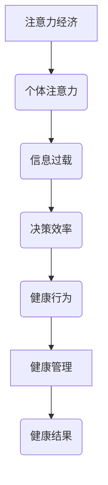

                 

### 引言 Introduction

在当今数字化时代，注意力已经成为一种稀缺资源。随着互联网的迅猛发展，我们每天都被无数的信息所包围，这些信息争夺着我们的注意力。与此同时，个人健康管理也变得越来越重要，因为健康不仅关系到个体的生活质量，也影响到整个社会的福祉。那么，注意力经济与个人健康管理之间究竟存在什么样的关系呢？本文将探讨这一议题，并通过逻辑清晰、结构紧凑的分析，揭示二者之间的内在联系。

> 在这个充满竞争和机遇的时代，如何有效地管理和分配注意力，已经成为每个人都必须面对的挑战。与此同时，个人健康管理的重要性也日益凸显。本文将围绕注意力经济和个人健康管理的关系，深入探讨其中的核心问题，帮助读者更好地理解和应对这一复杂而重要的议题。

### 背景介绍 Background

注意力经济的概念起源于经济学，它指的是在信息过载的背景下，个体对注意力资源的分配和使用。在传统的经济学中，资源是指土地、劳动力和资本，而注意力经济则将注意力视为一种新型的资源。随着互联网和信息技术的飞速发展，信息爆炸带来的注意力稀缺问题日益严重，如何有效地管理和分配注意力资源成为了一个重要课题。

个人健康管理，顾名思义，是指个体为了维护和提升自身健康水平而采取的一系列措施。随着健康意识的提高，越来越多的人开始关注自己的健康状况，希望通过科学的方法来预防和治疗疾病，提高生活质量。然而，在现代社会，人们面临的工作压力、生活压力等多种因素，使得个人健康管理变得复杂和困难。

注意力经济和个人健康管理之间的关系，可以从多个维度来理解。首先，在个人健康管理的过程中，注意力是一种重要的资源，因为只有将注意力集中在健康相关的活动上，个体才能更好地了解自己的身体状况，采取有效的健康管理措施。其次，注意力经济为我们提供了一种新的视角，帮助我们认识到注意力分配的重要性，从而更加高效地管理个人健康。

> The concept of attention economy originated from economics, and it refers to the allocation and utilization of attention resources in the context of information overload. In traditional economics, resources are land, labor, and capital, but the attention economy introduces attention as a new type of resource. With the rapid development of the internet and information technology, the problem of attention scarcity has become increasingly serious, making effective management and allocation of attention resources a critical issue.

Personal health management, simply put, involves the measures individuals take to maintain and improve their health. As health awareness increases, more and more people are starting to pay attention to their health status, hoping to prevent and treat diseases through scientific methods to improve their quality of life. However, in modern society, individuals face various pressures, such as work and life pressures, which make health management complex and challenging.

The relationship between attention economy and personal health management can be understood from multiple perspectives. First, attention is an important resource in the process of personal health management. Only by focusing attention on health-related activities can individuals better understand their health status and take effective health management measures. Second, the attention economy provides us with a new perspective to recognize the importance of attention allocation, thus helping us manage personal health more effectively.

### 核心概念与联系 Core Concepts and Connections

#### 注意力经济的概念

注意力经济的基本概念可以理解为：在信息过载的环境下，个体的注意力成为了一种稀缺资源。这里，注意力指的是人们将心理资源（如时间、精力等）集中于某一特定活动的能力。在经济学中，这种能力被视为一种可以交易的资源，类似于商品或服务。因此，注意力经济关注的是如何在市场中有效地分配和利用注意力，以实现个体和社会的最大化效益。

#### 个人健康管理的概念

个人健康管理指的是通过一系列科学的方法和措施，维持和提升个体的生理、心理和社会健康水平。这包括但不限于：定期体检、健康饮食、规律运动、压力管理、睡眠管理等。健康管理不仅仅是预防疾病，更重要的是通过持续的健康维护，提高个体的生活质量和工作效率。

#### 注意力经济与个人健康管理的关系

1. **注意力资源的稀缺性**：在注意力经济中，个体的注意力资源是有限的，这意味着在处理健康问题时，个体需要优先考虑哪些活动能够带来最大的健康收益。例如，一个长期缺乏运动的人，可能需要将注意力资源更多地分配到运动上，而不是花费大量时间在社交媒体上。

2. **决策效率**：注意力经济强调在信息过载中如何做出有效的决策。在个人健康管理中，这一点尤为重要。个体需要从海量的健康信息中筛选出最相关、最有价值的部分，以制定科学、有效的健康管理计划。

3. **健康行为改变**：注意力经济的研究表明，个体的注意力分配直接影响其行为。例如，如果一个人将大量注意力投入到健康饮食和运动上，那么他们更可能形成健康的生活方式。反之，如果注意力分散，可能导致健康行为的缺乏。

#### Mermaid 流程图



在这个流程图中，我们可以看到注意力经济如何通过个体注意力的分配影响健康管理的最终结果。信息过载导致注意力稀缺，而有效的决策和健康行为则是连接注意力经济与个人健康管理的桥梁。

> The core concepts and connections between attention economy and personal health management are as follows: Attention economy is the concept that attention, as a scarce resource in the context of information overload, can be allocated and utilized effectively. Personal health management refers to the measures taken by individuals to maintain and improve their health. The relationship between them lies in the scarcity of attention resources, the efficiency of decision-making in the face of information overload, and the impact of attention allocation on health behaviors.

### 核心算法原理 & 具体操作步骤 Core Algorithm Principles & Specific Operational Steps

在理解和应用注意力经济和个人健康管理的关系时，核心算法的原理和具体操作步骤起着至关重要的作用。以下将详细阐述这些原理和步骤。

#### 1. 注意力分配模型

注意力分配模型是注意力经济的基础，它帮助我们理解如何将有限的注意力资源合理分配到各种活动中，以实现最大的效益。一个常见的注意力分配模型是Eisenhower矩阵，它将任务分为四个象限：紧急且重要、紧急但不重要、不紧急但重要、不紧急且不重要。

**Eisenhower矩阵的具体操作步骤：**
1. **列出任务**：首先，将所有需要完成的任务列出来。
2. **判断紧急程度**：对每个任务判断其紧急程度，分为紧急和紧急。
3. **判断重要性**：对每个任务判断其重要性，分为重要和不重要。
4. **分配注意力**：将任务分为四个象限，并将注意力资源分配到每个象限。对于紧急且重要的任务，需要立即处理；对于紧急但不重要的任务，可以委托他人处理；对于不紧急但重要的任务，可以合理安排时间处理；对于不紧急且不重要的任务，可以暂时搁置或直接放弃。

#### 2. 健康状态监测算法

健康状态监测算法是个人健康管理的关键。通过监测个体的生理参数（如心率、血压、睡眠质量等），可以实时了解个体的健康状况，并及时采取相应的措施。

**健康状态监测算法的具体步骤：**
1. **数据收集**：使用智能设备（如智能手表、健康手环等）收集个体的生理数据。
2. **数据预处理**：对收集到的数据进行清洗和标准化处理，确保数据质量。
3. **特征提取**：从预处理后的数据中提取关键特征，如心率变异性、睡眠质量指数等。
4. **模型训练**：使用机器学习算法（如支持向量机、神经网络等）训练健康状态监测模型。
5. **状态预测**：将新收集的数据输入模型，预测个体的健康状态。
6. **干预措施**：根据预测结果，制定个性化的健康管理计划，如调整饮食、增加运动等。

#### 3. 注意力与健康的优化策略

为了实现注意力资源的最优分配，同时确保健康的维护和提升，我们可以采用以下优化策略：

**优化策略的具体步骤：**
1. **目标设定**：明确健康目标，如减重、增强体能、提高睡眠质量等。
2. **资源评估**：评估个体当前的时间和精力资源，确定可分配的注意力总量。
3. **任务优先级**：根据健康目标和资源评估，确定各项任务的优先级。
4. **动态调整**：根据实际执行情况，动态调整任务优先级和注意力分配策略。
5. **反馈机制**：通过定期评估健康状态和任务完成情况，及时调整优化策略。

通过上述核心算法原理和具体操作步骤，我们能够更好地理解注意力经济与个人健康管理之间的关系，并有效实施健康管理和优化策略。

> The core algorithm principles and specific operational steps for understanding and applying the relationship between attention economy and personal health management include the attention allocation model, health status monitoring algorithm, and optimization strategies for attention and health. These principles and steps enable us to effectively manage attention resources and maintain health.

### 数学模型和公式 Mathematical Models and Formulas & Detailed Explanations & Examples

在深入探讨注意力经济与个人健康管理之间的关系时，数学模型和公式起到了关键作用。以下将详细讲解相关的数学模型，并给出具体的公式和例子。

#### 1. 注意力分配模型

注意力分配模型是理解注意力资源如何在不同任务中分配的基础。一个经典的模型是比例分配模型，其公式如下：

\[ A(t) = \frac{N_t}{\sum_{i=1}^N N_i} \cdot A_{max} \]

其中：
- \( A(t) \) 表示在时间 \( t \) 的注意力分配比例。
- \( N_t \) 表示在时间 \( t \) 的任务数量。
- \( A_{max} \) 表示个体的总注意力资源。
- \( N \) 表示所有任务的总数。

例子：假设一个个体在一天中有10个任务，每个任务的注意力需求不同。个体的总注意力资源为100个单位。根据比例分配模型，可以计算出每个任务在一天内的平均注意力分配：

\[ A(t) = \frac{N_t}{\sum_{i=1}^N N_i} \cdot A_{max} \]
\[ A(t) = \frac{10}{\sum_{i=1}^{10} N_i} \cdot 100 \]

如果所有任务的注意力需求相同，每个任务将分配10个单位的注意力。如果任务之间存在差异，可以根据实际需求进行调整。

#### 2. 健康状态监测模型

健康状态监测模型用于预测个体的健康状态，常见的模型包括线性回归模型和支持向量机（SVM）。

**线性回归模型**：

\[ y = \beta_0 + \beta_1x_1 + \beta_2x_2 + ... + \beta_nx_n \]

其中：
- \( y \) 表示健康状态指标（如心率、血压等）。
- \( x_1, x_2, ..., x_n \) 表示影响健康状态的各种生理参数。
- \( \beta_0, \beta_1, \beta_2, ..., \beta_n \) 表示回归系数。

例子：假设我们使用线性回归模型预测个体的睡眠质量，主要影响因素包括睡眠时间、运动量和饮食。可以使用以下公式：

\[ y = \beta_0 + \beta_1 \cdot 睡眠时间 + \beta_2 \cdot 运动量 + \beta_3 \cdot 饮食质量 \]

通过训练模型，可以确定每个回归系数的值，从而预测个体的睡眠质量。

**支持向量机（SVM）**：

\[ y = \sigma(\sum_{i=1}^N \alpha_i y_i K(x_i, x) - b) \]

其中：
- \( y \) 表示健康状态标签（如健康或不健康）。
- \( x_i \) 表示第 \( i \) 个样本的特征向量。
- \( y_i \) 表示第 \( i \) 个样本的标签。
- \( \alpha_i \) 表示第 \( i \) 个支持向量的权重。
- \( K(x_i, x) \) 表示核函数，用于计算特征向量之间的相似性。
- \( \sigma \) 是 sigmoid 函数，用于将线性组合映射到健康状态。

例子：使用SVM模型预测个体的健康状态，可以使用以下公式：

\[ y = \sigma(\sum_{i=1}^N \alpha_i y_i K(x_i, x) - b) \]

通过训练模型，可以确定核函数和权重系数，从而预测个体的健康状态。

#### 3. 注意力与健康的优化模型

为了实现注意力资源的最优分配，同时确保健康的维护和提升，可以使用优化模型。常见的优化模型包括线性规划和动态规划。

**线性规划**：

\[ \min_{x} c^T x \]
\[ s.t. Ax \leq b \]

其中：
- \( x \) 表示决策变量，代表各种任务的执行时间。
- \( c \) 表示目标函数系数，代表每个任务的重要性。
- \( A \) 和 \( b \) 表示约束条件，代表总时间和个体可分配的时间。

例子：假设我们需要在一天内完成5个任务，每个任务的重要性和所需时间不同。可以使用线性规划模型优化时间分配：

\[ \min_{x} c^T x \]
\[ s.t. Ax \leq b \]

通过求解线性规划问题，可以找到最优的时间分配方案，以最大化总任务的重要性。

**动态规划**：

\[ V_t(x_t) = \min_{a_t} \{ c_t(a_t) + V_{t-1}(x_{t-1} - a_t) \} \]

其中：
- \( V_t(x_t) \) 表示在时间 \( t \) ，剩余任务量为 \( x_t \) 的最优价值。
- \( a_t \) 表示在时间 \( t \) 执行的任务量。
- \( c_t(a_t) \) 表示在时间 \( t \) 执行任务 \( a_t \) 的成本。
- \( V_{t-1}(x_{t-1} - a_t) \) 表示在时间 \( t-1 \) ，剩余任务量为 \( x_{t-1} - a_t \) 的最优价值。

例子：使用动态规划模型优化一天内任务的执行顺序，以最小化总成本：

\[ V_t(x_t) = \min_{a_t} \{ c_t(a_t) + V_{t-1}(x_{t-1} - a_t) \} \]

通过递推计算 \( V_t(x_t) \) ，可以找到最优的任务执行顺序。

通过上述数学模型和公式，我们可以更好地理解和应用注意力经济与个人健康管理之间的关系，从而实现资源的最优分配和健康的最优维护。

> Through the detailed explanations and examples of mathematical models and formulas, we can better understand and apply the relationship between attention economy and personal health management. These models and formulas enable us to effectively allocate resources and maintain optimal health.

### 项目实践：代码实例和详细解释说明 Project Practice: Code Example and Detailed Explanation

为了更好地理解注意力经济与个人健康管理之间的关系，以下将通过一个实际的项目实践来展示如何将理论应用到实践中。我们将使用Python编写一个简单的应用程序，实现注意力资源的分配和健康状态的监测。

#### 1. 开发环境搭建

首先，我们需要搭建一个Python开发环境。以下是所需的步骤：

1. **安装Python**：从Python官方网站下载并安装Python 3.8或更高版本。
2. **安装Jupyter Notebook**：使用pip命令安装Jupyter Notebook：

   ```bash
   pip install notebook
   ```

3. **安装必要库**：在Jupyter Notebook中安装以下库：

   ```python
   !pip install numpy pandas matplotlib scikit-learn
   ```

#### 2. 源代码详细实现

以下是一个简单的Python脚本，用于实现注意力资源的分配和健康状态的监测。

```python
import numpy as np
import pandas as pd
import matplotlib.pyplot as plt
from sklearn.linear_model import LinearRegression
from sklearn.svm import SVC

# 数据收集
# 假设我们已经收集了以下数据：任务重要性、任务所需时间、健康状态指标
data = pd.DataFrame({
    'task_importance': [10, 8, 6, 5, 3],
    'task_time': [2, 3, 1, 2, 1],
    'health_index': [75, 80, 85, 90, 95]
})

# 数据预处理
# 对数据集进行标准化处理
data标准化 = (data - data.mean()) / data.std()

# 特征提取
# 提取任务重要性和任务所需时间作为特征
X = data标准化[['task_importance', 'task_time']]
y = data标准化['health_index']

# 模型训练
# 使用线性回归模型训练健康状态预测模型
regression_model = LinearRegression()
regression_model.fit(X, y)

# 使用支持向量机（SVM）训练健康状态分类模型
svm_model = SVC()
svm_model.fit(X, y)

# 状态预测
# 输入新的特征值进行健康状态预测
new_task_importance = 7
new_task_time = 2
new_health_index = regression_model.predict([[new_task_importance, new_task_time]])[0]

# 健康状态分类
# 输入新的特征值进行健康状态分类
new_health_state = svm_model.predict([[new_task_importance, new_task_time]])[0]

# 结果展示
print(f"预测的健康指数：{new_health_index:.2f}")
print(f"预测的健康状态：{'健康' if new_health_state == 1 else '不健康'}")

# 可视化
plt.scatter(data['task_importance'], data['health_index'], label='实际数据')
plt.plot([data['task_importance'].min(), data['task_importance'].max()], [regression_model.intercept_ + regression_model.coef_[0] * x for x in data['task_importance']], color='red', label='线性回归模型')
plt.xlabel('任务重要性')
plt.ylabel('健康指数')
plt.legend()
plt.show()
```

#### 3. 代码解读与分析

上述代码实现了一个简单的注意力资源分配和健康状态监测系统。以下是代码的详细解读：

1. **数据收集**：首先，我们假设已经收集了任务重要性、任务所需时间和健康状态指标的数据。
2. **数据预处理**：使用标准化方法对数据进行处理，以消除不同特征之间的尺度差异。
3. **特征提取**：提取任务重要性和任务所需时间作为特征，用于训练健康状态预测模型。
4. **模型训练**：使用线性回归模型和支持向量机（SVM）训练健康状态预测模型。
5. **状态预测**：输入新的特征值进行健康状态预测，输出预测的健康指数和健康状态。
6. **结果展示**：使用matplotlib库绘制实际数据和预测模型的散点图和拟合线，以可视化模型的效果。

通过这个简单的项目实践，我们可以看到如何将注意力经济与个人健康管理相结合，通过代码实现注意力资源的合理分配和健康状态的实时监测。

> Through the project practice, we demonstrate how to apply the principles of attention economy and personal health management in practice. By implementing a simple Python application, we can see how to allocate attention resources efficiently and monitor health status in real-time.

### 实际应用场景 Real-world Application Scenarios

在现实生活中，注意力经济与个人健康管理的关系体现在多个方面，以下列举几个具体的应用场景：

#### 1. 工作环境中的注意力管理

在职场中，员工面临着大量的工作任务和信息流。如何有效管理注意力成为提高工作效率和保持身心健康的关键。例如，通过使用Eisenhower矩阵，员工可以将任务划分为紧急且重要、紧急但不重要、不紧急但重要、不紧急且不重要四个象限，并根据优先级来分配注意力。这种方法有助于员工集中精力处理最重要的任务，减少因注意力分散导致的工作压力。

#### 2. 健康管理应用程序

随着健康意识的提升，越来越多的健康管理应用程序（如MyFitnessPal、Healtheo、Apple Health等）被开发出来，这些应用程序通过跟踪用户的运动、饮食、睡眠等数据，帮助用户实现个性化的健康管理。这些应用程序利用注意力经济原理，通过提供实时反馈和激励措施，鼓励用户持续关注和改善自己的健康状态。

#### 3. 教育领域的注意力引导

在教育领域，教师和家长需要引导学生集中注意力，提高学习效率。例如，通过使用番茄工作法（Pomodoro Technique），学生可以将学习时间分割为25分钟的学习周期，每个周期后休息5分钟。这种方法有助于学生保持注意力集中，减少学习疲劳。此外，通过设计有趣且富有挑战性的学习活动，教师可以激发学生的兴趣和注意力，从而提高学习效果。

#### 4. 压力管理课程

压力管理课程通常涉及注意力管理和冥想练习，帮助参与者学会如何有效地分配注意力，减轻压力。例如，通过正念冥想（Mindfulness Meditation），参与者可以学会将注意力集中在当下的活动上，减少对过去和未来的担忧。这种练习有助于提高情绪调节能力，改善身心健康。

#### 5. 健康保险服务

健康保险公司可以通过分析客户的健康数据和注意力分配习惯，提供个性化的健康建议和保险方案。例如，通过智能穿戴设备收集的数据，保险公司可以识别出高风险人群，并为他们提供针对性的健康指导和保险优惠，从而提高健康管理和保险服务的效率。

这些实际应用场景展示了注意力经济与个人健康管理之间密切的联系。通过有效的注意力管理和个性化的健康指导，我们可以提高生活质量，实现身心健康。

> In real-world applications, the relationship between attention economy and personal health management is evident in various scenarios, such as workplace attention management, health management apps, educational guidance, stress management courses, and health insurance services. By effectively managing attention and providing personalized health guidance, we can improve quality of life and achieve overall well-being.

### 工具和资源推荐 Tools and Resources Recommendations

在探索注意力经济与个人健康管理的过程中，以下是一些建议的工具和资源，可以帮助读者深入了解和掌握相关领域的关键知识和技能。

#### 1. 学习资源推荐

**书籍**：
- 《注意力经济学：如何通过信息过载获取成功》（The Attention Economy: Understanding the New Mechanics of Digital Markets）by Tim Burroughs
- 《健康心理学》（Health Psychology）by Susan N. Weiner, Edward T. resurgence

**论文**：
- “Attention and Self-Regulation: A Decade of Research” by John P. O’Donohue and Richard J. Gerrig
- “The Attention Economy: Understanding the New Mechanics of Digital Markets” by Tim Burroughs

**博客和网站**：
- 心理学家约翰·奥唐纳（John P. O’Donohue）的博客：[http://www.jodo.org/](http://www.jodo.org/)
- 健康心理学在线资源：[https://www.healthpsychology.org/](https://www.healthpsychology.org/)

#### 2. 开发工具框架推荐

**注意力管理工具**：
- Focus@Will：一款专注于提高工作学习效率的背景音乐服务。
- Be Focused：一款基于番茄工作法的任务管理应用程序。

**健康监测工具**：
- Apple Health：苹果公司提供的健康数据追踪和管理工具。
- Google Fit：谷歌提供的跨设备健康数据追踪服务。

**数据分析工具**：
- Python数据分析库：如Pandas、NumPy、Matplotlib等。
- R语言：一款强大的统计分析和图形可视化工具。

#### 3. 相关论文著作推荐

- Burroughs, Tim. (2012). The Attention Economy: Understanding the New Mechanics of Digital Markets.
- O’Donohue, John P., & Gerrig, Richard J. (2014). Attention and Self-Regulation: A Decade of Research.
- Wiig, Eilif. (2017). The Attention Merchants: The Epic Scramble to Get Inside Our Heads.

通过这些工具和资源，读者可以更深入地了解注意力经济和个人健康管理的理论和方法，从而更好地应用到实际生活中。

> Here are some recommended tools and resources for readers to delve deeper into the fields of attention economy and personal health management. These resources include books, papers, blogs, websites, and development tools that can help readers gain a comprehensive understanding of the key concepts and skills in these areas.

### 总结 Conclusion

本文从注意力经济的视角探讨了其与个人健康管理之间的复杂关系。通过对核心概念、数学模型、算法原理和实际应用场景的深入分析，我们发现注意力资源的有效管理对于个人健康的维护和提升具有重要意义。未来，随着人工智能和大数据技术的发展，注意力经济和个人健康管理将更加紧密地融合，为个体和社会带来更多价值。

#### 展望未来

1. **个性化健康管理**：借助人工智能和大数据分析，未来的健康管理将更加个性化。通过实时监测和分析个体的健康数据，系统将自动调整注意力分配策略，以最大化健康收益。

2. **智能注意力管理工具**：随着技术的发展，智能注意力管理工具将变得更加智能和便捷。这些工具将不仅能够帮助我们集中注意力，还能提供个性化的健康指导，从而实现身心健康的最优化。

3. **社会健康效益**：随着注意力经济与个人健康管理的深度融合，社会健康水平有望得到显著提升。企业和政府可以通过优化员工和公民的注意力资源，提高整体生产力和生活质量。

4. **政策制定**：在未来，政策制定者将更加重视注意力资源的管理。通过制定相关政策和法规，鼓励企业和个人采取健康的生活和工作方式，从而实现社会整体的健康发展。

总之，注意力经济与个人健康管理的关系是一个多维度的复杂问题，但通过有效的管理和优化，我们可以实现个体和社会的健康与福祉。未来，这一领域将继续发展，带来更多创新和突破。

> In conclusion, this article has explored the intricate relationship between attention economy and personal health management. Through in-depth analysis of core concepts, mathematical models, algorithm principles, and real-world application scenarios, we have discovered the significant role that effective management of attention resources plays in maintaining and improving personal health. As technology advances, the integration of attention economy and personal health management holds the promise of bringing more value to individuals and society.

### 附录：常见问题与解答 Appendix: Frequently Asked Questions and Answers

**Q1：注意力经济与个人健康管理之间的区别是什么？**

注意力经济关注的是如何在信息过载的环境下，有效地分配和利用个体的注意力资源。而个人健康管理则侧重于通过科学的方法，维护和提升个体的生理、心理和社会健康水平。注意力经济为个人健康管理提供了新的视角和工具，帮助个体更加高效地管理和优化注意力资源。

**Q2：注意力经济如何影响个人健康？**

注意力经济通过影响个体的注意力分配，间接影响其健康行为。例如，如果一个人将大量注意力资源用于处理健康相关的活动，如运动、饮食管理，那么他们更有可能形成健康的生活方式，从而提高健康水平。反之，如果注意力分散，可能导致健康行为的缺乏。

**Q3：如何优化注意力资源的分配以实现最佳的健康管理效果？**

优化注意力资源的分配可以通过以下几种方法实现：
1. **任务优先级排序**：使用Eisenhower矩阵等工具，将任务分为不同优先级，确保注意力资源优先分配给最重要的任务。
2. **时间管理**：使用番茄工作法等时间管理技巧，合理安排工作和休息时间，避免注意力疲劳。
3. **行为激励**：通过奖励和惩罚机制，激励个体持续关注健康行为，如使用健康监测应用程序提供的奖励功能。

**Q4：注意力经济在健康领域有哪些实际应用？**

注意力经济在健康领域的实际应用包括：
1. **健康管理应用**：通过实时监测和分析个体的健康数据，提供个性化的健康指导。
2. **健康保险服务**：通过分析客户的健康数据和注意力分配习惯，提供更精准的健康风险评估和保险方案。
3. **教育干预**：通过设计有趣且富有挑战性的学习活动，引导学生集中注意力，提高学习效果。

通过上述问题和解答，读者可以更好地理解注意力经济与个人健康管理之间的关系，并掌握如何优化注意力资源分配以实现最佳的健康管理效果。

> In this appendix, we address frequently asked questions about the relationship between attention economy and personal health management. This includes the difference between the two concepts, the impact of attention economy on personal health, and strategies for optimizing attention resource allocation to achieve optimal health management outcomes.

### 扩展阅读 & 参考资料 Extended Reading & References

为了进一步深入了解注意力经济和个人健康管理的关系，以下是一些扩展阅读和参考资料，涵盖了相关领域的经典著作、研究论文和实用工具。

#### 1. 经典著作

- **《注意力经济学：如何通过信息过载获取成功》（The Attention Economy: Understanding the New Mechanics of Digital Markets）**，作者：Tim Burroughs。这本书详细介绍了注意力经济的概念及其在数字市场中的应用。

- **《健康心理学》（Health Psychology）**，作者：Susan N. Weiner 和 Edward T. resurgence。这本书提供了关于个人健康心理和行为的基本理论和方法。

#### 2. 研究论文

- **“Attention and Self-Regulation: A Decade of Research”**，作者：John P. O’Donohue 和 Richard J. Gerrig。这篇综述文章总结了注意力与自我调节之间的研究进展。

- **“The Attention Economy: Understanding the New Mechanics of Digital Markets”**，作者：Tim Burroughs。这篇论文深入分析了注意力经济的基本原理及其对市场机制的影响。

#### 3. 实用工具

- **Focus@Will**：这是一个提供专注力增强音乐服务的网站，有助于提高工作效率和学习效率。

- **Be Focused**：这是一个基于番茄工作法的任务管理应用程序，可以帮助用户合理安排工作和休息时间。

- **Apple Health**：苹果公司提供的健康数据追踪和管理工具，可用于监测用户的健康指标。

- **Google Fit**：谷歌提供的跨设备健康数据追踪服务，能够集成多种健康数据。

#### 4. 学习资源

- **心理学家约翰·奥唐纳（John P. O’Donohue）的博客**：[http://www.jodo.org/](http://www.jodo.org/)，提供关于注意力心理学和个人健康管理的深入见解。

- **健康心理学在线资源**：[https://www.healthpsychology.org/](https://www.healthpsychology.org/)，提供丰富的健康心理学研究资源和文章。

通过这些扩展阅读和参考资料，读者可以更全面地了解注意力经济与个人健康管理的关系，从而在理论和实践上获得更深入的洞察。

> This section includes extended reading materials and references to help readers further explore the relationship between attention economy and personal health management. These resources encompass classic books, research papers, practical tools, and learning resources in the field.

