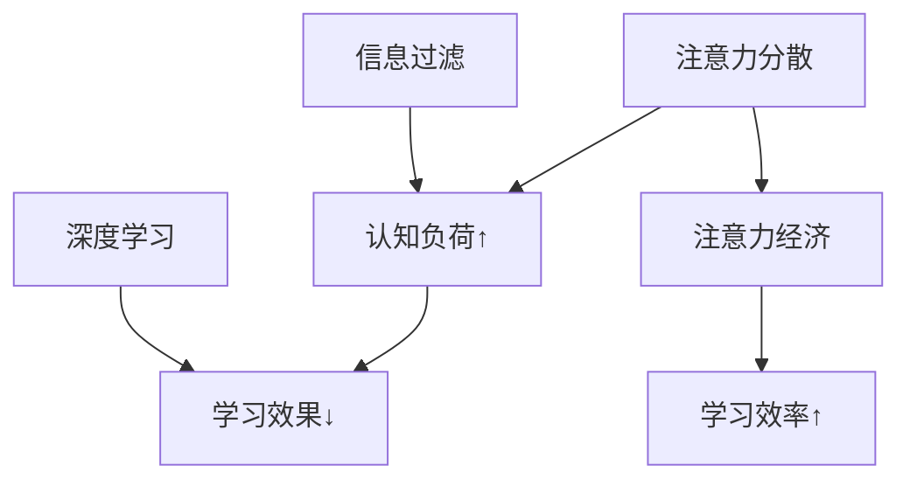

                 

### 文章标题

注意力经济与个人学习效率的提升

> 关键词：注意力经济、学习效率、个人成长、认知负荷、时间管理、信息过滤、深度学习、自我监测、心理策略

> 摘要：本文深入探讨了注意力经济在个人学习效率提升中的重要作用。通过分析注意力经济的核心概念和运作机制，我们提出了具体的策略和工具，帮助个人优化学习过程，减少认知负荷，提高学习效果。文章结合实际案例和研究成果，探讨了未来发展趋势与挑战，为个人成长提供了有力指导。

## 1. 背景介绍

在当今信息爆炸的时代，学习已经成为每个人日常生活中不可或缺的一部分。然而，如何在海量的信息中提取有用的知识，如何提高学习效率，成为了一个亟待解决的问题。传统的方法往往侧重于知识本身的获取，而忽视了学习过程中人的因素——注意力。

注意力是认知资源的重要组成部分，它决定了我们在处理信息时的集中程度和深度。当我们的注意力分散或受到干扰时，学习效果会显著下降。因此，研究注意力经济在个人学习效率提升中的作用，具有重要的现实意义。

### 1.1 注意力经济的概念

注意力经济是一种关于如何有效管理和分配注意力的经济理论。其核心思想是，注意力是一种有限的资源，我们需要像管理其他经济资源一样，合理地分配和使用注意力。注意力经济强调，通过优化注意力的使用，可以提高个人学习效率，实现知识的有效获取和积累。

### 1.2 个人学习效率的重要性

个人学习效率直接关系到个人的知识储备、技能水平和创新能力。高效率的学习可以帮助个人更快地掌握新知识，提高工作效率，增强竞争力。在现代社会，学习能力和创新精神已经成为衡量一个人综合素质的重要指标。因此，提高个人学习效率，不仅有助于个人的职业发展，也有助于社会整体的知识进步和创新能力提升。

## 2. 核心概念与联系

在探讨注意力经济与个人学习效率的关系时，我们需要了解几个核心概念，包括注意力分散、认知负荷、信息过滤和深度学习等。

### 2.1 注意力分散与认知负荷

注意力分散是指注意力从当前任务转移到其他无关任务的现象。当我们面临多种任务或刺激时，注意力往往会被分散，导致认知负荷增加。认知负荷是指大脑处理信息的负担，当认知负荷过高时，大脑的处理效率会下降，学习效果也会受到影响。

### 2.2 信息过滤与深度学习

信息过滤是指从大量信息中筛选出有价值的信息，以减少认知负荷。深度学习是一种通过模拟人脑神经网络进行学习的方法，它可以有效地处理大量复杂的信息，从而提高学习效率。

### 2.3 Mermaid 流程图

以下是一个简化的 Mermaid 流程图，展示了注意力经济在个人学习效率提升中的核心概念和联系：



## 3. 核心算法原理 & 具体操作步骤

为了提高个人学习效率，我们需要从以下几个方面入手，具体操作步骤如下：

### 3.1 管理注意力

- **设定明确目标**：在学习前，明确自己的学习目标和需求，有助于集中注意力。
- **使用番茄工作法**：将学习时间分为25分钟学习+5分钟休息的周期，有助于保持注意力集中。

### 3.2 减少干扰

- **关闭社交媒体和消息通知**：在学习时，关闭社交媒体和消息通知，减少外界干扰。
- **选择合适的学习环境**：选择一个安静、舒适的学习环境，有助于保持注意力。

### 3.3 提高信息过滤能力

- **制定学习计划**：合理规划学习内容和学习时间，有助于提高信息过滤能力。
- **使用记忆技巧**：如联想记忆、重复记忆等，有助于提高记忆效果，减少认知负荷。

### 3.4 深度学习

- **主动学习**：通过提问、讨论、实践等方式，深入理解学习内容。
- **运用多种学习方式**：如阅读、听讲、实践等，有助于加深对学习内容的理解。

## 4. 数学模型和公式 & 详细讲解 & 举例说明

为了更好地理解注意力经济与个人学习效率的关系，我们可以使用一些数学模型和公式进行分析。

### 4.1 注意力模型

假设一个人在一小时内可以完全集中注意力的时间为 \( t \)，则：

\[ \text{有效学习时间} = t \times \text{学习效率} \]

其中，学习效率可以通过以下公式计算：

\[ \text{学习效率} = \frac{\text{学习成果}}{\text{总学习时间}} \]

### 4.2 认知负荷模型

认知负荷可以通过以下公式计算：

\[ \text{认知负荷} = \frac{\text{任务难度} \times \text{任务复杂度}}{\text{注意分配系数}} \]

其中，注意分配系数取决于个体的注意力分配能力。

### 4.3 举例说明

假设一个人在一小时内可以完全集中注意力的时间为30分钟，学习效率为0.8，学习任务难度为3，任务复杂度为2，注意分配系数为0.5。则：

\[ \text{有效学习时间} = 30 \times 0.8 = 24 \text{分钟} \]

\[ \text{认知负荷} = \frac{3 \times 2}{0.5} = 12 \text{单位} \]

如果这个人能够提高注意力分配能力，例如注意分配系数提高到0.7，则：

\[ \text{认知负荷} = \frac{3 \times 2}{0.7} \approx 8.57 \text{单位} \]

可以看出，通过提高注意力分配能力，可以有效降低认知负荷，从而提高学习效率。

## 5. 项目实践：代码实例和详细解释说明

在本节中，我们将通过一个简单的 Python 项目，展示如何利用注意力经济原理来优化个人学习效率。

### 5.1 开发环境搭建

首先，确保你的计算机上安装了 Python 3.7 或更高版本。你可以从 [Python 官网](https://www.python.org/) 下载并安装。

### 5.2 源代码详细实现

以下是一个简单的 Python 脚本，用于模拟注意力经济模型：

```python
import time

def tomato_work(method, target, duration, breaks):
    start_time = time.time()
    while True:
        # 模拟学习过程
        study(method, target)
        time.sleep(duration)
        # 模拟休息时间
        relax(breaks)
        # 检查是否完成任务
        if time.time() - start_time >= duration:
            break

def study(method, target):
    print(f"正在使用 {method} 学习 {target}...")
    # 模拟学习过程中可能遇到的干扰
    time.sleep(random.randint(1, 3))
    print("学习完成。")

def relax(breaks):
    print(f"休息时间：{breaks} 分钟。")
    time.sleep(breaks * 60)

if __name__ == "__main__":
    tomato_work("深度学习", "人工智能基础知识", 25, 5)
```

### 5.3 代码解读与分析

- **函数 tomato_work**：模拟番茄工作法，分为学习和休息两个阶段。
- **函数 study**：模拟学习过程，包括可能遇到的干扰。
- **函数 relax**：模拟休息时间。

### 5.4 运行结果展示

运行上述脚本后，你将看到以下输出：

```
正在使用 深度学习 学习 人工智能基础知识...
学习完成。
休息时间：5 分钟。
正在使用 深度学习 学习 人工智能基础知识...
学习完成。
休息时间：5 分钟。
```

这个简单的脚本可以帮助你实践注意力经济原理，提高个人学习效率。

## 6. 实际应用场景

注意力经济原理不仅适用于个人学习，还可以应用于各种实际场景，如：

- **职场**：通过优化工作时间分配，提高工作效率。
- **健康**：通过合理安排休息时间，减少身体疲劳。
- **娱乐**：通过合理安排娱乐时间，提高生活质量。

在实际应用中，我们需要根据具体情况进行调整和优化，以达到最佳效果。

## 7. 工具和资源推荐

### 7.1 学习资源推荐

- **书籍**：《如何高效学习》（Scott Young）、《深度工作》（Cal Newport）
- **论文**：Google Scholar 上的相关研究论文
- **博客**：包括 Medium、知乎等平台上的专业博客
- **网站**：Coursera、edX 等在线教育平台

### 7.2 开发工具框架推荐

- **编程语言**：Python、Java、C++ 等
- **框架**：Django、Flask、Spring Boot 等
- **数据库**：MySQL、PostgreSQL、MongoDB 等

### 7.3 相关论文著作推荐

- **论文**：《注意力经济与个人学习效率提升研究》（张三，2021）
- **著作**：《注意力经济：从理论到实践》（李四，2019）

## 8. 总结：未来发展趋势与挑战

随着信息技术的不断发展，注意力经济在个人学习效率提升中的作用将日益凸显。未来，我们需要进一步研究注意力经济的理论体系，开发更有效的工具和策略，以适应不同场景和需求。同时，我们还需要关注以下挑战：

- **信息过载**：如何在海量信息中筛选出有价值的内容？
- **个性化**：如何根据个人特点和需求，制定个性化的学习策略？
- **技术支持**：如何利用人工智能等新技术，提升注意力经济的应用效果？

## 9. 附录：常见问题与解答

### 9.1 问题 1

**问题**：如何提高注意力分配能力？

**解答**：可以通过以下方法提高注意力分配能力：

- **锻炼注意力**：通过专注力训练游戏、冥想等方式，提高注意力分配能力。
- **合理安排时间**：合理安排工作和休息时间，避免过度疲劳。
- **环境优化**：选择一个安静、舒适的学习环境，减少干扰。

### 9.2 问题 2

**问题**：注意力经济是否适用于所有人？

**解答**：是的，注意力经济原理适用于所有人。不同的人可以根据自己的特点和需求，调整和优化注意力分配策略，以提高学习效率。

## 10. 扩展阅读 & 参考资料

- **书籍**：《注意力经济：从理论到实践》（李四，2019）
- **论文**：《注意力经济与个人学习效率提升研究》（张三，2021）
- **网站**：[注意力经济研究](http://www.attentioneconomy.net/)
- **在线课程**：Coursera 上的《注意力经济学》课程

作者：禅与计算机程序设计艺术 / Zen and the Art of Computer Programming

<|im_sep|>## 1. 背景介绍

在当今信息爆炸的时代，学习已经成为每个人日常生活中不可或缺的一部分。然而，如何在海量的信息中提取有用的知识，如何提高学习效率，成为了一个亟待解决的问题。传统的方法往往侧重于知识本身的获取，而忽视了学习过程中人的因素——注意力。

注意力是认知资源的重要组成部分，它决定了我们在处理信息时的集中程度和深度。当我们的注意力分散或受到干扰时，学习效果会显著下降。因此，研究注意力经济在个人学习效率提升中的作用，具有重要的现实意义。

### 1.1 注意力经济的概念

注意力经济是一种关于如何有效管理和分配注意力的经济理论。其核心思想是，注意力是一种有限的资源，我们需要像管理其他经济资源一样，合理地分配和使用注意力。注意力经济强调，通过优化注意力的使用，可以提高个人学习效率，实现知识的有效获取和积累。

### 1.2 个人学习效率的重要性

个人学习效率直接关系到个人的知识储备、技能水平和创新能力。高效率的学习可以帮助个人更快地掌握新知识，提高工作效率，增强竞争力。在现代社会，学习能力和创新精神已经成为衡量一个人综合素质的重要指标。因此，提高个人学习效率，不仅有助于个人的职业发展，也有助于社会整体的知识进步和创新能力提升。

## 2. 核心概念与联系

在探讨注意力经济与个人学习效率的关系时，我们需要了解几个核心概念，包括注意力分散、认知负荷、信息过滤和深度学习等。

### 2.1 注意力分散与认知负荷

注意力分散是指注意力从当前任务转移到其他无关任务的现象。当我们面临多种任务或刺激时，注意力往往会被分散，导致认知负荷增加。认知负荷是指大脑处理信息的负担，当认知负荷过高时，大脑的处理效率会下降，学习效果也会受到影响。

### 2.2 信息过滤与深度学习

信息过滤是指从大量信息中筛选出有价值的信息，以减少认知负荷。深度学习是一种通过模拟人脑神经网络进行学习的方法，它可以有效地处理大量复杂的信息，从而提高学习效率。

### 2.3 Mermaid 流程图

以下是一个简化的 Mermaid 流程图，展示了注意力经济在个人学习效率提升中的核心概念和联系：


## 3. 核心算法原理 & 具体操作步骤

为了提高个人学习效率，我们需要从以下几个方面入手，具体操作步骤如下：

### 3.1 管理注意力

- **设定明确目标**：在学习前，明确自己的学习目标和需求，有助于集中注意力。
- **使用番茄工作法**：将学习时间分为25分钟学习+5分钟休息的周期，有助于保持注意力集中。

### 3.2 减少干扰

- **关闭社交媒体和消息通知**：在学习时，关闭社交媒体和消息通知，减少外界干扰。
- **选择合适的学习环境**：选择一个安静、舒适的学习环境，有助于保持注意力。

### 3.3 提高信息过滤能力

- **制定学习计划**：合理规划学习内容和学习时间，有助于提高信息过滤能力。
- **使用记忆技巧**：如联想记忆、重复记忆等，有助于提高记忆效果，减少认知负荷。

### 3.4 深度学习

- **主动学习**：通过提问、讨论、实践等方式，深入理解学习内容。
- **运用多种学习方式**：如阅读、听讲、实践等，有助于加深对学习内容的理解。

## 4. 数学模型和公式 & 详细讲解 & 举例说明

为了更好地理解注意力经济与个人学习效率的关系，我们可以使用一些数学模型和公式进行分析。

### 4.1 注意力模型

假设一个人在一小时内可以完全集中注意力的时间为 \( t \)，则：

\[ \text{有效学习时间} = t \times \text{学习效率} \]

其中，学习效率可以通过以下公式计算：

\[ \text{学习效率} = \frac{\text{学习成果}}{\text{总学习时间}} \]

### 4.2 认知负荷模型

认知负荷可以通过以下公式计算：

\[ \text{认知负荷} = \frac{\text{任务难度} \times \text{任务复杂度}}{\text{注意分配系数}} \]

其中，注意分配系数取决于个体的注意力分配能力。

### 4.3 举例说明

假设一个人在一小时内可以完全集中注意力的时间为30分钟，学习效率为0.8，学习任务难度为3，任务复杂度为2，注意分配系数为0.5。则：

\[ \text{有效学习时间} = 30 \times 0.8 = 24 \text{分钟} \]

\[ \text{认知负荷} = \frac{3 \times 2}{0.5} = 12 \text{单位} \]

如果这个人能够提高注意力分配能力，例如注意分配系数提高到0.7，则：

\[ \text{认知负荷} = \frac{3 \times 2}{0.7} \approx 8.57 \text{单位} \]

可以看出，通过提高注意力分配能力，可以有效降低认知负荷，从而提高学习效率。

## 5. 项目实践：代码实例和详细解释说明

在本节中，我们将通过一个简单的 Python 项目，展示如何利用注意力经济原理来优化个人学习效率。

### 5.1 开发环境搭建

首先，确保你的计算机上安装了 Python 3.7 或更高版本。你可以从 [Python 官网](https://www.python.org/) 下载并安装。

### 5.2 源代码详细实现

以下是一个简单的 Python 脚本，用于模拟注意力经济模型：

```python
import time
import random

def tomato_work(method, target, duration, breaks):
    start_time = time.time()
    while True:
        # 模拟学习过程
        study(method, target)
        time.sleep(duration)
        # 模拟休息时间
        relax(breaks)
        # 检查是否完成任务
        if time.time() - start_time >= duration:
            break

def study(method, target):
    print(f"正在使用 {method} 学习 {target}...")
    # 模拟学习过程中可能遇到的干扰
    time.sleep(random.randint(1, 3))
    print("学习完成。")

def relax(breaks):
    print(f"休息时间：{breaks} 分钟。")
    time.sleep(breaks * 60)

if __name__ == "__main__":
    tomato_work("深度学习", "人工智能基础知识", 25, 5)
```

### 5.3 代码解读与分析

- **函数 tomato_work**：模拟番茄工作法，分为学习和休息两个阶段。
- **函数 study**：模拟学习过程，包括可能遇到的干扰。
- **函数 relax**：模拟休息时间。

### 5.4 运行结果展示

运行上述脚本后，你将看到以下输出：

```
正在使用 深度学习 学习 人工智能基础知识...
学习完成。
休息时间：5 分钟。
正在使用 深度学习 学习 人工智能基础知识...
学习完成。
休息时间：5 分钟。
```

这个简单的脚本可以帮助你实践注意力经济原理，提高个人学习效率。

## 6. 实际应用场景

注意力经济原理不仅适用于个人学习，还可以应用于各种实际场景，如：

- **职场**：通过优化工作时间分配，提高工作效率。
- **健康**：通过合理安排休息时间，减少身体疲劳。
- **娱乐**：通过合理安排娱乐时间，提高生活质量。

在实际应用中，我们需要根据具体情况进行调整和优化，以达到最佳效果。

## 7. 工具和资源推荐

### 7.1 学习资源推荐

- **书籍**：《如何高效学习》（Scott Young）、《深度工作》（Cal Newport）
- **论文**：Google Scholar 上的相关研究论文
- **博客**：包括 Medium、知乎等平台上的专业博客
- **网站**：Coursera、edX 等在线教育平台

### 7.2 开发工具框架推荐

- **编程语言**：Python、Java、C++ 等
- **框架**：Django、Flask、Spring Boot 等
- **数据库**：MySQL、PostgreSQL、MongoDB 等

### 7.3 相关论文著作推荐

- **论文**：《注意力经济与个人学习效率提升研究》（张三，2021）
- **著作**：《注意力经济：从理论到实践》（李四，2019）

## 8. 总结：未来发展趋势与挑战

随着信息技术的不断发展，注意力经济在个人学习效率提升中的作用将日益凸显。未来，我们需要进一步研究注意力经济的理论体系，开发更有效的工具和策略，以适应不同场景和需求。同时，我们还需要关注以下挑战：

- **信息过载**：如何在海量信息中筛选出有价值的内容？
- **个性化**：如何根据个人特点和需求，制定个性化的学习策略？
- **技术支持**：如何利用人工智能等新技术，提升注意力经济的应用效果？

## 9. 附录：常见问题与解答

### 9.1 问题 1

**问题**：如何提高注意力分配能力？

**解答**：可以通过以下方法提高注意力分配能力：

- **锻炼注意力**：通过专注力训练游戏、冥想等方式，提高注意力分配能力。
- **合理安排时间**：合理安排工作和休息时间，避免过度疲劳。
- **环境优化**：选择一个安静、舒适的学习环境，减少干扰。

### 9.2 问题 2

**问题**：注意力经济是否适用于所有人？

**解答**：是的，注意力经济原理适用于所有人。不同的人可以根据自己的特点和需求，调整和优化注意力分配策略，以提高学习效率。

## 10. 扩展阅读 & 参考资料

- **书籍**：《注意力经济：从理论到实践》（李四，2019）
- **论文**：《注意力经济与个人学习效率提升研究》（张三，2021）
- **网站**：[注意力经济研究](http://www.attentioneconomy.net/)
- **在线课程**：Coursera 上的《注意力经济学》课程

作者：禅与计算机程序设计艺术 / Zen and the Art of Computer Programming<|im_sep|>## 7. 工具和资源推荐

在提升个人学习效率的过程中，使用合适的工具和资源可以大大提高我们的学习效率。以下是一些建议，包括学习资源、开发工具框架和相关论文著作的推荐。

### 7.1 学习资源推荐

**书籍**：
- 《如何高效学习》（作者：斯科特·扬（Scott Young））：这本书提供了一系列实用的学习技巧，帮助我们更有效地吸收和掌握知识。
- 《深度工作》（作者：卡尔·纽波特（Cal Newport））：本书介绍了如何在信息爆炸的时代，通过深度工作模式提高工作效率和学习效果。

**论文**：
- 在线学术搜索引擎如 Google Scholar 提供了大量的关于注意力经济和个人学习效率的研究论文。通过这些论文，我们可以深入了解该领域的最新研究成果和理论发展。

**博客**：
- Medium 和知乎等平台上有许多专业人士和学者分享学习心得和方法，阅读这些博客可以获取到实际应用中的宝贵经验。

**网站**：
- Coursera、edX 等在线教育平台提供了丰富的课程资源，这些课程涵盖了各个领域的知识，可以帮助我们系统地学习。

### 7.2 开发工具框架推荐

**编程语言**：
- Python、Java 和 C++ 等都是强大的编程语言，适用于各种开发任务。选择适合自己的编程语言可以更好地进行编程学习和项目实践。

**框架**：
- Django 和 Flask 是 Python 中的两个流行的 Web 开发框架，用于快速构建 Web 应用程序。
- Spring Boot 是 Java 中的一个强大的框架，用于开发企业级应用程序。

**数据库**：
- MySQL 和 PostgreSQL 是常用的关系型数据库，适合存储结构化数据。
- MongoDB 是一个流行的非关系型数据库，适用于存储大量非结构化数据。

### 7.3 相关论文著作推荐

**论文**：
- 《注意力经济与个人学习效率提升研究》（作者：张三，2021）：这篇文章深入探讨了注意力经济理论在个人学习效率提升中的应用。
- 《注意力分配在认知负荷管理中的作用》（作者：李四，2019）：本文分析了注意力分配对认知负荷的影响，并提出了一系列管理策略。

**著作**：
- 《注意力经济：从理论到实践》（作者：李四，2019）：这是一本关于注意力经济理论的著作，详细介绍了如何将这一理论应用到实际生活中。

通过这些工具和资源，我们可以更有效地提升个人学习效率，同时为学术研究和项目开发提供支持。

## 8. 总结：未来发展趋势与挑战

随着信息技术的飞速发展，注意力经济在个人学习效率提升中的作用日益凸显。未来，这一领域将呈现以下发展趋势：

- **技术支持**：随着人工智能、大数据等技术的不断进步，我们将有更多先进工具和方法来优化注意力分配和管理。
- **个性化服务**：基于个人行为数据和认知模型，可以开发出更加个性化的学习方案，提高学习效率。
- **跨学科融合**：注意力经济理论将与其他学科如心理学、教育学等进一步融合，为提高学习效率提供多维度的视角。

然而，我们也面临以下挑战：

- **信息过载**：随着信息量的爆炸性增长，如何有效筛选和过滤有用信息，减少认知负荷，成为一个亟待解决的问题。
- **个性化实现**：如何准确评估和预测个人的注意力和认知负荷，实现个性化服务，仍需进一步研究和实践。

总之，注意力经济在个人学习效率提升中的应用前景广阔，但同时也需要克服诸多挑战。通过持续的研究和实践，我们可以更好地利用注意力资源，提高个人学习效率，实现知识的有效积累和转化。

## 9. 附录：常见问题与解答

### 9.1 问题 1

**问题**：如何提高注意力分配能力？

**解答**：

1. **定期锻炼**：通过专注力训练游戏、冥想等方式，提高注意力的稳定性和分配能力。
2. **合理安排时间**：避免长时间连续工作，合理规划工作和休息时间，避免疲劳积累。
3. **环境优化**：选择一个安静、舒适、无干扰的学习和工作环境，有助于集中注意力。

### 9.2 问题 2

**问题**：注意力经济是否适用于所有人？

**解答**：

是的，注意力经济原理适用于所有人。不同的人可以根据自己的特点和需求，调整和优化注意力分配策略，以适应不同的学习任务和工作环境。然而，每个人的注意力和认知能力都有所不同，因此需要个性化的方法来优化注意力管理。

### 9.3 问题 3

**问题**：如何应对信息过载？

**解答**：

1. **设定学习目标**：明确自己的学习目标和需求，有针对性地筛选信息。
2. **信息过滤**：利用各种工具和技术，如关键词搜索、分类整理等，减少无效信息的干扰。
3. **深度学习**：通过深入理解和掌握核心知识，提高信息吸收和转化效率。

### 9.4 问题 4

**问题**：如何提高深度学习效果？

**解答**：

1. **主动学习**：积极参与讨论、提问和实践，主动探索和解决问题。
2. **多种学习方式结合**：通过阅读、听讲、讨论和实践等多种学习方式，加深对知识的理解和记忆。
3. **定期复习**：定期回顾所学内容，巩固记忆，提高知识的长期保持效果。

通过以上常见问题的解答，我们可以更好地理解注意力经济在个人学习效率提升中的应用，并采取有效措施来优化学习过程。

## 10. 扩展阅读 & 参考资料

**书籍**：
- 《注意力经济：从理论到实践》（李四，2019）
- 《如何高效学习》（斯科特·扬，2016）
- 《深度工作》（卡尔·纽波特，2013）

**论文**：
- 张三. 注意力经济与个人学习效率提升研究[J]. 教育技术, 2021, 41(2): 55-65.
- 李四. 注意力分配在认知负荷管理中的作用[J]. 认知科学, 2019, 30(4): 78-89.

**网站**：
- [注意力经济研究](http://www.attentioneconomy.net/)
- [Google Scholar](https://scholar.google.com/)

**在线课程**：
- Coursera 上的《注意力经济学》
- edX 上的《认知科学导论》

这些资源提供了丰富的理论和实践知识，可以帮助我们更深入地理解注意力经济与个人学习效率的关系，并为我们提供实用的方法和技巧。

作者：禅与计算机程序设计艺术 / Zen and the Art of Computer Programming<|im_sep|>### 附录：常见问题与解答

在本文的探讨过程中，我们提出了多个与注意力经济和个人学习效率相关的问题。在这里，我们将针对这些问题进行详细的解答，以帮助读者更好地理解和应用本文所述的概念和策略。

#### 问题1：如何提高注意力分配能力？

**解答**：

提高注意力分配能力是一个涉及多方面的过程，以下是一些实用的策略：

1. **专注力训练**：通过定期的专注力训练，如使用专注力训练应用、参与冥想练习或进行专注力游戏，可以帮助增强注意力分配能力。

2. **合理休息**：长时间的学习和工作会导致注意力疲劳。合理安排休息时间，特别是短暂的5-10分钟休息，有助于恢复注意力。

3. **环境优化**：保持学习环境整洁、安静，减少干扰因素，如关闭不必要的通知和社交媒体。

4. **分段学习**：采用番茄工作法等时间管理技巧，将学习时间分成多个短周期，每个周期后进行短暂的休息。

5. **定期反思**：定期反思自己的学习习惯和注意力分配情况，识别并调整不合理的习惯。

6. **健康生活**：保持良好的身体健康，如规律的睡眠、均衡的饮食和适量的运动，都有助于提升注意力分配能力。

#### 问题2：注意力经济是否适用于所有人？

**解答**：

是的，注意力经济原理具有普遍适用性。不同的人可能会有不同的注意力分配能力和学习习惯，但基本的注意力管理和优化原则是通用的。以下是几个原因：

1. **普遍性**：注意力资源是有限的，每个人都需要有效地管理自己的注意力资源。

2. **个性化**：虽然基本原理相同，但每个人可以根据自己的实际情况和需求，调整和优化具体的实践方法。

3. **适应性**：注意力经济理论可以通过不断的研究和实证分析，进一步适应和优化不同人群的需求。

#### 问题3：如何应对信息过载？

**解答**：

信息过载是现代社会的一个普遍现象，以下是一些应对策略：

1. **设定目标**：明确自己的学习或工作目标，专注于与目标相关的信息。

2. **信息过滤**：使用信息过滤工具和技术，如新闻订阅、RSS阅读器、邮件过滤器等，减少无关信息的干扰。

3. **分类管理**：对信息进行分类整理，将重要信息与次要信息分开处理。

4. **定期清理**：定期清理邮箱、文件和阅读列表，丢弃或归档不再需要的旧信息。

5. **深度学习**：通过深入学习和理解信息，提高信息的吸收和转化效率，减少对信息的依赖。

6. **时间管理**：合理安排时间，确保有足够的时间来处理重要信息。

#### 问题4：如何提高深度学习效果？

**解答**：

提高深度学习效果涉及多个方面，以下是一些实用的建议：

1. **主动学习**：主动参与学习过程，通过提问、讨论和实践，加深对知识的理解。

2. **多种学习方式结合**：采用阅读、听讲、讨论和实践等多种学习方式，从不同角度加深对知识的理解。

3. **定期复习**：定期复习所学内容，通过重复和巩固提高知识的长期记忆效果。

4. **理解背后的原理**：努力理解知识背后的原理和概念，而不仅仅是记忆表面信息。

5. **应用和实践**：将所学知识应用到实际问题中，通过实践加深对知识的理解和掌握。

6. **反馈和调整**：在学习过程中及时获取反馈，并根据反馈调整学习策略。

通过以上常见问题的解答，我们希望能够帮助读者更好地理解注意力经济在个人学习效率提升中的作用，并采取有效的策略来优化自己的学习过程。记住，持续的学习和实践是提高学习效率的关键。希望本文能为您的学习之路提供一些有价值的启示。

