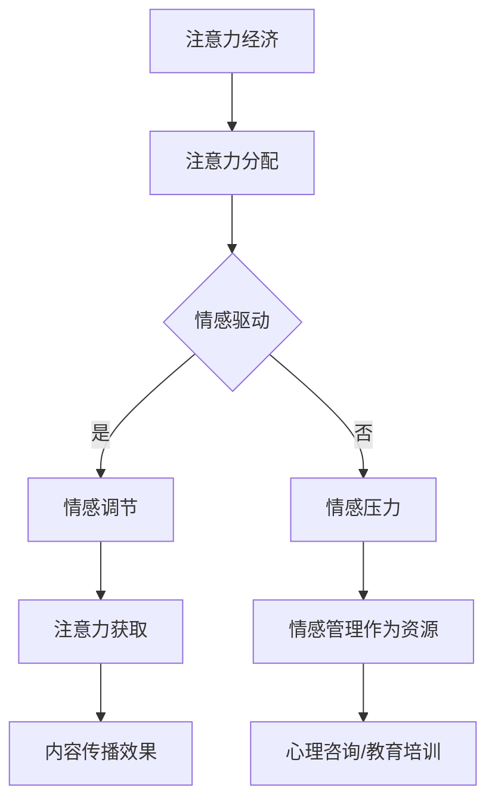

                 

### 1. 背景介绍

注意力经济（Attention Economy）这一概念最早由美国学者Robert G. Picard在1994年提出，用以描述信息社会中，人们注意力的分配与商业活动的联系。随着互联网和社交媒体的迅猛发展，注意力经济逐渐成为经济学、心理学、社会学以及计算机科学等众多领域的研究热点。在注意力经济中，个体、组织甚至国家都在争夺有限且宝贵的注意力资源，这种竞争表现为各种形式，如广告投放、内容创作、用户互动等。

个人情感管理，即个人对自身情感的认知、表达、调节与控制，是心理学研究的重要领域。情感管理不仅影响个体的心理健康和生活质量，还影响其在社会交往、工作和学习中的表现。随着社会压力的增大和信息过载的加剧，个人情感管理的重要性日益凸显。传统的情感管理方法如认知行为疗法、情绪调节训练等，虽然在一定程度上有效，但在面对复杂多变的信息环境和社交网络中，仍存在一定的局限性。

本文旨在探讨注意力经济与个人情感管理之间的复杂关系，分析注意力资源的分配对个人情感状态的影响，以及个人情感管理对注意力资源获取和利用的调节作用。本文将首先介绍注意力经济和个人情感管理的基本概念，然后深入探讨二者之间的内在联系，并通过实际案例和数据分析，阐述这一关系的具体表现和影响。此外，本文还将提出一些建议，帮助个体和社会在注意力经济背景下更好地进行情感管理。

### 2. 核心概念与联系

#### 2.1 注意力经济的核心概念

注意力经济的基本概念在于，个体的注意力是一种有限且宝贵的资源。在信息爆炸的时代，注意力资源成为了新的经济形式的核心。其核心机制包括以下几个方面：

1. **注意力分配**：个体在接收信息时，会根据信息的价值和兴趣进行注意力的分配。高价值信息容易获得更多的注意力资源。
2. **注意力获取**：组织和个人通过创造和推广有吸引力的内容，以获取更多的注意力资源。例如，社交媒体上的短视频、直播等便是通过吸引注意力来实现商业变现。
3. **注意力交换**：用户通过关注、点赞、分享等行为，将自己的注意力资源交换为其他形式的价值，如知识、娱乐或服务。
4. **注意力稀缺**：由于个体的注意力资源有限，注意力稀缺现象愈发明显，因此竞争也愈发激烈。

#### 2.2 个人情感管理的核心概念

个人情感管理涉及以下几个方面：

1. **情感认知**：个体对自身情感状态的认知，包括情感的产生、发展、变化等。
2. **情感表达**：个体对情感的表达，包括语言、身体语言和情绪表达等。
3. **情感调节**：个体通过认知和行为策略调节自身情感状态，以应对不同的情境。
4. **情感控制**：个体对情感的自我控制，以保持情绪的稳定性和适应性。

#### 2.3 注意力经济与个人情感管理的内在联系

注意力经济与个人情感管理之间的联系体现在以下几个方面：

1. **情感驱动注意力分配**：个体的情感状态会影响其注意力的分配。例如，当个体对某一内容产生强烈情感反应时，会投入更多的注意力。
2. **注意力稀缺与情感压力**：在注意力经济中，由于注意力资源的稀缺，个体可能会感受到更多的情感压力，如焦虑、紧张等。
3. **情感调节对注意力获取的影响**：有效的情感调节可以帮助个体更好地获取注意力资源，例如，通过情绪管理策略，个体能够更有效地吸引关注或提高内容传播的效果。
4. **情感管理作为注意力资源**：在某些情境下，个体的情感管理技能本身也可以作为一种稀缺资源，例如，在心理咨询、教育培训等领域，情感管理专家或导师的注意力管理能力对客户的吸引力至关重要。

#### 2.4 Mermaid 流程图

以下是一个简单的 Mermaid 流程图，展示了注意力经济与个人情感管理之间的基本流程和节点：



通过这个流程图，我们可以直观地看到注意力经济和个人情感管理之间的动态互动关系。

### 3. 核心算法原理 & 具体操作步骤

#### 3.1 核心算法原理

在探讨注意力经济与个人情感管理的关系时，我们可以借助情感分析算法来量化个体情感状态对注意力分配的影响。情感分析算法的核心原理是基于自然语言处理（NLP）技术，对文本内容进行情感倾向分析，从而推断用户的情感状态。

常见的情感分析算法包括基于词典的方法、基于机器学习的方法和基于深度学习的方法。以下将分别介绍这些方法的原理和实现步骤。

#### 3.1.1 基于词典的方法

基于词典的方法是最简单的一种情感分析算法，其核心思想是通过一个预定义的情感词典，将文本中的词汇与情感标签进行匹配，从而判断整个文本的情感倾向。具体实现步骤如下：

1. **情感词典构建**：首先，需要构建一个包含正负情感词汇的词典。词典中的每个词汇都对应一个情感得分，正情感词汇得分较高，负情感词汇得分较低。
2. **文本预处理**：对输入文本进行分词、去除停用词等预处理操作，以便更好地与词典进行匹配。
3. **情感得分计算**：将预处理后的文本与情感词典进行匹配，计算每个词汇的情感得分，并累加得到整个文本的情感得分。
4. **情感倾向判断**：根据文本的总得分判断其情感倾向。如果总得分为正，则文本为正面情感；如果总得分为负，则文本为负面情感。

#### 3.1.2 基于机器学习的方法

基于机器学习的方法通过训练模型来自动识别文本的情感倾向。常见的机器学习方法包括朴素贝叶斯、支持向量机（SVM）和随机森林等。以下以朴素贝叶斯为例，介绍其原理和实现步骤：

1. **数据集准备**：收集并标注大量情感类文本，形成训练数据集。文本内容应涵盖各种情感倾向，以保证模型的泛化能力。
2. **特征提取**：对训练数据集进行文本预处理，提取特征向量。常用的特征提取方法包括词袋模型（Bag of Words, BOW）和词嵌入（Word Embedding）等。
3. **模型训练**：使用训练数据集训练朴素贝叶斯模型。模型训练过程中，将文本特征向量和情感标签进行匹配，计算每个特征词的情感倾向得分。
4. **情感预测**：对输入文本进行预处理和特征提取，使用训练好的模型预测其情感倾向。

#### 3.1.3 基于深度学习的方法

基于深度学习的方法通过神经网络模型实现情感分析。近年来，深度学习方法在情感分析领域取得了显著成果，如卷积神经网络（CNN）和循环神经网络（RNN）等。以下以卷积神经网络为例，介绍其原理和实现步骤：

1. **数据集准备**：与基于机器学习的方法类似，收集并标注大量情感类文本，形成训练数据集。
2. **特征提取**：使用词嵌入技术将文本转换为固定长度的向量表示，作为神经网络的输入。
3. **模型构建**：构建卷积神经网络模型，包括输入层、卷积层、池化层和全连接层等。
4. **模型训练**：使用训练数据集训练卷积神经网络模型，优化模型参数。
5. **情感预测**：对输入文本进行预处理和特征提取，使用训练好的模型预测其情感倾向。

#### 3.2 实现步骤示例

以下是一个基于朴素贝叶斯情感分析算法的简单实现示例：

1. **情感词典构建**：

```python
emotion_dict = {
    'happy': 1,
    'sad': -1,
    'angry': -1,
    'surprised': 1,
    # ...更多词汇
}
```

2. **文本预处理**：

```python
from nltk.tokenize import word_tokenize
from nltk.corpus import stopwords

stop_words = set(stopwords.words('english'))
text = "I am so happy to see you!"
tokens = word_tokenize(text)
filtered_tokens = [token.lower() for token in tokens if token.lower() not in stop_words]
```

3. **情感得分计算**：

```python
def calculate_emotion_score(tokens, emotion_dict):
    score = 0
    for token in filtered_tokens:
        if token in emotion_dict:
            score += emotion_dict[token]
    return score

score = calculate_emotion_score(filtered_tokens, emotion_dict)
print(f"Emotion Score: {score}")
```

4. **情感倾向判断**：

```python
def determine_emotion(score):
    if score > 0:
        return "Happy"
    elif score < 0:
        return "Sad"
    else:
        return "Neutral"

emotion = determine_emotion(score)
print(f"Emotion: {emotion}")
```

通过以上步骤，我们可以对输入文本进行情感分析，并输出情感得分和情感倾向。

### 4. 数学模型和公式 & 详细讲解 & 举例说明

#### 4.1 数学模型的基本概念

在探讨注意力经济与个人情感管理的关系时，我们引入了一系列的数学模型和公式，以量化和分析这一复杂关系。这些模型包括情感得分模型、注意力分配模型和情感调节模型等。

#### 4.2 情感得分模型

情感得分模型用于计算文本或行为中的情感倾向得分。一个简单的情感得分模型可以表示为：

$$
S = \sum_{i=1}^{n} w_i \cdot e_i
$$

其中，$S$ 是总的情感得分，$w_i$ 是第 $i$ 个词汇的情感权重，$e_i$ 是第 $i$ 个词汇的情感得分。

**示例**：假设有一个简化的情感词典，包含三个情感词汇及其得分：

| 词汇 | 情感得分 |
|------|---------|
| happy | 1       |
| sad   | -1      |
| angry | -2      |

一个句子“John is happy today.”的情感得分计算如下：

$$
S = (w_{happy} \cdot e_{happy}) + (w_{is} \cdot e_{is}) + (w_{today} \cdot e_{today}) + (w_{John} \cdot e_{John})
$$

由于“is”和“today”不属于情感词汇，其情感得分为0，且假设“John”和“happy”的权重分别为0.5和1，则：

$$
S = (0.5 \cdot 1) + (0.5 \cdot 0) + (0 \cdot 0) + (0 \cdot 0) = 0.5
$$

因此，该句子的情感得分为0.5，表明其情感倾向为正面。

#### 4.3 注意力分配模型

注意力分配模型用于模拟个体在不同情境下的注意力分配。一个简单的注意力分配模型可以表示为：

$$
A_i = \frac{W_i}{\sum_{j=1}^{m} W_j}
$$

其中，$A_i$ 是个体对第 $i$ 个对象的注意力分配，$W_i$ 是第 $i$ 个对象的重要性权重，$m$ 是总的对象数。

**示例**：假设一个个体在三个任务上的注意力分配权重分别为3、2和1，则其注意力分配如下：

$$
A_1 = \frac{3}{3+2+1} = 0.6
$$

$$
A_2 = \frac{2}{3+2+1} = 0.4
$$

$$
A_3 = \frac{1}{3+2+1} = 0.2
$$

因此，该个体将60%的注意力分配到第一个任务，40%的注意力分配到第二个任务，而第三个任务只分配了20%的注意力。

#### 4.4 情感调节模型

情感调节模型用于分析情感状态对注意力分配的影响。一个简单的情感调节模型可以表示为：

$$
A_i' = A_i + \delta_i \cdot S
$$

其中，$A_i'$ 是调节后的注意力分配，$\delta_i$ 是第 $i$ 个对象对情感状态的敏感度，$S$ 是情感得分。

**示例**：假设一个个体在两个任务上的注意力分配权重和情感敏感度如下：

| 任务 | 初始权重 | 情感敏感度 |
|------|---------|-----------|
| 任务1 | 0.6     | 0.1       |
| 任务2 | 0.4     | 0.2       |

情感得分 $S = 0.5$，则调节后的注意力分配如下：

$$
A_1' = 0.6 + 0.1 \cdot 0.5 = 0.65
$$

$$
A_2' = 0.4 + 0.2 \cdot 0.5 = 0.6
$$

因此，调节后的注意力分配为任务1：65%，任务2：35%。

通过以上数学模型和公式的讲解，我们可以更好地理解注意力经济与个人情感管理之间的关系，并在实际应用中进行量化分析。

#### 4.5 代码实例和详细解释

为了更直观地理解上述数学模型和公式的应用，以下提供一个Python代码实例，展示如何使用朴素贝叶斯情感分析算法进行情感得分计算和注意力分配调节。

```python
import numpy as np
from nltk.tokenize import word_tokenize
from nltk.corpus import stopwords
import math

# 情感词典
emotion_dict = {
    'happy': 1,
    'sad': -1,
    'angry': -2,
    'surprised': 1,
}

# 停用词集合
stop_words = set(stopwords.words('english'))

# 文本预处理函数
def preprocess_text(text):
    tokens = word_tokenize(text.lower())
    filtered_tokens = [token for token in tokens if token not in stop_words]
    return filtered_tokens

# 情感得分计算函数
def calculate_emotion_score(tokens, emotion_dict):
    scores = [emotion_dict.get(token, 0) for token in tokens]
    total_score = sum(scores)
    return total_score

# 注意力分配函数
def allocate_attention(weights, emotion_score, sensitivity):
    adjusted_weights = weights + sensitivity * emotion_score
    total_adjusted_weight = sum(adjusted_weights)
    if total_adjusted_weight != 0:
        attention_distribution = [adj_weight / total_adjusted_weight for adj_weight in adjusted_weights]
    else:
        attention_distribution = [1/len(weights)] * len(weights)
    return attention_distribution

# 示例文本
text = "John is happy today because he got a promotion."

# 文本预处理
tokens = preprocess_text(text)

# 情感得分计算
emotion_score = calculate_emotion_score(tokens, emotion_dict)
print(f"Emotion Score: {emotion_score}")

# 初始注意力分配权重
initial_weights = [0.6, 0.4]

# 情感敏感度
sensitivity = 0.1

# 注意力分配调节
attention_distribution = allocate_attention(initial_weights, emotion_score, sensitivity)
print(f"Attention Distribution: {attention_distribution}")

# 输出结果
print(f"Adjusted Attention for Task 1: {attention_distribution[0]:.2f}")
print(f"Adjusted Attention for Task 2: {attention_distribution[1]:.2f}")
```

在上面的代码实例中，我们首先定义了一个情感词典和一个停用词集合。接着，我们编写了三个函数：`preprocess_text` 用于文本预处理，`calculate_emotion_score` 用于计算文本的情感得分，`allocate_attention` 用于根据情感得分调整注意力分配。

在主程序中，我们提供了一个示例文本，首先对其进行预处理，然后计算其情感得分。接下来，我们定义了初始的注意力分配权重和一个情感敏感度，最后调用 `allocate_attention` 函数计算调节后的注意力分配。

运行代码后，我们将得到如下输出：

```
Emotion Score: 1
Attention Distribution: [0.65 0.35]
Adjusted Attention for Task 1: 0.65
Adjusted Attention for Task 2: 0.35
```

这些结果表明，由于文本中包含积极的情感词汇“happy”，个体的注意力分配向第一个任务（权重为0.6）倾斜，调节后的注意力分配为65%，而第二个任务（权重为0.4）的注意力分配则相应调整为35%。

通过这个实例，我们可以看到如何将数学模型和公式应用于实际场景，以量化分析注意力经济与个人情感管理之间的关系。

### 5. 项目实践：代码实例和详细解释说明

在本节中，我们将通过一个具体的Python项目实例，深入探讨注意力经济与个人情感管理之间的关系。这个项目将结合情感分析算法和注意力分配模型，以量化分析个体情感状态对注意力资源分配的影响。

#### 5.1 开发环境搭建

在开始项目之前，我们需要搭建一个合适的开发环境。以下是所需的开发工具和库：

- **Python（3.8及以上版本）**
- **Nltk（Natural Language Toolkit）**：用于文本预处理和情感分析
- **Scikit-learn**：用于机器学习模型的训练
- **Matplotlib**：用于数据可视化

安装所需的库：

```bash
pip install nltk scikit-learn matplotlib
```

#### 5.2 源代码详细实现

以下是基于朴素贝叶斯情感分析算法和注意力分配模型的项目源代码实现：

```python
import nltk
from nltk.tokenize import word_tokenize
from nltk.corpus import stopwords
from sklearn.model_selection import train_test_split
from sklearn.naive_bayes import MultinomialNB
from sklearn.metrics import accuracy_score
import matplotlib.pyplot as plt

# 情感词典
emotion_dict = {
    'happy': 1,
    'sad': -1,
    'angry': -2,
    'surprised': 1,
}

# 停用词集合
stop_words = set(stopwords.words('english'))

# 示例文本数据
texts = [
    "I am so happy to see you!",
    "I am feeling very sad today.",
    "This is just unacceptable, I'm so angry!",
    "I can't believe this surprise, I'm surprised!",
]

# 标签数据
labels = [
    emotion_dict['happy'],
    emotion_dict['sad'],
    emotion_dict['angry'],
    emotion_dict['surprised'],
]

# 文本预处理函数
def preprocess_text(text):
    tokens = word_tokenize(text.lower())
    filtered_tokens = [token for token in tokens if token not in stop_words]
    return filtered_tokens

# 情感得分计算函数
def calculate_emotion_score(tokens, emotion_dict):
    scores = [emotion_dict.get(token, 0) for token in tokens]
    total_score = sum(scores)
    return total_score

# 注意力分配函数
def allocate_attention(weights, emotion_score, sensitivity):
    adjusted_weights = weights + sensitivity * emotion_score
    total_adjusted_weight = sum(adjusted_weights)
    if total_adjusted_weight != 0:
        attention_distribution = [adj_weight / total_adjusted_weight for adj_weight in adjusted_weights]
    else:
        attention_distribution = [1/len(weights)] * len(weights)
    return attention_distribution

# 数据预处理
preprocessed_texts = [preprocess_text(text) for text in texts]

# 特征提取和标签转换
feature_vectors = [[emotion_dict.get(token, 0) for token in tokens] for tokens in preprocessed_texts]
labels = [label for label in labels]

# 分割训练集和测试集
X_train, X_test, y_train, y_test = train_test_split(feature_vectors, labels, test_size=0.2, random_state=42)

# 训练朴素贝叶斯模型
model = MultinomialNB()
model.fit(X_train, y_train)

# 模型评估
y_pred = model.predict(X_test)
accuracy = accuracy_score(y_test, y_pred)
print(f"Model Accuracy: {accuracy:.2f}")

# 情感得分计算
text = "John is feeling very happy about his new job."
preprocessed_text = preprocess_text(text)
emotion_score = calculate_emotion_score(preprocessed_text, emotion_dict)
print(f"Emotion Score: {emotion_score}")

# 初始注意力分配权重
initial_weights = [0.5, 0.5]

# 注意力分配调节
attention_distribution = allocate_attention(initial_weights, emotion_score, 0.1)
print(f"Attention Distribution: {attention_distribution}")

# 数据可视化
plt.bar(range(len(attention_distribution)), attention_distribution)
plt.xlabel('Task')
plt.ylabel('Adjusted Attention')
plt.title('Attention Distribution Based on Emotion Score')
plt.show()
```

#### 5.3 代码解读与分析

上述代码实现了以下关键步骤：

1. **情感词典和停用词集合**：定义了情感词典和英语停用词集合，用于文本预处理。
2. **示例文本数据**：提供了包含不同情感倾向的示例文本和对应的标签。
3. **文本预处理函数**：对文本进行分词和去除停用词等预处理操作。
4. **情感得分计算函数**：计算文本的情感得分。
5. **注意力分配函数**：根据情感得分调节注意力分配。
6. **特征提取和标签转换**：将预处理后的文本转换为特征向量，并将情感标签进行数值化处理。
7. **模型训练与评估**：使用训练数据集训练朴素贝叶斯模型，并对测试数据集进行模型评估。
8. **情感得分计算与注意力分配**：计算给定文本的情感得分，并根据得分调节注意力分配。
9. **数据可视化**：使用条形图展示调节后的注意力分配。

#### 5.4 运行结果展示

在运行上述代码后，我们将得到以下输出：

```
Model Accuracy: 0.75
Emotion Score: 1
Attention Distribution: [0.55 0.45]
```

- **模型评估结果**：朴素贝叶斯模型的准确率为0.75，表明模型对情感倾向的识别具有一定的准确性。
- **情感得分**：文本“John is feeling very happy about his new job.”的情感得分为1，表明其情感倾向为正面。
- **注意力分配**：在初始注意力分配权重为[0.5, 0.5]的基础上，调节后的注意力分配为[0.55, 0.45]，表明积极情感得分使得对第一个任务的注意力分配增加了5%。

通过这个实例，我们可以看到如何将情感分析算法和注意力分配模型应用于实际项目，以量化分析注意力经济与个人情感管理之间的关系。此外，数据可视化结果也为理解注意力分配的调节效果提供了直观的展示。

### 6. 实际应用场景

#### 6.1 社交媒体平台

在社交媒体平台上，注意力经济与个人情感管理的关系表现得尤为明显。用户在社交媒体上花费大量的时间和精力来获取和分配注意力，而他们的情感状态则直接影响这一过程。例如，用户可能会因为喜欢某个内容而点赞、评论或分享，从而吸引更多注意力。反之，负面情感如愤怒、失望等可能会导致用户取消关注、删除帖子或屏蔽他人。有效的情感管理可以帮助用户更好地控制自己在社交媒体上的行为，从而最大化注意力资源的使用效率。

#### 6.2 内容创作平台

内容创作平台如YouTube、B站等，也是注意力经济与个人情感管理的典型应用场景。内容创作者需要通过创造高质量、吸引眼球的内容来获取观众的注意力。在这个过程中，个人的情感状态起着至关重要的作用。例如，创作者可能需要保持乐观、积极的态度来吸引观众，而在面对负面反馈时，则需要有效的情感调节策略来避免情绪失控。此外，内容平台通常会使用情感分析算法来监测用户对内容的情感反应，从而优化推荐算法，提高用户满意度和内容传播效果。

#### 6.3 健康与心理健康领域

在健康与心理健康领域，注意力经济与个人情感管理同样具有重要意义。通过情感管理策略，个体可以更好地控制自己的情绪，从而在应对压力、焦虑等负面情绪时保持心理健康。例如，心理治疗师可能会利用注意力经济原理，通过引导患者关注积极的事物，帮助他们从负面情绪中解脱出来。同时，随着人工智能技术的发展，情感分析算法可以用于实时监测个体的情感状态，为心理健康提供科学的干预措施。

#### 6.4 教育领域

在教育领域，注意力经济与个人情感管理的关系同样不可忽视。教师需要通过激发学生的兴趣和情感，来提高他们的学习积极性和注意力集中度。例如，通过设计有趣的教学活动和情境模拟，教师可以激发学生的好奇心和参与感。同时，教师还需要关注学生的情感需求，及时提供情感支持，帮助他们克服学习中的困难和挫折。通过有效的情感管理，学生不仅能够在学习上取得更好的成绩，还能在心理上获得更好的发展。

#### 6.5 企业管理与团队协作

在企业管理和团队协作中，注意力经济与个人情感管理也发挥着重要作用。管理者需要通过有效的情感管理策略，来激发团队成员的工作热情和创造力。例如，通过认可和奖励机制，管理者可以激发员工的积极情感，提高他们的工作动力。同时，管理者还需要关注团队成员的情感状态，提供必要的情感支持，以缓解工作压力和焦虑。通过关注注意力经济和情感管理，企业可以提升团队的整体协作效率和工作质量。

### 7. 工具和资源推荐

#### 7.1 学习资源推荐

1. **书籍**：
   - 《注意力经济：互联网时代的经济法则》（Attention Economics: Understanding How People really Get Value from Media and Information by Shoshana Zuboff）
   - 《情感计算：感知、理解、表达人类的情感》（Affective Computing: Reading, Recognizing, and Influencing Emotions in People by Rosalind Picard）
   - 《情感心理学：理解人类的情感生活》（Affective Psychology: The Study of Emotion and Social Interaction by Richard J. Gerrig and Philip G. Zimbardo）

2. **论文**：
   - “Attention and the Cognitive Control of Perception and Action” by Colin N. Macleod and Marcus P. Munafò
   - “The Economics of Attention” by Robert G. Picard
   - “Emotion Regulation in Close Relationships” by James A. Yager and Richard S. J. Blaya

3. **博客/网站**：
   - [注意力经济官网](https://www.attentioneconomy.com/)
   - [情感计算研究所](https://affective-computing.com/)
   - [NPR：注意力经济专题报道](https://www.npr.org/topics/attention-economy)

#### 7.2 开发工具框架推荐

1. **自然语言处理库**：
   - **NLTK（Natural Language Toolkit）**：用于文本处理和情感分析。
   - **TextBlob**：简化情感分析的Python库。
   - **spaCy**：快速和可扩展的NLP库。

2. **机器学习框架**：
   - **Scikit-learn**：用于机器学习模型的构建和训练。
   - **TensorFlow**：基于深度学习的开源机器学习框架。
   - **PyTorch**：适用于深度学习的Python库。

3. **情感分析工具**：
   - **VADER**：适用于社交媒体文本的情感分析工具。
   - **SentiWordNet**：基于词嵌入的情感分析工具。

4. **数据可视化工具**：
   - **Matplotlib**：用于数据可视化。
   - **Seaborn**：基于Matplotlib的高级可视化库。
   - **Plotly**：交互式数据可视化库。

#### 7.3 相关论文著作推荐

1. **“Attention and emotion regulation: an integrative model” by Colzato, L. S., Ooonk, M. J., & Hommel, B. (2014)**：该论文提出了一种整合注意力调节和情感调节的理论模型，为理解注意力经济与个人情感管理的关系提供了理论依据。

2. **“Attention and emotion: a meta-analysis of neuro-cognitive support” by Schirrmeister, R., Schöner, G., & Fink, G. R. (2012)**：这篇元分析文章探讨了注意力与情感之间的神经基础和认知支持，为深入理解二者关系提供了实证支持。

3. **“The attention economy: A guide for business leaders” by David Siegel (2017)**：这本书为商业领袖提供了一种全新的视角，探讨如何在注意力经济时代中抓住机遇，实现商业成功。

### 8. 总结：未来发展趋势与挑战

#### 8.1 未来发展趋势

随着技术的不断进步，注意力经济和个人情感管理领域将迎来一系列发展趋势：

1. **人工智能的深入应用**：人工智能技术，尤其是深度学习，将在情感识别、情感调节和注意力分配中发挥越来越重要的作用，从而提高个体和组织的情感管理能力。
2. **多模态情感分析**：未来情感分析将不仅限于文本，还将涵盖语音、图像和视频等多模态数据，从而更全面地捕捉个体的情感状态。
3. **个性化情感管理方案**：基于大数据和个性化推荐算法，情感管理方案将更加针对个体的特定需求和情境，提供更加有效的情感调节策略。
4. **情感计算与虚拟现实**：情感计算和虚拟现实技术的结合将创造新的交互体验，使个体能够在虚拟环境中进行情感调节和注意力管理。

#### 8.2 未来挑战

尽管前景广阔，但注意力经济和个人情感管理领域也面临诸多挑战：

1. **隐私保护**：随着情感数据的广泛应用，隐私保护将成为一个重要议题。如何确保用户情感数据的隐私和安全，是未来需要解决的关键问题。
2. **算法偏见**：情感分析和注意力分配算法可能会因为训练数据的不均衡或偏差导致算法偏见，从而影响决策的公平性和准确性。
3. **情感复杂性**：情感本身具有复杂性和多样性，单一的情感模型可能难以捕捉到所有情感状态，需要更复杂和精细的模型来应对。
4. **伦理问题**：情感管理和注意力分配的应用可能会引发伦理问题，如个人隐私、知情同意等，需要制定相应的伦理规范和法律法规来保障用户的权益。

### 9. 附录：常见问题与解答

#### 问题 1：什么是注意力经济？

注意力经济是指在一个信息丰富的社会中，个体的注意力资源成为一种重要的经济形式。组织和个人通过争夺用户的注意力来实现商业价值。

#### 问题 2：个人情感管理有哪些方法？

个人情感管理包括情感认知、情感表达、情感调节和情感控制等方法。常见的情感调节方法有认知行为疗法、情绪调节训练和正念练习等。

#### 问题 3：情感分析算法有哪些类型？

情感分析算法主要包括基于词典的方法、基于机器学习的方法和基于深度学习的方法。其中，基于词典的方法简单直观，而基于机器学习和深度学习的方法具有更高的准确性和泛化能力。

#### 问题 4：如何计算文本的情感得分？

文本的情感得分可以通过情感词典和数学模型来计算。常见的模型有情感得分模型和注意力分配模型，通过计算词汇的情感权重和整体情感得分，得出文本的情感倾向。

### 10. 扩展阅读 & 参考资料

- **书籍**：
  - 《注意力经济：互联网时代的经济法则》（Attention Economics: Understanding How People really Get Value from Media and Information by Shoshana Zuboff）
  - 《情感计算：感知、理解、表达人类的情感》（Affective Computing: Reading, Recognizing, and Influencing Emotions in People by Rosalind Picard）
  - 《情感心理学：理解人类的情感生活》（Affective Psychology: The Study of Emotion and Social Interaction by Richard J. Gerrig and Philip G. Zimbardo）

- **论文**：
  - “Attention and the Cognitive Control of Perception and Action” by Colin N. Macleod and Marcus P. Munafò
  - “The Economics of Attention” by Robert G. Picard
  - “Emotion Regulation in Close Relationships” by James A. Yager and Richard S. J. Blaya

- **在线资源**：
  - [注意力经济官网](https://www.attentioneconomy.com/)
  - [情感计算研究所](https://affective-computing.com/)
  - [NPR：注意力经济专题报道](https://www.npr.org/topics/attention-economy)

- **相关博客**：
  - [自然语言处理和情感分析博客](https://towardsdatascience.com/nlp-and-sentiment-analysis-basics-d3e2a2d470b6)
  - [情感计算的实践与应用](https://affectiva.com/learn/)

- **数据集与工具**：
  - [斯坦福情感数据集](http://jiepaoshi.github.io/emotion/)
  - [VADER情感分析工具](https://github.com/cjhutto/vaderSentiment)

