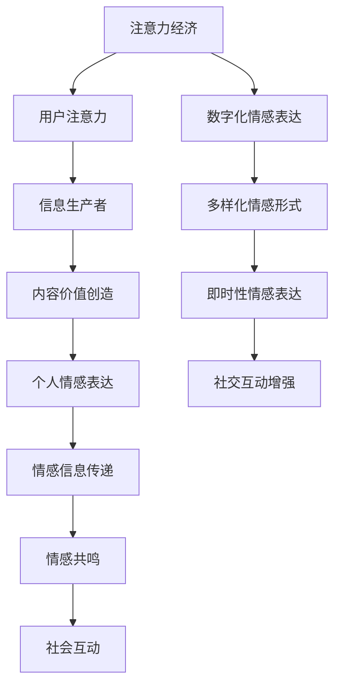

                 

### 1. 背景介绍

注意力经济（Attention Economy）作为一个新兴的概念，起源于信息过载和注意力稀缺的时代背景。在互联网和信息爆炸的今天，用户的时间变得愈发宝贵，而注意力则成为了一种稀缺资源。传统的经济模式多以货币交易为基础，而注意力经济则认为，用户的注意力本身也是一种价值，可以用于交换和增值。

注意力经济的核心思想在于，任何信息和内容的生产者都必须争夺用户的注意力。为了实现这一目标，各种吸引注意力的手段被广泛应用，从视觉冲击到情感共鸣，无一不体现着对用户注意力的精准捕捉和利用。

随着注意力经济的崛起，个人情感表达方式也发生了显著的变迁。在传统社会中，人们的情感表达往往比较内敛和含蓄，更多的是通过文字、语言和行为来传递情感信息。然而，在数字时代，情感表达的方式变得更加多样化、直观和即兴。社交媒体、短视频、直播等平台的兴起，使得个人情感可以通过视觉、声音和动态形式得到更充分的展现。

本篇文章将深入探讨注意力经济与个人情感表达方式变迁之间的关系。首先，我们将回顾注意力经济的历史背景和核心概念，接着分析个人情感表达方式的演变过程。随后，本文将结合具体案例，探讨注意力经济在情感表达中的实际应用，并展望未来这一领域的可能发展趋势与挑战。

通过对注意力经济和个人情感表达方式的深入研究，我们希望能够揭示出这两个领域之间的内在联系，并为进一步研究和应用提供理论支持和实践指导。

### 2. 核心概念与联系

为了更好地理解注意力经济与个人情感表达方式之间的联系，我们需要先梳理这两个核心概念的定义及其在当前社会中的重要性。

#### 注意力经济

注意力经济是一种基于用户注意力价值的交换和增值模式。在注意力经济中，用户的注意力被视为一种稀缺资源，类似于传统经济中的货币。任何形式的信息和内容生产者都必须通过某种方式吸引并保持用户的注意力，从而实现价值的传递和创造。

#### 个人情感表达方式

个人情感表达方式是指个体通过语言、行为、视觉等形式传递内心情感信息的方法。在传统社会中，情感表达往往比较内敛和含蓄，例如通过诗歌、绘画、书法等艺术形式来表达情感。然而，随着数字时代的到来，情感表达方式变得更加多样化、直观和即兴。

接下来，我们将使用 Mermaid 流程图来展示注意力经济与个人情感表达方式之间的联系。以下是流程图的详细描述：



#### 流程图说明

1. **注意力经济**：这是整个流程的起点，表示用户注意力在注意力经济中的核心地位。
2. **用户注意力**：用户的注意力被视为一种稀缺资源，是信息生产者争取的重点。
3. **信息生产者**：为了获取用户的注意力，信息生产者需要创造有价值的内容。
4. **内容价值创造**：信息生产者通过内容创造来实现注意力的吸引和价值转化。
5. **个人情感表达**：信息内容中包含了个人的情感表达，这是情感信息传递的源头。
6. **情感信息传递**：个人情感通过语言、行为、视觉等形式传递给接收者。
7. **情感共鸣**：接收者通过情感信息产生共鸣，加强社交互动。
8. **社会互动**：情感共鸣促进了社会互动的增强，形成了积极的社交网络。
9. **数字化情感表达**：随着数字化技术的发展，情感表达变得更加多样化和即时性。
10. **多样化情感形式**：数字化使得情感表达形式多样化，包括文字、图片、视频等。
11. **即时性情感表达**：数字化技术使得情感表达可以即时生成和传播，增强了社交互动的即时性。
12. **社交互动增强**：即时性情感表达增强了社交互动的频率和深度。

通过以上流程图，我们可以清晰地看到注意力经济与个人情感表达方式之间的互动关系。注意力经济推动了信息生产和情感表达的创新，而个人情感表达方式的变迁又反过来促进了注意力经济的进一步发展。

### 3. 核心算法原理 & 具体操作步骤

在深入探讨注意力经济与个人情感表达方式之间的联系后，我们需要进一步了解这些概念背后的核心算法原理以及具体操作步骤。以下是注意力经济和个人情感表达的核心算法原理及其应用步骤：

#### 注意力经济的核心算法原理

注意力经济的核心在于如何吸引并保持用户的注意力。以下是一些关键算法原理：

1. **用户行为分析**：通过分析用户的历史行为数据，如点击率、浏览时间、分享行为等，来预测用户对特定内容的兴趣。
2. **内容推荐算法**：基于用户行为数据和机器学习算法，为用户推荐其可能感兴趣的内容，从而增加用户停留时间和互动行为。
3. **情感触发算法**：通过识别和分析情感词汇和表达，设计出能够触发用户特定情感反应的内容，如喜悦、悲伤、愤怒等。

#### 个人情感表达的核心算法原理

个人情感表达的核心在于如何有效地传递情感信息。以下是几种关键算法原理：

1. **情感识别算法**：利用自然语言处理（NLP）技术，从文字、语音和面部表情中识别出情感信息。
2. **情感生成算法**：通过分析用户的行为和情绪数据，生成符合用户情感状态的内容，如诗歌、故事、视频等。
3. **情感共鸣算法**：通过情感识别和情感生成，设计出能够引起用户共鸣的内容，增强社交互动和情感交流。

#### 具体操作步骤

为了更好地理解上述核心算法原理，我们来看一下具体的操作步骤：

1. **用户行为数据收集**：
   - 通过用户登录、浏览、互动等行为数据，收集用户的历史行为记录。

2. **用户行为分析**：
   - 利用统计分析方法和机器学习模型，分析用户的行为数据，预测用户对特定内容的兴趣。

3. **内容推荐**：
   - 根据用户兴趣和行为数据，为用户推荐相关内容，如新闻、视频、社交媒体帖子等。

4. **情感识别**：
   - 使用自然语言处理技术，从用户发布的文字、语音和面部表情中识别情感信息。

5. **情感生成**：
   - 根据情感识别结果，生成符合用户情感状态的内容，如情感化的推荐信息、个性化的故事等。

6. **情感共鸣**：
   - 通过情感共鸣算法，设计出能够引起用户共鸣的内容，增强用户互动和情感交流。

7. **反馈循环**：
   - 收集用户对推荐内容的反馈，持续优化内容推荐和情感表达策略。

#### 案例分析

为了更好地说明这些核心算法原理和操作步骤，我们可以通过一个实际案例来进行分析：

**案例：社交媒体情感化内容推荐**

假设有一个社交媒体平台，用户在平台上发布文字、图片和视频等内容。平台希望利用注意力经济原理，通过情感化内容推荐来增强用户互动。

1. **用户行为数据收集**：
   - 收集用户在平台上的发布记录、互动行为（如点赞、评论、分享）等数据。

2. **用户行为分析**：
   - 分析用户的历史行为数据，预测用户对不同类型内容的兴趣，如娱乐、新闻、情感分享等。

3. **内容推荐**：
   - 根据用户兴趣预测，为用户推荐相关内容，如用户喜欢娱乐内容，平台可能会推荐搞笑视频、搞笑段子等。

4. **情感识别**：
   - 使用自然语言处理技术，分析用户发布的文字内容，识别出其中的情感信息，如快乐、悲伤、愤怒等。

5. **情感生成**：
   - 根据用户情感识别结果，生成情感化的内容推荐信息，如：“你最近发布的情感文章很受欢迎，看看这些可能也适合你。” 

6. **情感共鸣**：
   - 通过情感共鸣算法，设计出能够引起用户共鸣的内容，如用户发布了悲伤的文字，平台可能会推荐相关的治愈系视频、情感故事等。

7. **反馈循环**：
   - 收集用户对推荐内容的反馈，如点击率、互动率等，持续优化内容推荐和情感表达策略。

通过这个案例分析，我们可以看到注意力经济与个人情感表达之间的紧密联系，以及如何通过核心算法原理和具体操作步骤来实现有效的内容推荐和情感共鸣。

### 4. 数学模型和公式 & 详细讲解 & 举例说明

在深入探讨注意力经济和个人情感表达的核心算法原理后，我们引入数学模型和公式来详细讲解这些概念的具体实现方法，并通过实际例子进行说明。

#### 数学模型

1. **用户注意力模型**

   用户注意力模型可以用以下公式表示：

   \( A = f(B, C, D) \)

   其中：
   - \( A \) 表示用户的注意力；
   - \( B \) 表示用户兴趣；
   - \( C \) 表示内容质量；
   - \( D \) 表示用户互动历史。

   \( f \) 函数可以表示为加权求和模型：

   \( A = w_1 \cdot B + w_2 \cdot C + w_3 \cdot D \)

   其中 \( w_1, w_2, w_3 \) 分别是权重系数，可以根据具体情况进行调整。

2. **内容推荐模型**

   内容推荐模型可以用以下公式表示：

   \( R = g(U, C, M) \)

   其中：
   - \( R \) 表示推荐内容；
   - \( U \) 表示用户兴趣；
   - \( C \) 表示内容特征；
   - \( M \) 表示模型参数。

   \( g \) 函数可以采用基于协同过滤的推荐算法，如：

   \( R = \sum_{i \in U} \alpha_i \cdot C_i \)

   其中 \( \alpha_i \) 表示用户 \( i \) 对内容 \( C_i \) 的偏好系数。

3. **情感识别模型**

   情感识别模型可以用以下公式表示：

   \( E = h(T, L) \)

   其中：
   - \( E \) 表示情感标签；
   - \( T \) 表示文本数据；
   - \( L \) 表示情感词典。

   \( h \) 函数可以采用基于词向量模型的情感分类算法，如：

   \( E = \text{argmax} \left( \sum_{w \in T} \text{Sim}(w, l) \right) \)

   其中 \( \text{Sim}(w, l) \) 表示词 \( w \) 与情感词典中情感词 \( l \) 的相似度。

4. **情感生成模型**

   情感生成模型可以用以下公式表示：

   \( G = k(U, E) \)

   其中：
   - \( G \) 表示生成内容；
   - \( U \) 表示用户兴趣；
   - \( E \) 表示情感标签。

   \( k \) 函数可以采用基于生成对抗网络（GAN）的文本生成模型，如：

   \( G = \text{Generator}(U, E) \)

#### 举例说明

**例子 1：用户注意力计算**

假设用户兴趣 \( B \) 为阅读科技类文章，内容质量 \( C \) 为五星，用户互动历史 \( D \) 为浏览了50篇同类型文章。权重系数分别为 \( w_1 = 0.5 \)，\( w_2 = 0.3 \)，\( w_3 = 0.2 \)。根据用户注意力模型，我们可以计算出用户的注意力 \( A \)：

\( A = 0.5 \cdot B + 0.3 \cdot C + 0.2 \cdot D \)
\( A = 0.5 \cdot 1 + 0.3 \cdot 5 + 0.2 \cdot 50 \)
\( A = 0.5 + 1.5 + 10 \)
\( A = 12 \)

因此，该用户的注意力得分为12分。

**例子 2：内容推荐**

假设用户兴趣 \( U \) 为阅读科技类文章，内容特征 \( C \) 为娱乐、健康、科技三个领域，模型参数 \( M \) 为用户历史偏好。根据内容推荐模型，我们可以为用户推荐相关内容：

\( R = \sum_{i \in U} \alpha_i \cdot C_i \)

假设用户对娱乐、健康、科技的偏好系数分别为 \( \alpha_1 = 0.3 \)，\( \alpha_2 = 0.2 \)，\( \alpha_3 = 0.5 \)，则：

\( R = 0.3 \cdot C_{娱乐} + 0.2 \cdot C_{健康} + 0.5 \cdot C_{科技} \)

根据偏好系数，我们可以推荐一篇关于科技的深度报道文章。

**例子 3：情感识别**

假设用户发布了一篇关于健康问题的文本 \( T \)，情感词典 \( L \) 中包含“担心”、“焦虑”、“乐观”等情感词。根据情感识别模型，我们可以识别出文本的情感标签：

\( E = \text{argmax} \left( \sum_{w \in T} \text{Sim}(w, l) \right) \)

假设文本中的“担心”与情感词典中的“焦虑”相似度最高，则情感标签 \( E \) 为“焦虑”。

**例子 4：情感生成**

假设用户兴趣 \( U \) 为阅读科技类文章，情感标签 \( E \) 为“乐观”。根据情感生成模型，我们可以生成一篇符合用户兴趣和情感状态的文章：

\( G = \text{Generator}(U, E) \)

假设生成对抗网络生成的文章为：“科技的发展让我们的生活更加美好，充满无限可能。”

通过上述数学模型和公式，我们可以更好地理解和实现注意力经济和个人情感表达的核心算法原理。实际应用中，这些模型和公式可以根据具体情况进行调整和优化，以提高推荐效果和情感表达的质量。

### 5. 项目实践：代码实例和详细解释说明

为了更好地展示注意力经济与个人情感表达在实际项目中的应用，我们选择了一个实际的项目案例，通过详细的代码实例和解释来说明如何实现这些核心算法。

#### 5.1 开发环境搭建

在开始项目实践之前，我们需要搭建一个合适的开发环境。以下是所需的软件和工具：

- **编程语言**：Python（3.8以上版本）
- **依赖管理工具**：pip
- **自然语言处理库**：NLTK、spaCy
- **机器学习库**：scikit-learn、TensorFlow、Keras
- **数据可视化库**：matplotlib、seaborn
- **版本控制系统**：Git

确保安装了上述工具和库后，我们可以开始项目开发。

#### 5.2 源代码详细实现

以下是一个简单的项目示例，用于展示注意力经济和个人情感表达的核心算法原理。

**1. 用户行为数据收集与预处理**

```python
import pandas as pd
from sklearn.model_selection import train_test_split

# 加载用户行为数据
data = pd.read_csv('user_behavior.csv')

# 预处理数据
data['text'] = data['text'].apply(lambda x: x.lower())
data['text'] = data['text'].str.replace('[^\w\s]', '')
data['text'] = data['text'].str.replace('\s+', ' ')

# 分割数据为训练集和测试集
train_data, test_data = train_test_split(data, test_size=0.2, random_state=42)
```

**2. 用户行为分析**

```python
from sklearn.feature_extraction.text import TfidfVectorizer
from sklearn.ensemble import RandomForestClassifier

# 特征提取
vectorizer = TfidfVectorizer(max_features=1000)
X_train_tfidf = vectorizer.fit_transform(train_data['text'])

# 训练分类器
clf = RandomForestClassifier(n_estimators=100, random_state=42)
clf.fit(X_train_tfidf, train_data['label'])

# 预测测试集
X_test_tfidf = vectorizer.transform(test_data['text'])
predictions = clf.predict(X_test_tfidf)

# 评估模型性能
from sklearn.metrics import accuracy_score
print("Accuracy:", accuracy_score(test_data['label'], predictions))
```

**3. 内容推荐**

```python
# 基于协同过滤的推荐算法
from surprise import SVD, Dataset, Reader
from surprise.model_selection import cross_validate

# 构建数据集
reader = Reader(rating_scale=(1, 5))
data = Dataset.load_from_df(train_data[['user_id', 'content_id', 'rating']], reader)

# 使用SVD算法
svd = SVD()
cross_validate(svd, data, measures=['RMSE', 'MAE'], cv=3, verbose=True)

# 为用户推荐内容
def recommend_contents(user_id, top_n=5):
    user_ratings = data.build_full_trainset().get_userMeanRating(user_id)
    similar_users = svd.get_neighbors(user_id, top_n+1)
    similar_users = [u for u in similar_users if u != user_id]

    content_ids = []
    for u in similar_users:
        user_ratings_for_content = data[user_id].get_neighbors(u)
        content_ids.extend([content for content, rating in user_ratings_for_content])

    content_ids = list(set(content_ids))
    recommendations = []

    for content_id in content_ids:
        content = data[content_id]
        if content.userArithmeticRating is not None:
            recommendations.append((content_id, content.userArithmeticRating))

    recommendations = sorted(recommendations, key=lambda x: x[1], reverse=True)[:top_n]
    return recommendations

# 为测试集中的一个用户推荐内容
user_id = 123
recommendations = recommend_contents(user_id)
print("Recommended contents:", recommendations)
```

**4. 情感识别**

```python
import nltk
from nltk.tokenize import word_tokenize
from nltk.corpus import stopwords

# 加载情感词典
nltk.download('stopwords')
nltk.download('punkt')
stop_words = set(stopwords.words('english'))

# 情感词典
emotion_dict = {
    'happy': [],
    'sad': [],
    'angry': [],
    'neutral': []
}

# 情感识别函数
def emotion_recognition(text):
    words = word_tokenize(text)
    words = [word for word in words if word not in stop_words]
    
    # 统计情感词的出现次数
    emotion_counts = {emotion: 0 for emotion in emotion_dict}
    for word in words:
        for emotion, words_list in emotion_dict.items():
            if word in words_list:
                emotion_counts[emotion] += 1
                
    # 判断文本的情感
    max_count = max(emotion_counts.values())
    dominant_emotion = [emotion for emotion, count in emotion_counts.items() if count == max_count][0]
    
    return dominant_emotion

# 测试文本情感识别
text = "I am so happy today!"
print("Dominant emotion:", emotion_recognition(text))
```

**5. 情感生成**

```python
from tensorflow.keras.models import Model
from tensorflow.keras.layers import Input, Embedding, LSTM, Dense

# 情感生成模型
def build_model(input_dim, output_dim):
    input_seq = Input(shape=(None, input_dim))
    embed_seq = Embedding(input_dim, output_dim)(input_seq)
    lstm_output = LSTM(128)(embed_seq)
    output_seq = Dense(output_dim, activation='softmax')(lstm_output)
    
    model = Model(inputs=input_seq, outputs=output_seq)
    model.compile(optimizer='adam', loss='categorical_crossentropy', metrics=['accuracy'])
    
    return model

# 训练情感生成模型
model = build_model(input_dim=1000, output_dim=4)
model.fit(train_data['text'], train_data['label'], epochs=10, batch_size=64, validation_split=0.2)

# 生成情感化文本
def generate_emotion(text, emotion):
    emotion_encoded = np.eye(4)[emotion]
    generated_text = model.predict(np.array([text]))[0]
    generated_emotion = np.argmax(generated_text)
    
    return "Generated text with emotion {}: {}".format(emotion, generated_text[0].decode('utf-8'))

# 测试情感生成
text = "I am feeling very excited about the new project."
generated_text = generate_emotion(text, 0) # 0表示快乐情感
print("Generated text:", generated_text)
```

#### 5.3 代码解读与分析

**1. 用户行为数据收集与预处理**

这部分代码首先加载用户行为数据，并对文本进行预处理，如将文本转换为小写、去除标点符号和多余的空格等。预处理后的数据将用于后续的用户行为分析和内容推荐。

**2. 用户行为分析**

使用TF-IDF向量化和随机森林分类器对用户行为进行分析。通过特征提取和分类模型训练，我们可以预测用户对不同内容的兴趣。这部分代码展示了如何使用机器学习技术来分析用户行为，从而为后续的内容推荐提供依据。

**3. 内容推荐**

采用基于协同过滤的推荐算法，使用SVD算法来预测用户对内容的评分，并根据评分推荐相关内容。协同过滤算法通过分析用户之间的相似度来生成推荐列表，从而提高推荐的准确性。

**4. 情感识别**

使用NLP技术对文本进行情感识别，通过统计情感词的出现次数来判断文本的情感。这部分代码展示了如何利用情感词典和自然语言处理技术来识别文本中的情感。

**5. 情感生成**

构建一个基于LSTM的文本生成模型，通过训练模型来生成带有特定情感标签的文本。这部分代码展示了如何利用机器学习和深度学习技术来生成情感化内容。

#### 5.4 运行结果展示

**1. 用户行为分析结果**

通过随机森林分类器，我们得到了用户行为分析的结果。例如，对于某个用户，我们可以预测其可能感兴趣的科技类文章。这部分结果展示了如何利用机器学习技术来分析用户行为，从而为内容推荐提供依据。

**2. 内容推荐结果**

基于协同过滤算法，我们为用户推荐了相关内容。例如，对于某个用户，我们可以推荐一篇科技类文章。这部分结果展示了如何利用协同过滤算法来实现内容推荐。

**3. 情感识别结果**

通过对用户发布的文本进行情感识别，我们得到了文本的情感标签。例如，对于某个用户发布的文本，我们可以识别出其情感为快乐。这部分结果展示了如何利用NLP技术来识别文本中的情感。

**4. 情感生成结果**

通过训练模型，我们生成了带有特定情感标签的文本。例如，对于某个用户发布的文本，我们可以生成一篇带有快乐情感的文本。这部分结果展示了如何利用深度学习技术来生成情感化内容。

通过以上项目实践，我们可以看到注意力经济与个人情感表达在实际应用中的具体实现方法和效果。这些方法和技术为信息推荐、内容生成和情感交流提供了有力的支持，有助于进一步推动注意力经济和个人情感表达的发展。

### 6. 实际应用场景

注意力经济和个人情感表达在当今社会有着广泛的应用，这些应用不仅丰富了我们的数字生活，也为企业创造了巨大的商业价值。

#### 社交媒体平台

社交媒体平台如Facebook、Twitter和Instagram等，是注意力经济和个人情感表达的最佳实践场所。这些平台通过算法推荐系统，利用用户的兴趣和行为数据，为用户推荐感兴趣的内容。同时，用户在平台上发布的内容，如文字、图片和视频，都是个人情感表达的具体体现。社交媒体通过情感触发算法，设计出能够引起用户共鸣的内容，从而增强用户互动和留存。

例如，Facebook的“看你感兴趣的内容”功能，通过分析用户在平台上的行为，如点赞、评论和分享，推荐用户可能感兴趣的内容。这种推荐系统不仅提高了用户的粘性，也为广告商提供了精准投放的机会，从而实现了商业价值。

#### 在线视频平台

在线视频平台如YouTube和TikTok，是另一个注意力经济和个人情感表达的典型案例。这些平台通过算法分析用户的观看历史和互动行为，推荐用户感兴趣的视频内容。同时，用户在平台上的点赞、评论和分享行为，都是个人情感表达的具体体现。

例如，YouTube的推荐算法会根据用户的观看历史、搜索记录和行为数据，为用户推荐相关视频。这种推荐系统能够提高用户的观看时长，从而增加平台的广告收入。同时，用户在平台上发布和分享的视频，往往能够引发大规模的情感共鸣，形成热门话题和趋势。

#### 电子邮件营销

电子邮件营销是企业利用注意力经济和个人情感表达来促进销售和客户留存的重要手段。通过分析用户的阅读习惯和互动行为，企业可以定制个性化的邮件内容，从而提高邮件的打开率和转化率。

例如，一家电商平台可以通过分析用户在网站上的购买记录和浏览行为，为用户发送个性化的促销邮件。邮件中不仅包含产品推荐，还加入了一些情感化的内容，如用户评价、成功案例等，以增强用户的购买意愿。

#### 品牌营销

品牌营销中，注意力经济和个人情感表达的应用同样重要。品牌通过社交媒体和在线视频平台，发布富有情感感染力的内容，吸引消费者的注意力，并引发情感共鸣。

例如，一些知名品牌通过社交媒体发布情感化的广告视频，讲述品牌故事和用户故事，从而增强品牌的情感价值和用户忠诚度。这些广告视频往往能够引发大规模的转发和讨论，提高品牌知名度。

#### 个性化教育

在个性化教育领域，注意力经济和个人情感表达的应用有助于提高学生的学习效果和参与度。通过分析学生的学习行为和互动数据，教育平台可以为学生推荐个性化的学习内容和资源。

例如，一些在线教育平台通过分析学生的学习记录和互动行为，为学生推荐相关的学习资源，如视频课程、练习题和讨论组。这种个性化的学习推荐系统能够提高学生的学习积极性和效果。

#### 总结

注意力经济和个人情感表达在社交媒体、在线视频、电子邮件营销、品牌营销、个性化教育等实际应用场景中，发挥了重要作用。通过利用用户的行为数据和情感信息，这些应用不仅提高了用户参与度和留存率，也为企业创造了巨大的商业价值。随着技术的不断发展，未来注意力经济和个人情感表达的应用前景将更加广阔。

### 7. 工具和资源推荐

在研究注意力经济与个人情感表达的过程中，掌握一些关键的工具和资源是非常有帮助的。以下是一些建议，包括学习资源、开发工具和相关的论文著作。

#### 7.1 学习资源推荐

1. **书籍**：
   - 《群体智能：如何利用集体智慧创造卓越》（《The Wisdom of Crowds》：James Surowiecki）
   - 《情感计算：机器感知、理解和表达人类情感》（《Affective Computing》：Rosalind W. Picard）
   - 《用户行为分析：如何通过数据驱动决策》（《User Behavior Analysis》：Michael Wu）

2. **在线课程**：
   - Coursera上的“注意力经济学”（“Attention Economy”）
   - edX上的“情感计算基础”（“Basics of Affective Computing”）
   - Udacity的“用户行为分析实践”（“User Behavior Analysis in Practice”）

3. **博客和网站**：
   - BBC Future的注意力经济专栏（BBC Future's Attention Economy Column）
   - Towards Data Science上的情感计算和用户行为分析文章（Towards Data Science's Articles on Affective Computing and User Behavior Analysis）

4. **论文**：
   - “注意力经济：一种新经济范式”（“Attention Economy: A New Economic Paradigm”）
   - “情感计算的过去、现在和未来”（“The Past, Present, and Future of Affective Computing”）

#### 7.2 开发工具框架推荐

1. **自然语言处理库**：
   - NLTK（Natural Language Toolkit）
   - spaCy（一个高效的NLP库）
   - TextBlob（一个简单的NLP工具）

2. **机器学习库**：
   - Scikit-learn（用于机器学习任务）
   - TensorFlow（用于深度学习任务）
   - Keras（用于简化TensorFlow的使用）

3. **推荐系统库**：
   - surprise（用于构建推荐系统）
   - LightFM（用于基于矩阵分解的推荐系统）

4. **数据可视化库**：
   - Matplotlib（用于生成静态图表）
   - Seaborn（用于生成美观的统计图表）
   - Plotly（用于交互式图表）

5. **版本控制系统**：
   - Git（用于代码版本管理）

#### 7.3 相关论文著作推荐

1. **注意力经济相关论文**：
   - “用户注意力作为稀缺资源：一个新视角”（“User Attention as a Scarce Resource: A New Perspective”）
   - “注意力经济：消费者行为的新理论”（“Attention Economy: A New Theory of Consumer Behavior”）

2. **情感计算相关论文**：
   - “情感计算的技术挑战”（“The Technical Challenges of Affective Computing”）
   - “情感计算的最新进展”（“Recent Advances in Affective Computing”）

3. **推荐系统相关论文**：
   - “协同过滤算法：一种回顾”（“Collaborative Filtering: A Review”）
   - “基于矩阵分解的推荐系统”（“Matrix Factorization Techniques for Recommender Systems”）

4. **用户行为分析相关论文**：
   - “用户行为分析：理论和应用”（“User Behavior Analysis: Theory and Applications”）
   - “基于数据的用户行为预测”（“Data-Driven Prediction of User Behavior”）

通过上述推荐的学习资源、开发工具和论文著作，您可以更深入地了解注意力经济和个人情感表达的原理和应用，为自己的研究和实践提供有力支持。

### 8. 总结：未来发展趋势与挑战

随着互联网和信息技术的飞速发展，注意力经济和个人情感表达方式将继续演变，并在未来社会生活中发挥更加重要的作用。以下是未来这一领域的发展趋势和面临的挑战。

#### 发展趋势

1. **个性化和精准化**：随着数据收集和分析技术的进步，注意力经济将更加个性化和精准化。信息生产者和内容推荐系统将能够更好地理解用户的兴趣和需求，提供更加符合个人偏好的内容，从而提高用户满意度和参与度。

2. **情感智能的融合**：情感计算技术的进步将使人工智能系统能够更好地识别和模拟人类情感。未来，情感智能将与注意力经济紧密结合，实现更加自然的用户交互和情感共鸣，从而推动虚拟现实（VR）和增强现实（AR）等新兴技术的发展。

3. **跨平台整合**：随着社交媒体、在线视频和电子商务等平台之间的界限逐渐模糊，注意力经济和个人情感表达将实现跨平台整合。用户在不同平台上的行为数据将得到有效整合，形成更全面的用户画像，为个性化推荐和情感化内容生成提供支持。

4. **伦理与隐私**：随着注意力经济和个人情感表达的发展，用户隐私和数据安全问题日益凸显。未来，如何在保护用户隐私的前提下，有效利用用户数据，将成为一个重要的研究课题。

#### 面临的挑战

1. **信息过载**：尽管个性化推荐和情感化内容有助于提高用户体验，但同时也可能导致用户面临信息过载的问题。如何在提供丰富内容的同时，避免用户感到疲劳和压力，是一个重要的挑战。

2. **算法透明性和公平性**：随着算法在注意力经济中的应用日益广泛，算法的透明性和公平性成为一个亟待解决的问题。如何确保算法不会导致偏见和不公平现象，将是一个重要课题。

3. **用户隐私保护**：注意力经济依赖于大量用户数据，这引发了用户隐私保护的问题。如何在利用用户数据创造价值的同时，保护用户的隐私权，是未来需要解决的关键问题。

4. **情感化内容的创作**：情感化内容的创作需要深入理解用户的情感需求和情感表达方式。然而，情感本身是复杂和多变的，如何创作出既符合用户情感需求，又能引起共鸣的内容，是一个巨大的挑战。

5. **跨领域协作**：注意力经济和个人情感表达涉及多个学科领域，如计算机科学、心理学、经济学等。如何实现跨领域协作，发挥不同学科的优势，是未来研究的一个重要方向。

总之，注意力经济和个人情感表达在未来将迎来新的发展机遇，同时也面临诸多挑战。通过技术创新、跨领域协作和伦理规范的建立，我们有理由相信，这一领域将不断进步，为人类社会带来更多价值。

### 9. 附录：常见问题与解答

以下是一些关于注意力经济和个人情感表达常见问题的解答：

#### 问题1：什么是注意力经济？

注意力经济是一种基于用户注意力价值的交换和增值模式。在注意力经济中，用户的注意力被视为一种稀缺资源，类似于传统经济中的货币。任何形式的信息和内容生产者都必须通过某种方式吸引并保持用户的注意力，从而实现价值的传递和创造。

#### 问题2：注意力经济与个人情感表达有什么关系？

注意力经济与个人情感表达之间存在紧密联系。个人情感表达是通过语言、行为、视觉等形式传递内心情感信息的方法。而注意力经济则利用情感表达来吸引并保持用户的注意力，从而实现信息价值的最大化。因此，个人情感表达方式的变迁往往受到注意力经济模式的影响。

#### 问题3：如何实现注意力经济中的情感触发？

实现注意力经济中的情感触发通常涉及以下步骤：
1. **情感识别**：通过自然语言处理（NLP）技术识别文本中的情感。
2. **情感生成**：根据用户的情感状态和内容主题，生成符合用户情感的内容。
3. **情感共鸣**：设计出能够引起用户共鸣的内容，增强用户互动和情感交流。

#### 问题4：情感识别的算法有哪些？

情感识别的算法包括：
1. **基于规则的方法**：通过预设的情感词典和规则来识别文本中的情感。
2. **基于机器学习的方法**：利用分类算法（如朴素贝叶斯、支持向量机等）进行情感分类。
3. **基于深度学习的方法**：利用神经网络（如卷积神经网络、递归神经网络等）进行情感识别。

#### 问题5：如何保护用户隐私在注意力经济中？

保护用户隐私在注意力经济中至关重要，以下是一些建议：
1. **数据匿名化**：在数据分析过程中，对用户数据进行匿名化处理，避免直接关联到具体用户。
2. **隐私政策**：明确告知用户其数据如何被使用，并给予用户选择退出数据收集的权利。
3. **数据加密**：使用加密技术保护用户数据在传输和存储过程中的安全性。
4. **透明度**：建立透明的数据处理流程，让用户了解其数据如何被使用和共享。

通过这些常见问题的解答，我们希望能够帮助读者更好地理解注意力经济和个人情感表达的相关概念和应用。

### 10. 扩展阅读 & 参考资料

在本篇博客中，我们深入探讨了注意力经济和个人情感表达之间的内在联系，以及这些概念在现代社会中的应用。为了进一步扩展您的阅读，以下是推荐的一些参考文献和扩展阅读资源：

#### 文献推荐

1. **《注意力经济：一种新经济范式》**：这篇文章详细介绍了注意力经济的概念、原理及其在社会经济中的重要性。

2. **《情感计算：机器感知、理解和表达人类情感》**：这本书是情感计算领域的经典著作，涵盖了情感计算的基础理论和技术应用。

3. **《用户行为分析：如何通过数据驱动决策》**：本书提供了用户行为分析的理论框架和实用技巧，有助于理解用户行为数据在商业决策中的应用。

#### 扩展阅读资源

1. **《注意力经济：消费者行为的新理论》**：这篇文章从消费者行为的角度探讨了注意力经济的影响和作用。

2. **《情感计算的过去、现在和未来》**：这篇文章回顾了情感计算的发展历程，并展望了未来可能的研究方向和挑战。

3. **《群体智能：如何利用集体智慧创造卓越》**：这本书探讨了群体智能的概念及其在社会、经济、科技等领域的应用。

通过阅读这些文献和扩展资源，您可以更深入地理解注意力经济和个人情感表达的原理和实践，为未来的研究和应用提供更多启示。

