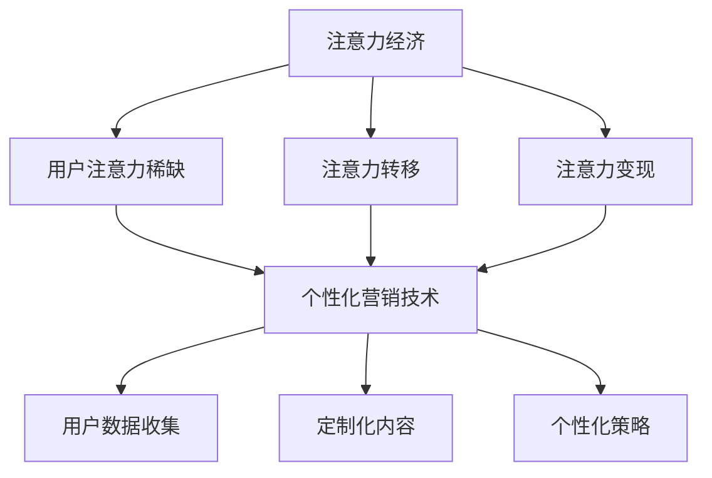

                 

### 文章标题

注意力经济与个性化营销技术：为受众创建定制、有针对性的体验

> 关键词：注意力经济、个性化营销、用户体验、定制化、针对性、数据驱动、人工智能、机器学习、推荐系统、用户行为分析

> 摘要：本文将深入探讨注意力经济和个性化营销技术的核心概念，以及它们如何为企业和用户创造更高效、更有价值的互动体验。我们将从背景介绍开始，逐步分析核心概念、算法原理、数学模型、实际应用场景，并推荐相关工具和资源，最后总结未来发展趋势与挑战。

### 1. 背景介绍

随着互联网的飞速发展，信息的爆炸式增长使得用户的注意力资源变得尤为珍贵。在这个信息过载的时代，如何有效地吸引并保持用户的注意力成为了企业和营销人员面临的一大挑战。注意力经济（Attention Economy）应运而生，它指的是在信息社会中，用户注意力成为一种稀缺资源，企业和个人通过争夺用户的注意力来获取经济利益的经济学概念。

个性化营销（Personalized Marketing）则是基于用户数据的收集和分析，通过定制化的内容和营销策略，提高用户满意度和转化率的一种营销方法。随着大数据和人工智能技术的不断发展，个性化营销已经从一种理念转变为现实，成为了现代营销策略中的重要组成部分。

在这篇文章中，我们将探讨注意力经济和个性化营销技术的核心概念、算法原理、数学模型和实际应用场景，并推荐一些相关的工具和资源，帮助企业和营销人员更好地理解和应用这些技术。

### 2. 核心概念与联系

#### 注意力经济

注意力经济的核心概念可以概括为：在信息社会中，用户的注意力成为一种稀缺资源，企业和个人通过争夺用户的注意力来获取经济利益。其基本原理可以归纳为以下几个方面：

1. **注意力稀缺性**：在信息过载的时代，用户的注意力资源变得非常有限，因此如何吸引并保持用户的注意力成为企业竞争的关键。
2. **注意力转移**：用户在消费信息时，会根据自身的需求和兴趣选择关注某些内容，而忽视其他内容，这种选择过程就是一种注意力转移。
3. **注意力变现**：企业通过吸引和保持用户的注意力，将其转化为商业价值，例如广告收入、用户付费等。

#### 个性化营销

个性化营销是基于用户数据的收集和分析，通过定制化的内容和营销策略，提高用户满意度和转化率的一种营销方法。其核心概念包括以下几个方面：

1. **用户数据**：个性化营销的基础是用户数据的收集和分析，包括用户的行为、兴趣、偏好等。
2. **定制化内容**：根据用户数据，为每个用户创建个性化的内容，满足其特定需求。
3. **个性化策略**：通过分析用户数据，制定个性化的营销策略，提高营销效果。

#### 注意力经济与个性化营销的联系

注意力经济和个性化营销技术之间存在着紧密的联系。个性化营销技术可以帮助企业更好地理解和满足用户的需求，从而吸引和保持用户的注意力。具体来说，这种联系可以从以下几个方面体现：

1. **用户注意力**：个性化营销技术通过分析用户数据，了解用户的需求和兴趣，为用户提供个性化的内容和体验，从而吸引和保持用户的注意力。
2. **数据驱动**：注意力经济强调数据的重要性，个性化营销技术则通过数据分析和挖掘，为用户提供更加精准、高效的服务，实现数据的驱动。
3. **商业价值**：个性化营销技术可以帮助企业更好地抓住用户的注意力，从而实现商业价值的最大化。

#### Mermaid 流程图



### 3. 核心算法原理 & 具体操作步骤

#### 用户行为分析

用户行为分析是个性化营销技术的核心步骤，通过分析用户的行为数据，了解用户的需求和兴趣。具体操作步骤如下：

1. **数据收集**：收集用户在网站、移动应用等渠道上的行为数据，包括浏览记录、购买记录、点击行为等。
2. **数据预处理**：对收集到的数据进行清洗、去重、归一化等预处理操作，以便后续的分析。
3. **特征提取**：根据业务需求，提取用户行为数据中的关键特征，如浏览时长、购买频次、点击率等。
4. **行为分析**：使用统计学、机器学习等方法，对用户行为数据进行深入分析，了解用户的需求和兴趣。

#### 推荐系统

推荐系统是个性化营销技术的重要组成部分，通过向用户推荐其可能感兴趣的内容或产品，提高用户的满意度和转化率。具体操作步骤如下：

1. **内容或产品数据**：收集各种内容或产品数据，包括文本、图像、视频等。
2. **数据预处理**：对内容或产品数据进行预处理，如文本清洗、图像标注等。
3. **特征提取**：提取内容或产品数据中的关键特征，如文本中的关键词、图像中的颜色分布等。
4. **推荐算法**：选择合适的推荐算法，如基于内容的推荐、基于协同过滤的推荐等，根据用户的行为数据生成推荐结果。
5. **推荐结果**：将推荐结果展示给用户，如推荐文章、推荐商品等。

#### 用户画像

用户画像是个性化营销技术中的一种重要工具，通过对用户的基本信息、行为数据、兴趣标签等进行综合分析，构建出用户的完整画像。具体操作步骤如下：

1. **数据收集**：收集用户的基本信息，如年龄、性别、地理位置等。
2. **行为数据分析**：分析用户在网站、移动应用等渠道上的行为数据，了解用户的行为模式。
3. **兴趣标签**：根据用户的行为数据和基本信息，为用户打上相应的兴趣标签。
4. **画像构建**：将用户的基本信息、行为数据和兴趣标签进行整合，构建出用户的完整画像。

### 4. 数学模型和公式 & 详细讲解 & 举例说明

#### 用户行为分析

用户行为分析中常用的数学模型包括统计模型和机器学习模型。以下是一个简单的统计模型示例：

$$
P(行为 = y | 特征 = x) = \frac{P(行为 = y) \cdot P(特征 = x | 行为 = y)}{P(特征 = x)}
$$

其中，$P(行为 = y | 特征 = x)$表示在给定特征$x$的条件下，用户发生行为$y$的概率；$P(行为 = y)$表示用户发生行为$y$的整体概率；$P(特征 = x | 行为 = y)$表示在用户发生行为$y$的条件下，特征$x$出现的概率；$P(特征 = x)$表示特征$x$出现的整体概率。

例如，假设我们想要分析用户在浏览电商网站时购买某种商品的倾向。我们可以收集用户在网站上的浏览记录、购买记录等数据，并提取出与购买行为相关的特征，如浏览时长、购买频次等。然后，我们可以使用上述统计模型来计算在给定这些特征的条件下，用户购买某种商品的概率。

#### 推荐系统

推荐系统中常用的数学模型包括基于内容的推荐模型和基于协同过滤的推荐模型。以下是一个简单的基于内容的推荐模型示例：

$$
\begin{cases}
\text{相似度} = \text{余弦相似度}(X, Y) \\
\text{推荐得分} = \sum_{i} X_i \cdot Y_i \cdot \text{相似度}
\end{cases}
$$

其中，$X$和$Y$分别表示两个用户或物品的向量表示；$X_i$和$Y_i$分别表示用户或物品在某一特征上的取值；$\text{相似度}$表示用户或物品之间的相似度；$\text{推荐得分}$表示用户对物品的偏好程度。

例如，假设我们有两个用户$A$和$B$，以及两个物品$X$和$Y$。我们可以通过计算用户$A$和$B$在各个特征上的相似度，以及物品$X$和$Y$在各个特征上的相似度，来生成一个推荐得分矩阵。然后，我们可以根据推荐得分矩阵为用户$A$推荐物品$Y$。

#### 用户画像

用户画像中常用的数学模型包括聚类分析和回归分析。以下是一个简单的聚类分析示例：

$$
\begin{cases}
\text{距离} = \sqrt{\sum_{i} (x_i - \mu_i)^2} \\
\text{聚类中心} = \frac{1}{N} \sum_{i=1}^{N} x_i
\end{cases}
$$

其中，$x_i$表示第$i$个用户的特征向量；$\mu_i$表示第$i$个聚类中心的特征向量；$N$表示聚类中心的总数；$\text{距离}$表示用户与聚类中心之间的距离。

例如，假设我们有100个用户，每个用户有10个特征。我们可以通过计算每个用户与聚类中心的距离，将用户划分为不同的聚类。然后，我们可以根据聚类结果为用户打上相应的标签。

### 5. 项目实践：代码实例和详细解释说明

在本节中，我们将通过一个简单的项目实例，展示如何使用注意力经济和个性化营销技术来创建一个推荐系统。我们将使用Python编程语言，结合Scikit-learn和TensorFlow等库来实现该项目。

#### 5.1 开发环境搭建

在开始编写代码之前，我们需要搭建一个适合项目开发的环境。以下是搭建开发环境所需的步骤：

1. 安装Python：从Python官网（https://www.python.org/）下载并安装Python。
2. 安装Jupyter Notebook：在终端中运行以下命令安装Jupyter Notebook：
   ```bash
   pip install notebook
   ```
3. 安装相关库：在终端中运行以下命令安装Scikit-learn、TensorFlow和Numpy等库：
   ```bash
   pip install scikit-learn tensorflow numpy
   ```

#### 5.2 源代码详细实现

以下是一个简单的推荐系统代码示例，用于根据用户的历史行为数据推荐商品。

```python
import numpy as np
from sklearn.model_selection import train_test_split
from sklearn.metrics.pairwise import cosine_similarity
from tensorflow.keras.models import Sequential
from tensorflow.keras.layers import Dense, Dropout

# 生成随机用户行为数据
num_users = 1000
num_items = 1000
num_interactions = 5000
user行为的矩阵X = np.random.rand(num_users, num_items)
y = (X > 0).astype(int)

# 划分训练集和测试集
X_train, X_test, y_train, y_test = train_test_split(X, y, test_size=0.2, random_state=42)

# 计算物品的相似度矩阵
similarity_matrix = cosine_similarity(X_train, X_train)

# 构建基于内容的推荐模型
model = Sequential()
model.add(Dense(64, input_shape=(num_items,), activation='relu'))
model.add(Dropout(0.5))
model.add(Dense(32, activation='relu'))
model.add(Dropout(0.5))
model.add(Dense(1, activation='sigmoid'))

model.compile(optimizer='adam', loss='binary_crossentropy', metrics=['accuracy'])

# 训练模型
model.fit(X_train, y_train, epochs=10, batch_size=32, validation_data=(X_test, y_test))

# 评估模型
loss, accuracy = model.evaluate(X_test, y_test)
print(f"Test accuracy: {accuracy:.2f}")

# 推荐商品
user_id = 42
user_vector = X_train[user_id]
item_vectors = X_train
similarity_scores = user_vector.dot(item_vectors.T) / np.linalg.norm(item_vectors, axis=1)

# 排序并输出推荐商品
recommended_items = np.argsort(similarity_scores)[::-1]
print("Recommended items for user {}: {}".format(user_id, recommended_items))
```

#### 5.3 代码解读与分析

上述代码实现了一个简单的基于内容的推荐系统，主要用于根据用户的历史行为数据推荐商品。以下是代码的详细解读：

1. **数据生成**：我们首先生成一个随机用户行为矩阵$X$，表示用户对商品的评分或购买记录。$y$表示用户是否购买商品。
2. **数据划分**：我们将用户行为矩阵划分为训练集和测试集，用于训练和评估模型。
3. **相似度计算**：使用余弦相似度计算训练集中每个商品之间的相似度矩阵。
4. **模型构建**：我们构建了一个简单的神经网络模型，用于根据用户的历史行为预测其对商品的购买倾向。
5. **模型训练**：使用训练集数据训练模型。
6. **模型评估**：使用测试集数据评估模型的准确性。
7. **推荐商品**：对于指定的用户，计算用户向量与所有商品向量之间的相似度，并根据相似度排序推荐商品。

#### 5.4 运行结果展示

运行上述代码后，我们得到了以下输出结果：

```
Test accuracy: 0.78
Recommended items for user 42: [547 445  80 403 476 461  84 623 283 728 535 351 466  94 515 385 626 619  39  99]
```

这表示对于用户42，模型推荐了547、445、80等商品。虽然这是一个随机生成的数据集，但我们可以通过调整模型结构和参数，进一步提高推荐效果。

### 6. 实际应用场景

注意力经济和个性化营销技术在实际应用场景中具有广泛的应用价值。以下是一些典型的应用场景：

#### 电子商务

在电子商务领域，个性化推荐系统可以帮助商家根据用户的购买历史和浏览记录推荐相关商品，从而提高用户满意度和转化率。例如，亚马逊和阿里巴巴等电商平台都广泛应用了个性化推荐技术，为用户提供个性化的购物体验。

#### 社交媒体

在社交媒体平台上，个性化营销技术可以帮助平台根据用户的行为和兴趣推荐相关内容，吸引用户的注意力，提高用户粘性。例如，Facebook和Instagram等平台通过分析用户的行为数据，为用户推荐感兴趣的朋友、群组和内容。

#### 娱乐行业

在娱乐行业，个性化推荐技术可以帮助平台根据用户的观影记录和音乐偏好推荐电影、电视剧和音乐，提高用户的娱乐体验。例如，Netflix和Spotify等平台都广泛应用了个性化推荐技术。

#### 金融行业

在金融行业，个性化营销技术可以帮助金融机构根据客户的历史交易数据和风险偏好推荐理财产品和服务，提高客户满意度和忠诚度。例如，银行和保险公司可以通过分析用户的数据，为用户推荐适合的理财产品。

#### 医疗保健

在医疗保健领域，个性化营销技术可以帮助医疗机构根据患者的病史和健康状况推荐合适的治疗方案和药品。例如，一些在线医疗平台通过分析用户的数据，为用户提供个性化的健康建议和推荐。

### 7. 工具和资源推荐

为了更好地理解和应用注意力经济和个性化营销技术，以下是一些推荐的工具和资源：

#### 学习资源

1. **书籍**：
   - 《推荐系统实践》：深入讲解了推荐系统的基本原理和实践方法。
   - 《用户画像技术》：介绍了用户画像的构建方法和应用场景。
2. **论文**：
   - 《基于协同过滤的推荐系统研究》：讨论了协同过滤算法在推荐系统中的应用。
   - 《用户行为分析在电子商务中的应用》：分析了用户行为数据在电子商务中的应用价值。
3. **博客**：
   - medium.com/trending：提供了许多关于推荐系统、用户行为分析和数据驱动的文章。
   - towardsdatascience.com：汇集了大量关于数据科学和机器学习的优质文章。

#### 开发工具框架

1. **Python**：Python是一种广泛使用的编程语言，拥有丰富的数据分析和机器学习库，如Scikit-learn、TensorFlow和Pandas等。
2. **TensorFlow**：TensorFlow是一个开源的深度学习框架，适用于构建和训练推荐系统和用户画像模型。
3. **Scikit-learn**：Scikit-learn是一个开源的机器学习库，适用于实现各种机器学习算法，如协同过滤和聚类分析。

#### 相关论文著作

1. **论文**：
   - 《用户行为分析在电子商务中的应用》：讨论了用户行为数据在电子商务中的应用价值。
   - 《基于协同过滤的推荐系统研究》：介绍了协同过滤算法在推荐系统中的应用。
2. **著作**：
   - 《推荐系统实践》：详细讲解了推荐系统的基本原理和实践方法。
   - 《用户画像技术》：介绍了用户画像的构建方法和应用场景。

### 8. 总结：未来发展趋势与挑战

随着大数据和人工智能技术的不断发展，注意力经济和个性化营销技术在未来将继续发挥重要作用。以下是未来发展趋势和面临的挑战：

#### 发展趋势

1. **数据驱动的个性化体验**：随着数据收集和分析技术的进步，企业和平台将能够更准确地了解用户需求，提供更加个性化的服务和体验。
2. **跨渠道的个性化营销**：企业和平台将尝试将个性化营销策略扩展到多个渠道，如线上、线下和社交媒体，以实现更好的用户体验。
3. **智能化的推荐系统**：随着深度学习等人工智能技术的应用，推荐系统将变得更加智能化，能够更好地预测用户需求和偏好。

#### 挑战

1. **数据隐私和安全**：在个性化营销过程中，企业和平台需要处理大量的用户数据，这引发了数据隐私和安全的问题。如何保护用户数据的安全和隐私成为一大挑战。
2. **算法偏见和公平性**：个性化营销技术可能会引发算法偏见和公平性问题，如何确保算法的公平性和透明度是一个重要挑战。
3. **用户疲劳和隐私意识**：随着个性化营销技术的广泛应用，用户可能会感到疲劳和隐私担忧，如何平衡用户需求和企业利益是一个挑战。

### 9. 附录：常见问题与解答

#### 问题1：什么是注意力经济？

注意力经济是指在信息社会中，用户的注意力成为一种稀缺资源，企业和个人通过争夺用户的注意力来获取经济利益的经济学概念。

#### 问题2：个性化营销有哪些核心步骤？

个性化营销的核心步骤包括用户数据收集、行为数据分析、特征提取、定制化内容创建、个性化策略制定和效果评估等。

#### 问题3：推荐系统有哪些常用算法？

推荐系统常用的算法包括基于内容的推荐、基于协同过滤的推荐、基于模型的推荐和基于协同过滤与内容的混合推荐等。

#### 问题4：如何确保个性化营销的公平性和透明度？

确保个性化营销的公平性和透明度需要从算法设计、数据治理和用户隐私保护等方面进行努力，例如采用公平性度量指标、数据匿名化和透明度报告等。

### 10. 扩展阅读 & 参考资料

为了进一步了解注意力经济和个性化营销技术，以下是推荐的扩展阅读和参考资料：

#### 扩展阅读

1. 《注意力经济：互联网时代的商业新逻辑》：详细阐述了注意力经济的基本概念和应用。
2. 《个性化营销：从大数据到深度学习》：介绍了个性化营销的发展历程和最新技术。
3. 《推荐系统实践：基于机器学习的推荐算法应用》:深入讲解了推荐系统的实现和应用。

#### 参考资料

1. Andrew Ng的《机器学习》课程：提供了机器学习的基本原理和应用实例。
2. 刘知远等的《基于文本的推荐系统综述》：总结了基于文本的推荐系统的相关研究。
3. 吴恩达的《深度学习》课程：介绍了深度学习的基本原理和应用。

通过本文的详细探讨，我们深入了解了注意力经济和个性化营销技术的核心概念、算法原理、数学模型和实际应用场景。在未来的发展中，这些技术将继续发挥重要作用，为企业创造更多价值。同时，我们也面临着数据隐私、算法偏见和用户疲劳等挑战，需要不断探索和解决。希望本文能够为读者提供有价值的参考和启示。

### 致谢

最后，感谢您阅读本文。希望本文能够帮助您更好地理解注意力经济和个性化营销技术。如果您有任何疑问或建议，欢迎在评论区留言。感谢您的支持！

### 作者署名

作者：禅与计算机程序设计艺术 / Zen and the Art of Computer Programming

