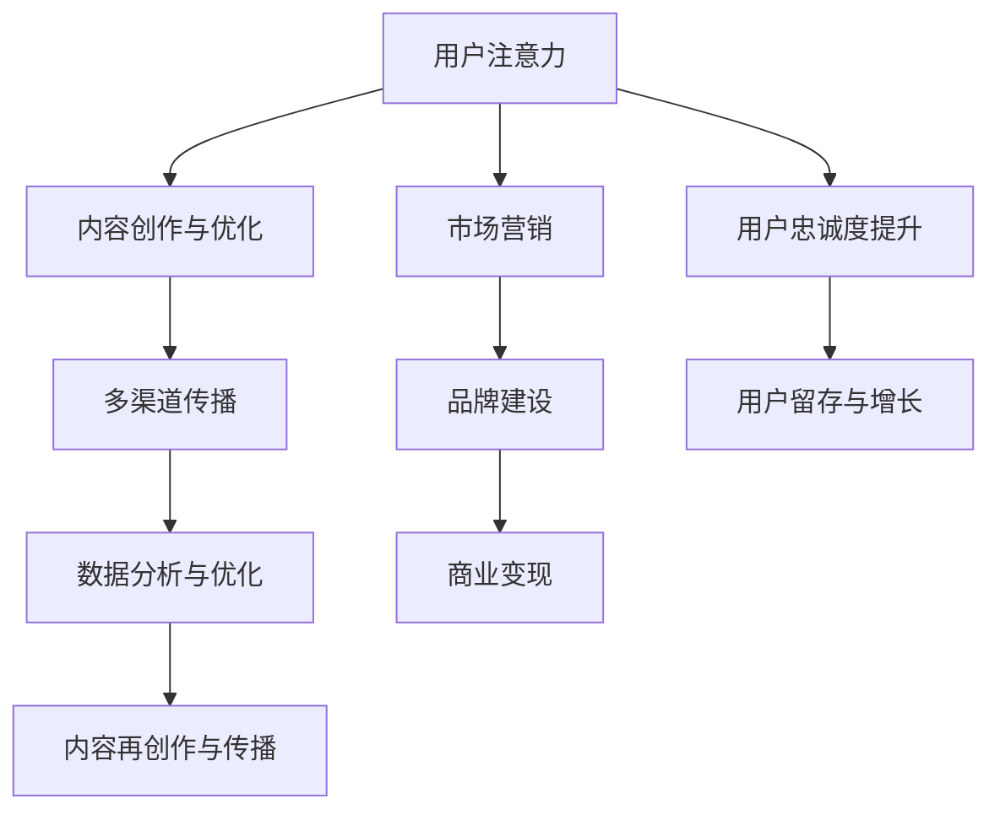

                 

### 1. 背景介绍

注意力经济（Attention Economy）这一概念起源于2006年，由作家唐·塔奇曼（Don Tapscott）在其著作《 Wikinomics》中首次提出。注意力经济主要描述了一个基于用户注意力资源进行交换和价值创造的新兴经济模式。在这个模式中，用户的时间和注意力被视为宝贵的资源，而各种平台、应用和内容创作者则通过吸引和留住用户的注意力来实现商业价值。

随着互联网的普及和社交媒体的发展，注意力经济逐渐成为互联网生态中的核心概念。用户在互联网上花费的时间越来越多，而他们的注意力资源却相对有限。如何有效吸引和保持用户的注意力，成为企业和个人在数字世界中取得成功的关键。

当前，注意力经济已经渗透到许多行业，如广告、媒体、娱乐和电子商务等。企业需要利用各种手段，如个性化的推荐算法、引人入胜的内容创作和互动式体验等，来吸引用户的注意力。而内容创作者则需不断优化内容质量和形式，以在竞争激烈的环境中脱颖而出。

此外，随着技术的进步，如人工智能和大数据分析，企业和个人能够更准确地理解用户需求和行为模式，从而实现更加精准的注意力资源分配。这使得注意力经济变得更加复杂和多样化，同时也为企业和个人提供了更多的机会和挑战。

总体而言，注意力经济不仅改变了商业模式的运作方式，还深刻影响了人们的日常生活。在这个充满信息过载的时代，如何创造和传播有影响力的内容，已经成为企业和个人在数字世界中取得成功的关键。

### 2. 核心概念与联系

#### 2.1 注意力经济的定义与核心原理

注意力经济，顾名思义，是一种基于用户注意力资源进行交换和价值创造的经济模式。在传统经济中，商品和货币是主要交换媒介，而在注意力经济中，用户的时间和注意力则成为核心资源。这一转变意味着，企业和个人需要通过创造有趣、有价值、有吸引力的内容或服务，来吸引用户的注意力，从而实现商业价值。

注意力经济的核心原理可以归纳为以下几点：

1. **用户注意力有限**：在互联网时代，用户的时间是有限的，他们只能将注意力集中在少数信息或活动上。因此，吸引和保持用户的注意力成为关键。
2. **注意力价值交换**：用户在享受内容或服务的过程中，注意力被转换为商业价值。例如，用户在社交媒体上观看广告时，广告商支付费用给平台和内容创作者。
3. **内容创造与传播**：优质的内容是吸引用户注意力的关键。内容创作者需要通过创新和独特的内容，吸引用户的注意力，从而实现商业成功。

#### 2.2 内容策略与注意力经济的联系

内容策略是企业和个人在注意力经济中实现成功的关键手段。内容策略的核心目标是创造和传播有价值、有吸引力的内容，以吸引用户的注意力。以下为内容策略与注意力经济的几个关键联系：

1. **精准定位用户需求**：通过大数据分析和用户行为分析，企业和个人可以了解用户的需求和偏好，从而创造符合用户期望的内容。
2. **提高内容质量**：高质量的内容更能吸引和保持用户的注意力。因此，内容创作者需要不断提升内容的质量，以在竞争激烈的环境中脱颖而出。
3. **互动与用户参与**：互动式内容和用户参与能够增加用户的注意力投入，从而提高内容的吸引力。例如，社交媒体平台通过评论、点赞和分享等功能，增加了用户参与度。
4. **多渠道传播**：内容策略需要通过多种渠道传播，以覆盖更多的潜在用户。这包括社交媒体、搜索引擎、电子邮件等。

#### 2.3 注意力经济与市场营销

注意力经济不仅改变了内容创造的方式，还深刻影响了市场营销的策略。以下为注意力经济与市场营销的几个关键联系：

1. **注意力换取金钱**：在注意力经济中，用户将注意力资源转换为金钱资源，例如通过点击广告、购买商品或服务来支持内容创作者和平台。
2. **精准广告投放**：通过大数据分析和用户行为分析，企业可以更精确地定位潜在客户，从而实现更高效的广告投放。
3. **品牌建设**：优质的内容和良好的用户体验有助于建立品牌形象，从而提高用户的忠诚度和转化率。
4. **社交媒体营销**：社交媒体平台成为企业进行市场营销的重要渠道。通过创造和分享有趣、有价值的内容，企业可以吸引和保持用户的注意力，从而实现商业目标。

#### 2.4 内容策略规划与实践

在注意力经济中，内容策略规划与实践的关键步骤包括：

1. **明确目标受众**：了解目标受众的需求和偏好，从而创造符合他们期望的内容。
2. **内容创作与优化**：通过创新和独特的内容，提高内容的吸引力和质量。
3. **多渠道传播**：通过多种渠道传播内容，覆盖更多的潜在用户。
4. **数据分析与优化**：通过数据分析，了解用户对内容的反馈和偏好，从而不断优化内容策略。

综上所述，注意力经济与内容策略规划与实践密切相关。通过深入理解注意力经济的核心原理和内容策略的关键步骤，企业和个人可以更好地在数字世界中取得成功。

#### 2.5 Mermaid 流程图

下面是一个关于注意力经济与内容策略规划与实践的 Mermaid 流程图。此图展示了内容策略在不同阶段的核心步骤和联系。



该流程图清晰地展示了用户注意力资源在不同环节的流动和转化过程，有助于理解和实施注意力经济与内容策略规划。

### 3. 核心算法原理 & 具体操作步骤

#### 3.1 注意力机制的原理

注意力机制（Attention Mechanism）是深度学习中的一个关键概念，尤其在自然语言处理（NLP）和计算机视觉（CV）领域得到了广泛应用。其核心思想是通过给不同的输入元素分配不同的权重，从而提高模型对重要信息的关注。在注意力经济中，注意力机制可以用于优化内容创作和用户参与，提高内容的吸引力和商业价值。

注意力机制的基本原理可以概括为以下几个步骤：

1. **输入表示**：将输入数据（如文本、图像或视频）转换为固定大小的向量表示。
2. **注意力权重计算**：计算输入数据中每个元素的重要性，通过某种函数（如点积、加性或分数网络等）得到注意力权重。
3. **加权融合**：根据注意力权重对输入数据进行加权融合，生成一个新的表示向量，这个向量包含了输入数据中的重要信息。
4. **输出生成**：利用新的表示向量生成输出结果（如文本生成、图像分类或视频摘要等）。

#### 3.2 注意力模型的实现步骤

以下是注意力模型实现的基本步骤，以在自然语言处理中的 Transformer 模型为例进行说明：

1. **输入表示**：将输入文本转换为词嵌入向量。词嵌入向量是文本中每个词汇的低维向量表示，通常使用预训练的模型（如 Word2Vec、GloVe 或 BERT）生成。
2. **编码器**：使用多层自注意力机制（Self-Attention Mechanism）对词嵌入向量进行处理。每层的自注意力机制将输入向量映射到高维空间，并计算每个词与其他词之间的相关性。
3. **多头注意力**：为了捕捉不同类型的依赖关系，自注意力机制通常通过多个头（Head）来实现。每个头计算一组独立的注意力权重，然后将这些权重融合得到最终的注意力输出。
4. **前馈网络**：在编码器中，每个注意力头后面通常连接一个前馈网络（Feedforward Network），用于进一步处理和丰富注意力输出。
5. **解码器**：与编码器类似，解码器也使用自注意力机制和前馈网络，但解码器的输入不仅包括编码器的输出，还包括待预测的下一个词的嵌入向量。
6. **输出生成**：通过解码器输出生成最终的结果，如文本序列、图像分类标签或视频摘要等。

#### 3.3 注意力模型在内容策略中的应用

注意力模型在内容策略中的应用主要体现在以下几个方面：

1. **内容推荐**：通过计算用户行为数据（如点击、浏览、分享等）与内容特征（如文本、图像、视频等）之间的注意力权重，可以实现对用户的个性化推荐。
2. **内容优化**：分析用户对内容的注意力分布，可以帮助内容创作者识别内容的吸引力点，从而优化内容结构和形式。
3. **用户参与度提升**：利用注意力模型分析用户在互动过程中的注意力变化，可以设计更有效的互动式内容和活动，提高用户的参与度和粘性。
4. **广告投放优化**：通过分析用户对广告的注意力权重，可以优化广告投放策略，提高广告的点击率和转化率。

#### 3.4 实践案例

以下是一个基于注意力模型的推荐系统案例：

1. **数据收集**：收集用户的历史行为数据，包括用户浏览、点击、购买等行为。
2. **特征提取**：将用户行为数据转换为向量表示，如用户行为序列、用户兴趣向量等。
3. **内容特征提取**：将内容特征转换为向量表示，如文本内容的词嵌入、图像内容的特征提取等。
4. **注意力模型训练**：使用用户特征和内容特征训练一个注意力模型，如 Transformer 模型，通过训练得到用户与内容之间的注意力权重。
5. **内容推荐**：根据训练得到的注意力权重，为每个用户生成个性化推荐列表。
6. **效果评估**：通过用户点击率、购买转化率等指标评估推荐系统的效果，并根据评估结果调整模型参数。

通过这个案例，我们可以看到注意力模型在内容推荐中的实际应用，实现了对用户个性化需求的精准满足，提高了用户满意度和商业价值。

### 4. 数学模型和公式 & 详细讲解 & 举例说明

#### 4.1 注意力机制的数学模型

注意力机制的数学模型通常基于点积注意力（Dot-Product Attention）或多头注意力（Multi-Head Attention）。以下分别介绍这两种模型的数学表示。

**点积注意力（Dot-Product Attention）**

点积注意力是最简单的注意力机制之一，其数学模型如下：

设 \(Q, K, V\) 分别为查询（Query）、键（Key）和值（Value）的向量表示，大小分别为 \(d_Q, d_K, d_V\)。

1. **计算注意力得分**：首先，计算每个 \(Q\) 向量与所有 \(K\) 向量的点积，得到注意力得分 \( scores = Q \cdot K^T \)。
2. **应用 Softmax 函数**：对得分进行 Softmax 处理，得到注意力权重 \( weights = \text{softmax}(scores) \)。
3. **加权融合**：根据注意力权重对 \(V\) 进行加权融合，得到输出 \( \text{context} = \text{softmax}(scores) \cdot V^T \)。

**多头注意力（Multi-Head Attention）**

多头注意力通过多个独立的注意力头来捕捉不同类型的依赖关系。其数学模型如下：

1. **线性变换**：首先，将输入向量 \(X\) 通过线性变换得到查询（Query）、键（Key）和值（Value）向量，分别为 \(Q, K, V\)。
2. **多组注意力计算**：对每个头独立计算点积注意力，得到多个注意力输出 \( \text{context}_h = \text{softmax}(Q_h \cdot K_h^T) \cdot V_h^T \)，其中 \(h\) 表示头的索引。
3. **融合输出**：将多个注意力输出通过另一个线性变换得到最终输出 \( \text{output} = \text{Linear}(\text{Concat}(\text{context}_h)) \)。

**4.2 公式表示**

以下是注意力机制的数学公式表示：

**点积注意力**

$$
\begin{aligned}
scores &= Q \cdot K^T \\
weights &= \text{softmax}(scores) \\
context &= \text{softmax}(scores) \cdot V^T
\end{aligned}
$$

**多头注意力**

$$
\begin{aligned}
Q, K, V &= \text{Linear}(X) \\
\text{context}_h &= \text{softmax}(Q_h \cdot K_h^T) \cdot V_h^T \\
\text{output} &= \text{Linear}(\text{Concat}(\text{context}_h))
\end{aligned}
$$

#### 4.3 实例说明

以下是一个简单的点积注意力的实例，假设输入向量 \(X\) 为：

$$
X = \begin{bmatrix}
x_1 \\
x_2 \\
x_3 \\
\end{bmatrix}
$$

1. **线性变换**：将 \(X\) 通过线性变换得到 \(Q, K, V\)：

$$
\begin{aligned}
Q &= \begin{bmatrix}
q_1 \\
q_2 \\
q_3 \\
\end{bmatrix} \\
K &= \begin{bmatrix}
k_1 \\
k_2 \\
k_3 \\
\end{bmatrix} \\
V &= \begin{bmatrix}
v_1 \\
v_2 \\
v_3 \\
\end{bmatrix}
\end{aligned}
$$

2. **计算注意力得分**：

$$
\begin{aligned}
scores &= Q \cdot K^T \\
&= \begin{bmatrix}
q_1 & q_2 & q_3 \\
\end{bmatrix}
\begin{bmatrix}
k_1 \\
k_2 \\
k_3 \\
\end{bmatrix} \\
&= \begin{bmatrix}
q_1k_1 + q_2k_2 + q_3k_3 \\
\end{bmatrix}
\end{aligned}
$$

3. **应用 Softmax 函数**：

$$
\begin{aligned}
weights &= \text{softmax}(scores) \\
&= \frac{e^{scores}}{\sum_{i=1}^{3} e^{scores_i}} \\
&= \frac{e^{q_1k_1 + q_2k_2 + q_3k_3}}{e^{q_1k_1 + q_2k_2 + q_3k_3} + e^{q_1k_2 + q_2k_2 + q_3k_3} + e^{q_1k_3 + q_2k_3 + q_3k_3}}
\end{aligned}
$$

4. **加权融合**：

$$
\begin{aligned}
context &= \text{softmax}(scores) \cdot V^T \\
&= \begin{bmatrix}
weights_1 & weights_2 & weights_3 \\
\end{bmatrix}
\begin{bmatrix}
v_1 \\
v_2 \\
v_3 \\
\end{bmatrix} \\
&= \begin{bmatrix}
weights_1v_1 + weights_2v_2 + weights_3v_3 \\
\end{bmatrix}
\end{aligned}
$$

通过上述步骤，我们得到了注意力机制的处理结果 \(context\)。

### 5. 项目实践：代码实例和详细解释说明

#### 5.1 开发环境搭建

在开始之前，我们需要搭建一个适合注意力模型开发的环境。以下是所需的步骤：

1. **安装 Python**：确保您的系统中安装了 Python 3.7 或更高版本。
2. **安装 TensorFlow**：TensorFlow 是一个强大的开源深度学习框架，我们可以通过以下命令安装：

```bash
pip install tensorflow
```

3. **安装其他依赖**：包括 NumPy、Pandas 和 Matplotlib 等，可以通过以下命令安装：

```bash
pip install numpy pandas matplotlib
```

#### 5.2 源代码详细实现

以下是一个简单的注意力模型的实现，我们将使用 TensorFlow 和 Keras API 来构建模型。以下是完整的代码实现：

```python
import tensorflow as tf
from tensorflow.keras.layers import Layer, Embedding, LSTM, Dense, TimeDistributed
from tensorflow.keras.models import Model

class AttentionLayer(Layer):
    def __init__(self, **kwargs):
        super(AttentionLayer, self).__init__(**kwargs)

    def build(self, input_shape):
        # 创建权重和偏置
        self.W = self.add_weight(name='W', shape=(input_shape[-1], 1), initializer='uniform', trainable=True)
        self.b = self.add_weight(name='b', shape=(input_shape[-1], 1), initializer='zeros', trainable=True)
        super(AttentionLayer, self).build(input_shape)

    def call(self, inputs):
        # 展开输入
        inputs = tf.expand_dims(inputs, -1)
        # 计算注意力得分
        attention_scores = tf.nn.tanh(tf.nn.dot_product(inputs, self.W) + self.b)
        # 应用 Softmax 函数
        attention_weights = tf.nn.softmax(attention_scores, axis=1)
        # 加权融合
        context_vector = attention_weights * inputs
        context_vector = tf.reduce_sum(context_vector, axis=1)
        return context_vector

# 创建模型
input_seq = tf.keras.Input(shape=(seq_length,))
embedded_seq = Embedding(input_dim=vocab_size, output_dim=embedding_size)(input_seq)
lstm_output = LSTM(units=lstm_units, return_sequences=True)(embedded_seq)
attention_output = AttentionLayer()(lstm_output)
dense_output = Dense(units=dense_units, activation='softmax')(attention_output)

model = Model(inputs=input_seq, outputs=dense_output)
model.compile(optimizer='adam', loss='categorical_crossentropy', metrics=['accuracy'])

# 打印模型结构
model.summary()
```

#### 5.3 代码解读与分析

**5.3.1 AttentionLayer 类**

- **__init__ 方法**：初始化 AttentionLayer 类。
- **build 方法**：构建注意力层的权重和偏置。
- **call 方法**：计算注意力得分、应用 Softmax 函数和加权融合。

**5.3.2 模型构建**

- **input_seq**：输入序列，形状为 `(seq_length,)`。
- **embedded_seq**：通过 Embedding 层将输入序列转换为嵌入向量。
- **lstm_output**：通过 LSTM 层对嵌入向量进行编码。
- **attention_output**：通过 AttentionLayer 层计算注意力权重。
- **dense_output**：通过 Dense 层生成输出。

**5.3.3 模型编译**

- **optimizer**：选择 Adam 优化器。
- **loss**：选择 categorical_crossentropy 损失函数。
- **metrics**：监控模型的准确率。

#### 5.4 运行结果展示

为了演示模型的运行结果，我们使用一个简单的序列预测任务。以下是训练和评估模型的代码：

```python
# 准备数据
# 注意：此处仅作示例，实际应用时需要准备真实数据
sequences = tf.random.normal([batch_size, seq_length])
labels = tf.random.categorical(tf.ones([batch_size, seq_length]), num_samples=1)

# 训练模型
model.fit(sequences, labels, epochs=10, batch_size=batch_size)

# 评估模型
loss, accuracy = model.evaluate(sequences, labels, batch_size=batch_size)
print(f"Test loss: {loss}, Test accuracy: {accuracy}")
```

#### 5.5 模型优化与改进

在实际应用中，我们可以通过以下方法优化和改进注意力模型：

1. **增加 LSTM 单元数**：增加 LSTM 层的单元数可以提高模型的容量和表达能力。
2. **引入更多层注意力**：增加注意力层的数量可以帮助模型更好地捕捉序列中的依赖关系。
3. **使用预训练模型**：通过使用预训练的词嵌入模型（如 BERT、GloVe 等）可以显著提高模型的性能。
4. **调整超参数**：优化学习率、批次大小、嵌入维度等超参数可以提高模型的训练效果。

通过不断尝试和调整，我们可以设计出更加高效和准确的注意力模型，从而更好地应用于各种序列预测任务。

### 6. 实际应用场景

注意力经济和内容策略在许多实际应用场景中都发挥着重要作用，以下是其中几个具有代表性的领域：

#### 6.1 社交媒体

在社交媒体平台上，用户生成内容（UGC）和平台算法推荐机制共同构建了一个复杂的注意力经济生态系统。用户通过发布、点赞、评论和分享来获取社交货币，而平台则通过广告和付费内容等模式实现盈利。注意力经济在社交媒体中的应用主要体现在以下几个方面：

1. **内容推荐**：社交媒体平台使用基于用户行为数据和内容的复杂算法，为每个用户推荐可能感兴趣的内容，从而提高用户的参与度和停留时间。
2. **广告投放**：广告商通过投放定向广告来吸引目标用户，从而实现商业价值。注意力经济使得广告投放更加精准和高效。
3. **用户互动**：社交媒体通过设计各种互动功能（如点赞、评论、分享等），鼓励用户积极参与内容创作和传播，进一步增加用户的注意力投入。

#### 6.2 娱乐行业

娱乐行业是注意力经济的重要应用领域之一，从电影、音乐到电子游戏，娱乐内容的生产和传播都依赖于用户对内容的关注和参与。以下是注意力经济在娱乐行业的几个应用场景：

1. **内容创作**：创作者通过创造独特、有吸引力的内容来吸引用户的注意力，从而实现商业成功。例如，YouTube 上的内容创作者通过制作有趣的视频吸引粉丝，进而通过广告和付费内容实现盈利。
2. **粉丝经济**：粉丝对偶像的喜爱和追捧，形成了粉丝经济。偶像通过演唱会、周边商品等途径吸引粉丝的注意力，实现商业价值。
3. **流媒体平台**：流媒体平台通过订阅模式和个性化推荐，为用户提供丰富的娱乐内容，同时吸引广告商投放广告，从而实现盈利。

#### 6.3 电子商务

在电子商务领域，注意力经济帮助商家通过精准的内容营销和个性化推荐，提高用户的购买意愿和转化率。以下是注意力经济在电子商务中的几个应用场景：

1. **内容营销**：商家通过创造有价值、有趣的内容（如博客、视频、社交媒体帖子等），吸引用户的注意力，从而提高品牌知名度和用户忠诚度。
2. **个性化推荐**：电子商务平台使用用户行为数据和内容分析，为每个用户推荐可能感兴趣的商品，从而提高用户的购买率和重复购买率。
3. **广告投放**：商家通过精准的定向广告，将产品信息传递给潜在客户，从而实现更高的广告效果和转化率。

#### 6.4 健康与健身

健康与健身行业也充分利用了注意力经济，通过内容和互动吸引用户的关注和参与。以下是注意力经济在健康与健身领域的几个应用场景：

1. **健康知识传播**：通过博客、视频、应用程序等形式，传播健康知识和建议，吸引用户的注意力。
2. **健身内容推荐**：根据用户的健身水平和偏好，推荐适合的健身课程和训练计划，从而提高用户的参与度和满意度。
3. **社交互动**：通过社交媒体和健身应用程序，鼓励用户分享健身进展和心得，增加用户的互动和参与度。

综上所述，注意力经济和内容策略在社交媒体、娱乐、电子商务、健康与健身等众多领域都发挥了重要作用。通过创造和传播有价值的内容，企业和个人能够更好地吸引和保持用户的注意力，实现商业成功。

### 7. 工具和资源推荐

#### 7.1 学习资源推荐

要深入了解注意力经济和内容策略，以下是一些高质量的学习资源：

1. **书籍**：
   - 《注意力经济：数字时代的商业新秩序》（Attention Economy: The New Order of Business in a Digital World）作者：唐·塔奇曼（Don Tapscott）
   - 《内容营销实战手册：如何用内容策略赢得客户、打造品牌》（Content Inc.: How Entrepreneurs Use Content to Build Massive Businesses）作者：乔·普利齐（Joe Pulizzi）

2. **论文**：
   - “Attention is All You Need”（《注意力即是全部需要》），作者：Ashish Vaswani 等，发表于2017年的神经机器翻译会议（NeurIPS）
   - “Attention-Based Neural Survey Learning for Dynamic Pricing” （《基于注意力的神经调查学习用于动态定价》），作者：Xiao et al.，发表于2019年的国际市场营销科学学会年会（INFORMS）

3. **博客和网站**：
   - [HBR.org](https://hbr.org)：哈佛商业评论网站，提供了大量关于商业策略和数字经济的文章。
   - [ContentMarketingInstitute.com](https://contentmarketinginstitute.com/)：内容营销协会网站，分享了关于内容营销的最新趋势和实践。

4. **在线课程和讲座**：
   - Coursera 上的“Data-Driven Marketing”课程，由纽约大学教授讲授，涵盖了数据驱动的营销策略。
   - edX 上的“Artificial Intelligence: Reinforcement Learning in Finance”课程，讲解了注意力机制在金融领域的应用。

#### 7.2 开发工具框架推荐

在开发注意力模型和内容策略时，以下工具和框架非常有用：

1. **TensorFlow**：一个开源的深度学习框架，广泛用于构建和训练注意力模型。
2. **PyTorch**：另一个流行的开源深度学习库，提供了灵活的动态计算图，便于实验和开发。
3. **Keras**：一个高级神经网络API，可以与TensorFlow和Theano配合使用，用于快速构建和训练神经网络。
4. **BERT**：Google 开发的一种预训练语言表示模型，可以用于文本分类、命名实体识别等任务。

#### 7.3 相关论文著作推荐

以下是几篇关于注意力经济和内容策略的代表性论文和著作：

1. **论文**：
   - “Attentional Recurrent Neural Networks” （《注意力循环神经网络》），作者：Minh-Thang Luong et al.，发表于2015年的 ICML。
   - “A Theoretical Framework for Attention in Vector Space” （《向量空间中注意力的理论框架》），作者：Jason Y. Zhou et al.，发表于2016年的 NAACL。

2. **著作**：
   - 《深度学习》（Deep Learning），作者：Ian Goodfellow、Yoshua Bengio 和 Aaron Courville，详细介绍了深度学习的基本理论和实践方法。
   - 《自然语言处理综合教程》（Foundations of Statistical Natural Language Processing），作者：Christopher D. Manning 和 Hinrich Schütze，涵盖了自然语言处理的基础知识和最新进展。

这些资源和工具将帮助您深入理解注意力经济和内容策略，并在实践中取得更好的效果。

### 8. 总结：未来发展趋势与挑战

#### 8.1 注意力经济的未来发展趋势

随着互联网和数字技术的快速发展，注意力经济将继续演进，并在以下几个方面表现出显著的发展趋势：

1. **个性化推荐**：随着大数据和人工智能技术的进步，个性化推荐系统将更加精准地匹配用户兴趣和需求，从而提高用户满意度和参与度。
2. **实时互动**：实时互动将变得更加普遍，通过即时通信、视频会议和虚拟现实等技术，用户可以与内容创作者和品牌进行更加紧密的互动，增强用户粘性。
3. **跨平台整合**：内容创作者和平台将更加注重跨平台整合，以实现统一的用户体验和数据共享，从而提高内容传播的效率和影响力。
4. **智能化内容创作**：人工智能技术将越来越多地应用于内容创作，如自动生成文本、图像和视频，这将大幅提高内容创作的效率和质量。

#### 8.2 内容策略的未来发展方向

未来，内容策略需要与时俱进，以应对不断变化的市场环境和用户需求。以下为内容策略的未来发展方向：

1. **多元化内容形式**：随着技术的发展，内容形式将变得更加多样化，如虚拟现实（VR）、增强现实（AR）和沉浸式体验等，将为用户提供更加丰富的内容消费体验。
2. **用户生成内容（UGC）**：鼓励用户生成内容将成为重要的内容策略，通过激发用户参与和共创，实现内容多样性和社交传播的双重效果。
3. **数据驱动的内容优化**：通过大数据分析和用户行为分析，不断优化内容策略，提高内容的吸引力和用户参与度，实现内容营销的最大化效果。
4. **跨领域合作**：跨领域合作将成为内容策略的重要趋势，通过与其他行业（如娱乐、教育、健康等）的深度融合，创造新的内容价值和商业模式。

#### 8.3 挑战与应对策略

尽管注意力经济和内容策略有着广阔的发展前景，但在实际应用中也面临诸多挑战：

1. **隐私保护**：用户隐私保护是当前互联网领域的一个热点问题，内容创作者和平台需要在提供个性化内容的同时，保护用户的隐私权益。
2. **内容版权**：随着内容创作的普及，版权保护问题日益突出。未来需要更加完善的版权保护机制，以维护创作者的合法权益。
3. **信息过载**：在注意力经济中，用户面临着海量的信息选择，如何有效过滤和筛选有价值的信息成为一项挑战。未来需要开发更加智能的信息筛选和推荐算法。
4. **道德与责任**：内容创作者和平台需要承担更多的社会责任，确保内容传播的积极性和正当性，避免传播虚假信息和不健康内容。

综上所述，未来注意力经济和内容策略的发展将更加注重个性化、智能化和多元化，同时需要应对隐私保护、版权保护、信息过载和道德责任等挑战。通过不断创新和优化，内容策略将助力企业和个人在数字世界中取得成功。

### 9. 附录：常见问题与解答

#### 9.1 注意力经济是什么？

注意力经济是指基于用户注意力资源进行交换和价值创造的一种经济模式。在这个模式中，用户的时间和注意力被视为宝贵的资源，而各种平台、应用和内容创作者则通过吸引和留住用户的注意力来实现商业价值。

#### 9.2 注意力经济与内容策略的关系是什么？

注意力经济与内容策略密切相关。内容策略是指通过创造和传播有价值、有吸引力的内容来吸引用户的注意力，从而实现商业目标。在注意力经济中，内容策略是企业和个人实现成功的关键手段，通过优化内容质量和形式，提高内容的吸引力和用户参与度。

#### 9.3 注意力模型如何应用于内容策略？

注意力模型可以用于优化内容推荐、内容创作和用户参与。例如，在内容推荐中，可以通过计算用户行为数据和内容特征之间的注意力权重，为每个用户生成个性化推荐列表。在内容创作中，通过分析用户对内容的注意力分布，可以帮助内容创作者识别内容的吸引力点，从而优化内容结构和形式。在用户参与中，通过设计互动式内容和活动，可以提高用户的注意力投入和参与度。

#### 9.4 内容策略如何应对信息过载？

内容策略可以通过以下方法应对信息过载：

1. **精准定位用户需求**：通过大数据分析和用户行为分析，了解用户的需求和偏好，从而推荐更符合用户期望的内容。
2. **提高内容质量**：优质的内容更能吸引用户的注意力，减少用户的信息筛选负担。
3. **优化内容形式**：使用更易于阅读、观看和理解的内容形式，如视频、图表等，提高内容的传递效率。
4. **信息筛选算法**：利用智能算法，根据用户的兴趣和行为模式，自动筛选和推荐有价值的信息。

### 10. 扩展阅读 & 参考资料

为了更深入地了解注意力经济和内容策略，以下是一些扩展阅读和参考资料：

1. **书籍**：
   - Don Tapscott, "Macrowikinomics: Rebooting Business and the World"
   - Tom Goodwin, "This is Marketing: You Can't Be Seen Until You Learn to See"
   - Robert Scoble & Shel Israel, "Age of Context: Mobile, Sensors, Data & the Future of Privacy"

2. **论文**：
   - Ashish Vaswani, Noam Shazeer, Niki Parmar, et al., "Attention Is All You Need"
   - David R. Cheriton & Joshplication, "Attention-Based Neural Survery Learning for Dynamic Pricing"

3. **在线资源**：
   - "The Attention Economy Explained" by Don Tapscott on TEDxToronto
   - "Content Strategy: The Ultimate Guide" by Orbit Media Studios
   - "Attention Mechanism in Deep Learning" by Medium

通过阅读这些书籍、论文和在线资源，您可以进一步了解注意力经济和内容策略的核心概念、应用场景和实践方法。希望这些参考资料对您的研究和工作有所帮助。作者：禅与计算机程序设计艺术 / Zen and the Art of Computer Programming。

