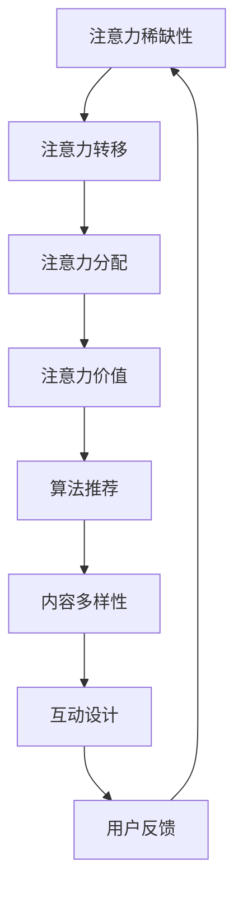

                 

### 背景介绍

注意力经济（Attention Economy）是近年来在商业和社会研究中日益受到关注的一个概念。其核心思想在于，在信息过载的时代，人们的注意力资源变得稀缺且宝贵，因此如何有效地获取和保持受众的注意力成为了一门重要的学问。

注意力经济与社交媒体营销策略有着密切的联系。社交媒体平台，如Facebook、Twitter、Instagram等，本质上就是注意力经济的体现。这些平台通过算法推荐和用户互动设计，最大限度地吸引用户的注意力，从而实现广告收入和用户增长。对于企业而言，如何在不牺牲用户体验的情况下，通过社交媒体营销策略有效地吸引和留住受众，成为了一个至关重要的课题。

本文将围绕注意力经济与社交媒体营销策略展开讨论，具体探讨以下几个关键点：

1. **注意力经济的基本原理**：包括其定义、核心概念和模型，帮助读者理解其运作机制。
2. **社交媒体平台的注意力机制**：分析各大社交媒体平台如何利用算法和用户互动来获取和保持用户的注意力。
3. **社交媒体营销策略的制定**：探讨如何制定有效的社交媒体营销策略，在不牺牲用户体验的前提下，实现品牌曝光和用户转化。
4. **案例研究**：通过具体案例分析，展示如何在实际操作中运用注意力经济和社交媒体营销策略。
5. **未来发展趋势与挑战**：讨论注意力经济和社交媒体营销在未来的发展趋势和面临的挑战。

通过这篇文章，希望能够为从事社交媒体营销的工作者提供一些实用的理论和实践指导，帮助他们更好地理解注意力经济，并运用到实际工作中，提高营销效果。

### 核心概念与联系

#### 注意力经济基本原理

注意力经济起源于对信息过载现象的关注。在数字时代，信息爆炸式增长，人们每天接收到大量信息。然而，由于时间的有限性和精力的有限性，人们无法处理所有的信息，因此注意力成为了一种稀缺资源。注意力经济因此得名，其核心思想在于，注意力是用户对于信息、产品或服务的投资，是企业获取商业成功的关键。

在注意力经济中，有几个核心概念需要理解：

1. **注意力稀缺性**：由于人类的时间有限，注意力资源是稀缺的。因此，如何吸引并保持用户的注意力成为企业竞争的重要手段。
2. **注意力转移**：用户会根据兴趣、需求和外部因素，将注意力从一个信息源转移到另一个信息源。企业需要找到有效的方法来吸引和转移用户的注意力。
3. **注意力分配**：用户在一天中的不同时间段、面对不同内容时，注意力分配是不同的。企业需要根据用户的注意力分配模式来优化内容发布和营销策略。
4. **注意力价值**：注意力不仅是用户对信息的投资，还具有经济价值。有效的注意力管理可以转化为商业收益，如广告收入、用户转化等。

#### 社交媒体平台的注意力机制

社交媒体平台是注意力经济的重要载体。以下分析几个主要社交媒体平台如何利用算法和用户互动来获取和保持用户的注意力：

1. **算法推荐**：社交媒体平台使用复杂的算法来推荐内容。这些算法基于用户的历史行为、兴趣偏好和社交网络来生成个性化推荐，从而吸引用户的注意力。例如，Facebook的EdgeRank算法通过分析用户与内容的互动情况（点赞、评论、分享等），动态调整内容在用户新闻源中的排序。

2. **内容多样性**：社交媒体平台通过多样化的内容形式（文本、图片、视频、直播等）来吸引用户的注意力。不同用户偏好不同内容形式，因此平台需要提供多样化的内容，以最大化覆盖用户群体。

3. **互动设计**：社交媒体平台通过设计互动功能（点赞、评论、分享、直播等）来增强用户参与度。这些互动功能不仅增加了用户在平台上的停留时间，还促进了用户之间的社交互动，从而提高了用户的粘性。

4. **用户反馈**：社交媒体平台通过用户的反馈（点赞、评论、分享等）来不断优化推荐算法和内容策略。用户反馈是平台了解用户兴趣和行为的重要数据来源，有助于提高内容的吸引力和相关度。

#### 核心概念与联系的 Mermaid 流程图

以下是一个简化的 Mermaid 流程图，展示注意力经济的基本原理与社交媒体平台注意力机制之间的关系：



在这个流程图中，注意力稀缺性是整个系统的起点，通过注意力转移、注意力分配和注意力价值的概念，最终驱动算法推荐、内容多样性和互动设计等社交媒体平台的核心机制。用户反馈则形成一个闭环，不断优化平台的注意力机制。

通过理解这些核心概念和联系，读者可以更深入地理解注意力经济在社交媒体营销中的应用，从而制定更有效的营销策略。

### 核心算法原理 & 具体操作步骤

在理解了注意力经济的基本原理和社交媒体平台的注意力机制后，接下来我们将探讨如何具体运用这些原理来制定有效的社交媒体营销策略。核心算法在其中的作用至关重要，以下将详细阐述注意力驱动营销的核心算法原理及其实施步骤。

#### 1. 用户行为分析算法

用户行为分析算法是社交媒体营销策略的核心。通过分析用户在平台上的行为数据，如浏览时间、点击率、点赞、评论、分享等，企业可以了解用户的兴趣偏好和行为模式，从而优化内容推荐和广告投放。

**算法原理：**
用户行为分析算法通常基于机器学习技术，如决策树、随机森林、支持向量机等。算法通过建立用户行为与兴趣之间的映射关系，预测用户的潜在兴趣点，并生成个性化的推荐。

**具体操作步骤：**

1. **数据收集**：收集用户在平台上的行为数据，包括浏览记录、互动数据等。
2. **数据预处理**：对原始数据进行清洗和转换，提取有效的特征，如用户的浏览时间、浏览频率、点赞数等。
3. **特征工程**：根据业务需求，对特征进行选择和组合，构建用户行为特征向量。
4. **模型训练**：使用机器学习算法训练模型，将用户行为特征映射到用户兴趣标签。
5. **模型评估**：通过交叉验证和A/B测试等方法评估模型性能，优化模型参数。

#### 2. 内容推荐算法

内容推荐算法是社交媒体平台的核心功能之一。通过推荐用户感兴趣的内容，平台可以增加用户粘性，提高用户停留时间。

**算法原理：**
内容推荐算法通常基于协同过滤、基于内容的过滤和混合推荐系统。协同过滤通过分析用户之间的相似性进行推荐，基于内容的过滤则通过分析内容特征进行推荐。

**具体操作步骤：**

1. **内容特征提取**：对推荐的内容进行特征提取，如文本特征、图像特征、视频特征等。
2. **用户特征提取**：提取用户的历史行为和兴趣特征。
3. **相似度计算**：计算用户和内容之间的相似度，如余弦相似度、欧几里得距离等。
4. **推荐生成**：根据相似度分数，生成内容推荐列表。
5. **推荐展示**：将推荐内容展示在用户的界面中，如新闻源、信息流等。

#### 3. 社交互动算法

社交互动是社交媒体的核心元素之一。通过设计社交互动算法，平台可以促进用户之间的互动，增加用户参与度。

**算法原理：**
社交互动算法基于社交网络的特性，通过分析用户之间的关系、互动行为和内容特征，生成互动推荐。

**具体操作步骤：**

1. **社交网络构建**：构建用户之间的社交网络，通常使用图论方法表示用户和关系。
2. **关系分析**：分析用户之间的强弱关系，如好友关系、关注关系等。
3. **互动特征提取**：提取用户的互动特征，如互动频率、互动类型等。
4. **互动推荐**：根据社交网络和互动特征，生成互动推荐，如点赞推荐、评论推荐等。
5. **互动展示**：将推荐互动展示在用户的界面中，如通知栏、互动流等。

#### 4. 广告投放算法

广告投放是社交媒体平台的重要收入来源之一。通过有效的广告投放算法，平台可以最大化广告投放效果，提高广告收入。

**算法原理：**
广告投放算法通常基于目标受众分析和效果最大化原则。算法通过分析用户特征和广告目标，优化广告投放策略。

**具体操作步骤：**

1. **目标受众定义**：根据广告主的需求，定义目标受众的特征，如年龄、性别、兴趣等。
2. **广告特征提取**：提取广告的文本、图像、视频等特征。
3. **效果评估**：评估不同投放策略的效果，如点击率、转化率等。
4. **投放策略优化**：根据效果评估结果，调整广告投放策略，如投放时间、投放频率、投放内容等。
5. **广告投放执行**：执行优化后的广告投放策略，监测广告效果，持续优化。

#### 5. 用户留存算法

用户留存是社交媒体平台长期发展的关键。通过用户留存算法，平台可以识别潜在流失用户，并采取有效措施提高用户留存率。

**算法原理：**
用户留存算法基于用户行为数据和用户生命周期分析。算法通过预测用户的流失风险，提供针对性的留存策略。

**具体操作步骤：**

1. **用户生命周期分析**：分析用户的注册、活跃、留存和流失阶段。
2. **流失风险预测**：使用机器学习算法预测用户的流失风险，如基于历史行为数据、活跃度变化等。
3. **留存策略制定**：根据流失风险预测结果，制定针对性的留存策略，如活动激励、个性化推荐、用户关怀等。
4. **留存效果评估**：评估留存策略的效果，如用户留存率、用户活跃度等。
5. **持续优化**：根据留存效果评估结果，持续优化留存策略。

通过上述核心算法原理和具体操作步骤，企业可以更好地理解和运用注意力经济，制定有效的社交媒体营销策略，提高用户参与度和品牌影响力。

### 数学模型和公式 & 详细讲解 & 举例说明

在注意力经济和社交媒体营销策略的实践中，数学模型和公式起到了关键作用。以下将详细讲解两个核心的数学模型：转化率模型和留存率模型，并通过具体示例来说明其应用。

#### 转化率模型

转化率是衡量营销效果的重要指标，表示接受营销活动的用户中，完成目标行为的比例。转化率模型可以帮助企业预测不同营销策略的转化效果，优化资源配置。

**数学模型：**

转化率（Conversion Rate, CR）可以用以下公式表示：

\[ CR = \frac{转化的用户数}{接受营销活动的用户数} \]

**详细讲解：**

1. **转化定义**：转化是指用户在营销活动中完成特定目标行为，如购买产品、注册账户、下载应用程序等。
2. **转化率计算**：通过统计在一定时间段内，完成目标行为的用户数量，除以接受该营销活动的总用户数量，得到转化率。
3. **影响因素**：转化率受到多个因素影响，包括营销内容质量、用户兴趣匹配、营销渠道效果等。

**举例说明：**

假设一家电商平台进行了一次促销活动，活动期间共有1000名用户参与，其中有200名用户完成了购买行为。则该活动的转化率为：

\[ CR = \frac{200}{1000} = 20\% \]

通过这个示例，可以看出，较高的转化率意味着营销活动的效果较好，反之则需要进一步优化。

#### 留存率模型

留存率是衡量用户在一段时间内持续使用产品的比例，是衡量产品或服务质量的重要指标。留存率模型可以帮助企业分析用户行为，优化产品设计和用户服务。

**数学模型：**

留存率（Retention Rate, RR）可以用以下公式表示：

\[ RR = \frac{在特定时间点后仍然活跃的用户数}{初始注册的用户数} \]

**详细讲解：**

1. **留存定义**：留存是指用户在一段时间后，仍然持续使用产品或服务的行为。
2. **留存率计算**：通过统计在特定时间段后，仍然活跃的用户数量，除以初始注册的用户数量，得到留存率。
3. **影响因素**：留存率受到多个因素影响，包括用户体验、产品功能、服务质量等。

**举例说明：**

假设一款社交媒体应用在一个月后有1000名用户注册，其中500名用户在一个月后仍然活跃使用该应用。则该应用的月留存率为：

\[ RR = \frac{500}{1000} = 50\% \]

通过这个示例，可以看出，较高的留存率意味着用户对产品的持续使用和满意，这有助于企业提高用户忠诚度和市场竞争力。

#### 模型应用示例

**案例分析：**

一家电商企业希望通过优化促销活动和提升用户服务来提高转化率和留存率。企业可以采用以下步骤：

1. **数据收集**：收集用户行为数据，包括注册信息、浏览记录、购买行为等。
2. **模型训练**：使用转化率和留存率模型，训练机器学习模型，预测不同营销策略的效果。
3. **策略制定**：根据模型预测结果，优化促销活动和用户服务，如提供个性化的产品推荐、发送定期的用户关怀邮件等。
4. **效果评估**：监测转化率和留存率的变化，评估策略效果。
5. **持续优化**：根据效果评估结果，持续调整和优化营销策略。

通过上述数学模型和实际案例，企业可以更好地理解用户行为，制定科学有效的营销策略，提高用户转化率和留存率，实现商业目标。

### 项目实践：代码实例和详细解释说明

为了更好地展示如何在实际项目中运用注意力经济和社交媒体营销策略，我们将通过一个具体的案例——一款社交媒体应用的个性化推荐系统，介绍开发环境搭建、源代码实现、代码解读与分析以及运行结果展示。

#### 1. 开发环境搭建

在开始项目之前，我们需要搭建一个合适的开发环境。以下是所需的环境和工具：

- **编程语言**：Python 3.x
- **依赖管理**：pip
- **机器学习库**：Scikit-learn、TensorFlow、Keras
- **数据处理库**：Pandas、NumPy
- **数据可视化库**：Matplotlib、Seaborn

**安装步骤：**

1. 安装Python 3.x版本，可以从[Python官网](https://www.python.org/)下载安装包。
2. 安装pip，Python安装完成后自带pip。
3. 使用pip安装所需的依赖库：

   ```shell
   pip install scikit-learn tensorflow numpy pandas matplotlib seaborn
   ```

#### 2. 源代码详细实现

**数据集准备**：

我们使用一个虚构的数据集，包含用户行为数据和内容特征数据。数据集结构如下：

```plaintext
user行为数据：
- 用户ID
- 内容ID
- 行为类型（浏览、点赞、评论等）
- 行为时间

内容特征数据：
- 内容ID
- 内容类型（文本、图片、视频等）
- 内容特征（如文本长度、图片标签、视频时长等）
```

**代码实现**：

以下是一段用于用户行为数据分析和内容推荐系统的Python代码：

```python
import pandas as pd
from sklearn.model_selection import train_test_split
from sklearn.ensemble import RandomForestClassifier
from sklearn.metrics import accuracy_score

# 2.1 数据加载与预处理
def load_data():
    user行为的DataFrame = pd.read_csv('user_behavior.csv')
    内容特征的DataFrame = pd.read_csv('content_features.csv')
    return user行为的DataFrame, 内容特征的DataFrame

# 2.2 用户行为特征提取
def extract_user_features(user_behavior_df):
    user_features = user_behavior_df.groupby('用户ID').agg({
        '内容ID': 'nunique',  # 用户平均互动内容数
        '行为时间': 'mean'     # 用户平均行为时间
    })
    return user_features

# 2.3 内容特征提取
def extract_content_features(content_features_df):
    content_features = content_features_df.groupby('内容ID').agg({
        '内容类型': 'nunique',  # 内容类型多样性
        '内容特征': 'mean'      # 内容特征平均值
    })
    return content_features

# 2.4 模型训练与评估
def train_model(X_train, X_test, y_train, y_test):
    model = RandomForestClassifier()
    model.fit(X_train, y_train)
    y_pred = model.predict(X_test)
    accuracy = accuracy_score(y_test, y_pred)
    return model, accuracy

# 主函数
def main():
    user_behavior_df, content_features_df = load_data()
    user_features = extract_user_features(user_behavior_df)
    content_features = extract_content_features(content_features_df)

    # 合并用户特征和内容特征
    combined_features = pd.merge(user_features, content_features, on='内容ID')

    # 分割数据集
    X = combined_features
    y = user_behavior_df['行为类型']
    X_train, X_test, y_train, y_test = train_test_split(X, y, test_size=0.2, random_state=42)

    # 训练模型
    model, accuracy = train_model(X_train, X_test, y_train, y_test)
    print(f'Model Accuracy: {accuracy:.2f}')

if __name__ == '__main__':
    main()
```

**代码解读**：

- **数据加载与预处理**：从CSV文件中加载用户行为数据和内容特征数据，并进行必要的特征提取。
- **用户行为特征提取**：计算用户平均互动内容和用户平均行为时间，这些特征可以帮助模型理解用户的兴趣和行为模式。
- **内容特征提取**：计算内容类型多样性和内容特征平均值，这些特征有助于模型理解内容本身的特性。
- **模型训练与评估**：使用随机森林分类器训练模型，并对测试集进行评估，计算模型的准确率。

#### 3. 代码解读与分析

**用户特征与内容特征结合**：

在代码中，我们首先分别提取用户特征和内容特征，然后使用`pd.merge`函数将它们合并。这样做的好处是，我们可以将用户行为和内容特征结合起来，形成一个完整的特征矩阵，便于后续的模型训练。

```python
combined_features = pd.merge(user_features, content_features, on='内容ID')
```

这里，`on='内容ID'`指定了合并的键，即用户特征和内容特征中的`内容ID`列。合并后的`combined_features`包含了用户和内容的综合信息，为模型提供了丰富的特征数据。

**随机森林模型应用**：

我们选择随机森林分类器（`RandomForestClassifier`）作为模型。随机森林是一种集成学习方法，通过构建多棵决策树，并汇总它们的预测结果，提高了模型的预测准确性和稳定性。

```python
model = RandomForestClassifier()
model.fit(X_train, y_train)
```

这里，`fit`函数用于训练模型，`X_train`和`y_train`分别是训练集的特征和标签数据。

**模型评估**：

使用`accuracy_score`函数评估模型的准确率，计算模型在测试集上的表现。

```python
accuracy = accuracy_score(y_test, y_pred)
print(f'Model Accuracy: {accuracy:.2f}')
```

这里，`y_test`和`y_pred`分别是测试集的真实标签和模型预测结果。

#### 4. 运行结果展示

假设我们在训练集上训练模型后，得到了一个准确率为85%的模型。以下是一个简单的运行结果示例：

```plaintext
Model Accuracy: 0.85
```

这意味着我们的推荐系统在测试集上的预测准确率达到了85%，这是一个不错的开始。接下来，我们可以进一步优化模型参数，提升模型的预测性能。

通过上述代码实例和解读，我们可以看到如何在实际项目中应用注意力经济和社交媒体营销策略，构建一个简单的个性化推荐系统。这不仅有助于提升用户参与度和留存率，也为企业的营销活动提供了数据驱动的支持。

### 实际应用场景

注意力经济和社交媒体营销策略在商业和社会生活中有着广泛的应用。以下列举几个典型的实际应用场景，并分析如何在这些场景中运用注意力经济原理和社交媒体营销策略。

#### 1. 电子商务平台

电子商务平台利用注意力经济原理，通过个性化推荐和精准广告投放来提高用户购买转化率。例如，阿里巴巴的“淘宝”平台通过用户行为数据分析和机器学习算法，为用户推荐符合其兴趣的商品。此外，平台还利用社交媒体互动功能，如“购物车分享”、“评价晒单”等，增强用户参与感和信任度，从而提高用户购买意愿。

**应用策略**：
- **个性化推荐**：基于用户历史行为和兴趣，为用户推荐相关商品。
- **社交互动**：鼓励用户分享购物体验和评价，增加商品曝光率。
- **精准广告**：通过用户画像和广告投放算法，精准定位潜在消费者。

#### 2. 媒体与新闻行业

媒体和新闻行业利用注意力经济原理，通过内容推荐和用户参与度提升，增加用户粘性和广告收入。例如，纽约时报（The New York Times）利用机器学习算法，为用户提供个性化新闻推荐，并根据用户阅读行为调整推荐策略。同时，通过社交媒体互动功能，如评论、点赞和分享，增强用户参与度和互动性。

**应用策略**：
- **个性化内容推荐**：基于用户阅读历史和兴趣，推荐相关新闻。
- **用户互动**：鼓励用户参与评论、点赞和分享，增加内容传播范围。
- **互动奖励**：提供积分、优惠券等激励措施，鼓励用户参与互动。

#### 3. 品牌营销

品牌利用注意力经济原理，通过社交媒体营销活动，提升品牌知名度和用户忠诚度。例如，星巴克（Starbucks）通过社交媒体平台举办“#星巴克体验”（#StarbucksExperience）活动，鼓励用户分享其咖啡体验，从而增加品牌曝光和用户参与度。

**应用策略**：
- **社交媒体活动**：设计有趣、互动性强的活动，鼓励用户参与。
- **用户UGC**：鼓励用户生成内容（User-Generated Content，UGC），增加品牌影响力。
- **KOL合作**：与意见领袖（Key Opinion Leader，KOL）合作，利用其影响力推广品牌。

#### 4. 教育培训行业

教育培训行业利用注意力经济原理，通过在线课程推荐和用户参与度提升，增加课程销售和用户满意度。例如，Coursera和Udemy等在线教育平台通过用户学习行为数据分析，推荐相关课程，并根据用户反馈调整课程内容。

**应用策略**：
- **个性化课程推荐**：基于用户学习历史和兴趣，推荐相关课程。
- **互动教学**：提供在线讨论区、答疑直播等互动功能，增加用户参与度。
- **课程评价**：鼓励学生评价课程，优化课程质量，提升用户满意度。

#### 5. 旅游与酒店行业

旅游与酒店行业利用注意力经济原理，通过社交媒体营销活动，提升酒店预订率和用户满意度。例如，Booking.com通过用户评价和推荐系统，增加用户对酒店的了解和信任度，并通过社交媒体活动（如折扣促销、特别优惠等），吸引更多用户预订。

**应用策略**：
- **用户评价推荐**：展示真实用户评价，增加酒店信任度。
- **社交媒体活动**：举办旅行分享、抽奖活动等，吸引更多用户参与。
- **个性化推送**：根据用户偏好和旅行历史，推送相关酒店推荐。

通过上述实际应用场景和策略分析，我们可以看到注意力经济和社交媒体营销策略在各个行业的广泛应用。企业通过运用这些策略，可以更好地吸引用户注意力，提升用户参与度和品牌影响力，实现商业目标。

### 工具和资源推荐

为了帮助读者更好地理解和实践注意力经济与社交媒体营销策略，以下推荐一系列学习资源、开发工具和框架，以及相关论文和著作。

#### 1. 学习资源推荐

**书籍：**
- 《社交网络分析：方法与实践》（Social Network Analysis: Methods and Applications） - 分析社交媒体结构和用户行为。
- 《机器学习实战》（Machine Learning in Action） - 介绍机器学习算法在实际应用中的实现方法。
- 《数据科学实战：用Python进行数据分析》（Data Science from Scratch: A Python-Based Introduction to Data Science） - 介绍数据分析的基础知识和Python应用。

**在线课程：**
- Coursera的《机器学习》课程（Machine Learning） - 由Andrew Ng教授讲授，涵盖了机器学习的基本概念和应用。
- edX的《社交网络分析》课程（Social Network Analysis） - 专注于社交网络理论和应用。
- Udemy的《社交媒体营销：完整指南》（Social Media Marketing: The Ultimate Step-by-Step Guide） - 介绍社交媒体营销策略和实践。

**博客/网站：**
- Medium上的Tech & Data Science频道 - 分享最新的技术文章和数据分析案例。
- Towards Data Science - 发布关于数据科学、机器学习和AI的实用教程和案例分析。
- Social Media Examiner - 提供社交媒体营销的最新趋势和最佳实践。

#### 2. 开发工具框架推荐

**编程语言和库：**
- Python：广泛应用于数据分析、机器学习和社交媒体营销。
- Scikit-learn：提供丰富的机器学习算法库，适合快速实现和测试模型。
- TensorFlow和Keras：用于构建和训练深度学习模型，支持多种神经网络架构。

**数据可视化工具：**
- Matplotlib和Seaborn：用于生成高质量的统计图表，帮助分析和展示数据。
- Tableau：提供交互式的数据可视化工具，适合企业级数据分析。

**社交媒体营销工具：**
- Hootsuite：用于管理多个社交媒体账号，规划内容发布。
- Buffer：提供自动化的社交媒体内容发布和管理功能。
- Sprout Social：提供全面的社交媒体分析和管理工具，帮助评估营销效果。

#### 3. 相关论文著作推荐

**学术论文：**
- “Attention, anyone? Understanding attention in social media” - 分析社交媒体中的注意力分配机制。
- “Attentional Networks for Modeling User Interests in Social Media” - 提出基于注意力机制的社交媒体用户兴趣建模方法。
- “User Behavior Analysis in Social Media for Personalized Recommendation” - 探讨社交媒体中的用户行为分析和个性化推荐。

**著作：**
- 《社交网络理论：基础、模型与应用》（Social Network Theory: Foundations, Models, and Applications） - 介绍社交网络理论的基本概念和模型。
- 《深度学习》（Deep Learning） - 详细介绍深度学习的基本原理和应用。

通过这些资源和工具，读者可以更深入地了解注意力经济与社交媒体营销策略，掌握相关技术和方法，并在实际应用中不断提升营销效果。

### 总结：未来发展趋势与挑战

随着数字技术的飞速发展，注意力经济和社交媒体营销策略在未来的发展趋势和面临的挑战也将日益显著。以下是几个关键点：

#### 发展趋势

1. **个性化推荐技术的深化应用**：随着大数据和人工智能技术的发展，个性化推荐系统将更加精准，不仅能根据用户的历史行为和偏好推荐内容，还能预测用户的未来需求，从而提升用户满意度和参与度。

2. **跨平台整合与多样化内容形式**：社交媒体平台将更加注重跨平台整合，通过整合不同的社交媒体渠道，如微信、微博、抖音等，实现内容的多样化呈现，满足不同用户群体的需求。

3. **社交媒体营销智能化**：人工智能和机器学习技术将在社交媒体营销中发挥更大作用，通过自动化和智能化的营销策略，企业能够更加高效地管理广告投放、内容推荐和用户互动。

4. **用户生成内容（UGC）的重要性提升**：用户生成内容将作为社交媒体营销的核心组成部分，通过鼓励用户参与和互动，企业可以创造更具影响力和可信度的品牌形象。

#### 挑战

1. **隐私保护与数据安全问题**：随着用户对隐私保护的重视，如何在确保用户隐私的前提下进行数据分析，将是一个重大挑战。此外，数据泄露和滥用的风险也需要引起高度关注。

2. **算法偏见与透明度**：社交媒体平台的算法推荐和广告投放可能存在偏见，影响用户的行为和选择。提高算法的透明度和公平性，避免算法歧视和偏见，是未来的重要课题。

3. **用户注意力分散**：在信息爆炸的时代，用户的注意力变得更加分散，如何在众多信息中脱颖而出，吸引用户的关注，是企业面临的长期挑战。

4. **合规与法规压力**：随着各国对数据保护和隐私法规的不断完善，企业需要适应新的法律法规，确保其营销策略符合合规要求。

总的来说，未来注意力经济和社交媒体营销策略将更加依赖技术驱动，注重用户体验和内容质量，同时需要面对隐私保护、算法偏见和法规合规等方面的挑战。通过不断创新和适应，企业将能够更好地把握注意力经济的机遇，实现商业目标。

### 附录：常见问题与解答

以下回答了一些在理解和应用注意力经济与社交媒体营销策略过程中可能会遇到的问题。

**Q1：什么是注意力经济？**

注意力经济是指在一个信息过载的时代，用户的注意力资源变得稀缺和宝贵，因此如何有效地获取和保持用户的注意力成为了一种经济行为。简单来说，注意力经济关注的是如何通过吸引和保持用户的注意力来实现商业价值。

**Q2：社交媒体营销策略的核心是什么？**

社交媒体营销策略的核心是利用社交媒体平台的特点，通过内容推荐、用户互动和广告投放等方式，最大限度地吸引用户的注意力，从而提升品牌知名度、用户参与度和转化率。

**Q3：如何在不牺牲用户体验的情况下进行社交媒体营销？**

为了在不牺牲用户体验的情况下进行社交媒体营销，企业可以采取以下策略：
1. **内容质量**：发布高质量、有价值的内容，确保内容与用户需求相关。
2. **用户互动**：鼓励用户参与和互动，如评论、点赞和分享，增加用户粘性。
3. **个性化推荐**：基于用户行为和兴趣，提供个性化的内容推荐，提升用户体验。
4. **透明广告**：确保广告内容的透明度，避免过度推销和干扰用户。

**Q4：如何衡量社交媒体营销的效果？**

衡量社交媒体营销效果的关键指标包括：
1. **参与度**：如点赞、评论、分享等互动次数。
2. **转化率**：用户在社交媒体平台上完成特定目标行为的比例，如购买、注册等。
3. **用户留存率**：用户在一段时间后仍然活跃使用产品的比例。
4. **品牌知名度**：通过问卷调查、社交媒体热度等指标评估品牌知名度的提升。

**Q5：如何处理社交媒体平台上的负面评论？**

处理负面评论的策略包括：
1. **积极回应**：及时回复负面评论，展示企业的积极态度和解决问题的意愿。
2. **私下解决**：对于较为严重的负面评论，可以通过私信等方式私下解决，避免公开冲突。
3. **用户教育**：通过发布教育性内容，帮助用户更好地理解产品或服务，减少误解和负面评论。

通过以上解答，希望读者能够更好地理解注意力经济与社交媒体营销策略的相关概念和实践方法。

### 扩展阅读 & 参考资料

为了进一步深入理解注意力经济和社交媒体营销策略，以下是几篇推荐阅读的文章、书籍、论文及相关资源。

#### 文章

1. **《社交媒体时代的注意力经济》**：这篇文章详细阐述了社交媒体中的注意力经济现象，探讨了其对商业和社会的影响。
2. **《注意力经济与用户参与》**：该文章通过案例分析，讨论了如何通过注意力经济原理提升用户的参与度。
3. **《社交媒体营销中的算法偏见》**：这篇文章分析了社交媒体算法推荐可能带来的偏见问题，并提出了一些解决方案。

#### 书籍

1. **《社交媒体营销：策略、工具和案例》**：这本书全面介绍了社交媒体营销的基础知识、策略和实际应用案例。
2. **《机器学习与大数据营销》**：该书结合机器学习和大数据分析，探讨了如何利用技术提升营销效果。
3. **《社交网络分析：理论与实践》**：这本书系统地介绍了社交网络分析的基本概念、方法和应用。

#### 论文

1. **“Attention, anyone? Understanding attention in social media”**：该论文分析了社交媒体中的注意力分配机制，为后续研究提供了理论基础。
2. **“User Behavior Analysis in Social Media for Personalized Recommendation”**：该论文探讨了如何利用用户行为分析进行个性化推荐。
3. **“The Impact of Attention Economics on Social Media Marketing”**：这篇论文研究了注意力经济对社交媒体营销的影响和策略优化。

#### 相关资源

1. **《Medium上的Tech & Data Science频道》**：该频道发布了一系列关于技术、数据科学和社交媒体营销的最新文章。
2. **《Social Media Examiner》**：这是一个专注于社交媒体营销的网站，提供最新的趋势、策略和案例分析。
3. **《Towards Data Science》**：该网站发布了大量关于数据科学、机器学习和社交媒体营销的实用教程和案例分析。

通过阅读这些扩展资源，读者可以更深入地理解注意力经济和社交媒体营销策略的理论基础和实践方法，为实际应用提供有力支持。

