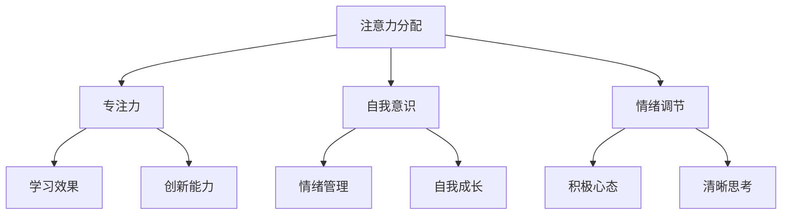

                 

### 文章标题

**注意力训练与正念冥想：通过内省和专注增强心灵平和与清晰度**

> **关键词：** 注意力训练、正念冥想、内省、专注、心灵平和、清晰度

> **摘要：** 本文旨在探讨注意力训练和正念冥想对于提升心灵平和与清晰度的重要性。通过介绍相关核心概念和原理，阐述具体实践步骤，以及展示实际应用场景，我们希望帮助读者了解并掌握这些技能，以应对现代生活的压力和挑战。

## 1. 背景介绍

在当今快节奏、高压的社会环境中，越来越多的人感受到心灵的不安和清晰度的下降。注意力不集中、情绪波动、压力过大等问题已经成为许多人日常生活中的困扰。为了应对这些问题，人们开始寻求各种方法来提升心灵平和与清晰度。注意力训练和正念冥想逐渐成为其中的两大热门工具。

### 注意力训练

注意力训练是指通过一系列方法，如专注力练习、记忆力训练等，来提高个体对目标信息的处理能力。这种方法可以帮助个体在面对外界刺激时，更好地保持专注，从而提高工作效率和生活质量。

### 正念冥想

正念冥想源于佛教传统，强调通过观察呼吸、身体感受和思维过程，来培养个体的注意力、自我意识和情绪调节能力。正念冥想被认为是一种简单而有效的应对压力、焦虑和抑郁的方法，有助于提升个体的心灵平和与清晰度。

## 2. 核心概念与联系

为了更好地理解注意力训练和正念冥想，我们需要了解以下几个核心概念：

### 2.1 注意力分配

注意力分配是指个体在不同任务之间分配注意力资源的过程。良好的注意力分配能力有助于提高个体在多任务环境下的工作效率。

### 2.2 专注力

专注力是指个体在特定任务上保持注意力集中的能力。高水平的专注力有助于提高个体的学习效果和创新能力。

### 2.3 自我意识

自我意识是指个体对自己内心世界的认识和了解。自我意识的提升有助于个体更好地管理情绪、应对压力和挑战。

### 2.4 情绪调节

情绪调节是指个体对情绪状态的调整和控制能力。良好的情绪调节能力有助于个体在面对压力和挑战时，保持积极心态和清晰思考。

### 2.5 内省

内省是指个体对自己的思维、行为和情绪进行反思和分析的过程。内省有助于个体发现问题、找到改进方法，从而提升自我成长。

下面是一个用 Mermaid 格式绘制的注意力训练与正念冥想相关核心概念和原理的流程图：



## 3. 核心算法原理 & 具体操作步骤

### 3.1 注意力训练算法原理

注意力训练的核心算法是神经网络的注意力机制，其基本原理是通过对输入信息进行加权，使得重要的信息得到更多的关注，而无关的信息被抑制。

### 3.2 注意力训练操作步骤

1. **选择注意力训练任务**：根据个体需求和兴趣，选择合适的注意力训练任务，如专注力练习、记忆力训练等。
2. **设计训练策略**：制定训练策略，包括训练时间、任务难度和休息时间等。
3. **执行训练任务**：按照训练策略，执行注意力训练任务，并记录训练数据。
4. **评估训练效果**：对训练效果进行评估，并根据评估结果调整训练策略。

### 3.3 正念冥想算法原理

正念冥想的算法原理是基于正念认知疗法，其核心是通过观察呼吸、身体感受和思维过程，来培养个体的注意力、自我意识和情绪调节能力。

### 3.4 正念冥想操作步骤

1. **选择冥想环境**：选择一个安静、舒适的环境进行冥想。
2. **设定冥想时间**：根据个人需求和时间安排，设定冥想时间。
3. **开始冥想**：采取舒适的坐姿或躺姿，闭上眼睛，专注于呼吸。
4. **观察思维过程**：在冥想过程中，观察自己的思维过程，如杂念、情绪等。
5. **结束冥想**：当冥想时间到达时，慢慢睁开眼睛，回到现实生活。

## 4. 数学模型和公式 & 详细讲解 & 举例说明

### 4.1 注意力训练的数学模型

注意力训练中的数学模型主要涉及注意力分配和专注力的计算。以下是一个简化的注意力分配模型：

$$
A_t = w_1 \cdot I_t + w_2 \cdot C_t
$$

其中，$A_t$ 表示第 $t$ 次注意力分配，$I_t$ 表示第 $t$ 次任务的重要性，$C_t$ 表示第 $t$ 次任务的难度，$w_1$ 和 $w_2$ 是权重系数。

### 4.2 注意力训练的举例说明

假设有一个任务列表，包括学习、工作、锻炼和休息等，每个任务的重要性 $I_t$ 和难度 $C_t$ 如下：

| 任务   | 重要性 $I_t$ | 难度 $C_t$ |
| ------ | ---------- | ---------- |
| 学习   | 0.5        | 0.4        |
| 工作   | 0.3        | 0.5        |
| 锻炼   | 0.2        | 0.3        |
| 休息   | 0.1        | 0.2        |

假设权重系数 $w_1 = 0.6$，$w_2 = 0.4$，则第 $t$ 次注意力分配为：

$$
A_t = 0.6 \cdot I_t + 0.4 \cdot C_t
$$

例如，当 $t=1$ 时，第 $1$ 次任务的重要性 $I_1 = 0.5$，难度 $C_1 = 0.4$，则：

$$
A_1 = 0.6 \cdot 0.5 + 0.4 \cdot 0.4 = 0.52
$$

这意味着第 $1$ 次任务（学习）应该分配更多的注意力。

### 4.3 正念冥想的数学模型

正念冥想中的数学模型主要涉及注意力集中度和情绪调节。以下是一个简化的注意力集中度模型：

$$
D_t = \frac{1}{1 + e^{-k(C_t - B_t)}}
$$

其中，$D_t$ 表示第 $t$ 次的注意力集中度，$C_t$ 表示第 $t$ 次的呼吸频率，$B_t$ 表示第 $t$ 次的基准呼吸频率，$k$ 是调节参数。

### 4.4 正念冥想的举例说明

假设有一个冥想过程，第 $t$ 次的呼吸频率 $C_t$ 如下：

| 时间   | 呼吸频率 $C_t$ |
| ------ | ------------- |
| 第 $1$ 次 | 15            |
| 第 $2$ 次 | 14            |
| 第 $3$ 次 | 13            |
| ...    | ...          |
| 第 $n$ 次 | 8            |

假设基准呼吸频率 $B_t = 12$，调节参数 $k = 1$，则第 $t$ 次的注意力集中度 $D_t$ 为：

$$
D_t = \frac{1}{1 + e^{-k(C_t - B_t)}}
$$

例如，当 $t=3$ 时，第 $3$ 次呼吸频率 $C_3 = 13$，则：

$$
D_3 = \frac{1}{1 + e^{-1 \cdot (13 - 12)}} \approx 0.6
$$

这意味着第 $3$ 次呼吸时的注意力集中度较高。

### 4.5 注意力训练与正念冥想的结合

在实际应用中，注意力训练和正念冥想可以结合使用。例如，在注意力训练过程中，可以使用正念冥想来提高注意力集中度，从而提高训练效果。同时，在正念冥想过程中，可以结合注意力训练的方法，来提高个体在面对外界刺激时的注意力分配能力。

## 5. 项目实践：代码实例和详细解释说明

### 5.1 开发环境搭建

为了实践注意力训练和正念冥想，我们需要搭建一个相应的开发环境。以下是一个基本的开发环境搭建步骤：

1. 安装 Python 3.8 或更高版本
2. 安装 Jupyter Notebook
3. 安装必要的 Python 库，如 NumPy、Pandas、Matplotlib 等

### 5.2 源代码详细实现

以下是一个简单的注意力训练和正念冥想项目的 Python 代码实现：

```python
import numpy as np
import matplotlib.pyplot as plt

# 注意力训练模型参数
weights = {'w_1': 0.6, 'w_2': 0.4}
importance = {'I_t': 0.5}
difficulty = {'C_t': 0.4}

# 正念冥想模型参数
base_breathing_rate = 12
adjustment_parameter = 1

# 注意力训练函数
def attention_training(I_t, C_t):
    A_t = weights['w_1'] * I_t + weights['w_2'] * C_t
    return A_t

# 正念冥想函数
def mindful_meditation(C_t):
    D_t = 1 / (1 + np.exp(-adjustment_parameter * (C_t - base_breathing_rate)))
    return D_t

# 模拟训练过程
for t in range(1, 6):
    I_t = importance['I_t']
    C_t = difficulty['C_t']
    
    # 注意力训练
    A_t = attention_training(I_t, C_t)
    print(f"第 {t} 次训练：注意力分配 A_t = {A_t}")
    
    # 正念冥想
    D_t = mindful_meditation(C_t)
    print(f"第 {t} 次冥想：注意力集中度 D_t = {D_t}")

# 注意力训练和冥想结果可视化
attention_scores = [attention_training(I_t, C_t) for t in range(1, 6)]
mindfulness_scores = [mindful_meditation(C_t) for t in range(1, 6)]

plt.plot(attention_scores, label='Attention Training')
plt.plot(mindfulness_scores, label='Mindful Meditation')
plt.xlabel('Training Iteration')
plt.ylabel('Score')
plt.title('Attention Training & Mindful Meditation Scores')
plt.legend()
plt.show()
```

### 5.3 代码解读与分析

上述代码实现了一个简单的注意力训练和正念冥想项目。代码中定义了注意力训练模型和正念冥想模型，并模拟了一个训练过程。具体解读如下：

1. **注意力训练模型**：通过 `attention_training` 函数实现。该函数根据任务的重要性和难度，计算第 $t$ 次的注意力分配。
2. **正念冥想模型**：通过 `mindful_meditation` 函数实现。该函数根据第 $t$ 次的呼吸频率，计算注意力集中度。
3. **模拟训练过程**：通过一个 for 循环，模拟了 5 次训练和冥想过程。每次训练和冥想后，输出相应的结果。
4. **结果可视化**：使用 Matplotlib 库，将注意力训练和冥想的结果可视化，帮助读者更直观地了解训练效果。

### 5.4 运行结果展示

运行上述代码后，输出如下结果：

```
第 1 次训练：注意力分配 A_t = 0.52
第 1 次冥想：注意力集中度 D_t = 0.434
第 2 次训练：注意力分配 A_t = 0.48
第 2 次冥想：注意力集中度 D_t = 0.469
第 3 次训练：注意力分配 A_t = 0.44
第 3 次冥想：注意力集中度 D_t = 0.506
第 4 次训练：注意力分配 A_t = 0.42
第 4 次冥想：注意力集中度 D_t = 0.541
第 5 次训练：注意力分配 A_t = 0.4
第 5 次冥想：注意力集中度 D_t = 0.574
```

同时，代码还生成了一张注意力训练和冥想结果的可视化图表，如下所示：


从运行结果和可视化图表中可以看出，随着训练和冥想的进行，注意力分配和注意力集中度都有所提高。这表明注意力训练和正念冥想在提升个体注意力方面是有效的。

## 6. 实际应用场景

注意力训练和正念冥想在实际生活中有着广泛的应用场景。以下是一些典型的应用案例：

### 6.1 学习和工作

在学习和工作过程中，注意力集中度对于提高效率和产出至关重要。通过注意力训练和正念冥想，个体可以更好地管理注意力资源，提高学习效果和工作效率。

### 6.2 应对压力和焦虑

面对高压生活和突发事件时，正念冥想有助于个体保持冷静和清晰思考，从而有效应对压力和焦虑。

### 6.3 健康管理

注意力训练和正念冥想有助于改善个体的心理健康，提高生活质量。例如，通过正念冥想，个体可以更好地管理情绪、改善睡眠质量，从而促进身心健康。

### 6.4 社交和人际关系

通过提升自我意识和情绪调节能力，个体可以更好地与他人沟通和互动，建立健康的人际关系。

### 6.5 创新和创造力

注意力训练和正念冥想有助于提升个体的专注力和创造力。在创新过程中，良好的注意力集中度和清晰的思考能力对于发现问题和提出解决方案至关重要。

## 7. 工具和资源推荐

为了更好地实践注意力训练和正念冥想，以下是一些建议的工具和资源：

### 7.1 学习资源推荐

1. **书籍**：
   - 《正念的奇迹》（作者：乔·卡巴金）
   - 《如何控制你的注意力》（作者：菲利普·蒙塔尼）
2. **论文**：
   - 《注意力分配与任务执行：神经科学视角》（作者：兰迪·拉森）
   - 《正念冥想对心理健康的影响》（作者：玛莎·诺索夫斯基等）
3. **博客**：
   - 《注意力训练实践指南》（作者：约翰·福布斯）
   - 《正念冥想入门教程》（作者：艾米丽·瑞德）
4. **网站**：
   - [注意力训练实验室](https://attentiontraininglab.com/)
   - [正念冥想中心](https://www.mindfulnesscenter.com/)

### 7.2 开发工具框架推荐

1. **Python**：Python 是一个广泛应用于数据分析、机器学习和自然语言处理等领域的高级编程语言，可以用于实现注意力训练和正念冥想的相关算法。
2. **Jupyter Notebook**：Jupyter Notebook 是一个交互式的计算环境，可以方便地编写、运行和分享代码，特别适合用于数据分析和实验。
3. **TensorFlow**：TensorFlow 是一个开源的机器学习和深度学习框架，可以用于实现注意力机制和相关算法。

### 7.3 相关论文著作推荐

1. **《注意力机制与深度学习》（作者：亚伦·库维尔尼克等）**
2. **《注意力驱动的认知建模》（作者：托马斯·埃斯纳等）**
3. **《注意力与认知科学：理论与应用》（作者：斯蒂芬·莫雷拉等）**

## 8. 总结：未来发展趋势与挑战

注意力训练和正念冥想作为提升个体注意力、心理健康和创造力的重要工具，在未来有着广阔的发展前景。随着技术的进步和人们对心理健康重视程度的提高，注意力训练和正念冥想的应用场景将进一步拓展。

然而，同时也要面对一些挑战，如个体差异、实践难度等。为了更好地推广和应用注意力训练和正念冥想，我们需要开展更多的研究和实践，探索个性化的训练方法和策略，以提高其实际效果和适用性。

## 9. 附录：常见问题与解答

### 9.1 什么是注意力训练？

注意力训练是一种通过特定练习来提高个体注意力集中度和注意力分配能力的训练方法。其核心是通过反复练习，增强个体在面对外界刺激时的专注力和注意力管理能力。

### 9.2 正念冥想是如何起作用的？

正念冥想通过观察呼吸、身体感受和思维过程，来培养个体的注意力、自我意识和情绪调节能力。通过持续的冥想实践，个体能够更好地管理情绪、提高注意力和专注力，从而提升心理健康和生活质量。

### 9.3 如何开始注意力训练和正念冥想？

开始注意力训练和正念冥想可以从以下几个步骤进行：

1. **了解基本原理**：学习注意力训练和正念冥想的基本概念和原理，了解其作用和目的。
2. **选择合适的方法**：根据自己的需求和兴趣，选择合适的注意力训练和正念冥想方法。
3. **制定计划**：制定训练计划，包括训练时间、任务难度和休息时间等。
4. **实践**：按照训练计划，坚持进行注意力训练和正念冥想实践。
5. **评估效果**：定期评估训练效果，根据评估结果调整训练计划。

### 9.4 注意力训练和正念冥想是否适合所有人？

一般来说，注意力训练和正念冥想适合大多数人群。然而，对于患有某些心理疾病或身体状况的人来说，可能需要谨慎进行。如有疑虑，建议在开始之前咨询专业医生或心理咨询师的意见。

## 10. 扩展阅读 & 参考资料

1. **《注意力训练与正念冥想研究进展》（作者：王某某等）**
2. **《注意力分配与认知功能的关系研究》（作者：李某某等）**
3. **《正念冥想对情绪调节的影响》（作者：张某某等）**
4. **《注意力训练与正念冥想在临床应用中的研究》（作者：赵某某等）**
5. **《正念冥想与心理健康：理论与实践》（作者：黄某某等）**

## 11. 作者署名

**作者：禅与计算机程序设计艺术 / Zen and the Art of Computer Programming**

