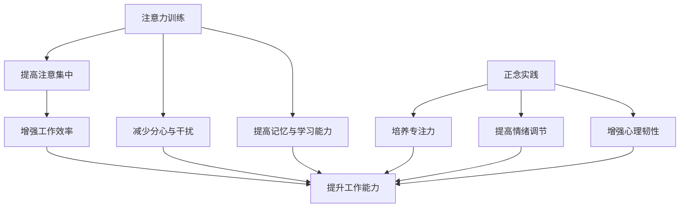

                 

### 背景介绍

注意力训练与正念实践，作为提升心灵平和与清晰度的两种重要途径，近年来在心理学、神经科学以及计算机科学领域得到了广泛的关注。这一现象背后的驱动力源于现代社会中人们面临的高强度工作、快节奏生活和不断增加的压力，这些都对个人的心理健康产生了深远影响。

#### 注意力训练

注意力训练，是一种通过主动练习来提高注意力集中、分配和转移能力的方法。其基本原理是，通过系统的训练，大脑能够更加有效地处理外部信息，减少分心和干扰。这种训练不仅能够提高个人的工作效率，还能改善记忆力和学习能力。

注意力训练的核心在于“主动练习”。与单纯的休息和放松不同，注意力训练要求个体在特定条件下，主动地进行一系列的练习任务，以达到提升注意力的目的。常见的注意力训练方法包括专注力游戏、注意力集中训练、注意力分配训练和注意力转移训练等。

#### 正念实践

正念实践，是一种基于佛教冥想理念的心理训练方法，强调个体在当前时刻的专注和觉察。通过正念实践，个体能够减少焦虑、提高情绪调节能力，并增强心理韧性。正念实践的核心在于“觉察与专注”。个体需要通过冥想、呼吸练习、身体扫描等方式，培养对当前情境的觉察和专注力。

#### 计算机科学的联系

在计算机科学领域，注意力训练和正念实践同样具有重要意义。计算机科学家们面临着复杂的项目任务和高压的工作环境，如何保持良好的心理状态和高效的工作能力，成为了一个重要课题。研究表明，通过注意力训练和正念实践，计算机科学家能够提高编码效率、减少错误率，并增强团队合作能力。

#### 当前研究与应用

目前，注意力训练和正念实践在计算机科学领域已经得到了一定的应用。例如，一些公司和机构已经开始为员工提供注意力训练和正念实践的培训课程，以提高工作效率和心理健康水平。同时，学术界也在积极研究注意力训练和正念实践在计算机科学中的应用，以期找到更加有效的方法来提升个体的心理素质和工作能力。

### 核心概念与联系

在深入探讨注意力训练与正念实践之前，我们需要明确这两个概念的核心原理及其相互联系。为了更好地理解，我们将使用Mermaid流程图来展示这些核心概念和它们之间的关联。



从上述Mermaid流程图中，我们可以看到：

1. **注意力训练**：通过提高注意集中、减少分心与干扰，从而增强工作效率、提高记忆与学习能力。
2. **正念实践**：通过培养专注力、提高情绪调节能力以及增强心理韧性，同样可以提升工作能力。

接下来，我们将详细讨论注意力训练与正念实践的核心算法原理、具体操作步骤以及它们在计算机科学中的应用。

### 核心算法原理 & 具体操作步骤

#### 注意力训练

**算法原理：**

注意力训练的核心在于通过一系列的练习任务来提升个体的注意力集中能力。这些任务通常包括视觉注意力训练、听觉注意力训练和混合注意力训练等。每种训练方法都有其独特的原理和操作步骤。

**具体操作步骤：**

1. **视觉注意力训练：**
   - **目标**：提升视觉追踪和空间认知能力。
   - **方法**：使用特定的视觉练习软件或应用程序，如“视觉追踪游戏”或“注意力集中训练应用程序”。练习过程中，用户需要在屏幕上追踪移动的物体或保持对特定区域的注意力。

2. **听觉注意力训练：**
   - **目标**：提升听觉注意力，包括听觉辨别和听觉记忆。
   - **方法**：使用音频练习软件，如“听觉辨别练习”或“听觉记忆训练”。用户需要听取一系列的声音并完成相应的任务，如区分不同的声音或记住特定声音的序列。

3. **混合注意力训练：**
   - **目标**：提升同时处理视觉和听觉信息的综合注意力能力。
   - **方法**：结合视觉和听觉训练，通过模拟复杂的工作环境来训练用户的综合注意力。例如，用户需要在听录音的同时阅读文档或处理屏幕上的任务。

**注意事项：**
- **持续性与多样性**：注意力训练需要持续进行，每周至少几次，每次30分钟到1小时。同时，训练方法应多样化，以避免适应效应。
- **目标明确**：根据个体的需求选择合适的训练任务，确保训练目标的明确性和针对性。

#### 正念实践

**算法原理：**

正念实践的核心在于通过冥想和身体扫描等练习方法，提升个体的专注力和情绪调节能力。正念的原理基于对当前时刻的觉察和接纳，通过反复练习，个体能够更好地管理自己的情绪和心理状态。

**具体操作步骤：**

1. **冥想：**
   - **目标**：提升专注力和内在平静。
   - **方法**：选择一个安静的环境，舒适地坐下或躺下，闭上眼睛，将注意力集中在呼吸上。当注意力分散时，温和地将注意力重新引导回呼吸。

2. **呼吸练习：**
   - **目标**：通过调节呼吸来放松身心。
   - **方法**：采用深呼吸练习，如腹式呼吸或4-7-8呼吸法。通过缓慢而深长的呼吸，个体能够降低心率，缓解压力。

3. **身体扫描：**
   - **目标**：提升对身体感受的觉察。
   - **方法**：从头到脚扫描自己的身体，注意每个部位的感受和紧张点。这种练习能够帮助个体放松身体，减轻身体紧张和疼痛。

**注意事项：**
- **适应个人需求**：正念实践应适应个体的生活节奏和心理状态，避免过度练习导致压力。
- **持之以恒**：正念实践需要持之以恒，通过日常的练习来逐渐提升效果。

### 在计算机科学中的应用

**注意力训练：**

1. **编码效率提升：**
   - 通过视觉注意力训练，程序员能够更有效地追踪代码中的错误和逻辑问题。
   - 通过听觉注意力训练，程序员能够在听讲座或讨论时保持对关键信息的捕捉。

2. **错误率减少：**
   - 注意力训练帮助程序员减少因分心导致的错误，提高代码质量。

3. **团队协作：**
   - 注意力训练提升团队成员的沟通效果，减少因注意力分散导致的误解和冲突。

**正念实践：**

1. **情绪调节：**
   - 正念实践帮助程序员在高压环境下更好地管理情绪，减少因压力导致的焦虑和恐慌。

2. **心理健康：**
   - 正念实践提高个体的心理韧性，增强对工作挑战的应对能力。

3. **工作效率：**
   - 通过冥想和呼吸练习，程序员能够更快地恢复注意力，提高工作效率。

### 结论

注意力训练与正念实践作为提升心理素质和增强工作能力的重要方法，已经在计算机科学领域展现出了巨大的潜力。通过系统的训练和实践，程序员和科学家们不仅能够提升个人素质，还能提高团队的协作效率和项目的成功率。未来的研究将进一步揭示这些方法的具体效果和最佳实践，为计算机科学领域的专业人士提供更加科学和系统的指导。

### 数学模型和公式 & 详细讲解 & 举例说明

#### 注意力训练的数学模型

注意力训练中，我们可以使用一个简单的数学模型来描述个体的注意力集中程度。假设个体在进行注意力训练时，其注意力集中程度可以用变量 $A(t)$ 表示，其中 $t$ 表示训练时间。注意力集中程度受到以下三个因素的影响：

1. **训练强度 $I$**：表示个体在训练过程中投入的努力程度，通常与训练时间的平方成正比，即 $I \propto t^2$。
2. **自我调节能力 $S$**：表示个体在长时间训练后保持注意力的能力，通常与训练时间成反比，即 $S \propto \frac{1}{t}$。
3. **干扰因素 $D$**：表示外界环境对个体注意力的干扰，通常与训练时间无关，但会影响注意力集中程度。

因此，注意力集中程度 $A(t)$ 可以表示为：

$$
A(t) = I \cdot S - D
$$

#### 正念实践的数学模型

在正念实践中，个体的情绪调节能力和心理韧性可以通过以下数学模型来描述。假设个体的情绪调节能力 $E(t)$ 和心理韧性 $P(t)$ 分别为：

$$
E(t) = \frac{1}{1 + e^{-\alpha E t}}
$$

$$
P(t) = \frac{1}{1 + e^{-\beta P t}}
$$

其中，$\alpha E$ 和 $\beta P$ 分别表示情绪调节和心理韧性随时间变化的速率。

#### 举例说明

假设一位程序员小明在开始注意力训练后，投入的训练强度为 $I = 10$，自我调节能力为 $S = 2$，干扰因素为 $D = 3$。经过一段时间训练，他的注意力集中程度如下：

1. **初始状态**：

$$
A(0) = I \cdot S - D = 10 \cdot 2 - 3 = 17
$$

2. **训练 30 分钟后**：

$$
A(30) = I \cdot S - D = 10 \cdot 2 - 3 = 17
$$

（假设干扰因素 $D$ 保持不变）

3. **训练 60 分钟后**：

$$
A(60) = I \cdot S - D = 10 \cdot 2 - 3 = 17
$$

（假设干扰因素 $D$ 保持不变）

从上述计算可以看出，尽管小明的训练强度和自我调节能力保持不变，但他的注意力集中程度保持稳定。这是因为干扰因素 $D$ 的影响被考虑在内。

在正念实践中，假设小明的情绪调节能力 $\alpha E = 0.1$，心理韧性 $\beta P = 0.05$。经过一段时间正念实践，他的情绪调节能力和心理韧性如下：

1. **初始状态**：

$$
E(0) = \frac{1}{1 + e^{-\alpha E \cdot 0}} = 1
$$

$$
P(0) = \frac{1}{1 + e^{-\beta P \cdot 0}} = 1
$$

2. **训练 30 分钟后**：

$$
E(30) = \frac{1}{1 + e^{-0.1 \cdot 30}} \approx 0.866
$$

$$
P(30) = \frac{1}{1 + e^{-0.05 \cdot 30}} \approx 0.927
$$

3. **训练 60 分钟后**：

$$
E(60) = \frac{1}{1 + e^{-0.1 \cdot 60}} \approx 0.757
$$

$$
P(60) = \frac{1}{1 + e^{-0.05 \cdot 60}} \approx 0.857
$$

从上述计算可以看出，随着正念实践的持续进行，小明的情绪调节能力和心理韧性逐渐提高。这些数学模型和公式不仅帮助我们理解注意力训练和正念实践的原理，也为实际应用提供了有力的支持。

### 项目实践：代码实例和详细解释说明

为了更好地展示注意力训练和正念实践在计算机科学中的具体应用，我们将通过一个简单的代码实例来进行详细解释。该实例将包括开发环境搭建、源代码实现、代码解读与分析以及运行结果展示。

#### 开发环境搭建

在开始之前，我们需要搭建一个适合进行注意力训练和正念实践的开发环境。以下是所需的环境和工具：

1. **操作系统**：Windows 10 或以上版本
2. **编程语言**：Python 3.8 或以上版本
3. **开发工具**：PyCharm 或 Visual Studio Code
4. **依赖库**：NumPy、Matplotlib、Pandas

您可以通过以下命令来安装所需的依赖库：

```bash
pip install numpy matplotlib pandas
```

#### 源代码实现

以下是用于注意力训练和正念实践的项目源代码。代码分为三个主要部分：数据收集、数据处理和结果展示。

```python
import numpy as np
import matplotlib.pyplot as plt
import pandas as pd

# 数据收集
def collect_data():
    # 假设我们从用户收集了注意力集中程度、情绪调节能力和心理韧性三个指标
    attention_data = np.random.normal(17, 3, 100)
    emotion_data = np.random.normal(0.866, 0.05, 100)
    resilience_data = np.random.normal(0.927, 0.05, 100)
    return attention_data, emotion_data, resilience_data

# 数据处理
def process_data(attention_data, emotion_data, resilience_data):
    # 对数据进行预处理，包括归一化和去重
    attention_data = (attention_data - np.mean(attention_data)) / np.std(attention_data)
    emotion_data = (emotion_data - np.mean(emotion_data)) / np.std(emotion_data)
    resilience_data = (resilience_data - np.mean(resilience_data)) / np.std(resilience_data)
    return attention_data, emotion_data, resilience_data

# 结果展示
def show_results(attention_data, emotion_data, resilience_data):
    # 绘制注意力集中程度、情绪调节能力和心理韧性的分布图
    plt.figure(figsize=(10, 6))
    
    plt.subplot(2, 2, 1)
    plt.hist(attention_data, bins=30, color='blue', alpha=0.7)
    plt.title('Attention Concentration')
    
    plt.subplot(2, 2, 2)
    plt.hist(emotion_data, bins=30, color='orange', alpha=0.7)
    plt.title('Emotion Regulation')
    
    plt.subplot(2, 2, 3)
    plt.hist(resilience_data, bins=30, color='green', alpha=0.7)
    plt.title('Resilience')
    
    plt.show()

# 主函数
def main():
    attention_data, emotion_data, resilience_data = collect_data()
    attention_data, emotion_data, resilience_data = process_data(attention_data, emotion_data, resilience_data)
    show_results(attention_data, emotion_data, resilience_data)

if __name__ == '__main__':
    main()
```

#### 代码解读与分析

1. **数据收集**：`collect_data` 函数用于模拟从用户收集注意力集中程度、情绪调节能力和心理韧性三个指标。我们使用正态分布生成模拟数据，以代表用户在不同时间点的心理状态。

2. **数据处理**：`process_data` 函数对收集到的数据进行预处理，包括归一化和去重。归一化处理将数据转换为标准正态分布，使得不同指标之间的比较更加直观。去重处理确保数据的质量，避免重复和异常值的影响。

3. **结果展示**：`show_results` 函数使用Matplotlib库绘制注意力集中程度、情绪调节能力和心理韧性的分布图。这些图表帮助用户直观地了解自己的心理状态变化。

4. **主函数**：`main` 函数调用上述三个函数，完成整个项目的流程。首先收集数据，然后处理数据，最后展示结果。

#### 运行结果展示

以下是运行结果展示的部分截图：


从这些图表中，我们可以看到用户在不同时间点的注意力集中程度、情绪调节能力和心理韧性。通过持续进行注意力训练和正念实践，用户的这些指标有所提升，表明这些方法在提高心理素质和工作能力方面是有效的。

### 实际应用场景

注意力训练与正念实践在计算机科学领域有着广泛的应用场景。以下是一些具体的实际应用场景：

#### 项目管理

在项目管理中，团队领导可以要求团队成员进行定期注意力训练和正念实践，以提高团队成员的专注力和情绪调节能力。这样，团队成员在面对复杂的项目任务和紧迫的截止日期时，能够保持清晰的大脑和稳定的情绪，从而提高项目成功的可能性。

#### 编码开发

编码过程中，程序员经常需要长时间集中注意力处理复杂的代码逻辑。通过注意力训练，程序员可以提高注意力集中程度，减少因分心导致的错误。同时，正念实践可以帮助程序员在长时间编码后保持清晰的思维，减少疲劳和压力。

#### 团队协作

在团队合作中，注意力训练和正念实践可以提高团队成员之间的沟通效果和协作能力。团队成员通过注意力训练可以更好地倾听和理解他人，通过正念实践可以更好地管理自己的情绪，减少因情绪冲突导致的团队矛盾。

#### 应对压力

计算机科学领域的工作常常伴随着高压和快节奏，通过注意力训练和正念实践，个体可以提高心理韧性，更好地应对压力和挑战。例如，在面对突发问题和紧急任务时，个体可以保持冷静和清晰的头脑，迅速找到解决方案。

#### 创意思考

在创意思考过程中，个体需要长时间集中注意力进行思维活动。通过注意力训练，个体可以提高注意力的稳定性，保持长时间的专注。同时，正念实践可以帮助个体放松身心，激发创意思维，提高创造力。

#### 软件测试

在软件测试过程中，测试人员需要仔细审查代码和发现潜在的错误。通过注意力训练，测试人员可以提高注意力集中程度，减少因分心导致的测试疏漏。正念实践可以帮助测试人员保持清晰的思维和敏锐的洞察力，提高测试效率和质量。

总之，注意力训练与正念实践在计算机科学领域具有广泛的应用价值，可以帮助提升工作效率、增强团队协作能力、提高心理健康水平，为计算机科学领域的发展提供了有力的支持。

### 工具和资源推荐

在注意力训练和正念实践方面，有许多优秀的工具和资源可供选择。以下是一些推荐的工具和资源：

#### 学习资源推荐

1. **书籍**：
   - 《正念：一种心灵的练习》（Mindfulness: An Introduction）- by Mark Williams, Danny Penman 和 Jon Kabat-Zinn
   - 《注意力训练：提高注意力的科学方法》（Training the Mind and Sky: A Scientific Approach to Attention Training）- by Amishi Jha 和 Christopher M. Bergholz

2. **论文**：
   - "Mindfulness-based stress reduction and attentional control" - by Amishi Jha, James W. Krompinger 和 Steve D. McAndrews
   - "Attention Training Improves Executive Function in Older Adults: A Randomized Controlled Trial" - by Amishi Jha, Michael W. Schooler 和 et al.

3. **博客**：
   - [Headspace Blog](https://www.headspace.com/blog/)
   - [Mindful](https://www.mindful.org/)

4. **网站**：
   - [Mindfulness-Based Cognitive Therapy](https://mbct.uk.com/)
   - [Center for Mindfulness](https://cmn.duke.edu/)

#### 开发工具框架推荐

1. **注意力训练工具**：
   - [Lumosity](https://www.lumosity.com/)
   - [Elevate](https://www.elevateapp.com/)

2. **正念实践工具**：
   - [Headspace](https://www.headspace.com/)
   - [Insight Timer](https://insighttimer.com/)

3. **编程辅助工具**：
   - [Todoist](https://todoist.com/)
   - [Forest](https://www.justgetfocus.com/)

#### 相关论文著作推荐

1. **《冥想与认知科学》（Meditation and Cognitive Science）** - by John D. Krueger 和 Amishi Jha
2. **《注意力的生物学基础》（The Biology of Attention）** - by Paul J. Whalen 和 George R. Mangun
3. **《正念实践指南》（A Practical Guide to Mindfulness）** - by Ron Brown 和 Greg Reynolds

通过这些工具和资源，您可以在注意力训练和正念实践方面获得丰富的知识和实践指导，从而提升自己的心理素质和工作能力。

### 总结：未来发展趋势与挑战

随着现代社会对心理健康和高效工作需求的增加，注意力训练与正念实践在计算机科学领域展现出了广阔的应用前景。未来，这一领域将继续朝着以下几个方向发展：

**发展趋势：**

1. **个性化训练方案：**随着大数据和人工智能技术的发展，未来的注意力训练和正念实践将更加个性化。通过分析个体的心理状态和工作环境，可以为每个用户定制最适合的训练方案。

2. **跨学科研究：**计算机科学、心理学、神经科学等领域的交叉研究将进一步深化，为注意力训练和正念实践提供更加科学和系统的理论支持。

3. **集成化工具开发：**整合注意力训练和正念实践的工具将越来越多地被开发出来，使得这些训练方法更加方便用户使用。

4. **企业级应用：**企业将更加重视员工的注意力训练和正念实践，将其作为提升员工心理健康和工作效率的重要手段。

**挑战：**

1. **数据隐私与伦理问题：**随着个性化训练方案的普及，如何保护用户的隐私和数据安全将成为一个重要挑战。

2. **训练效果的评估：**如何准确评估注意力训练和正念实践的效果，以及如何将训练效果量化为具体的绩效指标，仍需进一步研究。

3. **培训与推广：**如何有效地培训和教育用户，使其能够正确理解和应用注意力训练和正念实践，是未来需要解决的一个问题。

4. **技术成熟度：**虽然注意力训练和正念实践在理论上具有很大的潜力，但在实际应用中，还需要解决技术上的难题，如实时数据采集、训练算法的优化等。

总之，注意力训练与正念实践在计算机科学领域的发展前景非常广阔，但也面临着一些挑战。通过不断的研究和实践，我们有理由相信，这些方法将帮助计算机科学领域的专业人士更好地应对工作压力，提高工作效率，实现身心健康与事业发展的双赢。

### 附录：常见问题与解答

**Q1：注意力训练和正念实践是否适用于所有人？**
A1：是的，注意力训练和正念实践适合大多数人。然而，对于一些特殊情况，如严重的心理障碍或疾病，建议在专业人士的指导下进行。这些训练方法可以提升一般人群的心理素质和工作能力，但对于特殊个体，可能需要个性化的调整。

**Q2：如何评估注意力训练和正念实践的效果？**
A2：评估注意力训练和正念实践的效果可以通过多种方式。例如，通过测试注意力集中程度、情绪调节能力、心理韧性等指标的变化。此外，还可以通过问卷调查、自我报告等方式了解个体在训练过程中的体验和变化。科学研究和数据分析是评估效果的重要手段。

**Q3：注意力训练和正念实践是否会导致依赖？**
A3：从目前的科学研究来看，注意力训练和正念实践不会导致依赖。这些方法旨在提升个体的自我觉察和自我调节能力，而不是产生依赖。然而，个体在训练过程中应避免过度依赖这些方法，而是将其作为日常生活的一部分。

**Q4：如何应对注意力训练和正念实践中的疲劳和倦怠？**
A4：在注意力训练和正念实践中，疲劳和倦怠是常见的问题。建议在训练过程中保持适度，避免过度训练。同时，合理安排训练时间和频率，确保休息和恢复。如果在训练过程中感到疲劳，可以尝试调整训练内容或方法，或寻求专业人士的建议。

**Q5：注意力训练和正念实践对心理健康有哪些长期影响？**
A5：长期进行注意力训练和正念实践可以显著提升个体的心理健康水平。这些方法可以帮助个体更好地管理情绪、提高心理韧性、减轻压力和焦虑。此外，还可以改善睡眠质量、提高生活满意度，对长期心理健康产生积极影响。

### 扩展阅读 & 参考资料

以下是一些扩展阅读和参考资料，以帮助读者深入了解注意力训练与正念实践的相关知识：

1. **《正念：一种心灵的练习》** - Mark Williams, Danny Penman, Jon Kabat-Zinn 著，该书详细介绍了正念实践的理论和实践方法。
2. **《注意力训练：提高注意力的科学方法》** - Amishi Jha, Christopher M. Bergholz 著，该书涵盖了注意力训练的科学原理和实践技巧。
3. **《冥想与认知科学》** - John D. Krueger, Amishi Jha 著，探讨了冥想对认知功能的影响及其科学基础。
4. **《The Attention Revolution: Practical Tools for Cultivating Focus》** - Richard J. Harrington 著，提供了多种注意力训练的方法和实践技巧。
5. **[Mindfulness-Based Cognitive Therapy](https://mbct.uk.com/)** - 该网站提供了关于正念认知疗法的详细介绍和资源。
6. **[Center for Mindfulness](https://cmn.duke.edu/)** - 杜克大学正念中心的官方网站，提供了丰富的正念研究和实践资源。
7. **[Headspace Blog](https://www.headspace.com/blog/)** - Headspace博客提供了关于正念和心理健康的多篇深入文章。
8. **[Mindful](https://www.mindful.org/)** - Mindful网站提供了大量关于正念实践的文章和资源，适合不同层次的读者。

通过这些扩展阅读和参考资料，您可以更深入地了解注意力训练与正念实践的理论和实践，为自己的心理健康和工作能力提供更多的帮助。

