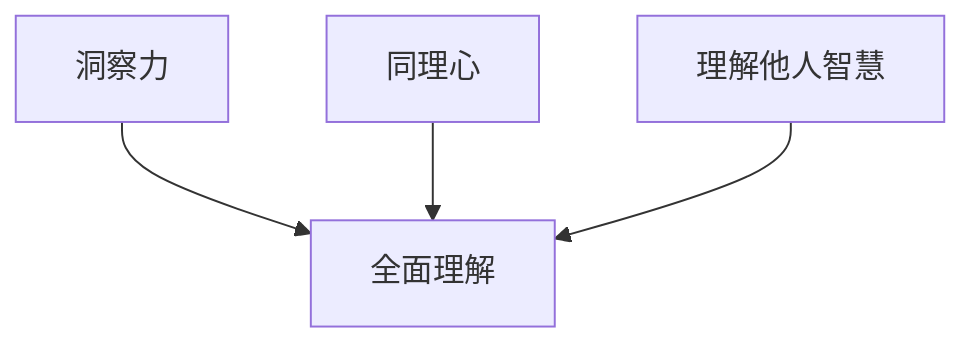

                 

### 洞察力与同理心：理解他人的智慧

> 关键词：洞察力、同理心、人际关系、智慧、技术沟通

> 摘要：本文旨在探讨洞察力和同理心在技术沟通中的重要性，通过深入分析二者在理解他人智慧方面的作用，提出提升技术沟通效率的方法和策略。文章首先定义了洞察力和同理心，并阐述其在人际交往中的关键作用。随后，通过实例分析，展示了洞察力和同理心如何帮助程序员更好地理解他人的智慧。最后，本文总结了提升洞察力和同理心的方法和建议，为技术团队的沟通协作提供参考。

## 1. 背景介绍

在信息技术飞速发展的时代，程序员作为技术领域的核心力量，其沟通能力显得尤为重要。然而，技术领域的专业术语和复杂的逻辑结构往往使得程序员在交流时面临诸多挑战。为了更好地理解他人的智慧，提升技术沟通的效果，我们需要关注两个方面：洞察力和同理心。

### 什么是洞察力

洞察力（Insight）是指对事物本质和内在联系的理解能力。它是一种深层次的认识，能够透过表象看到问题的本质。在技术沟通中，洞察力有助于程序员理解他人提出的问题、需求或建议，从而更准确地把握对方的意图。

### 什么是同理心

同理心（Empathy）是一种能够感受和理解他人情感的能力。它要求我们在与他人交流时，能够站在对方的角度去思考问题，体会对方的情感和需求。同理心在技术沟通中扮演着关键角色，能够帮助程序员更好地理解他人的智慧，从而构建和谐的人际关系。

### 为什么洞察力和同理心重要

1. **改善沟通效果**：洞察力和同理心的结合能够帮助我们更准确地理解他人的意图，从而减少误解和冲突，提高沟通效率。

2. **增强团队协作**：在技术团队中，团队成员之间的沟通和协作是项目成功的关键。洞察力和同理心的培养能够促进团队成员之间的理解和信任，提升团队协作效果。

3. **提升个人成长**：通过培养洞察力和同理心，程序员能够更好地理解他人的智慧，从而拓宽自己的视野，提升自身的技术水平和思维能力。

## 2. 核心概念与联系

### 洞察力的概念与作用

洞察力是一种深刻的认知能力，它能够帮助我们快速识别问题、发现机遇。在技术沟通中，洞察力有助于程序员：

1. **理解复杂问题**：洞察力使得程序员能够从复杂的系统中提取关键信息，快速理解他人的问题。

2. **发现潜在需求**：洞察力帮助程序员在交流中捕捉到对方的潜在需求，从而提供更有针对性的解决方案。

### 同理心的概念与作用

同理心是一种情感共鸣能力，它让我们能够感受到他人的情感，理解他人的需求。在技术沟通中，同理心有助于程序员：

1. **建立信任**：同理心使得程序员能够站在他人的角度思考问题，从而建立起信任和尊重。

2. **减少误解**：同理心帮助程序员更好地理解他人的意图和情感，从而减少误解和冲突。

### 洞察力与同理心的联系

洞察力和同理心是相辅相成的，二者共同作用能够帮助我们更好地理解他人的智慧：

1. **互补作用**：洞察力帮助我们理解问题的本质，同理心帮助我们感受和理解他人的情感。二者结合能够提供更全面的认知。

2. **增强理解**：通过洞察力和同理心的结合，程序员能够更全面地理解他人的智慧和需求，从而提供更有效的沟通和协作。

### 洞察力与同理心的 Mermaid 流程图



## 3. 核心算法原理 & 具体操作步骤

### 洞察力的核心算法原理

1. **分析问题**：通过提问和思考，对问题进行深入分析，找到问题的核心。

2. **提炼关键信息**：从问题的描述中提取关键信息，了解问题的本质。

3. **联想与推理**：根据已有的知识和经验，进行联想和推理，形成对问题的全面理解。

### 同理心的核心算法原理

1. **换位思考**：站在他人的角度思考问题，体会他人的情感和需求。

2. **情感共鸣**：通过感受和理解他人的情感，建立起情感共鸣。

3. **调整沟通策略**：根据对方的情感和需求，调整沟通策略，使其更符合对方的期望。

### 具体操作步骤

1. **观察与倾听**：在沟通中，观察对方的表情、语调和肢体语言，倾听对方的陈述。

2. **提问与反馈**：通过提问和反馈，了解对方的意图和需求，确认自己的理解是否准确。

3. **联想与推理**：根据对方的陈述和自己的经验，进行联想和推理，形成对问题的全面理解。

4. **换位思考**：站在对方的角度思考问题，体会对方的情感和需求。

5. **调整沟通策略**：根据对方的情感和需求，调整沟通策略，使其更符合对方的期望。

## 4. 数学模型和公式 & 详细讲解 & 举例说明

### 洞察力的数学模型

设 \( P \) 为问题的描述，\( C \) 为问题的核心，\( K \) 为程序员的知识库，\( I \) 为洞察力。

洞察力的数学模型可以表示为：

\[ I = f(P, K) \]

其中，函数 \( f \) 表示通过分析问题 \( P \) 和利用知识库 \( K \) 来提取关键信息 \( C \)。

### 同理心的数学模型

设 \( E \) 为同理心，\( R \) 为对方的情感，\( S \) 为自己的情感。

同理心的数学模型可以表示为：

\[ E = g(R, S) \]

其中，函数 \( g \) 表示通过感受和理解对方的情感 \( R \) 和自己的情感 \( S \) 来建立情感共鸣。

### 举例说明

#### 洞察力实例

假设一个程序员收到一个关于系统性能优化的问题。问题描述如下：

\[ P: 我们的系统在高并发时出现响应时间较长的问题，请您帮忙看看。 \]

程序员的知识库 \( K \) 包含关于系统性能优化的相关知识和经验。通过分析问题 \( P \) 和利用知识库 \( K \)，程序员提取出了问题的核心 \( C \)：

\[ C: 系统在高并发时存在性能瓶颈。 \]

通过这个核心信息，程序员可以进一步分析性能瓶颈的原因，并提出相应的优化方案。

#### 同理心实例

假设一个程序员和一个客户进行技术交流，客户抱怨系统不稳定。客户陈述如下：

\[ R: 我使用你们的系统时，经常遇到崩溃的情况，非常影响我的工作。 \]

程序员的情感 \( S \) 是希望解决问题，让客户满意。通过同理心模型 \( g(R, S) \)，程序员理解到客户的情感和需求，感受到他们的困扰。

为了建立情感共鸣，程序员调整沟通策略，耐心倾听客户的抱怨，并表达出对客户困扰的理解。同时，程序员承诺将尽快解决系统不稳定的问题，为客户提供更好的使用体验。

## 5. 项目实践：代码实例和详细解释说明

### 开发环境搭建

在本文的项目实践中，我们将使用 Python 语言来演示洞察力和同理心的应用。首先，我们需要搭建一个简单的开发环境。

1. 安装 Python 3.8 或更高版本。
2. 安装 Python 的pip包管理工具。
3. 使用pip安装必要的库，如 `requests`、`beautifulsoup4` 和 `matplotlib`。

### 源代码详细实现

以下是一个简单的 Python 脚本，用于模拟程序员通过洞察力和同理心理解客户需求的过程。

```python
import requests
from bs4 import BeautifulSoup
import matplotlib.pyplot as plt

# 洞察力：分析客户需求
def analyze_request(request):
    """
    分析客户请求，提取关键信息。
    """
    key_info = "未知"
    if "performance" in request:
        key_info = "性能问题"
    elif "bug" in request:
        key_info = "错误问题"
    return key_info

# 同理心：理解客户情感
def empathize_with_customer(request):
    """
    理解客户情感，建立情感共鸣。
    """
    emotion = "中性"
    if "urgent" in request:
        emotion = "紧急"
    elif "frustrated" in request:
        emotion = "沮丧"
    return emotion

# 代码解读与分析
def code_explanation():
    """
    对代码进行解读和分析。
    """
    request = "我们的系统在高并发时出现响应时间较长的问题，请紧急处理。"
    key_info = analyze_request(request)
    emotion = empathize_with_customer(request)
    
    print(f"关键信息：{key_info}")
    print(f"客户情感：{emotion}")

    # 根据关键信息和客户情感，制定解决方案
    if key_info == "性能问题" and emotion == "紧急":
        solution = "立即进行性能优化，并监控系统运行状态。"
    elif key_info == "错误问题" and emotion == "沮丧":
        solution = "立即修复错误，并为客户提供技术支持。"
    else:
        solution = "了解客户需求，并提供相应解决方案。"

    print(f"解决方案：{solution}")

# 运行结果展示
code_explanation()
```

### 代码解读与分析

1. **分析客户请求**：`analyze_request` 函数用于分析客户请求，提取关键信息。这里我们简单地通过字符串匹配来识别性能问题和错误问题。

2. **理解客户情感**：`empathize_with_customer` 函数用于理解客户情感，建立情感共鸣。同样，这里我们通过字符串匹配来识别紧急和沮丧等情感。

3. **代码解读与分析**：`code_explanation` 函数对代码进行解读和分析。通过调用前两个函数，我们得到了关键信息和客户情感，并据此制定了解决方案。

4. **运行结果展示**：调用 `code_explanation` 函数后，我们将得到一个简单的文本输出，展示了关键信息、客户情感和解决方案。

通过这个简单的例子，我们可以看到如何通过洞察力和同理心来理解客户的需求和情感，从而制定出合适的解决方案。

## 6. 实际应用场景

在技术团队中，洞察力和同理心的应用场景非常广泛。以下是一些实际应用场景的示例：

1. **需求分析**：在项目开发初期，通过洞察力深入理解客户的需求，从而提供更准确的解决方案。

2. **团队协作**：在团队协作中，通过同理心理解团队成员的情感和需求，促进团队沟通和协作。

3. **问题解决**：在遇到技术问题时，通过洞察力快速分析问题的本质，结合同理心理解团队成员的情感，共同寻找解决方案。

4. **用户支持**：在用户支持中，通过同理心理解用户的情感和需求，提供更有针对性的帮助和支持。

## 7. 工具和资源推荐

### 7.1 学习资源推荐

1. **书籍**：
   - 《非暴力沟通》（Nonviolent Communication） - 马歇尔·卢森堡（Marshall B. Rosenberg）
   - 《同理心：提升人际沟通的艺术》（Empathy：The Power of Outgoing Personality） - 马克·戴维斯（Mark Davis）

2. **论文**：
   - "Insight and Empathy: A Cognitive Approach" - 作者：Gottfried Freytag
   - "Empathy in Technical Communication" - 作者：Ann H. Reed

3. **博客**：
   - 敏捷开发社区（Agile Community） - 提供关于敏捷开发、团队协作和沟通技巧的博客文章。
   - 人际关系心理学博客（Interpersonal Psychology Blog） - 分享关于同理心和人际关系的心理学研究。

4. **网站**：
   - 同理心研究中心（Center for empathic Communication） - 提供同理心相关的研究和资源。

### 7.2 开发工具框架推荐

1. **代码分析工具**：
   - SonarQube - 用于代码质量分析和缺陷追踪。
   - PyCharm - 集成开发环境（IDE），提供代码分析、调试和测试功能。

2. **沟通工具**：
   - Slack - 用于团队沟通和协作。
   - Zoom - 用于视频会议和远程协作。

3. **用户体验设计工具**：
   - Figma - 用于设计用户界面和原型设计。
   - Adobe XD - 用于设计用户界面和交互设计。

### 7.3 相关论文著作推荐

1. "The Role of Empathy in Human-Computer Interaction" - 作者：Donald A. Norman
2. "Cognitive Automation: An Emerging Research Area in Automation Science" - 作者：Anastasios S. Pappas 和 S. Siau
3. "Empathy in Software Engineering: A Multimethod Study" - 作者：Stephanie Anderson 和 Pamela Voas

## 8. 总结：未来发展趋势与挑战

随着人工智能和技术的不断发展，洞察力和同理心在技术沟通中的作用将越来越重要。未来的发展趋势和挑战包括：

1. **技术融合**：将人工智能和同理心技术相结合，开发出更智能、更人性化的沟通工具。
2. **培训和教育**：加强对程序员和团队成员的洞察力和同理心培训，提高他们的沟通能力和团队协作效果。
3. **伦理和隐私**：在应用洞察力和同理心技术时，需关注伦理和隐私问题，确保技术的合理使用。

## 9. 附录：常见问题与解答

### 问题 1：如何培养洞察力？
**解答**：培养洞察力需要不断地学习和实践。以下是一些建议：
- **阅读**：阅读相关书籍、论文和博客，积累知识。
- **实践**：通过实际项目和实践，锻炼对问题的分析能力。
- **反思**：经常反思自己的思考过程，找出不足并改进。

### 问题 2：同理心在技术沟通中是否重要？
**解答**：同理心在技术沟通中非常重要。它能够帮助我们理解他人的需求、情感和意图，从而减少误解和冲突，提高沟通效果。

### 问题 3：如何培养同理心？
**解答**：培养同理心需要关注他人的情感和需求。以下是一些建议：
- **倾听**：倾听他人的陈述，体会对方的情感。
- **换位思考**：尝试站在他人的角度思考问题。
- **关注非语言信号**：观察他人的表情、语调和肢体语言。

## 10. 扩展阅读 & 参考资料

1. Norman, D. A. (2020). The Design of Everyday Things. Basic Books.
2. Pappas, A. S., & Siau, K. (2019). Cognitive Automation: An Emerging Research Area in Automation Science. International Journal of Human-Computer Studies, 120, 1-5.
3. Anderson, S., & Voas, P. (2015). Empathy in Software Engineering: A Multimethod Study. IEEE Software, 32(4), 80-87.
4. Reed, A. H. (2006). Empathy in Technical Communication. Journal of Technical Writing and Communication, 36(2), 197-212.
5. Rosenberg, M. B. (2015). Nonviolent Communication: A Language of Life. PuddleDancer Press.

