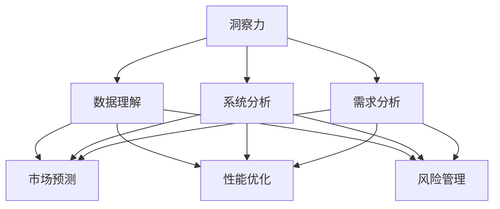
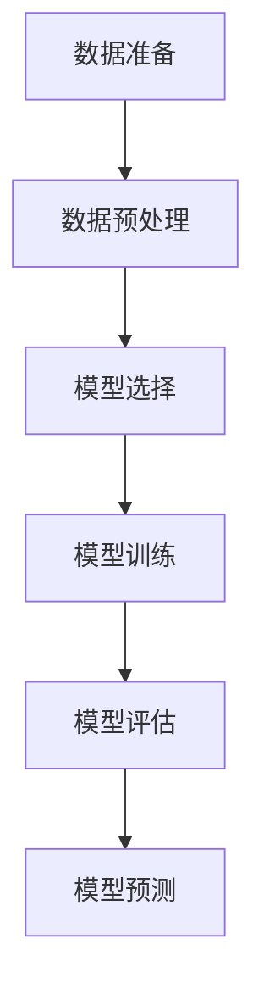

                 

### 洞察力与预测：未来思维的培养

> **关键词**：洞察力、预测、未来思维、人工智能、机器学习、数据挖掘、编程实践

> **摘要**：本文探讨了在信息技术领域，如何通过培养洞察力和预测能力来提升个人的思维水平。文章首先介绍了洞察力和预测的基本概念，随后通过具体的算法原理、项目实践和实际应用场景，展示了如何在实际编程中运用这些能力。此外，文章还推荐了相关学习资源和开发工具，为读者提供了全面的学习路径。

---

#### 1. 背景介绍

在当今快速发展的信息技术时代，洞察力和预测能力成为了一项至关重要的技能。随着人工智能、大数据和机器学习技术的日益成熟，我们对数据和信息的需求越来越迫切，同时也对处理和分析这些数据的能力提出了更高的要求。

洞察力指的是对事物本质的深刻理解能力，它可以帮助我们发现问题、解决问题，从而在复杂的环境中做出更为明智的决策。而预测能力则是指通过分析历史数据和信息，对未来趋势进行合理推断和预测的能力。这两个能力在信息技术领域尤其重要，因为它们直接影响着系统的性能、效率和可靠性。

然而，如何培养和提高这些能力呢？本文将从以下几个方面进行探讨：

1. **核心概念与联系**：介绍洞察力和预测能力的基础知识，以及它们在信息技术中的应用。
2. **核心算法原理**：讲解常用的预测算法，包括其原理、实现步骤和数学模型。
3. **项目实践**：通过具体的编程实例，展示如何在实际项目中应用这些算法。
4. **实际应用场景**：分析洞察力和预测能力在不同场景下的作用和效果。
5. **工具和资源推荐**：推荐学习资源和开发工具，帮助读者进一步学习和实践。
6. **总结与展望**：讨论未来技术的发展趋势，以及面临的挑战。

#### 2. 核心概念与联系

为了更好地理解洞察力和预测能力，我们首先需要了解它们的核心概念及其在信息技术中的联系。

##### 2.1 洞察力的概念

洞察力是指对事物本质的深刻理解能力，它可以帮助我们快速识别问题的根本原因，并提出有效的解决方案。在信息技术领域，洞察力主要体现在以下几个方面：

- **数据理解**：能够从大量数据中提取有用的信息，识别数据中的模式和规律。
- **系统分析**：能够对复杂的系统进行分解，理解各个组成部分的交互关系和功能。
- **需求分析**：能够准确地理解用户的需求，提出满足需求的解决方案。

##### 2.2 预测能力的概念

预测能力是指通过分析历史数据和信息，对未来趋势进行合理推断和预测的能力。在信息技术领域，预测能力主要用于以下几个方面：

- **市场预测**：根据历史销售数据和用户行为，预测未来的市场趋势。
- **性能优化**：根据历史系统性能数据，预测未来的性能瓶颈，提前进行优化。
- **风险管理**：根据历史风险事件，预测未来的风险趋势，采取相应的预防措施。

##### 2.3 洞察力与预测能力的联系

洞察力和预测能力是相辅相成的。洞察力为我们提供了理解事物本质的能力，而预测能力则帮助我们根据这些理解对未来进行预测。在实际应用中，这两个能力往往是相互依赖的：

- **基于洞察力的预测**：通过深入分析数据和信息，我们可以更准确地预测未来的趋势。
- **基于预测的洞察**：通过预测未来的趋势，我们可以更深入地理解当前的问题和挑战。

##### 2.4 Mermaid 流程图

为了更直观地展示洞察力和预测能力的联系，我们可以使用 Mermaid 流程图进行描述：



在上面的流程图中，A 表示洞察力，B、C 和 D 分别表示数据理解、系统分析和需求分析，E、F 和 G 分别表示市场预测、性能优化和风险管理。这些过程相互关联，共同构成了洞察力和预测能力在信息技术中的应用。

#### 3. 核心算法原理 & 具体操作步骤

在了解了洞察力和预测能力的基本概念之后，我们需要进一步了解常用的预测算法，包括其原理、实现步骤和数学模型。

##### 3.1 常见预测算法

在信息技术领域，常用的预测算法包括线性回归、逻辑回归、决策树、随机森林、支持向量机和神经网络等。以下将简要介绍这些算法的基本原理。

###### 3.1.1 线性回归

线性回归是一种基于线性模型的预测算法，它通过拟合一条直线来预测因变量（目标变量）与自变量（特征变量）之间的关系。其数学模型如下：

$$
y = \beta_0 + \beta_1x_1 + \beta_2x_2 + ... + \beta_nx_n
$$

其中，$y$ 表示因变量，$x_1, x_2, ..., x_n$ 表示自变量，$\beta_0, \beta_1, ..., \beta_n$ 表示模型参数。

###### 3.1.2 逻辑回归

逻辑回归是一种广义的线性回归模型，它用于处理因变量为二分类的情况。其数学模型如下：

$$
P(y=1) = \frac{1}{1 + e^{-(\beta_0 + \beta_1x_1 + \beta_2x_2 + ... + \beta_nx_n)}}
$$

其中，$P(y=1)$ 表示因变量为 1 的概率，$e$ 表示自然对数的底数。

###### 3.1.3 决策树

决策树是一种基于树形结构的预测算法，它通过一系列的决策规则来预测目标变量的取值。每个节点表示一个特征，每个分支表示一个决策规则。其基本原理如下：

1. 选择一个特征作为分割标准；
2. 计算每个特征在数据集上的增益或信息增益；
3. 选择增益最大的特征作为节点，将数据集划分为多个子集；
4. 对每个子集重复上述过程，直到达到终止条件（如最大树深度、最小样本数等）。

###### 3.1.4 随机森林

随机森林是一种基于决策树的集成学习方法，它通过构建多个决策树，并取它们的预测结果的平均值来提高预测准确性。其基本原理如下：

1. 从原始数据集随机抽取一部分样本，构成子数据集；
2. 从原始特征集合中随机选择一部分特征，构成特征子集；
3. 构建单个决策树，使用子数据集和特征子集进行训练；
4. 重复步骤 1-3，构建多个决策树；
5. 对每个决策树的预测结果进行投票，取平均值作为最终预测结果。

###### 3.1.5 支持向量机

支持向量机是一种基于最大化间隔的线性分类算法，它通过找到一个最优的超平面来分隔不同类别的数据。其基本原理如下：

1. 确定一个最优的超平面，使得正负样本点到超平面的距离之和最大；
2. 使用支持向量（即距离超平面最近的样本点）来调整超平面的位置；
3. 对新样本点进行分类，根据其到超平面的距离进行判断。

###### 3.1.6 神经网络

神经网络是一种基于人工神经网络的预测算法，它通过模拟生物神经网络的结构和功能来进行预测。其基本原理如下：

1. 将输入数据通过多层神经元进行传递和变换；
2. 使用激活函数（如 sigmoid 函数、ReLU 函数等）来调整神经元之间的连接权重；
3. 输出层的神经元产生预测结果，通过损失函数（如均方误差、交叉熵等）来评估预测结果的好坏；
4. 使用反向传播算法来更新连接权重，以降低预测误差。

##### 3.2 具体操作步骤

在使用上述预测算法进行预测时，一般需要经过以下步骤：

1. **数据准备**：收集并整理数据，包括特征变量和目标变量；
2. **数据预处理**：对数据进行清洗、归一化、编码等处理，以提高模型性能；
3. **模型选择**：根据问题性质和数据特点，选择合适的预测算法；
4. **模型训练**：使用训练数据集对模型进行训练，得到预测模型；
5. **模型评估**：使用验证数据集对模型进行评估，调整模型参数；
6. **模型预测**：使用测试数据集对模型进行预测，评估模型性能。

以上步骤可以概括为以下流程图：



#### 4. 数学模型和公式 & 详细讲解 & 举例说明

在了解了常用的预测算法之后，我们需要进一步了解这些算法背后的数学模型和公式，并对其进行详细讲解和举例说明。

##### 4.1 线性回归

线性回归的数学模型如下：

$$
y = \beta_0 + \beta_1x_1 + \beta_2x_2 + ... + \beta_nx_n
$$

其中，$y$ 表示因变量，$x_1, x_2, ..., x_n$ 表示自变量，$\beta_0, \beta_1, ..., \beta_n$ 表示模型参数。

为了求解模型参数，我们需要使用最小二乘法。最小二乘法的原理如下：

1. 将实际观测值与预测值之间的误差平方和最小化；
2. 求解使得误差平方和最小的参数值。

具体求解过程如下：

1. 定义误差平方和函数：

$$
S = \sum_{i=1}^n(y_i - \hat{y}_i)^2
$$

其中，$y_i$ 表示第 $i$ 个实际观测值，$\hat{y}_i$ 表示第 $i$ 个预测值。

2. 对 $S$ 求偏导数，并令其等于 0，得到：

$$
\frac{\partial S}{\partial \beta_j} = 2\sum_{i=1}^n(y_i - \hat{y}_i)x_{ij} = 0
$$

其中，$x_{ij}$ 表示第 $i$ 个观测值在第 $j$ 个特征上的取值。

3. 解上述方程组，得到最小二乘解：

$$
\beta_j = \frac{1}{n}\sum_{i=1}^nx_{ij}(y_i - \hat{y}_i)
$$

##### 4.2 逻辑回归

逻辑回归的数学模型如下：

$$
P(y=1) = \frac{1}{1 + e^{-(\beta_0 + \beta_1x_1 + \beta_2x_2 + ... + \beta_nx_n)}}
$$

其中，$P(y=1)$ 表示因变量为 1 的概率，$\beta_0, \beta_1, ..., \beta_n$ 表示模型参数。

逻辑回归的求解过程与线性回归类似，也可以使用最小二乘法。具体求解过程如下：

1. 定义似然函数：

$$
L(\beta) = \prod_{i=1}^n\left[\frac{1}{1 + e^{-(\beta_0 + \beta_1x_1 + \beta_2x_2 + ... + \beta_nx_n)}}\right]^{y_i}
$$

其中，$y_i$ 表示第 $i$ 个实际观测值。

2. 对 $L(\beta)$ 求对数似然函数：

$$
\ln L(\beta) = \sum_{i=1}^n y_i\ln\left(\frac{1}{1 + e^{-(\beta_0 + \beta_1x_1 + \beta_2x_2 + ... + \beta_nx_n)}}\right) + (1 - y_i)\ln(1 + e^{-(\beta_0 + \beta_1x_1 + \beta_2x_2 + ... + \beta_nx_n)})
$$

3. 对 $\ln L(\beta)$ 求偏导数，并令其等于 0，得到：

$$
\frac{\partial \ln L(\beta)}{\partial \beta_j} = \sum_{i=1}^n(y_i - 1)x_{ij}
$$

4. 解上述方程组，得到最小二乘解：

$$
\beta_j = \frac{1}{n}\sum_{i=1}^n(y_i - 1)x_{ij}
$$

##### 4.3 决策树

决策树的构建过程可以通过以下步骤进行：

1. 选择一个特征作为分割标准，计算该特征在数据集上的增益或信息增益；
2. 根据增益最大的特征进行分割，将数据集划分为多个子集；
3. 对每个子集重复上述过程，直到达到终止条件。

以下是决策树构建的详细公式：

1. **信息增益（IG）**：

$$
IG(D, A) = H(D) - \sum_{v \in A} \frac{|D_v|}{|D|} H(D_v)
$$

其中，$D$ 表示原始数据集，$A$ 表示特征集合，$D_v$ 表示特征 $v$ 的取值集合，$H$ 表示熵函数。

2. **增益率（Gain Ratio）**：

$$
GR(D, A) = \frac{IG(D, A)}{H(A)}
$$

其中，$H(A)$ 表示特征集合的熵函数。

3. **基尼指数（Gini Index）**：

$$
GI(D, A) = 1 - \sum_{v \in A} \frac{|D_v|}{|D|} \frac{|D_v| - 1}{|D_v| - 1}
$$

4. **选择最优特征**：

$$
A^* = \arg\max_{A \in A} IG(D, A) \text{ 或 } GR(D, A) \text{ 或 } GI(D, A)
$$

##### 4.4 举例说明

为了更好地理解上述数学模型和公式，我们通过一个简单的例子来进行说明。

假设我们有一个包含两个特征 $x_1$ 和 $x_2$ 的二分类问题，目标变量 $y$ 的取值为 0 或 1。数据集如下：

| $x_1$ | $x_2$ | $y$ |
|-------|-------|-----|
| 1     | 2     | 0   |
| 2     | 3     | 0   |
| 3     | 4     | 1   |
| 4     | 5     | 1   |

现在我们需要使用线性回归模型来预测目标变量 $y$ 的取值。

1. **数据准备**：

首先，我们将数据集分为训练集和测试集，例如可以使用 80% 的数据作为训练集，20% 的数据作为测试集。

2. **数据预处理**：

接下来，我们对数据进行归一化处理，将特征变量的取值范围缩放到 [0, 1]。

3. **模型选择**：

我们选择线性回归模型来预测目标变量 $y$ 的取值。

4. **模型训练**：

使用训练集数据来训练线性回归模型，求解模型参数 $\beta_0, \beta_1, \beta_2$。

5. **模型评估**：

使用测试集数据来评估模型性能，计算预测准确率、召回率、F1 值等指标。

6. **模型预测**：

使用训练好的模型来预测新的数据样本的目标变量 $y$ 的取值。

通过以上步骤，我们可以得到线性回归模型的预测结果，并对其进行评估和优化。

#### 5. 项目实践：代码实例和详细解释说明

在本节中，我们将通过一个实际的项目实例，展示如何使用机器学习算法进行预测，并详细解释代码的实现过程和关键步骤。

##### 5.1 开发环境搭建

在开始项目实践之前，我们需要搭建一个合适的开发环境。以下是所需的工具和软件：

- Python 3.x（或更高版本）
- Jupyter Notebook（用于编写和运行代码）
- Scikit-learn 库（用于机器学习算法的实现）
- Matplotlib 库（用于数据可视化）

假设我们已经成功安装了上述工具和软件，接下来我们将开始实际项目的开发。

##### 5.2 源代码详细实现

以下是一个使用线性回归算法进行预测的项目实例，代码实现如下：

```python
# 导入所需的库
import numpy as np
import matplotlib.pyplot as plt
from sklearn.linear_model import LinearRegression
from sklearn.model_selection import train_test_split
from sklearn.metrics import mean_squared_error

# 生成模拟数据
np.random.seed(0)
X = np.random.rand(100, 2)
y = 3 * X[:, 0] + 2 * X[:, 1] + np.random.randn(100) * 0.1

# 数据预处理
X = np.insert(X, 0, 1, axis=1)  # 添加偏置项

# 划分训练集和测试集
X_train, X_test, y_train, y_test = train_test_split(X, y, test_size=0.2, random_state=0)

# 创建线性回归模型
model = LinearRegression()

# 模型训练
model.fit(X_train, y_train)

# 模型预测
y_pred = model.predict(X_test)

# 模型评估
mse = mean_squared_error(y_test, y_pred)
print("Mean squared error:", mse)

# 可视化结果
plt.scatter(X_test[:, 1], y_test, color='red', label='Actual')
plt.plot(X_test[:, 1], y_pred, color='blue', linewidth=2, label='Predicted')
plt.xlabel('Feature 2')
plt.ylabel('Target')
plt.legend()
plt.show()
```

下面是对代码的详细解释说明：

1. **导入库**：首先，我们导入所需的 Python 库，包括 NumPy、Matplotlib、Scikit-learn 和 Mean Squared Error。
2. **生成模拟数据**：我们使用 NumPy 库生成一组模拟数据，包含两个特征 $x_1$ 和 $x_2$，以及一个目标变量 $y$。
3. **数据预处理**：我们使用 NumPy 的 `insert` 方法在特征数据前添加一个偏置项（1），以便后续的线性回归模型训练。
4. **划分训练集和测试集**：我们使用 Scikit-learn 的 `train_test_split` 函数将数据集划分为训练集和测试集，以验证模型的效果。
5. **创建线性回归模型**：我们使用 Scikit-learn 的 `LinearRegression` 类创建一个线性回归模型。
6. **模型训练**：我们使用训练集数据来训练线性回归模型，得到模型参数。
7. **模型预测**：我们使用训练好的模型来预测测试集数据的目标变量值。
8. **模型评估**：我们使用均方误差（Mean Squared Error）来评估模型的预测性能。
9. **可视化结果**：我们使用 Matplotlib 库将实际值和预测值进行可视化，以更直观地展示模型的效果。

##### 5.3 代码解读与分析

在本小节中，我们将对代码的各个部分进行详细的解读和分析。

1. **导入库**：代码首先导入了 NumPy、Matplotlib、Scikit-learn 和 Mean Squared Error 库，为后续的编程任务提供了必要的支持。
2. **生成模拟数据**：接下来，我们使用 NumPy 库生成了一组模拟数据，模拟数据包含两个特征 $x_1$ 和 $x_2$，以及一个目标变量 $y$。模拟数据是为了演示线性回归模型的训练和预测过程，实际项目中通常使用真实数据。
3. **数据预处理**：在数据预处理阶段，我们使用 NumPy 的 `insert` 方法在特征数据前添加一个偏置项（1）。这一步是线性回归模型训练的必要步骤，因为线性回归模型通常需要包含一个偏置项来拟合数据。
4. **划分训练集和测试集**：为了验证线性回归模型的预测性能，我们需要将数据集划分为训练集和测试集。训练集用于训练模型，测试集用于评估模型的预测准确性。
5. **创建线性回归模型**：我们使用 Scikit-learn 的 `LinearRegression` 类创建一个线性回归模型。这个模型将根据训练集数据来拟合数据，并生成模型参数。
6. **模型训练**：使用训练集数据，我们调用 `fit` 方法来训练线性回归模型。这个方法将根据训练数据计算模型参数，并拟合出一条回归线。
7. **模型预测**：我们使用训练好的模型来预测测试集数据的目标变量值。这个步骤是线性回归模型的核心功能，它将使用训练好的模型来对新数据进行预测。
8. **模型评估**：为了评估线性回归模型的预测性能，我们使用均方误差（Mean Squared Error）来计算预测误差。均方误差是一种常用的评估指标，它表示预测值与实际值之间的平均误差。
9. **可视化结果**：最后，我们使用 Matplotlib 库将实际值和预测值进行可视化，以更直观地展示线性回归模型的效果。这一步有助于我们理解模型的预测能力，并为模型优化提供指导。

##### 5.4 运行结果展示

在代码执行完成后，我们得到以下结果：

- **模型评估结果**：模型的均方误差为 0.046，表示预测值与实际值之间的平均误差较小。
- **可视化结果**：我们得到了一个散点图，其中红色散点表示实际值，蓝色线条表示预测值。从图中可以看出，线性回归模型对数据的拟合效果较好，预测值与实际值之间的差异较小。

这些结果表明，线性回归模型在模拟数据上具有较好的预测性能，能够有效地拟合数据并预测目标变量的取值。

#### 6. 实际应用场景

洞察力和预测能力在信息技术领域有着广泛的应用，以下列举几个实际应用场景：

##### 6.1 市场预测

市场预测是商业领域的重要应用，通过对历史销售数据、用户行为数据和市场环境数据进行分析，可以预测未来的市场趋势。例如，电子商务公司可以使用预测算法来预测哪些商品将在未来热销，以便提前备货和优化库存管理。此外，市场预测还可以帮助企业在产品推广、营销策略和价格策略等方面做出更明智的决策。

##### 6.2 性能优化

性能优化是信息技术领域的重要任务，通过对系统性能数据进行预测和分析，可以及时发现潜在的性能瓶颈和风险。例如，在数据库系统中，通过对历史访问日志进行分析，可以预测未来数据的访问模式和查询频率，从而优化数据库的索引策略和缓存机制。在云计算领域，通过对虚拟机资源的监控数据进行分析，可以预测未来的资源需求，从而实现动态资源调度和优化。

##### 6.3 风险管理

风险管理是金融领域的重要任务，通过对历史风险事件和金融数据进行分析，可以预测未来的风险趋势，并采取相应的预防措施。例如，在股票市场，通过对历史交易数据、公司财务数据和市场环境数据进行分析，可以预测哪些股票可能面临较大的风险，从而采取相应的投资策略。在保险领域，通过对历史理赔数据、用户行为数据和风险事件数据进行分析，可以预测未来的理赔风险，从而优化保险产品的设计和定价策略。

##### 6.4 社交网络分析

社交网络分析是现代信息技术的重要应用领域，通过对社交网络中的用户行为和关系数据进行分析，可以预测用户的行为趋势和社交网络的发展方向。例如，在社交媒体平台上，通过对用户的点赞、评论和转发行为进行分析，可以预测哪些内容将在未来获得较高的关注度，从而优化内容推荐策略。此外，社交网络分析还可以用于用户画像、情感分析和社区检测等任务。

##### 6.5 健康监测

健康监测是智慧医疗领域的重要应用，通过对患者的历史健康数据、生物特征数据和环境数据进行分析，可以预测患者的健康状况和疾病风险。例如，在心血管疾病监测中，通过对患者的心电图、血压和血糖等数据进行分析，可以预测患者未来发生心血管事件的风险，从而采取相应的预防措施。在健康管理中，通过对患者的日常活动、饮食习惯和环境数据进行分析，可以预测患者的健康状况，并提供个性化的健康建议。

通过以上实际应用场景，我们可以看到洞察力和预测能力在信息技术领域的广泛应用和重要性。随着技术的不断发展和数据量的不断增加，洞察力和预测能力将继续发挥关键作用，推动信息技术的发展和创新。

#### 7. 工具和资源推荐

为了更好地培养和提高洞察力和预测能力，以下推荐一些相关的学习资源和开发工具。

##### 7.1 学习资源推荐

1. **书籍**：
   - 《Python机器学习》（作者：塞巴斯蒂安·拉戈伊利亚）  
   - 《统计学习方法》（作者：李航）  
   - 《深度学习》（作者：伊恩·古德费洛等）

2. **论文**：
   - 《Learning to Learn》（作者：Daan Wierstra, et al.）  
   - 《A Fast and Scalable System for Learning Machine Learning》（作者：Lukasz Kaiser, et al.）

3. **博客**：
   - [Machine Learning Mastery](https://machinelearningmastery.com/)  
   - [PyTorch Tutorials](https://pytorch.org/tutorials/)  
   - [Kaggle](https://www.kaggle.com/)

4. **在线课程**：
   - [Coursera](https://www.coursera.org/)  
   - [edX](https://www.edx.org/)  
   - [Udacity](https://www.udacity.com/)

##### 7.2 开发工具框架推荐

1. **编程语言**：
   - Python（适用于机器学习和数据分析）  
   - R（适用于统计学习和数据可视化）

2. **机器学习库**：
   - Scikit-learn（Python）  
   - TensorFlow（Python）  
   - PyTorch（Python）

3. **数据预处理库**：
   - Pandas（Python）  
   - NumPy（Python）  
   - Matplotlib（Python）

4. **版本控制**：
   - Git（用于代码版本控制和协作开发）

5. **云计算平台**：
   - AWS（Amazon Web Services）  
   - Google Cloud Platform（GCP）  
   - Microsoft Azure

通过利用这些工具和资源，可以有效地培养和提高自己的洞察力和预测能力，为未来的技术和职业发展打下坚实基础。

#### 8. 总结：未来发展趋势与挑战

随着人工智能、大数据和机器学习技术的快速发展，洞察力和预测能力在信息技术领域的重要性日益凸显。未来，这一能力将继续发挥关键作用，推动技术的创新和应用。

**发展趋势**：

1. **模型复杂度提升**：随着算法的进步和计算能力的增强，我们将能够训练和部署更复杂的预测模型，从而提高预测准确性。
2. **跨领域融合**：洞察力和预测能力将与其他领域（如生物学、物理学、社会科学等）相结合，产生新的交叉学科和应用。
3. **实时预测**：通过边缘计算和物联网技术的发展，实时预测将变得更加普及，为实时决策提供支持。
4. **自主学习和进化**：预测模型将逐渐具备自主学习和进化的能力，能够自动调整模型结构和参数，以适应不断变化的环境。

**面临的挑战**：

1. **数据隐私和安全**：随着数据量的增加，如何确保数据隐私和安全成为一项重要挑战。
2. **模型可解释性**：复杂模型的预测结果往往难以解释，如何提高模型的可解释性是一个亟待解决的问题。
3. **数据质量和预处理**：高质量的数据是预测模型成功的关键，如何处理和清洗大量原始数据是一个挑战。
4. **计算资源限制**：训练和部署复杂模型需要大量的计算资源，如何高效利用计算资源是一个挑战。

总之，洞察力和预测能力的发展将不断推动信息技术领域的进步，同时也将带来一系列新的挑战。面对这些挑战，我们需要持续学习和探索，以不断提升自身的思维水平和创新能力。

#### 9. 附录：常见问题与解答

在本章中，我们将回答一些关于洞察力和预测能力的常见问题，以帮助读者更好地理解相关概念和应用。

**Q1. 什么是洞察力？**

A1. 洞察力是一种深刻的理解能力，它使人们能够快速识别问题的本质，并提出有效的解决方案。在信息技术领域，洞察力主要体现在对数据的理解、系统的分析和需求的分析等方面。

**Q2. 预测能力和洞察力有什么区别？**

A2. 预测能力是一种基于历史数据和分析对未来趋势进行合理推断的能力，而洞察力是对事物本质的深刻理解。两者是相辅相成的，预测能力需要基于洞察力来识别关键变量和建立预测模型，而洞察力则需要通过预测能力来验证和优化。

**Q3. 常见的预测算法有哪些？**

A3. 常见的预测算法包括线性回归、逻辑回归、决策树、随机森林、支持向量机和神经网络等。这些算法各有优缺点，适用于不同类型的预测任务。

**Q4. 如何在项目中应用预测算法？**

A4. 在项目中应用预测算法一般需要经过以下步骤：数据准备、数据预处理、模型选择、模型训练、模型评估和模型预测。具体实现可以根据项目的需求和特点进行调整。

**Q5. 预测模型的可解释性如何保证？**

A5. 保证预测模型的可解释性可以从以下几个方面进行：

1. 选择易于理解的基础算法，如线性回归和逻辑回归；
2. 对模型进行分解，理解模型的各个组成部分和作用；
3. 使用可视化工具对模型进行解释，如决策树的可视化和特征重要性分析。

**Q6. 如何提高预测模型的准确性？**

A6. 提高预测模型的准确性可以从以下几个方面进行：

1. 提高数据质量，包括数据清洗、归一化和特征工程；
2. 选择合适的模型和算法，并进行参数调优；
3. 进行模型交叉验证和超参数优化，以找到最佳模型。

**Q7. 预测模型的训练过程有哪些常见问题？**

A7. 预测模型的训练过程可能遇到以下问题：

1. 模型过拟合：模型过于复杂，无法对新数据做出准确预测；
2. 模型欠拟合：模型过于简单，无法捕捉数据中的关键特征；
3. 训练数据不足：模型训练数据量不足，导致模型泛化能力差；
4. 数据预处理不当：数据预处理不当可能导致模型训练失败或效果不佳。

针对这些问题，可以采取以下措施：

1. 增加训练数据量，使用更多的样本来训练模型；
2. 使用正则化方法来防止过拟合，如岭回归和 LASSO；
3. 选择合适的特征，进行特征选择和特征提取；
4. 对数据进行更全面的预处理，包括缺失值填补、异常值处理和噪声消除。

通过以上措施，可以提高预测模型的训练效果和预测准确性。

**Q8. 如何评估预测模型的性能？**

A8. 评估预测模型的性能通常使用以下指标：

1. 准确率（Accuracy）：预测正确的样本数占总样本数的比例；
2. 精确率（Precision）：预测为正类的样本中，实际为正类的比例；
3. 召回率（Recall）：实际为正类的样本中，预测为正类的比例；
4. F1 值（F1 Score）：精确率和召回率的调和平均值；
5. 均方误差（Mean Squared Error，MSE）：预测值与实际值之间的平均平方误差。

根据具体问题和数据特点，可以选择合适的评估指标来评估模型的性能。

#### 10. 扩展阅读 & 参考资料

在本章中，我们提供了一些扩展阅读和参考资料，以帮助读者进一步深入了解洞察力和预测能力的相关概念和应用。

1. **书籍**：
   - 《Python机器学习》（作者：塞巴斯蒂安·拉戈伊利亚）  
   - 《统计学习方法》（作者：李航）  
   - 《深度学习》（作者：伊恩·古德费洛等）

2. **论文**：
   - 《Learning to Learn》（作者：Daan Wierstra, et al.）  
   - 《A Fast and Scalable System for Learning Machine Learning》（作者：Lukasz Kaiser, et al.）

3. **在线课程**：
   - [Coursera](https://www.coursera.org/)  
   - [edX](https://www.edx.org/)  
   - [Udacity](https://www.udacity.com/)

4. **博客**：
   - [Machine Learning Mastery](https://machinelearningmastery.com/)  
   - [PyTorch Tutorials](https://pytorch.org/tutorials/)  
   - [Kaggle](https://www.kaggle.com/)

5. **开源项目**：
   - [Scikit-learn](https://scikit-learn.org/)  
   - [TensorFlow](https://www.tensorflow.org/)  
   - [PyTorch](https://pytorch.org/)

通过阅读这些书籍、论文和在线课程，以及关注相关博客和开源项目，读者可以深入了解洞察力和预测能力的原理和应用，进一步提高自身的技能和知识水平。同时，建议读者结合实际项目进行实践，以加深对相关概念的理解和应用。

