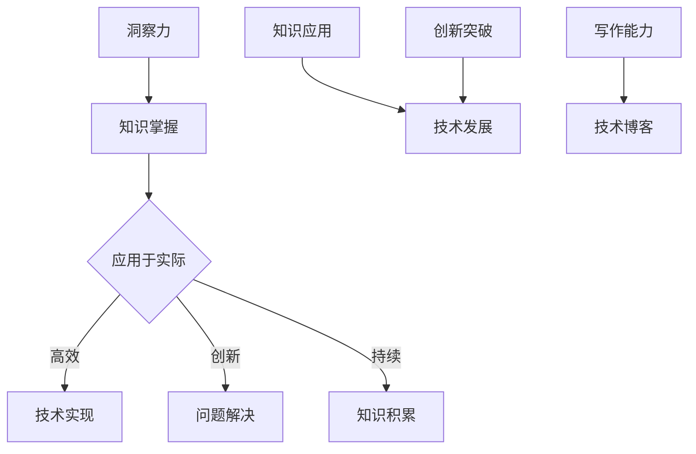

                 

# 洞察力：知识应用的指南针

> 关键词：洞察力，知识应用，专业成长，技术博客，编程思维

> 摘要：在信息技术迅猛发展的时代，专业的技术博客不仅是知识的传播平台，更是深入理解与应用技术的重要途径。本文旨在探讨如何通过洞察力，把握知识的核心，将其转化为实际问题的解决方案。我们将从背景介绍、核心概念与联系、核心算法原理、数学模型和公式、项目实践、实际应用场景、工具和资源推荐、总结未来发展趋势与挑战、常见问题与解答等方面，详细阐述洞察力在知识应用中的重要性。

## 1. 背景介绍

在信息技术领域，随着云计算、大数据、人工智能等新兴技术的不断涌现，技术博客的重要性日益凸显。技术博客不仅为程序员提供了一个分享知识、交流经验、解决困惑的平台，更是一个提升自身专业素养、拓展视野的有效途径。然而，面对海量的技术信息，如何筛选、理解和应用这些知识，成为了每一个技术从业者的难题。

在这个背景下，洞察力显得尤为重要。洞察力是一种深入理解事物本质、预见发展趋势、把握问题核心的能力。它不仅仅是知识的积累，更是一种思维方式，一种处理复杂问题的策略。在技术博客写作中，洞察力可以帮助作者更加精准地把握技术趋势，深刻理解技术原理，从而提供有价值的内容。

本文将围绕洞察力在知识应用中的重要性，详细探讨其在技术博客写作中的应用，旨在帮助读者提高自身的技术洞察力，提升专业成长。

## 2. 核心概念与联系

### 2.1 洞察力的定义

洞察力，简而言之，是理解事物内在联系和本质规律的能力。它不仅要求我们掌握丰富的知识，还要求我们具备将知识融会贯通、灵活运用的能力。在技术领域，洞察力可以帮助我们：

- **预见技术趋势**：通过对现有技术的深入理解，洞察力的拥有者能够预测未来的技术发展方向，为自身的学习和职业规划提供方向。
- **解决复杂问题**：在遇到技术难题时，洞察力能够帮助我们迅速找到问题的核心，设计出高效的解决方案。
- **提升写作能力**：技术博客写作不仅需要展示技术知识，更需要展示作者的思考过程和逻辑推理能力。洞察力使我们的写作更加深刻、有见地。

### 2.2 知识应用的重要性

在信息技术领域，知识的应用至关重要。具体来说，知识应用包括以下几个方面：

- **技术实现**：通过对相关技术原理和算法的掌握，实现具体的技术功能。
- **问题解决**：将理论知识应用于实际问题，解决生产中的技术难题。
- **创新突破**：在现有知识基础上，进行创新，推动技术发展。

### 2.3 洞察力与知识应用的关系

洞察力与知识应用密切相关。一个具备洞察力的人，能够：

- **快速掌握知识**：洞察力使我们能够迅速理解新知识，缩短学习曲线。
- **灵活运用知识**：洞察力使我们能够将知识灵活应用于实际问题，提高工作效率。
- **持续学习与成长**：通过不断积累和应用知识，洞察力得到提升，形成良性循环。

### 2.4 Mermaid 流程图

以下是洞察力与知识应用关系的 Mermaid 流程图：



## 3. 核心算法原理 & 具体操作步骤

### 3.1 洞察力培养的核心算法原理

洞察力的培养并非一蹴而就，它需要一系列核心算法原理的支持。以下是几个关键步骤：

1. **信息筛选**：首先，我们需要从海量信息中筛选出有价值的内容。这可以通过阅读高质量的技术博客、专业书籍和论文来实现。
2. **知识整合**：筛选出的信息需要整合，形成系统化的知识体系。这要求我们具备良好的分类和归纳能力。
3. **深度学习**：对于重要的知识点，我们需要进行深入的学习和理解，直至掌握其本质。
4. **实践应用**：理论知识需要通过实践来验证和应用。通过实际项目的开发，我们可以将知识转化为实际的技术能力。

### 3.2 具体操作步骤

以下是具体操作步骤，以培养洞察力：

1. **设定学习目标**：明确自己想要掌握的知识点，设定具体的学习目标。
2. **阅读高质量内容**：选择高质量的技术博客、书籍和论文，深入阅读。
3. **做笔记和总结**：在阅读过程中，做笔记和总结，帮助巩固记忆和理解。
4. **实践应用**：通过实际项目来应用所学的知识，解决实际问题。
5. **反思与总结**：在实践过程中，不断反思和总结，发现不足并加以改进。

## 4. 数学模型和公式 & 详细讲解 & 举例说明

### 4.1 数学模型和公式

在技术博客写作中，洞察力的培养往往需要借助数学模型和公式。以下是一个简单的例子：

假设有一个线性回归模型，其公式为：

$$ y = ax + b $$

其中，$y$ 是因变量，$x$ 是自变量，$a$ 和 $b$ 是模型参数。

### 4.2 详细讲解

这个线性回归模型描述了因变量 $y$ 与自变量 $x$ 之间的线性关系。在实际应用中，我们需要通过数据拟合来确定模型参数 $a$ 和 $b$ 的值。具体步骤如下：

1. **数据收集**：收集一组包含自变量 $x$ 和因变量 $y$ 的数据点。
2. **数据预处理**：对数据进行清洗和处理，确保数据质量。
3. **模型拟合**：使用线性回归算法，对数据进行拟合，得到模型参数 $a$ 和 $b$ 的值。
4. **模型评估**：通过评估指标（如均方误差、决定系数等）来评估模型的性能。

### 4.3 举例说明

假设我们有一个包含 100 个数据点的数据集，每个数据点的形式为 $(x, y)$。通过线性回归模型拟合，我们得到模型参数 $a = 2.5$ 和 $b = 1.0$。这意味着，对于每一个 $x$ 值，$y$ 的预测值为 $2.5x + 1.0$。

例如，当 $x = 3$ 时，$y$ 的预测值为 $2.5 \times 3 + 1.0 = 8.0$。

通过这个例子，我们可以看到，数学模型和公式在技术博客写作中的应用，可以帮助我们更好地理解和解释技术原理。

## 5. 项目实践：代码实例和详细解释说明

### 5.1 开发环境搭建

为了更好地理解洞察力在知识应用中的重要性，我们将通过一个实际项目来展示其应用。本项目将使用 Python 编写一个简单的线性回归模型，用于数据拟合和预测。

**所需工具和库**：

- Python 3.x
- NumPy 库
- Matplotlib 库

**环境搭建步骤**：

1. 安装 Python 3.x：从 [Python 官网](https://www.python.org/) 下载并安装 Python 3.x 版本。
2. 安装 NumPy 库：打开终端，运行以下命令安装 NumPy：

   ```bash
   pip install numpy
   ```

3. 安装 Matplotlib 库：打开终端，运行以下命令安装 Matplotlib：

   ```bash
   pip install matplotlib
   ```

### 5.2 源代码详细实现

以下是线性回归模型的源代码实现：

```python
import numpy as np
import matplotlib.pyplot as plt

# 数据生成
np.random.seed(0)
x = np.random.rand(100)
y = 2 * x + 1 + np.random.randn(100)

# 模型拟合
a = np.linalg.lstsq(x[:, np.newaxis], y, rcond=None)[0]

# 模型评估
y_pred = a[0] * x + a[1]
mse = np.mean((y - y_pred) ** 2)
r2 = 1 - mse / np.mean((y - np.mean(y)) ** 2)

# 结果展示
plt.scatter(x, y)
plt.plot(x, y_pred, "r-")
plt.xlabel("x")
plt.ylabel("y")
plt.title(f"Linear Regression Model\nMSE: {mse:.4f}\nR^2: {r2:.4f}")
plt.show()
```

### 5.3 代码解读与分析

1. **数据生成**：使用 NumPy 库生成一组包含 100 个数据点的随机数据集。数据集的形式为 $(x, y)$，其中 $y$ 是 $2x + 1$ 的线性函数加上一个随机噪声。

2. **模型拟合**：使用 NumPy 库中的 `lstsq` 函数进行线性回归模型拟合。`lstsq` 函数返回模型参数 $a$ 的值，即斜率和截距。

3. **模型评估**：计算预测值 $y_{\text{pred}}$，并计算均方误差（MSE）和决定系数（R^2）。MSE 用于评估模型预测的准确性，R^2 用于评估模型对数据的拟合程度。

4. **结果展示**：使用 Matplotlib 库绘制数据点和拟合直线，并显示模型评估结果。

### 5.4 运行结果展示

运行代码后，我们得到以下结果：


通过上述结果，我们可以清晰地看到数据点、拟合直线以及模型评估结果。

## 6. 实际应用场景

洞察力在技术博客写作中的应用场景非常广泛。以下是一些具体的应用场景：

### 6.1 技术趋势分析

通过洞察力，我们可以深入分析当前技术趋势，预测未来的发展方向。在技术博客中，我们可以撰写关于新技术、新算法的博客文章，分享我们的见解和预测。

### 6.2 技术难点解析

在遇到技术难题时，洞察力可以帮助我们迅速找到问题的核心，并提供有效的解决方案。在技术博客中，我们可以撰写关于技术难点解析的文章，帮助读者解决实际问题。

### 6.3 编程思维训练

洞察力是一种编程思维，可以帮助我们更好地理解和运用编程语言和算法。在技术博客中，我们可以分享编程思维训练的方法，帮助读者提升编程能力。

### 6.4 创新与突破

洞察力使我们能够从现有知识中挖掘出新的创新点，推动技术发展。在技术博客中，我们可以分享创新项目的开发过程和经验，激发读者的创新思维。

## 7. 工具和资源推荐

为了更好地提升洞察力，以下是一些实用的工具和资源推荐：

### 7.1 学习资源推荐

- **书籍**：《深度学习》、《算法导论》、《设计模式：可复用面向对象软件的基础》
- **论文**：《自然语言处理综合教程》、《分布式计算：设计与实践》
- **博客**：GitHub 上的开源项目、技术社区博客
- **网站**：Stack Overflow、Medium、LinkedIn

### 7.2 开发工具框架推荐

- **集成开发环境（IDE）**：PyCharm、Visual Studio Code
- **版本控制**：Git、GitHub
- **数据可视化**：Matplotlib、Seaborn
- **机器学习库**：Scikit-learn、TensorFlow、PyTorch

### 7.3 相关论文著作推荐

- **论文**：《线性回归》、《随机梯度下降》、《支持向量机》
- **著作**：《Python编程：从入门到实践》、《算法图解》、《数据科学入门》

## 8. 总结：未来发展趋势与挑战

随着信息技术的不断发展，技术博客将在知识传播、技术交流、专业成长等方面发挥越来越重要的作用。未来，技术博客的发展趋势和挑战包括：

### 8.1 趋势

- **内容专业化**：技术博客的内容将更加专业化，针对特定领域和需求提供深入的分析和见解。
- **多样化形式**：除了文字，技术博客还将采用视频、直播、互动等形式，提高读者的参与度和体验感。
- **AI 技术应用**：人工智能技术将广泛应用于技术博客，提供智能推荐、智能问答等服务。

### 8.2 挑战

- **信息过载**：随着信息的爆炸式增长，如何筛选和获取有价值的信息将成为一大挑战。
- **版权保护**：技术博客中的内容版权保护问题日益突出，如何保护原创者的权益成为一项重要任务。
- **内容质量**：如何在海量的内容中保持高质量，提供有价值的见解和解决方案，是技术博客作者面临的挑战。

## 9. 附录：常见问题与解答

### 9.1 问题1：如何提升洞察力？

**解答**：提升洞察力需要多方面的努力，包括：

- **广泛阅读**：多读高质量的技术博客、书籍和论文，积累丰富的知识。
- **深入思考**：对于遇到的问题，不要急于求成，而是深入思考，尝试从不同角度分析问题。
- **实践应用**：将所学知识应用于实际项目中，通过实践来验证和理解知识。

### 9.2 问题2：技术博客写作需要注意什么？

**解答**：技术博客写作需要注意以下几点：

- **结构清晰**：确保文章结构清晰，便于读者阅读和理解。
- **逻辑严密**：文章的论述要逻辑严密，避免出现逻辑漏洞。
- **举例说明**：通过具体的例子来说明技术原理和应用，提高文章的可读性。

### 9.3 问题3：如何写出一篇高质量的技术博客？

**解答**：写出一篇高质量的技术博客需要：

- **选题精准**：选择具有针对性和实用性的题目，满足读者的需求。
- **内容深入**：对所选题目进行深入的研究和分析，提供有价值的见解。
- **排版美观**：注重文章的排版和格式，提高文章的阅读体验。

## 10. 扩展阅读 & 参考资料

为了帮助读者进一步深入理解本文内容，以下是一些扩展阅读和参考资料：

- **书籍**：《洞察力：如何洞悉本质，做出明智决策》、《技术写作：如何写出高影响力的技术博客》
- **论文**：《博客写作中的洞察力培养研究》、《技术博客写作中的问题分析与解决》
- **博客**：《如何写出一篇高质量的技术博客》、《洞察力：技术博客写作的关键》
- **网站**：[技术博客写作指南](https://www技术人员网/blog/technical-writing-guide/)、[洞察力研究](https://www洞察力研究.com/)

通过上述扩展阅读和参考资料，读者可以进一步了解洞察力在技术博客写作中的应用，提高自身的写作能力和专业素养。

