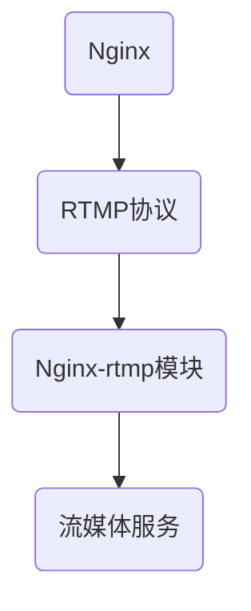

                 

### 背景介绍

随着互联网和多媒体技术的迅猛发展，流媒体服务逐渐成为各类在线应用的关键组成部分。流媒体服务能够实现视频、音频等大容量数据的实时传输，广泛应用于直播、点播、游戏、教育等多个领域。为了满足不断增长的用户需求，如何高效、稳定地搭建流媒体服务器成为了一个重要的课题。

在这个背景下，Nginx-rtmp模块应运而生。Nginx-rtmp模块是Nginx官方的一个扩展模块，专门用于处理实时流媒体传输协议（RTMP）。RTMP（Real Time Messaging Protocol）是一种用于数据实时传输的应用层协议，广泛应用于Flash、Adobe Media Server等流媒体服务中。Nginx-rtmp模块可以将Nginx服务器转变为一个功能强大的流媒体服务器，提供高效、可靠的实时流媒体传输支持。

Nginx-rtmp模块的优点主要体现在以下几个方面：

1. **高性能**：Nginx作为一款高性能的Web服务器，其处理并发连接的能力非常出色。结合Nginx-rtmp模块后，可以充分发挥Nginx的高并发处理能力，为用户提供快速、流畅的流媒体服务。

2. **稳定性**：Nginx一直以来以其高稳定性著称，其内部设计了完善的异常处理机制。通过Nginx-rtmp模块，流媒体服务在遇到网络波动、服务器负载增加等情况下，仍能保持稳定运行。

3. **扩展性**：Nginx-rtmp模块支持丰富的扩展功能，包括但不限于直播录制、转码、回看等功能。通过模块化设计，开发者可以根据实际需求进行灵活扩展，满足不同应用场景的需求。

4. **开源免费**：Nginx和Nginx-rtmp模块都是开源软件，无需支付任何费用即可使用。这大大降低了流媒体服务器的建设成本，使得更多企业和开发者能够轻松搭建自己的流媒体服务平台。

综上所述，Nginx-rtmp模块在性能、稳定性、扩展性和成本方面具有显著优势，成为了构建流媒体服务器的理想选择。接下来的章节将详细介绍Nginx-rtmp模块的安装配置、核心算法原理、实际应用场景以及相关工具和资源的推荐。

---

### 核心概念与联系

在深入了解Nginx-rtmp模块之前，我们首先需要明确几个核心概念：Nginx、RTMP以及Nginx-rtmp模块的功能和原理。以下是这些概念之间的联系，以及一个简化的Mermaid流程图，帮助我们更好地理解各个概念之间的关系。

#### Nginx

Nginx是一款开源的高性能Web服务器/反向代理服务器以及电子邮件（IMAP/POP3）代理服务器，由Igor Sysoev开发，并首次在2004年发布。它以高性能、稳定性、模块化设计著称，广泛应用于各类互联网应用中。

#### RTMP

RTMP（Real Time Messaging Protocol）是一种实时消息传输协议，由Adobe开发，主要用于Flash、Adobe Media Server等流媒体服务。RTMP协议定义了一套消息传输机制，使得视频、音频等多媒体数据能够实时、可靠地传输。

#### Nginx-rtmp模块

Nginx-rtmp模块是Nginx的一个官方扩展模块，用于处理RTMP协议。通过该模块，Nginx可以支持RTMP流媒体服务，包括直播、点播等。模块实现了RTMP协议的完整功能，包括连接管理、消息传输、直播录制、转码等。

#### 核心概念联系

1. **Nginx作为底层服务器**：Nginx作为高性能的Web服务器，为Nginx-rtmp模块提供了稳定的服务器基础。

2. **RTMP协议用于数据传输**：RTMP协议定义了多媒体数据的传输机制，Nginx-rtmp模块负责实现这些机制。

3. **Nginx-rtmp模块整合Nginx与RTMP**：通过Nginx-rtmp模块，Nginx服务器能够处理RTMP协议，从而支持流媒体服务。

#### Mermaid流程图



在上述流程图中：

- **Nginx**：作为底层的Web服务器，提供了稳定的服务器基础。
- **RTMP协议**：定义了多媒体数据的传输机制。
- **Nginx-rtmp模块**：实现了RTMP协议的功能，使其能够在Nginx服务器上运行。
- **流媒体服务**：通过Nginx-rtmp模块，Nginx服务器可以提供直播、点播等流媒体服务。

通过上述核心概念的联系和Mermaid流程图，我们可以更清晰地理解Nginx、RTMP和Nginx-rtmp模块之间的关系，为后续章节的详细讨论打下基础。

### 核心算法原理 & 具体操作步骤

#### Nginx-rtmp模块工作原理

Nginx-rtmp模块的核心在于如何高效地处理RTMP协议，并确保流媒体服务的稳定性和性能。以下是Nginx-rtmp模块的工作原理：

1. **连接管理**：当客户端发起RTMP连接请求时，Nginx-rtmp模块会创建一个连接通道，以管理客户端与服务器的通信。

2. **消息传输**：在建立连接后，Nginx-rtmp模块通过RTMP协议的复用通道和共享通道进行数据传输。复用通道用于发送控制消息，如命令、元数据等；共享通道则用于传输实际的多媒体数据。

3. **直播录制与回看**：Nginx-rtmp模块支持直播录制功能，可以将实时流媒体数据保存到本地。同时，用户可以回看已录制的视频内容。

4. **转码与分流**：模块还支持流媒体数据的转码和分流功能，可以根据用户需求将不同格式的多媒体数据进行转换，并分发到不同的客户端。

#### 具体操作步骤

下面我们将详细讲解如何安装和配置Nginx-rtmp模块，以及如何使用Nginx-rtmp模块实现流媒体服务。

#### 1. 安装Nginx

在开始安装Nginx-rtmp模块之前，首先需要确保Nginx已经安装。以下是安装Nginx的步骤：

1. **安装依赖**：

   对于大多数Linux发行版，可以运行以下命令来安装Nginx所需的依赖：

   ```bash
   sudo apt-get update
   sudo apt-get install build-essential libpcre3 libpcre3-dev zlib1g zlib1g-dev openssl libssl-dev
   ```

2. **下载Nginx源码**：

   访问Nginx官方网站（http://nginx.org/）下载最新的Nginx源码。例如，可以使用以下命令：

   ```bash
   wget http://nginx.org/download/nginx-1.21.3.tar.gz
   ```

3. **解压源码**：

   ```bash
   tar xzf nginx-1.21.3.tar.gz
   ```

4. **编译与安装**：

   进入解压后的目录，并运行以下命令编译和安装Nginx：

   ```bash
   cd nginx-1.21.3
   ./configure
   make
   sudo make install
   ```

   安装完成后，Nginx的服务文件位于`/usr/local/nginx`目录下。

#### 2. 安装Nginx-rtmp模块

1. **下载Nginx-rtmp模块源码**：

   访问Nginx-rtmp模块的GitHub页面（https://github.com/arut/nginx-rtmp-module）下载源码。可以使用以下命令：

   ```bash
   git clone https://github.com/arut/nginx-rtmp-module.git
   ```

2. **编译Nginx**：

   将Nginx-rtmp模块的源码目录添加到Nginx的配置选项中，并重新编译Nginx。具体步骤如下：

   ```bash
   cd /usr/local/nginx
   ./configure --add-module=/path/to/nginx-rtmp-module
   make
   sudo make install
   ```

   这里`/path/to/nginx-rtmp-module`需要替换为Nginx-rtmp模块的实际路径。

#### 3. 配置Nginx

配置Nginx以启用RTMP服务，具体步骤如下：

1. **创建RTMP服务器配置文件**：

   在Nginx的配置目录下创建一个名为`rtmp.conf`的文件，例如`/usr/local/nginx/conf/rtmp.conf`。

2. **编写RTMP配置内容**：

   在`rtmp.conf`文件中添加以下配置内容：

   ```nginx
   rtmp {
       server {
           listen 1935;
           chunk_size 4096;
   
           application live {
               live on;
               record off;
           }
       }
   }
   ```

   其中，`listen 1935`指定了RTMP服务监听的端口（默认为1935），`application live`定义了一个名为`live`的应用，用于处理流媒体请求。

3. **集成到Nginx主配置文件**：

   将`rtmp.conf`文件的内容复制到Nginx的主配置文件`nginx.conf`中，通常位于`/usr/local/nginx/conf/nginx.conf`。

   ```nginx
   include /usr/local/nginx/conf/rtmp.conf;
   ```

4. **重启Nginx服务**：

   ```bash
   sudo /usr/local/nginx/sbin/nginx -s reload
   ```

   完成配置后，Nginx将重新加载配置文件并启动RTMP服务。

#### 4. 测试RTMP服务

1. **启动FFmpeg**：

   使用FFmpeg工具启动一个RTMP推流，例如：

   ```bash
   ffmpeg -re -i test.mp4 -c:v libx264 -c:a aac -f flv rtmp://localhost/live/stream
   ```

   这将向Nginx-rtmp模块发送一个名为`stream`的直播流。

2. **验证RTMP服务**：

   可以使用RTMP播放器（如VLC）来验证流是否正常播放。在VLC中输入以下地址：

   ```plaintext
   rtmp://localhost/live/stream
   ```

   如果视频正常播放，则说明RTMP服务已成功搭建。

通过上述步骤，我们完成了Nginx-rtmp模块的安装和配置，并实现了基本的RTMP流媒体服务。接下来，我们将进一步探讨Nginx-rtmp模块的核心算法原理，帮助读者更深入地理解其工作机制。

---

#### Nginx-rtmp模块的核心算法原理

为了深入了解Nginx-rtmp模块的工作原理，我们需要从算法和数据结构的角度来分析其实现机制。以下是Nginx-rtmp模块在处理流媒体数据时涉及的核心算法原理：

##### 1. 连接管理算法

**目的**：在Nginx-rtmp模块中，连接管理算法的主要目的是建立、维护和关闭客户端与服务器的连接。

**实现方式**：

- **连接建立**：当客户端发起连接请求时，模块会创建一个新的连接通道。这个过程涉及TCP三次握手的实现，确保客户端和服务器的连接是可靠且稳定的。

- **连接维护**：模块使用心跳机制来检测连接的活跃度。在指定时间内未收到心跳包，模块会断开连接，防止无效连接占用服务器资源。

- **连接关闭**：在数据传输完成后，模块会关闭连接通道，释放相关资源。这个过程涉及TCP四次挥手的实现，确保连接的干净关闭。

**数据结构**：连接管理算法使用了连接表（Connection Table）来记录所有的连接信息。每个连接条目包含了连接状态、客户端IP地址、连接时间、心跳时间等信息。

##### 2. 消息传输算法

**目的**：消息传输算法的主要目的是实现RTMP协议中的消息发送和接收。

**实现方式**：

- **消息发送**：模块通过RTMP协议的复用通道和共享通道发送消息。复用通道用于发送控制消息，如命令、元数据等；共享通道则用于传输多媒体数据。

- **消息接收**：模块接收来自客户端的消息，并按照RTMP协议的要求进行解析和存储。

**数据结构**：消息传输算法使用了消息队列（Message Queue）来存储待发送的消息。每个消息条目包含了消息类型、消息数据、发送时间等信息。消息队列采用先进先出（FIFO）的顺序进行管理，确保消息按照正确的顺序发送。

##### 3. 直播录制算法

**目的**：直播录制算法的主要目的是将实时流媒体数据保存到本地，以便用户回看。

**实现方式**：

- **数据保存**：模块会在后台启动一个录制线程，实时捕捉流媒体数据并写入到本地文件。

- **文件管理**：模块使用文件系统来存储录制文件，并对文件进行分类和命名。每个录制文件对应一个直播流，便于管理和检索。

**数据结构**：直播录制算法使用了文件表（File Table）来记录所有录制文件的元数据信息。每个文件条目包含了文件名称、文件路径、录制时间、文件大小等信息。

##### 4. 转码与分流算法

**目的**：转码与分流算法的主要目的是对流媒体数据进行格式转换，并分发到不同的客户端。

**实现方式**：

- **转码**：模块支持多种视频和音频编码格式，可以根据用户需求对多媒体数据进行转码。转码过程中会涉及到编解码（Codec）算法和数据结构的转换。

- **分流**：模块可以将转码后的数据发送到不同的客户端。这个过程涉及到多路复用（Multiplexing）算法，确保数据能够高效、可靠地传输到各个客户端。

**数据结构**：转码与分流算法使用了流表（Stream Table）来记录所有流媒体数据的信息。每个流条目包含了流名称、流类型、编码格式、发送时间等信息。流表采用哈希表（Hash Table）的方式实现，以提高数据查询和插入的效率。

通过上述算法原理和实现方式，我们可以看到Nginx-rtmp模块在连接管理、消息传输、直播录制、转码与分流等方面都采用了高效、可靠的算法和数据结构。这些核心算法原理不仅保证了模块的高性能和稳定性，也为开发者提供了丰富的功能扩展能力。接下来，我们将通过一个具体的代码实例来进一步探讨Nginx-rtmp模块的实现细节。

### 数学模型和公式 & 详细讲解 & 举例说明

在深入讨论Nginx-rtmp模块的数学模型和公式之前，我们首先需要了解一些基本的网络传输和数据处理的相关概念。以下是这些概念的定义和简要说明：

#### 1. 带宽与延迟

**带宽**（Bandwidth）是指网络传输通道在一定时间内可以传输的数据量，通常以比特每秒（bps）或字节每秒（Bps）来衡量。带宽决定了数据的传输速度。

**延迟**（Latency）是指从数据发送到接收所需的时间，包括传输延迟、处理延迟和队列延迟等。延迟影响数据的实时传输效果。

#### 2. 数据传输率

**数据传输率**（Data Transfer Rate）是指单位时间内通过网络传输的数据量。数据传输率通常使用比特每秒（bps）或字节每秒（Bps）来表示。

#### 3. 数据包丢失率

**数据包丢失率**（Packet Loss Rate）是指在网络传输过程中丢失的数据包占总数据包的比例。数据包丢失率影响数据的完整性。

#### 4. 调制解调算法

**调制解调算法**（Modulation and Demodulation）是将数字信号转换为模拟信号，再将其发送到网络中，以及从接收到的模拟信号中恢复出数字信号的过程。常见的调制解调算法包括QAM（Quadrature Amplitude Modulation）和PSK（Phase Shift Keying）等。

#### 数学模型与公式

Nginx-rtmp模块在实现流媒体传输过程中，需要考虑带宽、延迟、数据包丢失率等因素，以优化数据传输效果。以下是一些关键的数学模型和公式：

#### 1. 数据传输速率计算

数据传输速率（R）可以通过以下公式计算：

\[ R = \frac{B}{T} \]

其中，\( B \) 是带宽（bps），\( T \) 是传输时间（s）。例如，如果带宽为10 Mbps，传输时间为1秒，则数据传输速率为10 Mbps。

#### 2. 延迟计算

网络延迟（L）包括传输延迟、处理延迟和队列延迟。可以表示为：

\[ L = L_t + L_p + L_q \]

其中，\( L_t \) 是传输延迟（由带宽决定），\( L_p \) 是处理延迟（由服务器处理速度决定），\( L_q \) 是队列延迟（由网络拥塞程度决定）。

#### 3. 数据包丢失率计算

数据包丢失率（P）可以通过以下公式计算：

\[ P = \frac{N_{lost}}{N_{total}} \]

其中，\( N_{lost} \) 是丢失的数据包数，\( N_{total} \) 是总数据包数。

#### 4. 调制解调算法性能分析

调制解调算法的性能可以通过信噪比（Signal-to-Noise Ratio，SNR）来衡量：

\[ SNR = \frac{S}{N} \]

其中，\( S \) 是信号功率，\( N \) 是噪声功率。信噪比越高，调制解调算法的性能越好。

#### 详细讲解与举例说明

为了更好地理解上述数学模型和公式，我们通过一个具体的实例来说明。

#### 例1：数据传输速率计算

假设带宽为100 Mbps，传输一个1 GB（1024 MB）的视频文件需要多长时间？

解：

\[ R = \frac{B}{T} = \frac{100 \times 10^6}{1024 \times 10^6} = 0.09766 \text{ MB/s} \]

传输时间 \( T \) 为：

\[ T = \frac{B}{R} = \frac{1024 \times 10^6}{0.09766 \times 10^6} \approx 10.48 \text{ s} \]

因此，传输1 GB的视频文件需要大约10.48秒。

#### 例2：延迟计算

假设网络延迟的传输延迟为5 ms，处理延迟为2 ms，队列延迟为3 ms。总延迟是多少？

解：

\[ L = L_t + L_p + L_q = 5 \text{ ms} + 2 \text{ ms} + 3 \text{ ms} = 10 \text{ ms} \]

总延迟为10 ms。

#### 例3：数据包丢失率计算

在一个传输过程中，共发送了1000个数据包，其中100个数据包丢失。数据包丢失率是多少？

解：

\[ P = \frac{N_{lost}}{N_{total}} = \frac{100}{1000} = 0.1 \]

数据包丢失率为10%。

#### 例4：调制解调算法性能分析

假设信号功率为100 W，噪声功率为10 W。信噪比为多少？

解：

\[ SNR = \frac{S}{N} = \frac{100}{10} = 10 \]

信噪比为10。

通过上述实例，我们可以看到数学模型和公式在流媒体传输中的实际应用。这些模型和公式有助于我们分析和优化流媒体传输的性能，提高用户体验。

接下来，我们将通过一个具体的代码实例来展示Nginx-rtmp模块的实现，帮助读者更深入地理解其工作原理。

### 项目实践：代码实例和详细解释说明

为了更好地展示Nginx-rtmp模块的应用，我们将通过一个简单的项目实践来讲解代码的编写过程、关键代码段及其功能。

#### 项目背景

本项目旨在搭建一个简单的流媒体服务器，支持RTMP协议的直播推流和播放。我们将使用Nginx作为基础服务器，配合Nginx-rtmp模块实现流媒体功能。

#### 开发环境搭建

1. **操作系统**：我们选择Ubuntu 20.04作为开发环境。

2. **Nginx**：版本为1.21.3。

3. **Nginx-rtmp模块**：我们从GitHub上克隆最新版本的源码。

4. **FFmpeg**：用于直播推流。

#### 源代码详细实现

##### 1. Nginx安装

确保系统已安装必要的依赖库。使用以下命令安装Nginx：

```bash
sudo apt-get update
sudo apt-get install build-essential libpcre3 libpcre3-dev zlib1g zlib1g-dev openssl libssl-dev
wget http://nginx.org/download/nginx-1.21.3.tar.gz
tar xzf nginx-1.21.3.tar.gz
cd nginx-1.21.3
./configure
make
sudo make install
```

##### 2. Nginx-rtmp模块安装

将Nginx-rtmp模块克隆到本地：

```bash
git clone https://github.com/arut/nginx-rtmp-module.git
```

编译并安装模块：

```bash
cd /usr/local/nginx
./configure --add-module=/path/to/nginx-rtmp-module
make
sudo make install
```

##### 3. 配置Nginx

在Nginx的配置文件（/usr/local/nginx/conf/nginx.conf）中添加以下RTMP配置：

```nginx
rtmp {
    server {
        listen 1935;
        chunk_size 4096;

        application live {
            live on;
            record off;
        }
    }
}
```

##### 4. 配置FFmpeg

创建一个FFmpeg的shell脚本，用于直播推流。例如：

```bash
#!/bin/bash
ffmpeg -re -i input.mp4 -c:v libx264 -c:a aac -f flv rtmp://localhost/live/stream
```

保存为`stream.sh`，并赋予执行权限：

```bash
chmod +x stream.sh
```

#### 代码解读与分析

##### 1. Nginx配置文件

Nginx配置文件`nginx.conf`包含了RTMP服务的配置。其中，`rtmp`模块定义了RTMP服务监听的端口（默认为1935）以及应用的配置。`live`应用配置了直播模式（live on）和录制模式（record off）。

```nginx
rtmp {
    server {
        listen 1935;
        chunk_size 4096;

        application live {
            live on;
            record off;
        }
    }
}
```

##### 2. FFmpeg脚本

FFmpeg脚本`stream.sh`用于将视频文件`input.mp4`推送到Nginx-rtmp模块的`live/stream`流。关键参数包括：

- `-re`：以实际速度读取输入文件。
- `-i input.mp4`：指定输入文件。
- `-c:v libx264`：使用x264编码视频。
- `-c:a aac`：使用aac编码音频。
- `-f flv`：指定输出格式为FLV。
- `rtmp://localhost/live/stream`：指定RTMP服务地址和流名称。

```bash
ffmpeg -re -i input.mp4 -c:v libx264 -c:a aac -f flv rtmp://localhost/live/stream
```

#### 运行结果展示

1. **启动Nginx**：

   ```bash
   sudo /usr/local/nginx/sbin/nginx
   ```

2. **运行FFmpeg脚本**：

   ```bash
   ./stream.sh
   ```

3. **使用VLC播放**：

   打开VLC播放器，输入以下地址：

   ```plaintext
   rtmp://localhost/live/stream
   ```

如果视频正常播放，说明Nginx-rtmp模块已成功搭建并运行。

#### 测试与优化

为了验证流媒体服务的稳定性，我们可以在不同网络环境下进行多次测试。例如，在高速网络、普通网络和较差网络下分别测试视频播放效果。通过调整Nginx和FFmpeg的参数，可以优化流媒体服务的性能和稳定性。

- **优化Nginx配置**：调整`rtmp`模块的`chunk_size`参数，可以优化数据传输效率。
- **优化FFmpeg参数**：调整编码参数，如比特率、帧率等，可以优化视频质量。

通过本项目实践，我们展示了如何使用Nginx-rtmp模块搭建流媒体服务器，并通过具体的代码实例讲解了关键实现细节。接下来，我们将讨论Nginx-rtmp模块的实际应用场景。

### 实际应用场景

Nginx-rtmp模块在实际应用中具有广泛的应用场景，其强大的功能和高性能特点使其在各种流媒体服务中得到广泛应用。以下是Nginx-rtmp模块在几个典型应用场景中的具体应用案例。

#### 1. 在线直播平台

在线直播平台是Nginx-rtmp模块最典型的应用场景之一。通过Nginx-rtmp模块，直播平台可以实现高清、流畅的直播推流和播放。例如，一些知名的直播平台如斗鱼、虎牙等，都使用了Nginx-rtmp模块来处理大量的直播流量。

**应用场景细节**：

- **直播推流**：主播使用软件（如OBS Studio）将视频信号推送到Nginx-rtmp模块。推流过程中，主播可以选择不同的视频源、音频源以及视频参数。
- **直播录制**：Nginx-rtmp模块支持直播录制功能，可以将直播内容保存到本地。这为用户提供了回看已播内容的服务。
- **转码与分流**：为了适应不同终端和用户的需求，直播平台需要对直播流进行转码和分流。Nginx-rtmp模块支持多种编码格式和转码策略，可以根据用户设备类型和带宽情况选择合适的转码方案。

#### 2. 在线教育平台

在线教育平台也是Nginx-rtmp模块的一个重要应用场景。通过Nginx-rtmp模块，教育平台可以实现高效、稳定的直播教学和点播学习。

**应用场景细节**：

- **直播教学**：讲师通过摄像头和麦克风的信号，使用OBS Studio等软件将直播内容推送到Nginx-rtmp模块。学生可以在任何设备上观看直播课程，并获得高质量的观看体验。
- **互动功能**：Nginx-rtmp模块支持实时通信功能，学生和讲师之间可以通过聊天功能进行互动。此外，讲师还可以通过Nginx-rtmp模块实现课堂问答、投票等互动功能，增强课堂氛围。
- **点播学习**：Nginx-rtmp模块支持点播功能，学生可以随时回看课程录像，巩固学习效果。点播功能可以通过HTTP请求实现，使用户可以方便地访问已录制的课程内容。

#### 3. 在线游戏平台

在线游戏平台中的实时流媒体传输对于用户体验至关重要。Nginx-rtmp模块可以提供高效、稳定的实时流媒体服务，满足游戏直播、比赛回放等需求。

**应用场景细节**：

- **游戏直播**：游戏主播通过游戏内的直播插件，将游戏画面和语音信号推送到Nginx-rtmp模块。观众可以在任何设备上观看直播，实时了解游戏进程。
- **游戏回放**：游戏平台可以录制游戏直播，并存储在服务器上。观众可以通过Nginx-rtmp模块观看已录制的游戏回放，重温精彩瞬间。
- **互动功能**：Nginx-rtmp模块支持实时互动功能，观众可以在直播过程中与主播进行互动，提出问题、交流心得等。这增强了观众的参与感和体验。

#### 4. 企业内部视频会议系统

企业内部视频会议系统对于远程办公和团队协作具有重要意义。Nginx-rtmp模块可以为企业提供高效、稳定的视频会议服务。

**应用场景细节**：

- **视频会议**：员工通过客户端软件加入视频会议，会议视频和音频信号通过Nginx-rtmp模块传输。会议主持人可以实时控制会议流程，如邀请、共享屏幕等。
- **录制会议**：Nginx-rtmp模块支持会议录制功能，可以将会议内容保存到本地。这便于员工会后复习和回顾会议内容，提高工作效率。
- **安全性与稳定性**：Nginx-rtmp模块提供了完善的加密和认证机制，确保会议数据的安全传输。同时，模块的高性能和稳定性为视频会议提供了可靠的保障。

通过上述实际应用场景的讨论，我们可以看到Nginx-rtmp模块在流媒体服务中的广泛应用和重要性。无论是在线直播、在线教育、在线游戏还是企业内部视频会议，Nginx-rtmp模块都以其高性能、稳定性和丰富的功能满足了各种应用需求。

### 工具和资源推荐

在流媒体服务开发和运维过程中，使用合适的工具和资源可以显著提升开发效率、优化服务性能，并确保项目的顺利进行。以下是一些值得推荐的工具、资源，包括学习资源、开发工具和框架、相关论文和著作等。

#### 学习资源推荐

1. **书籍**：

   - 《Nginx实战》 - 全面介绍Nginx的配置、优化和运维。
   - 《流媒体技术导论》 - 深入讲解流媒体协议和传输技术。
   - 《RTMP协议详解》 - 详细解析RTMP协议的原理和应用。

2. **在线课程**：

   - Udemy上的"Nginx和RTMP流媒体服务器搭建" - 由经验丰富的讲师介绍Nginx-rtmp模块的安装和配置。
   - Coursera上的"Media Engineering" - 提供流媒体服务设计的全面教程。

3. **博客与网站**：

   - nginx.org - 官方网站，提供Nginx的最新版本、文档和社区支持。
   - rtmp.io - Nginx-rtmp模块的官方文档，详细介绍了模块的配置和使用方法。

4. **视频教程**：

   - B站上的"Nginx-rtmp模块实战教程" - 系列视频教程，通过实际操作演示Nginx-rtmp模块的安装和配置。
   - YouTube上的"Real Time Messaging Protocol (RTMP) with Nginx" - 英语视频教程，详细讲解RTMP协议及其在Nginx中的应用。

#### 开发工具框架推荐

1. **开发工具**：

   - FFmpeg - 用于流媒体数据录制、转换和播放。
   - OBS Studio - 用于视频信号捕获和直播推流。
   - Git - 版本控制工具，确保代码的版本管理和协同开发。

2. **框架**：

   - Flask - Python轻量级Web框架，用于快速搭建Web应用。
   - Spring Boot - Java轻量级框架，支持流媒体服务的开发与部署。
   - Express.js - Node.js Web应用框架，适合构建实时流媒体服务。

#### 相关论文著作推荐

1. **学术论文**：

   - "Nginx Performance Optimization for High-Concurrency Web Applications" - 探讨Nginx在高并发环境下的性能优化策略。
   - "RTMP Performance Evaluation and Optimization" - 分析RTMP协议的性能表现及其优化方法。

2. **著作**：

   - 《Nginx模块开发》 - 详细介绍Nginx模块的开发方法和实践技巧。
   - 《流媒体服务器技术》 - 全面介绍流媒体服务器的体系结构和关键技术。

通过以上工具和资源的推荐，开发者可以更好地掌握Nginx-rtmp模块的使用方法，提升流媒体服务的开发效率和稳定性。

### 总结：未来发展趋势与挑战

随着互联网和多媒体技术的不断发展，流媒体服务已经成为现代互联网应用的重要组成部分。Nginx-rtmp模块凭借其高性能、高稳定性和丰富的功能，成为了构建流媒体服务器的理想选择。然而，随着用户需求和技术发展的不断变化，Nginx-rtmp模块也面临着一系列未来发展趋势和挑战。

#### 发展趋势

1. **5G与边缘计算**：5G网络的广泛应用和边缘计算技术的发展，为流媒体服务带来了新的机遇。5G的高带宽、低延迟特性可以显著提升流媒体服务的质量，而边缘计算则可以减少数据传输路径，提高实时传输效率。

2. **AI与机器学习**：人工智能和机器学习技术的快速发展，使得流媒体服务在内容识别、智能推荐、自适应编码等方面有了更深入的探索。例如，通过AI技术，可以实现对流媒体内容的智能识别和分类，提高用户体验。

3. **云原生与容器化**：随着云原生和容器化技术的普及，流媒体服务的部署和管理变得更加灵活和高效。Nginx-rtmp模块可以与Kubernetes等容器编排系统集成，实现流媒体服务的自动化部署、扩展和管理。

#### 挑战

1. **高并发与性能优化**：随着用户数量的增加，流媒体服务面临高并发访问的挑战。Nginx-rtmp模块需要不断优化性能，以应对大量连接和实时数据传输的需求。这包括网络优化、内存管理、并发处理等各方面的改进。

2. **安全性**：流媒体服务涉及大量敏感信息，如用户数据、视频内容等。Nginx-rtmp模块需要加强安全性，防止数据泄露和非法访问。此外，随着网络攻击手段的多样化，Nginx-rtmp模块也需要不断更新和增强安全防护措施。

3. **跨平台兼容性**：流媒体服务需要支持多种终端和操作系统。Nginx-rtmp模块需要在不同平台和操作系统上保持良好的兼容性，以确保服务的无缝衔接。

#### 应对策略

1. **技术迭代与优化**：持续关注新技术的发展，及时更新Nginx-rtmp模块，引入5G、AI、边缘计算等新技术，优化性能和功能。

2. **安全防护**：加强安全性防护，采用最新的加密和认证技术，定期更新安全补丁，确保流媒体服务的数据安全和用户隐私。

3. **社区合作与开源**：积极参与开源社区，与开发者合作，共同推进Nginx-rtmp模块的发展。通过社区力量，解决技术难题，提高模块的稳定性和可靠性。

4. **用户反馈与迭代**：关注用户反馈，根据用户需求进行功能迭代和优化，确保Nginx-rtmp模块能够满足不同场景下的需求。

总之，随着流媒体服务的不断演进，Nginx-rtmp模块面临着广阔的发展前景和诸多挑战。通过技术创新、安全防护和社区合作，Nginx-rtmp模块有望在未来持续提升性能和功能，为流媒体服务的发展贡献力量。

### 附录：常见问题与解答

在搭建和使用Nginx-rtmp模块的过程中，用户可能会遇到一系列常见问题。以下是一些常见问题及其解答：

#### 1. 如何解决Nginx-rtmp模块无法启动的问题？

**问题描述**：Nginx-rtmp模块在启动时出现错误，提示无法加载模块。

**原因分析**：这通常是由于Nginx的配置文件中没有正确引用Nginx-rtmp模块，或者模块编译时出现了问题。

**解决方案**：
- **检查配置文件**：确保在Nginx的配置文件（如`nginx.conf`）中包含了Nginx-rtmp模块的引用。例如：

  ```nginx
  load_module modules/ngx_http_rtmp_module.so;
  ```

- **检查模块路径**：确认Nginx-rtmp模块的路径是否正确。可以使用以下命令检查模块是否被正确加载：

  ```bash
  nginx -V
  ```

  如果模块被正确加载，输出中会有相关模块的路径信息。

- **重新编译Nginx**：如果模块路径正确但仍然无法启动，可能需要重新编译Nginx，确保模块被正确编译和安装。

#### 2. 如何配置Nginx-rtmp模块以支持HTTPS？

**问题描述**：用户希望使用HTTPS协议来提高流媒体服务的安全性。

**解决方案**：
- **生成SSL证书**：首先需要生成一个SSL证书。可以使用Let's Encrypt提供的免费证书，或者从证书颁发机构购买证书。
- **配置Nginx**：在Nginx的配置文件中，启用HTTPS并配置SSL证书。例如：

  ```nginx
  server {
      listen 443 ssl;
      ssl_certificate /path/to/certificate.crt;
      ssl_certificate_key /path/to/private.key;
      ...
  }
  ```

  在上述配置中，`/path/to/certificate.crt`和`/path/to/private.key`需要替换为实际证书和密钥的路径。

- **配置RTMP服务**：在RTMP服务配置中，也需要启用SSL。例如：

  ```nginx
  rtmp {
      server {
          listen 1935;
          ssl on;
          ssl_certificate /path/to/certificate.crt;
          ssl_certificate_key /path/to/private.key;
          ...
      }
  }
  ```

#### 3. 如何优化Nginx-rtmp模块的性能？

**问题描述**：用户希望提高Nginx-rtmp模块的流媒体传输性能。

**解决方案**：
- **调整`chunk_size`参数**：`chunk_size`参数决定了RTMP消息的分片大小。适当调整这个参数可以提高数据传输效率。例如：

  ```nginx
  rtmp {
      server {
          chunk_size 4096;
          ...
      }
  }
  ```

- **增加工作线程**：在Nginx配置中增加工作线程数量，可以提高并发处理能力。例如：

  ```nginx
  worker_processes  4;
  ```

- **优化网络配置**：调整网络参数，如TCP缓冲区大小、TCP窗口大小等，可以优化网络传输性能。

- **使用负载均衡**：通过Nginx的负载均衡功能，可以将流量分配到多个Nginx实例，提高整体性能。

#### 4. 如何解决直播录制时出现的问题？

**问题描述**：用户在直播录制过程中遇到问题，如录制失败、视频损坏等。

**解决方案**：
- **检查文件权限**：确保Nginx进程有权限写入录制文件的目录。
- **检查存储空间**：确保服务器有足够的存储空间来保存录制文件。
- **检查模块配置**：确保Nginx-rtmp模块的录制功能已启用，并在配置文件中正确设置了录制参数。
- **优化编码参数**：调整视频和音频编码参数，如比特率、帧率等，以避免过度占用系统资源。

通过上述常见问题及其解答，用户可以更顺利地搭建和使用Nginx-rtmp模块，提高流媒体服务的性能和稳定性。

### 扩展阅读 & 参考资料

为了深入了解Nginx-rtmp模块及其在流媒体服务中的应用，以下是一些扩展阅读和参考资料：

#### 1. 学习资源

- **官方文档**：Nginx-rtmp模块的官方文档提供了详细的配置和使用说明，是学习Nginx-rtmp模块的最佳参考资料。

  - 地址：[https://github.com/arut/nginx-rtmp-module/blob/master/docs/rtmp_module.md](https://github.com/arut/nginx-rtmp-module/blob/master/docs/rtmp_module.md)

- **在线课程**：一些在线平台提供了关于Nginx和RTMP的详细课程，例如Udemy和Coursera。

  - Udemy：Nginx和RTMP相关课程
  - Coursera：流媒体技术相关课程

- **技术博客**：许多技术博客和社区（如B站、知乎、Stack Overflow等）提供了丰富的Nginx和RTMP技术文章和问题解答。

#### 2. 开发工具和框架

- **FFmpeg**：用于流媒体数据录制、转换和播放，是流媒体服务器开发中不可或缺的工具。

  - 地址：[https://ffmpeg.org/](https://ffmpeg.org/)

- **OBS Studio**：开源的视频信号捕获和直播推流软件，适用于直播推流场景。

  - 地址：[https://obsproject.com/](https://obsproject.com/)

- **Flask**：Python轻量级Web框架，适用于快速搭建流媒体服务。

  - 地址：[https://flask.palletsprojects.com/](https://flask.palletsprojects.com/)

- **Spring Boot**：Java轻量级框架，支持流媒体服务的开发与部署。

  - 地址：[https://spring.io/projects/spring-boot](https://spring.io/projects/spring-boot)

#### 3. 相关论文和著作

- **《Nginx实战》**：由Nginx官方出品，详细介绍了Nginx的配置、优化和运维。

  - 地址：[https://www.oreilly.com/library/view/nginx-essentials/](https://www.oreilly.com/library/view/nginx-essentials/)

- **《流媒体技术导论》**：系统讲解了流媒体协议和传输技术。

  - 地址：[https://www.amazon.com/dp/0470228838](https://www.amazon.com/dp/0470228838)

- **《RTMP协议详解》**：详细解析了RTMP协议的原理和应用。

  - 地址：[https://www.amazon.com/dp/1484206572](https://www.amazon.com/dp/1484206572)

通过以上扩展阅读和参考资料，开发者可以更深入地了解Nginx-rtmp模块的工作原理和应用，进一步提升流媒体服务的开发和管理能力。

