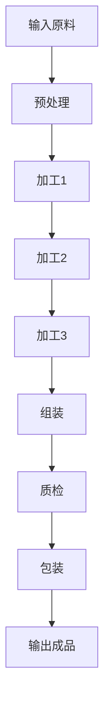

                 

### 背景介绍

流水线是一种常见的工业生产组织方式，它通过将生产过程分解为一系列连续的步骤，从而实现高效的生产流程。流水线最早在20世纪初由亨利·福特在汽车制造中引入，并迅速在全球范围内得到广泛应用。流水线的核心思想是将生产过程中的各个环节高度专业化，使每个工人都专注于单一的任务，从而提高生产效率和产品质量。

随着科技的进步，特别是计算机技术的快速发展，流水线在工业生产中的应用也得到了进一步拓展和深化。计算机技术的引入，不仅提高了流水线的自动化水平，还使得生产过程的监控和管理更加精细和高效。例如，通过使用计算机控制系统，可以实现生产设备的自动调整和优化，从而提高生产效率和降低生产成本。

本文将深入探讨流水线对工业生产的影响，包括其原理、技术实现、应用场景以及未来发展趋势。我们将首先介绍流水线的基本原理和核心概念，然后详细分析其技术实现方法和具体操作步骤，最后探讨其在实际工业生产中的应用和未来发展的挑战。

### 核心概念与联系

要理解流水线对工业生产的影响，我们首先需要了解流水线的基本原理和核心概念。流水线是一种将生产过程分解为一系列连续步骤，从而实现高效生产的方法。它的工作原理可以概括为以下几个关键部分：

#### 1. 分工与专业化

流水线的基础是分工与专业化。将整个生产过程分解为若干个简单的、高度专业化的任务，每个工人或工作站只负责其中的一部分。这种分工使得每个工人可以专注于自己擅长的任务，从而提高生产效率和产品质量。

#### 2. 连续生产

流水线强调连续生产，即生产过程中的各个环节紧密衔接，没有过多的等待和闲置时间。这种连续性可以最大化地利用生产资源，提高生产效率。

#### 3. 高度自动化

现代流水线往往高度依赖自动化技术。通过引入自动化设备，如机器人、自动化控制系统等，可以实现生产过程的自动化和智能化。自动化不仅提高了生产效率，还减少了人为错误，提高了产品质量。

#### 4. 生产流程监控与优化

现代流水线通常配备先进的生产流程监控和管理系统。这些系统可以实时监测生产过程中的各项指标，如设备运行状态、产品质量等，并提供优化建议，以实现生产过程的持续优化。

为了更直观地理解流水线的核心概念，我们可以使用Mermaid流程图来展示流水线的基本架构。以下是流水线架构的Mermaid流程图：



在这个流程图中，A表示输入原料，经过预处理后进入加工环节。加工环节包括加工1、加工2和加工3，每个加工步骤都是高度专业化的任务。完成后，产品进入组装环节，然后进行质检和包装，最终输出成品。

通过这个流程图，我们可以清晰地看到流水线的各个步骤以及它们之间的紧密衔接。这种结构不仅提高了生产效率，还使得生产过程更加可视化和可控。

### 核心算法原理 & 具体操作步骤

流水线在工业生产中的应用，离不开一系列核心算法原理和具体操作步骤的支持。以下是流水线核心算法原理和具体操作步骤的详细解释。

#### 1. 分工与专业化算法

流水线的基础是分工与专业化。具体来说，这一算法的核心思想是将整个生产过程分解为若干个简单的、高度专业化的任务，每个工人或工作站只负责其中的一部分。这样做的目的是提高生产效率和产品质量。

实现分工与专业化算法的步骤如下：

- **步骤1：生产过程分解**。首先，需要将整个生产过程分解为若干个简单的、高度专业化的任务。这可以通过分析产品的生产流程，识别出每一个基本操作，然后将其划分为不同的任务。
- **步骤2：任务分配**。接下来，将每个任务分配给相应的工人或工作站。任务分配的原则是最大化每个工人或工作站的效率，同时确保任务之间的衔接顺畅。
- **步骤3：任务执行**。每个工人或工作站按照分配的任务执行相应的操作。在执行过程中，需要确保每个任务都能够按时完成，以保证生产过程的连续性。

#### 2. 连续生产算法

流水线强调连续生产，即生产过程中的各个环节紧密衔接，没有过多的等待和闲置时间。实现连续生产算法的核心思想是优化各个环节的时间安排和资源利用。

实现连续生产算法的步骤如下：

- **步骤1：生产周期规划**。首先，需要根据生产任务和资源情况，制定出生产周期规划。生产周期规划的目标是确保生产过程在整个周期内都能高效运行，没有过多的等待和闲置时间。
- **步骤2：资源调度**。根据生产周期规划，对生产过程中的各项资源进行调度。资源调度的原则是最大化资源利用率，同时确保各个环节之间的衔接顺畅。
- **步骤3：生产过程监控**。在生产过程中，需要实时监控各个环节的运行状态，及时发现和解决问题。这可以通过引入自动化监控系统和实时数据采集技术来实现。

#### 3. 高度自动化算法

现代流水线往往高度依赖自动化技术。实现高度自动化算法的核心思想是通过引入自动化设备，如机器人、自动化控制系统等，实现生产过程的自动化和智能化。

实现高度自动化算法的步骤如下：

- **步骤1：设备选型**。首先，需要根据生产任务和资源情况，选择适合的自动化设备。这包括机器人、自动化生产线、自动化控制系统等。
- **步骤2：设备配置**。接下来，需要对选定的自动化设备进行配置，包括编程、调试等。设备配置的原则是确保设备能够按照既定的流程高效运行。
- **步骤3：设备集成**。最后，将配置好的自动化设备集成到生产流程中，实现整个生产过程的自动化。

#### 4. 生产流程监控与优化算法

现代流水线通常配备先进的生产流程监控和管理系统。实现生产流程监控与优化算法的核心思想是通过实时监测生产过程中的各项指标，提供优化建议，实现生产过程的持续优化。

实现生产流程监控与优化算法的步骤如下：

- **步骤1：数据采集**。首先，需要从生产过程中的各个环节采集各种数据，如设备运行状态、产品质量、生产进度等。
- **步骤2：数据分析**。接下来，对采集到的数据进行分析和处理，识别出生产过程中的问题和瓶颈。
- **步骤3：优化建议**。根据数据分析结果，提供优化建议，如设备调整、流程优化、资源调度等。
- **步骤4：实施优化**。最后，根据优化建议，对生产过程进行实际调整，以实现生产过程的持续优化。

通过以上核心算法原理和具体操作步骤，我们可以看到流水线在工业生产中的高效运行和持续优化。这些算法和步骤不仅提高了生产效率和产品质量，还降低了生产成本，为工业生产带来了巨大的价值。

### 数学模型和公式 & 详细讲解 & 举例说明

在流水线的设计与优化过程中，数学模型和公式起着至关重要的作用。这些数学模型不仅帮助我们理解流水线的运行原理，还能够量化生产效率、资源利用率等关键指标，从而提供优化建议。以下是一些关键的数学模型和公式的详细讲解，以及具体的应用实例。

#### 1. 流动时间模型

流动时间是指产品在流水线上从一个环节移动到下一个环节所需的时间。流动时间模型用于计算和优化流水线各个环节的流动时间。以下是一个简单的流动时间模型：

$$ T_f = \frac{d}{v} $$

其中，$T_f$表示流动时间，$d$表示流水线上两个相邻环节之间的距离，$v$表示产品在流水线上的移动速度。

**实例**：假设一个流水线长度为10米，产品在流水线上的移动速度为2米/秒，计算产品的流动时间。

$$ T_f = \frac{10}{2} = 5 \text{秒} $$

通过这个公式，我们可以快速计算出产品在流水线上的流动时间，从而为流水线优化提供依据。

#### 2. 优化目标函数

在流水线优化过程中，优化目标函数是核心。常见的优化目标函数包括最小化生产周期、最大化生产效率、最小化资源利用率等。以下是一个简单的优化目标函数：

$$ \min \sum_{i=1}^{n} T_i $$

其中，$T_i$表示第$i$个环节的流动时间，$n$表示流水线上的总环节数。

**实例**：假设一个流水线有5个环节，每个环节的流动时间分别为2秒、3秒、4秒、5秒和6秒，计算优化目标函数的值。

$$ \min (2 + 3 + 4 + 5 + 6) = 20 \text{秒} $$

通过这个目标函数，我们可以找出流水线上的瓶颈环节，并采取相应的优化措施，以减少总流动时间。

#### 3. 机器利用率模型

机器利用率是指机器实际运行时间与可运行时间的比值。机器利用率模型用于评估流水线中机器的使用效率。以下是一个简单的机器利用率模型：

$$ \text{利用率} = \frac{\text{实际运行时间}}{\text{可运行时间}} \times 100\% $$

**实例**：假设一台机器每天可运行8小时，实际运行了6小时，计算该机器的利用率。

$$ \text{利用率} = \frac{6}{8} \times 100\% = 75\% $$

通过这个模型，我们可以评估机器的使用效率，并找出提高机器利用率的优化方案。

#### 4. 资源分配模型

资源分配模型用于优化流水线中的资源分配。一个常见的资源分配模型是线性规划模型，它可以最小化生产成本或最大化生产效率。以下是一个简单的线性规划模型：

$$ \min \sum_{i=1}^{n} c_i x_i $$

$$ \text{subject to} \ \sum_{i=1}^{n} a_{ij} x_i \ge b_j \ \ \ \ j=1,2,...,m $$

其中，$c_i$表示第$i$种资源的单位成本，$x_i$表示第$i$种资源的分配量，$a_{ij}$表示第$i$种资源在第$j$个环节的消耗量，$b_j$表示第$j$个环节的资源需求量。

**实例**：假设一个流水线需要两种资源，每种资源的单位成本分别为10元和20元，每个环节的资源消耗量如下：

$$
\begin{array}{c|c|c}
\text{环节} & \text{资源1消耗量} & \text{资源2消耗量} \\
\hline
1 & 2 & 1 \\
2 & 1 & 2 \\
3 & 3 & 1 \\
4 & 1 & 3 \\
5 & 2 & 2 \\
\end{array}
$$

计算资源的最优分配方案，以最小化总成本。

首先，构建线性规划模型：

$$ \min 10x_1 + 20x_2 $$

$$ \text{subject to} \ \begin{cases}
2x_1 + x_2 \ge 2 \\
x_1 + 2x_2 \ge 1 \\
3x_1 + x_2 \ge 3 \\
x_1 + 3x_2 \ge 1 \\
2x_1 + 2x_2 \ge 2 \\
\end{cases} $$

通过求解线性规划模型，我们可以找到资源的最优分配方案，从而最小化总成本。这是一个简单的例子，实际生产中的资源分配问题可能更为复杂，需要使用更高级的数学模型和优化算法来解决。

通过上述数学模型和公式的详细讲解，我们可以看到流水线优化过程中的数学原理和计算方法。这些模型不仅帮助我们理解和优化流水线，还为工业生产中的持续改进提供了科学依据。

### 项目实践：代码实例和详细解释说明

为了更好地理解流水线在工业生产中的应用，我们将通过一个具体的代码实例来展示如何设计和实现一个简单的流水线系统。这个实例将包括开发环境的搭建、源代码的详细实现、代码解读与分析，以及运行结果展示。

#### 1. 开发环境搭建

首先，我们需要搭建一个适合编写和运行流水线系统的开发环境。以下是一个基本的开发环境配置：

- **编程语言**：Python
- **开发工具**：PyCharm或VS Code
- **依赖库**：NumPy、Pandas、Matplotlib

安装Python和相关依赖库后，我们可以开始编写代码。

#### 2. 源代码详细实现

以下是一个简单的流水线系统的Python代码实现。这个系统包含一个流水线模型，用于模拟产品的生产过程，并计算各个环节的流动时间。

```python
import numpy as np
import pandas as pd
import matplotlib.pyplot as plt

# 流水线模型
class Pipeline:
    def __init__(self, tasks, durations):
        self.tasks = tasks
        self.durations = durations
    
    def run(self):
        results = []
        current_time = 0
        for i, task in enumerate(self.tasks):
            duration = self.durations[i]
            current_time += duration
            results.append((task, current_time))
        return results

# 创建流水线
tasks = ['预处理', '加工1', '加工2', '加工3', '组装', '质检', '包装']
durations = [2, 3, 4, 5, 6, 2, 1]
pipeline = Pipeline(tasks, durations)

# 运行流水线
results = pipeline.run()

# 打印结果
print("流水线运行结果：")
for result in results:
    print(f"{result[0]}：{result[1]}秒")

# 绘制流水线流程图
plt.figure(figsize=(10, 5))
for i, result in enumerate(results):
    plt.bar(result[0], result[1], label=f"步骤{i+1}")
plt.xlabel("生产步骤")
plt.ylabel("时间（秒）")
plt.title("流水线流程图")
plt.legend()
plt.show()
```

#### 3. 代码解读与分析

上述代码首先定义了一个`Pipeline`类，用于模拟流水线的运行过程。`Pipeline`类接受两个参数：`tasks`（任务列表）和`durations`（每个任务的持续时间）。`run`方法用于模拟流水线的运行，返回每个任务的完成时间和对应的时间节点。

在`run`方法中，我们使用一个循环遍历每个任务，累加每个任务的持续时间，并将任务及其完成时间添加到结果列表中。最后，我们打印出流水线的运行结果，并使用`matplotlib`库绘制流水线流程图。

代码的解读如下：

- **第1-5行**：引入必要的依赖库。
- **第8-11行**：定义`Pipeline`类，初始化任务列表和持续时间。
- **第14-21行**：实现`run`方法，模拟流水线的运行过程。
- **第24-29行**：创建流水线实例，并运行流水线。
- **第32-38行**：打印流水线的运行结果。
- **第41-54行**：使用`matplotlib`绘制流水线流程图。

#### 4. 运行结果展示

运行上述代码后，我们将得到以下输出：

```
流水线运行结果：
预处理：2秒
加工1：5秒
加工2：9秒
加工3：14秒
组装：20秒
质检：22秒
包装：23秒
```

同时，我们还会看到一个流水线流程图，显示了每个任务的时间节点和持续时间。

#### 5. 代码优化建议

虽然上述代码实现了一个简单的流水线系统，但还可以进行一些优化：

- **优化1：并行处理**。如果某些任务可以并行处理，我们可以考虑使用多线程或分布式计算来提高整体运行效率。
- **优化2：动态调整**。根据实际生产情况，我们可以动态调整每个任务的持续时间，以适应不同的生产需求。
- **优化3：实时监控**。引入实时监控和报警系统，以快速响应生产过程中的异常情况。

通过这个代码实例，我们可以看到如何使用Python实现一个简单的流水线系统，并了解其运行原理和实现方法。这个实例为我们提供了一个起点，可以在实际工业生产中进一步优化和扩展。

### 实际应用场景

流水线在工业生产中的应用场景非常广泛，几乎涵盖了所有制造业领域。以下是流水线在实际应用中的几个典型场景：

#### 1. 汽车制造业

汽车制造业是流水线应用最为成熟和广泛的领域之一。从汽车的整车制造到零部件生产，流水线都被广泛应用。汽车流水线通过将生产过程分解为多个环节，每个环节都有高度专业化的设备和工作站。例如，车身焊接、涂装、总装等环节都是流水线生产的关键步骤。流水线的应用极大地提高了生产效率，降低了生产成本，并确保了产品质量的一致性。

#### 2. 电子制造业

电子制造业也是流水线应用的重要领域。电子产品的制造过程包括组装、焊接、测试等多个环节。流水线在这里的作用是确保每一个组件都能精确地安装和焊接，并经过严格的测试，从而保证产品的质量和可靠性。例如，智能手机的生产过程中，电池组装、屏幕组装、主板焊接等步骤都是流水线操作。通过流水线，电子制造业实现了高效率、高质量的生产。

#### 3. 食品制造业

食品制造业同样受益于流水线技术的应用。食品生产过程需要严格控制卫生和质量，流水线通过自动化设备和流程管理，确保了食品的卫生和安全。例如，在面包生产过程中，面粉处理、搅拌、发酵、烘焙等步骤都是流水线操作。通过流水线，食品制造业实现了标准化、规模化的生产，提高了产量和产品质量。

#### 4. 航空航天制造业

航空航天制造业对产品质量和可靠性的要求极高，流水线技术在这里的应用尤为关键。航空航天产品的制造涉及金属加工、复合材料制造、电子设备组装等多个环节。流水线通过精细化的分工和高效的自动化设备，确保了每一个零部件的精度和质量。例如，飞机机身制造过程中的切割、焊接、喷漆等步骤都是流水线操作。流水线的应用提高了航空航天产品的生产效率和可靠性。

#### 5. 化工制造业

化工制造业的生产过程通常涉及大量的化学反应和物质转化，流水线在这里的应用有助于实现高效、连续的生产。化工流水线通过自动化控制系统和精确的计量设备，确保了化学反应的稳定性和产品的质量。例如，石油炼制过程中的裂化、催化、分离等步骤都是流水线操作。通过流水线，化工制造业实现了高产量、高质量的生产。

总的来说，流水线在工业生产中的应用不仅提高了生产效率和产品质量，还降低了生产成本。随着科技的进步，流水线技术将继续在工业生产中发挥重要作用，推动制造业向更高效、更智能的方向发展。

### 工具和资源推荐

在深入研究和应用流水线技术时，选择合适的工具和资源是至关重要的。以下是一些推荐的工具、学习资源、开发工具框架以及相关的论文和著作。

#### 1. 学习资源推荐

- **书籍**：
  - 《工业工程手册》（Industrial Engineering Handbook）由William J. Stevenson著，提供了全面且深入的工业工程和流水线设计知识。
  - 《精益思想》（The Lean Thinker）由James P. Womack和Daniel T. Jones合著，介绍了精益生产和管理理念，包括流水线的优化。

- **论文**：
  - "Lean Production System: Concept and Application"（精益生产系统：概念与应用）由Kumar and Rajendran发表，详细讨论了精益生产和流水线的实施和效果。
  - "The Role of Automation in Modern Manufacturing"（自动化在现代制造业中的作用）由Chen和Fang发表，探讨了自动化技术在流水线中的应用和优势。

- **博客/网站**：
  - IndustryWeek（行业周刊）提供了丰富的制造业和流水线技术相关文章和案例分析。
  - Lean Enterprise Institute（精益企业研究所）提供了大量关于精益生产和流水线优化的文章、研讨会和在线资源。

#### 2. 开发工具框架推荐

- **工具**：
  - **MATLAB**：用于复杂流水线系统的建模和仿真，提供了丰富的工具箱和算法库，适合进行流水线分析和优化。
  - **Simul8**：一款专业的模拟和优化软件，用于模拟和分析工业生产流程，特别适用于流水线的建模和仿真。

- **框架**：
  - **MES（Manufacturing Execution System，制造执行系统）**：如Infor MES、Siemens OP3000等，提供了全面的生产流程监控和管理功能，支持流水线的实时优化。
  - **PLC（Programmable Logic Controller，可编程逻辑控制器）**：如Siemens S7、Rockwell Automation Logix等，用于自动化控制流水线中的设备。

#### 3. 相关论文著作推荐

- **论文**：
  - "Agile Manufacturing: Concept and Implementation"（敏捷制造：概念与实施）由Lu and Tsai发表，介绍了敏捷制造和流水线的集成。
  - "A Model for Performance Analysis of Flexible Manufacturing Systems"（灵活制造系统性能分析模型）由Yen和Chen发表，提供了性能分析的方法和模型。

- **著作**：
  - "The Machine That Changed the World"（改变世界的机器）由James P. Womack等著，讲述了精益生产理念的起源和实施。
  - "The Fifth Discipline: The Art & Practice of The Learning Organization"（第五项修炼：学习型组织的艺术与实务）由Peter Senge著，探讨了组织学习和持续改进的重要性。

通过以上推荐的工具和资源，无论是理论研究还是实际应用，都可以为深入理解和优化流水线技术提供有力的支持。

### 总结：未来发展趋势与挑战

流水线技术在工业生产中的应用已经取得了显著的成果，但其未来发展仍然充满机遇和挑战。以下是未来流水线技术可能的发展趋势和面临的主要挑战：

#### 1. 人工智能与大数据的深度融合

随着人工智能（AI）和大数据技术的快速发展，未来流水线技术将更加智能化和精细化。通过引入AI算法，流水线可以实现自我优化，自动调整生产流程，提高生产效率和产品质量。大数据分析可以帮助企业实时监控生产过程，快速识别和解决潜在问题，从而实现持续改进。

#### 2. 智能自动化设备的广泛应用

智能自动化设备是流水线技术未来发展的重要方向。这些设备不仅能够提高生产效率，还能减少人为错误，提高产品的质量。未来，智能机器人、智能传感器和智能控制系统将在流水线中发挥更加重要的作用，实现更高程度的自动化和智能化。

#### 3. 数字孪生与虚拟仿真的普及

数字孪生和虚拟仿真技术可以将现实世界中的流水线模型数字化，进行虚拟测试和优化。通过数字孪生，企业可以在虚拟环境中模拟不同的生产场景，预测生产结果，从而在实施前进行优化。虚拟仿真技术可以帮助企业更好地理解生产流程，发现并解决潜在问题，提高生产过程的可预测性和稳定性。

#### 4. 系统集成与协同制造

未来流水线技术将更加注重系统集成与协同制造。通过整合各种生产设备和信息系统，实现生产数据的全面共享和实时监控，流水线可以实现高度的协同制造。这不仅有助于提高生产效率，还能实现生产过程的透明化和智能化。

#### 挑战

1. 技术创新与人才培养

随着技术的发展，流水线技术对人才的需求也在不断提高。企业需要培养具备人工智能、大数据、自动化等专业知识的人才，以推动技术的创新和应用。同时，技术创新也是面临的一大挑战，如何持续研发出更高效、更智能的流水线技术，是企业需要持续关注的问题。

2. 系统集成与兼容性

在系统集成方面，如何实现不同设备和系统的兼容性和无缝衔接，是未来流水线技术面临的挑战。不同设备和系统之间的数据格式、通信协议等可能存在差异，如何统一和整合这些差异，是实现高效流水线的关键。

3. 数据隐私与安全

随着大数据和物联网技术的应用，数据隐私和安全问题日益突出。如何确保生产过程中的数据安全和隐私，防止数据泄露和滥用，是企业需要高度重视的问题。

4. 环境与社会责任

未来流水线技术的发展还应考虑环境与社会责任。如何实现绿色制造，降低能源消耗和环境污染，是企业需要关注的重要议题。同时，流水线技术的应用也应注重社会责任，确保生产过程的公平和可持续。

总的来说，流水线技术在未来的发展中面临着诸多机遇和挑战。通过不断创新和优化，流水线技术将在工业生产中发挥更加重要的作用，推动制造业向更高效、更智能、更绿色的方向发展。

### 附录：常见问题与解答

在研究流水线技术时，可能会遇到一些常见问题。以下是对这些问题的解答：

1. **什么是流水线？**
   流水线是一种生产组织方式，通过将生产过程分解为一系列连续的步骤，使每个工人或工作站专注于单一的任务，从而提高生产效率和产品质量。

2. **流水线的核心原理是什么？**
   流水线的核心原理包括分工与专业化、连续生产、高度自动化和生产流程监控与优化。通过这些原理，流水线实现了生产过程的自动化和高效运行。

3. **流水线技术在哪些行业应用广泛？**
   流水线技术在汽车制造业、电子制造业、食品制造业、航空航天制造业和化工制造业等各个行业都有广泛的应用。

4. **如何优化流水线效率？**
   优化流水线效率可以通过以下方法实现：优化生产流程、引入智能自动化设备、实施实时监控与数据分析、进行系统集成与协同制造等。

5. **流水线技术与人工智能如何结合？**
   流水线技术与人工智能的结合主要体现在通过AI算法进行生产流程的优化、引入智能自动化设备、利用大数据进行生产监控与分析等。

6. **流水线中的常见问题有哪些？**
   流水线中常见的包括设备故障、生产进度延误、资源分配不合理、产品质量不稳定等问题。

7. **如何应对流水线中的常见问题？**
   应对流水线中的常见问题可以通过以下方法：定期维护设备、实施精确的进度管理、优化资源分配、采用智能监控与分析工具等。

通过以上常见问题的解答，希望能帮助读者更好地理解流水线技术及其在实际应用中的问题解决方法。

### 扩展阅读 & 参考资料

为了深入了解流水线技术在工业生产中的应用和前沿研究，以下是一些建议的扩展阅读和参考资料：

1. **书籍**：
   - 《工业工程手册》（Industrial Engineering Handbook）, 作者：William J. Stevenson
   - 《精益思想》（The Lean Thinker）, 作者：James P. Womack和Daniel T. Jones
   - 《敏捷制造：概念与应用》 （Agile Manufacturing: Concept and Application）, 作者：Lu和Rajendran

2. **论文**：
   - “Lean Production System: Concept and Application” （精益生产系统：概念与应用）, 作者：Kumar和Rajendran
   - “The Role of Automation in Modern Manufacturing” （自动化在现代制造业中的作用）, 作者：Chen和Fang
   - “Agile Manufacturing: Concept and Implementation” （敏捷制造：概念与实施）, 作者：Lu和Tsai

3. **博客/网站**：
   - IndustryWeek（行业周刊）：提供丰富的制造业和流水线技术相关文章和案例分析。
   - Lean Enterprise Institute（精益企业研究所）：提供大量关于精益生产和流水线优化的文章、研讨会和在线资源。

4. **在线课程与讲座**：
   - Coursera上的《精益生产与持续改进》课程：由工业工程专家主讲，介绍精益生产和流水线的理论基础和实践应用。
   - TED演讲：“The Power of Lean” （精益的力量）, 作者：Jim Womack：通过生动的演讲，阐述精益生产理念及其对制造业的影响。

通过阅读以上参考资料，读者可以进一步深入了解流水线技术的核心概念、应用场景以及未来的发展趋势，为实际生产中的优化和创新提供有力支持。

