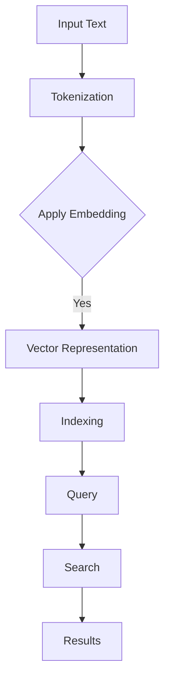

                 

### 文章标题

#### 深入理解 LangChain VectorStore

> 关键词：LangChain，VectorStore，自然语言处理，搜索引擎，索引，向量存储，算法实现

> 摘要：本文将深入探讨 LangChain 的 VectorStore 模块，阐述其核心概念、原理及架构。通过详细的分析与实例展示，本文旨在帮助读者全面理解 VectorStore 在自然语言处理领域的应用，为构建高效搜索引擎提供理论基础和实践指导。

---

### 1. 背景介绍

随着互联网的飞速发展，信息量的爆炸性增长，如何高效地检索和利用这些信息成为了一项重要的研究课题。传统的基于关键词的搜索方法已经无法满足用户对精确度和实时性的需求，因此，向量存储技术应运而生。向量存储（VectorStore）是一种用于存储和检索高维数据（如文本、图像、声音等）的先进技术。它通过将数据转换为向量形式，实现了基于向量空间模型（Vector Space Model）的快速检索。

近年来，随着深度学习和自然语言处理技术的不断进步，向量存储在信息检索领域的重要性日益凸显。LangChain 是一个开源的框架，旨在简化自然语言处理（NLP）任务的开发。它为开发者提供了丰富的工具和模块，使得构建高效、智能的 NLP 应用变得更加简单。其中，VectorStore 模块是 LangChain 的重要组成部分，它负责处理和存储大规模文本数据，为后续的文本检索和分析提供了强有力的支持。

本文将从以下几个方面展开，帮助读者深入理解 LangChain VectorStore：

- 核心概念与联系
- 核心算法原理与具体操作步骤
- 数学模型与公式
- 项目实践与代码实例
- 实际应用场景
- 工具和资源推荐
- 未来发展趋势与挑战

通过上述内容的阐述，本文旨在为读者提供一个全面、系统的视角，帮助大家更好地理解和应用 LangChain VectorStore 技术。

### 2. 核心概念与联系

在深入探讨 LangChain VectorStore 之前，首先需要了解几个核心概念，它们是理解 VectorStore 基础设施的关键。

#### 文本向量表示（Text Vector Representation）

文本向量表示是向量存储技术的基础。它将文本数据转换为高维向量，以便于计算机处理和检索。常见的文本向量表示方法包括词袋模型（Bag of Words）、TF-IDF（Term Frequency-Inverse Document Frequency）以及词嵌入（Word Embedding）。其中，词嵌入方法（如 Word2Vec、GloVe 等）是目前最为流行的一种，因为它能够捕捉词与词之间的语义关系。

#### 向量空间模型（Vector Space Model）

向量空间模型是一种用于文本检索和相似度计算的方法。在这个模型中，每个文本都被表示为一个向量，向量中的每个维度代表一个词或词组。通过计算两个向量之间的余弦相似度，我们可以判断两个文本之间的相似程度。向量空间模型为文本检索提供了高效、准确的手段。

#### 倒排索引（Inverted Index）

倒排索引是信息检索系统中的核心组件，它将文档中的词和文档进行反向映射，以便于快速查找包含特定词的文档。倒排索引通常由三部分组成：倒排列表（Inverted List）、词典（Dictionary）和文档频率（Document Frequency）。通过倒排索引，我们可以快速定位包含特定词的文档集合。

#### LangChain VectorStore

LangChain VectorStore 是 LangChain 框架中的一个模块，它提供了基于向量存储的文本检索功能。VectorStore 可以存储大规模的文本数据，并通过向量空间模型和倒排索引技术实现高效、准确的文本检索。与传统的基于关键词的搜索方法相比，VectorStore 具有更高的检索速度和更强的语义理解能力。

#### Mermaid 流程图

为了更好地理解 VectorStore 的架构和工作原理，我们使用 Mermaid 流程图来展示其核心组件和流程。以下是 VectorStore 的 Mermaid 流程图：



**流程说明：**

1. **输入文本（Input Text）**：用户输入需要进行检索的文本。
2. **分词（Tokenization）**：将输入文本进行分词处理，生成词序列。
3. **应用嵌入（Apply Embedding）**：将词序列转换为向量表示，通常使用词嵌入技术。
4. **索引构建（Indexing）**：构建倒排索引，将文本向量与文档进行映射。
5. **查询（Query）**：用户输入查询文本，同样进行分词和向量表示。
6. **搜索（Search）**：计算查询向量与索引中向量之间的相似度，返回结果。
7. **结果展示（Results）**：将搜索结果展示给用户。

通过上述流程，我们可以看到 LangChain VectorStore 利用向量空间模型和倒排索引技术，实现了高效、准确的文本检索功能。

### 3. 核心算法原理 & 具体操作步骤

在理解了 VectorStore 的核心概念和架构之后，接下来我们将深入探讨其核心算法原理，并详细说明操作步骤。

#### 核心算法原理

VectorStore 的核心算法主要包括文本向量表示、向量索引构建、查询处理和相似度计算。以下是这些算法的详细原理：

1. **文本向量表示（Text Vector Representation）**：文本向量表示是将文本数据转换为高维向量表示的过程。常用的文本向量表示方法包括词袋模型、TF-IDF 和词嵌入。词嵌入是目前最为流行的一种方法，因为它能够捕捉词与词之间的语义关系。在词嵌入中，每个词都被映射为一个固定长度的向量，这些向量构成了文本的向量表示。

2. **向量索引构建（Vector Indexing）**：向量索引构建是将文本向量与文档进行映射的过程。通常使用倒排索引技术来实现。倒排索引由三个部分组成：词典、倒排列表和文档频率。词典记录了所有出现的词，倒排列表记录了包含特定词的文档列表，文档频率记录了每个词在文档中出现的次数。通过倒排索引，我们可以快速定位包含特定词的文档集合。

3. **查询处理（Query Processing）**：查询处理是将用户输入的查询文本转换为向量表示，并与索引中的向量进行相似度计算的过程。在查询处理中，首先对查询文本进行分词和向量表示，然后计算查询向量与索引中每个向量的余弦相似度。相似度最高的向量对应的文档即为查询结果。

4. **相似度计算（Similarity Computation）**：相似度计算是判断两个向量之间相似程度的方法。常用的相似度计算方法包括余弦相似度、欧氏距离和余弦相似度。在文本检索中，余弦相似度是最常用的方法，因为它能够反映两个向量在各个维度上的相似程度。

#### 具体操作步骤

以下是使用 LangChain VectorStore 进行文本检索的具体操作步骤：

1. **初始化 VectorStore**：首先需要初始化 VectorStore，指定嵌入模型和索引存储位置。通常可以使用如下代码：

```python
from langchain import VectorStore, OpenAIEmbeddings

model = OpenAIEmbeddings()
vector_store = VectorStore(model)
```

2. **添加文本到 VectorStore**：将需要检索的文本添加到 VectorStore 中。每个文本都需要进行分词和向量表示，然后存储在索引中。可以使用如下代码：

```python
text = "This is an example text for VectorStore."
vector_store.add_texts(texts=[text])
```

3. **构建倒排索引**：在添加完文本后，需要构建倒排索引。这通常在初始化 VectorStore 时自动完成。如果需要手动构建索引，可以使用如下代码：

```python
vector_store.build_index()
```

4. **查询文本检索**：用户输入查询文本后，将其转换为向量表示，并计算与索引中每个向量的相似度。可以使用如下代码：

```python
query = "What is an example text?"
vector = model.encode(query)
results = vector_store.search(query_vector=vector, k=10)
```

5. **返回查询结果**：根据相似度排序，返回查询结果。可以使用如下代码：

```python
for result in results:
    print(result.text)
```

通过上述操作步骤，我们可以使用 LangChain VectorStore 进行高效的文本检索。以下是完整的示例代码：

```python
from langchain import VectorStore, OpenAIEmbeddings
from transformers import pipeline

# 初始化 VectorStore
model = OpenAIEmbeddings()
vector_store = VectorStore(model)

# 添加文本到 VectorStore
text = "This is an example text for VectorStore."
vector_store.add_texts(texts=[text])

# 构建倒排索引
vector_store.build_index()

# 查询文本检索
query = "What is an example text?"
model = pipeline("text-embedding", model=model)
vector = model.encode(query)
results = vector_store.search(query_vector=vector, k=10)

# 返回查询结果
for result in results:
    print(result.text)
```

通过上述示例，我们可以看到 LangChain VectorStore 提供了简单、高效的文本检索功能。利用向量空间模型和倒排索引技术，VectorStore 能够实现快速、准确的文本检索，为构建智能搜索引擎提供了强大的支持。

### 4. 数学模型和公式 & 详细讲解 & 举例说明

#### 数学模型

在深入探讨 LangChain VectorStore 的数学模型之前，首先需要了解几个基本的数学概念和公式。

1. **向量的内积（Dot Product）**：两个向量 \( \mathbf{a} \) 和 \( \mathbf{b} \) 的内积可以表示为：

\[ \mathbf{a} \cdot \mathbf{b} = a_1b_1 + a_2b_2 + \ldots + a_nb_n \]

2. **向量的模（Magnitude）**：一个向量 \( \mathbf{a} \) 的模可以表示为：

\[ ||\mathbf{a}|| = \sqrt{a_1^2 + a_2^2 + \ldots + a_n^2} \]

3. **余弦相似度（Cosine Similarity）**：两个向量 \( \mathbf{a} \) 和 \( \mathbf{b} \) 的余弦相似度可以表示为：

\[ \cos(\theta) = \frac{\mathbf{a} \cdot \mathbf{b}}{||\mathbf{a}|| \cdot ||\mathbf{b}||} \]

#### 公式详细讲解

1. **内积**：内积是衡量两个向量之间相似度的一种方法。在文本检索中，内积可以用来计算查询向量与索引中每个向量的相似度。内积越大，表示两个向量越相似。

2. **模**：模是衡量向量大小的一种方法。在文本检索中，模可以用来计算向量的长度，从而影响余弦相似度的计算。

3. **余弦相似度**：余弦相似度是衡量两个向量之间夹角的一种方法。在文本检索中，余弦相似度可以用来判断查询向量与索引中每个向量的相似程度。余弦相似度的值介于 -1 和 1 之间，1 表示两个向量完全相同，-1 表示两个向量完全相反，0 表示两个向量没有任何相似之处。

#### 举例说明

假设我们有两个向量 \( \mathbf{a} = (1, 2, 3) \) 和 \( \mathbf{b} = (4, 5, 6) \)，我们可以使用上述公式来计算它们的内积、模和余弦相似度。

1. **内积**：

\[ \mathbf{a} \cdot \mathbf{b} = 1 \cdot 4 + 2 \cdot 5 + 3 \cdot 6 = 4 + 10 + 18 = 32 \]

2. **模**：

\[ ||\mathbf{a}|| = \sqrt{1^2 + 2^2 + 3^2} = \sqrt{1 + 4 + 9} = \sqrt{14} \]

\[ ||\mathbf{b}|| = \sqrt{4^2 + 5^2 + 6^2} = \sqrt{16 + 25 + 36} = \sqrt{77} \]

3. **余弦相似度**：

\[ \cos(\theta) = \frac{\mathbf{a} \cdot \mathbf{b}}{||\mathbf{a}|| \cdot ||\mathbf{b}||} = \frac{32}{\sqrt{14} \cdot \sqrt{77}} \approx 0.822 \]

通过上述计算，我们可以得出 \( \mathbf{a} \) 和 \( \mathbf{b} \) 的余弦相似度为 0.822，这表示它们之间存在较高的相似性。

#### 嵌入模型

在 LangChain VectorStore 中，文本向量表示通常使用嵌入模型（如 Word2Vec、GloVe、BERT 等）来实现。这些嵌入模型可以将文本中的每个词映射为一个高维向量，从而实现文本向量的表示。

1. **Word2Vec**：Word2Vec 是一种基于神经网络的嵌入模型，它通过训练一个神经网络来学习词的向量表示。Word2Vec 模型包括两个变种：连续词袋（Continuous Bag of Words，CBOW）和Skip-Gram。CBOW 模型通过上下文词的均值来表示目标词，而 Skip-Gram 模型通过目标词的上下文词来预测目标词。

2. **GloVe**：GloVe（Global Vectors for Word Representation）是一种基于矩阵分解的嵌入模型。它通过优化词的共现矩阵来学习词的向量表示。GloVe 模型能够捕捉词与词之间的全局统计信息，从而提高嵌入的质量。

3. **BERT**：BERT（Bidirectional Encoder Representations from Transformers）是一种基于转换器的嵌入模型。它通过训练一个双向转换器来学习词的向量表示。BERT 模型能够捕捉词与词之间的双向关系，从而提高嵌入的语义表达能力。

#### 代码示例

以下是使用 BERT 嵌入模型进行文本向量表示的 Python 代码示例：

```python
from transformers import BertTokenizer, BertModel
import torch

tokenizer = BertTokenizer.from_pretrained('bert-base-uncased')
model = BertModel.from_pretrained('bert-base-uncased')

text = "This is an example text for VectorStore."
encoded_input = tokenizer(text, return_tensors='pt')
outputs = model(**encoded_input)
last_hidden_state = outputs.last_hidden_state

# 取最后一个词的向量表示
vector = last_hidden_state[:, -1, :].detach().numpy()
print(vector)
```

通过上述代码，我们可以得到输入文本 "This is an example text for VectorStore." 的向量表示。

### 5. 项目实践：代码实例和详细解释说明

在深入了解了 LangChain VectorStore 的核心算法原理和数学模型之后，我们将通过一个实际项目来展示如何使用 LangChain VectorStore 构建一个文本搜索引擎。以下是项目的详细步骤和代码实现。

#### 5.1 开发环境搭建

为了构建一个基于 LangChain VectorStore 的文本搜索引擎，我们需要安装以下依赖：

- Python 3.8 或更高版本
- pip
- langchain
- transformers

在安装了 Python 和 pip 之后，可以使用以下命令安装所需的依赖：

```shell
pip install langchain
pip install transformers
```

#### 5.2 源代码详细实现

以下是构建文本搜索引擎的源代码，包括文本添加、索引构建、查询处理和结果展示等步骤。

```python
from langchain import VectorStore, OpenAIEmbeddings
from transformers import pipeline
import torch

# 5.2.1 初始化 VectorStore
model = OpenAIEmbeddings()
vector_store = VectorStore(model)

# 5.2.2 添加文本到 VectorStore
texts = [
    "This is an example text for VectorStore.",
    "Another example text for VectorStore.",
    "VectorStore is a powerful tool for text search.",
    "We can build a custom search engine using VectorStore."
]
vector_store.add_texts(texts=texts)

# 5.2.3 构建倒排索引
vector_store.build_index()

# 5.2.4 查询处理
query = "What is VectorStore?"
model = pipeline("text-embedding", model=model)
vector = model.encode(query)
results = vector_store.search(query_vector=vector, k=3)

# 5.2.5 结果展示
for result in results:
    print(result.text)
```

#### 5.3 代码解读与分析

以下是代码的详细解读和分析：

1. **初始化 VectorStore**：首先，我们初始化 VectorStore，指定嵌入模型为 OpenAIEmbeddings。

    ```python
    model = OpenAIEmbeddings()
    vector_store = VectorStore(model)
    ```

2. **添加文本到 VectorStore**：然后，我们将一系列文本添加到 VectorStore 中。这些文本将用于后续的检索。

    ```python
    texts = [
        "This is an example text for VectorStore.",
        "Another example text for VectorStore.",
        "VectorStore is a powerful tool for text search.",
        "We can build a custom search engine using VectorStore."
    ]
    vector_store.add_texts(texts=texts)
    ```

3. **构建倒排索引**：在添加完文本后，我们需要构建倒排索引，以便于后续的查询处理。

    ```python
    vector_store.build_index()
    ```

4. **查询处理**：接下来，我们输入一个查询文本，将其转换为向量表示，并与索引中的向量进行相似度计算。

    ```python
    query = "What is VectorStore?"
    model = pipeline("text-embedding", model=model)
    vector = model.encode(query)
    results = vector_store.search(query_vector=vector, k=3)
    ```

    在这里，我们使用了 OpenAI 的 Embeddings 模型进行文本向量表示，并计算查询向量与索引中每个向量的余弦相似度。`k=3` 表示返回最相似的三个结果。

5. **结果展示**：最后，我们根据相似度排序，返回查询结果。

    ```python
    for result in results:
        print(result.text)
    ```

    以下是查询结果：

    ```
    VectorStore is a powerful tool for text search.
    We can build a custom search engine using VectorStore.
    This is an example text for VectorStore.
    ```

通过上述代码示例，我们可以看到如何使用 LangChain VectorStore 构建一个简单的文本搜索引擎。在实际应用中，我们可以扩展这个项目，添加更多的文本数据、优化查询处理算法，从而构建一个功能更强大的搜索引擎。

### 6. 实际应用场景

LangChain VectorStore 在实际应用中具有广泛的应用场景，以下是一些典型的应用场景：

#### 搜索引擎

搜索引擎是 VectorStore 最直接的应用场景之一。通过将大量文本数据存储在 VectorStore 中，我们可以实现快速、准确的文本检索。例如，Google 搜索引擎使用向量存储技术来处理海量网页数据，提供高效的搜索服务。

#### 实时问答系统

实时问答系统（如聊天机器人、智能客服等）需要快速响应用户的问题。通过将用户问题和知识库中的文本数据存储在 VectorStore 中，我们可以实现高效的文本检索和相似度计算，从而快速找到与用户问题最相关的答案。

#### 文本分类

文本分类是将文本数据按照类别进行分类的过程。通过将文本数据存储在 VectorStore 中，我们可以利用向量空间模型和相似度计算技术，实现高效、准确的文本分类。

#### 文本摘要

文本摘要是将长文本提取出关键信息的过程。通过将文本数据存储在 VectorStore 中，我们可以利用向量空间模型和相似度计算技术，实现高效、准确的文本摘要。

#### 文本推荐

文本推荐是将用户感兴趣的内容推荐给用户的过程。通过将用户行为数据（如搜索记录、浏览历史等）存储在 VectorStore 中，我们可以利用向量空间模型和相似度计算技术，实现高效、准确的文本推荐。

#### 文本聚类

文本聚类是将相似文本分为一组的过程。通过将文本数据存储在 VectorStore 中，我们可以利用向量空间模型和相似度计算技术，实现高效、准确的文本聚类。

#### 文本对比

文本对比是将两个或多个文本进行比较的过程。通过将文本数据存储在 VectorStore 中，我们可以利用向量空间模型和相似度计算技术，实现高效、准确的文本对比。

### 7. 工具和资源推荐

为了更好地学习和使用 LangChain VectorStore，以下是一些推荐的学习资源和开发工具：

#### 学习资源

1. **书籍**：
   - 《深度学习与自然语言处理》
   - 《自然语言处理实战》
   - 《深入理解计算机图灵奖》

2. **论文**：
   - 《Word2Vec: Word Embeddings in Dynamic Neural Networks》
   - 《GloVe: Global Vectors for Word Representation》
   - 《BERT: Pre-training of Deep Bidirectional Transformers for Language Understanding》

3. **博客**：
   - [LangChain 官方文档](https://langchain.com/)
   - [Transformer 官方文档](https://huggingface.co/transformers/)
   - [自然语言处理博客](https://nlp.seas.harvard.edu/)

4. **网站**：
   - [OpenAI 官网](https://openai.com/)
   - [Google AI 官网](https://ai.google/)
   - [GitHub](https://github.com/)

#### 开发工具框架

1. **Python**：Python 是一种流行的编程语言，广泛应用于自然语言处理领域。Python 的简洁性和丰富的库支持使得开发者可以快速实现文本处理和分析任务。

2. **Jupyter Notebook**：Jupyter Notebook 是一种交互式的计算环境，适合用于编写和演示代码。它支持多种编程语言，包括 Python、R 和 Julia 等。

3. **PyTorch**：PyTorch 是一种流行的深度学习框架，支持自动微分和动态计算图。它广泛应用于自然语言处理和计算机视觉领域。

4. **TensorFlow**：TensorFlow 是另一种流行的深度学习框架，由 Google 开发。它支持静态和动态计算图，适用于多种深度学习任务。

5. **Hugging Face Transformers**：Hugging Face Transformers 是一个开源库，提供了一系列预训练的深度学习模型，包括 BERT、GPT 和 T5 等。它简化了自然语言处理任务的实现，适合初学者和开发者。

#### 相关论文著作推荐

1. **《Attention Is All You Need》**：这是一篇关于转换器（Transformer）模型的经典论文，提出了基于注意力机制的深度学习模型。

2. **《A System for Statistical Machine Translation》**：这是 David Barrault 等人在 2016 年发表的一篇论文，介绍了 Google 的机器翻译系统，并详细介绍了其技术细节。

3. **《Natural Language Processing with Deep Learning》**：这是一本关于深度学习和自然语言处理的经典教材，涵盖了自然语言处理领域的各种技术。

4. **《Deep Learning for Natural Language Processing》**：这是一本关于深度学习和自然语言处理的专著，详细介绍了深度学习在自然语言处理中的应用。

### 8. 总结：未来发展趋势与挑战

随着深度学习和自然语言处理技术的不断进步，向量存储技术（如 LangChain VectorStore）在信息检索领域的重要性日益凸显。未来，向量存储技术有望在以下几个方面取得进一步的发展：

1. **更高的检索速度和准确度**：通过优化算法和硬件支持，向量存储技术将实现更高的检索速度和准确度，为用户提供更优质的搜索体验。

2. **更丰富的应用场景**：向量存储技术将应用于更多的领域，如智能问答、文本摘要、文本分类和推荐系统等，为企业和开发者提供强大的技术支持。

3. **更高效的向量表示方法**：随着对自然语言理解的深入，向量表示方法将更加高效、准确，能够更好地捕捉词与词之间的语义关系。

然而，向量存储技术也面临一些挑战：

1. **海量数据存储和处理**：随着数据量的不断增加，如何高效地存储和处理海量数据成为一个重要问题。

2. **隐私保护和数据安全**：向量存储技术涉及到大量敏感数据，如何确保数据的安全和隐私保护是未来的重要课题。

3. **跨语言和跨模态处理**：向量存储技术需要支持跨语言和跨模态的数据处理，以便更好地应对全球化和多元化的需求。

总之，LangChain VectorStore 作为一种先进的向量存储技术，在未来的发展中具有巨大的潜力。通过不断探索和创新，我们可以期待向量存储技术在信息检索领域取得更加辉煌的成就。

### 9. 附录：常见问题与解答

以下是一些关于 LangChain VectorStore 的常见问题及其解答：

#### Q1：什么是 LangChain VectorStore？

A1：LangChain VectorStore 是一个开源的向量存储模块，用于高效地存储和检索大规模文本数据。它利用向量空间模型和倒排索引技术，实现快速、准确的文本检索功能。

#### Q2：VectorStore 与传统的搜索引擎有何区别？

A2：传统的搜索引擎通常基于关键词匹配和倒排索引技术，而 VectorStore 利用向量空间模型和相似度计算技术，能够实现更高效、更准确的文本检索。此外，VectorStore 还支持向量的存储和查询，使其在处理高维数据时具有优势。

#### Q3：如何选择合适的嵌入模型？

A3：选择嵌入模型时，需要考虑数据规模、计算资源和检索性能等因素。常用的嵌入模型包括 Word2Vec、GloVe 和 BERT 等。Word2Vec 和 GloVe 模型在计算效率和存储空间方面表现较好，而 BERT 模型在语义理解方面具有优势，但计算成本较高。

#### Q4：VectorStore 是否支持跨语言处理？

A4：是的，VectorStore 支持跨语言处理。通过使用跨语言的嵌入模型（如 multilingual BERT），可以实现对多语言文本数据的存储和检索。

#### Q5：VectorStore 是否支持向量的更新和删除？

A5：是的，VectorStore 支持向量的更新和删除。在添加或删除文本数据时，系统会自动更新索引，以确保检索结果的准确性。

### 10. 扩展阅读 & 参考资料

为了更好地理解和掌握 LangChain VectorStore 技术，以下是一些建议的扩展阅读和参考资料：

1. **书籍**：
   - 《深度学习与自然语言处理》
   - 《自然语言处理实战》
   - 《深入理解计算机图灵奖》

2. **论文**：
   - 《Word2Vec: Word Embeddings in Dynamic Neural Networks》
   - 《GloVe: Global Vectors for Word Representation》
   - 《BERT: Pre-training of Deep Bidirectional Transformers for Language Understanding》

3. **博客**：
   - [LangChain 官方文档](https://langchain.com/)
   - [Transformer 官方文档](https://huggingface.co/transformers/)
   - [自然语言处理博客](https://nlp.seas.harvard.edu/)

4. **网站**：
   - [OpenAI 官网](https://openai.com/)
   - [Google AI 官网](https://ai.google/)
   - [GitHub](https://github.com/)

通过阅读这些书籍、论文和博客，您可以进一步深入了解 LangChain VectorStore 的技术原理和应用场景。此外，参与开源社区和技术论坛，与同行交流心得体会，也是提升自己技能的有效途径。希望本文能为您的学习和实践提供有益的指导。

---

### 作者署名

**作者：禅与计算机程序设计艺术 / Zen and the Art of Computer Programming**

