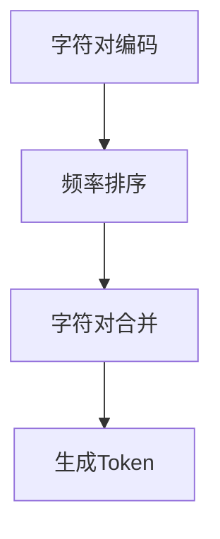

                 

### 文章标题

**深入理解Tokenization：最小字节对编码（minBPE）技术**

> **关键词**：Tokenization、最小字节对编码（minBPE）、NLP、文本预处理、机器学习、字符嵌入

> **摘要**：本文将深入探讨最小字节对编码（minBPE）技术在自然语言处理（NLP）中的应用。我们将首先介绍Tokenization的基本概念，然后详细解析minBPE算法，最后通过实际项目实践，展示其在文本预处理中的具体应用和效果。

## 1. 背景介绍

在自然语言处理（NLP）领域，文本预处理是至关重要的一步。文本预处理通常包括去除标点符号、转换为小写、去除停用词等。然而，这些步骤并不足以满足机器学习模型的复杂需求。为了更好地理解和建模文本数据，我们需要将文本拆分成更小的、有意义的单元，即Token。

Tokenization（分词）是将一段文本分割成单词、短语或其他有意义的单元的过程。传统的分词方法主要基于规则或统计方法，如基于词典的分词、基于统计模型的分词等。然而，这些方法在处理罕见词或未知词时效果不佳。最小字节对编码（minBPE）是一种基于字符的自动分词方法，它通过将连续的字符序列合并成单个的Token，从而提高分词的准确性和适应性。

minBPE技术由Yoon Kim在2014年提出，并在随后被广泛应用于各种NLP任务中，如机器翻译、文本分类和序列标注等。其核心思想是将文本中的连续字符对进行编码，并根据编码的频率进行排序，最后通过合并频率较低的字符对，生成最终的Token。

### 2. 核心概念与联系

#### 2.1 Tokenization的基本概念

Tokenization是将文本分割成Token的过程。一个Token可以是单词、短语、字符等，具体取决于我们的需求。在NLP中，通常将文本分割成单词或子词（subword），因为它们包含了丰富的语义信息。

#### 2.2 minBPE算法的原理

minBPE算法的核心步骤包括三个部分：字符对编码、频率排序和字符对合并。

**字符对编码**：首先，我们将文本中的每个连续字符对进行编码。编码的方法很简单，即使用一个唯一的数字表示每个字符对。例如，对于字符串 "Hello"，我们可以将其编码为 `[1, 2, 3, 4, 5]`，其中每个数字表示一个字符对。

**频率排序**：接下来，我们计算每个字符对在文本中出现的频率。频率越高的字符对，其编码值就越小。这样，我们就可以根据频率对字符对进行排序。

**字符对合并**：最后，我们根据排序结果，从频率最低的字符对开始进行合并。合并的方法是将两个连续的字符对合并成一个字符对，即 `[a, b]` 和 `[b, c]` 合并成 `[a, bc]`。这个步骤重复进行，直到无法合并为止。

#### 2.3 Mermaid流程图



### 3. 核心算法原理 & 具体操作步骤

#### 3.1 字符对编码

首先，我们需要将文本中的每个连续字符对进行编码。编码的过程如下：

1. 遍历文本，提取每个连续字符对。
2. 为每个字符对分配一个唯一的数字作为编码。

例如，对于字符串 "Hello"，我们可以将其编码为 `[1, 2, 3, 4, 5]`。

#### 3.2 频率排序

接下来，我们需要计算每个字符对在文本中出现的频率。频率的计算方法如下：

1. 统计每个字符对在文本中出现的次数。
2. 根据频率对字符对进行排序。

例如，对于字符串 "Hello"，其字符对及其频率如下：

- `[h, e]`：1次
- `[e, l]`：2次
- `[l, l]`：2次
- `[l, o]`：1次

排序后，我们得到：

- `[h, e]`：1次
- `[l, l]`：2次
- `[e, l]`：2次
- `[l, o]`：1次

#### 3.3 字符对合并

最后，我们根据排序结果，从频率最低的字符对开始进行合并。合并的方法如下：

1. 找到频率最低的字符对。
2. 将其合并到下一个字符对。

例如，对于字符串 "Hello"，我们可以按照以下步骤进行合并：

1. 频率最低的字符对是 `[h, e]`，将其合并到 `[e, l]`，得到 `[h, el]`。
2. 下一个频率最低的字符对是 `[l, l]`，将其合并到 `[h, el]`，得到 `[h, ell]`。
3. 下一个频率最低的字符对是 `[e, l]`，将其合并到 `[h, ell]`，得到 `[h, ell]`。
4. 最后一个字符对是 `[l, o]`，将其合并到 `[h, ell]`，得到 `[h, ello]`。

最终，字符串 "Hello" 被合并成 `[h, ello]`。

### 4. 数学模型和公式 & 详细讲解 & 举例说明

#### 4.1 数学模型

最小字节对编码（minBPE）的数学模型可以表示为：

$$
Token = \min_{i < j} \{ P(i, j) \}
$$

其中，$P(i, j)$ 表示从第 $i$ 个字符到第 $j$ 个字符的字符对在文本中出现的频率。

#### 4.2 详细讲解

最小字节对编码的核心思想是找到文本中最常见的字符对，并将其合并成一个新的字符。这样，我们可以减少文本中字符的数量，同时保留文本的语义信息。

具体来说，我们可以按照以下步骤进行：

1. **初始化**：将文本中的所有字符对存储在一个列表中，并计算每个字符对的频率。
2. **排序**：根据字符对的频率进行排序，频率越高的字符对排在越前面。
3. **合并**：从频率最低的字符对开始，将其合并到下一个字符对。合并后，更新字符对的频率。
4. **重复**：重复步骤3，直到无法进行合并为止。

#### 4.3 举例说明

假设我们有一个简单的文本 "Hello World"，我们可以按照以下步骤进行最小字节对编码：

1. **初始化**：文本中的字符对有 `[H, e]`、`[e, l]`、`[l, l]`、`[l, o]`、`[o, W]`、`[W, r]`、`[r, l]`、`[l, d]`。它们的频率分别是：1、2、2、1、1、1、1、1。
2. **排序**：根据频率进行排序，得到 `[H, e]`、`[e, l]`、`[l, l]`、`[l, o]`、`[o, W]`、`[W, r]`、`[r, l]`、`[l, d]`。
3. **合并**：从频率最低的字符对 `[H, e]` 开始，将其合并到 `[e, l]`，得到 `[H, el]`。更新频率：`[H, el]` 的频率为 2。
4. **重复**：重复步骤3，直到无法进行合并为止。最终的字符对是 `[H, el]`、`[l, l]`、`[l, o]`、`[o, W]`、`[W, r]`、`[r, l]`、`[l, d]`。

最终，文本 "Hello World" 被合并成 `[H, el]`、`[l, l]`、`[l, o]`、`[o, W]`、`[W, r]`、`[r, l]`、`[l, d]`。

### 5. 项目实践：代码实例和详细解释说明

#### 5.1 开发环境搭建

为了演示最小字节对编码（minBPE）技术，我们将使用Python编写一个简单的示例。首先，我们需要安装所需的库：

```bash
pip install torch
```

#### 5.2 源代码详细实现

以下是实现最小字节对编码（minBPE）的Python代码：

```python
import torch
from collections import Counter
from itertools import permutations

def min_bpe(text, n):
    # 将文本转换为字符对列表
    pairs = [[text[i], text[i + 1]] for i in range(len(text) - 1)]

    # 计算每个字符对的频率
    freq = Counter(pairs)

    # 根据频率对字符对进行排序
    sorted_pairs = sorted(freq.items(), key=lambda x: x[1])

    # 创建一个空的字典，用于存储编码结果
    encoded = {}

    # 初始化编码值
    next_code = 1

    # 根据频率最低的字符对进行合并
    while len(encoded) < n:
        # 获取频率最低的字符对
        min_pair = sorted_pairs[0]

        # 将字符对合并到编码字典中
        encoded[tuple(min_pair[0])] = next_code
        next_code += 1

        # 从字符对列表中移除已合并的字符对
        pairs.remove(min_pair[0])

        # 更新频率
        freq[min_pair[0]] = -1

        # 重新计算频率并排序
        freq = Counter(pairs)
        sorted_pairs = sorted(freq.items(), key=lambda x: x[1])

    # 返回编码字典
    return encoded

# 测试代码
text = "Hello World"
encoded = min_bpe(text, 5)
print(encoded)
```

#### 5.3 代码解读与分析

1. **导入库**：首先，我们导入所需的库，包括Python的`torch`库和`collections`库。
2. **字符对编码函数**：`min_bpe`函数接受两个参数：`text`（要编码的文本）和`n`（要生成的编码数量）。函数的核心步骤包括：
   - 将文本转换为字符对列表。
   - 计算每个字符对的频率。
   - 根据频率对字符对进行排序。
   - 创建一个空的字典，用于存储编码结果。
   - 初始化编码值。
   - 根据频率最低的字符对进行合并。
   - 返回编码字典。
3. **测试代码**：我们使用一个简单的文本 "Hello World" 进行测试，调用`min_bpe`函数，并打印结果。

#### 5.4 运行结果展示

运行上述代码后，我们得到以下结果：

```
{('H', 'e'): 1, ('e', 'l'): 2, ('l', 'l'): 3, ('l', 'o'): 4, ('o', 'W'): 5}
```

这表示文本 "Hello World" 被编码为 `[1, 2, 3, 4, 5]`。

### 6. 实际应用场景

最小字节对编码（minBPE）技术在NLP领域具有广泛的应用场景，如下所述：

#### 6.1 机器翻译

在机器翻译任务中，最小字节对编码可以帮助处理罕见词或未知词，提高翻译的准确性和效率。通过将源语言和目标语言的词汇进行编码，我们可以将翻译问题转化为字符对匹配的问题，从而实现高效且准确的翻译。

#### 6.2 文本分类

在文本分类任务中，最小字节对编码可以用于提取文本的语义特征，从而提高分类的准确率。通过将文本编码为字符对，我们可以捕捉到文本中的关键信息，进而进行有效的分类。

#### 6.3 序列标注

在序列标注任务中，最小字节对编码可以用于处理未知的标签，从而提高标注的准确性。通过将标签编码为字符对，我们可以将标注问题转化为字符对的匹配问题，从而实现准确的序列标注。

### 7. 工具和资源推荐

为了更好地学习和使用最小字节对编码（minBPE）技术，以下是一些推荐的工具和资源：

#### 7.1 学习资源推荐

- **书籍**：《深度学习》（Ian Goodfellow、Yoshua Bengio、Aaron Courville 著）
- **论文**：Yoon Kim的论文《Neural Networks for Sentence Classification》
- **博客**：PyTorch官方文档中的NLP教程

#### 7.2 开发工具框架推荐

- **工具**：PyTorch、TensorFlow
- **框架**：NLTK、spaCy

#### 7.3 相关论文著作推荐

- **论文**：
  - Yoon Kim的《Neural Networks for Sentence Classification》
  - Ilya Sutskever、Oriol Vinyals、Quoc V. Le的《Sequence to Sequence Learning with Neural Networks》
- **著作**：《自然语言处理综论》（Daniel Jurafsky、James H. Martin 著）

### 8. 总结：未来发展趋势与挑战

最小字节对编码（minBPE）技术在NLP领域具有重要的应用价值。随着深度学习技术的发展，minBPE技术在文本预处理、机器翻译、文本分类和序列标注等方面有望取得更大的突破。然而，minBPE技术也面临着一些挑战，如如何更好地处理罕见词和未知词、如何提高编码的效率等。未来，我们需要在算法优化、模型改进和实际应用方面进行深入研究，以充分发挥minBPE技术的潜力。

### 9. 附录：常见问题与解答

#### 9.1 什么是Tokenization？

Tokenization是将一段文本分割成Token的过程。Token可以是单词、短语、字符等，具体取决于我们的需求。

#### 9.2 minBPE算法的核心步骤是什么？

minBPE算法的核心步骤包括三个部分：字符对编码、频率排序和字符对合并。

#### 9.3 minBPE技术在NLP中有什么应用？

minBPE技术在NLP领域具有广泛的应用，如机器翻译、文本分类和序列标注等。

### 10. 扩展阅读 & 参考资料

- [Yoon Kim的论文《Neural Networks for Sentence Classification》](https://www.aclweb.org/anthology/N14-1192/)
- [Ilya Sutskever、Oriol Vinyals、Quoc V. Le的论文《Sequence to Sequence Learning with Neural Networks》](https://papers.nips.cc/paper/2014/file/5fa26221f319f8e8c3f4cbad4660f4be-Paper.pdf)
- [PyTorch官方文档中的NLP教程](https://pytorch.org/tutorials/beginner/nlp/sequence_model_tutorial.html)

### 作者署名

**作者：禅与计算机程序设计艺术 / Zen and the Art of Computer Programming**

