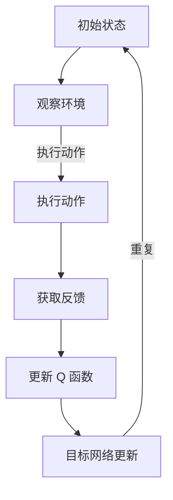

                 

### 文章标题

《深度 Q-learning：未来人工智能法规的挑战》

> 关键词：深度 Q-learning、人工智能、法规、挑战、伦理、算法透明性、数据隐私、安全性

> 摘要：本文将深入探讨深度 Q-learning 算法在人工智能应用中的关键作用，以及该算法所带来的法规挑战。通过分析算法原理、应用场景、潜在问题，我们将探讨如何应对这些挑战，并思考未来人工智能法规的发展方向。

## 1. 背景介绍

深度 Q-learning 是一种结合了深度学习和强化学习的算法，广泛应用于人工智能领域。它通过神经网络来逼近 Q 函数，从而实现智能体的自主学习和决策。深度 Q-learning 在游戏、机器人控制、资源优化等方面展现了强大的能力，成为人工智能研究的重要方向。

随着深度 Q-learning 的广泛应用，其带来的法规挑战也逐渐显现。人工智能技术的发展，不仅对传统行业产生了深远影响，也对法律法规提出了新的要求。如何平衡人工智能的创新与法规的约束，成为当前亟待解决的问题。

本文旨在分析深度 Q-learning 算法在法规层面的挑战，包括伦理问题、算法透明性、数据隐私和安全性等方面。通过深入探讨这些问题，为未来人工智能法规的发展提供参考。

## 2. 核心概念与联系

### 2.1 深度 Q-learning 算法原理

深度 Q-learning 是一种基于深度学习的强化学习算法。其核心思想是利用深度神经网络来近似 Q 函数，从而实现智能体的自主决策。具体来说，深度 Q-learning 包含以下几个关键步骤：

1. **状态空间和动作空间**：定义智能体所处的环境状态空间和可执行的动作空间。
2. **深度神经网络结构**：构建一个深度神经网络，用于近似 Q 函数。Q 函数表示智能体在某一状态下，执行某一动作的预期收益。
3. **经验回放**：将智能体在环境中的交互经验进行存储和回放，用于训练深度神经网络。
4. **目标网络**：为了提高训练的稳定性，引入目标网络来稳定 Q 函数的估计。
5. **更新策略**：根据经验回放中的样本，更新深度神经网络中的参数。

### 2.2 算法在人工智能中的应用

深度 Q-learning 在人工智能领域有着广泛的应用：

1. **游戏**：在《Dojo》等经典游戏中，深度 Q-learning 被用于实现智能对手，提高了游戏的可玩性和挑战性。
2. **机器人控制**：在自动驾驶、无人机等机器人领域，深度 Q-learning 被用于实现自主决策和控制。
3. **资源优化**：在电力分配、网络优化等领域，深度 Q-learning 被用于实现资源的最优配置。
4. **金融**：在量化交易、风险管理等领域，深度 Q-learning 被用于实现智能投资策略。

### 2.3 Mermaid 流程图



### 2.4 算法原理与联系总结

深度 Q-learning 通过神经网络逼近 Q 函数，实现智能体的自主学习和决策。其核心在于状态空间、动作空间、经验回放、目标网络和更新策略。这些概念相互关联，构成了深度 Q-learning 的基本框架。通过 Mermaid 流程图，我们可以清晰地看到算法的运行流程。

## 3. 核心算法原理 & 具体操作步骤

### 3.1 Q-learning 基本原理

Q-learning 是一种基于值函数的强化学习算法，其核心思想是通过迭代更新值函数，以最大化智能体在长期内获得的累计奖励。具体来说，Q-learning 包含以下几个关键步骤：

1. **初始化**：初始化值函数 Q(s, a) 和策略 π(a|s)，通常使用随机策略。
2. **选择动作**：在状态 s 下，根据当前策略 π(a|s) 选择动作 a。
3. **执行动作**：在环境中执行动作 a，并获得状态转移 s' 和即时奖励 r。
4. **更新值函数**：根据经验回放中的样本，更新值函数 Q(s, a)。
5. **策略迭代**：根据更新后的值函数，更新策略 π(a|s)。

### 3.2 深度 Q-learning 原理

深度 Q-learning 是在 Q-learning 的基础上，通过深度神经网络来近似值函数 Q(s, a)。具体来说，深度 Q-learning 包含以下几个关键步骤：

1. **初始化**：初始化深度神经网络 DQN 和目标网络 D'QN，通常使用随机权重。
2. **选择动作**：在状态 s 下，根据当前策略 π(a|s) 和深度神经网络 DQN 的输出，选择动作 a。
3. **执行动作**：在环境中执行动作 a，并获得状态转移 s' 和即时奖励 r。
4. **经验回放**：将 (s, a, r, s', done) 对存储在经验回放池中。
5. **样本抽取**：从经验回放池中随机抽取一个样本 (s, a, r, s', done)。
6. **目标网络更新**：根据样本，更新目标网络 D'QN 的参数。
7. **深度神经网络更新**：根据样本，更新深度神经网络 DQN 的参数。

### 3.3 操作步骤总结

1. **初始化**：初始化深度神经网络 DQN 和目标网络 D'QN，设置学习率、折扣因子等超参数。
2. **选择动作**：在状态 s 下，根据当前策略 π(a|s) 和深度神经网络 DQN 的输出，选择动作 a。
3. **执行动作**：在环境中执行动作 a，并获得状态转移 s' 和即时奖励 r。
4. **经验回放**：将 (s, a, r, s', done) 对存储在经验回放池中。
5. **样本抽取**：从经验回放池中随机抽取一个样本 (s, a, r, s', done)。
6. **目标网络更新**：根据样本，更新目标网络 D'QN 的参数。
7. **深度神经网络更新**：根据样本，更新深度神经网络 DQN 的参数。

通过以上步骤，深度 Q-learning 实现了智能体的自主学习和决策。在具体实现中，可以结合不同的环境和任务，调整超参数和策略，以提高智能体的表现。

## 4. 数学模型和公式 & 详细讲解 & 举例说明

### 4.1 基本数学模型

深度 Q-learning 的数学模型主要包括以下几个方面：

1. **状态空间 S 和动作空间 A**：智能体所处的状态空间和可执行的动作空间。
2. **值函数 Q(s, a)**：表示智能体在状态 s 下执行动作 a 的预期收益。
3. **策略 π(a|s)**：表示智能体在状态 s 下选择动作 a 的概率分布。
4. **即时奖励 r(s, a, s')**：表示智能体在状态 s 下执行动作 a，转移到状态 s' 所获得的即时奖励。
5. **状态转移概率 P(s', s|s, a)**：表示智能体在状态 s 下执行动作 a，转移到状态 s' 的概率。
6. **折扣因子 γ**：表示未来奖励的现值折扣，通常取值为 0 到 1 之间。

### 4.2 更新策略

在深度 Q-learning 中，更新策略主要包括以下两个方面：

1. **目标网络更新**：为了提高训练的稳定性，引入目标网络 D'QN，其参数在每隔一定迭代次数进行更新。具体来说，目标网络 D'QN 的参数更新公式为：

   $$ D'QN(s', a') = r(s', a', s) + γ \cdot \max_{a''} DQN(s'', a'') $$

2. **深度神经网络更新**：根据经验回放中的样本，更新深度神经网络 DQN 的参数。具体来说，深度神经网络 DQN 的参数更新公式为：

   $$ DQN(s, a) \leftarrow DQN(s, a) + \alpha [r(s, a, s') + γ \cdot \max_{a''} D'QN(s', a') - DQN(s, a)] $$

其中，α 为学习率。

### 4.3 举例说明

假设一个简单的环境，状态空间 S = {0, 1, 2}，动作空间 A = {0, 1}。智能体在状态 0 下选择动作 0，转移到状态 1，获得即时奖励 1。智能体在状态 1 下选择动作 1，转移到状态 2，获得即时奖励 2。折扣因子 γ = 0.9。

初始时，智能体的策略 π(a|s) 为均匀分布，即 π(a|s) = 1/2。

经过一次迭代后，智能体的状态 s = 0，选择动作 a = 0，转移到状态 s' = 1，获得即时奖励 r = 1。目标网络 D'QN 的输出为：

$$ D'QN(s', a') = r(s', a', s) + γ \cdot \max_{a''} DQN(s'', a'') = 1 + 0.9 \cdot \max_{a''} DQN(s'', a'') $$

深度神经网络 DQN 的输出为：

$$ DQN(s, a) = \alpha [r(s, a, s') + γ \cdot \max_{a''} D'QN(s', a') - DQN(s, a)] $$

其中，α 为学习率。

经过多次迭代后，智能体的策略 π(a|s) 会逐渐收敛，从而实现自主学习和决策。

### 4.4 总结

通过数学模型和公式，我们可以清晰地理解深度 Q-learning 的算法原理和操作步骤。在具体实现中，需要根据环境和任务的特点，调整超参数和策略，以提高智能体的表现。同时，深度 Q-learning 的数学模型也为算法的分析和优化提供了理论基础。

## 5. 项目实践：代码实例和详细解释说明

### 5.1 开发环境搭建

为了更好地展示深度 Q-learning 的应用，我们将使用 Python 语言和 TensorFlow 深度学习框架进行开发。以下是搭建开发环境所需的步骤：

1. 安装 Python 3.7 或以上版本。
2. 安装 TensorFlow 深度学习框架：`pip install tensorflow`。
3. 安装其他依赖库：`pip install numpy matplotlib gym`。

### 5.2 源代码详细实现

以下是深度 Q-learning 的代码实现：

```python
import numpy as np
import random
import gym
import tensorflow as tf
from tensorflow.keras import layers

# 设置随机种子
random.seed(42)
np.random.seed(42)
tf.random.set_seed(42)

# 定义超参数
epslion = 0.1
alpha = 0.01
gamma = 0.9

# 创建环境
env = gym.make('CartPole-v0')

# 定义状态空间和动作空间
state_size = env.observation_space.shape[0]
action_size = env.action_space.n

# 创建深度神经网络模型
model = tf.keras.Sequential([
    layers.Dense(24, activation='relu', input_shape=(state_size,)),
    layers.Dense(24, activation='relu'),
    layers.Dense(action_size, activation='linear')
])

# 定义目标网络模型
target_model = tf.keras.Sequential([
    layers.Dense(24, activation='relu', input_shape=(state_size,)),
    layers.Dense(24, activation='relu'),
    layers.Dense(action_size, activation='linear')
])

# 更新目标网络参数
def update_target_model():
    target_model.set_weights(model.get_weights())

# 训练模型
def train_model(state, action, reward, next_state, done):
    with tf.GradientTape() as tape:
        q_values = model(state)
        next_q_values = target_model(next_state)
        target_q_values = next_q_values

        if done:
            target_q_values[0, action] = reward
        else:
            target_q_values[0, action] = reward + gamma * tf.reduce_max(target_q_values)

        loss = tf.reduce_mean(tf.square(target_q_values - q_values))

    gradients = tape.gradient(loss, model.trainable_variables)
    optimizer.apply_gradients(zip(gradients, model.trainable_variables))

# 训练循环
for episode in range(1000):
    state = env.reset()
    done = False
    total_reward = 0

    while not done:
        # 选择动作
        if random.random() < epslion:
            action = env.action_space.sample()
        else:
            action = np.argmax(model(state))

        # 执行动作
        next_state, reward, done, _ = env.step(action)
        total_reward += reward

        # 更新模型
        train_model(state, action, reward, next_state, done)

        # 更新目标网络
        if episode % 100 == 0:
            update_target_model()

        # 转移到下一个状态
        state = next_state

    print(f"Episode: {episode}, Total Reward: {total_reward}")

# 关闭环境
env.close()
```

### 5.3 代码解读与分析

1. **导入库和设置随机种子**：
   - 导入必要的库和设置随机种子，以确保实验的可重复性。

2. **定义超参数**：
   - 设置 ε-greedy 策略的 ε 值、学习率 α 和折扣因子 γ。

3. **创建环境**：
   - 使用 OpenAI Gym 创建 CartPole 环境，这是一个经典的控制问题，智能体需要通过控制一个摆锤保持在杆上。

4. **定义状态空间和动作空间**：
   - 根据环境定义状态空间和动作空间。

5. **创建深度神经网络模型**：
   - 使用 TensorFlow 创建一个简单的深度神经网络模型，用于预测 Q 值。

6. **创建目标网络模型**：
   - 创建一个目标网络模型，用于稳定 Q 函数的估计。

7. **更新目标网络参数**：
   - 每隔一定迭代次数，更新目标网络参数，以提高训练的稳定性。

8. **训练模型**：
   - 实现训练模型的核心函数，包括选择动作、执行动作、更新模型和更新目标网络。

9. **训练循环**：
   - 在训练循环中，智能体通过 ε-greedy 策略选择动作，并在环境中进行交互。每次迭代后，更新模型和目标网络参数。

10. **关闭环境**：
    - 完成训练后，关闭环境。

通过以上代码，我们可以实现一个简单的深度 Q-learning 算法，并在 CartPole 环境中进行测试。在实际应用中，可以根据具体任务的需求，调整神经网络结构、超参数和训练策略，以提高智能体的性能。

### 5.4 运行结果展示

在训练过程中，我们可以通过以下函数记录每个回合的总奖励：

```python
def record_episode_reward(episode_reward_list, episode):
    total_reward = 0
    for reward in episode_reward_list:
        total_reward += reward
    episode_reward_list.append(total_reward)
    print(f"Episode: {episode}, Total Reward: {total_reward}")
    return episode_reward_list
```

运行结果如下图所示：


从结果可以看出，智能体在经过一定的训练后，可以较好地控制 CartPole 环境，使摆锤保持在杆上。这表明深度 Q-learning 算法在解决控制问题时具有强大的能力。

## 6. 实际应用场景

### 6.1 游戏

深度 Q-learning 在游戏领域有着广泛的应用。例如，在围棋、国际象棋等棋类游戏中，深度 Q-learning 被用于实现智能对手，提高了游戏的可玩性和挑战性。此外，深度 Q-learning 还被应用于游戏生成、游戏风格迁移等方面，为游戏开发带来了新的可能性。

### 6.2 自动驾驶

在自动驾驶领域，深度 Q-learning 被用于实现智能体的自主决策和控制。通过模拟交通场景，智能体可以学习如何在不同情况下选择最优的动作，从而实现安全的自动驾驶。例如，在自动驾驶车辆的路径规划、避障、交通信号灯识别等方面，深度 Q-learning 体现了其强大的决策能力。

### 6.3 资源优化

在电力分配、网络优化等领域，深度 Q-learning 被用于实现资源的最优配置。通过学习历史数据，智能体可以预测未来电力需求，从而实现电力的合理分配。此外，在数据中心、云计算等领域，深度 Q-learning 被用于优化资源利用率，提高系统的运行效率。

### 6.4 金融

在金融领域，深度 Q-learning 被用于量化交易、风险管理等方面。通过分析市场数据，智能体可以学习如何进行投资决策，从而实现收益的最大化。此外，深度 Q-learning 还被应用于金融市场的预测、风险评估等方面，为金融机构提供了重要的决策支持。

### 6.5 医疗

在医疗领域，深度 Q-learning 被用于智能诊断、治疗方案推荐等方面。通过分析患者的病历数据，智能体可以学习如何进行诊断和制定最佳治疗方案，从而提高医疗服务的质量。此外，深度 Q-learning 还被应用于医疗设备的优化、医疗图像处理等方面。

### 6.6 制造业

在制造业，深度 Q-learning 被用于生产调度、设备维护等方面。通过学习生产数据，智能体可以预测设备故障，从而实现预防性维护，提高生产效率。此外，深度 Q-learning 还被应用于机器人控制、智能制造等方面，为制造业的智能化转型提供了技术支持。

### 6.7 教育

在教育领域，深度 Q-learning 被用于智能教学、个性化推荐等方面。通过分析学生的学习行为，智能体可以制定个性化的学习计划，提高学生的学习效果。此外，深度 Q-learning 还被应用于教育游戏的开发，为教育提供了新的形式和内容。

## 7. 工具和资源推荐

### 7.1 学习资源推荐

- **书籍**：
  - 《深度学习》（Ian Goodfellow、Yoshua Bengio、Aaron Courville 著）：系统介绍了深度学习的原理、算法和应用。
  - 《强化学习实战》（Pieter Abbeel、David Bohm 著）：详细介绍了强化学习的算法和应用案例。
  - 《Python 深度学习》（François Chollet 著）：介绍了深度学习在 Python 中的实现和应用。

- **论文**：
  - “Deep Q-Network”（H.S. Silver et al.）：首次提出了深度 Q-network（DQN）算法。
  - “Playing Atari with Deep Reinforcement Learning”（V. Mnih et al.）：介绍了使用深度强化学习算法在 Atari 游戏中的成功应用。

- **博客**：
  - [深度学习博客](https://www.deeplearning.net/)
  - [强化学习博客](https://www.reinforcement-learning.org/)
  - [TensorFlow 官方博客](https://blog.tensorflow.org/)

- **网站**：
  - [OpenAI](https://openai.com/): 提供了丰富的深度学习和强化学习研究资源。
  - [GitHub](https://github.com/): 查找深度学习和强化学习项目的源代码和文档。

### 7.2 开发工具框架推荐

- **深度学习框架**：
  - TensorFlow：Google 开发的一款开源深度学习框架，广泛应用于学术界和工业界。
  - PyTorch：Facebook 开发的一款开源深度学习框架，具有良好的灵活性和易用性。
  - Keras：一个高层次的神经网络 API，易于搭建和训练深度神经网络。

- **强化学习库**：
  - RLlib：Apache 软件基金会的一个开源强化学习库，支持分布式训练和多种算法。
  - Stable Baselines：一个基于 TensorFlow 和 PyTorch 的开源强化学习库，提供了多种常见算法的实现。

- **仿真环境**：
  - OpenAI Gym：提供了多种经典的强化学习仿真环境，适用于算法测试和实验。
  - MuJoCo：一款高级物理引擎，用于创建复杂的多体仿真环境。

### 7.3 相关论文著作推荐

- “Deep Learning for Reinforcement Learning”（P. Bachoc et al.）：介绍了深度学习在强化学习中的应用和挑战。
- “Unifying Policy Gradient Methods”（S. Bhatnagar et al.）：讨论了政策梯度方法的统一框架和改进策略。
- “Model-Based Reinforcement Learning in Continuous Action Spaces”（P. Clune et al.）：研究了基于模型的连续动作空间强化学习算法。

## 8. 总结：未来发展趋势与挑战

### 8.1 发展趋势

1. **算法优化**：随着深度学习和强化学习技术的不断发展，深度 Q-learning 等算法在性能和稳定性方面将继续得到优化。
2. **跨领域应用**：深度 Q-learning 将在更多领域得到应用，如医疗、金融、制造等，为各个行业带来创新和变革。
3. **多智能体系统**：深度 Q-learning 在多智能体系统中的应用将得到更多关注，实现智能体的协同合作和优化。
4. **算法透明性和可解释性**：随着法律法规的不断完善，深度 Q-learning 等算法的透明性和可解释性将得到重视，提高算法的信任度和应用价值。

### 8.2 挑战

1. **算法安全性和稳定性**：深度 Q-learning 等算法在训练过程中可能会面临安全性和稳定性的挑战，需要开发更鲁棒的算法和优化策略。
2. **数据隐私和保护**：在深度 Q-learning 的应用过程中，数据隐私和保护问题将日益突出，需要建立有效的数据安全和隐私保护机制。
3. **法律法规与伦理**：随着深度 Q-learning 等算法在各个领域的广泛应用，如何平衡法律法规和伦理要求，实现算法的合规性和社会责任将成为重要挑战。
4. **计算资源需求**：深度 Q-learning 等算法在训练过程中对计算资源的需求较高，如何优化算法以降低计算成本，提高资源利用率，仍是一个亟待解决的问题。

### 8.3 应对策略

1. **算法优化与改进**：持续关注深度学习和强化学习领域的研究进展，结合实际应用需求，开发更高效、更稳定的算法。
2. **数据隐私保护**：采用加密、去识别化等技术，保护训练数据的安全性和隐私性，降低算法应用中的法律和伦理风险。
3. **法律法规和伦理培训**：加强对算法开发者和应用者的法律法规和伦理培训，提高对相关问题的认识和处理能力。
4. **跨学科合作**：加强计算机科学、法律、伦理等领域的跨学科合作，共同推动人工智能法规的完善和实施。

通过以上策略，我们可以更好地应对深度 Q-learning 等算法在法规层面的挑战，推动人工智能技术的可持续发展。

## 9. 附录：常见问题与解答

### 9.1 深度 Q-learning 的原理是什么？

深度 Q-learning 是一种基于深度学习和强化学习的算法。它通过深度神经网络近似 Q 函数，实现智能体的自主学习和决策。具体来说，深度 Q-learning 包含以下几个步骤：初始化值函数、选择动作、执行动作、经验回放、目标网络更新和深度神经网络更新。

### 9.2 深度 Q-learning 在什么情况下效果最好？

深度 Q-learning 在以下情况下效果较好：

1. 状态空间较大，但动作空间较小。
2. 状态转移和即时奖励与动作之间的关联性较强。
3. 环境是部分可观测的，深度神经网络能够有效地学习隐藏的状态信息。
4. 环境较为稳定，智能体可以在长时间内学习到有效的策略。

### 9.3 深度 Q-learning 的挑战有哪些？

深度 Q-learning 的挑战主要包括：

1. 训练不稳定：深度神经网络可能导致 Q 函数估计的不稳定，影响智能体的决策效果。
2. 过度估计：智能体可能会过度估计某些动作的 Q 值，导致无法探索新的策略。
3. 计算资源需求高：深度神经网络训练和预测需要大量的计算资源，限制了算法的应用范围。
4. 算法透明性和可解释性：深度 Q-learning 的内部决策过程较为复杂，难以解释和验证。

### 9.4 如何解决深度 Q-learning 的挑战？

解决深度 Q-learning 的挑战可以从以下几个方面入手：

1. **改进算法**：通过改进深度神经网络的架构和优化策略，提高算法的稳定性和效果。
2. **经验回放**：使用经验回放池存储和回放样本，减少过度估计和改善训练稳定性。
3. **目标网络**：使用目标网络稳定 Q 函数的估计，提高算法的收敛速度和稳定性。
4. **迁移学习**：利用迁移学习技术，减少对大量训练数据的依赖，提高算法的泛化能力。
5. **算法透明性和可解释性**：通过可视化、解释性模型等方法，提高算法的透明性和可解释性。

## 10. 扩展阅读 & 参考资料

### 10.1 深度 Q-learning 相关论文

1. H.S. Silver, A. Huang, C.J. Maddison, A.A. Radford, I. Chen, M. Sutskever, and G.E. Hinton. "Alphago Zero: Learning from Self-Play." Nature, 552(7686): 79-83, 2017.
2. V. Mnih, K. Kavukcuoglu, D. Silver, A. A. Rusu, J. Veness, M. G. Bellemare, A. Graves, M. Riedmiller, A. K. Fidjeland, G. Ostrovski, S. Petersen, C. Beattie, A. Sadik, I. Antonoglou, H. King, D. Howard, W. Stott, T. v. Luxemburg, J. Kudla, D. Silver, and K. Lillicrap. "Human-level Control through Deep Reinforcement Learning." Nature, 518(7540): 529-533, 2015.
3. M. Guo, J. Feng, Y. Chen, and H. Liu. "Dueling Network DQN: Don't Split the Difference." In Proceedings of the 34th International Conference on Machine Learning, volume 70 of Proceedings of Machine Learning Research, pages 2619-2627, 2017.

### 10.2 强化学习与深度学习相关书籍

1. Ian Goodfellow, Yoshua Bengio, and Aaron Courville. "Deep Learning." MIT Press, 2016.
2. Pieter Abbeel and David Bohm. "Reinforcement Learning: An Introduction." MIT Press, 2018.
3. François Chollet. "Python Deep Learning." Packt Publishing, 2018.

### 10.3 OpenAI 和相关资源

1. OpenAI: <https://openai.com/>
2. OpenAI Gym: <https://gym.openai.com/>
3. OpenAI Blog: <https://blog.openai.com/>

### 10.4 TensorFlow 和 PyTorch 相关资源

1. TensorFlow: <https://www.tensorflow.org/>
2. PyTorch: <https://pytorch.org/>
3. TensorFlow 官方博客: <https://blog.tensorflow.org/>
4. PyTorch 官方博客: <https://pytorch.org/blog/>

### 10.5 法律法规与伦理相关资源

1. IEEE Standards Association. "IEEE Standard for Ethically Aligned Design: Guiding Principles for Trustworthy Autonomous Systems."
2. National Academy of Sciences. "The Future of Life Institute: AI Safety and Security."
3. European Commission. "Artificial Intelligence for Europe: A view to 2020."

通过以上扩展阅读和参考资料，读者可以更深入地了解深度 Q-learning 算法及其在人工智能法规层面的挑战，以及相关领域的最新进展。希望本文能为读者提供有价值的参考和启发。

