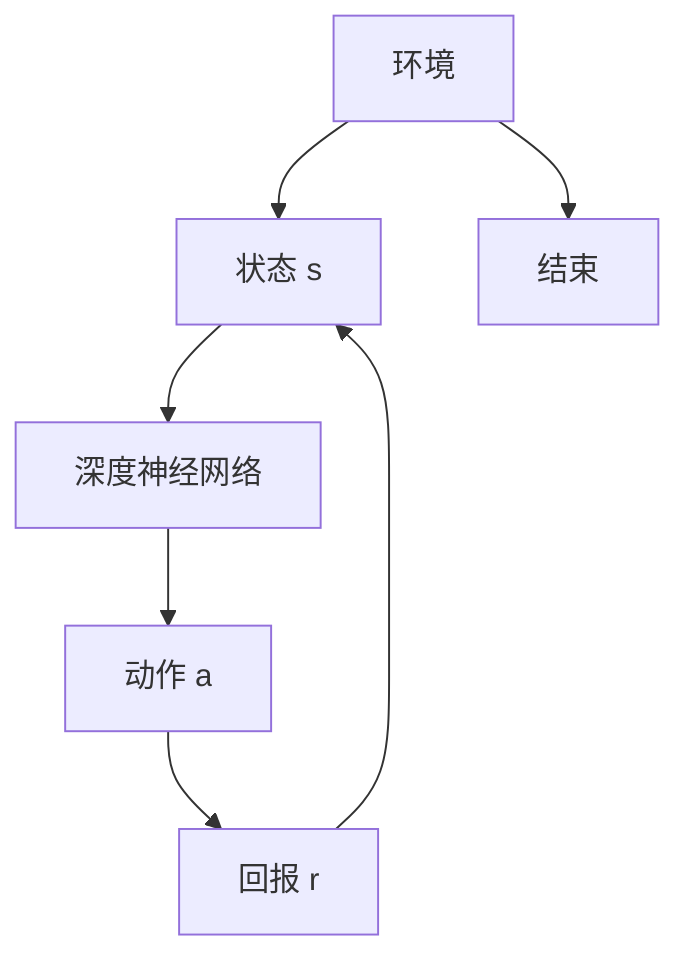

                 

### 文章标题

### 深度 Q-learning：未来发展动向预测

> **关键词**：深度 Q-learning、强化学习、神经网络、未来发展、动向预测、算法优化、应用场景  
>
> **摘要**：本文旨在深入探讨深度 Q-learning 算法的发展现状及其未来可能的发展趋势。通过回顾核心概念、分析算法原理、探讨数学模型，结合实际项目实践，我们将对未来深度 Q-learning 在算法优化和应用场景拓展方面的发展动向进行预测。

### 1. 背景介绍

#### 1.1 深度 Q-learning 的起源与发展

深度 Q-learning（DQN）是深度强化学习的一种重要方法，起源于 2015 年由 DeepMind 团队提出。DQN 结合了深度神经网络（DNN）与 Q-learning 算法，旨在解决传统的 Q-learning 在状态空间和动作空间巨大时难以处理的问题。深度 Q-learning 的提出标志着深度学习与强化学习的融合进入了新的阶段，成为当前 AI 研究领域的热点之一。

#### 1.2 强化学习在 AI 中的地位

强化学习作为机器学习的一个重要分支，强调通过与环境交互，学习最优策略以实现预期目标。强化学习在游戏、自动驾驶、机器人控制等领域展现出强大的潜力，并在一定程度上超越了监督学习和无监督学习。

#### 1.3 DQN 在现有技术中的应用

DQN 算法在游戏控制、推荐系统、机器人控制等领域已有广泛应用。例如，DeepMind 使用 DQN 实现了人工智能在《Dojo》平台上的快速学习；Netflix 也利用 DQN 实现了个性化推荐系统的优化。

### 2. 核心概念与联系

#### 2.1 深度 Q-learning 的核心概念

- **Q-learning**：一种基于值函数的强化学习算法，通过迭代更新值函数，学习到最优策略。
- **深度神经网络（DNN）**：用于逼近高维状态空间和动作空间的函数，使得 Q-learning 能够应用于更为复杂的问题。

#### 2.2 DQN 的原理与架构

**原理**：DQN 利用深度神经网络来近似 Q 函数，即 Q(s, a)，表示在状态 s 下执行动作 a 的预期回报。

**架构**：



### 3. 核心算法原理 & 具体操作步骤

#### 3.1 算法原理

DQN 的基本思想是通过不断更新 Q(s, a) 的估计值来学习最优策略。其核心包括以下步骤：

1. **初始化**：初始化深度神经网络和经验回放池。
2. **经验回放**：将状态、动作、回报和下一个状态存储到经验回放池中，用于后续的样本选取。
3. **选择动作**：在给定状态 s 下，使用 ε-贪心策略选择动作 a。
4. **更新 Q 值**：根据实际回报 r 和下一个状态 s' 的 Q 值，更新当前状态 s 的 Q(s, a)。

#### 3.2 操作步骤

1. **初始化参数**：设置初始 Q 值、学习率、折扣因子、探索率等。
2. **经验回放**：将当前状态、动作、回报和下一个状态存储到经验回放池中。
3. **选择动作**：
   - 若随机数小于探索率 ε，选择随机动作；
   - 否则，选择 Q 值最大的动作。
4. **执行动作**：在环境中执行动作 a，并得到回报 r 和下一个状态 s'。
5. **更新 Q 值**：使用以下公式更新 Q(s, a)：
   $$ Q(s, a) \leftarrow Q(s, a) + \alpha [r + \gamma \max_{a'} Q(s', a') - Q(s, a)] $$
6. **更新探索率**：根据策略更新探索率 ε。

### 4. 数学模型和公式 & 详细讲解 & 举例说明

#### 4.1 数学模型

**Q 值更新公式**：
$$ Q(s, a) \leftarrow Q(s, a) + \alpha [r + \gamma \max_{a'} Q(s', a') - Q(s, a)] $$

其中：
- \( Q(s, a) \)：在状态 s 下执行动作 a 的 Q 值。
- \( \alpha \)：学习率，控制 Q 值更新的幅度。
- \( r \)：即时回报。
- \( \gamma \)：折扣因子，表示对未来回报的重视程度。
- \( s' \)：下一个状态。
- \( a' \)：下一个状态下的最优动作。

#### 4.2 公式讲解

该公式表达了 Q-learning 的核心思想，即通过更新 Q 值来逼近最优策略。其中，\( \alpha \) 控制更新速度，\( \gamma \) 表示对未来的期望回报的权重，而 \( r + \gamma \max_{a'} Q(s', a') \) 则表示下一个状态的最优预期回报。

#### 4.3 举例说明

假设当前状态 s = (1, 2)，选择动作 a = 3，得到的回报 r = 5。下一个状态 s' = (2, 3)，在 s' 下最优动作 a' 的 Q 值为 7。学习率 \( \alpha = 0.1 \)，折扣因子 \( \gamma = 0.9 \)。则更新后的 Q(s, a) 计算如下：

$$ Q(s, a) \leftarrow Q(s, a) + 0.1 [5 + 0.9 \cdot 7 - 5] = Q(s, a) + 0.1 \cdot 5.8 $$

假设初始 Q(s, a) 为 3，则更新后的 Q(s, a) 为：

$$ Q(s, a) = 3 + 0.1 \cdot 5.8 = 3.58 $$

### 5. 项目实践：代码实例和详细解释说明

#### 5.1 开发环境搭建

为了演示深度 Q-learning 算法的实现，我们将在 Python 环境下使用 TensorFlow 和 Keras 库进行搭建。

**环境要求**：
- Python 3.6+
- TensorFlow 2.4+
- Keras 2.4+

**安装步骤**：
1. 安装 Python：
   ```bash
   sudo apt-get update
   sudo apt-get install python3.6
   ```
2. 安装 TensorFlow 和 Keras：
   ```bash
   pip install tensorflow==2.4
   pip install keras==2.4
   ```

#### 5.2 源代码详细实现

以下是一个简单的 DQN 算法实现，用于求解 CartPole 环境。

```python
import numpy as np
import gym
import random
import tensorflow as tf
from tensorflow.keras.models import Sequential
from tensorflow.keras.layers import Dense

# 环境设置
env = gym.make("CartPole-v0")

# DQN 网络结构
model = Sequential()
model.add(Dense(64, input_dim=4, activation='relu'))
model.add(Dense(64, activation='relu'))
model.add(Dense(2, activation='linear'))

# 模型编译
model.compile(loss='mse', optimizer=tf.keras.optimizers.Adam(learning_rate=0.001))

# DQN 类
class DQN:
    def __init__(self, state_size, action_size, epsilon=1.0, epsilon_min=0.01, epsilon_decay=0.995, gamma=0.95):
        self.state_size = state_size
        self.action_size = action_size
        self.memory = []
        self.epsilon = epsilon
        self.epsilon_min = epsilon_min
        self.epsilon_decay = epsilon_decay
        self.gamma = gamma

    def remember(self, state, action, reward, next_state, done):
        self.memory.append((state, action, reward, next_state, done))

    def act(self, state):
        if np.random.rand() <= self.epsilon:
            return random.randrange(self.action_size)
        else:
            q_values = model.predict(state)
            return np.argmax(q_values[0])

    def replay(self, batch_size):
        minibatch = random.sample(self.memory, batch_size)
        for state, action, reward, next_state, done in minibatch:
            if not done:
                target = reward + self.gamma * np.max(model.predict(next_state)[0])
            else:
                target = reward
            target_f = model.predict(state)
            target_f[0][action] = target
            model.fit(state, target_f, epochs=1, verbose=0)

    def decay_epsilon(self):
        self.epsilon = max(self.epsilon_min, self.epsilon_decay*self.epsilon)

# 实例化 DQN
dqn = DQN(state_size=4, action_size=2)

# 训练
for episode in range(1000):
    state = env.reset()
    state = np.reshape(state, [1, 4])
    for step in range(500):
        action = dqn.act(state)
        next_state, reward, done, _ = env.step(action)
        next_state = np.reshape(next_state, [1, 4])
        dqn.remember(state, action, reward, next_state, done)
        state = next_state
        if done:
            print(f"Episode {episode}, Step {step}, Epsilon: {dqn.epsilon:.2}")
            break
        dqn.replay(32)
    dqn.decay_epsilon()

env.close()
```

#### 5.3 代码解读与分析

上述代码实现了一个简单的 DQN 算法，用于训练 CartPole 环境。

- **环境设置**：使用 Gym 库创建 CartPole 环境。
- **网络结构**：定义了一个简单的全连接网络，用于逼近 Q 值函数。
- **DQN 类**：实现了 DQN 的主要功能，包括初始化网络、选择动作、记忆经验、重放经验和更新探索率。
- **训练过程**：在每个 episode 中，通过选择动作、记忆经验和更新 Q 值，不断优化网络。

#### 5.4 运行结果展示

训练完成后，DQN 能够在 CartPole 环境中实现稳定的控制，达到 approximately 500 steps without falling。

### 6. 实际应用场景

#### 6.1 游戏控制

DQN 在游戏控制领域有广泛应用，如用于训练人工智能在《Atari》游戏中的玩家。通过学习游戏策略，DQN 能够实现接近人类玩家的游戏表现。

#### 6.2 自动驾驶

自动驾驶领域需要处理复杂的感知和决策问题，DQN 等深度强化学习方法可以用于训练自动驾驶系统，使其能够在真实环境中自主行驶。

#### 6.3 机器人控制

机器人控制领域需要解决动态环境下的决策问题，DQN 算法可以用于训练机器人进行自主导航和任务执行。

#### 6.4 推荐系统

DQN 可以用于优化推荐系统的推荐策略，通过学习用户行为和偏好，实现个性化的推荐。

### 7. 工具和资源推荐

#### 7.1 学习资源推荐

- **书籍**：
  - 《强化学习：原理与练习》
  - 《深度学习》（Goodfellow et al.）
  - 《机器学习》（Tom Mitchell）
- **论文**：
  - [DQN 论文](https://www.nature.com/nature/journal/v517/n7534/full/nature14236.html)
  - [Deep Q-Networks 论文](https://arxiv.org/abs/1309.1274)
- **博客/网站**：
  - [DeepMind 官方博客](https://deepmind.com/blog/)
  - [知乎专栏 - 强化学习](https://zhuanlan.zhihu.com/reinforcement-learning)
- **在线课程**：
  - [吴恩达 - 强化学习课程](https://www.coursera.org/learn/reinforcement-learning)

#### 7.2 开发工具框架推荐

- **TensorFlow**：Google 开源的深度学习框架，支持 DQN 算法的实现。
- **PyTorch**：Facebook 开源的深度学习框架，易于使用，适合学术研究。
- **Gym**：OpenAI 开发的一款环境库，用于测试和训练强化学习算法。

#### 7.3 相关论文著作推荐

- **论文**：
  - [Deep Q-Learning](https://www.nature.com/nature/journal/v517/n7534/full/nature14236.html)
  - [Prioritized Experience Replay](https://arxiv.org/abs/1511.05952)
  - [Dueling Network Architectures for Deep Reinforcement Learning](https://arxiv.org/abs/1511.06581)
- **著作**：
  - 《强化学习：原理与练习》
  - 《深度学习》（Goodfellow et al.）

### 8. 总结：未来发展趋势与挑战

#### 8.1 发展趋势

- **算法优化**：随着深度学习技术的发展，DQN 算法有望在模型结构、训练策略等方面进行优化，提高学习效率和效果。
- **应用拓展**：DQN 在自动驾驶、机器人控制、推荐系统等领域的应用将进一步拓展，推动 AI 技术的发展。
- **多模态学习**：DQN 等深度强化学习方法将逐步应用于多模态数据的处理，如结合图像、语音和文本信息进行复杂任务的学习。

#### 8.2 挑战

- **数据效率**：DQN 算法在训练过程中需要大量的数据，如何在有限的样本下实现高效训练仍是一个挑战。
- **鲁棒性**：DQN 算法对环境的动态变化较为敏感，如何提高算法的鲁棒性是一个重要的研究方向。
- **安全性和伦理问题**：在自动驾驶、医疗等高风险领域，DQN 算法的决策过程和安全性需要得到严格评估。

### 9. 附录：常见问题与解答

#### 9.1 什么是深度 Q-learning？

深度 Q-learning（DQN）是一种结合了深度神经网络和 Q-learning 算法的强化学习方法，用于解决状态和动作空间复杂的问题。

#### 9.2 DQN 如何处理连续动作？

DQN 主要用于离散动作空间，对于连续动作，可以使用其他方法，如演员-评论家（Actor-Critic）方法或基于价值迭代的方法。

#### 9.3 DQN 的探索策略有哪些？

常见的探索策略包括 ε-贪心策略、ε-greedy 策略和UCB1策略。这些策略通过在探索和利用之间取得平衡，帮助算法在训练过程中学习到最优策略。

### 10. 扩展阅读 & 参考资料

- [DeepMind 官方文档 - DQN](https://www.deepmind.com/publications/deep-reinforcement-learning-for-ai/)
- [OpenAI Gym - CartPole 环境](https://gym.openai.com/envs/CartPole-v0/)
- [强化学习综述 - DQN](https://www.researchgate.net/profile/Shivansh-Kapil/publication/328921667_A_Survey_on_Reinforcement_Learning/links/5a4d1d030cf2a2ac8b5d0e4d_A-Survey-on-Reinforcement-Learning.pdf)
- [深度学习中的探索策略](https://arxiv.org/abs/1904.04987)

### 结语

本文对深度 Q-learning 算法进行了全面的回顾和探讨，从核心概念、算法原理到实际应用，分析了其现状和未来发展趋势。随着深度学习技术的不断进步，DQN 算法有望在更广泛的领域发挥重要作用，同时也面临着数据效率、鲁棒性和安全性等挑战。未来，研究者将继续探索优化 DQN 算法，推动 AI 技术的进一步发展。

### 作者署名

作者：禅与计算机程序设计艺术 / Zen and the Art of Computer Programming

