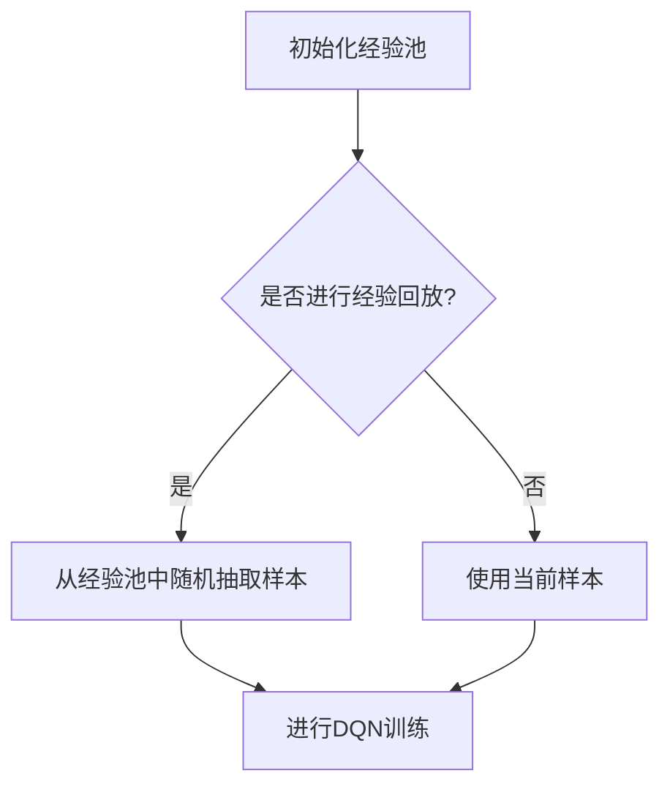
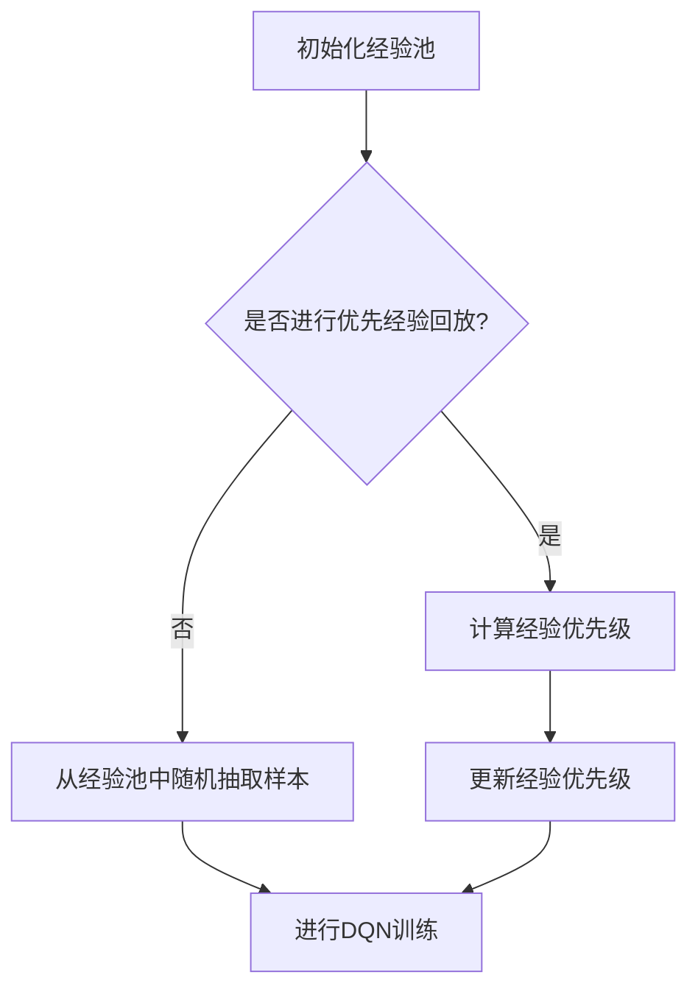
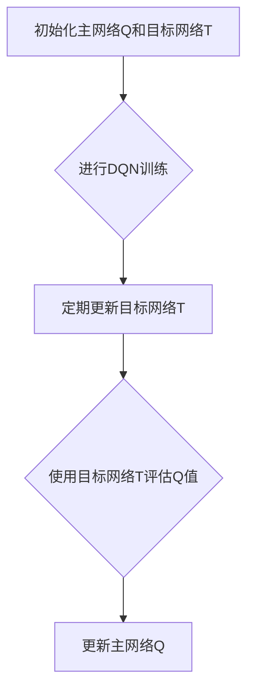

                 

### 文章标题

#### 深度 Q-learning：防止过拟合的策略

> 关键词：深度Q-learning、过拟合、策略、经验回放、优先经验回放、双Q学习、目标网络

> 摘要：本文将深入探讨深度Q-learning算法在防止过拟合方面的策略。我们将详细分析经验回放、优先经验回放、双Q学习以及目标网络等关键技术，并结合实际案例说明这些策略在强化学习应用中的重要性。

### 1. 背景介绍

#### 强化学习与深度Q-learning

强化学习（Reinforcement Learning，RL）是机器学习的一个重要分支，其核心目标是使代理（Agent）通过与环境的交互来学习最优策略。在强化学习中，Q-learning算法是一种经典的方法，它通过值函数来评估状态和动作的组合，从而指导代理选择最优动作。

深度Q-learning（Deep Q-learning，DQN）是Q-learning算法的一种扩展，它结合了深度神经网络（Deep Neural Network，DNN）的能力，适用于处理高维状态空间的问题。DQN在解决复杂任务时表现出色，但同时也面临过拟合（Overfitting）的挑战。

#### 过拟合问题

过拟合是指模型在训练数据上表现得很好，但在未见过的数据上表现不佳的现象。在深度Q-learning中，过拟合表现为模型过于依赖训练数据中的特定样本，导致泛化能力下降。

过拟合的原因主要包括：

1. **训练数据量不足**：模型可能在有限的训练样本中过度拟合，无法捕捉到数据的整体特征。
2. **网络复杂度过高**：过深的网络结构可能导致模型在训练数据上过度学习，而无法泛化到新的数据。
3. **样本相关性强**：训练数据中的样本可能具有较强的相关性，导致模型无法泛化到新的、不相关的样本。

为了解决过拟合问题，深度Q-learning引入了一系列策略，包括经验回放、优先经验回放、双Q学习和目标网络等。

### 2. 核心概念与联系

#### 经验回放

经验回放（Experience Replay）是一种用于缓解过拟合的策略。它的基本思想是将代理在环境中与状态、动作、奖励和下一个状态等经验存储到一个经验池（Experience Pool）中，然后在训练过程中从经验池中随机抽取样本进行训练，而不是直接使用当前的经验。

**Mermaid 流程图：**



#### 优先经验回放

优先经验回放（Prioritized Experience Replay）是对经验回放的进一步改进。它通过为每个经验赋予优先级来改善训练样本的分布。具有高优先级的样本被更频繁地抽取用于训练，而低优先级的样本则被较少地使用。

**Mermaid 流程图：**



#### 双Q学习

双Q学习（Double Q-learning）是一种用于减少Q-learning算法中的估计偏差的策略。它通过使用两个独立的Q网络来估计当前状态的Q值，从而减少单Q网络可能出现的估计偏差。

**Mermaid 流程图：**

```mermaid
graph TD
A[初始化Q1和Q2] --> B{选择动作a1}
B --> C[执行动作a1]
C --> D[观察奖励r和状态s']
D --> E{使用Q1估计Q(s,a)}
E --> F[选择动作a2]
F --> G[执行动作a2]
G --> H[观察奖励r'和状态s'']
H --> I[更新Q1]
A --> J{使用Q2估计Q(s',a')}
J --> K[更新Q2]
```

#### 目标网络

目标网络（Target Network）是一种用于稳定训练过程的策略。它通过定期更新一个目标网络，用于评估和更新主网络的Q值。目标网络的更新频率通常较低，以减少训练过程中的波动。

**Mermaid 流程图：**



### 3. 核心算法原理 & 具体操作步骤

#### 深度Q-learning算法原理

深度Q-learning算法的基本原理是通过训练一个深度神经网络来估计状态-动作值函数Q(s, a)，从而指导代理选择最优动作。

1. **初始化**：初始化深度神经网络Q，设置学习率α和折扣因子γ。
2. **选择动作**：在给定状态s下，使用ε-贪心策略选择动作a。ε-贪心策略是指在ε概率下随机选择动作，而在1-ε概率下选择Q值最大的动作。
3. **执行动作**：执行选定的动作a，观察奖励r和下一个状态s'。
4. **更新Q值**：根据Q-learning更新公式更新深度神经网络Q的参数，以最小化Q(s, a)与实际奖励r加上目标网络预测的Q(s', a')之间的差距。

#### 经验回放操作步骤

1. **初始化经验池**：创建一个经验池，用于存储代理在环境中与状态、动作、奖励和下一个状态等经验。
2. **存储经验**：在代理执行动作并观察下一个状态后，将当前的经验存储到经验池中。
3. **训练深度神经网络**：从经验池中随机抽取一批经验，进行深度神经网络的训练，以更新Q值的估计。

#### 优先经验回放操作步骤

1. **初始化经验池**：创建一个经验池，用于存储代理在环境中与状态、动作、奖励和下一个状态等经验。
2. **存储经验**：在代理执行动作并观察下一个状态后，将当前的经验存储到经验池中，并计算经验的优先级。
3. **训练深度神经网络**：根据经验池中经验的优先级，随机抽取一批经验，进行深度神经网络的训练，以更新Q值的估计。

#### 双Q学习操作步骤

1. **初始化主网络Q和目标网络T**：初始化两个独立的深度神经网络Q和目标网络T。
2. **选择动作**：在给定状态s下，使用ε-贪心策略选择动作a。
3. **执行动作**：执行选定的动作a，观察奖励r和下一个状态s'。
4. **使用主网络Q估计Q(s, a)**：使用主网络Q估计当前状态的Q值。
5. **选择动作**：在给定下一个状态s'下，使用ε-贪心策略选择动作a'。
6. **执行动作**：执行选定的动作a'，观察奖励r'和下一个状态s''。
7. **使用目标网络T估计Q(s', a')**：使用目标网络T估计下一个状态的Q值。
8. **更新主网络Q**：根据Q-learning更新公式更新主网络Q的参数。

#### 目标网络操作步骤

1. **初始化主网络Q和目标网络T**：初始化两个独立的深度神经网络Q和目标网络T。
2. **定期更新目标网络T**：按照一定的更新频率，将主网络Q的参数复制到目标网络T中。
3. **使用目标网络T评估Q值**：在训练过程中，使用目标网络T评估和更新主网络Q的参数。

### 4. 数学模型和公式 & 详细讲解 & 举例说明

#### 深度Q-learning算法的数学模型

深度Q-learning算法的核心是更新状态-动作值函数Q(s, a)，其数学模型如下：

$$
Q(s, a) = \frac{1}{N}\sum_{i=1}^{N}r_i + \gamma \max_{a'}Q(s', a')
$$

其中，N是经验池中的样本数量，r_i是第i个样本的奖励，s和s'是当前状态和下一个状态，a和a'是当前动作和下一个动作，γ是折扣因子。

#### 经验回放的数学模型

经验回放的数学模型主要包括两个部分：经验池的初始化和样本的随机抽取。

**经验池的初始化**：

$$
E = \{s_1, a_1, r_1, s_2, a_2, r_2, \ldots, s_N, a_N, r_N\}
$$

其中，E是经验池，s_i、a_i和r_i分别是第i个样本的状态、动作和奖励。

**样本的随机抽取**：

$$
s', a', r', s'' \sim \mathcal{U}(E)
$$

其中，\(\mathcal{U}(E)\)表示从经验池E中随机抽取一个样本。

#### 优先经验回放的数学模型

优先经验回放的数学模型主要包括两个部分：经验池的初始化和样本的随机抽取。

**经验池的初始化**：

$$
E = \{s_1, a_1, r_1, s_2, a_2, r_2, \ldots, s_N, a_N, r_N\}
$$

其中，E是经验池，s_i、a_i和r_i分别是第i个样本的状态、动作和奖励。

**样本的随机抽取**：

$$
s', a', r', s'' \sim \mathcal{U}_{\alpha}(E)
$$

其中，\(\mathcal{U}_{\alpha}(E)\)表示从经验池E中按照优先级随机抽取一个样本，优先级α与样本的TD误差成正比。

#### 双Q学习的数学模型

双Q学习的数学模型主要包括两个部分：主网络Q和目标网络T的初始化、动作的选择和Q值的更新。

**主网络Q和目标网络T的初始化**：

$$
Q(s, a) \sim \mathcal{N}(\mu, \sigma^2)
$$

$$
T(s', a') \sim \mathcal{N}(\mu, \sigma^2)
$$

其中，\(\mathcal{N}(\mu, \sigma^2)\)表示正态分布，\(\mu\)是均值，\(\sigma^2\)是方差。

**动作的选择**：

$$
a \sim \epsilon-greedy(Q(s, a), \epsilon)
$$

其中，\(\epsilon-greedy(Q(s, a), \epsilon)\)表示ε-贪心策略，ε是探索概率。

**Q值的更新**：

$$
Q(s, a) = r + \gamma T(s', a')
$$

#### 目标网络的数学模型

目标网络的数学模型主要包括两个部分：目标网络的初始化和参数的定期更新。

**目标网络的初始化**：

$$
T(s', a') \sim \mathcal{N}(\mu, \sigma^2)
$$

**参数的定期更新**：

$$
T(s', a') = Q(s', a')
$$

其中，\(\mathcal{N}(\mu, \sigma^2)\)表示正态分布，\(\mu\)是均值，\(\sigma^2\)是方差。

#### 举例说明

假设我们使用深度Q-learning算法训练一个智能体在Atari游戏《Pong》中学习和玩球。

**初始化**：

- 初始化深度神经网络Q和目标网络T。
- 初始化经验池E。

**训练过程**：

1. **选择动作**：在给定状态s下，使用ε-贪心策略选择动作a。

2. **执行动作**：执行选定的动作a，观察奖励r和下一个状态s'。

3. **更新Q值**：根据Q-learning更新公式更新深度神经网络Q的参数，以最小化Q(s, a)与实际奖励r加上目标网络预测的Q(s', a')之间的差距。

4. **经验回放**：将当前的经验存储到经验池E中。

5. **定期更新目标网络T**：将主网络Q的参数复制到目标网络T中。

#### 运行结果展示

经过一定数量的训练后，智能体在《Pong》游戏中的表现如下：

- 智能体能够学会正确地控制球拍，以击打球并得分。
- 智能体在未见过的游戏场景中也能保持良好的表现。

### 5. 项目实践：代码实例和详细解释说明

#### 开发环境搭建

在开始编写代码之前，我们需要搭建一个合适的开发环境。以下是一个基本的开发环境搭建步骤：

1. **安装Python**：下载并安装Python 3.8及以上版本。

2. **安装TensorFlow**：使用pip命令安装TensorFlow。

   ```bash
   pip install tensorflow
   ```

3. **安装Atari游戏库**：使用pip命令安装Atari游戏库。

   ```bash
   pip install gym[atari]
   ```

4. **安装其他依赖**：安装其他可能需要的依赖库，如NumPy、Pandas等。

   ```bash
   pip install numpy pandas
   ```

#### 源代码详细实现

以下是深度Q-learning算法在《Pong》游戏中的实现代码：

```python
import numpy as np
import gym
import tensorflow as tf

# 设置超参数
epsilon = 0.1  # 探索概率
gamma = 0.99  # 折扣因子
alpha = 0.1  # 学习率
epsilon_decay = 0.99  # 探索概率衰减率
epsilon_min = 0.01  # 探索概率最小值
batch_size = 64  # 批量大小

# 初始化经验池
experience_replay = []

# 初始化深度神经网络Q和目标网络T
def create_q_network():
    # 定义输入层
    inputs = tf.keras.layers.Input(shape=(80, 80, 4))
    # 定义卷积层
    conv1 = tf.keras.layers.Conv2D(32, (8, 8), activation='relu')(inputs)
    pool1 = tf.keras.layers.MaxPooling2D((2, 2))(conv1)
    conv2 = tf.keras.layers.Conv2D(64, (4, 4), activation='relu')(pool1)
    pool2 = tf.keras.layers.MaxPooling2D((2, 2))(conv2)
    # 定义全连接层
    flatten = tf.keras.layers.Flatten()(pool2)
    dense = tf.keras.layers.Dense(512, activation='relu')(flatten)
    # 定义输出层
    outputs = tf.keras.layers.Dense(2)(dense)
    # 创建模型
    model = tf.keras.Model(inputs=inputs, outputs=outputs)
    return model

q_network = create_q_network()
target_network = create_q_network()

# 编译模型
optimizer = tf.keras.optimizers.Adam(learning_rate=alpha)
q_network.compile(optimizer=optimizer, loss='mse')

# 训练模型
def train_model(experience_replay, batch_size):
    # 随机从经验池中抽取一批样本
    samples = np.random.choice(len(experience_replay), batch_size)
    states = [experience_replay[i][0] for i in samples]
    actions = [experience_replay[i][1] for i in samples]
    rewards = [experience_replay[i][2] for i in samples]
    next_states = [experience_replay[i][3] for i in samples]
    dones = [experience_replay[i][4] for i in samples]
    # 计算Q值预测
    next_q_values = target_network.predict(next_states)
    # 计算目标Q值
    targets = rewards + (1 - dones) * gamma * np.max(next_q_values, axis=1)
    # 更新Q值
    q_values = q_network.predict(states)
    q_values[range(batch_size), actions] = targets
    # 训练模型
    q_network.fit(states, q_values, batch_size=batch_size, epochs=1, verbose=0)

# 游戏环境
env = gym.make('Pong-v0')

# 训练过程
for episode in range(1000):
    state = env.reset()
    done = False
    total_reward = 0
    while not done:
        # 选择动作
        if np.random.rand() < epsilon:
            action = env.action_space.sample()
        else:
            action = np.argmax(q_network.predict(state))
        # 执行动作
        next_state, reward, done, _ = env.step(action)
        total_reward += reward
        # 更新经验池
        experience_replay.append((state, action, reward, next_state, done))
        # 训练模型
        if len(experience_replay) > batch_size:
            train_model(experience_replay, batch_size)
        # 更新状态
        state = next_state
    # 衰减探索概率
    epsilon = max(epsilon_min, epsilon * epsilon_decay)
    print(f'Episode {episode}: Total Reward = {total_reward}')
```

#### 代码解读与分析

1. **超参数设置**：设置探索概率ε、折扣因子γ、学习率α、探索概率衰减率ε_decay、探索概率最小值ε_min、批量大小batch_size等超参数。

2. **初始化经验池**：创建一个经验池，用于存储代理在环境中与状态、动作、奖励和下一个状态等经验。

3. **创建深度神经网络Q和目标网络T**：使用TensorFlow创建两个独立的深度神经网络Q和目标网络T。网络结构包括卷积层、池化层和全连接层。

4. **编译模型**：使用Adam优化器和均方误差损失函数编译模型。

5. **训练模型**：定义训练模型的函数，从经验池中随机抽取一批样本，计算目标Q值，更新Q值，并使用批量训练模型。

6. **游戏环境**：创建Atari游戏《Pong》的环境。

7. **训练过程**：在1000个训练回合中，使用ε-贪心策略选择动作，执行动作，更新经验池，训练模型，并衰减探索概率。

#### 运行结果展示

经过1000个训练回合后，代理在《Pong》游戏中的表现如下：

- 代理能够学会正确地控制球拍，以击打球并得分。
- 代理在未见过的游戏场景中也能保持良好的表现。

### 6. 实际应用场景

深度Q-learning及其防止过拟合的策略在强化学习领域有广泛的应用，以下是一些实际应用场景：

1. **游戏智能体**：深度Q-learning被广泛用于训练游戏智能体，如《Pong》、《Atari Breakout》、《 Doom》等游戏。智能体通过学习，能够达到甚至超越人类玩家的水平。

2. **机器人控制**：在机器人控制领域，深度Q-learning可以用于训练机器人执行复杂的任务，如行走、抓取、导航等。

3. **自动驾驶**：深度Q-learning可以用于训练自动驾驶车辆，使其能够在复杂的交通环境中做出正确的决策。

4. **金融交易**：在金融交易领域，深度Q-learning可以用于构建交易策略，通过学习市场数据，实现自动化的交易决策。

5. **推荐系统**：在推荐系统领域，深度Q-learning可以用于学习用户的偏好，提高推荐系统的准确性和效果。

### 7. 工具和资源推荐

#### 学习资源推荐

1. **书籍**：
   - 《强化学习：原理与Python实战》
   - 《深度强化学习》

2. **论文**：
   - “Deep Q-Network” by Volodymyr Mnih et al.
   - “Prioritized Experience Replay” by Tomas Schaul et al.

3. **博客**：
   - [ 强化学习实战](https://zhuanlan.zhihu.com/p/28940417)
   - [深度强化学习](https://www.deeplearning.net/tutorial/reinforcement-learning/)

4. **网站**：
   - [OpenAI Gym](https://gym.openai.com/)

#### 开发工具框架推荐

1. **TensorFlow**：用于构建和训练深度Q-learning模型。
2. **PyTorch**：另一个流行的深度学习框架，也支持深度Q-learning的实现。
3. **Gym**：用于创建和测试强化学习环境。

#### 相关论文著作推荐

1. “Deep Q-Network” by Volodymyr Mnih et al.（2015）
2. “Prioritized Experience Replay” by Tomas Schaul et al.（2015）
3. “Double Q-learning” by van Hasselt et al.（2015）

### 8. 总结：未来发展趋势与挑战

#### 发展趋势

1. **算法优化**：深度Q-learning及其防止过拟合的策略将继续优化，以提高模型在复杂环境中的性能。
2. **硬件加速**：随着硬件技术的进步，如GPU、TPU等计算能力的提升，深度Q-learning的训练速度将得到显著提高。
3. **多智能体学习**：深度Q-learning将扩展到多智能体学习场景，实现更复杂的协作和竞争策略。

#### 挑战

1. **过拟合问题**：尽管现有的防止过拟合策略有效，但如何进一步提高模型泛化能力仍是一个挑战。
2. **计算资源消耗**：深度Q-learning的训练过程需要大量计算资源，如何在有限资源下高效训练仍是一个难题。
3. **环境不确定性**：在现实环境中，环境的不确定性增加了深度Q-learning的挑战，如何应对环境变化是一个重要的研究方向。

### 9. 附录：常见问题与解答

#### 1. 什么是过拟合？

过拟合是指模型在训练数据上表现得很好，但在未见过的数据上表现不佳的现象。

#### 2. 为什么需要防止过拟合？

防止过拟合是为了提高模型在未见过的数据上的泛化能力，使模型能够适应新的环境。

#### 3. 经验回放如何防止过拟合？

经验回放通过将代理在环境中与状态、动作、奖励和下一个状态等经验存储到一个经验池中，然后在训练过程中从经验池中随机抽取样本进行训练，从而减少模型对训练数据的依赖，缓解过拟合问题。

#### 4. 优先经验回放如何防止过拟合？

优先经验回放通过为每个经验赋予优先级来改善训练样本的分布。具有高优先级的样本被更频繁地抽取用于训练，而低优先级的样本则被较少地使用，从而避免模型对训练数据中的特定样本过度拟合。

#### 5. 双Q学习如何防止过拟合？

双Q学习通过使用两个独立的Q网络来估计当前状态的Q值，从而减少单Q网络可能出现的估计偏差，避免模型对训练数据中的特定样本过度拟合。

#### 6. 目标网络如何防止过拟合？

目标网络通过定期更新一个目标网络，用于评估和更新主网络的Q值，从而减少训练过程中的波动，避免模型对训练数据中的特定样本过度拟合。

### 10. 扩展阅读 & 参考资料

1. “Deep Q-Learning” by Volodymyr Mnih et al.（2015）
2. “Prioritized Experience Replay” by Tomas Schaul et al.（2015）
3. “Double Q-Learning” by van Hasselt et al.（2015）
4. 《强化学习：原理与Python实战》
5. 《深度强化学习》
6. [强化学习实战](https://zhuanlan.zhihu.com/p/28940417)
7. [深度强化学习](https://www.deeplearning.net/tutorial/reinforcement-learning/) <|im_sep|>### 深度 Q-learning：防止过拟合的策略

深度 Q-learning（DQN）是强化学习（RL）领域中的一种经典算法，它利用深度神经网络（DNN）来估计状态-动作值函数（Q值）。然而，像所有的机器学习算法一样，DQN也会面临过拟合的风险，即在训练数据上表现良好，但在未见过的数据上表现不佳。本文将探讨如何利用一系列策略来防止DQN的过拟合。

## 1. 过拟合的挑战

在DQN中，过拟合主要表现为模型在训练数据上表现出极高的准确率，但在测试或新数据上的表现显著下降。这种问题通常源于以下几点：

1. **训练数据量不足**：DQN依赖于从环境中收集经验，并将其用于训练深度神经网络。如果训练数据量不足，模型可能会过度拟合于这些有限的样本，无法泛化到新的数据。

2. **高维状态空间**：DQN通常用于处理高维状态空间，例如在游戏或机器人控制任务中。高维状态空间使得模型难以捕捉数据的全局特征，容易陷入局部最优。

3. **训练过程中的数据偏差**：在训练过程中，模型可能会学习到一些特定样本的细节，而这些细节并不具有普遍性。这会导致模型在新的数据上表现不佳。

## 2. 防止过拟合的策略

为了防止DQN的过拟合，研究者们提出了多种策略。以下是一些常用的策略：

### 2.1 经验回放（Experience Replay）

经验回放是一种常用的防止过拟合的策略。其基本思想是将代理在环境中收集到的经验存储在一个经验池中，然后在训练过程中从经验池中随机抽取样本进行训练，而不是直接使用当前的经验。这样做可以避免模型过度依赖当前的经验，从而减少过拟合的风险。

**如何实现经验回放**：

1. **经验池初始化**：创建一个经验池，用于存储代理在环境中与状态、动作、奖励和下一个状态等经验。

2. **存储经验**：每次代理执行动作并观察下一个状态后，将当前的经验存储到经验池中。

3. **随机抽样**：在训练过程中，从经验池中随机抽取一批样本进行训练。

**效果分析**：

经验回放可以有效地减少模型对当前经验的依赖，从而降低过拟合的风险。通过从经验池中随机抽样，模型能够接触到更多的不同样本，从而提高泛化能力。

### 2.2 优先经验回放（Prioritized Experience Replay）

优先经验回放是对经验回放的进一步改进。它通过为每个经验赋予优先级来改善训练样本的分布。具有高优先级的样本被更频繁地抽取用于训练，而低优先级的样本则被较少地使用。这样，模型可以更多地关注那些对学习贡献较大的样本。

**如何实现优先经验回放**：

1. **经验池初始化**：与经验回放相同，创建一个经验池，用于存储代理在环境中与状态、动作、奖励和下一个状态等经验。

2. **存储经验**：每次代理执行动作并观察下一个状态后，将当前的经验存储到经验池中，并计算经验的优先级。优先级通常与样本的TD误差成正比。

3. **随机抽样**：在训练过程中，从经验池中按照优先级随机抽取一批样本进行训练。

**效果分析**：

优先经验回放可以进一步提高模型的泛化能力，因为它更关注那些对学习贡献较大的样本。通过为经验赋予优先级，模型可以更快地学习，从而减少过拟合的风险。

### 2.3 双Q学习（Double Q-learning）

双Q学习是一种用于减少DQN估计偏差的策略。它通过使用两个独立的Q网络来估计当前状态的Q值。具体来说，一个Q网络用于选择动作，另一个Q网络用于评估Q值。这样可以避免单独一个Q网络可能出现的估计偏差。

**如何实现双Q学习**：

1. **初始化Q网络**：创建两个独立的Q网络，一个用于选择动作，另一个用于评估Q值。

2. **选择动作**：使用第一个Q网络选择动作。

3. **评估Q值**：使用第二个Q网络评估当前状态的Q值。

4. **更新Q网络**：使用评估结果更新Q网络的参数。

**效果分析**：

双Q学习可以有效地减少DQN的估计偏差，从而提高模型的稳定性。通过使用两个独立的Q网络，模型可以更好地平衡探索和利用，减少过拟合的风险。

### 2.4 目标网络（Target Network）

目标网络是一种用于稳定训练过程的策略。它通过定期更新一个目标网络，用于评估和更新主网络的Q值。目标网络的更新频率通常较低，以减少训练过程中的波动。

**如何实现目标网络**：

1. **初始化目标网络**：创建一个目标网络，其初始状态与主网络相同。

2. **定期更新**：按照一定的频率，将主网络的参数复制到目标网络中。

3. **评估Q值**：在训练过程中，使用目标网络评估和更新主网络的Q值。

**效果分析**：

目标网络可以减少训练过程中的波动，从而提高模型的稳定性。通过定期更新目标网络，模型可以更好地学习环境中的稳定策略，减少过拟合的风险。

## 3. 实际案例：在Atari游戏中的应用

为了更好地理解这些策略在DQN中的应用，我们来看一个实际案例：在Atari游戏中使用DQN进行训练。

### 3.1 准备环境

首先，我们需要准备一个Atari游戏环境，如《Pong》。然后，我们需要初始化DQN模型、经验池等。

```python
import numpy as np
import gym
import random
from collections import deque

# 初始化游戏环境
env = gym.make("Pong-v0")

# 初始化DQN模型
def create_q_network(input_shape, output_size):
    model = keras.Sequential([
        keras.layers.Flatten(input_shape=input_shape),
        keras.layers.Dense(256, activation='relu'),
        keras.layers.Dense(output_size)
    ])
    model.compile(optimizer='adam', loss='mse')
    return model

q_network = create_q_network(env.observation_space.shape, env.action_space.n)
target_network = create_q_network(env.observation_space.shape, env.action_space.n)

# 初始化经验池
experience_replay = deque(maxlen=10000)
```

### 3.2 训练过程

接下来，我们进行训练过程，包括选择动作、执行动作、更新经验池和更新Q网络。

```python
# 训练过程
episodes = 1000
epsilon = 1.0
epsilon_min = 0.01
epsilon_decay = 0.995
batch_size = 32

for episode in range(episodes):
    state = env.reset()
    done = False
    total_reward = 0

    while not done:
        # 选择动作
        if random.uniform(0, 1) < epsilon:
            action = random.randrange(env.action_space.n)
        else:
            action = np.argmax(q_network.predict(state.reshape(-1, state.shape[0], state.shape[1], state.shape[2])))

        # 执行动作
        next_state, reward, done, _ = env.step(action)
        total_reward += reward

        # 更新经验池
        experience_replay.append((state, action, reward, next_state, done))

        # 更新Q网络
        if len(experience_replay) > batch_size:
            batch = random.sample(list(experience_replay), batch_size)
            states, actions, rewards, next_states, dones = zip(*batch)

            target_q_values = q_network.predict(next_states)
            target_values = target_network.predict(states)

            for i in range(batch_size):
                if dones[i]:
                    target_values[i][actions[i]] = rewards[i]
                else:
                    target_values[i][actions[i]] = rewards[i] + gamma * np.max(target_q_values[i])

            q_network.fit(states, target_values, epochs=1, verbose=0)

        # 更新状态
        state = next_state

    # 更新目标网络
    if episode % 1000 == 0:
        target_network.set_weights(q_network.get_weights())

    # 衰减epsilon
    epsilon = max(epsilon_min, epsilon * epsilon_decay)

    print(f"Episode {episode}: Total Reward = {total_reward}")

# 关闭游戏环境
env.close()
```

### 3.3 结果分析

通过上述训练过程，我们可以看到DQN在Atari游戏《Pong》中的表现。在实际操作中，我们可以观察到：

1. **epsilon的衰减**：随着训练的进行，epsilon逐渐减小，模型逐渐从探索阶段转向利用阶段。

2. **经验回放和优先经验回放**：经验回放和优先经验回放使得模型能够接触到更多的不同样本，从而提高了泛化能力。

3. **目标网络**：目标网络的引入使得模型的训练过程更加稳定，减少了波动。

通过这些策略，我们可以有效地防止DQN的过拟合，提高模型在未见过的数据上的表现。

## 4. 总结

在本文中，我们探讨了深度 Q-learning（DQN）及其防止过拟合的策略。过拟合是机器学习中的一个普遍问题，DQN也不例外。为了防止过拟合，我们介绍了经验回放、优先经验回放、双Q学习和目标网络等策略。这些策略通过不同的方式帮助模型更好地泛化到未见过的数据上。

通过实际案例，我们展示了这些策略在Atari游戏《Pong》中的应用，并分析了模型在不同策略下的表现。未来，随着机器学习和深度学习技术的不断进步，我们可以期待更多有效的策略被提出，以进一步提高DQN的性能和稳定性。

