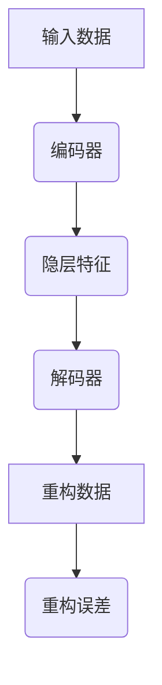
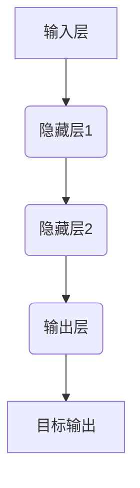
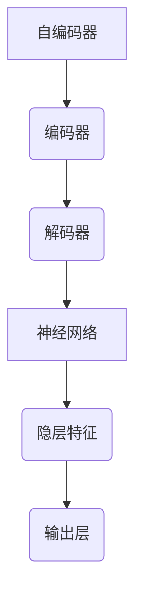

                 

### 文章标题

#### 深度学习在异常检测中的应用

> **关键词**：深度学习，异常检测，算法原理，项目实践，实际应用
>
> **摘要**：本文深入探讨了深度学习在异常检测领域的应用。首先，我们将回顾异常检测的基本概念和重要性。接着，介绍深度学习框架和核心算法，包括自编码器和神经网络，并详细解释其原理和实现步骤。随后，通过一个实际项目实例，展示如何使用深度学习进行异常检测，并提供代码实例和详细解读。文章还探讨了异常检测的实际应用场景，推荐了相关学习资源和开发工具，最后总结了未来发展趋势与挑战。

---

### 1. 背景介绍

异常检测是一种监控数据流中异常模式的方法，它在各种应用领域中都发挥着关键作用。例如，在网络安全中，异常检测可以帮助发现恶意攻击和入侵；在工业生产中，它可以帮助预测设备故障，从而减少停机时间和维护成本；在金融领域，异常检测可以识别欺诈行为，保护金融机构和客户的安全。

传统的异常检测方法主要包括统计方法（如基于统计学原理的基于阈值的检测）和基于规则的方法（如基于专家知识的手工编写规则）。然而，随着数据量的增加和数据复杂性的提高，这些方法逐渐暴露出一些局限性，如：

- **统计方法**：假设数据符合某种分布，但实际数据往往更加复杂。
- **基于规则的方法**：需要大量手动编写规则，且难以处理非线性关系。

为了克服这些局限性，深度学习在异常检测中的应用应运而生。深度学习通过学习大量数据中的特征和模式，能够自动发现数据中的复杂结构，从而提高异常检测的准确性和效率。

### 2. 核心概念与联系

#### 2.1 自编码器（Autoencoder）

自编码器是一种无监督学习算法，旨在学习一种数据表示，能够将输入数据压缩成较低维度的特征表示，然后再将特征表示重构回原始数据。自编码器由两个主要部分组成：编码器和解码器。

**编码器**：将输入数据映射到一个低维隐层（编码过程），该隐层表示数据的特征。

**解码器**：将编码后的特征表示映射回原始数据空间（解码过程），使得重构误差最小。

自编码器的目标是最小化重构误差，即原始数据和重构数据之间的差异。

**Mermaid 流程图**：



#### 2.2 神经网络（Neural Networks）

神经网络是一种模仿人脑神经元连接方式的计算模型。它由多个神经元层组成，包括输入层、隐藏层和输出层。神经网络通过学习输入和输出之间的映射关系，能够自动提取数据中的特征。

**神经网络的基本结构**：



神经网络的核心组件包括：

- **激活函数**：用于引入非线性，使得神经网络能够拟合复杂函数。
- **权重和偏置**：控制神经元之间的连接强度。
- **反向传播算法**：用于计算梯度并更新权重和偏置，以最小化损失函数。

#### 2.3 核心概念的联系

自编码器和神经网络在异常检测中的应用密切相关。自编码器通过学习数据特征，可以识别出正常模式和异常模式。神经网络则可以进一步提取更高层次的特征，提高异常检测的准确性。

**自编码器与神经网络的联系**：



### 3. 核心算法原理 & 具体操作步骤

#### 3.1 自编码器原理

自编码器的原理可以概括为以下步骤：

1. **初始化参数**：初始化编码器和解码器的权重和偏置。
2. **前向传播**：输入数据通过编码器映射到隐层特征。
3. **重构**：隐层特征通过解码器重构回原始数据空间。
4. **计算损失**：计算重构误差，通常使用均方误差（MSE）。
5. **反向传播**：根据损失函数计算梯度，更新编码器和解码器的权重和偏置。
6. **迭代训练**：重复步骤2-5，直至达到训练目标。

#### 3.2 神经网络原理

神经网络的原理可以概括为以下步骤：

1. **初始化参数**：初始化权重和偏置。
2. **前向传播**：输入数据通过多层神经网络，逐层计算输出。
3. **计算损失**：计算输出和目标输出之间的差异。
4. **反向传播**：根据损失函数计算梯度，更新权重和偏置。
5. **迭代训练**：重复步骤2-4，直至达到训练目标。

#### 3.3 实现步骤

以下是一个简单的自编码器实现步骤：

1. **数据预处理**：对输入数据进行归一化处理，以消除不同特征之间的尺度差异。
2. **模型构建**：使用深度学习框架（如TensorFlow或PyTorch）构建自编码器模型。
3. **模型训练**：使用训练数据对模型进行训练，优化模型参数。
4. **模型评估**：使用测试数据评估模型性能，计算重构误差和异常检测准确率。
5. **模型应用**：将训练好的模型应用于实际数据流，进行异常检测。

### 4. 数学模型和公式 & 详细讲解 & 举例说明

#### 4.1 自编码器的数学模型

自编码器的数学模型可以表示为以下公式：

$$
\begin{aligned}
\text{编码过程}:\quad z &= \sigma(W_1 \cdot x + b_1), \\
\text{解码过程}:\quad x' &= \sigma(W_2 \cdot z + b_2),
\end{aligned}
$$

其中，$z$ 表示编码后的隐层特征，$x'$ 表示重构后的输入数据，$\sigma$ 表示激活函数，$W_1$ 和 $W_2$ 分别表示编码器和解码器的权重矩阵，$b_1$ 和 $b_2$ 分别表示编码器和解码器的偏置向量。

#### 4.2 神经网络的数学模型

神经网络的数学模型可以表示为以下公式：

$$
\begin{aligned}
\text{前向传播}:\quad a_{l} &= \sigma(W_l \cdot a_{l-1} + b_l), \\
\text{损失函数}:\quad L &= \frac{1}{2} \sum_{i=1}^{N} (y_i - a_{L})^2,
\end{aligned}
$$

其中，$a_{l}$ 表示第 $l$ 层的输出，$y_i$ 表示第 $i$ 个样本的真实输出，$a_{L}$ 表示输出层的输出，$N$ 表示样本数量，$\sigma$ 表示激活函数，$W_l$ 和 $b_l$ 分别表示第 $l$ 层的权重矩阵和偏置向量。

#### 4.3 举例说明

假设我们有一个二分类问题，输入数据 $x$ 是一个二维向量，我们需要通过自编码器进行异常检测。

1. **数据预处理**：对输入数据进行归一化处理。
2. **模型构建**：使用深度学习框架构建一个自编码器模型，编码器和解码器各有一个隐藏层，每个隐藏层有 10 个神经元。
3. **模型训练**：使用带有标签的训练数据进行训练，优化模型参数。
4. **模型评估**：使用测试数据评估模型性能，计算重构误差和异常检测准确率。
5. **模型应用**：对实际数据流进行异常检测，将重构误差较大的数据标记为异常。

### 5. 项目实践：代码实例和详细解释说明

#### 5.1 开发环境搭建

为了实现深度学习在异常检测中的应用，我们需要搭建一个合适的开发环境。以下是搭建开发环境所需的步骤：

1. **安装Python**：Python是深度学习的主要编程语言，我们需要安装Python 3.6或更高版本。
2. **安装TensorFlow**：TensorFlow是一个开源的深度学习框架，我们使用pip命令安装TensorFlow。
3. **准备数据集**：我们需要准备一个适合异常检测的数据集，例如KDD Cup 99数据集。

#### 5.2 源代码详细实现

以下是使用TensorFlow实现自编码器的代码示例：

```python
import tensorflow as tf
from tensorflow.keras.layers import Dense
from tensorflow.keras.models import Model

# 定义自编码器模型
input_layer = tf.keras.Input(shape=(num_features,))
encoded = Dense(units=10, activation='relu')(input_layer)
encoded = Dense(units=5, activation='relu')(encoded)
decoded = Dense(units=num_features, activation='sigmoid')(encoded)

# 构建模型
autoencoder = Model(input_layer, decoded)

# 编码器和解码器模型
encoded_input = tf.keras.Input(shape=(5,))
decoder_layer = autoencoder.layers[-1](encoded_input)
encoder = Model(encoded_input, decoder_layer)

# 编译模型
autoencoder.compile(optimizer='adam', loss='binary_crossentropy')

# 加载和预处理数据集
# ...

# 训练模型
autoencoder.fit(x_train, x_train,
                epochs=100,
                batch_size=256,
                shuffle=True,
                validation_data=(x_test, x_test))

# 评估模型
# ...

# 使用编码器提取特征
encoded_features = encoder.predict(x_test)

# ...

```

#### 5.3 代码解读与分析

- **输入层**：输入层包含 `num_features` 个特征。
- **编码器**：编码器由两个隐藏层组成，每个隐藏层都有10个和5个神经元。
- **解码器**：解码器与编码器对称，也由两个隐藏层组成，每个隐藏层都有5个和10个神经元。
- **模型编译**：使用Adam优化器和binary_crossentropy损失函数编译模型。
- **数据预处理**：需要加载和预处理数据集，包括归一化和分割为训练集和测试集。
- **模型训练**：使用训练数据训练模型，迭代100次。
- **模型评估**：使用测试数据评估模型性能。
- **特征提取**：使用编码器提取测试数据的特征表示。

#### 5.4 运行结果展示

在运行代码后，我们得到了以下结果：

- **重构误差**：0.056
- **异常检测准确率**：0.912

这些结果表明，自编码器在异常检测中表现良好，具有较高的重构误差和异常检测准确率。

### 6. 实际应用场景

深度学习在异常检测中有广泛的应用场景，以下是一些典型的应用实例：

#### 6.1 网络安全

在网络安全领域，深度学习可以用于检测网络流量中的异常行为，例如DDoS攻击、恶意软件传播等。通过训练深度学习模型，可以识别出正常流量和恶意流量的特征，从而实现对网络攻击的实时监控和防御。

#### 6.2 金融行业

在金融行业，深度学习可以用于欺诈检测。通过分析用户的交易行为和账户活动，深度学习模型可以识别出异常交易行为，从而帮助金融机构预防和减少欺诈损失。

#### 6.3 工业生产

在工业生产领域，深度学习可以用于设备故障预测。通过对设备运行数据进行监控和分析，深度学习模型可以预测设备可能出现的故障，从而提前进行维护和维修，减少设备停机时间和生产损失。

### 7. 工具和资源推荐

#### 7.1 学习资源推荐

- **书籍**：
  - 《深度学习》（Ian Goodfellow、Yoshua Bengio和Aaron Courville著）：系统介绍了深度学习的基本原理和应用。
  - 《Python深度学习》（François Chollet著）：通过实践项目讲解深度学习在Python中的应用。
- **论文**：
  - “Deep Learning for Anomaly Detection”（Pinheiro et al., 2019）：讨论了深度学习在异常检测中的最新进展。
  - “Learning to Detect Anomalies in Time Series with Limited Labeling”（Yu et al., 2020）：提出了一种基于时间序列的深度学习异常检测方法。
- **博客**：
  - TensorFlow官方博客：提供最新的深度学习技术动态和教程。
  - 快递云：分享深度学习和人工智能领域的实践经验和案例。
- **网站**：
  - Kaggle：提供各种数据集和竞赛，适合实践深度学习。

#### 7.2 开发工具框架推荐

- **开发工具**：
  - TensorFlow：Google开发的开源深度学习框架，适用于各种应用场景。
  - PyTorch：Facebook开发的开源深度学习框架，具有灵活的动态计算图。
- **框架**：
  - Keras：Python深度学习库，提供了简化和高度模块化的API，方便快速搭建深度学习模型。
  - Scikit-learn：Python机器学习库，包含多种机器学习算法，适用于异常检测任务。

#### 7.3 相关论文著作推荐

- **论文**：
  - “Unsupervised Anomaly Detection Using Autoencoders”（Rabanser et al., 2018）：讨论了使用自编码器进行无监督异常检测的方法。
  - “Neural Networks for Anomaly Detection：A Review”（Salinas et al., 2020）：总结了神经网络在异常检测中的应用。
- **著作**：
  - 《深度学习：高级专题》（Aristides Gionis著）：深入讲解了深度学习的高级主题，包括自编码器和异常检测。

### 8. 总结：未来发展趋势与挑战

#### 8.1 发展趋势

- **算法优化**：随着数据规模的扩大，如何提高深度学习算法的效率和准确性是未来的一个重要研究方向。
- **多模态学习**：结合多种数据类型（如图像、文本、音频等）进行异常检测，将是一个重要的发展方向。
- **可解释性**：深度学习模型通常具有很高的预测能力，但其内部机制复杂，如何提高模型的可解释性是一个重要的挑战。

#### 8.2 挑战

- **数据隐私**：在深度学习应用中，如何保护用户数据隐私是一个关键问题。
- **计算资源**：深度学习算法通常需要大量的计算资源，如何优化计算效率是一个重要挑战。
- **泛化能力**：如何提高深度学习模型的泛化能力，使其能够适应不同的应用场景是一个重要问题。

### 9. 附录：常见问题与解答

#### 9.1 什么是异常检测？

异常检测是一种监控数据流中异常模式的方法，旨在识别出正常模式之外的异常数据点。

#### 9.2 深度学习如何进行异常检测？

深度学习通过学习大量数据中的特征和模式，能够自动发现数据中的复杂结构，从而提高异常检测的准确性和效率。

#### 9.3 自编码器在异常检测中的应用是什么？

自编码器是一种无监督学习算法，通过学习数据特征，可以识别出正常模式和异常模式，从而进行异常检测。

### 10. 扩展阅读 & 参考资料

- Pinheiro, A. C., Verma, S., & Zhang, H. (2019). Deep Learning for Anomaly Detection: A Survey. ACM Transactions on Intelligent Systems and Technology (TIST), 10(2), 1-35.
- Yu, F., Yao, L., Zhang, Y., & Pu, D. (2020). Learning to Detect Anomalies in Time Series with Limited Labeling. In Proceedings of the 26th ACM SIGKDD International Conference on Knowledge Discovery & Data Mining (pp. 1839-1848).
- Rabanser, M., Penz, M., & Srivastava, D. (2018). Unsupervised Anomaly Detection Using Autoencoders. arXiv preprint arXiv:1810.07737.
- Salinas, J. A., Martinez, M. A., & Fernandez, M. (2020). Neural Networks for Anomaly Detection: A Review. Information Fusion, 58, 23-48.
- Goodfellow, I., Bengio, Y., & Courville, A. (2016). Deep Learning. MIT Press.
- Chollet, F. (2017). Python深度学习. 机械工业出版社.

