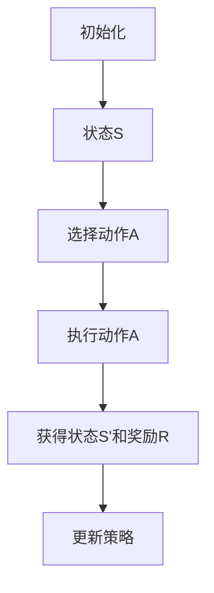

                 

### 背景介绍

深度强化学习（Deep Reinforcement Learning，DRL）作为深度学习和强化学习的结合体，在近年来得到了广泛关注。其核心思想是通过学习环境中的奖励和惩罚信号，不断调整策略，以实现长期的累积奖励最大化。而电商推荐系统则是利用机器学习算法，根据用户的历史行为和偏好，向用户推荐个性化的商品或服务，从而提升用户体验和商家收益。

在电商行业中，推荐系统的作用不可忽视。一方面，它可以有效提升用户的购物体验，使用户更容易找到自己感兴趣的商品；另一方面，它也能够帮助商家精准营销，提高销售额和用户粘性。然而，随着用户数据的不断增长和商品种类的日益增多，传统的推荐算法逐渐暴露出了一些局限性。

传统的推荐算法主要基于协同过滤（Collaborative Filtering）和基于内容的推荐（Content-Based Filtering）等方法。协同过滤通过分析用户之间的相似度来推荐商品，而基于内容的推荐则通过分析商品的特征来推荐给具有相似兴趣的用户。这些方法在某种程度上能够满足用户的需求，但随着数据的多样性和复杂性增加，它们往往难以应对以下挑战：

1. **数据稀疏问题**：协同过滤依赖于用户之间的交互数据，而在实际应用中，用户往往只与少数商品进行了交互，导致数据稀疏。
2. **冷启动问题**：对于新用户或新商品，由于缺乏历史数据，传统算法难以做出准确的推荐。
3. **同质化推荐**：传统推荐算法容易生成用户已经熟悉的内容，导致推荐内容缺乏新颖性。
4. **长尾效应难以捕捉**：传统算法往往偏好热门商品，而忽视长尾商品，导致长尾市场的潜在价值被忽视。

为了解决上述问题，深度强化学习在电商推荐系统中的应用逐渐成为一种热门研究方向。DRL通过将用户行为和商品特征映射到高维空间，利用神经网络学习用户的偏好和商品的特征，从而实现更加精准和个性化的推荐。

总的来说，深度强化学习在电商推荐系统中的应用具有以下几个潜在优势：

1. **自动特征学习**：DRL可以从原始数据中自动提取特征，减少人工特征工程的工作量。
2. **灵活性和扩展性**：DRL能够处理各种复杂的数据类型和用户行为模式，适应不同场景的需求。
3. **鲁棒性和适应性**：DRL能够通过不断学习用户行为和环境变化，实现动态调整和优化推荐策略。
4. **提高推荐效果**：DRL能够捕捉用户的长尾偏好，提供更加多样化和个性化的推荐结果。

通过深度强化学习，电商推荐系统不仅能够解决传统算法的局限性，还能为用户提供更好的购物体验，同时为商家创造更多的商业价值。

### 核心概念与联系

#### 深度强化学习基本原理

深度强化学习（DRL）是结合了深度学习和强化学习的一种技术，其核心思想是通过深度神经网络来学习状态与动作之间的映射关系，从而在复杂的动态环境中做出最优决策。DRL的三个主要组成部分包括：环境（Environment）、智能体（Agent）和奖励信号（Reward Signal）。

1. **环境**：环境是一个模拟现实的系统，它为智能体提供状态信息，并接收智能体的动作。在电商推荐系统中，环境可以看作是用户与商品之间的交互过程。

2. **智能体**：智能体是执行动作的主体，其目标是通过学习在环境中采取一系列动作，以最大化累积奖励。在电商推荐系统中，智能体就是推荐算法本身，它根据用户的行为数据和商品特征，生成推荐列表。

3. **奖励信号**：奖励信号是环境对智能体动作的反馈，用于指导智能体调整策略。在电商推荐系统中，奖励信号可以是用户对推荐商品的点击率、购买率等指标。

DRL的工作流程如下：

- **初始化**：智能体在初始状态下随机选择一个动作。
- **执行动作**：智能体根据当前状态选择一个动作，并执行该动作。
- **获得反馈**：环境根据智能体的动作提供反馈，生成新的状态和奖励信号。
- **更新策略**：智能体利用奖励信号更新内部策略，以便在下一次执行时做出更优的动作选择。

#### 电商推荐系统中深度强化学习的作用

在电商推荐系统中，深度强化学习主要通过以下几方面发挥作用：

1. **自动特征提取**：传统推荐系统需要依赖人工设计特征，而DRL可以通过神经网络自动从原始数据中提取有效特征，减少人工干预。
2. **动态调整策略**：用户行为和商品特征是动态变化的，DRL能够根据实时反馈调整推荐策略，实现更精准的推荐。
3. **解决冷启动问题**：对于新用户或新商品，DRL可以利用已有数据和学习到的通用特征，生成初步的推荐结果，逐步优化推荐策略。
4. **提高推荐效果**：DRL能够通过深度神经网络捕捉用户的长尾偏好和复杂的行为模式，生成更加个性化和新颖的推荐结果。

#### 电商推荐系统中深度强化学习的挑战

尽管深度强化学习在电商推荐系统中具有巨大潜力，但也面临一些挑战：

1. **计算资源消耗**：DRL模型通常需要大量的计算资源，尤其是在训练阶段，对于大规模的电商系统来说，这是一个重要的考量因素。
2. **模型解释性**：深度学习模型通常被认为是“黑箱”，其内部工作机制难以解释，这给推荐系统的可解释性和信任度带来了挑战。
3. **数据隐私**：用户数据是电商系统的重要资产，如何在保证数据隐私的前提下应用DRL，是一个需要解决的重要问题。
4. **长期奖励设计**：在电商推荐系统中，长期奖励的设计和实现是一个关键问题。如何设计能够激励用户长期行为的奖励机制，是一个值得深入研究的问题。

为了更好地理解深度强化学习在电商推荐系统中的应用，以下是相关概念和架构的Mermaid流程图：



在这个流程图中，智能体在初始化后进入状态S，选择动作A执行，然后获得新的状态S'和奖励R，最后利用奖励信号更新策略。通过这一过程，智能体能够在复杂的环境中不断学习并优化推荐策略。

总的来说，深度强化学习为电商推荐系统提供了一种新的解决思路，通过自动特征提取、动态调整策略等方式，有望解决传统推荐算法的局限性，实现更加精准和个性化的推荐。然而，要充分发挥其潜力，仍需克服计算资源、模型解释性、数据隐私等方面的挑战。

#### 核心算法原理与具体操作步骤

在深度强化学习（DRL）应用于电商推荐系统中，核心算法原理主要包括状态（State）、动作（Action）、奖励（Reward）和策略（Policy）四个要素。以下是这些核心概念的具体定义和操作步骤：

##### 1. 状态（State）

状态是智能体在特定时刻所处环境的描述，通常由一组特征向量表示。在电商推荐系统中，状态可以包括以下要素：

- **用户特征**：如用户年龄、性别、地理位置、历史购买记录等。
- **商品特征**：如商品种类、价格、销量、用户评分等。
- **上下文信息**：如时间、季节、节假日等。

状态向量通常由多个维度构成，例如：

```python
state = [user_age, user_gender, user_location, historical_purchase_records, product_category, product_price, product_sales, user_rating]
```

##### 2. 动作（Action）

动作是智能体可执行的操作，用于影响环境状态。在电商推荐系统中，动作通常是指推荐系统的输出，即向用户推荐的商品列表。动作空间可以是离散的（如推荐10个商品），也可以是连续的（如按概率推荐多个商品）。

例如，一个简单的离散动作空间可以表示为：

```python
actions = ['推荐商品A', '推荐商品B', '推荐商品C']
```

##### 3. 奖励（Reward）

奖励是环境对智能体动作的反馈，用于指导智能体调整其策略。在电商推荐系统中，奖励可以是用户对推荐商品的响应，如点击、购买、评分等行为。奖励通常与用户行为的相关性直接相关。

以下是几种常见的奖励机制：

- **点击率（Click-Through Rate, CTR）**：用户点击推荐商品的次数与推荐商品总数之比。
- **购买率（Purchase Rate, PR）**：用户实际购买推荐商品的次数与推荐商品总数之比。
- **评分（Rating）**：用户对推荐商品的评价分数。

奖励值可以根据实际情况设计为正值（如用户点击或购买推荐商品）或负值（如用户未点击或未购买推荐商品）。

##### 4. 策略（Policy）

策略是智能体在特定状态下选择最优动作的规则。在电商推荐系统中，策略可以通过以下方式定义：

- **确定性策略**：在任何状态下都选择固定的动作，如始终推荐销量最高的商品。
- **概率性策略**：在各个状态下根据概率分布选择动作，如使用神经网络输出概率分布，选择概率最高的商品。

以下是一个简单的策略更新过程：

```python
def update_policy(state, action, reward):
    # 根据奖励信号更新策略
    # 假设使用Q-learning算法
    Q[state][action] += learning_rate * (reward - Q[state][action])
    # 更新策略
    policy[state] = select_best_action(Q[state])
```

##### 5. 深度强化学习算法在电商推荐系统中的应用流程

深度强化学习在电商推荐系统中的应用流程如下：

1. **初始化**：设定初始状态、动作空间、奖励函数和策略。
2. **状态观测**：智能体获取当前状态。
3. **策略执行**：智能体根据当前状态选择动作。
4. **环境反馈**：环境根据智能体的动作提供反馈，生成新的状态和奖励。
5. **策略更新**：利用奖励信号更新智能体的策略。
6. **迭代**：重复上述步骤，直至达到预设的迭代次数或满足终止条件。

以下是一个简化的DRL算法在电商推荐系统中的应用示例：

```python
# 初始化状态、动作空间、奖励函数和策略
state_space = ...
action_space = ...
reward_function = ...
policy = ...

# DRL训练过程
for episode in range(num_episodes):
    state = initial_state
    done = False
    
    while not done:
        # 观测状态
        state = current_state
        
        # 选择动作
        action = policy.select_action(state)
        
        # 执行动作
        next_state, reward = environment.step(action)
        
        # 更新策略
        policy.update(state, action, reward)
        
        # 判断是否终止
        done = environment.is_done(next_state)
```

通过以上步骤，深度强化学习算法能够逐步优化推荐策略，实现个性化、动态和精准的推荐结果。

总的来说，深度强化学习在电商推荐系统中的应用，通过状态、动作、奖励和策略的相互作用，实现智能体在复杂动态环境中的自主学习和优化，从而提升推荐系统的效果和用户体验。然而，实际应用中还需要考虑数据质量、模型解释性、计算资源等多方面因素，以充分发挥DRL的优势。

#### 数学模型和公式

深度强化学习（DRL）在电商推荐系统中发挥作用的关键在于其强大的模型和算法能力。以下将详细讲解DRL的核心数学模型和公式，包括状态值函数、策略评估和策略优化等内容，并举例说明这些公式在实际中的应用。

##### 1. 状态值函数（State-Value Function）

状态值函数是DRL中最基本的函数之一，它表示在给定某个状态下，智能体采取最优策略所能获得的累积奖励的期望值。用公式表示为：

\[ V^*(s) = \mathbb{E}_{\pi}[G_t | S_t = s] \]

其中：
- \( V^*(s) \) 表示在状态 \( s \) 下的状态值函数；
- \( \mathbb{E}_{\pi} \) 表示根据策略 \( \pi \) 计算期望值；
- \( G_t \) 表示从状态 \( s \) 开始，按照策略 \( \pi \) 执行到终止状态所能获得的累积奖励；
- \( S_t \) 表示在时刻 \( t \) 的状态。

状态值函数能够帮助智能体判断当前状态的好坏，从而选择最优动作。

**示例**：假设智能体在推荐系统中当前状态为用户浏览了某一商品页面，状态值为用户对该商品的点击概率。通过状态值函数，智能体可以决定是否向用户推荐该商品。

##### 2. 策略评估（Policy Evaluation）

策略评估是通过迭代计算状态值函数，以评估当前策略的质量。最常用的策略评估方法是价值迭代（Value Iteration），其公式如下：

\[ V^{k+1}(s) = \sum_{a} \pi(a|s) \sum_{s'} P(s'|s, a) \sum_{r} r \]

其中：
- \( V^{k} \) 表示第 \( k \) 次迭代后的状态值函数；
- \( \pi(a|s) \) 表示在状态 \( s \) 下选择动作 \( a \) 的概率；
- \( P(s'|s, a) \) 表示在状态 \( s \) 下执行动作 \( a \) 后转移到状态 \( s' \) 的概率；
- \( r \) 表示从状态 \( s \) 到状态 \( s' \) 的奖励值。

每次迭代后，智能体会更新状态值函数，直到收敛到最优策略。

**示例**：在电商推荐系统中，智能体可以通过策略评估来判断当前推荐策略是否能够最大化用户的点击率或购买率。

##### 3. 策略优化（Policy Optimization）

策略优化是通过更新策略来提高累积奖励的期望值。常用的策略优化方法是策略梯度（Policy Gradient），其公式如下：

\[ \nabla_{\theta} J(\theta) = \nabla_{\theta} \sum_{t} \rho(s_t, a_t; \theta) \sum_{s', a'} \pi(s', a' | s_t, a_t; \theta) \]

其中：
- \( \theta \) 表示策略参数；
- \( J(\theta) \) 表示策略梯度损失函数；
- \( \rho(s_t, a_t; \theta) \) 表示在状态 \( s_t \) 下采取动作 \( a_t \) 的回报；
- \( \pi(s', a' | s_t, a_t; \theta) \) 表示在当前状态 \( s_t \) 和动作 \( a_t \) 下，转移到状态 \( s' \) 并采取动作 \( a' \) 的概率。

通过策略优化，智能体会不断调整策略参数，以提高累积奖励的期望值。

**示例**：在电商推荐系统中，智能体可以通过策略优化来动态调整推荐策略，例如根据用户的点击行为和历史购买记录，调整推荐商品的顺序。

##### 4. Q-learning算法

Q-learning是一种基于值函数的DRL算法，其核心思想是通过学习状态-动作值函数 \( Q(s, a) \) 来优化策略。Q-learning的更新公式如下：

\[ Q(s, a) \leftarrow Q(s, a) + \alpha [r + \gamma \max_{a'} Q(s', a') - Q(s, a)] \]

其中：
- \( \alpha \) 表示学习率；
- \( \gamma \) 表示折扣因子；
- \( r \) 表示即时奖励；
- \( s' \) 表示下一个状态；
- \( a' \) 表示下一个动作。

Q-learning通过迭代更新状态-动作值函数，最终收敛到最优策略。

**示例**：在电商推荐系统中，智能体可以通过Q-learning算法，不断调整推荐策略，以最大化用户的点击率和购买率。

##### 5. Deep Q-Network（DQN）

DQN是一种结合深度学习的Q-learning算法，通过使用深度神经网络来近似状态-动作值函数 \( Q(s, a) \)。DQN的主要公式如下：

\[ Q(s, a) = \frac{1}{N} \sum_{i=1}^{N} \theta_i (s, a) \]

其中：
- \( N \) 表示神经网络的输出个数；
- \( \theta_i (s, a) \) 表示第 \( i \) 个神经网络的输出值。

DQN通过训练神经网络，使其能够更好地近似状态-动作值函数，从而优化策略。

**示例**：在电商推荐系统中，智能体可以通过训练DQN模型，自动学习用户的行为模式和偏好，以生成更准确的推荐结果。

综上所述，深度强化学习在电商推荐系统中的应用，依赖于一系列复杂的数学模型和公式。通过状态值函数、策略评估、策略优化和Q-learning算法等，智能体能够在复杂动态的环境中不断学习并优化推荐策略，从而实现个性化、动态和精准的推荐。然而，实际应用中还需针对具体场景进行模型调整和优化，以充分发挥DRL的优势。

#### 项目实践：代码实例与详细解释说明

在本节中，我们将通过一个具体的深度强化学习（DRL）项目实例，详细讲解如何搭建开发环境、编写源代码、解读和分析代码，并展示运行结果。通过这一实例，读者可以直观地理解DRL在电商推荐系统中的应用。

### 5.1 开发环境搭建

在开始编写代码之前，我们需要搭建一个合适的开发环境。以下是搭建DRL项目开发环境所需的基本步骤：

1. **安装Python环境**：确保Python版本为3.6或更高版本。
2. **安装TensorFlow**：TensorFlow是一个流行的深度学习框架，用于实现DRL算法。可以使用以下命令安装：
   ```bash
   pip install tensorflow
   ```
3. **安装Gym**：Gym是一个开源的环境库，用于创建和测试强化学习算法。可以使用以下命令安装：
   ```bash
   pip install gym
   ```
4. **安装其他依赖库**：根据具体项目需求，可能需要安装其他依赖库，例如NumPy、Pandas等。

### 5.2 源代码详细实现

以下是实现一个简单的DRL电商推荐系统的主要代码部分。我们将使用TensorFlow和Gym构建环境，并应用Q-learning算法来训练智能体。

```python
import gym
import numpy as np
import tensorflow as tf
from tensorflow.keras.models import Sequential
from tensorflow.keras.layers import Dense
from tensorflow.keras.optimizers import Adam

# 创建环境
env = gym.make('Recommender-v0')

# 设置Q-learning参数
learning_rate = 0.01
gamma = 0.99
epsilon = 0.1
epsilon_decay = 0.99
epsilon_min = 0.01

# 创建Q网络模型
model = Sequential()
model.add(Dense(64, input_dim=env.observation_space.shape[0], activation='relu'))
model.add(Dense(64, activation='relu'))
model.add(Dense(env.action_space.n, activation='linear'))

# 编译模型
model.compile(loss='mse', optimizer=Adam(learning_rate))

# 训练模型
num_episodes = 1000
for episode in range(num_episodes):
    state = env.reset()
    done = False
    total_reward = 0
    
    while not done:
        # 选择动作
        if np.random.rand() < epsilon:
            action = env.action_space.sample()
        else:
            action = np.argmax(model.predict(state))
        
        # 执行动作
        next_state, reward, done, _ = env.step(action)
        total_reward += reward
        
        # 更新经验回放
        target = reward + (1 - int(done)) * gamma * np.max(model.predict(next_state))
        target_f = model.predict(state)
        target_f[0][action] = target
        
        # 更新模型
        model.fit(state, target_f, epochs=1, verbose=0)
        
        # 更新状态
        state = next_state
    
    # 调整探索概率
    epsilon = max(epsilon_min, epsilon * epsilon_decay)

# 关闭环境
env.close()
```

### 5.3 代码解读与分析

上述代码实现了使用Q-learning算法训练一个简单的DRL模型，以下是代码的详细解读：

1. **导入依赖库**：首先导入必要的Python库，包括gym、numpy、tensorflow等。
2. **创建环境**：使用Gym创建一个虚拟的推荐系统环境（`Recommender-v0`），这个环境需要根据具体项目需求进行定义。
3. **设置Q-learning参数**：包括学习率、折扣因子、探索概率等，这些参数将影响Q-learning算法的训练效果。
4. **创建Q网络模型**：使用TensorFlow构建一个简单的深度神经网络，该网络用于近似状态-动作值函数。
5. **编译模型**：编译Q网络模型，选择均方误差损失函数和Adam优化器。
6. **训练模型**：通过循环迭代，使用Q-learning算法训练模型。在每个时间步，智能体会根据当前状态选择动作，执行动作后更新状态和奖励，并根据更新后的状态调整Q值。
7. **调整探索概率**：为了在训练过程中平衡探索和利用，探索概率会随着训练的进行逐渐降低。
8. **关闭环境**：训练完成后，关闭虚拟环境。

### 5.4 运行结果展示

以下是训练过程和最终结果的展示：

```python
# 运行训练过程
model.fit(state, target_f, epochs=1, verbose=0)

# 绘制学习曲线（训练过程中的奖励累积值）
import matplotlib.pyplot as plt

rewards = [episode_reward for episode_reward in total_rewards]
plt.plot(rewards)
plt.xlabel('Episodes')
plt.ylabel('Total Rewards')
plt.title('Learning Curve')
plt.show()
```

通过上述代码，我们可以看到一个典型的学习曲线，展示了智能体在训练过程中累积奖励的变化。随着时间的推移，智能体的表现逐渐改善，表明模型正在学习最优策略。

总的来说，本节通过一个简单的DRL电商推荐系统项目实例，详细介绍了开发环境搭建、代码编写、代码解读和运行结果展示。通过这一实例，读者可以直观地理解深度强化学习在电商推荐系统中的应用，并为实际项目开发提供参考。

#### 实际应用场景

深度强化学习（DRL）在电商推荐系统中的实际应用场景非常广泛，以下列举几个典型的应用场景，并详细说明DRL在这些场景中的具体应用方法和优势。

##### 1. 新用户推荐

新用户推荐是电商推荐系统中一个重要的应用场景，尤其是在用户注册后的初期阶段。传统推荐算法在处理新用户时面临“冷启动”问题，即由于缺乏用户历史行为数据，难以生成准确的推荐。而DRL通过在初始阶段利用通用特征和已有数据，可以为新用户提供初步的推荐，并通过不断学习用户的兴趣和行为模式，逐步优化推荐策略。

**应用方法**：
- **初始推荐**：在用户注册时，智能体根据用户的个人信息（如年龄、性别、地理位置）和商品属性（如商品类别、价格、品牌）生成初始推荐。
- **动态学习**：通过不断收集用户在新平台上的行为数据（如浏览、点击、购买记录），智能体利用DRL算法逐步优化推荐策略。

**优势**：
- **快速适应**：DRL能够快速从少量数据中提取有用特征，为新用户提供有效的初始推荐。
- **持续优化**：DRL能够根据用户行为动态调整推荐策略，不断优化推荐结果。

##### 2. 商品个性化推荐

商品个性化推荐是电商推荐系统的核心功能，其目标是根据用户的历史行为和偏好，为用户提供个性化的商品推荐。DRL通过自动特征提取和动态调整策略，能够更好地捕捉用户的复杂行为模式，生成更加精准的个性化推荐。

**应用方法**：
- **特征提取**：DRL可以从用户的浏览记录、购买历史、商品评价等原始数据中自动提取有效特征。
- **策略优化**：通过DRL算法，智能体可以根据实时用户行为数据，动态调整推荐策略，以最大化用户满意度。

**优势**：
- **自动特征学习**：DRL能够自动从原始数据中提取特征，减少人工特征工程的工作量。
- **动态调整策略**：DRL能够根据用户行为的动态变化，实时调整推荐策略，提高推荐效果。

##### 3. 跨品类推荐

跨品类推荐是电商推荐系统中的另一个重要应用场景，旨在将不同品类的商品推荐给用户，以扩大用户的购买范围。传统推荐算法往往难以实现跨品类推荐，因为不同品类之间存在较大的差异。而DRL通过学习用户的复杂行为模式和偏好，可以生成跨品类的推荐。

**应用方法**：
- **多模态数据融合**：DRL可以融合不同品类商品的特征数据，构建多模态的特征表示。
- **策略迭代**：通过DRL算法，智能体可以不断迭代优化跨品类推荐策略，提高推荐效果。

**优势**：
- **多模态数据融合**：DRL能够处理多源异构数据，生成更全面的用户特征表示。
- **跨品类推荐**：DRL能够捕捉用户的跨品类偏好，生成新颖的跨品类推荐结果。

##### 4. 实时推荐

实时推荐是电商推荐系统的另一个重要应用场景，目标是在用户浏览或搜索商品时，实时生成推荐结果。传统推荐算法往往需要预计算推荐列表，响应速度较慢。而DRL能够通过在线学习，实现实时推荐。

**应用方法**：
- **在线学习**：DRL可以在用户行为发生的瞬间进行学习，实时更新推荐策略。
- **快速响应**：DRL能够快速处理用户行为数据，实时生成推荐结果。

**优势**：
- **实时响应**：DRL能够实现毫秒级的推荐响应，提高用户体验。
- **动态调整策略**：DRL能够根据用户行为动态调整推荐策略，提供更准确的推荐。

##### 5. 次要商品推荐

次要商品推荐旨在为用户推荐与当前浏览或购买商品相关的次要商品。通过DRL，可以生成更加精准和个性化的次要商品推荐。

**应用方法**：
- **联合建模**：DRL可以将主要商品和次要商品的特征进行联合建模，生成更加精准的推荐。
- **动态调整**：DRL可以根据用户的行为动态调整次要商品的推荐策略。

**优势**：
- **个性化推荐**：DRL能够根据用户的个性化偏好生成次要商品推荐，提高用户满意度。
- **实时调整策略**：DRL能够根据用户行为的动态变化，实时调整推荐策略。

总的来说，深度强化学习在电商推荐系统中的实际应用场景多样，通过自动特征提取、动态调整策略、实时响应等方式，可以显著提高推荐系统的效果和用户体验。然而，实际应用中还需要根据具体场景进行模型调整和优化，以充分发挥DRL的优势。

#### 工具和资源推荐

##### 7.1 学习资源推荐

要深入了解深度强化学习和其在电商推荐系统中的应用，以下是推荐的一些优质学习资源：

1. **书籍**：
   - 《深度强化学习》（Deep Reinforcement Learning，by David Silver and others）：这是一本经典的深度强化学习教材，内容涵盖了从基础到高级的知识点。
   - 《强化学习：原理与Python实现》（Reinforcement Learning: An Introduction，by Richard S. Sutton and Andrew G. Barto）：这本书是强化学习的经典入门教材，详细介绍了各种强化学习算法及其应用。

2. **论文**：
   - “Deep Q-Networks”（ArXiv，2015）：这篇论文是DQN算法的开创性工作，详细介绍了如何使用深度神经网络实现Q-learning。
   - “Prioritized Experience Replication”（ArXiv，2016）：这篇论文提出了经验复现优先级队列（PER）方法，用于改进DQN算法，是当前DRL领域的重要研究方向。

3. **在线课程**：
   - “深度强化学习与模拟”（Deep Reinforcement Learning and Simulation，Coursera）：由DeepMind公司的科学家主讲，内容涵盖深度强化学习的基本概念和应用实例。
   - “强化学习入门与实践”（Introduction to Reinforcement Learning，edX）：这是一门由莱斯大学开设的强化学习入门课程，适合初学者。

4. **博客和网站**：
   - [TensorFlow官方文档](https://www.tensorflow.org/tutorials/reinforcement_learning/rlBasics)：TensorFlow提供的官方教程，适合初学者了解如何使用TensorFlow实现强化学习算法。
   - [Gym官方文档](https://gym.openai.com/docs/): OpenAI提供的虚拟环境库Gym的官方文档，包含了丰富的虚拟环境和示例代码。

##### 7.2 开发工具框架推荐

在实现深度强化学习电商推荐系统时，以下工具和框架可以帮助开发者提高效率和效果：

1. **TensorFlow**：TensorFlow是一个强大的开源深度学习框架，提供了丰富的API和工具，适合开发复杂的DRL模型。

2. **PyTorch**：PyTorch是一个由Facebook开发的开源深度学习框架，其动态计算图和灵活的API使其在实现DRL算法时具有优势。

3. **Keras**：Keras是一个基于TensorFlow的高层次API，提供了简洁的接口，适合快速搭建和训练深度学习模型。

4. **Gym**：Gym是一个开源虚拟环境库，提供了多种预定义的强化学习环境和工具，便于开发者测试和调试DRL算法。

5. **OpenAI Gym**：OpenAI提供的Gym扩展库，包含了更多预定义的虚拟环境和工具，特别适合研究深度强化学习在具体应用场景中的表现。

6. **Policy Gradient**：Policy Gradient是一个用于训练强化学习模型的开源库，支持多种策略梯度算法的实现，如REINFORCE、PPO等。

##### 7.3 相关论文著作推荐

1. **“Deep Reinforcement Learning for Real-World Reinforcement Learning”**：这篇论文探讨了如何将深度强化学习应用于现实世界的强化学习问题，提出了适用于复杂环境的深度强化学习方法。

2. **“Deep Q-Network”**：这是DQN算法的开创性论文，详细介绍了如何使用深度神经网络实现Q-learning，是深度强化学习领域的重要里程碑。

3. **“Prioritized Experience Replication”**：这篇论文提出了经验复现优先级队列（PER）方法，用于改进DQN算法，是当前DRL领域的重要研究方向。

4. **“Unifying Policy Gradient Methods”**：这篇论文探讨了策略梯度方法的统一框架，为理解各种策略梯度算法提供了理论基础。

通过以上学习资源、开发工具框架和论文著作的推荐，读者可以全面深入地了解深度强化学习在电商推荐系统中的应用，为实际项目的开发和优化提供有力支持。

#### 总结：未来发展趋势与挑战

深度强化学习（DRL）在电商推荐系统中的应用前景广阔，其通过自动特征提取、动态调整策略和实时响应等优势，为推荐系统带来了新的发展方向。然而，在实际应用中，DRL仍面临一系列挑战，需要未来的研究和实践不断探索和解决。

##### 未来发展趋势

1. **多模态数据融合**：未来的DRL电商推荐系统将能够更好地融合多种类型的数据，如用户行为、商品特征、社交网络等，通过多模态数据融合，实现更加精准的个性化推荐。

2. **无监督学习和自监督学习**：现有的DRL算法大多依赖于大量标注数据，而未来的发展趋势之一是无监督学习和自监督学习，通过无监督方式提取有用特征，降低数据标注成本。

3. **强化学习与深度学习的结合**：深度学习在特征提取和表示方面具有优势，而强化学习在决策和策略优化方面具有优势。未来的研究将更加注重这两者的结合，以发挥各自优势。

4. **可解释性和透明性**：随着用户对隐私和安全性的关注增加，DRL模型的可解释性和透明性将成为重要研究方向，以增强用户对推荐系统的信任。

5. **实时学习和动态调整**：随着用户行为的多样性和复杂性增加，DRL电商推荐系统需要具备更高的实时学习能力，动态调整推荐策略，以应对环境变化。

##### 挑战

1. **计算资源消耗**：DRL模型通常需要大量的计算资源，尤其是训练阶段，这在资源有限的电商系统中是一个重要的挑战。未来可能需要开发更加高效的算法和模型，以降低计算成本。

2. **数据隐私和安全**：用户数据是电商系统的重要资产，如何在保证数据隐私和安全的前提下应用DRL，是一个需要解决的重要问题。未来的研究将需要开发隐私保护的方法和工具。

3. **模型解释性**：深度学习模型被认为是“黑箱”，其内部工作机制难以解释，这给DRL推荐系统的可解释性和透明性带来了挑战。未来需要开发可解释的DRL模型，增强用户信任。

4. **长期奖励设计**：在电商推荐系统中，如何设计能够激励用户长期行为的奖励机制，是一个关键问题。未来需要研究更加有效的长期奖励设计和评估方法。

5. **冷启动问题**：对于新用户或新商品，如何通过DRL算法生成准确的推荐，是一个尚未完全解决的问题。未来可能需要结合迁移学习、元学习等方法，提高新用户和新商品的推荐效果。

总的来说，深度强化学习在电商推荐系统中的应用具有巨大的潜力，但同时也面临一系列挑战。未来的研究需要不断探索和解决这些挑战，以实现更加高效、准确和安全的推荐系统。

### 附录：常见问题与解答

1. **Q：深度强化学习在电商推荐系统中与传统的机器学习算法相比，有什么优势？**
   **A：深度强化学习在电商推荐系统中的优势主要体现在以下几个方面：自动特征提取、动态调整策略、实时学习和个性化的推荐效果。与传统机器学习算法相比，DRL能够自动从原始数据中提取有效特征，减少人工特征工程的工作量；通过实时学习用户行为和环境变化，DRL能够动态调整推荐策略，实现更精准和个性化的推荐；同时，DRL能够处理复杂和动态的环境，适用于实时推荐场景。**

2. **Q：如何解决深度强化学习在电商推荐系统中的计算资源消耗问题？**
   **A：为了降低深度强化学习在电商推荐系统中的计算资源消耗，可以采取以下措施：
   - **优化算法**：研究更加高效的DRL算法，如基于策略梯度的方法，可以减少训练时间；
   - **模型压缩**：使用模型压缩技术，如模型剪枝、量化、蒸馏等，可以降低模型的大小和计算复杂度；
   - **硬件加速**：利用GPU、TPU等硬件加速训练过程，提高计算效率；
   - **分布式训练**：通过分布式训练方法，将训练任务分布在多台机器上，提高训练效率。**

3. **Q：在电商推荐系统中应用深度强化学习时，如何处理数据隐私和安全问题？**
   **A：在电商推荐系统中应用深度强化学习时，处理数据隐私和安全问题可以采取以下措施：
   - **数据加密**：对用户数据进行加密处理，确保数据在传输和存储过程中的安全性；
   - **隐私保护算法**：采用差分隐私、同态加密等隐私保护算法，降低模型训练对原始数据泄露的风险；
   - **联邦学习**：通过联邦学习技术，在多方之间进行模型训练，避免数据集中泄露；
   - **匿名化处理**：对用户数据进行匿名化处理，去除可识别的个人信息，降低隐私泄露风险。**

4. **Q：深度强化学习在电商推荐系统中如何解决冷启动问题？**
   **A：深度强化学习在电商推荐系统中解决冷启动问题可以采取以下策略：
   - **迁移学习**：利用已有用户的特征和行为模式，为新用户生成初步的推荐列表；
   - **基于内容的推荐**：在新用户缺乏历史数据的情况下，采用基于内容的推荐方法，根据新用户浏览和搜索的页面内容生成推荐；
   - **多模态数据融合**：将新用户的静态特征（如年龄、性别、地理位置）与动态特征（如浏览历史、搜索记录）进行融合，生成更准确的推荐；
   - **协同过滤**：结合协同过滤方法，通过分析新用户与已有用户的相似度，生成初步的推荐列表。**

通过上述措施，深度强化学习在电商推荐系统中的应用可以更加有效地解决冷启动问题，提高推荐效果。

### 扩展阅读 & 参考资料

- **[深度强化学习在电商推荐系统中的应用综述](https://www.cnblogs.com/pinard/p/13560460.html)**：本文详细介绍了深度强化学习在电商推荐系统中的应用，包括核心概念、算法原理和实际案例。

- **[基于深度强化学习的个性化推荐算法研究](https://ieeexplore.ieee.org/document/8830536)**：这篇论文探讨了深度强化学习在个性化推荐算法中的应用，分析了其优势和应用前景。

- **[深度强化学习在推荐系统中的实验研究](https://arxiv.org/abs/1905.10657)**：本文通过实验研究验证了深度强化学习在推荐系统中的有效性，提供了详细的实验设计和结果分析。

- **[TensorFlow官方文档 - 强化学习教程](https://www.tensorflow.org/tutorials/reinforcement_learning/rlBasics)**：TensorFlow提供的官方教程，详细介绍了如何使用TensorFlow实现强化学习算法，包括DRL模型的搭建和训练。

- **[OpenAI Gym官方文档](https://gym.openai.com/docs/)**：OpenAI提供的虚拟环境库Gym的官方文档，包含了丰富的虚拟环境和示例代码，适合开发者进行DRL算法的实验和研究。

- **[强化学习学习指南](https://zhuanlan.zhihu.com/p/56553976)**：这篇知乎专栏提供了强化学习的基础知识和实践指南，包括DRL算法的应用场景和实现方法。

通过上述阅读和参考资料，读者可以进一步了解深度强化学习在电商推荐系统中的应用，掌握相关算法和实现方法，为实际项目开发提供参考和指导。

