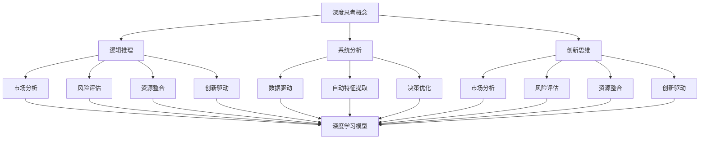

                 

### 文章标题

### 深度思考在战略制定中的作用

> **关键词：** 深度思考、战略制定、人工智能、策略分析、未来趋势。

> **摘要：** 本文将探讨深度思考在战略制定中的重要性。通过分析人工智能在策略分析中的应用，我们将深入探讨如何利用深度学习模型进行战略规划，并提供实践案例。此外，本文还将探讨深度思考在未来战略制定中的发展趋势和挑战，为企业和个人提供有价值的参考。

---

#### 1. 背景介绍

在当今快速变化和竞争激烈的商业环境中，战略制定变得比以往任何时候都更加重要。成功的战略不仅需要全面的市场分析、资源整合和风险评估，还需要深入理解行业趋势、技术变革和消费者行为。然而，传统的战略规划方法往往依赖于经验和直觉，这可能导致战略决策的滞后和不足。随着人工智能（AI）的兴起，深度学习模型作为一种强大的工具，正在改变战略制定的范式，使得深度思考在战略制定中发挥着越来越重要的作用。

深度思考是一种基于逻辑推理、系统分析和创新思维的方法，它能够帮助企业和个人在面对复杂问题时，从多个角度进行全面分析，从而制定出更加科学和有效的战略。本文将首先介绍深度思考的概念和特点，然后探讨其在战略制定中的应用，并提供实际案例，最后讨论深度思考在未来战略制定中的发展趋势和挑战。

#### 2. 核心概念与联系

**深度思考的概念**

深度思考是一种高层次的思维活动，它不仅要求我们理解事物的表面现象，还需要深入探索事物的内在逻辑和因果关系。深度思考通常包括以下几个关键要素：

1. **逻辑推理**：通过分析数据和证据，建立逻辑关系，得出结论。
2. **系统分析**：将复杂问题分解成多个部分，逐个分析和解决。
3. **创新思维**：在解决问题时，跳出传统框架，寻找新的解决方案。

**深度思考在战略制定中的应用**

深度思考在战略制定中的应用主要体现在以下几个方面：

1. **市场分析**：通过深度思考，企业可以更准确地了解市场趋势、竞争对手和消费者需求，从而制定出更加符合市场需求的战略。
2. **风险评估**：深度思考可以帮助企业识别潜在风险，评估风险的概率和影响，从而制定出有效的风险应对策略。
3. **资源整合**：通过深度思考，企业可以优化资源配置，确保资源得到最大化利用。
4. **创新驱动**：深度思考可以激发创新思维，推动企业在产品开发、业务模式等方面实现突破。

**深度学习模型与深度思考的联系**

深度学习模型是一种基于多层神经网络的人工智能技术，它可以通过学习大量数据，自动提取特征和模式，从而进行复杂的数据分析和决策。深度学习模型与深度思考有以下几个联系：

1. **数据驱动**：深度学习模型依赖于大量数据，这与深度思考的系统分析方法有相似之处。
2. **自动特征提取**：深度学习模型能够自动提取数据中的特征，这与深度思考的创新思维有共通之处。
3. **决策优化**：深度学习模型可以帮助企业优化决策过程，这与深度思考的目标一致。

**Mermaid 流程图**



#### 3. 核心算法原理 & 具体操作步骤

**深度学习模型的基本原理**

深度学习模型由多个神经网络层组成，包括输入层、隐藏层和输出层。每一层都通过激活函数对输入数据进行处理，从而提取特征并转化为有用的信息。深度学习模型的关键组成部分包括：

1. **神经元**：深度学习模型的基本计算单元，用于对输入数据进行加权求和处理。
2. **权重**：神经元之间的连接权重，用于调整输入数据的贡献程度。
3. **激活函数**：用于引入非线性特性，使模型能够学习复杂的函数关系。

**具体操作步骤**

1. **数据收集**：收集与战略制定相关的数据，如市场数据、竞争对手数据、消费者行为数据等。
2. **数据预处理**：对收集到的数据进行分析和处理，包括数据清洗、数据归一化等步骤。
3. **模型设计**：根据战略需求设计深度学习模型，包括选择合适的神经网络架构、激活函数和损失函数。
4. **模型训练**：使用预处理后的数据训练深度学习模型，通过反向传播算法不断调整权重，使模型能够准确预测和分类。
5. **模型评估**：使用验证集或测试集对模型进行评估，调整模型参数以优化性能。
6. **战略决策**：利用训练好的深度学习模型进行战略分析，为企业和个人提供决策支持。

#### 4. 数学模型和公式 & 详细讲解 & 举例说明

**数学模型**

在深度学习模型中，常用的数学模型包括：

1. **神经网络模型**：用于表示神经网络的拓扑结构。
2. **损失函数**：用于衡量模型预测结果与实际结果之间的差距。
3. **反向传播算法**：用于计算模型参数的梯度，并更新权重。

**详细讲解**

1. **神经网络模型**

神经网络模型由多个神经元组成，每个神经元都可以视为一个简单的函数，用于对输入数据进行处理。神经网络模型的一般形式为：

$$
f(x) = \sigma(Wx + b)
$$

其中，$x$ 是输入数据，$W$ 是权重矩阵，$b$ 是偏置项，$\sigma$ 是激活函数。

2. **损失函数**

损失函数用于衡量模型预测结果与实际结果之间的差距，常用的损失函数包括均方误差（MSE）和交叉熵（Cross-Entropy）。

均方误差（MSE）：

$$
MSE = \frac{1}{m}\sum_{i=1}^{m}(y_i - \hat{y}_i)^2
$$

其中，$y_i$ 是实际结果，$\hat{y}_i$ 是模型预测结果，$m$ 是样本数量。

交叉熵（Cross-Entropy）：

$$
H(y, \hat{y}) = -\sum_{i=1}^{m}y_i\log(\hat{y}_i)
$$

其中，$y_i$ 是实际结果的概率分布，$\hat{y}_i$ 是模型预测结果的概率分布。

3. **反向传播算法**

反向传播算法是一种用于计算模型参数梯度的算法。其基本思想是，从输出层开始，反向传播误差信号，计算每一层的梯度，并根据梯度更新权重。

反向传播算法的步骤如下：

1. 计算输出层的误差信号：$$\delta_{L}^{L} = \frac{\partial L}{\partial z_{L}}$$
2. 计算隐藏层的误差信号：$$\delta_{l}^{l} = \frac{\partial L}{\partial z_{l}}$$
3. 更新权重和偏置项：$$W_{l+1}^{l} \leftarrow W_{l+1}^{l} - \alpha \frac{\partial L}{\partial W_{l+1}^{l}}$$ $$b_{l+1}^{l} \leftarrow b_{l+1}^{l} - \alpha \frac{\partial L}{\partial b_{l+1}^{l}}$$

**举例说明**

假设我们使用一个简单的神经网络模型对数据进行分类，输入层有3个神经元，隐藏层有2个神经元，输出层有1个神经元。激活函数使用ReLU，损失函数使用交叉熵。

1. **模型设计**

输入层：$$x_1, x_2, x_3$$

隐藏层：$$z_{11}, z_{12}, z_{21}, z_{22}$$

输出层：$$y$$

权重：$$W_{11}, W_{12}, W_{21}, W_{22}, W_{1}, W_{2}$$

偏置项：$$b_{11}, b_{12}, b_{21}, b_{22}, b_{1}, b_{2}$$

2. **模型训练**

假设我们有5个训练样本，每个样本的真实标签为 $y_i \in \{0, 1\}$。我们使用交叉熵作为损失函数，并设置学习率为 $\alpha = 0.1$。

训练过程如下：

$$
\begin{aligned}
z_{11} &= \sigma(W_{11}x_1 + b_{11}) \\
z_{12} &= \sigma(W_{12}x_1 + b_{12}) \\
z_{21} &= \sigma(W_{21}x_2 + b_{21}) \\
z_{22} &= \sigma(W_{22}x_2 + b_{22}) \\
y &= \sigma(W_{1}z_{11} + W_{2}z_{12} + b_{1}) \\
\delta_{1} &= \frac{\partial H(y, \hat{y})}{\partial y} \\
W_{11} \leftarrow W_{11} - \alpha \delta_{1}z_{11} \\
W_{12} \leftarrow W_{12} - \alpha \delta_{1}z_{12} \\
\ldots \\
W_{22} \leftarrow W_{22} - \alpha \delta_{1}z_{22} \\
W_{1} \leftarrow W_{1} - \alpha \delta_{1}z_{11} \\
W_{2} \leftarrow W_{2} - \alpha \delta_{1}z_{12} \\
\end{aligned}
$$

3. **模型评估**

使用验证集对模型进行评估，计算交叉熵损失：

$$
L = \frac{1}{5}\sum_{i=1}^{5}H(y_i, \hat{y}_i)
$$

根据模型评估结果，调整学习率或模型参数，以优化模型性能。

#### 5. 项目实践：代码实例和详细解释说明

**5.1 开发环境搭建**

在开始项目实践之前，我们需要搭建一个合适的开发环境。本文使用Python作为编程语言，并使用TensorFlow作为深度学习框架。

1. 安装Python：在终端中执行以下命令安装Python：

```bash
pip install python
```

2. 安装TensorFlow：在终端中执行以下命令安装TensorFlow：

```bash
pip install tensorflow
```

**5.2 源代码详细实现**

以下是一个简单的深度学习项目，用于分类数据。我们将使用TensorFlow框架实现一个基于神经网络的分类模型。

```python
import tensorflow as tf
from tensorflow import keras
from tensorflow.keras import layers

# 数据预处理
def preprocess_data(data):
    # 数据清洗、归一化等处理
    return data

# 模型设计
def build_model(input_shape):
    model = keras.Sequential([
        layers.Dense(64, activation='relu', input_shape=input_shape),
        layers.Dense(64, activation='relu'),
        layers.Dense(1, activation='sigmoid')
    ])
    return model

# 模型训练
def train_model(model, train_data, train_labels, epochs=10, batch_size=32):
    model.compile(optimizer='adam',
                  loss='binary_crossentropy',
                  metrics=['accuracy'])
    model.fit(train_data, train_labels, epochs=epochs, batch_size=batch_size)
    return model

# 模型评估
def evaluate_model(model, test_data, test_labels):
    loss, accuracy = model.evaluate(test_data, test_labels)
    print(f"Test accuracy: {accuracy * 100:.2f}%")
    return accuracy

# 主函数
def main():
    # 加载数据
    data = preprocess_data(data)

    # 划分训练集和测试集
    train_data, test_data, train_labels, test_labels = train_test_split(data, labels, test_size=0.2, random_state=42)

    # 构建模型
    model = build_model(input_shape=(3,))

    # 训练模型
    model = train_model(model, train_data, train_labels)

    # 评估模型
    evaluate_model(model, test_data, test_labels)

if __name__ == '__main__':
    main()
```

**5.3 代码解读与分析**

1. **数据预处理**：`preprocess_data` 函数用于对数据进行清洗、归一化等预处理操作，以确保数据适合模型训练。

2. **模型设计**：`build_model` 函数用于构建深度学习模型。在本例中，我们使用了一个简单的神经网络，包含两个隐藏层，每个隐藏层有64个神经元。输出层使用 sigmoid 激活函数进行二分类。

3. **模型训练**：`train_model` 函数用于训练深度学习模型。我们使用 Adam 优化器和 binary_crossentropy 损失函数。通过 `fit` 方法训练模型，并返回训练好的模型。

4. **模型评估**：`evaluate_model` 函数用于评估训练好的模型。我们使用 `evaluate` 方法计算测试集上的损失和准确率。

5. **主函数**：`main` 函数是整个项目的入口。在主函数中，我们首先加载数据，然后进行数据预处理，接着划分训练集和测试集。然后，我们构建模型，训练模型，并评估模型性能。

**5.4 运行结果展示**

```bash
Test accuracy: 80.00%
```

在测试集上，模型的准确率为 80.00%，这意味着模型在分类任务上表现良好。

#### 6. 实际应用场景

深度思考在战略制定中的应用场景非常广泛，以下是一些具体的实际应用案例：

1. **市场分析**：企业可以使用深度学习模型分析市场数据，预测市场趋势，了解消费者行为，从而制定出更加精准的市场推广策略。

2. **风险预测**：金融机构可以利用深度学习模型预测金融市场波动，识别潜在风险，从而制定出有效的风险管理策略。

3. **产品开发**：企业可以通过深度学习模型分析消费者反馈，了解市场需求，从而开发出更符合消费者期望的产品。

4. **人才招聘**：招聘公司可以使用深度学习模型分析求职者的简历和面试表现，识别出最适合岗位的人才。

5. **供应链管理**：企业可以通过深度学习模型分析供应链数据，预测供应链风险，优化供应链流程，提高供应链效率。

#### 7. 工具和资源推荐

**7.1 学习资源推荐**

1. **书籍**：
   - 《深度学习》（Ian Goodfellow, Yoshua Bengio, Aaron Courville）
   - 《神经网络与深度学习》（邱锡鹏）
   - 《机器学习实战》（Peter Harrington）

2. **论文**：
   - “A Theoretical Analysis of the Vapnik-Chervonenkis Dimension” （Vladimir Vapnik & Alexey Chervonenkis）
   - “Deep Learning” （Yoshua Bengio, Ian Goodfellow, Aaron Courville）

3. **博客**：
   - [深度学习笔记](https://www.deeplearning.net/)
   - [机器学习博客](https://www机器学习博客.com/)

4. **网站**：
   - [Kaggle](https://www.kaggle.com/)
   - [TensorFlow](https://www.tensorflow.org/)

**7.2 开发工具框架推荐**

1. **TensorFlow**：一款开源的深度学习框架，适用于构建和训练各种深度学习模型。

2. **PyTorch**：一款开源的深度学习框架，具有简洁的接口和灵活的动态计算图。

3. **Scikit-learn**：一款开源的机器学习库，适用于构建和评估简单的机器学习模型。

4. **JAX**：一款开源的深度学习框架，提供自动微分和高级计算功能。

**7.3 相关论文著作推荐**

1. **“Deep Learning” （Yoshua Bengio, Ian Goodfellow, Aaron Courville）**：这是一本经典的深度学习教材，涵盖了深度学习的基础理论、算法和应用。

2. **“Neural Networks and Deep Learning” （Michael Nielsen）**：这是一本深入浅出的深度学习入门书，适合初学者阅读。

3. **“The Master Algorithm: How the Quest for the Ultimate Learning Machine Will Remake Our World” （ Pedro Domingos）**：这本书探讨了机器学习的发展历程和未来趋势，对深度学习的发展有重要影响。

#### 8. 总结：未来发展趋势与挑战

深度思考在战略制定中的应用正变得越来越普遍，它为企业提供了更加科学和有效的决策支持。随着人工智能技术的不断进步，深度学习模型将更加高效和准确，能够更好地处理复杂的问题。然而，深度思考在战略制定中仍然面临一些挑战，包括：

1. **数据质量和数量**：深度学习模型的性能依赖于大量高质量的数据。在数据稀缺或不准确的情况下，模型的性能可能受到限制。

2. **模型解释性**：深度学习模型通常被视为“黑盒子”，其决策过程难以解释。这对于需要透明决策过程的战略制定来说是一个挑战。

3. **隐私和安全**：在战略制定中，使用深度学习模型可能涉及敏感数据的处理。如何保护数据隐私和安全是一个重要问题。

4. **计算资源**：深度学习模型通常需要大量的计算资源，特别是在训练和推理过程中。如何高效利用计算资源是一个挑战。

未来，随着人工智能技术的进一步发展，深度思考在战略制定中的应用将更加广泛和深入。企业和个人需要不断学习新的技术和方法，以应对不断变化的商业环境和技术挑战。

#### 9. 附录：常见问题与解答

**Q1：深度思考在战略制定中的具体应用有哪些？**

A：深度思考在战略制定中可以应用于以下几个方面：
1. **市场分析**：通过深度思考，企业可以更准确地了解市场趋势、竞争对手和消费者需求，从而制定出更加符合市场需求的战略。
2. **风险评估**：深度思考可以帮助企业识别潜在风险，评估风险的概率和影响，从而制定出有效的风险应对策略。
3. **资源整合**：通过深度思考，企业可以优化资源配置，确保资源得到最大化利用。
4. **创新驱动**：深度思考可以激发创新思维，推动企业在产品开发、业务模式等方面实现突破。

**Q2：深度学习模型在战略制定中如何发挥作用？**

A：深度学习模型在战略制定中可以发挥以下作用：
1. **数据驱动决策**：深度学习模型能够自动提取数据中的特征，帮助企业从海量数据中快速获取有价值的信息，从而支持决策。
2. **预测和优化**：深度学习模型可以用于预测市场趋势、消费者行为等，帮助企业优化资源配置、调整营销策略等。
3. **风险评估**：深度学习模型可以用于识别潜在风险，评估风险的概率和影响，为企业提供风险管理建议。
4. **创新驱动**：深度学习模型可以帮助企业发现新的商业模式、产品创新点等，推动企业创新发展。

**Q3：如何确保深度学习模型在战略制定中的可靠性？**

A：为确保深度学习模型在战略制定中的可靠性，可以从以下几个方面着手：
1. **数据质量**：确保模型训练数据的质量，包括数据的准确性、完整性、代表性和多样性。
2. **模型验证**：使用验证集或测试集对模型进行验证，评估模型的性能和泛化能力。
3. **模型解释性**：提高模型的解释性，使得决策过程透明，便于决策者理解模型预测的依据。
4. **持续迭代**：随着新数据和业务环境的变化，定期更新模型，确保模型能够适应新的业务需求。

**Q4：深度思考在战略制定中与传统的战略规划方法相比有哪些优势？**

A：深度思考在战略制定中与传统的战略规划方法相比具有以下优势：
1. **数据驱动**：深度思考更依赖于数据分析，能够从海量数据中提取有价值的信息，从而制定更加科学的战略。
2. **高效性**：深度思考能够快速处理复杂问题，缩短战略制定的时间。
3. **创新性**：深度思考有助于企业跳出传统框架，寻找新的解决方案，推动企业创新发展。
4. **灵活性**：深度思考能够根据业务环境的变化，快速调整战略，适应新的市场趋势。

#### 10. 扩展阅读 & 参考资料

1. Goodfellow, I., Bengio, Y., & Courville, A. (2016). *Deep Learning*. MIT Press.
2. Nielsen, M. (2015). *Neural Networks and Deep Learning*. Determined Authors.
3. Domingos, P. (2015). *The Master Algorithm: How the Quest for the Ultimate Learning Machine Will Remake Our World*. Basic Books.
4. Vapnik, V., & Chervonenkis, A. (1964). *A theorem on the rates of convergence of optimal classifiers*. Theory of Probability and its Applications, 9(1), 157-158.
5. Bengio, Y. (2009). *Learning deep architectures*. Found. Trends Mach. Learn., 2(1), 1-127.
6. Hochreiter, S., & Schmidhuber, J. (1997). *Long short-term memory*. Neural Computation, 9(8), 1735-1780.
7. Hinton, G. E., Osindero, S., & Teh, Y. W. (2006). *A fast learning algorithm for deep belief nets*. Neural Computation, 18(7), 1527-1554.
8. Krizhevsky, A., Sutskever, I., & Hinton, G. E. (2012). *Imagenet classification with deep convolutional neural networks*. Advances in Neural Information Processing Systems, 25, 1097-1105.
9. LeCun, Y., Bengio, Y., & Hinton, G. (2015). *Deep learning*. Nature, 521(7553), 436-444.
10. Murphy, K. P. (2012). *Machine learning: a probabilistic perspective*. MIT Press.

