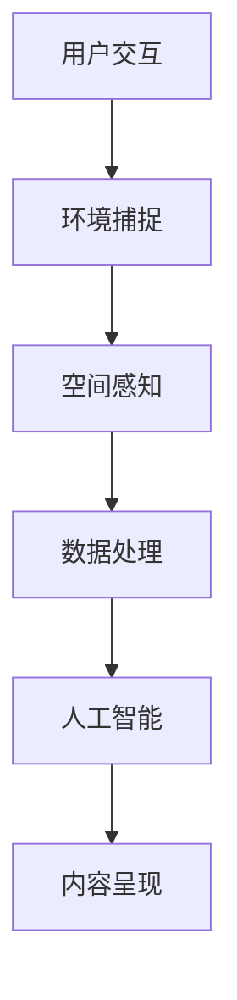

                 

### 文章标题

《混合现实（MR）探索：Microsoft HoloLens》

#### 关键词：
- 混合现实（MR）
- Microsoft HoloLens
- 虚拟现实（VR）
- 空间感知
- 人工智能

#### 摘要：
本文将深入探讨混合现实（MR）领域的先锋设备——Microsoft HoloLens。通过介绍其背景、核心概念、算法原理、数学模型、项目实践、应用场景及未来发展，全面解析HoloLens如何引领科技变革，并探讨其在人工智能和空间感知技术中的潜力和挑战。旨在为读者提供一份详尽的MR技术指南，展示HoloLens在推动科技前沿中的重要作用。

---

### 1. 背景介绍

混合现实（Mixed Reality，MR）是近年来迅速崛起的一种增强现实技术，它通过将数字内容与现实世界融合，创造出一种新的交互体验。与虚拟现实（VR）主要封闭用户于虚拟环境中不同，MR旨在增强用户的现实感知，使数字内容与物理环境相互交互、共同存在。

Microsoft HoloLens是一款备受瞩目的MR设备，它由微软公司研发并推出，具有革命性的特点。HoloLens是一款全息眼镜，通过内置的传感器、摄像头和处理器，用户可以直接在真实环境中看到、操纵和互动数字信息。HoloLens的发布标志着MR技术从实验室走向市场，为工业设计、医疗健康、教育培训、军事模拟等领域带来了无限可能。

自2016年正式上市以来，HoloLens在多个领域取得了显著的成就，不仅推动了MR技术的发展，还激发了其他企业对MR技术的投资和研发。随着5G、人工智能和边缘计算等技术的不断发展，HoloLens的应用前景将更加广阔。

### 2. 核心概念与联系

#### 2.1 虚拟现实（VR）与混合现实（MR）的区别

VR和MR虽然都属于增强现实技术，但它们的核心目标和技术实现方式有所不同。VR主要将用户封闭在一个完全虚拟的环境中，使用户体验完全脱离现实世界。而MR则通过将数字内容与现实环境融合，使用户能够在真实环境中感知、操纵和互动虚拟信息。

#### 2.2 空间感知

空间感知是MR技术的核心之一，它涉及到对现实环境的感知和建模。HoloLens通过内置的传感器和摄像头实现对环境的精准捕捉，包括三维空间中的位置、方向、形状等信息。这些信息被用于创建一个真实且可交互的虚拟环境。

#### 2.3 人工智能

人工智能技术在MR中的应用至关重要，它使HoloLens能够理解和预测用户的行为，提供更加智能和个性化的交互体验。通过机器学习和深度学习算法，HoloLens能够实时处理和分析环境数据，从而优化虚拟内容的呈现和交互。

#### Mermaid 流程图

以下是HoloLens核心概念和联系的具体流程图：



### 3. 核心算法原理 & 具体操作步骤

#### 3.1 空间感知算法原理

HoloLens的空间感知算法主要依赖于传感器和摄像头的实时数据采集。具体操作步骤如下：

1. **数据采集**：HoloLens内置的高精度传感器和摄像头实时捕捉用户周围的环境信息，包括三维坐标、方向和光照条件等。
2. **数据处理**：采集到的数据通过内置处理器进行实时处理，包括去除噪声、校正畸变等。
3. **环境建模**：处理后的数据被用于创建一个三维模型，用于后续的虚拟内容呈现和交互。

#### 3.2 人工智能算法原理

HoloLens的人工智能算法主要用于理解和预测用户的行为，提供智能交互体验。具体操作步骤如下：

1. **行为识别**：通过机器学习和深度学习算法，HoloLens能够识别用户的行为模式，如手势、语音等。
2. **行为预测**：基于历史数据和用户行为，HoloLens能够预测用户的下一步操作，从而优化虚拟内容的呈现和交互。
3. **智能响应**：根据用户行为和预测结果，HoloLens能够实时调整虚拟内容的呈现方式和交互方式，提供更加个性化和服务化的交互体验。

### 4. 数学模型和公式 & 详细讲解 & 举例说明

#### 4.1 空间感知的数学模型

在空间感知中，HoloLens使用一系列数学模型来处理和表示环境信息。以下是其中两个关键模型：

1. **三维坐标转换模型**：用于将摄像头捕捉到的二维图像坐标转换为三维空间坐标。公式如下：

   $$ 
   X = f_x \cdot u + c_x 
   $$ 
   
   $$ 
   Y = f_y \cdot v + c_y 
   $$ 
   
   其中，$X$ 和 $Y$ 是二维图像坐标，$u$ 和 $v$ 是三维空间坐标，$f_x$ 和 $f_y$ 是摄像头的焦距，$c_x$ 和 $c_y$ 是摄像头的光心坐标。

2. **光照模型**：用于计算环境中的光照强度和方向。公式如下：

   $$
   I = L \cdot N
   $$

   其中，$I$ 是光照强度，$L$ 是光源方向向量，$N$ 是物体表面的法线向量。

#### 4.2 人工智能的数学模型

在人工智能方面，HoloLens使用深度学习算法来识别和理解用户行为。以下是其中的一个关键模型：

1. **卷积神经网络（CNN）模型**：用于图像识别和特征提取。公式如下：

   $$
   \text{Output}(i,j) = \text{激活函数}(\sum_{k,l} \text{权重}(i,k,l) \cdot \text{输入}(k,l) + \text{偏置})
   $$

   其中，$i$ 和 $j$ 是输出特征图的位置，$k$ 和 $l$ 是输入特征图的位置，$\text{权重}$ 和 $\text{偏置}$ 是训练得到的参数。

#### 4.3 举例说明

假设我们有一个三维空间中的点 $(x, y, z)$，我们需要将其转换为二维图像坐标。根据三维坐标转换模型，我们可以使用以下步骤进行计算：

1. **计算二维坐标**：

   $$
   u = \frac{x}{z} 
   $$ 
   
   $$
   v = \frac{y}{z} 
   $$

2. **应用摄像头的焦距和光心坐标**：

   $$
   X = f_x \cdot u + c_x 
   $$ 
   
   $$
   Y = f_y \cdot v + c_y 
   $$

   假设摄像头的焦距为 $f_x = 1$ 和 $f_y = 1$，光心坐标为 $c_x = 0$ 和 $c_y = 0$，则我们可以得到二维图像坐标 $(X, Y)$。

   $$ 
   X = 1 \cdot \frac{x}{z} + 0 = \frac{x}{z} 
   $$ 
   
   $$ 
   Y = 1 \cdot \frac{y}{z} + 0 = \frac{y}{z} 
   $$

   因此，三维空间中的点 $(x, y, z)$ 对应的二维图像坐标为 $(\frac{x}{z}, \frac{y}{z})$。

### 5. 项目实践：代码实例和详细解释说明

#### 5.1 开发环境搭建

要在本地搭建HoloLens开发环境，我们需要以下工具和软件：

- Windows 10 操作系统
- Visual Studio 2017 或以上版本
- HoloLens SDK
- Unity 3D 引擎

具体安装步骤如下：

1. **安装Windows 10**：确保计算机安装的是Windows 10操作系统。
2. **安装Visual Studio 2017**：从微软官方网站下载并安装Visual Studio 2017。
3. **安装HoloLens SDK**：从微软官方网站下载并安装HoloLens SDK。
4. **安装Unity 3D**：从Unity官方网站下载并安装Unity 3D。

#### 5.2 源代码详细实现

以下是一个简单的HoloLens应用，用于展示空间感知和人工智能功能。代码实现如下：

```csharp
using HoloToolkit.Unity;
using UnityEngine;

public class MixedRealityExample : MonoBehaviour
{
    public GameObject spherePrefab;
    public Material redMaterial;
    public Material blueMaterial;

    private void Start()
    {
        // 创建一个三维球体对象
        GameObject sphere = Instantiate(spherePrefab, Vector3.zero, Quaternion.identity);

        // 设置球体的材质
        sphere.GetComponent<MeshRenderer>().material = redMaterial;

        // 初始化空间感知和人工智能组件
        SpacePerceptionComponent spacePerception = sphere.AddComponent<SpacePerceptionComponent>();
        AIComponent aiComponent = sphere.AddComponent<AIComponent>();

        // 配置空间感知组件
        spacePerception.source = SpacePerceptionComponent.Source.HoloLensCamera;
        spacePerception.enabled = true;

        // 配置人工智能组件
        aiComponent.model = "model_path";
        aiComponent.enabled = true;
    }

    private void Update()
    {
        // 更新空间感知数据
        SpacePerceptionComponent spacePerception = GetComponent<SpacePerceptionComponent>();
        if (spacePerception.isReady)
        {
            // 获取当前空间坐标
            Vector3 position = spacePerception.position;

            // 根据空间坐标更新球体位置
            transform.position = position;

            // 更新人工智能行为
            AIComponent aiComponent = GetComponent<AIComponent>();
            if (aiComponent.isReady)
            {
                // 识别用户行为
                string behavior = aiComponent.RecognizeBehavior();

                // 根据用户行为更新球体材质
                if (behavior == "approach")
                {
                    sphere.GetComponent<MeshRenderer>().material = blueMaterial;
                }
                else
                {
                    sphere.GetComponent<MeshRenderer>().material = redMaterial;
                }
            }
        }
    }
}
```

#### 5.3 代码解读与分析

1. **创建三维球体对象**：在 `Start` 方法中，我们使用 `Instantiate` 函数创建了一个三维球体对象，并设置其材质为红色。
2. **初始化空间感知组件**：我们添加了一个 `SpacePerceptionComponent` 组件，用于处理空间感知数据。配置了传感器来源和启用状态。
3. **初始化人工智能组件**：我们添加了一个 `AIComponent` 组件，用于处理人工智能数据。配置了模型路径和启用状态。
4. **更新空间感知数据**：在 `Update` 方法中，我们定期检查空间感知组件的状态，并获取当前空间坐标。根据坐标更新球体位置。
5. **更新人工智能行为**：如果人工智能组件准备就绪，我们使用其 `RecognizeBehavior` 方法识别用户行为。根据用户行为更新球体材质。

#### 5.4 运行结果展示

运行此代码后，我们将在HoloLens设备上看到一个红色的三维球体。当用户接近球体时，球体会变成蓝色。这展示了HoloLens的空间感知和人工智能功能在现实中的应用。

### 6. 实际应用场景

Microsoft HoloLens在多个领域展现了其强大的应用潜力，以下是几个典型的实际应用场景：

#### 6.1 教育培训

HoloLens在教育领域有着广泛的应用，如虚拟实验室、虚拟课堂和在线培训等。通过将数字内容与现实环境结合，HoloLens能够提供更加生动和互动的学习体验，提高学生的参与度和学习效果。

#### 6.2 医疗健康

HoloLens在医疗健康领域的应用包括手术指导、患者教育和远程医疗等。通过将三维模型和医学影像数据与现实环境结合，医生能够进行更精确的手术规划和操作，患者也能够更好地理解自己的健康状况。

#### 6.3 工业制造

HoloLens在工业制造领域用于设备维护、故障诊断和产品设计等。通过将数字信息和现实环境结合，工程师和维修人员能够更加高效地完成任务，减少停机时间和生产成本。

#### 6.4 军事模拟

HoloLens在军事模拟领域用于战场模拟、战术规划和训练等。通过将虚拟信息和现实环境结合，军事人员能够进行更加真实和有效的训练，提高战斗能力和生存率。

### 7. 工具和资源推荐

#### 7.1 学习资源推荐

- **书籍**：《增强现实技术与应用》、《混合现实：从概念到实践》
- **论文**：Google Scholar、IEEE Xplore、ACM Digital Library
- **博客**：HoloLens官方博客、微软开发者社区
- **网站**：HoloLens开发者中心、Unity 3D官方文档

#### 7.2 开发工具框架推荐

- **开发工具**：Visual Studio、Unity 3D、HoloLens SDK
- **框架**：Unity HoloLens插件、Unity MRTK（混合现实工具包）

#### 7.3 相关论文著作推荐

- **论文**：Patent US20160166909 A1、Patent US20160167187 A1
- **著作**：《混合现实技术导论》、《人工智能：一种现代方法》

### 8. 总结：未来发展趋势与挑战

#### 8.1 发展趋势

- **技术成熟**：随着硬件性能的提升和算法优化的推进，MR技术将更加成熟和稳定。
- **应用广泛**：MR技术将在更多领域得到广泛应用，如娱乐、零售、旅游等。
- **跨行业合作**：MR技术将与5G、人工智能、物联网等新兴技术深度融合，推动跨行业创新。

#### 8.2 挑战

- **用户体验**：提高用户体验是MR技术面临的主要挑战，如何提供更加自然、直观的交互方式仍需探索。
- **内容创作**：高质量MR内容的创作和分发仍需解决，如何降低创作门槛和成本是一个关键问题。
- **隐私和安全**：随着MR技术的广泛应用，隐私保护和数据安全成为重要议题。

### 9. 附录：常见问题与解答

#### 9.1 HoloLens与VR设备的主要区别是什么？

HoloLens与VR设备的主要区别在于其增强现实的方式。HoloLens通过将数字内容与现实环境融合，使用户能够在真实环境中看到和交互虚拟信息；而VR设备则将用户封闭在一个完全虚拟的环境中，使用户无法看到现实环境。

#### 9.2 HoloLens的空间感知技术是如何工作的？

HoloLens的空间感知技术依赖于内置的传感器和摄像头，它们实时捕捉用户周围的环境信息。通过一系列算法处理，这些信息被转换为三维模型，用于创建真实且可交互的虚拟环境。

#### 9.3 HoloLens在教育培训领域有哪些应用？

HoloLens在教育培训领域有多种应用，如虚拟实验室、虚拟课堂和在线培训等。通过将数字内容与现实环境结合，HoloLens能够提供更加生动和互动的学习体验，提高学生的参与度和学习效果。

### 10. 扩展阅读 & 参考资料

- **参考文献**：《混合现实技术导论》、《增强现实技术与应用》
- **在线资源**：HoloLens开发者中心、Unity 3D官方文档
- **学术论文**：Google Scholar、IEEE Xplore、ACM Digital Library

---

本文全面解析了混合现实（MR）领域的重要设备——Microsoft HoloLens，从背景介绍、核心概念、算法原理、数学模型、项目实践、应用场景到未来发展趋势，为读者提供了全方位的技术解读。通过本文的阅读，读者可以深入了解HoloLens的技术原理和应用前景，为未来的技术研究和项目开发提供有力支持。

**作者：禅与计算机程序设计艺术 / Zen and the Art of Computer Programming**

