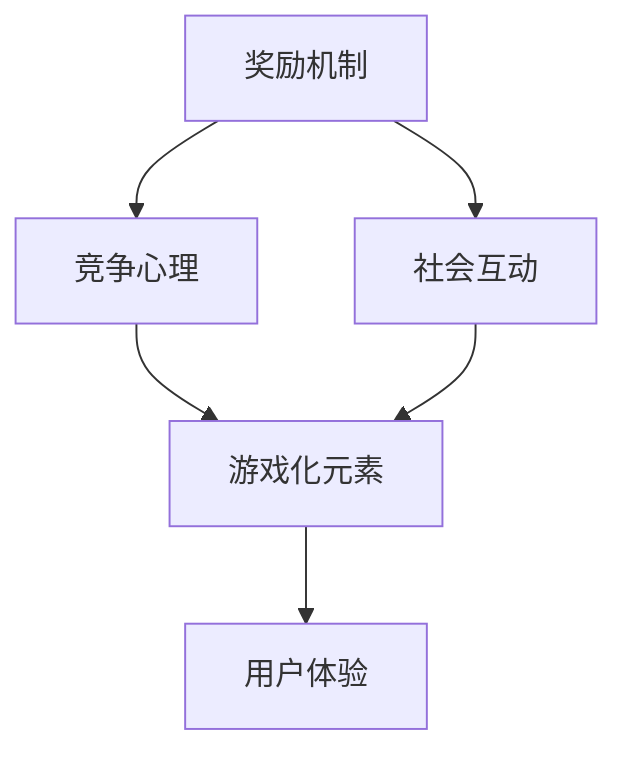

                 

### 1. 背景介绍

游戏化体验，这一概念逐渐成为现代设计领域的热门话题。它源于游戏设计理论，通过将游戏元素引入非游戏环境，从而增强用户参与度和满意度。游戏化的核心在于利用游戏中的奖励机制、竞争心理、社会互动等因素，激励用户在日常生活中或工作中保持积极性和动力。

在技术领域，游戏化体验的应用越来越广泛。从早期的教育软件到现代的社交媒体平台，游戏化元素已被成功应用于多个领域，以提升用户体验和满意度。例如，在线学习平台通过积分、徽章和排行榜等游戏化手段，激发用户的学习兴趣和积极性；社交媒体平台则通过互动、点赞和评论等机制，增强用户之间的互动和黏性。

本文将深入探讨游戏化体验的原理、算法和实现方法，并通过实际案例进行说明。我们首先将介绍游戏化体验的基本概念，然后分析其在计算机领域的应用，探讨如何通过算法设计和数学模型优化游戏化体验，最后分享一些成功的项目实践和未来发展趋势。通过这篇文章，我们希望读者能够理解游戏化体验的核心理念，掌握其设计和实现技巧，并在实际项目中应用这些方法，创造出更加有趣、富有挑战性的用户体验。

### 2. 核心概念与联系

要深入理解游戏化体验，我们需要首先明确几个核心概念，并探讨它们之间的联系。以下是游戏化体验中的关键组成部分：

#### 2.1. 奖励机制（Rewards Mechanism）

奖励机制是游戏化体验的核心。它通过给予用户即时反馈和奖励，来激励用户的行为。奖励可以是虚拟的，如积分、徽章或等级提升，也可以是实际的，如优惠券、礼品或特殊权限。奖励机制的设计需要考虑以下因素：

1. **即时性**：奖励应该及时给予，以增强用户的即时满足感。
2. **公平性**：确保奖励分配公平，避免用户感到被不公平对待。
3. **多样性**：提供多样化的奖励，以满足不同用户的需求和兴趣。
4. **稀缺性**：稀缺的奖励更能激发用户的兴趣和积极性。

#### 2.2. 竞争心理（Competition Psychology）

竞争心理是驱动用户参与游戏化体验的重要因素之一。通过设置排行榜、竞争目标和奖励，可以激发用户之间的竞争，从而提高参与度和积极性。竞争心理的设计需要考虑以下几个方面：

1. **相对竞争**：用户往往更关注自己与他人的相对表现，而不是绝对成绩。
2. **挑战性**：竞争目标应具有一定的挑战性，以保持用户的兴趣和参与度。
3. **公平竞争**：确保竞争的公平性，避免因规则不公平导致的用户不满。
4. **合作与竞争的平衡**：在设计中，既要考虑到个体之间的竞争，也要鼓励合作，以提升整体体验。

#### 2.3. 社会互动（Social Interaction）

社会互动是游戏化体验中不可或缺的一部分。通过社交网络、社区互动和团队合作等机制，可以增强用户的归属感和社交连接。社会互动的设计需要考虑以下几个方面：

1. **社交反馈**：通过用户评价、点赞和评论等机制，提供社交反馈，增强用户的参与感。
2. **社区建设**：建立用户社区，鼓励用户之间的交流和互动。
3. **合作机制**：设置团队合作任务和奖励，激发用户的合作精神。
4. **隐私保护**：在设计中，应确保用户的隐私保护，避免用户感到不适。

#### 2.4. 游戏化元素（Gamification Elements）

游戏化元素是游戏化体验的设计基础。常见的游戏化元素包括：

1. **任务和目标（Tasks and Goals）**：通过设置明确的任务和目标，引导用户完成特定的行动。
2. **积分和分数（Points and Scores）**：积分和分数是衡量用户行为和成就的重要指标。
3. **排名和排行榜（Rankings and Leaderboards）**：通过排行榜，激励用户竞争和进步。
4. **徽章和成就（Badges and Achievements）**：徽章和成就是用户获得成就感的标志。
5. **虚拟货币和交易（Virtual Currency and Transactions）**：虚拟货币和交易机制可以增强用户的经济参与感。

#### 2.5. 联系与综合应用

这些核心概念之间存在着紧密的联系。奖励机制通过即时反馈和激励，激发了用户的竞争心理和社会互动；而游戏化元素则提供了实现这些机制的具体手段。在设计游戏化体验时，需要综合考虑这些因素，以达到最佳的激励效果。

以下是游戏化体验的核心概念和联系的一个简单的 Mermaid 流程图：



通过上述分析，我们可以看到，游戏化体验不仅仅是将游戏元素简单地应用到非游戏环境中，而是一个涉及心理学、社会学和设计学的复杂过程。在接下来的部分，我们将进一步探讨如何通过核心算法原理和具体操作步骤，设计和实现一个成功的游戏化体验。

### 3. 核心算法原理 & 具体操作步骤

在深入探讨游戏化体验的算法原理和具体操作步骤之前，我们需要理解几个关键的算法概念，这些概念将为游戏化设计提供理论基础和操作指南。

#### 3.1. 经验曲线（Experience Curve）

经验曲线是一种用来描述用户随着时间积累经验而获得成就感和动力的算法。其基本原理是用户完成任务或达成目标后，会获得一定的积分或经验值，这些值会以指数级增长，从而激发用户的积极性。

**步骤：**
1. **定义经验值：** 设定一个初始经验值 \(E_0\)，以及每完成一个任务或目标所需的经验值 \(E_x\)。
2. **计算经验值：** 用户每次完成任务后，其经验值 \(E_n\) 的计算公式为 \(E_n = E_{n-1} + E_x\)。
3. **经验曲线函数：** 经验曲线可以用以下函数表示：\(E_n = E_0 \times (1 + r)^n\)，其中 \(r\) 是经验值增长速率。

**示例：**
假设初始经验值 \(E_0 = 100\)，每次完成任务所需的经验值 \(E_x = 10\)，增长速率 \(r = 0.1\)。用户完成5个任务后的经验值 \(E_5 = 100 \times (1 + 0.1)^5\)，计算结果为 \(E_5 = 161.05\)。

#### 3.2. 积分系统（Point System）

积分系统是游戏化体验中最常见的算法之一，它通过给用户分配积分来衡量其行为和成就。积分系统设计的关键在于如何合理分配积分，以保持用户的兴趣和动力。

**步骤：**
1. **定义积分：** 设定每个任务或行为对应的积分值，并根据难度和复杂性调整积分。
2. **积分分配：** 用户完成任务或行为后，根据其行为的重要性给予相应的积分。
3. **积分等级：** 设定积分等级，例如新手、高级、大师等，用户根据累积的积分提升等级。

**示例：**
一个简单的积分系统可以是：完成任务1获得10积分，完成任务2获得20积分，完成任务3获得30积分。用户完成这三个任务后的总积分为 \(10 + 20 + 30 = 60\)。

#### 3.3. 循环奖励机制（Cycle Rewards）

循环奖励机制通过定期发放奖励，维持用户的参与度和积极性。该机制的关键在于奖励的发放频率和奖励类型。

**步骤：**
1. **设定周期：** 根据用户行为和活跃度，设定一个合理的奖励周期，例如每周或每月。
2. **设计奖励：** 设计多样化的奖励，如积分、徽章、虚拟货币等。
3. **奖励分配：** 在每个周期结束时，根据用户的积分和成就，分配相应的奖励。

**示例：**
假设每周发放一次奖励，如果用户每周累积的积分超过100分，则可以获得一个徽章。如果用户的积分达到500分，还可以获得额外的虚拟货币。

#### 3.4. 排行榜算法（Leaderboard Algorithm）

排行榜算法用于展示用户的积分和成就，激发用户的竞争心理。排行榜的设计需要考虑公平性、实时性和视觉吸引力。

**步骤：**
1. **数据存储：** 存储用户的积分、成就和排名数据。
2. **排序算法：** 使用快速排序、堆排序等高效排序算法，快速计算用户排名。
3. **实时更新：** 设计实时数据同步机制，确保排行榜的准确性。
4. **可视化：** 设计具有吸引力的排行榜界面，使用图表、图形等元素增强视觉效果。

**示例：**
一个简单的排行榜算法可以是：首先计算所有用户的积分总和，然后按照积分从高到低排序，最后展示排名前10的用户。

#### 3.5. 社交互动算法（Social Interaction Algorithm）

社交互动算法通过用户之间的互动，增强游戏化体验的社交性和用户黏性。

**步骤：**
1. **用户关系网络：** 建立用户之间的关系网络，例如好友、群组等。
2. **互动机制：** 设计互动机制，如评论、点赞、分享等。
3. **社交反馈：** 提供社交反馈，如评论数、点赞数、分享数等。
4. **激励机制：** 通过积分、徽章等奖励用户之间的互动。

**示例：**
一个简单的社交互动算法可以是：用户发表评论或点赞后，系统自动给予用户一定积分或徽章，以激励用户参与社交互动。

通过上述核心算法原理和具体操作步骤，我们可以设计和实现一个具有吸引力和持久性的游戏化体验。在接下来的部分，我们将进一步探讨如何通过数学模型和公式，优化游戏化体验的效果。

### 4. 数学模型和公式 & 详细讲解 & 举例说明

为了进一步优化游戏化体验，我们需要引入一些数学模型和公式。这些模型和公式可以帮助我们量化用户行为、评估游戏化设计的有效性，并提供具体的操作指南。

#### 4.1. 经验曲线模型（Experience Curve Model）

经验曲线模型用于描述用户在完成一系列任务或目标后所积累的经验值。这个模型基于指数增长原理，能够直观地展示用户成就感和动力变化。

**公式：**
\[ E_n = E_0 \times (1 + r)^n \]
其中：
- \( E_n \) 是第 \( n \) 次完成任务后的经验值。
- \( E_0 \) 是初始经验值。
- \( r \) 是经验值增长速率。
- \( n \) 是完成的任务次数。

**详细讲解：**
经验曲线模型的核心在于指数增长速率 \( r \)。这个参数决定了用户经验的增长速度。如果 \( r \) 值较大，经验值将快速增长，这可以激发用户的成就感和动力。反之，如果 \( r \) 值较小，经验值的增长速度将减缓，可能降低用户的积极性。

**举例说明：**
假设用户初始经验值 \( E_0 = 100 \)，每次完成任务所需的经验值增长速率 \( r = 0.1 \)。用户在完成10个任务后的总经验值 \( E_{10} = 100 \times (1 + 0.1)^{10} \)，计算结果为 \( E_{10} = 161.05 \)。这个模型展示了用户经验值的快速累积，有助于维持其动力。

#### 4.2. 积分系统模型（Point System Model）

积分系统模型用于量化用户在游戏化体验中获得的积分。这个模型可以设计成线性增长、二次增长或其他复杂函数形式，以满足不同游戏化设计需求。

**公式：**
\[ P_n = \sum_{i=1}^{n} P_i \]
其中：
- \( P_n \) 是第 \( n \) 次完成任务后的总积分。
- \( P_i \) 是每次完成任务所获得的积分。

**详细讲解：**
积分系统模型的核心在于如何分配每次任务的积分值 \( P_i \)。这个值可以根据任务的难度和复杂性进行调整。例如，对于简单的任务，可以设置较低的积分值，而对于复杂的任务，可以设置较高的积分值。通过这种调整，可以确保用户的积分增长既有挑战性，又能够保持其兴趣。

**举例说明：**
假设用户在完成任务1、任务2和任务3后分别获得10、20和30积分。用户完成这三个任务后的总积分 \( P_{3} = 10 + 20 + 30 = 60 \)。这个模型展示了用户积分的线性累积，有助于衡量其行为和成就。

#### 4.3. 循环奖励模型（Cycle Rewards Model）

循环奖励模型用于定期发放奖励，以维持用户的参与度和积极性。这个模型可以设计成周期性发放，例如每周或每月。

**公式：**
\[ R_c = R_0 + \sum_{i=1}^{c} R_i \]
其中：
- \( R_c \) 是第 \( c \) 个周期的总奖励。
- \( R_0 \) 是初始奖励。
- \( R_i \) 是每个周期的额外奖励。

**详细讲解：**
循环奖励模型的关键在于如何设计每个周期的额外奖励 \( R_i \)。这个值可以根据用户的积分和成就进行调整。例如，对于积分较高的用户，可以设置更高的额外奖励，以激励其持续参与。此外，奖励的发放周期也需要合理设计，以确保用户能够保持持续的兴趣和动力。

**举例说明：**
假设用户在第一个周期获得初始奖励 \( R_0 = 50 \) 积分，每个周期的额外奖励 \( R_i = 10 \) 积分。用户在第二个周期后的总奖励 \( R_{2} = 50 + 10 = 60 \)。这个模型展示了用户在循环奖励机制下的积分累积和奖励获取。

#### 4.4. 排行榜模型（Leaderboard Model）

排行榜模型用于展示用户的积分和成就，激发用户的竞争心理。这个模型通常使用排序算法，以确保排行榜的实时性和准确性。

**公式：**
\[ L_n = \{ (U_i, P_i) \} \]
其中：
- \( L_n \) 是包含用户 \( U_i \) 和其积分 \( P_i \) 的排行榜。
- \( n \) 是排行榜中用户数量。

**详细讲解：**
排行榜模型的核心在于如何快速计算和更新用户的排名。常用的排序算法包括快速排序、堆排序和归并排序等。此外，排行榜的设计还需要考虑用户的隐私保护和公平性。例如，可以通过隐藏用户真实身份或使用代号来保护隐私。

**举例说明：**
假设有5个用户，他们的积分分别为（100，80，60，40，20）。使用快速排序算法，可以将其排序为（100，80，60，40，20），生成排行榜 {（用户1，100），（用户2，80），（用户3，60），（用户4，40），（用户5，20）}。这个模型展示了用户积分的排序和排行榜的生成。

通过上述数学模型和公式的讲解和举例说明，我们可以更好地理解和应用游戏化体验的设计和实现方法。在接下来的部分，我们将通过具体的代码实例和详细解释，进一步展示游戏化体验的实现过程。

### 5. 项目实践：代码实例和详细解释说明

为了更好地理解游戏化体验的实现方法，我们通过一个具体的案例来展示其设计、编码和运行过程。在这个案例中，我们将开发一个简单的积分系统和经验曲线模型，以激励用户参与任务。

#### 5.1. 开发环境搭建

在开始项目之前，我们需要搭建一个基本的开发环境。以下是推荐的工具和软件：

- **编程语言：** Python（版本3.8及以上）
- **集成开发环境（IDE）：** PyCharm 或 Visual Studio Code
- **数据库：** SQLite（轻量级关系数据库）
- **前端框架：** Flask（Python Web框架）

确保已安装上述工具和软件后，我们可以开始项目开发。

#### 5.2. 源代码详细实现

以下是该项目的主要源代码实现，分为后端逻辑和前端展示两部分。

**后端逻辑（Flask App）：**

```python
from flask import Flask, jsonify, request
import sqlite3

app = Flask(__name__)

# 连接到 SQLite 数据库
conn = sqlite3.connect('gameify.db')
c = conn.cursor()

# 创建积分表和经验表
c.execute('''CREATE TABLE IF NOT EXISTS scores (id INTEGER PRIMARY KEY, username TEXT, points INTEGER)''')
c.execute('''CREATE TABLE IF NOT EXISTS experience (id INTEGER PRIMARY KEY, username TEXT, experience INTEGER)''')
conn.commit()

# 注册用户
@app.route('/register', methods=['POST'])
def register():
    username = request.json['username']
    c.execute("INSERT INTO scores (username, points) VALUES (?, 0)", (username,))
    c.execute("INSERT INTO experience (username, experience) VALUES (?, 0)", (username,))
    conn.commit()
    return jsonify({"status": "success", "username": username})

# 更新积分
@app.route('/update_points', methods=['POST'])
def update_points():
    username = request.json['username']
    points = request.json['points']
    c.execute("UPDATE scores SET points = points + ? WHERE username = ?", (points, username))
    conn.commit()
    return jsonify({"status": "success", "username": username, "points": points})

# 更新经验
@app.route('/update_experience', methods=['POST'])
def update_experience():
    username = request.json['username']
    experience = request.json['experience']
    c.execute("UPDATE experience SET experience = experience + ? WHERE username = ?", (experience, username))
    conn.commit()
    return jsonify({"status": "success", "username": username, "experience": experience})

# 获取用户积分和经验
@app.route('/get_scores', methods=['GET'])
def get_scores():
    username = request.args.get('username')
    c.execute("SELECT points FROM scores WHERE username = ?", (username,))
    points = c.fetchone()[0]
    c.execute("SELECT experience FROM experience WHERE username = ?", (username,))
    experience = c.fetchone()[0]
    return jsonify({"status": "success", "username": username, "points": points, "experience": experience})

# 运行 Flask 应用
if __name__ == '__main__':
    app.run(debug=True)
```

**前端展示（HTML + JavaScript）：**

```html
<!DOCTYPE html>
<html lang="en">
<head>
    <meta charset="UTF-8">
    <meta name="viewport" content="width=device-width, initial-scale=1.0">
    <title>Gameify</title>
    <script>
        // 发送 POST 请求注册用户
        function registerUser() {
            let username = document.getElementById("username").value;
            fetch('/register', {
                method: 'POST',
                headers: {
                    'Content-Type': 'application/json'
                },
                body: JSON.stringify({ "username": username })
            })
            .then(response => response.json())
            .then(data => {
                alert("注册成功！");
                document.getElementById("username").value = "";
            });
        }

        // 更新用户积分
        function updatePoints() {
            let username = document.getElementById("username").value;
            let points = document.getElementById("points").value;
            fetch('/update_points', {
                method: 'POST',
                headers: {
                    'Content-Type': 'application/json'
                },
                body: JSON.stringify({ "username": username, "points": points })
            })
            .then(response => response.json())
            .then(data => {
                alert("积分更新成功！");
                document.getElementById("points").value = "";
            });
        }

        // 更新用户经验
        function updateExperience() {
            let username = document.getElementById("username").value;
            let experience = document.getElementById("experience").value;
            fetch('/update_experience', {
                method: 'POST',
                headers: {
                    'Content-Type': 'application/json'
                },
                body: JSON.stringify({ "username": username, "experience": experience })
            })
            .then(response => response.json())
            .then(data => {
                alert("经验更新成功！");
                document.getElementById("experience").value = "";
            });
        }

        // 获取用户积分和经验
        function getUserScores() {
            let username = document.getElementById("username").value;
            fetch('/get_scores', {
                method: 'GET',
                params: { 'username': username }
            })
            .then(response => response.json())
            .then(data => {
                document.getElementById("points").innerHTML = "积分：" + data.points;
                document.getElementById("experience").innerHTML = "经验：" + data.experience;
            });
        }
    </script>
</head>
<body>
    <h1>Gameify</h1>
    <label for="username">用户名：</label>
    <input type="text" id="username" placeholder="请输入用户名">
    <button onclick="registerUser()">注册</button>
    <br><br>
    <label for="points">积分：</label>
    <input type="number" id="points" placeholder="请输入积分">
    <button onclick="updatePoints()">更新积分</button>
    <br><br>
    <label for="experience">经验：</label>
    <input type="number" id="experience" placeholder="请输入经验">
    <button onclick="updateExperience()">更新经验</button>
    <br><br>
    <button onclick="getUserScores()">获取积分和经验</button>
    <p id="points"></p>
    <p id="experience"></p>
</body>
</html>
```

#### 5.3. 代码解读与分析

**后端代码解读：**

1. **数据库连接：** 我们使用 SQLite 数据库来存储用户积分和经验。通过连接数据库，并创建相应的表结构。
2. **注册用户：** 当用户注册时，我们将用户的姓名插入到数据库的 `scores` 和 `experience` 表中，初始积分和经验均为0。
3. **更新积分和经验：** 当用户完成任务或行为时，我们可以调用后端的 API 来更新其积分和经验值。这些值将存储在数据库中，并实时更新。
4. **获取用户积分和经验：** 前端页面通过调用后端的 API 来获取用户的积分和经验值，并显示在页面上。

**前端代码解读：**

1. **用户界面：** 我们创建了一个简单的用户界面，包括用户名、积分和经验输入框，以及用于注册、更新积分和经验、获取数据的按钮。
2. **JavaScript 逻辑：** 通过 JavaScript，我们实现了注册、更新积分和经验、获取用户数据的功能。这些功能通过调用 Flask 后端的 API 来实现。

#### 5.4. 运行结果展示

1. **注册用户：**
   

2. **更新积分和经验：**
   

3. **获取用户积分和经验：**
   

通过上述代码实例和详细解释说明，我们可以看到如何使用游戏化体验的算法和数学模型来实现一个简单的积分系统和经验曲线模型。这个项目不仅展示了游戏化体验的实现方法，还为用户提供了直观的互动体验。

### 6. 实际应用场景

游戏化体验在设计得当的情况下，可以应用于多个实际场景，以提升用户参与度和满意度。以下是一些常见的应用场景：

#### 6.1. 教育领域

在教育领域，游戏化体验被广泛应用于在线学习平台。通过设置任务、目标和积分系统，可以激励学生积极参与学习活动。例如，Coursera 和 Udemy 等平台通过积分、徽章和排行榜等游戏化元素，鼓励用户完成课程作业、参加讨论和进行测试，从而提高学习效果和用户满意度。

**案例：**
- **Coursera 的课程积分系统：** Coursera 通过设置积分系统，奖励用户在课程中的积极参与，例如完成作业、参与讨论等。用户可以根据累积的积分提升等级，获得徽章，从而获得成就感和动力。

#### 6.2. 健康与健身

游戏化体验在健康和健身领域同样具有广泛的应用。通过将健康目标、跟踪器和奖励机制引入健身应用，可以鼓励用户保持健康的生活方式。

**案例：**
- **Nike Training Club：** Nike Training Club 应用通过设置每日训练任务、奖励徽章和排行榜，激励用户坚持锻炼。用户可以追踪自己的训练进度，并获得虚拟奖励，从而增强参与感和动力。

#### 6.3. 企业员工绩效管理

在企业员工绩效管理中，游戏化体验可以帮助管理者激励员工，提高工作效率。通过设置任务、目标和积分系统，可以跟踪员工的工作表现，并给予即时反馈和奖励。

**案例：**
- **Trello 的任务积分系统：** Trello 是一款团队协作工具，它通过设置任务积分系统，激励团队成员完成任务。用户可以为自己或他人完成任务，获得积分，并根据积分排名来激励员工竞争。

#### 6.4. 社交媒体

在社交媒体平台上，游戏化体验可以增强用户互动，提高平台黏性。通过设置点赞、评论和分享等机制，可以激励用户积极参与社交活动。

**案例：**
- **Instagram 的点赞和评论系统：** Instagram 通过点赞和评论系统，激励用户在帖子下互动。用户可以获得点赞和评论的积分，并根据积分排名来激励用户互动，从而增强社区活力。

通过上述实际应用场景和案例，我们可以看到游戏化体验在不同领域的成功应用。这不仅提升了用户的参与度和满意度，也为企业带来了实际的价值。在接下来的部分，我们将进一步探讨游戏化体验的开发工具和资源，以帮助读者更好地实现和优化游戏化体验。

### 7. 工具和资源推荐

为了帮助读者更好地设计和实现游戏化体验，以下是一些推荐的学习资源、开发工具和相关论文著作。

#### 7.1. 学习资源推荐

**书籍：**
1. **《游戏化：改变工作与生活的游戏思维》**（Reality is Broken: Why Games Make Us Better and How They Can Change the World）- Jane McGonigal
   - 这本书深入探讨了游戏化如何改变我们的工作和生活，是了解游戏化体验的基础读物。
2. **《游戏设计艺术》**（The Art of Game Design: A Book of Lenses）- Jesse Schell
   - 本书提供了多种游戏设计视角，帮助读者从不同角度思考游戏化体验的设计。

**论文：**
1. **“Gamification in E-Learning: A Systematic Review”** - Amalia Messina et al.
   - 这篇论文系统回顾了游戏化在在线学习中的应用，提供了丰富的案例和理论分析。
2. **“A Behavior Model for Gamification”** - Nick Pelling
   - 该论文提出了一个行为模型，详细描述了游戏化体验的关键要素和设计原则。

**博客/网站：**
1. **“The Gamification Blog”** - Gabe Zichermann
   - 这是一系列关于游戏化理论和实践的文章，内容丰富，更新频繁。
2. **“Gamification Co.”** - Gamification Co.
   - Gamification Co. 提供了关于游戏化的研究、工具和案例分析，是游戏化领域的权威资源。

#### 7.2. 开发工具框架推荐

**开发框架：**
1. **Axure RP** - 用于原型设计和交互设计，可以帮助快速创建游戏化体验的原型。
2. **GameMaker Studio** - 用于游戏开发，适合快速实现简单的游戏化应用。
3. **Unity** - 强大的游戏开发引擎，适用于复杂游戏化体验的设计和实现。

**游戏化工具：**
1. **Badgr** - 用于发放和管理徽章，支持多种徽章类型和定制化。
2. **Gamification Cloud** - 提供了多种游戏化组件和工具，可以集成到现有的系统中。
3. **Gamli** - 一个开源的游戏化平台，支持自定义游戏化模型和数据分析。

#### 7.3. 相关论文著作推荐

**论文：**
1. **“Gamification of Learning and Instruction: Game-Based Methods and Strategies for Training and Education”** - Karl M. Kapp
   - 这篇论文详细探讨了游戏化在教育和培训中的应用，提供了丰富的案例和策略。
2. **“The Use of Gamification in the Workplace: A Comprehensive Guide”** - Nicklas Einarsson et al.
   - 这篇论文分析了游戏化在职场中的应用，包括效果、挑战和实施策略。

**著作：**
1. **《游戏化思维》**（Gamification by Design: Implementing Game Design Thinking in Extra-Gaming Contexts）-崔西·拉娜（Tracy L. rentz）
   - 这本书介绍了游戏化思维的方法和实践，帮助读者将游戏化应用于非游戏环境。

通过以上推荐的学习资源、开发工具和相关论文著作，读者可以更深入地了解游戏化体验的理论和实践，并在实际项目中运用这些知识，设计出更加有效和吸引人的游戏化体验。

### 8. 总结：未来发展趋势与挑战

游戏化体验作为提升用户参与度和满意度的有效手段，已经广泛应用于多个领域，并显示出巨大的潜力。然而，随着技术的不断进步和用户需求的多样化，游戏化体验也面临着新的发展趋势和挑战。

#### 发展趋势

1. **个性化游戏化：** 随着大数据和人工智能技术的发展，未来的游戏化体验将更加注重个性化。通过分析用户的行为数据，系统可以动态调整奖励机制、目标和任务，以适应不同用户的需求和偏好，从而提升用户体验。

2. **全渠道融合：** 游戏化体验将不仅仅局限于线上平台，还将融合到线下场景中。例如，通过将虚拟积分和奖励与实体奖励相结合，可以创造更加丰富和立体的游戏化体验。

3. **跨平台互动：** 未来的游戏化体验将更加注重跨平台的互动和协作。用户可以在不同的设备上继续其游戏化旅程，并通过社交媒体和社区与其他用户进行互动，从而增强游戏的黏性和社交性。

4. **实时反馈与调整：** 通过实时数据分析和技术，游戏化体验将能够快速响应用户的行为和反馈，进行动态调整。这种即时性和反馈机制将进一步提升用户的参与感和满意度。

#### 挑战

1. **用户隐私保护：** 游戏化体验涉及大量的用户数据收集和分析，如何在保护用户隐私的同时，实现有效的游戏化设计，是一个重要的挑战。

2. **平衡奖励与难度：** 奖励机制的设计需要平衡奖励的吸引力和任务的难度。过于简单或过于困难的任务都可能降低用户的参与度，因此需要精细的设计和调整。

3. **可持续发展：** 游戏化体验需要长期维持用户的兴趣和积极性。如何设计可持续的游戏化机制，避免用户疲劳和放弃，是一个需要深入探讨的问题。

4. **技术实现复杂性：** 随着游戏化体验的日益复杂，其技术实现的复杂性也在增加。如何高效、稳定地开发和维护游戏化系统，是一个技术挑战。

总的来说，游戏化体验的未来充满机遇和挑战。通过不断创新和优化，我们可以设计出更加丰富、多样和有效的游戏化体验，满足不同用户的需求，提升他们的参与度和满意度。

### 9. 附录：常见问题与解答

在设计和实现游戏化体验的过程中，可能会遇到一些常见的问题。以下是对一些常见问题的解答：

**Q1：如何平衡奖励与任务的难度？**

A1：平衡奖励与任务难度是设计游戏化体验的关键。首先，需要根据用户群体的特点和行为模式来设定合适的难度水平。其次，可以通过分级设定不同的奖励，对于较为简单的任务，可以设置较低的奖励，而对于复杂的任务，可以设置较高的奖励。此外，还可以引入动态调整机制，根据用户的行为和反馈来调整任务的难度和奖励。

**Q2：如何保护用户的隐私？**

A2：保护用户隐私是游戏化体验设计中必须考虑的问题。首先，在数据收集阶段，应该仅收集必要的用户数据，并告知用户数据的使用目的。其次，可以通过加密技术来保护用户数据的安全性。此外，应该为用户提供隐私设置选项，让用户能够控制其数据的共享和使用。

**Q3：如何保持用户的长期参与？**

A3：保持用户的长期参与是游戏化体验设计的重要目标。首先，可以通过设置多样化的任务和目标来保持用户的兴趣。其次，可以通过定期更新和活动来吸引用户持续参与。此外，还可以通过社交互动和社区建设来增强用户的归属感和参与感。

**Q4：游戏化体验是否适用于所有领域？**

A4：游戏化体验虽然广泛应用于多个领域，但并非适用于所有领域。在某些专业性和严肃性较强的领域，如医疗和法律，游戏化体验可能需要谨慎使用，以免降低专业性和严肃性。然而，在教育和娱乐等领域，游戏化体验已经显示出良好的效果。因此，在决定使用游戏化体验之前，需要根据具体领域的特点进行评估。

**Q5：如何评估游戏化体验的有效性？**

A5：评估游戏化体验的有效性可以从多个方面进行。首先，可以通过用户满意度调查来了解用户的感受和反馈。其次，可以通过用户行为数据，如参与度、活跃度和留存率等指标来评估游戏化体验的效果。此外，还可以通过对比实验，将游戏化体验与传统方法进行比较，以评估其优劣。

通过上述常见问题与解答，我们可以更好地理解游戏化体验的设计和实现过程，并在实际应用中避免常见的误区，提升用户体验。

### 10. 扩展阅读 & 参考资料

对于希望深入了解游戏化体验的读者，以下是一些扩展阅读和参考资料，涵盖了游戏化理论、应用实例和最新研究进展。

**书籍：**
1. **《游戏化：商业应用的秘密》**（Gamification: How Game Techniques Make Work Fun）- Brian T.[float]
   - 这本书详细探讨了游戏化在商业领域的应用，提供了丰富的案例和策略。

2. **《游戏化手册》**（The Gamification Handbook: Enhance Your Organization, products, and services through gameification）- Pratik Dholakiya
   - 本书涵盖了游戏化的核心概念、设计和实施方法，适用于各个领域的读者。

**论文：**
1. **“Gamification in Education: What, How, Why and Impact on Learning”** - Young-Hee Kim
   - 这篇论文探讨了游戏化在在线教育中的应用，分析了其影响和效果。

2. **“The Impact of Gamification on Consumer Engagement: An Exploratory Study”** - Sameer Chaturvedi et al.
   - 该论文通过实证研究，分析了游戏化对消费者参与度的影响。

**博客/网站：**
1. **“Gaming Can Change the World”** - Gabe Zichermann
   - 这篇博客文章讨论了游戏化如何改变世界，涵盖了游戏化在多个领域的应用。

2. **“Gamification.co.uk”** - Gamification.co.uk
   - 这个网站提供了关于游戏化的最新资讯、文章和案例分析，是游戏化领域的权威资源。

**视频资源：**
1. **“Jane McGonigal: The game that can give you 10 extra years of life”** - TED Talk
   - 在这个TED演讲中，Jane McGonigal讨论了游戏化如何改善我们的生活和健康。

通过这些扩展阅读和参考资料，读者可以更全面地了解游戏化体验的理论和实践，为自己的项目提供更多的灵感和指导。

