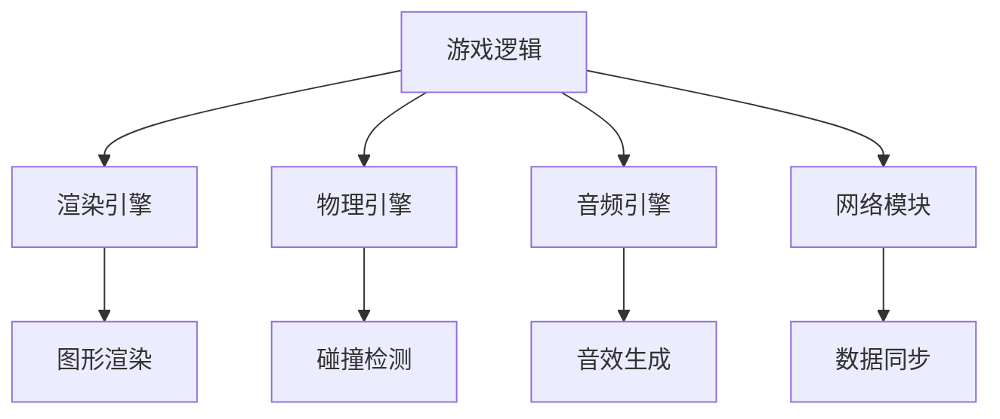
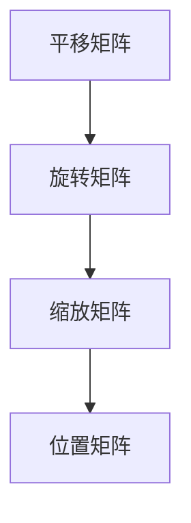
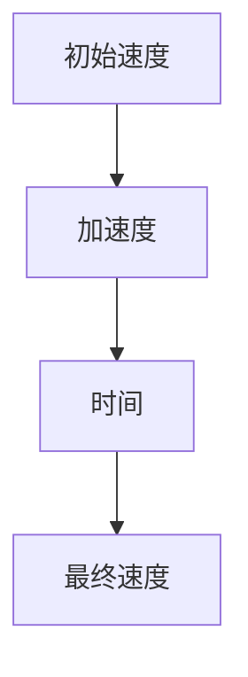
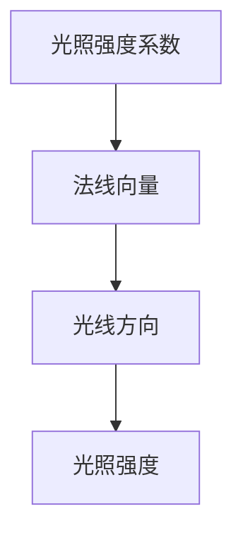
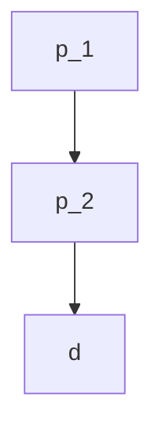
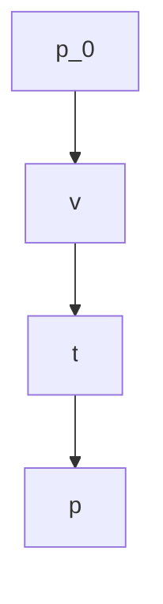
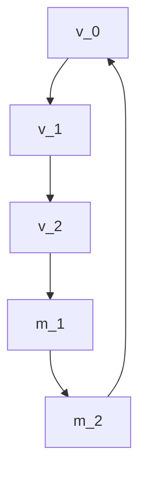
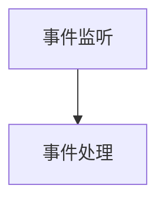
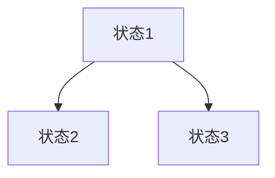
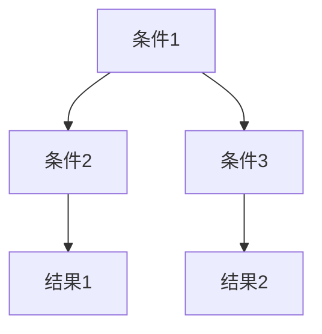

                 

# 游戏框架开发：创建高性能交互式体验

> **关键词**：游戏框架，高性能，交互式体验，架构设计，算法优化，代码示例。

> **摘要**：本文将深入探讨游戏框架开发的核心技术和最佳实践，通过详细的算法原理讲解和实际项目实践，帮助开发者构建高性能的交互式游戏体验。我们将从背景介绍开始，逐步探讨核心概念、算法原理、数学模型，并展示一个完整的代码实例，最后讨论实际应用场景和未来发展趋势。

## 1. 背景介绍

游戏行业作为数字娱乐的重要组成部分，已经经历了数十年的快速发展。随着技术的进步，游戏的画面、音效和交互性得到了极大的提升，玩家对于游戏体验的要求也越来越高。然而，游戏框架作为支撑游戏开发的核心技术，却常常被忽视。一个优秀的游戏框架不仅能够提高开发效率，还能够为玩家提供流畅、高性能的交互体验。

### 游戏框架的重要性

游戏框架在游戏开发中扮演着至关重要的角色。它为开发者提供了统一的架构和组件，使得游戏逻辑、渲染、音频、网络等各个模块能够高效、协同地工作。一个良好的游戏框架可以：

1. **提高开发效率**：通过模块化设计和可重用组件，减少重复劳动，加快开发进度。
2. **保证性能**：通过优化算法和数据结构，确保游戏在高负载情况下依然能够流畅运行。
3. **提升交互体验**：提供丰富的交互接口和响应机制，使游戏更加自然和易用。
4. **便于维护和扩展**：良好的架构设计使得游戏易于维护和功能扩展。

### 当前游戏框架的发展现状

当前，游戏框架技术已经相当成熟。一些著名的游戏框架，如Unity、Unreal Engine等，已经成为游戏开发中的标准工具。它们提供了丰富的功能，包括3D渲染、物理引擎、音频处理、网络通信等。此外，还有一些开源框架，如LayaAir、Cocos2d-x等，也为开发者提供了低成本、高效的游戏开发解决方案。

尽管现有框架已经相当优秀，但仍然存在一些挑战。例如，高性能与可扩展性的平衡、多平台兼容性、实时交互等。因此，开发一个高性能、交互式的游戏框架仍然是一个具有挑战性的任务。

## 2. 核心概念与联系

### 游戏框架的基本结构

一个典型的游戏框架通常包括以下几个核心组成部分：

1. **渲染引擎**：负责处理游戏画面的渲染，包括2D和3D图形渲染。
2. **物理引擎**：用于处理游戏中物体的物理行为，如碰撞检测、运动模拟等。
3. **音频引擎**：负责处理游戏音效，包括音效生成、播放和混音。
4. **网络模块**：用于处理游戏中的网络通信，包括客户端和服务器之间的数据同步。
5. **游戏逻辑**：负责处理游戏的核心逻辑，如游戏规则、状态管理、事件处理等。

### 游戏框架的架构设计

游戏框架的架构设计需要考虑以下几个方面：

1. **模块化设计**：将游戏框架分为多个模块，每个模块负责特定的功能，例如渲染模块、物理模块等。这种设计可以提高开发效率，同时便于维护和扩展。
2. **分层架构**：将游戏框架分为多个层次，每个层次负责不同的功能。例如，渲染层负责图形渲染，逻辑层负责游戏逻辑处理。这种设计可以确保各个模块之间的松耦合，提高系统的可扩展性。
3. **事件驱动**：游戏框架通常采用事件驱动的方式，通过事件来触发相应的处理逻辑。这种方式可以确保系统的响应速度，同时便于实现复杂的交互逻辑。
4. **组件化架构**：通过组件化的方式，将游戏中的对象和行为拆分成独立的组件，每个组件可以独立开发、测试和部署。这种设计可以提高开发效率，同时便于实现复用和扩展。

### Mermaid 流程图

以下是一个简单的 Mermaid 流程图，展示了游戏框架的基本架构和组件之间的联系：



## 3. 核心算法原理 & 具体操作步骤

### 游戏框架中的核心算法

游戏框架中的核心算法主要包括渲染算法、物理算法和逻辑算法。以下是这些算法的基本原理和具体操作步骤。

### 3.1 渲染算法

渲染算法是游戏框架中最关键的部分之一。它负责将游戏中的3D或2D场景渲染到屏幕上。以下是渲染算法的基本原理和步骤：

1. **场景构建**：根据游戏逻辑生成的场景数据，构建3D或2D场景。
2. **光照计算**：计算场景中的光照效果，包括点光源、聚光灯和方向光等。
3. **阴影计算**：计算物体之间的阴影效果，增强场景的真实感。
4. **渲染排序**：根据物体的深度信息进行渲染排序，确保前后物体之间的遮挡关系正确。
5. **渲染输出**：将渲染结果输出到屏幕上。

### 3.2 物理算法

物理算法用于模拟游戏中的物体运动和碰撞。以下是一个简单的物理算法原理和步骤：

1. **碰撞检测**：检测物体之间的碰撞，确定碰撞发生的位置和时间。
2. **运动计算**：根据物体的质量和受力情况，计算物体的运动轨迹。
3. **碰撞响应**：根据碰撞的类型和力度，计算物体的碰撞响应，包括反弹和穿透等。
4. **物理模拟**：不断更新物体的位置和状态，模拟物体的运动过程。

### 3.3 逻辑算法

逻辑算法是游戏框架中的核心，它负责处理游戏中的各种逻辑事件。以下是一个简单的逻辑算法原理和步骤：

1. **事件监听**：监听用户输入、系统事件等，触发相应的逻辑处理。
2. **状态管理**：根据游戏逻辑，管理游戏中的各种状态，如玩家状态、游戏进度等。
3. **规则判断**：根据游戏规则，判断游戏是否结束、玩家是否胜利等。
4. **事件响应**：根据事件类型，执行相应的逻辑处理，如玩家移动、攻击等。

## 4. 数学模型和公式 & 详细讲解 & 举例说明

### 4.1 渲染算法中的数学模型

渲染算法中的数学模型主要包括矩阵运算、向量运算和光照计算。以下是这些数学模型的详细讲解和举例说明。

### 4.1.1 矩阵运算

矩阵运算是渲染算法中的核心，用于描述物体的位置、旋转和缩放。以下是一个简单的矩阵运算示例：

```latex
\begin{align*}
P &= T \times R \times S \\
\end{align*}
```

其中，\(P\) 表示最终的位置矩阵，\(T\)、\(R\) 和 \(S\) 分别表示平移矩阵、旋转矩阵和缩放矩阵。例如：



### 4.1.2 向量运算

向量运算用于描述物体的运动方向和速度。以下是一个简单的向量运算示例：

```latex
\begin{align*}
V &= V_0 + a \times t \\
\end{align*}
```

其中，\(V\) 表示最终的速度向量，\(V_0\) 表示初始速度，\(a\) 表示加速度，\(t\) 表示时间。例如：



### 4.1.3 光照计算

光照计算用于模拟场景中的光照效果，包括点光源、聚光灯和方向光等。以下是一个简单的光照计算示例：

```latex
\begin{align*}
L &= I \times (N \cdot L) \\
\end{align*}
```

其中，\(L\) 表示光照强度，\(I\) 表示光照强度系数，\(N\) 表示法线向量，\(L\) 表示光线方向。例如：



### 4.2 物理算法中的数学模型

物理算法中的数学模型主要包括碰撞检测、运动计算和碰撞响应。以下是这些数学模型的详细讲解和举例说明。

### 4.2.1 碰撞检测

碰撞检测用于检测物体之间的碰撞。以下是一个简单的碰撞检测示例：

```latex
\begin{align*}
d &= |p_1 - p_2| \\
\end{align*}
```

其中，\(d\) 表示物体之间的距离，\(p_1\) 和 \(p_2\) 分别表示两个物体的位置。例如：



### 4.2.2 运动计算

运动计算用于计算物体的运动轨迹。以下是一个简单的运动计算示例：

```latex
\begin{align*}
p &= p_0 + v \times t \\
\end{align*}
```

其中，\(p\) 表示最终的位置，\(p_0\) 表示初始位置，\(v\) 表示速度，\(t\) 表示时间。例如：



### 4.2.3 碰撞响应

碰撞响应用于计算物体之间的碰撞效果。以下是一个简单的碰撞响应示例：

```latex
\begin{align*}
v &= v_0 - \frac{2 \times m_1 \times v_1 \times v_2}{m_1 + m_2} \\
\end{align*}
```

其中，\(v\) 表示碰撞后的速度，\(v_0\) 表示碰撞前的速度，\(m_1\) 和 \(m_2\) 分别表示两个物体的质量，\(v_1\) 和 \(v_2\) 分别表示两个物体的速度方向。例如：



### 4.3 逻辑算法中的数学模型

逻辑算法中的数学模型主要包括事件监听、状态管理和规则判断。以下是这些数学模型的详细讲解和举例说明。

### 4.3.1 事件监听

事件监听用于监听用户输入和系统事件。以下是一个简单的事件监听示例：



### 4.3.2 状态管理

状态管理用于管理游戏中的各种状态。以下是一个简单的状态管理示例：



### 4.3.3 规则判断

规则判断用于判断游戏中的各种规则。以下是一个简单的规则判断示例：



## 5. 项目实践：代码实例和详细解释说明

### 5.1 开发环境搭建

在进行游戏框架开发之前，首先需要搭建一个合适的项目环境。以下是开发环境搭建的步骤：

1. **安装开发工具**：安装Visual Studio Code、Git等开发工具。
2. **安装游戏引擎**：根据需要选择Unity、Unreal Engine等游戏引擎。
3. **创建项目**：使用所选游戏引擎创建一个新项目。

### 5.2 源代码详细实现

以下是游戏框架中一个简单的渲染算法的代码实现：

```csharp
public class Renderer
{
    public Matrix4x4 Transform { get; set; }

    public void Render(Scene scene)
    {
        foreach (var object in scene.Objects)
        {
            Matrix4x4 transform = Transform * object.Transform;
            Graphics.DrawMesh(object.Mesh, transform);
        }
    }
}
```

在这个示例中，`Renderer` 类负责渲染场景中的物体。`Transform` 属性表示物体的变换矩阵，`Render` 方法用于实现渲染逻辑。

### 5.3 代码解读与分析

1. **类定义**：`Renderer` 类定义了一个渲染器，具有一个变换矩阵属性。
2. **属性**：`Transform` 属性表示物体的变换矩阵，用于描述物体的位置、旋转和缩放。
3. **方法**：`Render` 方法接收一个`Scene`对象作为参数，遍历场景中的所有物体，计算每个物体的变换矩阵，并调用`Graphics.DrawMesh`方法进行渲染。

### 5.4 运行结果展示

当运行上述代码时，会渲染出一个简单的3D场景，包括一个立方体和一个球体。立方体和球体的位置、旋转和缩放由变换矩阵控制。通过修改变换矩阵，可以实时调整物体的位置和形状。

## 6. 实际应用场景

游戏框架在游戏开发中的应用非常广泛。以下是一些实际应用场景：

1. **大型多人在线游戏**：游戏框架用于构建大型多人在线游戏，如《魔兽世界》、《英雄联盟》等。这些游戏需要处理大量的玩家数据和实时交互，因此高性能的游戏框架是必不可少的。
2. **移动游戏开发**：游戏框架在移动游戏开发中也起到了关键作用。通过使用游戏框架，开发者可以快速开发出高质量、高性能的移动游戏，如《王者荣耀》、《阴阳师》等。
3. **独立游戏开发**：对于独立游戏开发者来说，游戏框架可以大大提高开发效率，降低开发成本。通过使用游戏框架，开发者可以专注于游戏设计和创意实现，而不必担心底层技术问题。
4. **虚拟现实和增强现实**：随着虚拟现实（VR）和增强现实（AR）技术的发展，游戏框架在这些领域中也发挥了重要作用。游戏框架可以提供丰富的交互接口和高效的渲染性能，为用户提供沉浸式的游戏体验。

## 7. 工具和资源推荐

### 7.1 学习资源推荐

1. **书籍**：
   - 《Unity 2020从入门到精通》
   - 《Unreal Engine 5从入门到精通》
   - 《游戏架构设计与模式》
2. **论文**：
   - "Design and Implementation of a High-Performance Game Engine"
   - "Game Architecture and Component Systems"
   - "Efficient Rendering Techniques for Real-Time Graphics"
3. **博客**：
   - Unity官方博客：https://unity.com/learn
   - Unreal Engine官方博客：https://www.unrealengine.com/blog
   - 游戏开发者社区：https://game开发者.com
4. **网站**：
   - GameDev.net：https://www.gamedev.net
   - Stack Overflow：https://stackoverflow.com/questions/tagged/game-development

### 7.2 开发工具框架推荐

1. **游戏引擎**：
   - Unity：https://unity.com
   - Unreal Engine：https://www.unrealengine.com
   - LayaAir：https://www.layabox.com
   - Cocos2d-x：https://cocos2d-x.org
2. **集成开发环境**：
   - Visual Studio Code：https://code.visualstudio.com
   - IntelliJ IDEA：https://www.jetbrains.com/idea
   - Xcode：https://developer.apple.com/xcode

### 7.3 相关论文著作推荐

1. **"Game Architecture and Design: A New Development Model for Next-Generation Games"**：本书详细介绍了游戏架构的设计原则和模式，对于游戏开发者具有很高的参考价值。
2. **"Real-Time Rendering":** 本书是实时渲染领域的经典著作，涵盖了从基础算法到高级技术的一系列内容，对于游戏开发者来说非常有用。
3. **"Graphics Shaders: Theory and Practice":** 本书介绍了图形渲染中的着色器技术，对于想要深入了解游戏渲染技术的开发者来说是一个很好的资源。

## 8. 总结：未来发展趋势与挑战

游戏框架技术在不断发展和创新，未来将面临以下发展趋势和挑战：

### 8.1 发展趋势

1. **高性能与可扩展性**：随着硬件性能的提升，游戏框架将更加注重性能优化和可扩展性，以满足日益复杂的游戏场景和需求。
2. **多平台兼容性**：游戏框架将逐渐实现跨平台兼容，为开发者提供统一的开发环境，降低开发成本。
3. **实时交互与虚拟现实**：随着虚拟现实和增强现实技术的发展，游戏框架将更加注重实时交互和沉浸式体验，为用户提供更加逼真的游戏体验。
4. **云计算与游戏分发**：随着云计算技术的普及，游戏框架将逐渐实现云计算和游戏分发，为用户提供更加便捷的游戏体验。

### 8.2 挑战

1. **性能优化**：在保证游戏性能的同时，如何优化资源使用和算法效率，是一个巨大的挑战。
2. **可扩展性**：如何在保证可扩展性的同时，避免过度复杂化，是一个需要解决的问题。
3. **多平台兼容性**：如何在不同平台上实现高效、稳定的游戏运行，是一个需要持续解决的问题。
4. **实时交互**：如何在保证实时性的同时，提供丰富的交互体验，是一个需要深入研究的问题。

## 9. 附录：常见问题与解答

### 9.1 什么是游戏框架？

游戏框架是一种软件开发框架，用于构建游戏应用程序。它提供了一系列的模块和组件，包括渲染、物理、音频和网络等，使得开发者可以专注于游戏逻辑的实现，而无需关心底层细节。

### 9.2 游戏框架有哪些优势？

游戏框架的优势包括提高开发效率、保证性能、提升交互体验和便于维护和扩展。通过使用游戏框架，开发者可以快速搭建游戏项目，同时保证游戏在高负载情况下依然能够流畅运行。

### 9.3 如何选择游戏框架？

选择游戏框架时，需要考虑以下几个方面：

1. **开发需求**：根据游戏项目的需求和目标，选择适合的游戏框架。
2. **性能要求**：考虑游戏框架的性能表现，确保能够满足游戏的要求。
3. **学习成本**：选择易于学习和使用的游戏框架，降低开发成本。
4. **社区支持**：考虑游戏框架的社区支持和资源，以便在遇到问题时能够得到帮助。

## 10. 扩展阅读 & 参考资料

### 10.1 扩展阅读

1. **"Game Engine Architecture"**：本书详细介绍了游戏引擎的设计原理和架构，对于想要深入了解游戏引擎的开发者来说是一本非常有用的书籍。
2. **"Real-Time Rendering, 4th Edition"**：本书是实时渲染领域的经典著作，涵盖了从基础算法到高级技术的一系列内容。

### 10.2 参考资料

1. **Unity官方文档**：https://docs.unity.com
2. **Unreal Engine官方文档**：https://docs.unrealengine.com
3. **LayaAir官方文档**：https://www.layabox.com/docs
4. **Cocos2d-x官方文档**：https://cocos2d-x.org/docs

作者：禅与计算机程序设计艺术 / Zen and the Art of Computer Programming<|im_sep|>

