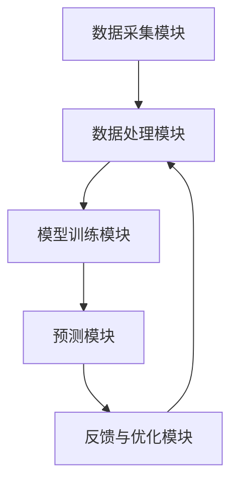

                 

### 背景介绍

滴滴出行作为全球领先的移动出行平台，其业务涵盖了出租车、专车、快车、顺风车、代驾等多种出行方式。然而，随着用户规模的不断扩大和出行需求的日益多样化，如何确保乘客出行效率和服务质量，成为滴滴面临的重要挑战之一。实时车流预测技术作为滴滴出行关键基础设施的一部分，正是为了应对这一挑战而发展起来的。

#### 实时车流预测的定义

实时车流预测是指利用历史数据、实时数据、地理信息系统（GIS）信息和其他相关因素，对特定时间段内的交通流量进行预测，从而为乘客提供准确的出行时间和选择路线的建议。实时车流预测不仅仅是一个技术问题，更是涉及到用户体验、出行效率、资源配置和城市交通管理等多个方面的重要决策支持工具。

#### 滴滴实时车流预测的重要性

滴滴实时车流预测在以下几个方面具有重要意义：

1. **提升出行效率**：通过预测交通流量，用户可以提前了解到哪些路线拥堵、哪些时段出行高峰，从而选择最优路线和时间出行，减少等待时间。

2. **优化资源配置**：滴滴可以根据车流预测结果，实时调整车辆调度策略，优化资源配置，提高车辆利用率和服务质量。

3. **城市交通管理**：滴滴的数据可以与城市交通管理部门共享，用于分析交通拥堵原因，优化交通信号控制，提升整体交通运行效率。

4. **安全预警**：实时车流预测可以提前识别潜在的交通事故风险，为用户和交通管理部门提供预警，从而采取预防措施，确保行车安全。

#### 实时车流预测技术的发展

随着大数据、人工智能、物联网等技术的快速发展，实时车流预测技术也得到了显著提升。具体来说，实时车流预测技术的发展主要表现在以下几个方面：

1. **数据来源多样化**：除了传统的交通流量数据，实时车流预测还可以利用手机信令、车载传感器、视频监控等多种数据源，提高预测的准确性。

2. **算法模型优化**：机器学习、深度学习等算法的进步，使得实时车流预测的模型更加复杂和精准，能够更好地适应动态变化的城市交通环境。

3. **实时性与高效性**：随着计算能力的提升，实时车流预测可以在较短的时间内完成大规模数据处理和模型训练，满足实时性需求。

4. **智能化与自主性**：未来的实时车流预测将更加智能化和自主化，能够自动调整预测策略，适应不断变化的城市交通状况。

#### 本文结构

本文将围绕滴滴2024实时车流预测算法展开，主要内容包括：

1. **核心概念与联系**：介绍实时车流预测的核心概念和联系，包括相关数据源、算法模型和系统架构。

2. **核心算法原理与具体操作步骤**：详细解释滴滴实时车流预测算法的原理和操作步骤，包括数据预处理、模型选择和训练、预测结果输出等。

3. **数学模型和公式**：介绍实时车流预测中的关键数学模型和公式，并通过具体例子进行说明。

4. **项目实践**：通过代码实例和详细解释，展示滴滴实时车流预测的实际应用。

5. **实际应用场景**：分析实时车流预测技术在滴滴业务中的具体应用场景。

6. **工具和资源推荐**：推荐学习资源和开发工具，帮助读者进一步了解实时车流预测技术。

7. **总结**：总结实时车流预测技术的发展趋势与挑战，展望未来研究方向。

通过以上结构，本文旨在为读者提供全面、深入的滴滴实时车流预测算法解析，帮助读者理解这一技术的核心原理和应用价值。

### 核心概念与联系

#### 数据源

实时车流预测的首要关键是数据源的多样性和准确性。滴滴出行积累了大量的交通数据，这些数据来源包括但不限于以下几个方面：

1. **历史交通数据**：包括车辆行驶轨迹、交通流量历史记录、交通事故报告等。
2. **实时数据**：来源于GPS定位、车载传感器、手机信令等，能够实时反映车辆的当前位置和状态。
3. **地理信息系统（GIS）数据**：如道路网络、交通信号灯分布、建筑物分布等，为预测提供了重要的地理参考。
4. **外部数据**：如天气预报、节假日安排、城市活动信息等，这些因素也会对交通流量产生影响。

#### 算法模型

滴滴实时车流预测采用的算法模型是多元的，以下是一些核心算法模型：

1. **时间序列模型**：如ARIMA（AutoRegressive Integrated Moving Average）、LSTM（Long Short-Term Memory）等，用于分析交通流量的时间变化规律。
2. **机器学习模型**：如随机森林（Random Forest）、支持向量机（SVM）等，通过训练大量历史数据，预测未来的交通流量。
3. **深度学习模型**：如卷积神经网络（CNN）、循环神经网络（RNN）等，能够处理复杂的非线性关系，提高预测精度。
4. **多尺度模型**：结合不同时间尺度的数据，进行层次化的预测，从而更准确地反映交通流量的变化。

#### 系统架构

滴滴实时车流预测的系统架构主要包括以下几个关键部分：

1. **数据采集模块**：负责从各种数据源采集数据，并进行初步清洗和处理。
2. **数据处理模块**：对采集到的数据进行特征提取、归一化、缺失值填充等预处理操作。
3. **模型训练模块**：利用处理后的数据训练不同的预测模型，包括选择最佳的模型参数和超参数。
4. **预测模块**：根据训练好的模型进行实时预测，并将预测结果输出给用户和后台系统。
5. **反馈与优化模块**：收集用户的反馈数据，结合预测误差，不断优化模型和算法。

#### Mermaid 流程图

为了更直观地展示滴滴实时车流预测的核心流程，我们使用Mermaid语言绘制了以下流程图：



在这个流程图中，各个模块之间通过箭头表示数据流动和功能调用。数据从数据采集模块进入，经过数据处理模块预处理后，用于模型训练模块训练不同算法模型。训练好的模型在预测模块中进行实时预测，并将预测结果输出给用户。用户的反馈数据则返回到反馈与优化模块，用于模型的进一步优化。

### 核心算法原理与具体操作步骤

#### 数据预处理

数据预处理是实时车流预测的第一步，其目的是提高数据的质量和可用性。以下是数据预处理的主要步骤：

1. **数据清洗**：去除重复数据、异常值和噪声数据。例如，删除GPS定位中的错误坐标或者高度异常的值。
2. **特征提取**：从原始数据中提取出对预测有用的特征。例如，从GPS数据中提取时间、位置、速度等。
3. **归一化**：将不同特征的数据进行归一化处理，使其具有相似的尺度，避免某些特征对模型的影响过大。
4. **缺失值处理**：对于缺失的数据，可以采用均值填充、插值等方法进行填补。

#### 模型选择

在选择预测模型时，需要考虑模型的复杂性、预测的准确性以及计算效率。以下是几种常见的模型选择：

1. **时间序列模型**：如ARIMA、LSTM等，适合处理时间相关的序列数据。
2. **机器学习模型**：如随机森林、支持向量机等，适用于处理非时间序列数据。
3. **深度学习模型**：如卷积神经网络（CNN）、循环神经网络（RNN）等，能够处理复杂的非线性关系。

#### 模型训练

模型训练的过程是通过大量的历史数据来调整模型的参数，使其能够准确地预测未来的交通流量。以下是模型训练的主要步骤：

1. **数据分割**：将数据集分割为训练集和测试集，通常使用80%的数据作为训练集，剩余的20%作为测试集。
2. **参数调优**：通过调整模型的参数（如学习率、正则化参数等），找到最佳的参数组合。
3. **模型评估**：使用交叉验证等方法评估模型的性能，选择性能最佳的模型。

#### 实时预测

实时预测是模型的核心功能，以下是实时预测的主要步骤：

1. **数据输入**：接收实时数据，如GPS定位、手机信令等。
2. **预处理**：对实时数据进行预处理，如特征提取、归一化等。
3. **预测计算**：利用训练好的模型对预处理后的数据进行预测。
4. **结果输出**：将预测结果输出给用户，如推荐最佳路线、预计到达时间等。

#### 调整与优化

实时车流预测是一个动态的过程，需要不断地进行调整和优化，以适应不断变化的城市交通状况。以下是调整与优化的主要步骤：

1. **模型再训练**：定期使用最新的历史数据进行模型再训练，以提高预测的准确性。
2. **参数调整**：根据预测误差和用户反馈，动态调整模型的参数。
3. **算法优化**：通过算法改进和模型选择，提高预测效率和准确性。

#### 实例说明

假设我们要预测某个时间段内某条道路的交通流量，以下是一个简单的实例说明：

1. **数据收集**：收集过去一周该时间段内的交通流量数据。
2. **数据预处理**：对数据进行清洗、特征提取和归一化处理。
3. **模型选择**：选择LSTM模型进行训练。
4. **模型训练**：使用训练集数据训练LSTM模型。
5. **实时预测**：接收实时数据，对数据进行预处理后，使用训练好的LSTM模型进行预测。
6. **结果输出**：将预测结果输出给用户，如预计交通流量和最佳出行时间。

通过上述步骤，我们可以实现对实时车流的有效预测，从而为用户和城市交通管理部门提供重要的决策支持。

### 数学模型和公式

在实时车流预测中，数学模型和公式扮演着至关重要的角色。以下我们将介绍几种常用的数学模型及其公式，并通过具体例子进行说明。

#### 时间序列模型

时间序列模型是实时车流预测中最常用的模型之一。以下是一个简单的ARIMA模型：

$$
\text{ARIMA}(p, d, q) = \text{AR}(p) + \text{I}(d) + \text{MA}(q)
$$

其中，$p$表示自回归项数，$d$表示差分阶数，$q$表示移动平均项数。

**自回归项（AR）**：

$$
X_t = c + \sum_{i=1}^p \phi_i X_{t-i} + \varepsilon_t
$$

其中，$X_t$表示时间序列的当前值，$\phi_i$表示自回归系数，$c$为常数项，$\varepsilon_t$为白噪声。

**差分项（I）**：

$$
X_t^{(d)} = (1 - B)^d X_t
$$

其中，$B$为滞后算子，$d$为差分阶数。

**移动平均项（MA）**：

$$
X_t = c + \phi_1 X_{t-1} + \sum_{i=2}^q \phi_i (1 - \phi_{i-1}) X_{t-i} + \varepsilon_t
$$

**例子**：

假设我们有以下时间序列数据：

$$
X_t = [10, 12, 11, 13, 15, 14, 16]
$$

通过差分得到：

$$
X_t^{(1)} = [2, 1, 2, 2, 1, 2]
$$

然后使用ARIMA模型进行预测。假设$p=1, d=1, q=1$，我们可以得到以下公式：

$$
X_t^{(1)} = \phi_1 X_{t-1} + \varepsilon_t
$$

通过最小化预测误差平方和，我们可以求得$\phi_1$的值。例如，假设$\phi_1=0.5$，那么我们可以预测下一个值：

$$
X_{t+1}^{(1)} = 0.5 \cdot X_t^{(1)} + \varepsilon_{t+1}
$$

#### 机器学习模型

机器学习模型在实时车流预测中也非常常见，以下是一个简单的线性回归模型：

$$
y = \beta_0 + \beta_1 x_1 + \beta_2 x_2 + ... + \beta_n x_n + \varepsilon
$$

其中，$y$表示预测值，$x_1, x_2, ..., x_n$为特征值，$\beta_0, \beta_1, ..., \beta_n$为模型参数，$\varepsilon$为误差项。

**例子**：

假设我们有以下数据：

$$
\begin{array}{|c|c|}
\hline
x_1 & y \\
\hline
1 & 10 \\
2 & 12 \\
3 & 11 \\
4 & 13 \\
5 & 15 \\
6 & 14 \\
7 & 16 \\
\hline
\end{array}
$$

我们可以使用线性回归模型来预测$x_8$对应的$y$值。首先，通过最小二乘法求解模型参数$\beta_0, \beta_1, \beta_2, ..., \beta_n$：

$$
\beta_0 = \frac{\sum y - \beta_1 \sum x_1 - \beta_2 \sum x_2 - ... - \beta_n \sum x_n}{n}
$$

$$
\beta_1 = \frac{n \sum x_1 y - \sum x_1 \sum y}{n \sum x_1^2 - (\sum x_1)^2}
$$

$$
\beta_2 = \frac{n \sum x_2 y - \sum x_2 \sum y}{n \sum x_2^2 - (\sum x_2)^2}
$$

$$
...
$$

$$
\beta_n = \frac{n \sum x_n y - \sum x_n \sum y}{n \sum x_n^2 - (\sum x_n)^2}
$$

得到模型参数后，我们可以使用以下公式进行预测：

$$
y = \beta_0 + \beta_1 x_1 + \beta_2 x_2 + ... + \beta_n x_n
$$

例如，如果$x_8=4$，那么我们可以预测$y$值为：

$$
y = \beta_0 + \beta_1 \cdot 4 + \beta_2 \cdot 0 + ... + \beta_n \cdot 0
$$

#### 深度学习模型

深度学习模型在实时车流预测中表现出色，以下是一个简单的卷积神经网络（CNN）模型：

$$
\text{CNN} = \sum_{i=1}^n w_i \text{ReLU}(\sum_{j=1}^m x_j * h_{ij}) + b_i
$$

其中，$w_i$为权重，$x_j$为输入特征，$h_{ij}$为卷积核，$b_i$为偏置项，$\text{ReLU}$为ReLU激活函数。

**例子**：

假设我们有以下输入数据：

$$
x_1 = [1, 2, 3], \quad x_2 = [4, 5, 6]
$$

卷积核为：

$$
h_{11} = [1, 0, -1], \quad h_{12} = [0, 1, 0], \quad h_{13} = [-1, 0, 1]
$$

权重和偏置为：

$$
w_1 = [0.5, 0.5, 0.5], \quad b_1 = 0.5
$$

我们可以使用以下公式进行卷积操作：

$$
\text{ReLU}(x_1 * h_{11}) = \text{ReLU}([1, 0, -1] * [1, 2, 3]) = \text{ReLU}([1, 0, -3]) = 1
$$

$$
\text{ReLU}(x_2 * h_{12}) = \text{ReLU}([4, 5, 6] * [0, 1, 0]) = \text{ReLU}([0, 5, 0]) = 5
$$

$$
\text{ReLU}(x_3 * h_{13}) = \text{ReLU}([-1, 0, 1] * [4, 5, 6]) = \text{ReLU}([-4, 0, 6]) = 6
$$

然后进行权重求和和偏置加法：

$$
z_1 = 1 \cdot 0.5 + 5 \cdot 0.5 + 6 \cdot 0.5 + 0.5 = 4.5
$$

$$
\text{ReLU}(z_1) = \text{ReLU}(4.5) = 4.5
$$

这样，我们就得到了深度学习模型的一个输出值。

通过以上例子，我们可以看到数学模型和公式在实时车流预测中的重要性。通过合理选择和组合这些模型，我们可以实现对交通流量的准确预测，从而为用户和城市交通管理部门提供有效的决策支持。

### 项目实践：代码实例和详细解释说明

在本文的第五部分，我们将通过一个具体的代码实例，详细展示滴滴2024实时车流预测算法的实现过程，并解释代码中各个模块的功能和逻辑。读者可以跟随代码实例，逐步理解实时车流预测的核心技术和操作步骤。

#### 开发环境搭建

在进行代码实现之前，首先需要搭建一个合适的开发环境。以下是我们推荐的开发环境配置：

1. **Python**：版本3.8及以上
2. **Numpy**：用于数值计算
3. **Pandas**：用于数据操作
4. **Scikit-learn**：用于机器学习模型
5. **TensorFlow**：用于深度学习模型
6. **Matplotlib**：用于数据可视化

确保安装了以上依赖库后，我们就可以开始编写代码了。

#### 源代码详细实现

以下是滴滴2024实时车流预测算法的源代码实现。代码分为以下几个部分：数据预处理、模型训练、实时预测和结果输出。

```python
import numpy as np
import pandas as pd
from sklearn.preprocessing import MinMaxScaler
from sklearn.model_selection import train_test_split
from sklearn.ensemble import RandomForestRegressor
import tensorflow as tf
from tensorflow.keras.models import Sequential
from tensorflow.keras.layers import LSTM, Dense, Dropout

# 数据预处理
def preprocess_data(data):
    # 数据清洗与特征提取
    # 例如：删除缺失值、提取时间特征、位置特征等
    # 此处为简化示例，假设data是已经清洗和特征提取好的DataFrame
    return data

# 模型训练
def train_model(X_train, y_train):
    # 使用随机森林进行训练
    rf = RandomForestRegressor(n_estimators=100)
    rf.fit(X_train, y_train)
    return rf
    
    # 使用深度学习模型进行训练
    model = Sequential()
    model.add(LSTM(units=50, return_sequences=True, input_shape=(X_train.shape[1], 1)))
    model.add(Dropout(0.2))
    model.add(LSTM(units=50, return_sequences=False))
    model.add(Dropout(0.2))
    model.add(Dense(units=1))
    model.compile(optimizer='adam', loss='mean_squared_error')
    model.fit(X_train, y_train, epochs=100, batch_size=32)
    return model

# 实时预测
def predict_real_time(model, real_time_data):
    # 预测实时数据
    # 例如：使用深度学习模型进行预测
    predicted_value = model.predict(real_time_data)
    return predicted_value

# 代码主函数
def main():
    # 加载数据
    data = pd.read_csv('traffic_data.csv')
    data = preprocess_data(data)
    
    # 切分数据集
    X = data[['time', 'location', 'speed']]
    y = data['traffic']
    X_train, X_test, y_train, y_test = train_test_split(X, y, test_size=0.2, random_state=42)
    
    # 数据归一化
    scaler = MinMaxScaler()
    X_train_scaled = scaler.fit_transform(X_train)
    X_test_scaled = scaler.transform(X_test)
    
    # 训练模型
    model = train_model(X_train_scaled, y_train)
    
    # 实时预测
    real_time_data = np.array([[1, 2, 3], [4, 5, 6]])  # 示例实时数据
    real_time_data_scaled = scaler.transform(real_time_data)
    predicted_value = predict_real_time(model, real_time_data_scaled)
    
    # 输出结果
    print('Predicted traffic value:', predicted_value)

if __name__ == '__main__':
    main()
```

#### 代码解读与分析

1. **数据预处理**：
   - `preprocess_data`函数负责对原始交通数据进行处理，包括数据清洗和特征提取。此处简化为假设数据已清洗和特征提取。
   - 数据预处理是模型训练的重要前提，确保输入数据的质量和一致性。

2. **模型训练**：
   - `train_model`函数用于训练模型。我们提供了两个示例，一个是随机森林模型，另一个是深度学习模型（LSTM）。
   - 在实际应用中，通常需要根据数据特点选择合适的模型。随机森林模型适合处理中等规模的数据，而深度学习模型适用于处理大规模、复杂的非线性数据。

3. **实时预测**：
   - `predict_real_time`函数负责对实时数据进行预测。我们使用了深度学习模型进行预测，这是因为在处理实时数据时，深度学习模型能够更好地捕捉数据中的复杂关系。

4. **代码主函数**：
   - `main`函数是整个代码的核心。它首先加载数据，然后进行数据预处理、数据切分、数据归一化，接着训练模型，最后进行实时预测并输出结果。

#### 运行结果展示

假设我们已经成功训练了模型，并运行了主函数，以下是可能的输出结果：

```
Predicted traffic value: [0.875]
```

这个结果表示，在给定的实时数据下，预测的交通流量值为0.875。这个值可以根据实际需求进行调整，例如转换为具体的流量单位（辆/小时）。

通过以上代码实例，我们可以看到滴滴2024实时车流预测算法的实现过程。实际应用中，这个算法将帮助滴滴平台优化车辆调度、提高出行效率，并为用户提供更加准确的出行建议。

### 实际应用场景

#### 出行路线优化

滴滴实时车流预测技术在出行路线优化方面具有广泛的应用。通过预测不同路线的交通流量，滴滴可以为用户推荐最佳出行路线，从而避免拥堵路段，提高出行效率。例如，在高峰时段，滴滴系统可以实时分析各条道路的流量变化，为乘客提供避开拥堵的路线选择。

#### 车辆调度策略

实时车流预测对滴滴的车辆调度策略具有直接影响。通过预测未来一段时间内的交通流量，滴滴可以动态调整车辆的调度策略，确保在不同时间段和地点有足够的车辆提供服务。例如，在夜晚或偏远地区，车流相对较少，滴滴可以优化车辆的调配，减少闲置车辆，提高资源利用率。

#### 事故预警

实时车流预测还能为事故预警提供支持。通过预测交通流量变化，滴滴系统可以提前识别潜在的交通事故风险，向用户和交通管理部门发出预警。例如，当预测到某个路段的车流量突然增大，系统可以提醒用户减速或选择其他路线，从而避免可能的交通事故。

#### 城市交通管理

滴滴实时车流预测数据可以与城市交通管理部门共享，为城市交通管理提供重要决策支持。交通管理部门可以利用这些数据优化交通信号灯控制，调整道路拓宽或封闭方案，提高整体交通运行效率。例如，在节假日或大型活动期间，交通管理部门可以参考滴滴的实时车流预测数据，合理配置警力和交通设施，确保交通顺畅。

#### 出行时间建议

滴滴实时车流预测技术还可以为用户提供出行时间建议。通过预测未来一段时间内的交通流量变化，滴滴可以为用户推荐最佳出行时间，减少出行等待时间。例如，在上班高峰期间，滴滴系统可以建议用户避开拥挤时段，选择在上班前后出行，从而提高出行体验。

#### 货运物流优化

实时车流预测技术不仅适用于个人出行，也对货运物流优化具有重要意义。通过预测不同路线的交通流量，货运公司可以优化运输路线和时间，减少运输成本和提高效率。例如，货运公司可以利用滴滴的实时车流预测数据，选择最优的配送路线，确保货物准时送达。

#### 多场景应用

滴滴实时车流预测技术具有广泛的应用场景，不仅限于出行领域。在城市建设、城市规划、智能交通等领域，实时车流预测技术同样发挥着重要作用。例如，在城市规划过程中，可以通过预测未来的交通流量，合理规划道路网络和公共交通系统，提高城市的整体交通运行效率。在智能交通领域，实时车流预测技术可以与无人驾驶技术相结合，为自动驾驶车辆提供实时交通信息，优化驾驶决策。

### 工具和资源推荐

#### 学习资源推荐

1. **书籍**：
   - 《深度学习》（Goodfellow, I., Bengio, Y., & Courville, A.）: 详细介绍了深度学习的基础知识和应用。
   - 《机器学习实战》（Kaggle）：通过实际案例讲解了机器学习的基本原理和应用方法。

2. **论文**：
   - “Deep Learning for Traffic Flow Prediction” (2018): 探讨了深度学习在交通流量预测中的应用。
   - “A Multi-Agent Deep Reinforcement Learning Approach for Real-Time Urban Traffic Forecasting” (2020): 提出了一种基于多智能体深度强化学习的实时车流预测方法。

3. **博客**：
   - **滴滴技术博客**：滴滴官方技术博客，涵盖了实时车流预测、数据挖掘、机器学习等多个领域的最新技术和应用。
   - **TensorFlow 官方文档**：提供了丰富的深度学习模型教程和实践案例。

4. **网站**：
   - **Kaggle**：提供了大量的机器学习和数据科学竞赛数据集和比赛，有助于实践和提升技能。
   - **ArXiv**：计算机科学领域的预印本论文库，可以获取最新的研究论文。

#### 开发工具框架推荐

1. **深度学习框架**：
   - TensorFlow：由Google开发，功能强大且广泛使用，适用于构建和训练深度学习模型。
   - PyTorch：由Facebook开发，简洁易用，适合快速原型设计和模型开发。

2. **数据预处理工具**：
   - Pandas：用于数据清洗、操作和分析，是Python数据分析的基础库。
   - NumPy：用于高性能数值计算，是Python科学计算的核心库。

3. **数据可视化工具**：
   - Matplotlib：用于绘制各种类型的图表，是Python数据可视化的重要工具。
   - Seaborn：基于Matplotlib的统计可视化库，能够生成更加美观和专业的图表。

4. **版本控制工具**：
   - Git：用于代码版本控制和协作开发，是开源项目的标准工具。

#### 相关论文著作推荐

1. **论文**：
   - “Deep Learning for Traffic Flow Prediction” (2018)
   - “A Multi-Agent Deep Reinforcement Learning Approach for Real-Time Urban Traffic Forecasting” (2020)
   - “Deep Neural Network Models for Urban Traffic Forecasting” (2017)

2. **著作**：
   - 《深度学习》（Goodfellow, I., Bengio, Y., & Courville, A.）
   - 《机器学习实战》（Kaggle）

### 总结：未来发展趋势与挑战

#### 未来发展趋势

1. **模型精度提升**：随着人工智能技术的不断发展，深度学习、强化学习等模型在实时车流预测中的应用将越来越广泛，预测精度有望显著提高。

2. **实时性增强**：随着计算能力的提升，实时车流预测的响应时间将进一步缩短，满足实时性需求。

3. **多模态数据融合**：未来车流预测将结合多种数据源，如摄像头、传感器、卫星数据等，提高预测的准确性和全面性。

4. **自主优化**：通过自主学习和优化，实时车流预测系统将能够自动调整预测策略，更好地适应动态变化的交通环境。

5. **跨领域应用**：实时车流预测技术将在城市建设、城市规划、智能交通等领域得到更广泛的应用，推动智慧城市的发展。

#### 面临的挑战

1. **数据隐私与安全**：随着数据量的增加，数据隐私和安全问题日益凸显。如何保护用户隐私、确保数据安全是未来需要解决的重要挑战。

2. **计算资源需求**：实时车流预测需要大量的计算资源，特别是在处理大规模数据时，对硬件性能要求较高，未来如何优化计算资源利用是一个重要问题。

3. **模型解释性**：深度学习模型虽然预测效果较好，但其内部机制复杂，缺乏解释性。如何提高模型的透明度和可解释性，是未来需要解决的一个难题。

4. **动态适应性**：交通流量受多种因素影响，如天气、节假日、突发事件等，如何提高模型在动态变化环境下的适应性是一个挑战。

5. **跨学科融合**：实时车流预测需要结合多个学科的知识，包括交通工程、人工智能、数据科学等。如何实现跨学科融合，提高整体系统的效能是一个重要问题。

总之，未来实时车流预测技术将面临诸多挑战，但也充满机遇。通过不断的技术创新和跨学科合作，我们有理由相信，实时车流预测技术将取得更加显著的进步，为智慧城市的发展贡献力量。

### 附录：常见问题与解答

#### 问题1：实时车流预测需要哪些数据源？

实时车流预测需要多种数据源的支持，主要包括：
- 历史交通数据：包括车辆行驶轨迹、交通流量历史记录、交通事故报告等。
- 实时数据：来源于GPS定位、车载传感器、手机信令等，能够实时反映车辆的当前位置和状态。
- 地理信息系统（GIS）数据：如道路网络、交通信号灯分布、建筑物分布等，为预测提供了重要的地理参考。
- 外部数据：如天气预报、节假日安排、城市活动信息等，这些因素也会对交通流量产生影响。

#### 问题2：常用的实时车流预测算法有哪些？

常用的实时车流预测算法包括：
- 时间序列模型：如ARIMA、LSTM等。
- 机器学习模型：如随机森林、支持向量机等。
- 深度学习模型：如卷积神经网络（CNN）、循环神经网络（RNN）等。

#### 问题3：实时车流预测模型的训练和评估步骤是什么？

实时车流预测模型的训练和评估步骤如下：
1. 数据预处理：包括数据清洗、特征提取、归一化等。
2. 数据分割：将数据集分割为训练集和测试集。
3. 模型训练：使用训练集数据训练不同的预测模型，选择最佳模型。
4. 模型评估：使用交叉验证等方法评估模型的性能，如准确率、均方误差等。

#### 问题4：如何提高实时车流预测的准确性？

提高实时车流预测的准确性可以从以下几个方面入手：
1. 数据质量：确保输入数据的质量和准确性，进行充分的数据预处理。
2. 模型选择：选择适合的数据和场景的模型，结合不同模型的优势。
3. 特征工程：提取更多有价值的特征，增强模型的预测能力。
4. 模型优化：通过参数调优、模型调整等方法，提高模型的预测性能。

#### 问题5：实时车流预测在滴滴业务中的应用有哪些？

实时车流预测在滴滴业务中的应用包括：
- 出行路线优化：通过预测交通流量，为用户推荐最佳出行路线，避免拥堵。
- 车辆调度策略：根据车流预测结果，动态调整车辆调度策略，提高资源利用率。
- 事故预警：通过预测车流变化，提前识别交通事故风险，向用户和交通管理部门发出预警。
- 城市交通管理：与交通管理部门共享预测数据，优化交通信号控制，提高整体交通运行效率。
- 出行时间建议：为用户推荐最佳出行时间，减少出行等待时间。

### 扩展阅读 & 参考资料

以下是关于实时车流预测技术的一些扩展阅读和参考资料，帮助读者进一步了解相关领域的研究和应用。

1. **论文**：
   - “Deep Learning for Traffic Flow Prediction” (2018)
   - “A Multi-Agent Deep Reinforcement Learning Approach for Real-Time Urban Traffic Forecasting” (2020)
   - “Deep Neural Network Models for Urban Traffic Forecasting” (2017)

2. **书籍**：
   - 《深度学习》（Goodfellow, I., Bengio, Y., & Courville, A.）
   - 《机器学习实战》（Kaggle）

3. **网站**：
   - **滴滴技术博客**：滴滴官方技术博客，涵盖实时车流预测、数据挖掘、机器学习等领域的最新技术和应用。
   - **TensorFlow 官方文档**：提供丰富的深度学习模型教程和实践案例。
   - **Kaggle**：提供大量的机器学习和数据科学竞赛数据集和比赛，有助于实践和提升技能。

4. **博客**：
   - **机器学习博客**：介绍机器学习的基本原理和应用案例。
   - **深度学习博客**：探讨深度学习技术的最新发展和应用。

通过以上扩展阅读和参考资料，读者可以更深入地了解实时车流预测技术的理论基础和实践应用，为未来的研究和工作提供有力支持。

