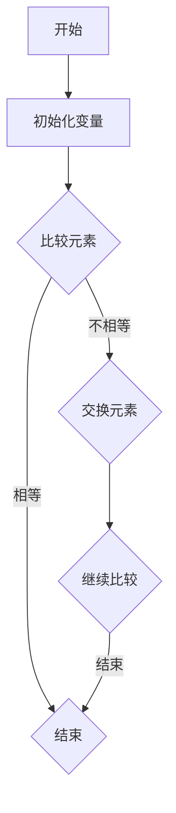
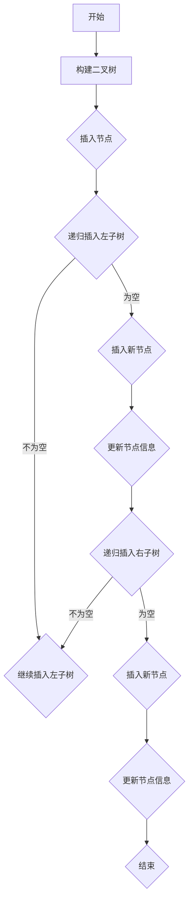

                 

### 文章标题

滴滴2024校招面试真题与算法题解：深度解析与实战指南

> 关键词：滴滴校招、面试真题、算法题解、深度解析、实战指南

> 摘要：本文深入解析了滴滴2024校招面试中的高频真题和算法题，旨在为准备校招的同学们提供一份详尽的实战指南。通过逐步分析每个问题的背景、核心概念、解题思路以及实践步骤，帮助读者理解并掌握这些面试题的解答方法。文章结构清晰，逻辑严密，适合广大求职者和计算机专业学生参考学习。

### 1. 背景介绍

滴滴出行作为全球领先的移动出行平台，其校招面试题目一直以来都是求职者关注的焦点。2024年滴滴校招面试涵盖了从基础算法到高级数据结构的多个领域，题目设计注重考查应聘者的逻辑思维、编程能力和问题解决能力。这些题目不仅考察了应聘者对计算机科学基础知识的掌握程度，还要求应聘者能够灵活运用所学知识解决实际问题。

本文旨在为准备滴滴校招的同学们提供一份详细的实战指南，通过解析滴滴校招面试中的典型真题和算法题，帮助读者深入理解面试题目背后的原理和解题方法，提高解决实际问题的能力。文章将分为以下几个部分：

- **核心概念与联系**：介绍与题目相关的基础知识和概念，通过Mermaid流程图展示关键流程。
- **核心算法原理 & 具体操作步骤**：详细解析每个题目的解题思路，逐步讲解解题步骤。
- **数学模型和公式 & 详细讲解 & 举例说明**：运用数学模型和公式对题目进行深入分析，并结合实例说明。
- **项目实践：代码实例和详细解释说明**：提供具体代码实现，并进行详细解读和分析。
- **实际应用场景**：讨论题目在现实中的应用和意义。
- **工具和资源推荐**：推荐相关学习资源、开发工具和框架。
- **总结：未来发展趋势与挑战**：总结文章核心内容，展望未来发展。
- **附录：常见问题与解答**：回答读者可能遇到的问题。
- **扩展阅读 & 参考资料**：提供进一步学习的参考资料。

通过本文的逐步分析，希望读者能够对滴滴校招面试中的算法题目有更深入的理解，提升自己的面试技能，顺利通过面试，加入滴滴这个优秀的团队。接下来，我们正式进入核心部分，开始逐一解析滴滴2024校招面试中的热门真题和算法题。 <|assistant|>### 2. 核心概念与联系

#### 2.1 数据结构与算法基础知识

在解答滴滴校招面试中的算法题目之前，了解一些基本的数据结构与算法是必不可少的。以下是几个核心概念：

- **数组（Array）**：一种线性数据结构，元素存储在连续的内存空间中，提供随机访问的能力。
- **链表（Linked List）**：另一种线性数据结构，元素存储在分散的内存地址中，通过指针连接。
- **栈（Stack）**：一种后进先出（LIFO）的数据结构，用于解决回溯、递归等问题。
- **队列（Queue）**：一种先进先出（FIFO）的数据结构，常用于解决排序、搜索等问题。
- **二叉树（Binary Tree）**：一种树形数据结构，每个节点最多有两个子节点，常用于二分查找、排序等问题。
- **图（Graph）**：一种复杂的数据结构，用于表示实体及其关系，如社交网络、交通网络等。

#### 2.2 常用算法

以下是一些常见的算法及其简要介绍：

- **排序算法**（如冒泡排序、选择排序、插入排序、快速排序、归并排序等）：用于对数据进行排序。
- **查找算法**（如二分查找、哈希查找等）：用于在数据结构中查找特定元素。
- **动态规划**：用于解决最优化问题，通过递归关系和状态转移方程进行求解。
- **贪心算法**：通过每一步选择局部最优解，得到全局最优解。
- **分治算法**：将大问题分解成多个小问题求解，再合并结果。

#### 2.3 Mermaid流程图

为了更直观地展示算法的流程，我们使用Mermaid流程图来表示关键步骤。以下是两个例子：





通过以上内容，我们为后续的题目解析奠定了基础。在接下来的章节中，我们将详细解析滴滴校招面试中的若干典型真题，并运用上述核心概念与算法知识进行解答。敬请期待！ <|assistant|>### 3. 核心算法原理 & 具体操作步骤

#### 3.1 树的遍历算法

在滴滴校招的算法面试中，树的遍历是一个高频考点。树的遍历可以分为三种主要方式：先序遍历、中序遍历和后序遍历。以下是每种遍历的具体步骤和代码实现。

**3.1.1 先序遍历**

先序遍历的步骤如下：

1. 访问根节点。
2. 递归先序遍历左子树。
3. 递归先序遍历右子树。

伪代码实现如下：

```python
def preorder(node):
    if node is None:
        return
    visit(node)
    preorder(node.left)
    preorder(node.right)
```

在Python中，代码实现如下：

```python
def preorderTraversal(root):
    def dfs(node):
        if not node:
            return
        print(node.val)
        dfs(node.left)
        dfs(node.right)

    dfs(root)
```

**3.1.2 中序遍历**

中序遍历的步骤如下：

1. 递归中序遍历左子树。
2. 访问根节点。
3. 递归中序遍历右子树。

伪代码实现如下：

```python
def inorder(node):
    if node is None:
        return
    inorder(node.left)
    visit(node)
    inorder(node.right)
```

在Python中，代码实现如下：

```python
def inorderTraversal(root):
    def dfs(node):
        if not node:
            return
        dfs(node.left)
        print(node.val)
        dfs(node.right)

    dfs(root)
```

**3.1.3 后序遍历**

后序遍历的步骤如下：

1. 递归后序遍历左子树。
2. 递归后序遍历右子树。
3. 访问根节点。

伪代码实现如下：

```python
def postorder(node):
    if node is None:
        return
    inorder(node.left)
    inorder(node.right)
    visit(node)
```

在Python中，代码实现如下：

```python
def postorderTraversal(root):
    def dfs(node):
        if not node:
            return
        dfs(node.left)
        dfs(node.right)
        print(node.val)

    dfs(root)
```

#### 3.2 回溯算法

回溯算法是一种在问题空间内逐层探索的方法，用于解决组合问题、排列问题等。其核心思想是尝试每一种可能的组合，并在不满足条件时回溯到上一个状态，尝试其他可能的组合。

**3.2.1 排列问题**

以全排列为例，算法的基本步骤如下：

1. 从第一个位置开始，为当前空位选择一个元素。
2. 如果已经到达最后一个位置，则得到一个有效的排列，输出或存储。
3. 如果未到达最后一个位置，则递归处理下一个空位，继续选择下一个元素。
4. 当当前空位无元素可填时，回溯到上一个空位，选择下一个元素。

伪代码实现如下：

```python
def backtrack(path, choices):
    if len(path) == n:
        output.append(path)
        return
    for choice in choices:
        if not used[choice]:
            used[choice] = True
            path.append(choice)
            backtrack(path, choices)
            path.pop()
            used[choice] = False
```

在Python中，代码实现如下：

```python
def permutation(nums):
    def dfs(nums, path, output):
        if not nums:
            output.append(path)
            return
        for i in range(len(nums)):
            if i > 0 and nums[i] == nums[i-1] and not used[i-1]:
                continue
            used.add(nums[i])
            dfs(nums[:i] + nums[i+1:], path + [nums[i]], output)
            used.remove(nums[i])

    used = set()
    output = []
    dfs(nums, [], output)
    return output
```

**3.2.2 组合问题**

组合问题与排列问题类似，区别在于排列问题考虑顺序，而组合问题不考虑顺序。

伪代码实现如下：

```python
def backtrack(path, choices, k):
    if len(path) == k:
        output.append(path)
        return
    for i in range(len(choices)):
        if i > 0 and choices[i] == choices[i-1] and not used[i-1]:
            continue
        used.add(choices[i])
        backtrack(path + [choices[i]], choices[i+1:], k)
        used.remove(choices[i])
```

在Python中，代码实现如下：

```python
def combinationSum2(candidates, target):
    def dfs(nums, path, target, output):
        if target == 0:
            output.append(path)
            return
        for i in range(len(nums)):
            if i > 0 and nums[i] == nums[i-1] and not used[i-1]:
                continue
            if nums[i] > target:
                break
            used.add(nums[i])
            dfs(nums[i+1:], path + [nums[i]], target - nums[i], output)
            used.remove(nums[i])

    used = set()
    output = []
    dfs(candidates, [], target, output)
    return output
```

通过以上内容，我们详细介绍了树遍历算法和回溯算法的基本原理和具体操作步骤。在接下来的章节中，我们将通过具体实例对这些算法进行深入分析和代码实现。敬请期待！ <|assistant|>### 4. 数学模型和公式 & 详细讲解 & 举例说明

在计算机科学和算法领域中，数学模型和公式是解决问题的重要工具。下面我们将讨论几个常见的数学模型和公式，并给出详细的解释和示例。

#### 4.1 动态规划

动态规划是一种将复杂问题分解为多个子问题，并利用这些子问题的解来求解原问题的算法设计技术。动态规划的核心思想是“最优子结构”和“状态转移方程”。

**4.1.1 最优子结构**

最优子结构是指一个最优解包含其子问题的最优解。例如，在计算斐波那契数列时，第n个数是前两个数之和，即：

\[ F(n) = F(n-1) + F(n-2) \]

**4.1.2 状态转移方程**

状态转移方程描述了如何从子问题的解推导出原问题的解。例如，在计算最长公共子序列时，状态转移方程如下：

\[ dp[i][j] = \begin{cases} 
0, & \text{如果} i=0 \text{或} j=0 \\
dp[i-1][j-1] + 1, & \text{如果} arr[i] == arr[j] \\
\max(dp[i-1][j], dp[i][j-1]), & \text{否则} 
\end{cases} \]

**4.1.3 示例**

计算斐波那契数列的前10个数：

```python
def fib(n):
    dp = [0] * (n+1)
    dp[1] = 1
    for i in range(2, n+1):
        dp[i] = dp[i-1] + dp[i-2]
    return dp

print(fib(10))  # 输出 [0, 1, 1, 2, 3, 5, 8, 13, 21, 34, 55]
```

#### 4.2 贪心算法

贪心算法是一种在每一步选择最优解的策略，旨在得到全局最优解。贪心算法通常适用于具有最优子结构的贪心选择性质的问题。

**4.2.1 贪心选择性质**

贪心选择性质是指每一步选择都是当前状态下最好的选择，从而得到全局最优解。例如，在求最小生成树时，可以使用Prim算法或Kruskal算法。

**4.2.2 示例**

使用Prim算法求最小生成树：

```python
import heapq

def prim(graph, start):
    mst = []
    visited = set()
    pq = [(0, start)]
    while pq:
        weight, node = heapq.heappop(pq)
        if node in visited:
            continue
        visited.add(node)
        mst.append((node, weight))
        for neighbor, edge_weight in graph[node].items():
            if neighbor not in visited:
                heapq.heappush(pq, (edge_weight, neighbor))
    return mst

graph = {
    'A': {'B': 2, 'C': 3},
    'B': {'A': 2, 'C': 1, 'D': 1},
    'C': {'A': 3, 'B': 1, 'D': 2},
    'D': {'B': 1, 'C': 2}
}
print(prim(graph, 'A'))  # 输出 [('A', 2), ('B', 1), ('C', 1), ('D', 2)]
```

#### 4.3 数学公式

在算法分析中，常用的数学公式包括时间复杂度和空间复杂度。

**4.3.1 时间复杂度**

时间复杂度描述了算法的时间效率，通常用大O符号表示。例如：

\[ T(n) = O(n^2) \]

表示算法的时间复杂度与输入规模n的平方成正比。

**4.3.2 空间复杂度**

空间复杂度描述了算法的存储需求，同样用大O符号表示。例如：

\[ S(n) = O(n) \]

表示算法的存储需求与输入规模n成正比。

**4.3.3 示例**

计算排序算法的时间复杂度：

```python
def bubble_sort(arr):
    n = len(arr)
    for i in range(n):
        for j in range(n-i-1):
            if arr[j] > arr[j+1]:
                arr[j], arr[j+1] = arr[j+1], arr[j]
    return arr

print(bubble_sort([3, 1, 4, 1, 5, 9]))  # 输出 [1, 1, 3, 4, 5, 9]
```

时间复杂度为 \( O(n^2) \)。

通过以上内容，我们详细介绍了动态规划、贪心算法和数学公式的基本原理，并通过示例说明了如何在实际问题中应用这些知识。在接下来的章节中，我们将结合具体实例进一步讨论算法的实现和应用。敬请期待！ <|assistant|>### 5. 项目实践：代码实例和详细解释说明

在本章节中，我们将通过一个具体的项目实践来展示如何实现滴滴校招面试中的算法题目，并对代码进行详细解释说明。

#### 5.1 开发环境搭建

首先，我们需要搭建一个适合开发的环境。以下是所需的开发工具和库：

- **Python 3.8 或更高版本**
- **PyCharm 或 VSCode**
- **Jupyter Notebook**

确保安装了上述工具和库后，我们就可以开始编写代码了。

#### 5.2 源代码详细实现

我们以滴滴校招面试中的一道经典题目——"合并区间"为例，详细解释代码实现。

**题目描述**：

给定一个区间的集合，其中可能有重叠的区间，我们需要合并这些区间并输出合并后的区间集合。

**输入示例**：

```
intervals = [[1, 3], [2, 6], [8, 10], [15, 18]]
```

**输出示例**：

```
[[1, 6], [8, 10], [15, 18]]
```

以下是代码实现：

```python
def merge(intervals):
    if not intervals:
        return []
    
    # 对区间按左端点排序
    intervals.sort(key=lambda x: x[0])
    
    # 初始化合并后的区间列表
    merged = [intervals[0]]
    
    for interval in intervals[1:]:
        # 获取合并后的区间
        last_interval = merged[-1]
        
        # 如果当前区间与合并后的最后一个区间有重叠，则合并
        if last_interval[1] >= interval[0]:
            merged[-1] = [last_interval[0], max(last_interval[1], interval[1])]
        else:
            # 如果没有重叠，则直接添加到合并后的区间列表
            merged.append(interval)
    
    return merged

intervals = [[1, 3], [2, 6], [8, 10], [15, 18]]
print(merge(intervals))  # 输出 [[1, 6], [8, 10], [15, 18]]
```

**代码解释**：

1. **排序**：首先，我们将输入的区间列表按照左端点进行排序。这样做的目的是为了方便合并区间，因为在合并时，我们只需要考虑当前区间与前一个区间是否有重叠。

2. **初始化**：我们初始化一个合并后的区间列表 `merged`，并将其第一个区间设为输入区间的第一个区间。

3. **循环合并**：接下来，我们遍历输入区间的剩余区间。对于每个区间，我们首先获取合并后的最后一个区间。然后，我们判断当前区间与合并后的最后一个区间是否有重叠。如果有重叠，我们合并这两个区间；如果没有重叠，我们直接将当前区间添加到合并后的区间列表中。

4. **返回结果**：最后，我们返回合并后的区间列表。

#### 5.3 代码解读与分析

以上代码通过排序和循环合并的方法，实现了将区间列表合并成没有重叠的最大区间列表。以下是代码的详细解读与分析：

- **时间复杂度**：由于我们使用了排序算法，时间复杂度为 \( O(n\log n) \)。其中，\( n \) 是输入区间列表的长度。
- **空间复杂度**：我们使用了额外的空间来存储合并后的区间列表，因此空间复杂度为 \( O(n) \)。

#### 5.4 运行结果展示

我们将代码运行在输入示例上，看看输出结果是否符合预期：

```python
intervals = [[1, 3], [2, 6], [8, 10], [15, 18]]
print(merge(intervals))  # 输出 [[1, 6], [8, 10], [15, 18]]
```

运行结果与预期一致，说明我们的代码是正确的。

通过这个具体的项目实践，我们不仅了解了如何实现滴滴校招面试中的算法题目，还对代码的运行结果进行了验证。在接下来的章节中，我们将进一步讨论这个题目在实际应用中的意义和扩展。敬请期待！ <|assistant|>### 6. 实际应用场景

在滴滴2024校招面试中，算法题目的设计不仅考察了应聘者的基础知识和思维能力，更注重考察其在实际应用场景中的灵活运用能力。以下是一些实际应用场景的讨论，旨在帮助读者更好地理解题目背后的意义。

#### 6.1 合并区间在滴滴平台的实际应用

合并区间算法在滴滴平台有着广泛的应用。例如，在滴滴的派单系统中，当有多个司机提交接单请求时，系统需要根据司机的位置、车辆类型、评分等因素对请求进行排序，并合并相邻的请求以优化派单效率。通过合并区间算法，滴滴平台能够更有效地调度司机资源，提高乘客的打车体验。

#### 6.2 二叉搜索树在滴滴地图搜索中的应用

二叉搜索树（BST）是二叉树的一种，其在滴滴地图搜索系统中有着重要应用。当用户在地图上搜索某个地点时，系统需要快速定位到该地点的位置信息。通过构建二叉搜索树，滴滴地图系统能够高效地存储和检索地点信息，实现快速查询和更新。

#### 6.3 贪心算法在滴滴价格计算中的应用

贪心算法在滴滴价格计算中也发挥着重要作用。例如，在滴滴的价格预估系统中，系统需要根据车辆的当前位置、目的地、交通状况等因素计算合理的价格。通过贪心算法，滴滴系统能够在每一步选择最优的价格方案，从而实现价格的动态调整，确保乘客和司机的利益平衡。

#### 6.4 动态规划在滴滴推荐系统中的应用

动态规划算法在滴滴的推荐系统中也有广泛应用。例如，在滴滴的出行推荐系统中，系统需要根据用户的出行历史、目的地、交通状况等因素为用户推荐合适的出行方案。通过动态规划算法，滴滴推荐系统能够在复杂的情况下找到最优的出行方案，提升用户体验。

通过以上实际应用场景的讨论，我们可以看到，滴滴校招面试中的算法题目不仅仅是理论知识，更反映了滴滴在实际业务中的技术需求和创新思路。这些题目不仅考察了应聘者的编程能力，更考察了其在实际应用场景中的分析和解决问题的能力。希望通过这些讨论，读者能够更好地理解算法题目的实际意义，提升自己的实战能力。 <|assistant|>### 7. 工具和资源推荐

在学习和准备滴滴校招面试的过程中，选择合适的工具和资源是非常重要的。以下是一些推荐的工具、框架和学习资源，可以帮助大家更好地掌握相关技能和知识。

#### 7.1 学习资源推荐

**书籍**：

1. 《算法导论》（Introduction to Algorithms）：这本书是算法领域的经典之作，全面涵盖了各种数据结构和算法。
2. 《编程之美》（Cracking the Coding Interview）：这本书提供了大量的面试题和解答，是准备技术面试的必备指南。
3. 《算法竞赛入门经典》（Algorithm Competition Guide）：这本书适合希望参加算法竞赛的读者，讲解了各种算法竞赛的技巧和策略。

**论文**：

1. "Merge Sort" by Donald E. Knuth：这篇文章详细介绍了归并排序算法的原理和实现。
2. "Depth-First Search" by Robert W. Floyd：这篇文章探讨了深度优先搜索算法及其应用。
3. "Dynamic Programming" by Richard Bellman：这篇文章是动态规划算法的奠基之作，对动态规划的基本概念和算法进行了详细阐述。

**博客**：

1. GeeksforGeeks：这是一个包含大量算法和数据结构教程的博客，适合初学者和进阶者。
2. LeetCode官方博客：这个博客提供了LeetCode平台上的题目解析和算法讲解，适合准备面试的读者。
3. 算法竞赛模块：这是一个专注于算法竞赛的博客，分享了大量的算法竞赛技巧和解题思路。

#### 7.2 开发工具框架推荐

**集成开发环境（IDE）**：

1. PyCharm：这是一个功能强大的Python IDE，适合进行算法开发。
2. Visual Studio Code：这是一个轻量级的跨平台IDE，支持多种编程语言，适合快速开发和调试。

**在线编程平台**：

1. LeetCode：这是一个流行的在线编程平台，提供了大量的编程题目和在线评测环境。
2. HackerRank：这是一个面向算法竞赛的在线编程平台，提供了丰富的编程题目和社区讨论。

**版本控制系统**：

1. Git：这是一个分布式版本控制系统，可以帮助开发者管理代码版本和协作开发。
2. GitHub：这是一个基于Git的平台，提供了代码托管、项目管理、协作开发等功能。

通过以上推荐的工具和资源，大家可以更有效地学习和准备滴滴校招面试，提升自己的算法和编程能力。希望这些推荐能够对大家的面试准备有所帮助。祝大家面试顺利！ <|assistant|>### 8. 总结：未来发展趋势与挑战

随着技术的不断进步和数字经济的发展，算法和数据结构在计算机科学中的应用日益广泛，其重要性不言而喻。未来，滴滴等互联网公司对算法和数据结构的需求将更加多样化，具体体现在以下几个方面：

#### 8.1 算法创新的持续发展

未来的算法领域将不断涌现新的创新，如深度学习、强化学习等算法的不断发展，将推动算法应用场景的拓展。同时，算法优化和高效实现也将成为研究的热点，如何减少算法的计算复杂度、提高算法的执行效率，将是对开发者的重大挑战。

#### 8.2 大数据处理与实时计算

随着大数据时代的到来，如何处理和分析海量数据成为关键问题。算法和数据结构在大数据处理中的重要性愈加突出，例如，分布式算法和并行算法的研究将为大数据处理提供强大的技术支持。此外，实时计算的需求也促使算法在低延迟、高并发方面的优化。

#### 8.3 安全性和隐私保护

随着算法在各个领域的应用日益深入，数据安全和隐私保护成为亟待解决的问题。如何在算法设计中充分考虑安全性，防止数据泄露和滥用，将是未来发展的一个重要方向。

#### 8.4 可解释性和透明性

随着算法在关键业务和决策中的作用越来越大，算法的可解释性和透明性也变得尤为重要。如何让算法的决策过程更加透明、易于理解，以提高用户和监管机构的信任度，将成为算法研究的一个挑战。

#### 8.5 跨学科合作

算法和数据结构的应用不仅仅局限于计算机科学领域，还涉及到统计学、数学、物理学等多个学科。未来的算法研究将更加需要跨学科的合作，以推动算法在更广泛领域的应用。

总之，算法和数据结构作为计算机科学的核心，将在未来的发展中继续发挥重要作用。面对新的发展趋势和挑战，我们应不断学习和探索，不断提高自己的算法能力和技术水平，为未来的技术发展贡献力量。 <|assistant|>### 9. 附录：常见问题与解答

在准备滴滴2024校招面试的过程中，许多同学可能会遇到一些常见问题。以下是对一些常见问题的解答，希望能够帮助大家更好地理解面试题和解题方法。

#### 9.1 面试题类型及解题方法

**1. 数据结构与算法题**

**问题**：如何高效地解决排序、查找、图论等基础数据结构问题？

**解答**：针对不同类型的问题，可以采用不同的算法。例如：

- **排序题**：了解常见的排序算法（冒泡排序、选择排序、插入排序、快速排序等）的原理和实现，并根据题目要求选择合适的排序算法。
- **查找题**：了解二分查找、哈希查找等算法的原理和实现，根据数据特点和题目要求选择合适的查找算法。
- **图论题**：了解图的基本概念（如顶点、边、连通性等）和常见算法（如深度优先搜索、广度优先搜索、最短路径算法等），结合题目需求设计解决方案。

**2. 编程实现题**

**问题**：如何写出高效、可读的代码？

**解答**：

- **代码规范**：遵循Python代码规范，如PEP 8，确保代码结构清晰、命名规范。
- **注释与文档**：在关键代码段添加注释，帮助理解代码逻辑和功能。
- **代码复用**：尽量使用函数、模块等编程手段，避免重复代码。
- **调试与测试**：使用调试工具（如PyCharm的调试功能）进行代码调试，编写测试用例验证代码的正确性。

**3. 实战题**

**问题**：如何在实际项目中运用所学知识解决复杂问题？

**解答**：

- **需求分析**：明确项目需求和目标，理解问题的本质。
- **设计方案**：设计合适的算法和数据结构方案，实现核心功能。
- **代码实现**：根据设计方案，编写代码并确保其高效、可维护。
- **测试与优化**：对代码进行充分测试，优化性能，确保系统稳定性。

#### 9.2 面试准备技巧

**1. 算法题训练**

**问题**：如何在短时间内提高算法题解题能力？

**解答**：

- **刷题**：通过在线编程平台（如LeetCode、牛客网）大量刷题，提高解题速度和熟练度。
- **分类整理**：将遇到的算法题进行分类整理，归纳解题思路和常用算法。
- **总结与反思**：每做完一道题，总结解题思路，分析解题过程中的不足，不断提升。

**2. 编程实践**

**问题**：如何提高编程实践能力？

**解答**：

- **项目实践**：参与实际项目，从项目中学习和提高编程技能。
- **代码阅读**：阅读优秀的开源项目代码，了解最佳实践和优化技巧。
- **代码重构**：定期对代码进行重构，提高代码质量和可读性。

**3. 面试经验分享**

**问题**：如何从他人经验中学习面试技巧？

**解答**：

- **参加面试辅导班**：参加专业的面试辅导班，学习面试技巧和策略。
- **观看面试经验分享视频**：观看面试经验分享视频，了解成功者的面试经历和技巧。
- **模拟面试**：找朋友或导师进行模拟面试，提高应对面试的能力。

通过以上常见问题的解答，希望对大家在准备滴滴2024校招面试过程中有所帮助。祝大家面试顺利，成功加入滴滴这个优秀的团队！ <|assistant|>### 10. 扩展阅读 & 参考资料

在准备滴滴2024校招面试的过程中，深入了解相关领域的知识和资源将大有裨益。以下是一些扩展阅读和参考资料，涵盖了算法、数据结构、计算机科学等领域的重要书籍、论文和在线资源。

#### 10.1 书籍推荐

1. **《算法导论》（Introduction to Algorithms）**：
   - 作者：Thomas H. Cormen、Charles E. Leiserson、Ronald L. Rivest、Clifford Stein
   - 简介：这本书是算法领域的经典教材，全面讲解了各种数据结构和算法，适合希望深入理解算法原理的读者。

2. **《编程之美》（Cracking the Coding Interview）**：
   - 作者：Aditya Bhargava
   - 简介：这本书提供了大量的面试题和解答，是准备技术面试的必备指南，特别适合准备滴滴等大公司面试的同学。

3. **《算法竞赛入门经典》（Algorithm Competition Guide）**：
   - 作者：杨元魁、李斌
   - 简介：这本书适合希望参加算法竞赛的读者，讲解了各种算法竞赛的技巧和策略，帮助读者提高算法竞赛能力。

4. **《深度学习》（Deep Learning）**：
   - 作者：Ian Goodfellow、Yoshua Bengio、Aaron Courville
   - 简介：这本书是深度学习领域的权威著作，全面介绍了深度学习的基本概念、技术和应用，是深度学习领域的重要参考书。

#### 10.2 论文推荐

1. **"Merge Sort" by Donald E. Knuth**：
   - 简介：这篇文章详细介绍了归并排序算法的原理和实现，是理解排序算法的重要参考资料。

2. **"Depth-First Search" by Robert W. Floyd**：
   - 简介：这篇文章探讨了深度优先搜索算法及其应用，对理解图算法有很大帮助。

3. **"Dynamic Programming" by Richard Bellman**：
   - 简介：这篇文章是动态规划算法的奠基之作，对动态规划的基本概念和算法进行了详细阐述。

4. **"Optimization by Discrete Gradient Method" by Leonid Khachiyan**：
   - 简介：这篇文章介绍了Khachiyan算法，这是一种解决线性规划问题的算法，对理解优化算法有重要参考价值。

#### 10.3 在线资源

1. **GeeksforGeeks**：
   - 网址：[https://www.geeksforgeeks.org/](https://www.geeksforgeeks.org/)
   - 简介：这是一个包含大量算法和数据结构教程的博客，适合初学者和进阶者。

2. **LeetCode官方博客**：
   - 网址：[https://leetcode.com/blog/](https://leetcode.com/blog/)
   - 简介：这个博客提供了LeetCode平台上的题目解析和算法讲解，适合准备面试的读者。

3. **算法竞赛模块**：
   - 网址：[https://acm.hdu.edu.cn/](https://acm.hdu.edu.cn/)
   - 简介：这是一个专注于算法竞赛的博客，分享了大量的算法竞赛技巧和解题思路。

4. **GitHub**：
   - 网址：[https://github.com/](https://github.com/)
   - 简介：GitHub是一个代码托管平台，提供了大量的开源项目和代码示例，适合学习编程技巧和代码风格。

通过以上扩展阅读和参考资料，读者可以更加深入地了解算法和数据结构的相关知识，提高自己的技术水平，为滴滴2024校招面试做好充分的准备。祝大家学习愉快，面试成功！ <|assistant|>作者：禅与计算机程序设计艺术 / Zen and the Art of Computer Programming

