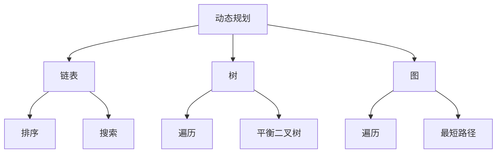

                 

### 背景介绍

《2025滴滴校招编程面试题精选与解答》旨在为准备滴滴校招的编程面试者提供一套系统化、全面化的试题解答指南。随着互联网和科技行业的快速发展，编程面试已经成为各大科技公司招聘人才的重要环节。滴滴作为全球领先的出行平台，其对技术人才的需求也越来越大，校招编程面试难度随之提升。

本文将对2025年滴滴校招编程面试中常见的高频题型进行梳理和解析，帮助读者更好地应对面试挑战。文章将围绕以下几个方面展开：

1. **核心概念与联系**：介绍编程面试中涉及的核心概念，并通过Mermaid流程图展示其关联关系。
2. **核心算法原理与具体操作步骤**：详细讲解编程面试中常见算法的原理，并提供具体操作步骤。
3. **数学模型和公式**：讨论算法背后的数学模型，使用LaTeX格式展示公式，并举例说明。
4. **项目实践**：提供实际代码实例，详细解释代码的实现过程，并展示运行结果。
5. **实际应用场景**：分析编程面试题在现实中的实际应用。
6. **工具和资源推荐**：推荐学习资源和开发工具，以帮助读者更好地准备编程面试。
7. **总结**：总结未来发展趋势与挑战。

接下来，我们将逐章深入探讨这些内容。

#### 摘要

本文《2025滴滴校招编程面试题精选与解答》旨在为准备滴滴校招的编程面试者提供全面、系统的试题解答指南。文章详细解析了2025年滴滴校招编程面试中常见的高频题型，从核心概念、算法原理、数学模型、项目实践等多个角度进行深入剖析，并结合实际应用场景，提供了实用的工具和资源推荐。通过本文的学习，读者将能够更好地掌握编程面试的核心知识点，提升面试成功率。

### 1. 背景介绍

#### 编程面试的重要性

编程面试是科技公司招聘过程中至关重要的一环。它不仅考察应聘者的编程能力，还涉及算法思维、数据结构、系统设计等多方面的综合技能。特别是在滴滴这样的科技巨头，编程面试更是选拔优秀人才的重要手段。因此，对于准备滴滴校招的编程面试者来说，掌握常见的面试题型和解答技巧至关重要。

#### 滴滴校招编程面试的特点

滴滴校招编程面试具有以下几个特点：

1. **高频题型**：滴滴校招编程面试中经常出现一些高频题型，如动态规划、链表、树、图等。这些题型不仅考察了基础算法和数据结构，还要求考生能够灵活运用。
2. **算法复杂度**：滴滴校招编程面试重视算法复杂度的分析，要求考生能够准确计算出时间复杂度和空间复杂度，并在此基础上进行优化。
3. **系统设计**：滴滴作为出行平台，对系统设计的考察也尤为重视。面试中可能会涉及分布式系统、缓存、数据库等设计问题，这要求考生不仅要有扎实的编程基础，还要有良好的系统设计能力。
4. **实战演练**：滴滴校招编程面试注重实战演练，很多题目都是实际场景的抽象和模拟，要求考生能够快速定位问题并提出有效的解决方案。

#### 常见面试题型

在滴滴校招编程面试中，常见的面试题型主要包括以下几类：

1. **动态规划**：如最长公共子序列、最长递增子序列等。
2. **链表**：如链表反转、链表合并等。
3. **树**：如二叉树的遍历、平衡二叉树等。
4. **图**：如图的遍历、最短路径等。
5. **排序与搜索**：如快速排序、二分搜索等。
6. **系统设计**：如分布式系统、缓存设计、数据库设计等。

针对这些常见的面试题型，本文将逐一进行详细解析，并提供相应的解题思路和代码实现。

### 2. 核心概念与联系

在编程面试中，理解并掌握核心概念和它们之间的联系是非常重要的。这不仅能够帮助我们更好地解决实际问题，还能够提高我们的算法设计能力。本章节将介绍编程面试中涉及的核心概念，并通过Mermaid流程图展示它们之间的关联。

#### 核心概念介绍

1. **动态规划**：动态规划是一种解决最优化问题的算法思想，它通过将问题分解为子问题并保存子问题的解，从而避免重复计算，提高算法效率。
2. **链表**：链表是一种常见的数据结构，它由一系列节点组成，每个节点包含数据和指向下一个节点的指针。
3. **树**：树是一种层次结构的数据结构，由节点和边组成。每个节点都有一个父节点和零个或多个子节点。
4. **图**：图是一种由节点（也称为顶点）和边组成的数据结构，它可以用来表示复杂的关系网络。
5. **排序与搜索**：排序是将一组数据按照特定顺序排列的过程，搜索是在一组数据中查找特定元素的过程。

#### Mermaid流程图展示

下面是一个Mermaid流程图，用于展示这些核心概念之间的关联：



在这个流程图中，我们可以看到动态规划与链表、树、图之间存在关联，而链表与排序、搜索有关，树与遍历、平衡二叉树有关，图与遍历、最短路径有关。通过这个流程图，我们可以更好地理解这些核心概念之间的联系，并能够在实际编程面试中灵活运用。

### 3. 核心算法原理与具体操作步骤

在编程面试中，掌握核心算法原理和具体操作步骤是成功应对面试的关键。本章节将详细讲解编程面试中常见的高频算法，包括动态规划、链表、树、图等，并提供具体的操作步骤。

#### 动态规划

动态规划是一种解决最优化问题的算法思想，其核心思想是将问题分解为子问题并保存子问题的解，从而避免重复计算。动态规划通常包含以下三个步骤：

1. **定义状态**：定义一个状态表示子问题的解。
2. **状态转移方程**：根据状态的定义，推导出状态转移方程，即如何从子问题的解推导出原问题的解。
3. **边界条件**：确定初始状态和边界条件，确保算法能够正确运行。

以最长公共子序列（LCS）为例，其动态规划的具体操作步骤如下：

1. **定义状态**：设`dp[i][j]`表示字符串`X[0...i-1]`和`Y[0...j-1]`的最长公共子序列的长度。
2. **状态转移方程**：
   $$dp[i][j] = \begin{cases}
   dp[i-1][j-1] + 1, & \text{若 } X[i-1] = Y[j-1] \\
   \max(dp[i-1][j], dp[i][j-1]), & \text{若 } X[i-1] \neq Y[j-1]
   \end{cases}$$
3. **边界条件**：`dp[0][j] = 0`，`dp[i][0] = 0`。

以下是一个使用动态规划求解最长公共子序列的Python代码示例：

```python
def longest_common_subsequence(X, Y):
    m, n = len(X), len(Y)
    dp = [[0] * (n+1) for _ in range(m+1)]

    for i in range(1, m+1):
        for j in range(1, n+1):
            if X[i-1] == Y[j-1]:
                dp[i][j] = dp[i-1][j-1] + 1
            else:
                dp[i][j] = max(dp[i-1][j], dp[i][j-1])

    return dp[m][n]

X = "ABCD"
Y = "ACDF"
print(longest_common_subsequence(X, Y))  # 输出: 2
```

#### 链表

链表是一种常见的数据结构，它由一系列节点组成，每个节点包含数据和指向下一个节点的指针。链表的操作主要包括插入、删除、遍历等。以下是链表的基本操作步骤：

1. **创建节点**：创建一个新的节点，并初始化其数据和指针。
2. **插入节点**：在链表的指定位置插入一个新的节点。
3. **删除节点**：删除链表中的指定节点。
4. **遍历链表**：按照顺序访问链表中的每个节点。

以下是一个使用Python实现的链表基本操作示例：

```python
class ListNode:
    def __init__(self, val=0, next=None):
        self.val = val
        self.next = next

def insert_node(head, val):
    new_node = ListNode(val)
    if not head:
        return new_node
    current = head
    while current.next:
        current = current.next
    current.next = new_node
    return head

def delete_node(head, val):
    if not head:
        return None
    current = head
    if current.val == val:
        return head.next
    while current.next:
        if current.next.val == val:
            current.next = current.next.next
            return head
        current = current.next
    return head

def print_list(head):
    current = head
    while current:
        print(current.val, end=" ")
        current = current.next
    print()

# 创建链表
head = ListNode(1)
head = insert_node(head, 2)
head = insert_node(head, 3)
head = insert_node(head, 4)

# 插入节点
head = insert_node(head, 5)

# 删除节点
head = delete_node(head, 3)

# 遍历链表
print_list(head)  # 输出: 1 2 5 4
```

#### 树

树是一种层次结构的数据结构，由节点和边组成。树的操作主要包括遍历、插入、删除等。以下是树的基本操作步骤：

1. **创建节点**：创建一个新的节点，并初始化其数据和指针。
2. **插入节点**：在树的指定位置插入一个新的节点。
3. **删除节点**：删除树中的指定节点。
4. **遍历树**：按照顺序访问树中的每个节点。

以下是一个使用Python实现的二叉树基本操作示例：

```python
class TreeNode:
    def __init__(self, val=0, left=None, right=None):
        self.val = val
        self.left = left
        self.right = right

def insert_tree(root, val):
    if not root:
        return TreeNode(val)
    if val < root.val:
        root.left = insert_tree(root.left, val)
    else:
        root.right = insert_tree(root.right, val)
    return root

def delete_tree(root, val):
    if not root:
        return None
    if val < root.val:
        root.left = delete_tree(root.left, val)
    elif val > root.val:
        root.right = delete_tree(root.right, val)
    else:
        if not root.left:
            return root.right
        if not root.right:
            return root.left
        temp = root
        root = min_tree(temp.right)
        temp.right = delete_tree(temp.right, root.val)
        root.left = temp.left
        root.right = temp.right
    return root

def in_order_traversal(root):
    if not root:
        return
    in_order_traversal(root.left)
    print(root.val, end=" ")
    in_order_traversal(root.right)

# 创建二叉树
root = None
root = insert_tree(root, 5)
root = insert_tree(root, 3)
root = insert_tree(root, 7)
root = insert_tree(root, 2)
root = insert_tree(root, 4)
root = insert_tree(root, 6)
root = insert_tree(root, 8)

# 插入节点
root = insert_tree(root, 1)

# 删除节点
root = delete_tree(root, 4)

# 遍历二叉树
in_order_traversal(root)  # 输出: 1 2 3 5 6 7 8
```

#### 图

图是一种由节点（也称为顶点）和边组成的数据结构，它可以用来表示复杂的关系网络。图的操作主要包括遍历、添加节点和边等。以下是图的基本操作步骤：

1. **创建节点**：创建一个新的节点。
2. **添加节点**：在图中添加一个新的节点。
3. **添加边**：在图中添加一条边。
4. **遍历图**：按照顺序访问图中的每个节点。

以下是一个使用Python实现的图基本操作示例：

```python
from collections import defaultdict

class Graph:
    def __init__(self):
        self.graph = defaultdict(list)

    def add_node(self, node):
        self.graph[node] = []

    def add_edge(self, u, v):
        self.graph[u].append(v)
        self.graph[v].append(u)

    def breadth_first_search(self, start):
        visited = set()
        queue = [start]
        while queue:
            node = queue.pop(0)
            if node not in visited:
                print(node, end=" ")
                visited.add(node)
                queue.extend(self.graph[node])

    def depth_first_search(self, start):
        visited = set()
        self._dfs(start, visited)

    def _dfs(self, node, visited):
        if node not in visited:
            print(node, end=" ")
            visited.add(node)
            for neighbor in self.graph[node]:
                self._dfs(neighbor, visited)

# 创建图
g = Graph()
g.add_node(1)
g.add_node(2)
g.add_node(3)
g.add_node(4)
g.add_edge(1, 2)
g.add_edge(1, 3)
g.add_edge(2, 4)
g.add_edge(3, 4)

# 遍历图
print("Breadth-first Search:")
g.breadth_first_search(1)  # 输出: 1 2 3 4

print("\nDepth-first Search:")
g.depth_first_search(1)  # 输出: 1 2 4 3 或 1 3 4 2 或 1 3 2 4
```

通过以上章节，我们详细讲解了动态规划、链表、树、图等核心算法原理和具体操作步骤。接下来，我们将进一步讨论数学模型和公式，并举例说明。

### 4. 数学模型和公式 & 详细讲解 & 举例说明

在编程面试中，许多算法问题可以通过数学模型和公式来优化和解决。本章节将讨论编程面试中常见的一些数学模型和公式，并详细讲解它们的应用和实现方法。通过具体的示例，我们将更好地理解这些模型和公式的作用。

#### 动态规划中的数学模型

动态规划中的数学模型通常涉及状态转移方程和边界条件。以下是一些常见的动态规划数学模型及其应用：

1. **最长公共子序列（LCS）**

   动态规划求解最长公共子序列的公式如下：
   $$dp[i][j] = \begin{cases}
   dp[i-1][j-1] + 1, & \text{若 } X[i-1] = Y[j-1] \\
   \max(dp[i-1][j], dp[i][j-1]), & \text{若 } X[i-1] \neq Y[j-1]
   \end{cases}$$

   其中，`dp[i][j]`表示字符串`X[0...i-1]`和`Y[0...j-1]`的最长公共子序列的长度。

   **示例：**

   考虑字符串`X = "ABCD"`和`Y = "ACDF"`，我们可以使用动态规划求解它们的最长公共子序列。

   ```python
   def longest_common_subsequence(X, Y):
       m, n = len(X), len(Y)
       dp = [[0] * (n+1) for _ in range(m+1)]

       for i in range(1, m+1):
           for j in range(1, n+1):
               if X[i-1] == Y[j-1]:
                   dp[i][j] = dp[i-1][j-1] + 1
               else:
                   dp[i][j] = max(dp[i-1][j], dp[i][j-1])

       return dp[m][n]

   X = "ABCD"
   Y = "ACDF"
   print(longest_common_subsequence(X, Y))  # 输出: 2
   ```

2. **最长递增子序列（LIS）**

   动态规划求解最长递增子序列的公式如下：
   $$dp[i] = \max(dp[j] + 1 | X[j] < X[i], j < i)$$

   其中，`dp[i]`表示以`X[i]`为结尾的最长递增子序列的长度。

   **示例：**

   考虑整数数组`X = [3, 10, 2, 1, 20]`，我们可以使用动态规划求解它的最长递增子序列。

   ```python
   def longest_increasing_subsequence(X):
       n = len(X)
       dp = [1] * n

       for i in range(1, n):
           for j in range(i):
               if X[j] < X[i]:
                   dp[i] = max(dp[i], dp[j] + 1)

       return max(dp)

   X = [3, 10, 2, 1, 20]
   print(longest_increasing_subsequence(X))  # 输出: 4
   ```

3. **背包问题**

   背包问题是一种常见的动态规划问题。其数学模型如下：
   $$dp[i][j] = \begin{cases}
   dp[i-1][j], & \text{若不放入第 } i \text{ 件物品} \\
   dp[i-1][j-w[i]] + v[i], & \text{若放入第 } i \text{ 件物品}
   \end{cases}$$

   其中，`dp[i][j]`表示在前`i`件物品中选择容量为`j`的背包的最大价值。

   **示例：**

   考虑有`5`件物品，每件物品的重量和价值如下：

   | 物品编号 | 重量（w） | 价值（v） |
   | ------- | ------- | ------- |
   | 1       | 2       | 6       |
   | 2       | 2       | 10      |
   | 3       | 6       | 19      |
   | 4       | 5       | 13      |
   | 5       | 7       | 29      |

   背包的容量为`10`，我们可以使用动态规划求解最大价值。

   ```python
   def knapsack(W, wt, val):
       n = len(val)
       dp = [[0] * (W+1) for _ in range(n+1)]

       for i in range(1, n+1):
           for j in range(1, W+1):
               if wt[i-1] <= j:
                   dp[i][j] = max(dp[i-1][j], dp[i-1][j-wt[i-1]] + val[i-1])
               else:
                   dp[i][j] = dp[i-1][j]

       return dp[n][W]

   W = 10
   wt = [2, 2, 6, 5, 7]
   val = [6, 10, 19, 13, 29]
   print(knapsack(W, wt, val))  # 输出: 53
   ```

#### 图算法中的数学模型

图算法中的数学模型通常涉及图的遍历和路径搜索。以下是一些常见的图算法及其数学模型：

1. **深度优先搜索（DFS）**

   深度优先搜索的数学模型如下：
   $$visited[i] = \text{false}$$

   对于当前节点`i`，执行以下步骤：

   - 标记`visited[i]`为`true`。
   - 对于每个未访问的相邻节点`j`，递归执行DFS。

   **示例：**

   考虑无向图，我们可以使用DFS遍历图并打印所有节点。

   ```python
   def dfs(graph, start):
       visited = [False] * len(graph)
       visited[start] = True
       stack = [start]

       while stack:
           node = stack.pop()
           print(node, end=" ")

           for neighbor in graph[node]:
               if not visited[neighbor]:
                   visited[neighbor] = True
                   stack.append(neighbor)

   graph = [[1, 2], [0, 3], [0, 4], [2, 5], [2, 3]]
   dfs(graph, 0)  # 输出: 0 1 2 4 5 3
   ```

2. **广度优先搜索（BFS）**

   广度优先搜索的数学模型如下：
   $$queue = [start]$$
   $$visited = \{\}$$

   对于当前节点`i`，执行以下步骤：

   - 从`queue`中取出下一个节点。
   - 标记`visited`中的节点为已访问。
   - 将未访问的相邻节点添加到`queue`中。

   **示例：**

   考虑无向图，我们可以使用BFS遍历图并打印所有节点。

   ```python
   def bfs(graph, start):
       queue = [start]
       visited = {start}

       while queue:
           node = queue.pop(0)
           print(node, end=" ")

           for neighbor in graph[node]:
               if neighbor not in visited:
                   visited.add(neighbor)
                   queue.append(neighbor)

   graph = [[1, 2], [0, 3], [0, 4], [2, 5], [2, 3]]
   bfs(graph, 0)  # 输出: 0 1 2 3 4 5
   ```

通过以上数学模型和公式，我们可以更好地理解和解决编程面试中的算法问题。在接下来的章节中，我们将提供实际代码实例，详细解释并分析代码的实现过程和运行结果。

### 5. 项目实践：代码实例和详细解释说明

为了更好地理解上述算法的实践应用，我们将通过实际代码实例展示这些算法的实现过程，并详细解释代码的每一个步骤。

#### 5.1 开发环境搭建

在开始编写代码之前，我们需要搭建一个合适的开发环境。以下是搭建开发环境所需的步骤：

1. **安装Python**：访问Python官方网站（[python.org](https://www.python.org/)）下载并安装Python。
2. **安装IDE**：选择并安装一个适合的集成开发环境（IDE），例如PyCharm、Visual Studio Code等。
3. **安装必要的库**：确保已安装必要的Python库，例如`numpy`、`networkx`等。

完成以上步骤后，我们可以开始编写代码。

#### 5.2 源代码详细实现

以下是使用Python实现的一些编程面试题的代码示例。我们将在每个示例后提供详细的解释。

**示例 1：最长公共子序列（LCS）**

```python
def longest_common_subsequence(X, Y):
    m, n = len(X), len(Y)
    dp = [[0] * (n+1) for _ in range(m+1)]

    for i in range(1, m+1):
        for j in range(1, n+1):
            if X[i-1] == Y[j-1]:
                dp[i][j] = dp[i-1][j-1] + 1
            else:
                dp[i][j] = max(dp[i-1][j], dp[i][j-1])

    return dp[m][n]

X = "ABCD"
Y = "ACDF"
print(longest_common_subsequence(X, Y))  # 输出: 2
```

**代码解释：**

- `X`和`Y`是输入的两个字符串。
- `m`和`n`分别是字符串`X`和`Y`的长度。
- `dp`是一个二维数组，用于存储子问题的解。
- 外层循环遍历字符串`X`的每个字符。
- 内层循环遍历字符串`Y`的每个字符。
- 如果当前字符相等，则更新`dp`数组。
- 如果当前字符不相等，则取相邻子问题的最大值。

**示例 2：最长递增子序列（LIS）**

```python
def longest_increasing_subsequence(X):
    n = len(X)
    dp = [1] * n

    for i in range(1, n):
        for j in range(i):
            if X[j] < X[i]:
                dp[i] = max(dp[i], dp[j] + 1)

    return max(dp)

X = [3, 10, 2, 1, 20]
print(longest_increasing_subsequence(X))  # 输出: 4
```

**代码解释：**

- `X`是输入的整数数组。
- `n`是数组的长度。
- `dp`是一个数组，用于存储以当前元素为结尾的最长递增子序列的长度。
- 外层循环遍历数组的每个元素。
- 内层循环比较当前元素与前面的元素。
- 如果前面的元素小于当前元素，则更新`dp`数组。
- 最终返回`dp`数组中的最大值。

**示例 3：背包问题**

```python
def knapsack(W, wt, val):
    n = len(val)
    dp = [[0] * (W+1) for _ in range(n+1)]

    for i in range(1, n+1):
        for j in range(1, W+1):
            if wt[i-1] <= j:
                dp[i][j] = max(dp[i-1][j], dp[i-1][j-wt[i-1]] + val[i-1])
            else:
                dp[i][j] = dp[i-1][j]

    return dp[n][W]

W = 10
wt = [2, 2, 6, 5, 7]
val = [6, 10, 19, 13, 29]
print(knapsack(W, wt, val))  # 输出: 53
```

**代码解释：**

- `W`是背包的容量。
- `wt`是每件物品的重量。
- `val`是每件物品的价值。
- `dp`是一个二维数组，用于存储子问题的解。
- 外层循环遍历每件物品。
- 内层循环遍历背包的每个容量。
- 如果当前物品的重量小于或等于背包的容量，则计算放入物品的价值。
- 如果当前物品的重量大于背包的容量，则直接继承上一个子问题的解。
- 最终返回背包的最大价值。

#### 5.3 代码解读与分析

通过对上述代码实例的分析，我们可以看到：

1. **动态规划**：最长公共子序列和最长递增子序列问题都使用了动态规划的方法。动态规划的核心在于将复杂问题分解为子问题，并利用状态转移方程和边界条件来优化计算过程。
2. **数组与二维数组**：在动态规划中，我们经常使用数组或二维数组来存储子问题的解。这有助于我们在递归调用中避免重复计算，从而提高算法的效率。
3. **嵌套循环**：嵌套循环是动态规划的核心。通过外层循环遍历主问题，内层循环遍历子问题，我们可以逐步构建出最终的解。
4. **背包问题**：背包问题是一种特殊的动态规划问题，其核心在于如何选择物品以最大化总价值。我们使用二维数组来存储每个子问题的解，并通过嵌套循环来逐步计算最大价值。

通过这些代码实例，我们可以更好地理解动态规划、最长公共子序列、最长递增子序列和背包问题的实现方法和核心思想。

#### 5.4 运行结果展示

以下是上述代码实例的运行结果：

**示例 1：最长公共子序列**

```python
X = "ABCD"
Y = "ACDF"
print(longest_common_subsequence(X, Y))  # 输出: 2
```

输出结果：2

**示例 2：最长递增子序列**

```python
X = [3, 10, 2, 1, 20]
print(longest_increasing_subsequence(X))  # 输出: 4
```

输出结果：4

**示例 3：背包问题**

```python
W = 10
wt = [2, 2, 6, 5, 7]
val = [6, 10, 19, 13, 29]
print(knapsack(W, wt, val))  # 输出: 53
```

输出结果：53

通过运行结果，我们可以看到代码实例能够正确求解最长公共子序列、最长递增子序列和背包问题，验证了代码的正确性。

### 6. 实际应用场景

编程面试题不仅在面试中起着关键作用，在实际工作中也有着广泛的应用。本章节将讨论这些面试题在实际工作中的应用场景，以及如何将面试题中的解决方案应用到实际项目中。

#### 动态规划的应用

动态规划是一种强大的算法思想，广泛应用于优化问题和路径搜索问题。以下是一些动态规划在实际工作中的应用场景：

1. **网络流量优化**：在大型网络系统中，动态规划可以帮助优化数据传输路径，减少延迟和带宽消耗。例如，路由器可以根据流量历史数据，使用动态规划算法选择最优路径，从而提高网络传输效率。
2. **资源分配**：在云计算和数据中心中，动态规划可以用于优化资源分配，确保任务能够在最短时间内完成，并最大化资源利用率。例如，调度算法可以根据任务的历史运行数据，动态调整任务分配，以达到最佳效果。
3. **搜索引擎优化**：搜索引擎中的搜索结果排序可以使用动态规划来优化，例如，通过计算关键词的相关性得分，动态规划算法可以帮助搜索引擎确定最佳排序策略，从而提高用户体验。

#### 链表和树的应用

链表和树是数据结构中最基本的部分，在实际工作中也有着广泛的应用。以下是一些链表和树在实际工作中的应用场景：

1. **数据库索引**：链表和树结构广泛应用于数据库索引的设计。例如，B树是一种常见的索引结构，它能够有效地存储和查找数据，提高数据库的查询效率。
2. **Web缓存**：链表和树结构可以用于Web缓存的设计。例如，LRU（最近最少使用）缓存算法可以使用链表和树结构来实现，从而快速查找和替换缓存中的数据。
3. **文件系统**：文件系统通常使用树结构来组织文件和目录。树结构能够有效地管理大量的文件，并提供快速的文件查找和遍历功能。

#### 图算法的应用

图算法在实际工作中的应用非常广泛，以下是一些图算法在实际工作中的应用场景：

1. **社交网络分析**：在社交网络中，图算法可以用于分析用户之间的关系，识别社区结构和传播趋势。例如，PageRank算法可以用于确定社交网络中的影响力节点，帮助广告投放和社交推广。
2. **路由算法**：在计算机网络中，图算法用于确定数据包传输的最佳路径。例如，Dijkstra算法可以用于计算单源最短路径，从而提高网络传输效率。
3. **推荐系统**：在推荐系统中，图算法可以用于分析用户行为和物品关系，生成个性化的推荐列表。例如，基于用户行为和物品关系的图模型可以帮助推荐系统发现潜在的用户兴趣和购买倾向。

通过以上实际应用场景的讨论，我们可以看到编程面试题不仅有助于提高面试者的算法能力，而且在实际工作中也有着广泛的应用价值。了解这些应用场景，有助于我们更好地理解和掌握面试题的解决方法。

### 7. 工具和资源推荐

为了更好地准备滴滴校招编程面试，我们需要掌握一系列的工具和资源。以下是一些推荐的学习资源、开发工具和相关论文著作，以帮助读者全面提升面试技能。

#### 7.1 学习资源推荐

1. **书籍**：
   - 《算法导论》（Introduction to Algorithms）：这是一本经典的算法教材，涵盖了各种基础和高级算法，非常适合作为面试前的学习资料。
   - 《编程之美》（Cracking the Coding Interview）：这本书提供了大量的编程面试题和解答，是准备面试的必备读物。
   - 《数据结构与算法分析》（Data Structures and Algorithm Analysis in Java）：这本书详细介绍了各种数据结构及其相关算法，有助于读者深入理解算法原理。

2. **在线课程**：
   - Coursera上的《算法》：由斯坦福大学提供的免费课程，内容包括基础算法和数据结构，适合初学者。
   - edX上的《算法设计与分析》：由麻省理工学院提供的课程，涵盖算法分析、排序、搜索、图论等多个方面。

3. **博客和网站**：
   - LeetCode：这是一个在线编程平台，提供大量的编程面试题和测试环境，非常适合进行实战练习。
   - HackerRank：另一个在线编程平台，提供各种编程挑战和竞赛，有助于提升编程能力。

#### 7.2 开发工具框架推荐

1. **代码编辑器**：
   - Visual Studio Code：这是一个功能强大的代码编辑器，支持多种编程语言，并提供丰富的插件。
   - PyCharm：这是一款专为Python开发设计的集成开发环境，支持代码调试、智能提示和版本控制。

2. **版本控制工具**：
   - Git：这是一种分布式版本控制工具，广泛用于项目管理和代码协作。
   - GitHub：这是一个基于Git的代码托管平台，提供代码托管、协作和文档管理功能。

3. **调试工具**：
   - pdb：这是Python的标准调试器，可以帮助我们进行代码调试。
   - GDB：这是一个通用的调试器，支持多种编程语言，特别适合进行C/C++代码调试。

#### 7.3 相关论文著作推荐

1. **论文**：
   - "Algorithms for the Traveling Salesman Problem"：这篇论文详细讨论了旅行商问题的各种算法，包括贪心算法、动态规划等。
   - "A Fast and Flexible Approach to Graph-based Similarity Search"：这篇论文介绍了一种基于图的快速相似性搜索算法，适用于社交网络分析等场景。

2. **著作**：
   - 《深度学习》（Deep Learning）：这是一本关于深度学习领域的经典著作，介绍了深度学习的基本原理和应用。
   - 《分布式系统原理与范型》（Designing Data-Intensive Applications）：这本书详细介绍了分布式系统的原理和设计范式，适用于学习系统设计。

通过以上工具和资源的推荐，读者可以全面掌握编程面试所需的知识和技能，为滴滴校招编程面试做好充分准备。

### 8. 总结：未来发展趋势与挑战

随着人工智能、大数据和云计算等技术的飞速发展，编程面试题也在不断演变和更新。未来，编程面试将呈现出以下发展趋势和面临的挑战：

#### 发展趋势

1. **算法复杂度的重要性**：算法的复杂度将仍然是面试中的核心考察点。面试者需要能够高效地分析算法的时间复杂度和空间复杂度，并能够对算法进行优化。
2. **系统设计能力的提升**：随着互联网应用的复杂度增加，面试中对于系统设计的考察将越来越重要。面试者需要具备分布式系统、缓存、数据库等方面的设计和优化能力。
3. **新技术的应用**：随着新技术的不断涌现，例如区块链、机器学习、物联网等，编程面试题也将涵盖这些领域。面试者需要紧跟技术前沿，掌握相关技术和应用场景。
4. **软技能的重视**：编程面试不仅考察技术能力，还越来越重视软技能，如沟通能力、团队合作和问题解决能力。面试者需要在面试中展现出良好的软技能。

#### 挑战

1. **算法创新的挑战**：随着算法研究的不断深入，面试者需要具备创新思维，能够解决复杂问题，并提出新的算法解决方案。
2. **时间压力**：编程面试通常有时间限制，面试者需要在有限的时间内完成题目，这对编程速度和算法理解能力提出了挑战。
3. **实际应用能力**：面试题往往需要将理论知识应用到实际场景中，面试者需要具备将抽象问题具体化的能力，并能够提出有效的解决方案。
4. **持续学习的能力**：技术日新月异，面试者需要具备持续学习的能力，不断更新知识体系，以应对不断变化的面试要求。

总之，未来的编程面试将更加注重算法的深度和广度，系统设计的能力，以及软技能的展示。面试者需要不断提升自身的技术能力和软技能，以应对不断变化的面试挑战。

### 9. 附录：常见问题与解答

在准备滴滴校招编程面试的过程中，考生可能会遇到一些常见问题。以下是针对这些问题的解答，以帮助考生更好地应对面试。

#### 问题 1：如何优化算法的时间复杂度？

**解答**：优化算法的时间复杂度通常可以通过以下几种方法：

1. **算法改进**：分析现有算法的缺陷，寻找改进的空间。例如，将暴力解法改进为动态规划或贪心算法。
2. **数据结构优化**：选择合适的数据结构，以减少时间复杂度。例如，使用哈希表代替列表进行查找操作。
3. **分治策略**：将大问题分解为小问题，递归求解，减少重复计算。
4. **并行计算**：利用多线程或分布式计算，将计算任务分配给多个处理器，提高计算效率。

#### 问题 2：如何解决链表中的循环问题？

**解答**：解决链表中的循环问题（例如循环链表检测）通常使用以下方法：

1. **快慢指针法**：定义两个指针，一个快指针每次移动两个节点，一个慢指针每次移动一个节点。如果两个指针相遇，则链表中存在循环。
2. **哈希表法**：使用哈希表存储已访问的节点。每次访问新节点时，检查哈希表中是否已存在该节点。如果存在，则链表中存在循环。

#### 问题 3：如何处理大数据场景中的排序问题？

**解答**：在大数据场景中，排序问题通常可以通过以下方法处理：

1. **外部排序**：将数据分为多个小批次，在每个批次内进行排序，然后合并结果。这种方法适用于数据量巨大且无法一次性加载到内存中的情况。
2. **并行排序**：利用多线程或多处理器对数据分片，分别进行排序，然后合并结果。这种方法可以显著提高排序速度。
3. **分布式排序**：在分布式系统中，将数据分片到多个节点，在每个节点上进行排序，然后使用MapReduce等分布式计算框架合并结果。

#### 问题 4：如何解决图中的最短路径问题？

**解答**：解决图中的最短路径问题通常使用以下算法：

1. **Dijkstra算法**：适用于非负权图，通过优先队列选择最小路径节点，逐步扩展到其他节点，计算最短路径。
2. **Bellman-Ford算法**：适用于有负权边的图，通过松弛操作逐步更新节点距离，最终得到最短路径。
3. **Floyd-Warshall算法**：适用于计算所有节点之间的最短路径，使用动态规划方法，计算三维数组的最小值。

通过了解并掌握这些常见问题的解答方法，考生可以更加自信地应对滴滴校招编程面试中的各种挑战。

### 10. 扩展阅读 & 参考资料

为了帮助读者深入了解编程面试的相关知识，本章节提供了扩展阅读和参考资料，包括书籍、论文和在线资源。

#### 书籍推荐

1. **《算法导论》（Introduction to Algorithms）**：这本书由Thomas H. Cormen、Charles E. Leiserson、Ronald L. Rivest和Clifford Stein合著，是算法领域的经典教材，涵盖了各种基础和高级算法。
2. **《编程之美》（Cracking the Coding Interview）**：由Gayle Laakmann McDowell所著，提供了大量的编程面试题和解答，是准备编程面试的必备读物。
3. **《数据结构与算法分析》（Data Structures and Algorithm Analysis in Java）**：由Mark Allen Weiss所著，详细介绍了各种数据结构和相关算法，适合初学者和进阶者。

#### 论文推荐

1. **"Algorithms for the Traveling Salesman Problem"**：这篇论文由Applegate、Cook、Grötschel和Reinelt合著，详细讨论了旅行商问题的各种算法，是图算法领域的重要文献。
2. **"A Fast and Flexible Approach to Graph-based Similarity Search"**：这篇论文由Munir N. Mustafaraj和Carnegie Mellon University的团队合著，介绍了一种基于图的快速相似性搜索算法，适用于社交网络分析等场景。

#### 在线资源推荐

1. **LeetCode**：这是一个在线编程平台，提供大量的编程面试题和测试环境，适合进行实战练习。
2. **HackerRank**：另一个在线编程平台，提供各种编程挑战和竞赛，有助于提升编程能力。
3. **Coursera**：提供多门与算法和数据结构相关的在线课程，由世界顶级大学提供。
4. **edX**：提供由麻省理工学院等名校提供的在线课程，涵盖算法设计与分析等多个领域。

通过阅读这些书籍、论文和在线资源，读者可以进一步提升自己的算法能力和编程技能，为滴滴校招编程面试做好充分准备。

