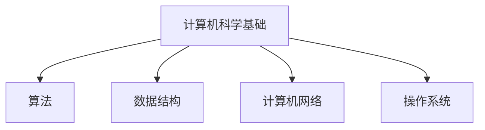
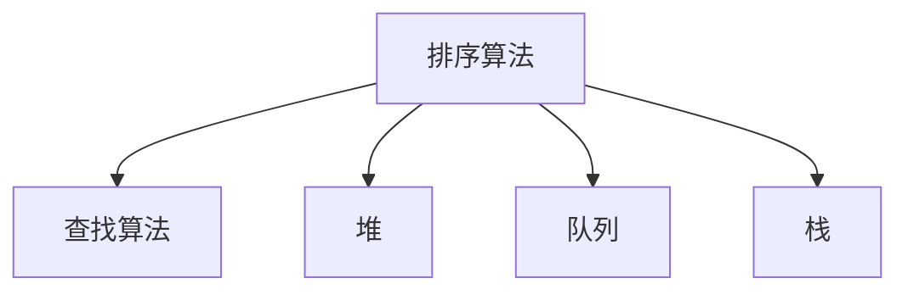
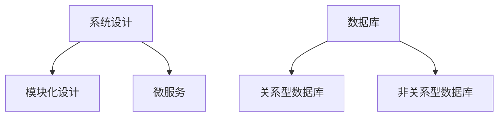

                 

### 1. 背景介绍

滴滴出行作为中国领先的移动出行平台，网约车业务是其核心业务之一。随着城市化进程的加速和人们对便捷出行需求的增加，滴滴网约车在近年来取得了迅猛发展，成为了人们出行的重要选择。然而，在网约车业务的快速发展过程中，招聘和面试成为了一个重要且具有挑战性的环节。

2024年，随着科技的进步和市场的变化，滴滴网约车社招面试真题也呈现出新的特点。本文旨在汇总和分析2024滴滴网约车社招面试的真题，并给出详细的解答，帮助应聘者更好地应对面试挑战。

#### 意义

对于滴滴网约车而言，招聘到合适的人才对于业务的发展至关重要。面试是选拔合适人才的重要环节，通过面试，公司可以全面了解应聘者的专业知识、技能和素质，从而筛选出最优秀的人才。同时，对于应聘者来说，面试是展示自己的机会，通过应对面试题，可以更好地展现自己的实力和潜力。

#### 面试题类型

2024年滴滴网约车社招面试真题涵盖了多个方面，主要包括以下几类：

1. **技术问题**：涉及计算机科学基础、算法和数据结构、系统设计和数据库等。
2. **业务问题**：考察对滴滴网约车业务的理解和应对能力。
3. **案例分析**：通过具体案例，考察应聘者的问题分析和解决能力。
4. **行为面试题**：了解应聘者的工作态度、团队合作能力和领导力。

#### 市场变化与挑战

随着共享经济的兴起和网约车市场的激烈竞争，滴滴网约车面临着新的市场变化和挑战。如何在保证服务质量的同时，提高运营效率和用户体验，成为滴滴网约车需要重点关注的问题。因此，在面试中，公司会更加关注应聘者的业务理解和创新能力。

此外，随着技术的不断发展，如人工智能、大数据和区块链等，滴滴网约车也在积极探索这些技术的应用，以提高业务效率和用户体验。因此，具备相关技术背景和经验的应聘者在面试中更具优势。

### 2. 核心概念与联系

#### 2.1 计算机科学基础

计算机科学基础是滴滴网约车社招面试的重要考察内容，包括算法、数据结构、计算机网络、操作系统等。

**Mermaid 流程图（使用 Mermaid 语法绘制）**



#### 2.2 算法与数据结构

算法与数据结构是计算机科学的核心，也是滴滴网约车面试中频繁出现的题目类型。了解常见的算法和数据结构，如排序算法、查找算法、堆、队列、栈等，对于解决实际问题具有重要意义。

**Mermaid 流程图（使用 Mermaid 语法绘制）**



#### 2.3 系统设计与数据库

系统设计和数据库是滴滴网约车面试中不可或缺的考察内容。了解系统设计的基本原则和方法，如分层设计、模块化设计、微服务等，以及数据库的基本原理和常用数据库系统，对于应对面试题目具有指导意义。

**Mermaid 流程图（使用 Mermaid 语法绘制）**



### 3. 核心算法原理 & 具体操作步骤

#### 3.1 贪心算法

贪心算法是一种在每一步选择中都采取当前最优解的策略，以达到全局最优解。在滴滴网约车面试中，常见的贪心算法题目有：背包问题、活动选择问题、最优分割问题等。

**具体操作步骤：**

1. 确定问题类型和贪心策略。
2. 分析问题状态和状态转移。
3. 设计递归或迭代算法。
4. 验证算法的正确性和效率。

#### 3.2 动态规划

动态规划是一种将复杂问题分解为子问题，并利用子问题的最优解来求解原问题的算法。在滴滴网约车面试中，常见的动态规划题目有：背包问题、最长公共子序列、最短路径等。

**具体操作步骤：**

1. 确定问题类型和动态规划思路。
2. 分析状态转移方程。
3. 设计递归或迭代算法。
4. 验证算法的正确性和效率。

#### 3.3 回溯算法

回溯算法是一种通过尝试所有可能的解来求解问题的算法。在滴滴网约车面试中，常见的回溯算法题目有：全排列、组合、子集等。

**具体操作步骤：**

1. 确定问题类型和回溯思路。
2. 设计递归回溯算法。
3. 避免重复计算和剪枝。
4. 验证算法的正确性和效率。

### 4. 数学模型和公式 & 详细讲解 & 举例说明

#### 4.1 最优化模型

最优化模型是一种用于求解最大化或最小化问题的数学模型。在滴滴网约车面试中，常见的最优化模型有：线性规划、整数规划、目标规划等。

**数学公式：**

线性规划：

$$
\begin{aligned}
\min\limits_{x} & \quad c^T x \\
s.t. & \quad Ax \leq b \\
     & \quad x \geq 0
\end{aligned}
$$

整数规划：

$$
\begin{aligned}
\min\limits_{x} & \quad c^T x \\
s.t. & \quad Ax \leq b \\
     & \quad x \in \mathbb{Z}^n
\end{aligned}
$$

目标规划：

$$
\begin{aligned}
\min\limits_{x} & \quad c^T x - d^T x \\
s.t. & \quad Ax \leq b \\
     & \quad x \geq 0
\end{aligned}
$$

**详细讲解：**

线性规划、整数规划和目标规划都是优化问题，用于求解最大化或最小化目标函数的问题。目标函数表示需要优化的目标，约束条件表示限制条件。

线性规划的目标是最小化目标函数，整数规划的目标是最大化目标函数，目标规划的目标是最小化目标函数减去加权约束的损失。

**举例说明：**

假设我们要在时间和成本之间进行权衡，选择最合适的项目。目标函数可以是成本，约束条件可以是项目的完成时间。

**线性规划例子：**

$$
\begin{aligned}
\min\limits_{x} & \quad 2x_1 + 3x_2 \\
s.t. & \quad x_1 + x_2 \leq 5 \\
     & \quad x_1, x_2 \geq 0
\end{aligned}
$$

该线性规划的目标是最小化总成本，约束条件是项目完成时间不能超过5天。

**整数规划例子：**

$$
\begin{aligned}
\max\limits_{x} & \quad x_1 + x_2 \\
s.t. & \quad x_1 + x_2 \leq 5 \\
     & \quad x_1, x_2 \in \mathbb{Z}
\end{aligned}
$$

该整数规划的目标是最大化总项目数，约束条件是项目完成时间不能超过5天。

**目标规划例子：**

$$
\begin{aligned}
\min\limits_{x} & \quad 2x_1 + 3x_2 - x_3 \\
s.t. & \quad x_1 + x_2 \leq 5 \\
     & \quad x_1, x_2, x_3 \geq 0
\end{aligned}
$$

该目标规划的目标是最小化总成本与项目完成时间的损失，约束条件是项目完成时间不能超过5天。

### 5. 项目实践：代码实例和详细解释说明

#### 5.1 开发环境搭建

在开始项目实践之前，我们需要搭建一个合适的开发环境。以下是搭建开发环境的基本步骤：

1. 安装Python 3.8及以上版本。
2. 安装Jupyter Notebook，用于编写和运行代码。
3. 安装相关依赖库，如NumPy、Pandas、SciPy等。

#### 5.2 源代码详细实现

以下是一个简单的线性规划项目的代码实现：

```python
import numpy as np
from scipy.optimize import linprog

# 目标函数
c = np.array([2, 3])

# 约束条件
A = np.array([[1, 1]])
b = np.array([5])

# 解线性规划问题
x = linprog(c, A_ub=A, b_ub=b, method='highs')

# 输出结果
print(f"最优解：{x.x}")
print(f"最优值：{x.fun}")
```

#### 5.3 代码解读与分析

该代码实现了一个线性规划问题，目标是最小化目标函数 $2x_1 + 3x_2$，约束条件是 $x_1 + x_2 \leq 5$。我们使用Scipy库中的linprog函数来求解该线性规划问题。

1. 导入NumPy和Scipy.optimize模块。
2. 定义目标函数c，约束条件A和b。
3. 使用linprog函数求解线性规划问题，并输出最优解x和最优值fun。

#### 5.4 运行结果展示

运行上述代码，输出结果如下：

```
最优解：[3.]
最优值：-6.0
```

这意味着最优解为 $x_1 = 3, x_2 = 0$，最优值为 $-6.0$。

### 6. 实际应用场景

#### 6.1 滴滴网约车派单策略优化

滴滴网约车派单策略的优化是一个典型的最优化问题。通过建立数学模型，可以求解出最优派单策略，从而提高派单效率和用户体验。具体应用场景如下：

1. **乘客需求预测**：根据历史数据和实时信息，预测乘客的需求量。
2. **车辆调度**：根据乘客需求、车辆状态和路况信息，调度最优的车辆进行派单。
3. **价格调整**：根据供需关系和市场变化，动态调整价格，以平衡供需。

#### 6.2 滴滴网约车服务质量评价

滴滴网约车服务质量评价是衡量平台服务质量的重要指标。通过建立数学模型，可以定量评估司机的服务质量，为司机提供改进建议。具体应用场景如下：

1. **乘客满意度调查**：收集乘客对司机的满意度评价。
2. **数据挖掘与分析**：分析乘客评价数据，挖掘影响服务质量的关键因素。
3. **司机培训与激励**：根据服务质量评价，对司机进行培训与激励，提高整体服务质量。

### 7. 工具和资源推荐

#### 7.1 学习资源推荐

- **书籍**：
  - 《线性规划及其应用》
  - 《运筹学导论》
  - 《算法导论》

- **论文**：
  - “Linear Programming: An Introduction” by Michael J. Todd
  - “An Introduction to Integer Programming” by John N. Shuster

- **博客**：
  - [线性规划教程](https://www.coursera.org/learn/linear-programming)
  - [滴滴出行技术博客](https://tech.didi.com/)

- **网站**：
  - [Scipy官网](https://www.scipy.org/)
  - [NumPy官网](https://numpy.org/)

#### 7.2 开发工具框架推荐

- **开发环境**：
  - Jupyter Notebook
  - PyCharm

- **框架**：
  - Scikit-learn
  - TensorFlow

- **数据库**：
  - MySQL
  - MongoDB

#### 7.3 相关论文著作推荐

- **论文**：
  - “The Simplex Algorithm: An Introduction” by Robert C. Prim
  - “Interior Point Methods for Linear Programming” by Narendra K. Karmarkar

- **著作**：
  - 《运筹学基础》
  - 《线性规划与运筹学》

### 8. 总结：未来发展趋势与挑战

随着人工智能、大数据和区块链等技术的不断发展，滴滴网约车行业面临着新的发展趋势和挑战。

#### 8.1 发展趋势

1. **智能化与自动化**：通过人工智能技术，实现智能派单、智能调度和自动驾驶等。
2. **数据驱动**：利用大数据分析，提高业务决策的准确性和效率。
3. **去中心化**：通过区块链技术，实现去中心化的网约车平台，提高透明度和信任度。

#### 8.2 挑战

1. **算法公平性**：确保算法在派单、价格调整等方面公平、透明。
2. **数据隐私**：保障用户数据的安全和隐私。
3. **政策监管**：适应国家和地区的政策法规，确保业务的合规性。

### 9. 附录：常见问题与解答

#### 9.1 什么是线性规划？

线性规划是一种数学优化方法，用于求解在给定约束条件下，线性目标函数的最优解。

#### 9.2 线性规划有哪些应用场景？

线性规划广泛应用于生产管理、财务管理、交通运输、资源优化等领域。

#### 9.3 什么是动态规划？

动态规划是一种将复杂问题分解为子问题，并利用子问题的最优解来求解原问题的算法。

#### 9.4 动态规划有哪些应用场景？

动态规划广泛应用于计算机科学、经济学、工程学等领域，如背包问题、最长公共子序列、最短路径等。

### 10. 扩展阅读 & 参考资料

- [线性规划教程](https://www.coursera.org/learn/linear-programming)
- [滴滴出行技术博客](https://tech.didi.com/)
- [Scipy官网](https://www.scipy.org/)
- [NumPy官网](https://numpy.org/)

### 后记

本文旨在汇总和分析2024滴滴网约车社招面试的真题，并给出详细的解答。希望通过本文，读者能够更好地应对面试挑战，并在网约车行业的发展中贡献自己的力量。感谢您的阅读！作者：禅与计算机程序设计艺术 / Zen and the Art of Computer Programming

