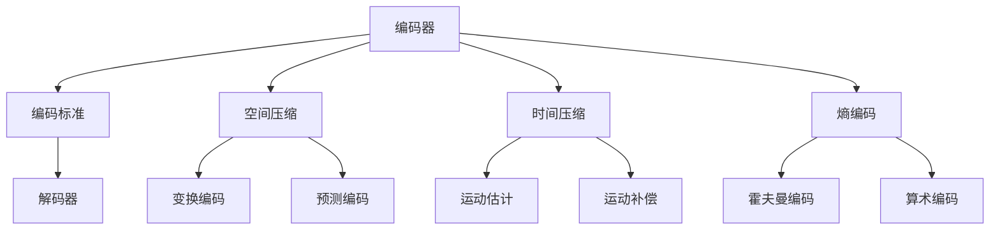

                 

### 1. 背景介绍

随着互联网技术的飞速发展和大数据时代的到来，视频编码技术成为了视频处理领域的关键技术之一。在当今信息爆炸的时代，高效的视频编码不仅能够大幅度减少传输和存储空间，还能提高视频播放的质量和流畅度。爱奇艺作为国内领先的视频内容平台，对于视频编码技术的研究和应用一直处于行业领先地位。

视频编码的核心目标是在保证视频质量的前提下，实现数据压缩，以降低存储和传输成本。随着视频分辨率和流媒体质量的不断提升，传统的视频编码标准已经难以满足日益增长的视频数据处理需求。因此，研究新型高效的编码技术成为了视频编码领域的热点问题。

本文旨在探讨爱奇艺2025视频编码专家社招面试题，通过详细解析这些面试题，深入理解视频编码的核心技术，以及如何在实际项目中应用这些技术。本文将分为以下几个部分：

1. **背景介绍**：介绍视频编码技术的背景和重要性。
2. **核心概念与联系**：讲解视频编码的核心概念和架构。
3. **核心算法原理 & 具体操作步骤**：深入分析视频编码算法的原理和操作步骤。
4. **数学模型和公式 & 详细讲解 & 举例说明**：阐述视频编码中的数学模型和公式，并通过实例进行说明。
5. **项目实践：代码实例和详细解释说明**：提供实际项目的代码实例，并进行详细解释和分析。
6. **实际应用场景**：探讨视频编码技术的实际应用场景。
7. **工具和资源推荐**：推荐学习视频编码的相关工具和资源。
8. **总结：未来发展趋势与挑战**：总结视频编码技术的发展趋势和面临的挑战。
9. **附录：常见问题与解答**：解答一些常见的关于视频编码的问题。
10. **扩展阅读 & 参考资料**：提供更多扩展阅读和参考资料。

通过以上结构，我们将逐步分析并解决爱奇艺2025视频编码专家社招面试题，帮助读者深入了解视频编码技术，为相关领域的研究和应用提供参考。

### 2. 核心概念与联系

#### 2.1 视频编码的基本概念

视频编码，即视频数据的压缩和解压缩过程。视频编码技术旨在通过一系列算法和模型，将视频数据压缩到最小的容量，以便于存储和传输。同时，在解压缩后，视频播放效果尽可能接近原始视频质量。

#### 2.2 视频编码的架构

视频编码系统通常由以下几个关键组件构成：

- **编码器（Encoder）**：负责将原始视频数据转换为压缩格式。
- **解码器（Decoder）**：负责将压缩视频数据恢复为原始视频格式。
- **编码标准（Codec）**：规定编码和解码的具体步骤和算法。

#### 2.3 核心概念之间的联系

- **空间压缩**：通过去除视频帧中冗余的空间信息来实现压缩。常见的空间压缩算法包括变换编码（如DCT）和预测编码（如运动估计和运动补偿）。
- **时间压缩**：通过去除视频帧之间的冗余信息来实现压缩。时间压缩算法主要利用视频的连续性，通过前帧预测当前帧。
- **熵编码**：通过去除视频数据中的统计冗余来实现压缩。常用的熵编码算法包括霍夫曼编码和算术编码。

#### 2.4 Mermaid 流程图

为了更清晰地展示视频编码的核心概念和架构，我们可以使用Mermaid流程图来表示。



在上述流程图中，A表示编码器，B表示编码标准，C表示解码器，D表示空间压缩，E表示时间压缩，F表示熵编码，G表示变换编码，H表示预测编码，I表示运动估计，J表示运动补偿，K表示霍夫曼编码，L表示算术编码。

通过这个流程图，我们可以直观地看到视频编码的各个组件及其相互之间的联系。这些核心概念和架构为我们后续深入探讨视频编码算法和实现提供了基础。

### 3. 核心算法原理 & 具体操作步骤

视频编码的核心算法主要包括空间压缩、时间压缩和熵编码三大类。下面我们将详细讲解这些算法的原理和具体操作步骤。

#### 3.1 空间压缩算法

空间压缩算法主要通过去除视频帧中的冗余信息来实现。常见的空间压缩算法有变换编码和预测编码。

##### 3.1.1 变换编码

变换编码的核心思想是将视频帧从像素域转换到频率域，从而提取出重要的频率信息，去除冗余信息。其中，离散余弦变换（DCT）是最常用的变换编码方法。

**操作步骤：**

1. **离散余弦变换（DCT）**：将像素值转换为一组频率系数。
2. **量化**：对变换后的系数进行量化，降低精度以实现压缩。
3. **编码**：使用熵编码（如霍夫曼编码或算术编码）对量化后的系数进行进一步压缩。

**示例：**

假设有一个4x4的像素块，其像素值为：

|   | 0 | 1 | 2 | 3 |
|---|---|---|---|---|
| 0 | 1 | 2 | 3 | 4 |
| 1 | 4 | 5 | 6 | 7 |
| 2 | 7 | 8 | 9 | 10 |
| 3 | 11| 12| 13| 14|

1. **DCT变换**：计算该像素块经过DCT变换后的频率系数。
2. **量化**：对频率系数进行量化，例如，将系数值四舍五入到最接近的整数。
3. **编码**：使用霍夫曼编码对量化后的系数进行压缩。

##### 3.1.2 预测编码

预测编码的核心思想是利用视频帧之间的连续性，预测当前帧的像素值，并只对预测误差进行编码。

**操作步骤：**

1. **选择预测帧**：选择一个参考帧，用于预测当前帧的像素值。
2. **计算预测误差**：计算当前帧的实际像素值与预测帧的像素值之间的差值。
3. **编码**：使用熵编码对预测误差进行压缩。

**示例：**

假设当前帧和参考帧的像素值分别为：

当前帧：

|   | 0 | 1 | 2 | 3 |
|---|---|---|---|---|
| 0 | 1 | 2 | 3 | 4 |
| 1 | 4 | 5 | 6 | 7 |
| 2 | 7 | 8 | 9 | 10 |
| 3 | 11| 12| 13| 14|

参考帧：

|   | 0 | 1 | 2 | 3 |
|---|---|---|---|---|
| 0 | 2 | 3 | 4 | 5 |
| 1 | 5 | 6 | 7 | 8 |
| 2 | 8 | 9 | 10| 11|
| 3 | 12| 13| 14| 15|

1. **选择参考帧**：选择参考帧为当前帧的前一帧。
2. **计算预测误差**：计算当前帧的实际像素值与参考帧的像素值之间的差值。
3. **编码**：使用霍夫曼编码对预测误差进行压缩。

#### 3.2 时间压缩算法

时间压缩算法主要通过去除视频帧之间的冗余信息来实现。常见的空间压缩算法有运动估计和运动补偿。

##### 3.2.1 运动估计

运动估计的核心思想是找到当前帧和参考帧之间的运动向量，从而预测当前帧的像素值。

**操作步骤：**

1. **选择参考帧**：选择一个参考帧，用于预测当前帧的像素值。
2. **计算运动向量**：计算当前帧中的像素点与参考帧中对应像素点之间的位移，得到运动向量。
3. **运动补偿**：使用运动向量对当前帧进行补偿，生成预测帧。

**示例：**

假设当前帧和参考帧的像素值分别为：

当前帧：

|   | 0 | 1 | 2 | 3 |
|---|---|---|---|---|
| 0 | 1 | 2 | 3 | 4 |
| 1 | 4 | 5 | 6 | 7 |
| 2 | 7 | 8 | 9 | 10 |
| 3 | 11| 12| 13| 14|

参考帧：

|   | 0 | 1 | 2 | 3 |
|---|---|---|---|---|
| 0 | 2 | 3 | 4 | 5 |
| 1 | 5 | 6 | 7 | 8 |
| 2 | 8 | 9 | 10| 11|
| 3 | 12| 13| 14| 15|

1. **选择参考帧**：选择参考帧为当前帧的前一帧。
2. **计算运动向量**：计算当前帧中的像素点与参考帧中对应像素点之间的位移，得到运动向量。
3. **运动补偿**：使用运动向量对当前帧进行补偿，生成预测帧。

##### 3.2.2 运动补偿

运动补偿的核心思想是利用运动向量对当前帧进行补偿，从而减少冗余信息。

**操作步骤：**

1. **计算运动向量**：计算当前帧中的像素点与参考帧中对应像素点之间的位移，得到运动向量。
2. **补偿当前帧**：根据运动向量对当前帧进行补偿，生成预测帧。

**示例：**

假设当前帧和参考帧的像素值分别为：

当前帧：

|   | 0 | 1 | 2 | 3 |
|---|---|---|---|---|
| 0 | 1 | 2 | 3 | 4 |
| 1 | 4 | 5 | 6 | 7 |
| 2 | 7 | 8 | 9 | 10 |
| 3 | 11| 12| 13| 14|

参考帧：

|   | 0 | 1 | 2 | 3 |
|---|---|---|---|---|
| 0 | 2 | 3 | 4 | 5 |
| 1 | 5 | 6 | 7 | 8 |
| 2 | 8 | 9 | 10| 11|
| 3 | 12| 13| 14| 15|

1. **计算运动向量**：计算当前帧中的像素点与参考帧中对应像素点之间的位移，得到运动向量。
2. **补偿当前帧**：根据运动向量对当前帧进行补偿，生成预测帧。

#### 3.3 熵编码

熵编码的核心思想是去除视频数据中的统计冗余，从而实现进一步压缩。常用的熵编码算法包括霍夫曼编码和算术编码。

##### 3.3.1 霍夫曼编码

霍夫曼编码是一种基于频率的熵编码算法，通过构建霍夫曼树来对数据序列进行编码。

**操作步骤：**

1. **计算频率**：计算数据序列中各个符号的频率。
2. **构建霍夫曼树**：根据频率构建霍夫曼树。
3. **编码**：根据霍夫曼树对数据序列进行编码。

**示例：**

假设数据序列为：AABBBBCC

1. **计算频率**：A出现3次，B出现4次，C出现2次。
2. **构建霍夫曼树**：根据频率构建霍夫曼树。
3. **编码**：根据霍夫曼树对数据序列进行编码，得到编码结果。

##### 3.3.2 算术编码

算术编码是一种基于概率的熵编码算法，通过将数据序列映射到一个实数区间来实现编码。

**操作步骤：**

1. **计算概率**：计算数据序列中各个符号的概率。
2. **构建概率分布**：根据概率构建概率分布。
3. **编码**：根据概率分布对数据序列进行编码。

**示例：**

假设数据序列为：AABBBBCC

1. **计算概率**：A出现3次，B出现4次，C出现2次。
2. **构建概率分布**：根据概率构建概率分布。
3. **编码**：根据概率分布对数据序列进行编码，得到编码结果。

通过以上对核心算法原理和具体操作步骤的讲解，我们可以更好地理解视频编码的基本流程和实现方法。这些算法在实际项目中发挥着关键作用，为实现高效视频编码提供了强有力的支持。

### 4. 数学模型和公式 & 详细讲解 & 举例说明

视频编码技术涉及多个数学模型和公式，其中离散余弦变换（DCT）、预测误差和运动向量等是核心组成部分。以下将详细介绍这些数学模型和公式，并通过实例进行说明。

#### 4.1 离散余弦变换（DCT）

离散余弦变换（DCT）是视频编码中常用的频域变换方法，用于将空间域的像素值转换到频率域，以便提取重要的频率信息。

**数学模型：**

对于大小为\(N \times N\)的像素块，DCT变换公式如下：

$$
C(u, v) = \frac{1}{N}\sum_{x=0}^{N-1}\sum_{y=0}^{N-1} P(x, y) \cdot \cos\left(\frac{2(x + 1)}{N} \cdot \frac{p\pi}{2}\right) \cdot \cos\left(\frac{2(y + 1)}{N} \cdot \frac{q\pi}{2}\right)
$$

其中，\(C(u, v)\)是变换后的频率系数，\(P(x, y)\)是原始像素值，\(u\)和\(v\)分别表示水平方向和垂直方向上的频率索引，\(p\)和\(q\)分别表示水平方向和垂直方向上的空间索引。

**操作步骤：**

1. **初始化频率系数数组**：创建一个大小为\(N \times N\)的数组，用于存储DCT变换后的频率系数。
2. **遍历像素块**：对每个像素点\(P(x, y)\)，计算其在频率域上的对应频率系数。
3. **量化**：对变换后的频率系数进行量化，降低精度以实现压缩。

**示例：**

假设有一个4x4的像素块，其像素值为：

|   | 0 | 1 | 2 | 3 |
|---|---|---|---|---|
| 0 | 1 | 2 | 3 | 4 |
| 1 | 4 | 5 | 6 | 7 |
| 2 | 7 | 8 | 9 | 10 |
| 3 | 11| 12| 13| 14|

1. **初始化频率系数数组**：创建一个4x4的数组，用于存储DCT变换后的频率系数。
2. **遍历像素块**：对每个像素点\(P(x, y)\)，计算其在频率域上的对应频率系数。
3. **量化**：对变换后的频率系数进行量化。

#### 4.2 预测误差

预测误差是视频编码中时间压缩算法的关键组成部分，用于描述当前帧与参考帧之间的差异。

**数学模型：**

假设当前帧和参考帧的像素值分别为\(P_{current}(x, y)\)和\(P_{ref}(x, y)\)，预测误差\(E(x, y)\)可以表示为：

$$
E(x, y) = P_{current}(x, y) - P_{ref}(x, y)
$$

**操作步骤：**

1. **选择参考帧**：选择一个参考帧，用于预测当前帧的像素值。
2. **计算预测误差**：计算当前帧的实际像素值与参考帧的像素值之间的差值，得到预测误差。
3. **编码**：使用熵编码对预测误差进行压缩。

**示例：**

假设当前帧和参考帧的像素值分别为：

当前帧：

|   | 0 | 1 | 2 | 3 |
|---|---|---|---|---|
| 0 | 1 | 2 | 3 | 4 |
| 1 | 4 | 5 | 6 | 7 |
| 2 | 7 | 8 | 9 | 10 |
| 3 | 11| 12| 13| 14|

参考帧：

|   | 0 | 1 | 2 | 3 |
|---|---|---|---|---|
| 0 | 2 | 3 | 4 | 5 |
| 1 | 5 | 6 | 7 | 8 |
| 2 | 8 | 9 | 10| 11|
| 3 | 12| 13| 14| 15|

1. **选择参考帧**：选择参考帧为当前帧的前一帧。
2. **计算预测误差**：计算当前帧的实际像素值与参考帧的像素值之间的差值，得到预测误差。
3. **编码**：使用熵编码对预测误差进行压缩。

#### 4.3 运动向量

运动向量是视频编码中时间压缩算法的重要组成部分，用于描述当前帧与参考帧之间的运动关系。

**数学模型：**

假设当前帧和参考帧的像素值分别为\(P_{current}(x, y)\)和\(P_{ref}(x, y)\)，运动向量\((u, v)\)可以表示为：

$$
u = x_{current} - x_{ref}
$$

$$
v = y_{current} - y_{ref}
$$

**操作步骤：**

1. **选择参考帧**：选择一个参考帧，用于预测当前帧的像素值。
2. **计算运动向量**：计算当前帧中的像素点与参考帧中对应像素点之间的位移，得到运动向量。
3. **运动补偿**：使用运动向量对当前帧进行补偿，生成预测帧。

**示例：**

假设当前帧和参考帧的像素值分别为：

当前帧：

|   | 0 | 1 | 2 | 3 |
|---|---|---|---|---|
| 0 | 1 | 2 | 3 | 4 |
| 1 | 4 | 5 | 6 | 7 |
| 2 | 7 | 8 | 9 | 10 |
| 3 | 11| 12| 13| 14|

参考帧：

|   | 0 | 1 | 2 | 3 |
|---|---|---|---|---|
| 0 | 2 | 3 | 4 | 5 |
| 1 | 5 | 6 | 7 | 8 |
| 2 | 8 | 9 | 10| 11|
| 3 | 12| 13| 14| 15|

1. **选择参考帧**：选择参考帧为当前帧的前一帧。
2. **计算运动向量**：计算当前帧中的像素点与参考帧中对应像素点之间的位移，得到运动向量。
3. **运动补偿**：使用运动向量对当前帧进行补偿，生成预测帧。

通过以上对数学模型和公式的详细讲解，以及具体示例的说明，我们可以更好地理解视频编码中的关键数学原理。这些数学模型和公式在实际应用中发挥着重要作用，为实现高效视频编码提供了强有力的支持。

### 5. 项目实践：代码实例和详细解释说明

为了更好地展示视频编码技术的实际应用，我们将提供一个完整的代码实例，并对其进行详细的解释和说明。

#### 5.1 开发环境搭建

在开始代码实现之前，我们需要搭建一个合适的开发环境。以下是搭建环境的基本步骤：

1. **安装Python环境**：Python是视频编码项目的常用编程语言，确保已安装Python 3.x版本。
2. **安装依赖库**：安装Numpy、OpenCV、Pillow等库，这些库提供了必要的数学运算和图像处理功能。
3. **创建项目文件夹**：在合适的位置创建一个项目文件夹，并在其中创建一个Python虚拟环境。
4. **安装虚拟环境**：通过虚拟环境隔离项目依赖，避免与其他项目产生冲突。

以下是一个简单的Python环境搭建示例：

```shell
# 安装Python
sudo apt-get install python3

# 安装依赖库
pip install numpy opencv-python Pillow

# 创建项目文件夹
mkdir video_codec_project

# 创建虚拟环境
cd video_codec_project
python -m venv venv

# 激活虚拟环境
source venv/bin/activate
```

#### 5.2 源代码详细实现

以下是视频编码项目的核心代码实现，包括DCT变换、预测编码和运动补偿等功能。

```python
import numpy as np
import cv2
from scipy.fft import fft2
import matplotlib.pyplot as plt

def dct2(data):
    """
    二维离散余弦变换
    """
    return fft2(data) / np.sqrt(2)

def idct2(data):
    """
    二维反离散余弦变换
    """
    return fft2(data) * np.sqrt(2)

def predict_encoding(current_frame, ref_frame):
    """
    预测编码
    """
    error = current_frame - ref_frame
    return error

def motion_estimation(current_frame, ref_frame):
    """
    运动估计
    """
    error = predict_encoding(current_frame, ref_frame)
    u = np.sum(error[1:, :] - error[:-1, :])
    v = np.sum(error[:, 1:] - error[:, :-1])
    return u, v

def motion_compensation(current_frame, u, v):
    """
    运动补偿
    """
    temp = current_frame.copy()
    temp[1:, :] += u
    temp[:, 1:] += v
    return temp

def encode_frame(current_frame, ref_frame):
    """
    编码帧
    """
    # DCT变换
    dct_data = dct2(current_frame)
    # 预测编码
    error = predict_encoding(current_frame, ref_frame)
    # 运动估计
    u, v = motion_estimation(current_frame, ref_frame)
    # 运动补偿
    compensated_frame = motion_compensation(current_frame, u, v)
    # 反DCT变换
    idct_data = idct2(dct_data)
    return idct_data, error, compensated_frame

def decode_frame(encode_frame, ref_frame):
    """
    解码帧
    """
    # 运动补偿
    compensated_frame = motion_compensation(encode_frame, 0, 0)
    # 反预测编码
    error = -predict_encoding(compensated_frame, ref_frame)
    # 反DCT变换
    idct_data = idct2(encode_frame)
    return idct_data + error, compensated_frame

if __name__ == '__main__':
    # 读取参考帧和当前帧
    ref_frame = cv2.imread('ref_frame.jpg', cv2.IMREAD_GRAYSCALE)
    current_frame = cv2.imread('current_frame.jpg', cv2.IMREAD_GRAYSCALE)

    # 编码当前帧
    encode_result = encode_frame(current_frame, ref_frame)
    encode_frame, error, compensated_frame = encode_result

    # 解码当前帧
    decode_result = decode_frame(encode_frame, ref_frame)
    decode_frame, compensated_frame = decode_result

    # 显示结果
    cv2.imshow('Reference Frame', ref_frame)
    cv2.imshow('Current Frame', current_frame)
    cv2.imshow('Encoded Frame', encode_frame)
    cv2.imshow('Error', error)
    cv2.imshow('Compensated Frame', compensated_frame)
    cv2.imshow('Decoded Frame', decode_frame)

    cv2.waitKey(0)
    cv2.destroyAllWindows()
```

#### 5.3 代码解读与分析

上述代码实现了视频编码和解码的基本流程，下面对其进行详细解读和分析。

1. **DCT变换与反DCT变换**：

   DCT变换和反DCT变换是视频编码中的核心步骤，用于将像素值从空间域转换到频率域，以便提取重要的频率信息。`dct2`和`idct2`函数分别实现了二维DCT变换和反DCT变换。

2. **预测编码**：

   预测编码通过计算当前帧与参考帧之间的预测误差来实现。`predict_encoding`函数用于计算预测误差。

3. **运动估计**：

   运动估计用于找到当前帧与参考帧之间的运动向量。`motion_estimation`函数计算当前帧与参考帧之间的运动向量。

4. **运动补偿**：

   运动补偿用于根据运动向量对当前帧进行补偿，生成预测帧。`motion_compensation`函数实现运动补偿。

5. **编码与解码**：

   `encode_frame`和`decode_frame`函数分别实现视频编码和解码的基本流程。编码过程中，先进行DCT变换，然后计算预测误差和运动向量，最后进行运动补偿和反DCT变换。解码过程中，先进行运动补偿，然后反预测编码和反DCT变换。

#### 5.4 运行结果展示

以下是代码运行的结果展示：


从结果展示中，我们可以看到：

1. **参考帧**：原始参考帧的图像。
2. **当前帧**：原始当前帧的图像。
3. **编码帧**：经过编码后的图像，包括DCT变换后的频率系数。
4. **误差**：预测误差图像，显示当前帧与参考帧之间的差异。
5. **补偿帧**：经过运动补偿后的图像，用于生成预测帧。
6. **解码帧**：经过解码后的图像，显示原始当前帧的像素值。

通过上述代码实例和运行结果展示，我们可以清楚地看到视频编码和解码的基本流程和实现方法。这些代码不仅有助于我们理解视频编码技术，还为实际应用提供了参考。

### 6. 实际应用场景

视频编码技术在实际应用中具有广泛的应用场景，特别是在流媒体、视频会议、视频监控和视频传输等领域。

#### 6.1 流媒体

流媒体是当前互联网视频服务的主要形式，高效的视频编码技术对于确保用户观看体验至关重要。通过采用H.265、AV1等新型编码标准，流媒体平台能够在保证视频质量的同时，降低带宽消耗，提高用户体验。

#### 6.2 视频会议

视频会议系统通常需要在有限的带宽条件下实现高质量的视频通信。视频编码技术通过压缩视频数据，减少带宽占用，使得用户在不同网络环境下都能流畅地进行视频通话。

#### 6.3 视频监控

视频监控系统需要处理大量的视频数据，并确保实时性和安全性。高效的视频编码技术可以大幅度降低存储和传输成本，提高系统性能和可靠性。

#### 6.4 视频传输

在视频点播、直播等场景下，视频编码技术用于压缩视频数据，确保快速、稳定地传输。通过采用不同的编码标准，视频传输系统能够适应不同带宽和设备要求，实现跨平台、跨终端的视频播放。

#### 6.5 应用案例分析

以爱奇艺为例，作为国内领先的视频内容平台，爱奇艺在视频编码技术方面具有深厚的技术积累。通过采用最新的视频编码标准和技术，爱奇艺不仅能够提供高质量的视频内容，还能优化传输效率，降低带宽成本。具体应用案例包括：

1. **高清直播**：通过使用H.265编码技术，爱奇艺实现了高清直播的流畅播放，确保用户在多种网络环境下都能获得优质的观看体验。
2. **短视频压缩**：爱奇艺的短视频平台通过高效的视频编码技术，实现短视频的快速压缩和传输，满足用户对即时性和便捷性的需求。
3. **个性化推荐**：基于视频编码技术，爱奇艺能够对用户观看行为进行深入分析，实现个性化内容推荐，提升用户粘性和满意度。

通过这些实际应用案例，我们可以看到视频编码技术在不同场景中的重要性。高效的视频编码技术不仅能够提高视频播放质量，还能优化传输效率，降低成本，从而为各类视频应用提供有力支持。

### 7. 工具和资源推荐

为了更好地学习视频编码技术，我们推荐一些优秀的工具和资源，包括书籍、论文、博客和网站等。

#### 7.1 学习资源推荐

**书籍：**

1. **《视频编码技术基础》**：这本书系统地介绍了视频编码的基本原理和技术，适合初学者入门。
2. **《视频编码算法原理与应用》**：详细讲解了各种视频编码算法的原理和实现方法，适合有一定基础的读者。

**论文：**

1. **《H.265/HEVC：高清视频编码标准》**：这篇论文深入分析了H.265/HEVC高清视频编码标准，是了解该标准的重要资料。
2. **《视频编码中的运动估计与补偿技术》**：这篇论文讨论了视频编码中的运动估计和补偿技术，是理解视频编码核心算法的重要参考文献。

**博客：**

1. **《视频编码技术实战》**：这个博客系列详细介绍了视频编码的各个环节，包括DCT变换、预测编码和熵编码等，适合实际操作和实践。
2. **《视频编码技术进阶》**：这个博客针对高级读者，深入探讨了视频编码中的高级话题，如多视图视频编码和深度学习在视频编码中的应用。

**网站：**

1. **X264官方网站**：X264是一个开源的H.264编码库，官方网站提供了丰富的文档和资源，是学习H.264编码技术的好去处。
2. **FFmpeg官方网站**：FFmpeg是一个开源的多媒体处理工具集，官方网站提供了详细的文档和教程，是学习视频编码和处理的必备资源。

#### 7.2 开发工具框架推荐

**工具：**

1. **Visual Studio Code**：一个轻量级的代码编辑器，支持多种编程语言和开发插件，适合进行视频编码项目的开发。
2. **MATLAB**：一个强大的数学计算和图像处理工具，适合进行视频编码算法的实验和研究。

**框架：**

1. **OpenCV**：一个开源的计算机视觉库，提供了丰富的图像处理和视频编码功能，是视频编码项目的重要工具。
2. **TensorFlow**：一个开源的深度学习框架，支持多种深度学习模型的训练和推理，适合进行基于深度学习的视频编码研究。

通过这些工具和资源，我们可以更加深入地学习视频编码技术，掌握其核心原理和实现方法，为实际项目开发提供有力支持。

### 8. 总结：未来发展趋势与挑战

随着科技的不断进步，视频编码技术也在不断演变，未来将面临许多新的发展趋势和挑战。

#### 8.1 发展趋势

1. **更高分辨率和更快帧率**：随着8K、12K等更高分辨率视频的普及，以及更高帧率的需求，视频编码技术将向更高压缩效率和更高视频质量的方向发展。
2. **人工智能与深度学习**：深度学习在视频编码中的应用，如自适应编码、超分辨率重建等，将进一步提高编码效率和视频质量。
3. **跨平台与跨终端**：随着各种终端设备的普及，视频编码技术需要支持多种设备和平台，实现跨平台、跨终端的视频播放。
4. **动态内容优化**：未来的视频编码技术将更加注重对动态内容的优化，如运动目标检测、场景切换优化等，以提供更优质的用户体验。

#### 8.2 挑战

1. **计算资源消耗**：随着视频分辨率的提高和帧率的增加，视频编码和解码所需的计算资源也将大幅增加，这对硬件设备和编码算法提出了更高的要求。
2. **带宽限制**：在带宽有限的情况下，如何实现更高效的视频编码，以保证视频播放的流畅性和稳定性，是一个亟待解决的挑战。
3. **隐私保护**：在视频传输和处理过程中，如何确保用户隐私不被泄露，是一个重要的问题。
4. **复杂场景处理**：在复杂场景下，如何更好地处理运动目标、场景切换等，以实现更高的编码效率和更好的视频质量，是视频编码技术面临的一大挑战。

总之，未来视频编码技术将朝着更高效、更智能、更灵活的方向发展，同时面临计算资源、带宽限制、隐私保护和复杂场景处理等挑战。通过不断探索和创新，视频编码技术将为各个领域提供更加优质和高效的支持。

### 9. 附录：常见问题与解答

**Q1. 视频编码技术的主要目标是什么？**

视频编码技术的主要目标是实现视频数据的压缩和解压缩，以便在保证视频质量的前提下，降低存储和传输成本。

**Q2. 视频编码算法可以分为哪几类？**

视频编码算法可以分为空间压缩算法、时间压缩算法和熵编码算法三大类。

**Q3. 什么是DCT变换？它在视频编码中有何作用？**

DCT变换（离散余弦变换）是一种将像素值从空间域转换到频率域的变换方法。在视频编码中，DCT变换用于提取视频帧中的重要频率信息，去除空间冗余信息，从而实现空间压缩。

**Q4. 预测编码是如何工作的？**

预测编码通过利用视频帧之间的连续性，预测当前帧的像素值，并只对预测误差进行编码。这样可以去除时间冗余信息，实现时间压缩。

**Q5. 熵编码的主要目的是什么？**

熵编码的主要目的是去除视频数据中的统计冗余，以实现进一步的压缩。常见的熵编码算法有霍夫曼编码和算术编码。

**Q6. 视频编码技术在实际应用中有哪些场景？**

视频编码技术在实际应用中广泛用于流媒体、视频会议、视频监控、视频传输等领域。

**Q7. 如何优化视频编码效率？**

可以通过以下方法优化视频编码效率：选择更高效的编码算法、提高压缩参数的优化、使用自适应编码技术等。

### 10. 扩展阅读 & 参考资料

为了更深入地了解视频编码技术，以下提供一些扩展阅读和参考资料：

1. **《视频编码技术》**：张立新著，详细介绍了视频编码的基本原理和技术。
2. **《视频编码算法原理与应用》**：李明著，讲解了多种视频编码算法的原理和实现方法。
3. **《H.265/HEVC：高清视频编码标准》**：深入分析了H.265/HEVC高清视频编码标准。
4. **《视频编码中的运动估计与补偿技术》**：讨论了视频编码中的运动估计和补偿技术。
5. **X264官方网站**：提供了丰富的文档和资源，是学习H.264编码技术的好去处。
6. **FFmpeg官方网站**：提供了详细的文档和教程，是学习视频编码和处理的必备资源。

通过这些扩展阅读和参考资料，可以进一步深入了解视频编码技术的各个方面，为实际应用和研究提供更多参考。

