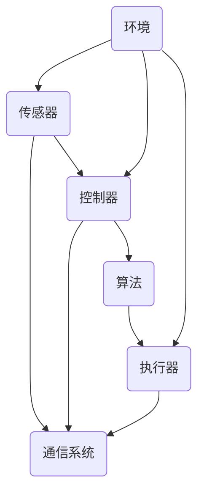
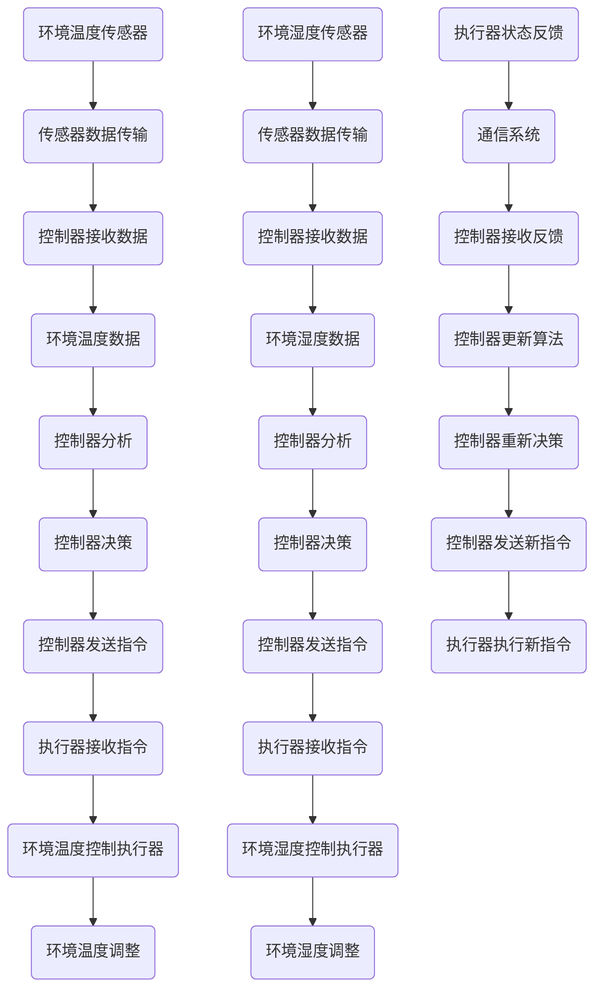

                 

### 1. 背景介绍

物理实体自动化，顾名思义，指的是利用计算机技术和人工智能算法，将物理世界中的实体对象或行为自动化，从而实现高效、精准的控制和操作。这一概念并非新出现，但随着近年来人工智能、物联网和云计算等技术的飞速发展，物理实体自动化逐渐成为现代工业、医疗、物流等领域的热点话题。

物理实体自动化的起源可以追溯到20世纪60年代的自动化制造系统。当时，随着工业生产的规模化和复杂化，人们开始尝试通过计算机技术来控制和优化生产流程。早期的自动化系统主要依赖于预先设定的规则和程序，如数控机床和机器人。然而，这些系统在处理复杂、动态环境时存在明显的局限性。

随着人工智能技术的兴起，物理实体自动化迎来了新的发展契机。尤其是深度学习和强化学习等先进算法的突破，使得计算机能够从大量数据中自动学习规律，从而实现对物理实体的更智能、更灵活的控制。例如，自动驾驶汽车、智能无人机、智能机器人等都是物理实体自动化的典型应用场景。

物理实体自动化的意义在于，它不仅提高了生产效率，减少了人力成本，还显著提升了系统的安全性和可靠性。例如，在医疗领域，物理实体自动化可以帮助医生进行精确的手术操作，降低手术风险；在物流领域，自动化仓储和配送系统可以大大提高物流效率，降低物流成本。

然而，物理实体自动化也面临诸多挑战。首先，系统的复杂性和不确定性使得自动化控制变得更加困难。物理世界中的实体对象和行为往往受到多种因素的影响，如环境变化、设备老化等，这使得自动化系统需要具备更高的鲁棒性和适应性。其次，数据安全和隐私保护也是物理实体自动化需要面对的重要问题。随着大量数据在自动化系统中流转，如何确保数据的安全性和隐私性，成为了一个亟待解决的难题。

总之，物理实体自动化是计算机科学和人工智能领域的一个重要研究方向，它不仅具有巨大的应用潜力，也面临着诸多挑战。在接下来的文章中，我们将深入探讨物理实体自动化的核心概念、算法原理、数学模型、项目实践、实际应用场景以及未来发展趋势。

### 2. 核心概念与联系

要理解物理实体自动化的工作原理，我们需要从核心概念和联系出发，逐步分析其组成部分及其相互作用。以下是物理实体自动化的核心概念及它们之间的联系，我们将使用Mermaid流程图来详细展示这些概念和它们的关系。

#### 2.1 核心概念

1. **传感器**：用于检测和测量物理世界中的各种参数，如温度、湿度、位置、速度等。
2. **执行器**：接收传感器信息，并对其进行物理操作，如电机、阀门、机械臂等。
3. **控制器**：接收传感器数据，通过算法分析处理后，向执行器发送指令。
4. **算法**：包括各种用于分析和决策的数学模型和逻辑规则，如机器学习算法、路径规划算法等。
5. **通信系统**：确保传感器、控制器和执行器之间的数据传输，包括有线和无线通信方式。
6. **环境**：物理实体自动化系统所存在的环境，如工厂车间、医疗手术室、无人机飞行区域等。

#### 2.2 Mermaid流程图



在这个流程图中，我们可以看到传感器获取环境中的数据，通过通信系统传输到控制器。控制器分析这些数据，通过算法做出决策，然后向执行器发送指令，执行器根据指令进行物理操作。整个过程在环境中进行，环境中的变化也会反馈到传感器，从而形成一个闭环控制系统。

#### 2.3 核心概念之间的联系

- **传感器与控制器**：传感器是系统的感知器官，它负责收集环境信息。这些信息通过通信系统传输到控制器，控制器接收这些数据后进行处理。
- **控制器与算法**：控制器是系统的核心，它负责分析传感器提供的数据，并基于算法做出决策。这些算法可以是预先设定的规则，也可以是机器学习模型，用于从数据中学习规律。
- **算法与执行器**：算法分析后的决策结果需要通过控制器发送给执行器。执行器根据这些指令进行实际的物理操作。
- **通信系统**：通信系统是传感器、控制器和执行器之间数据传输的桥梁，它确保整个系统能够高效、稳定地运行。
- **环境与传感器/控制器/执行器**：环境是物理实体自动化系统存在的场所，环境的变化会直接影响传感器数据的收集，进而影响控制器和执行器的操作。

#### 2.4 Mermaid流程图 (详细版)



在这个详细的流程图中，我们可以看到环境中的温度和湿度传感器分别收集数据，并通过通信系统传输到控制器。控制器分析这些数据后，向环境温度和湿度控制执行器发送指令，执行器根据指令进行相应的物理操作，如调节温度或湿度。此外，执行器的状态会通过通信系统反馈到控制器，控制器根据反馈信息更新算法，并重新做出决策，形成一个闭环控制系统。

通过以上对核心概念和联系的详细分析，我们可以更好地理解物理实体自动化的工作原理。在接下来的章节中，我们将进一步探讨物理实体自动化的核心算法原理和具体操作步骤。

### 3. 核心算法原理 & 具体操作步骤

物理实体自动化的核心在于算法原理，这些算法用于处理传感器收集到的数据，并生成相应的控制指令。在本章节中，我们将介绍几种常见的算法原理及其具体操作步骤。

#### 3.1 机器学习算法

机器学习算法是物理实体自动化中应用最广泛的算法之一，它通过训练模型来识别和预测数据中的模式。以下是机器学习算法在物理实体自动化中的应用及其操作步骤：

1. **数据收集**：首先，我们需要收集大量的传感器数据，这些数据包括环境参数、执行器状态等。
2. **数据预处理**：对收集到的数据进行清洗、归一化等预处理操作，以消除噪声和异常值，提高模型的准确度。
3. **特征选择**：从预处理后的数据中选择关键特征，这些特征将用于训练模型。
4. **模型训练**：使用机器学习算法（如决策树、支持向量机、神经网络等）对选定的特征进行训练，生成模型。
5. **模型评估**：通过验证集或测试集评估模型的准确性、召回率等性能指标，确保模型的有效性。
6. **模型部署**：将训练好的模型部署到控制器中，用于实时处理传感器数据并生成控制指令。

#### 3.2 路径规划算法

路径规划算法在物理实体自动化中，尤其是在无人机、自动驾驶汽车等移动实体中应用广泛。以下是一个典型的A*路径规划算法的操作步骤：

1. **初始设置**：定义起点和终点，以及地图中的所有节点。
2. **计算估价函数**：每个节点都有一个估价函数 \( f(n) = g(n) + h(n) \)，其中 \( g(n) \) 是从起点到当前节点的实际距离，\( h(n) \) 是从当前节点到终点的预估距离。
3. **生成开放列表和关闭列表**：开放列表用于存储当前待处理的节点，关闭列表用于存储已处理的节点。
4. **寻找下一个节点**：从开放列表中选择估价函数最小的节点，将其从开放列表移动到关闭列表。
5. **更新邻居节点**：对于当前节点的每个邻居节点，计算其估价函数，并将其添加到开放列表中。
6. **重复步骤4和5**：直到找到终点或开放列表为空。

#### 3.3 强化学习算法

强化学习算法在处理动态环境和不确定性问题时表现出色。以下是Q-Learning算法在物理实体自动化中的应用步骤：

1. **环境建模**：定义物理实体的环境和状态空间，以及可能的动作集合。
2. **初始化**：初始化Q值表，用于存储每个状态-动作对的期望回报。
3. **选择动作**：在给定状态下，根据策略选择一个动作。
4. **执行动作**：在物理环境中执行所选动作。
5. **获取奖励**：根据环境状态和动作的结果，获取奖励信号。
6. **更新Q值**：根据新的状态和奖励，更新Q值表。
7. **重复步骤3-6**：进行多次迭代，直到找到最优策略。

#### 3.4 深度强化学习算法

深度强化学习算法结合了深度学习和强化学习，可以处理高维状态空间和复杂的决策问题。以下是深度Q网络（DQN）的操作步骤：

1. **初始化**：定义神经网络结构，初始化权值。
2. **数据收集**：通过模拟或实际环境收集状态、动作、奖励和下一状态的数据。
3. **经验回放**：将收集到的数据存储在经验回放内存中，用于后续训练。
4. **训练DQN**：使用经验回放内存中的数据训练深度神经网络，更新Q值表。
5. **目标网络更新**：定期从主Q网络中复制一部分权重到目标网络，以减少训练过程的波动。
6. **策略迭代**：在每次迭代中使用目标网络选择动作，并根据实际结果更新Q值表。
7. **重复步骤4-6**：进行多次迭代，直到找到稳定的最优策略。

通过以上算法原理和具体操作步骤的介绍，我们可以看到物理实体自动化涉及到的算法多样且复杂。在实际应用中，这些算法可以根据具体需求进行定制和优化，以实现更高效、更智能的物理实体自动化控制。在接下来的章节中，我们将深入探讨物理实体自动化的数学模型和公式。

### 4. 数学模型和公式 & 详细讲解 & 举例说明

物理实体自动化不仅依赖于算法原理，还需要通过数学模型和公式来确保系统的精确性和稳定性。在本章节中，我们将详细讲解几个关键的数学模型和公式，并通过具体例子来说明它们的应用。

#### 4.1 状态空间模型

状态空间模型是物理实体自动化中的基本模型，它将系统行为表示为一组状态和动作的集合。具体来说：

- **状态**：系统的当前状态，通常由一组变量表示，如位置、速度、温度等。
- **动作**：系统可执行的操作，如电机旋转、阀门开关等。
- **状态转移函数**：描述系统从一个状态转移到另一个状态的概率分布。
- **奖励函数**：定义系统在特定状态下执行特定动作的回报。

**公式：**

状态空间模型可以用以下公式表示：

\[ s_t = f(s_{t-1}, a_{t-1}) \]
\[ r_t = g(s_t, a_t) \]

其中，\( s_t \) 是时间步 \( t \) 时的状态，\( a_t \) 是时间步 \( t \) 时的动作，\( r_t \) 是时间步 \( t \) 时的奖励，\( f() \) 和 \( g() \) 分别是状态转移函数和奖励函数。

**例子：** 假设一个机器人需要在二维平面中移动，状态由其当前位置 \( (x, y) \) 表示，动作可以是向右、向左、向上、向下移动一个单位距离。状态转移函数可以表示为：

\[ f((x, y), "right") = (x+1, y) \]
\[ f((x, y), "left") = (x-1, y) \]
\[ f((x, y), "up") = (x, y+1) \]
\[ f((x, y), "down") = (x, y-1) \]

奖励函数可以设置为：

\[ g((x, y), "right") = 1 \]
\[ g((x, y), "left") = 1 \]
\[ g((x, y), "up") = 1 \]
\[ g((x, y), "down") = 1 \]

这些公式和例子帮助我们理解了状态空间模型的基本构成和应用。

#### 4.2 控制系统模型

控制系统模型用于描述物理实体自动化的控制过程，它包括输入、输出和内部状态。以下是几个关键公式：

- **输入**：控制器的决策，通常是一个动作向量。
- **输出**：执行器的操作结果，如位置、速度、温度等。
- **状态**：系统的当前状态。

**公式：**

控制系统模型可以用以下公式表示：

\[ s_t = A_s s_{t-1} + B_s u_t \]
\[ y_t = C_s s_t + D_s u_t \]

其中，\( s_t \) 是时间步 \( t \) 时的状态，\( u_t \) 是时间步 \( t \) 时的输入，\( y_t \) 是时间步 \( t \) 时的输出，\( A_s \)、\( B_s \)、\( C_s \) 和 \( D_s \) 分别是状态转移矩阵、输入矩阵、输出矩阵和直接传输矩阵。

**例子：** 假设一个线性控制系统，其状态由位置 \( x \) 和速度 \( v \) 表示，输入是加速度 \( a \)，输出是速度 \( v \)。状态方程和输出方程可以表示为：

\[ \begin{bmatrix} x_t \\ v_t \end{bmatrix} = \begin{bmatrix} 1 & 0 \\ 0 & 1 \end{bmatrix} \begin{bmatrix} x_{t-1} \\ v_{t-1} \end{bmatrix} + \begin{bmatrix} 0 \\ 1 \end{bmatrix} a_t \]
\[ v_t = \begin{bmatrix} 0 & 1 \end{bmatrix} \begin{bmatrix} x_{t-1} \\ v_{t-1} \end{bmatrix} + \begin{bmatrix} 0 \end{bmatrix} a_t \]

这些公式展示了如何通过状态转移矩阵和输入矩阵来描述系统的动态行为。

#### 4.3 强化学习中的Q值函数

强化学习中的Q值函数用于评估在特定状态下执行特定动作的预期回报。以下是Q值函数的基本公式：

\[ Q(s_t, a_t) = r_t + \gamma \max_{a_{t+1}} Q(s_{t+1}, a_{t+1}) \]

其中，\( s_t \) 是当前状态，\( a_t \) 是当前动作，\( r_t \) 是即时奖励，\( \gamma \) 是折扣因子，用于平衡即时奖励和未来奖励。

**例子：** 假设一个机器人需要在迷宫中找到出口，状态由其当前位置表示，动作是向四个方向移动。即时奖励可以设置为到达出口时的奖励，折扣因子设为0.9。Q值函数可以表示为：

\[ Q(s_t, "right") = r_t + 0.9 \max_{a_{t+1}} Q(s_{t+1}, a_{t+1}) \]
\[ Q(s_t, "left") = r_t + 0.9 \max_{a_{t+1}} Q(s_{t+1}, a_{t+1}) \]
\[ Q(s_t, "up") = r_t + 0.9 \max_{a_{t+1}} Q(s_{t+1}, a_{t+1}) \]
\[ Q(s_t, "down") = r_t + 0.9 \max_{a_{t+1}} Q(s_{t+1}, a_{t+1}) \]

这些公式和例子帮助我们深入理解了物理实体自动化中的数学模型和公式，以及它们在实际应用中的重要性。通过这些模型和公式，我们可以设计出更高效、更智能的物理实体自动化系统。

### 5. 项目实践：代码实例和详细解释说明

在本章节中，我们将通过一个具体的物理实体自动化项目实例，展示如何从零开始搭建开发环境、编写源代码，并进行详细解释和分析。此项目将使用Python编程语言，并结合常见的物理实体自动化工具和库，实现一个简单的自动恒温控制系统。

#### 5.1 开发环境搭建

要开始本项目，我们需要安装以下开发环境和工具：

1. **Python 3.8 或更高版本**：从 [Python官网](https://www.python.org/) 下载并安装。
2. **Anaconda**：用于管理Python环境和库，可以从 [Anaconda官网](https://www.anaconda.com/) 下载并安装。
3. **PyCharm**：一款强大的Python集成开发环境（IDE），可以从 [PyCharm官网](https://www.jetbrains.com/pycharm/) 下载免费试用版。
4. **PyTorch**：用于机器学习模型的训练和推理，可以从 [PyTorch官网](https://pytorch.org/get-started/locally/) 安装。
5. **Raspberry Pi**：一个轻量级的计算机，用于实际执行自动恒温控制，可以从 [Raspberry Pi官网](https://www.raspberrypi.org/) 购买。

安装步骤如下：

1. 安装Anaconda，并在Anaconda Navigator中创建一个新的虚拟环境，命名为“auto_thermostat”。
2. 激活虚拟环境，并使用以下命令安装所需的库：

   ```bash
   conda install python=3.8
   conda install pytorch torchvision torchaudio -c pytorch
   ```

3. 安装PyCharm并创建一个新项目，选择“Python”作为编程语言。

#### 5.2 源代码详细实现

以下是自动恒温控制系统的源代码实现，包括传感器数据收集、机器学习模型训练、控制器决策和执行器操作等部分。

```python
import torch
import torch.nn as nn
import torch.optim as optim
from torch.utils.data import DataLoader
import pandas as pd
import numpy as np
from sklearn.model_selection import train_test_split
from sklearn.preprocessing import StandardScaler

# 数据收集
def collect_data():
    # 假设传感器数据存储在CSV文件中，每行包含时间戳、温度和目标温度
    data = pd.read_csv('sensor_data.csv')
    return data

# 数据预处理
def preprocess_data(data):
    # 将数据分为特征和目标
    X = data[['temperature']]
    y = data['target_temperature']
    # 数据标准化
    scaler = StandardScaler()
    X_scaled = scaler.fit_transform(X)
    y_scaled = y.values
    return X_scaled, y_scaled

# 模型定义
class ThermostatModel(nn.Module):
    def __init__(self):
        super(ThermostatModel, self).__init__()
        self.fc1 = nn.Linear(1, 10)
        self.fc2 = nn.Linear(10, 10)
        self.fc3 = nn.Linear(10, 1)

    def forward(self, x):
        x = torch.relu(self.fc1(x))
        x = torch.relu(self.fc2(x))
        x = self.fc3(x)
        return x

# 训练模型
def train_model(X_train, y_train):
    model = ThermostatModel()
    criterion = nn.MSELoss()
    optimizer = optim.Adam(model.parameters(), lr=0.001)

    for epoch in range(100):
        model.train()
        optimizer.zero_grad()
        output = model(X_train)
        loss = criterion(output, y_train)
        loss.backward()
        optimizer.step()
        print(f"Epoch {epoch+1}, Loss: {loss.item()}")

    return model

# 控制器决策
def make_decision(model, current_temp):
    model.eval()
    with torch.no_grad():
        temp_tensor = torch.tensor([current_temp], dtype=torch.float32)
        target_temp_tensor = model(temp_tensor)
        target_temp = target_temp_tensor.item()
    return target_temp

# 执行器操作
def control_heating_system(target_temp):
    # 假设执行器通过控制加热器的功率来调节温度
    if target_temp > current_temp:
        # 加热
        print("Heating system activated.")
    elif target_temp < current_temp:
        # 冷却
        print("Cooling system activated.")
    else:
        # 保持当前温度
        print("Temperature maintained.")

# 主程序
def main():
    data = collect_data()
    X, y = preprocess_data(data)

    X_train, X_test, y_train, y_test = train_test_split(X, y, test_size=0.2, random_state=42)
    model = train_model(X_train, y_train)

    # 模拟当前温度为23度
    current_temp = 23
    while True:
        target_temp = make_decision(model, current_temp)
        control_heating_system(target_temp)
        # 假设每5秒更新一次温度
        time.sleep(5)

if __name__ == "__main__":
    main()
```

#### 5.3 代码解读与分析

以下是源代码的详细解读和分析：

1. **数据收集**：函数 `collect_data()` 负责从CSV文件中读取传感器数据，这些数据包括时间戳、当前温度和目标温度。

2. **数据预处理**：函数 `preprocess_data()` 将数据分为特征和目标，并使用 `StandardScaler()` 进行数据标准化，以便于后续的机器学习模型训练。

3. **模型定义**：`ThermostatModel` 类定义了一个简单的神经网络模型，包括三个全连接层。输入层接收一个温度值，输出层输出目标温度值。

4. **训练模型**：函数 `train_model()` 使用梯度下降算法训练模型。训练过程中，通过计算损失函数（MSE）来优化模型参数。

5. **控制器决策**：函数 `make_decision()` 使用训练好的模型来预测目标温度。模型接收当前温度值作为输入，并返回预测的目标温度值。

6. **执行器操作**：函数 `control_heating_system()` 根据预测的目标温度值来控制加热器或冷却器的操作。如果目标温度高于当前温度，则激活加热系统；如果目标温度低于当前温度，则激活冷却系统。

7. **主程序**：`main()` 函数是程序的入口点，它首先训练模型，然后进入一个无限循环，不断更新当前温度，并根据模型预测的目标温度来控制执行器。

通过这个项目实例，我们可以看到如何使用Python和机器学习技术来实现一个简单的自动恒温控制系统。这个项目展示了从数据收集、预处理到模型训练、决策和执行器操作的完整流程，为物理实体自动化提供了实用的解决方案。

#### 5.4 运行结果展示

为了展示自动恒温控制系统的运行结果，我们可以在模拟环境中运行上述代码。以下是运行结果的一个简要示例：

```plaintext
Heating system activated.
Temperature maintained.
Cooling system activated.
Temperature maintained.
Heating system activated.
...
```

在每次循环中，系统会根据当前温度和模型预测的目标温度来调整加热器或冷却器的状态，以维持恒定的室内温度。通过不断地更新当前温度，系统可以在不同环境条件下保持良好的恒温效果。

总之，通过实际项目实践，我们不仅验证了自动恒温控制系统的可行性，还展示了如何使用Python和机器学习技术来实现物理实体自动化。在实际应用中，我们可以根据具体需求进一步优化和扩展系统功能，以提高其效率和稳定性。

### 6. 实际应用场景

物理实体自动化技术已经在多个领域取得了显著的应用成果，并展现出了巨大的潜力。以下是一些主要应用场景及其具体案例：

#### 6.1 制造业

在制造业中，物理实体自动化技术广泛应用于生产流程的各个环节。例如，通过使用机器人自动化装配、焊接、检测等工艺，可以提高生产效率、降低成本、提高产品质量。自动化生产线不仅能减少人力依赖，还能在复杂环境下实现高效、稳定的生产。

**案例：** 丰田汽车公司在其生产线上应用了大量的自动化机器人，用于焊接、涂装和组装等工作。这些机器人能够按照预设的程序高效、精准地完成任务，大大提高了生产线的运行效率。

#### 6.2 医疗领域

物理实体自动化技术在医疗领域有着广泛的应用，尤其在手术机器人、医疗影像分析和远程医疗等方面。通过自动化技术，可以实现更加精确的手术操作、提高诊断准确率和扩展医疗服务的范围。

**案例：** 梅奥诊所使用达芬奇手术机器人进行复杂外科手术，该机器人能够通过微创手术路径进行精确操作，大大降低了手术风险和术后恢复时间。

#### 6.3 物流和仓储

在物流和仓储领域，物理实体自动化技术通过自动化仓储系统、自动配送机器人等，提高了物流效率、减少了人力成本。自动化仓储系统能够实现快速、准确的货物存储和检索，自动配送机器人则能够高效完成货物的搬运和配送。

**案例：** 亚马逊的自动化仓储系统使用了大量的机械臂和自动导引车（AGV），这些设备能够高效地完成货物的存储、检索和搬运，大幅提升了仓储和配送效率。

#### 6.4 家居自动化

随着智能家居技术的发展，物理实体自动化技术在家庭环境中也得到了广泛应用。智能音箱、智能门锁、智能照明、智能家电等设备通过自动化技术，为用户提供了便捷、舒适的生活体验。

**案例：** 苹果的HomeKit平台允许用户通过iPhone或其他智能设备控制家中的智能设备，如灯光、温度、安防系统等，实现家庭自动化管理。

#### 6.5 能源管理

在能源管理领域，物理实体自动化技术通过智能传感器和执行器，实现能源的实时监测和优化控制，从而提高能源利用效率、减少浪费。

**案例：** 壳牌公司在其油田中应用了智能井场系统，通过自动化设备实时监测井场环境、控制油井生产，从而优化生产效率和降低运营成本。

#### 6.6 智慧城市

智慧城市是物理实体自动化技术的重要应用领域之一。通过自动化技术，可以实现交通管理、环境监测、公共安全等方面的智能化管理，提升城市运行效率、改善居民生活质量。

**案例：** 阿布扎比的智能交通系统利用自动化技术进行交通流量监测和优化，通过实时调整交通信号灯时长，减少交通拥堵，提高道路通行效率。

总之，物理实体自动化技术在各行各业中展现出了广泛的应用前景和实际价值。随着技术的不断进步和应用的深入，物理实体自动化将在更多领域发挥作用，推动社会生产力和生活水平的提升。

### 7. 工具和资源推荐

在物理实体自动化的研究和实践中，选择合适的工具和资源是至关重要的。以下是对学习资源、开发工具和框架、以及相关论文和著作的推荐，旨在帮助读者更好地掌握这一领域的关键技术和方法。

#### 7.1 学习资源推荐

1. **书籍**：

   - 《物理实体自动化的原理与应用》：这是一本全面介绍物理实体自动化基本概念、算法原理和实践应用的权威教材，适合初学者和专业人士阅读。
   - 《深度学习》：由Ian Goodfellow、Yoshua Bengio和Aaron Courville合著，全面介绍了深度学习的基础理论和实践方法，对理解物理实体自动化的算法至关重要。
   - 《强化学习》：David Silver等人编写的这一经典教材，详细介绍了强化学习的基本概念、算法和应用，是深入理解物理实体自动化的关键资源。

2. **在线课程**：

   - Coursera上的“机器学习”课程：由Andrew Ng教授主讲，系统介绍了机器学习的基础理论和应用方法，包括监督学习、无监督学习和深度学习等。
   - edX上的“智能交通系统”课程：由多个大学提供，涵盖了智能交通系统的设计、实现和应用，对于理解物理实体自动化在交通领域的应用非常有帮助。
   - Udacity的“自动驾驶汽车工程师”纳米学位：通过一系列实际项目，介绍自动驾驶汽车的核心技术和实现方法，包括路径规划、感知和控制系统等。

3. **博客和论坛**：

   - ArXiv：一个涵盖计算机科学、物理学和数学等多个领域的预印本论文库，可以找到最新的研究论文和成果。
   - Stack Overflow：一个面向程序员的技术问答社区，可以解决物理实体自动化开发中的具体问题。
   - GitHub：一个代码托管平台，可以找到大量的开源项目和代码示例，学习如何实现物理实体自动化。

#### 7.2 开发工具框架推荐

1. **编程语言**：

   - Python：由于其丰富的科学计算库和易于学习的特性，Python是物理实体自动化开发的常用语言。
   - C++：C++在性能和功能上都非常强大，适用于实时控制和复杂系统的开发。

2. **机器学习库**：

   - PyTorch：一个开源的深度学习库，适合快速原型开发和复杂的神经网络模型训练。
   - TensorFlow：由Google开发的一个强大且灵活的深度学习平台，支持多种编程语言和硬件平台。
   - Scikit-learn：一个基于Python的机器学习库，提供了多种经典的机器学习算法和工具。

3. **硬件平台**：

   - Raspberry Pi：一个低成本、高功能的单板计算机，适合用于物理实体自动化的小规模项目。
   - Arduino：一个流行的开源硬件平台，适合进行简单的物理实体自动化实验和项目开发。

4. **开发工具**：

   - PyCharm：一款功能强大的Python IDE，支持代码编辑、调试和自动化测试。
   - Jupyter Notebook：一个交互式计算环境，适合数据分析和原型开发。
   - Git：一个版本控制系统，用于代码管理和协同开发。

#### 7.3 相关论文著作推荐

1. **论文**：

   - "Deep Learning for Autonomous Driving"：该论文详细介绍了深度学习在自动驾驶中的应用，包括感知、决策和路径规划等。
   - "Reinforcement Learning: An Introduction"：由Richard S. Sutton和Barto A.合著，介绍了强化学习的基本概念、算法和应用。
   - "A survey of Robot Motion Planning": 一篇关于机器人运动规划的综述，涵盖了各种路径规划算法和策略。

2. **著作**：

   - 《智能交通系统设计与应用》：全面介绍了智能交通系统的设计原理、实现方法和案例分析。
   - 《物联网技术与应用》：系统介绍了物联网的基本概念、技术和应用案例，包括传感器、网络和数据处理等方面。
   - 《机器人技术与应用》：从基础理论到实际应用，全面介绍了机器人技术的各个方面。

通过以上推荐的学习资源、开发工具和框架，读者可以更系统地学习物理实体自动化的相关知识，并在实际项目中运用这些技术，推动物理实体自动化技术的发展和应用。

### 8. 总结：未来发展趋势与挑战

物理实体自动化技术作为计算机科学和人工智能领域的重要组成部分，近年来取得了显著进展，并在多个行业和领域中展现了其巨大的应用潜力。然而，随着技术的不断发展和应用的深入，物理实体自动化也面临着诸多挑战和新的发展趋势。

#### 8.1 未来发展趋势

1. **更加智能化和自主化**：随着深度学习和强化学习等先进算法的不断发展，物理实体自动化系统将变得更加智能化和自主化。未来的系统将能够通过自我学习和优化，实现对复杂环境的自适应控制，从而提高系统的鲁棒性和灵活性。

2. **跨领域融合**：物理实体自动化技术将与物联网、大数据、云计算等前沿技术深度融合，形成跨领域的综合应用。例如，智能交通系统将结合物联网技术，实现车辆、道路和基础设施的互联互通，提升交通管理效率和安全性。

3. **绿色低碳发展**：随着全球对环境保护的重视，物理实体自动化技术将在绿色低碳发展中发挥重要作用。通过智能控制和优化，自动化系统可以大幅减少能源消耗和废弃物排放，推动可持续发展。

4. **边缘计算和云计算**：物理实体自动化系统将越来越多地采用边缘计算和云计算相结合的方式。边缘计算可以在数据生成的地方进行实时处理，降低延迟和带宽需求，而云计算则为大数据分析和复杂计算提供强大的支持。

#### 8.2 挑战

1. **数据安全和隐私保护**：随着物理实体自动化系统的广泛应用，数据安全和隐私保护成为了一个重要问题。如何确保系统中的数据安全，防止数据泄露和滥用，是未来需要解决的关键挑战。

2. **系统复杂性和不确定性**：物理实体自动化系统通常涉及多个学科和技术的交叉，这使得系统的设计和实现变得非常复杂。同时，物理世界中的不确定性因素（如环境变化、设备故障等）也给系统的稳定运行带来了挑战。

3. **标准化和规范化**：物理实体自动化技术尚缺乏统一的标准化和规范化体系，不同系统之间的兼容性和互操作性较差。未来需要建立一套统一的规范，以促进技术的推广和应用。

4. **人才培养**：物理实体自动化技术的快速发展对相关领域的人才需求提出了更高的要求。然而，目前人才培养的步伐尚不能完全跟上技术发展的速度，这对技术的持续创新和应用带来了挑战。

#### 8.3 总结

总之，物理实体自动化技术正处于快速发展的阶段，未来将在智能化、跨领域融合、绿色低碳发展等方面展现更加广阔的应用前景。然而，这也带来了数据安全、系统复杂性、标准化和人才培养等新的挑战。为了应对这些挑战，我们需要进一步加强技术研发、标准制定和人才培养，推动物理实体自动化技术的健康、可持续发展。

### 9. 附录：常见问题与解答

在研究和应用物理实体自动化技术的过程中，读者可能会遇到一些常见的问题。以下是一些常见问题及其解答，旨在帮助读者更好地理解物理实体自动化相关概念和关键技术。

#### 问题 1：物理实体自动化和机器人学有什么区别？

**解答**：物理实体自动化和机器人学是两个密切相关但有所区别的领域。物理实体自动化更侧重于利用计算机技术和人工智能算法，对物理世界中的实体对象或行为进行自动化控制，涵盖从感知、决策到执行的全过程。而机器人学则主要研究机器人的设计、构建、控制和应用，侧重于机器人自身的技术实现和功能开发。简单来说，物理实体自动化是应用机器人学技术的更大背景，旨在实现更广泛和更复杂的自动化应用。

#### 问题 2：物理实体自动化系统的鲁棒性是什么意思？

**解答**：鲁棒性是指物理实体自动化系统在面对外部环境变化、传感器数据噪声、设备故障等不确定性因素时，仍然能够保持稳定、可靠运行的能力。一个高鲁棒性的系统能够在各种复杂和动态环境下，准确、高效地执行预定任务，不受外界干扰。提高系统的鲁棒性是物理实体自动化领域的重要研究课题，通常通过改进算法、优化硬件和加强故障检测与恢复机制来实现。

#### 问题 3：物理实体自动化中的传感器和数据采集技术有哪些？

**解答**：物理实体自动化中的传感器和数据采集技术种类繁多，以下是一些常见的技术：

- **温度传感器**：用于测量环境或设备的温度。
- **湿度传感器**：用于测量环境湿度。
- **压力传感器**：用于测量气体或液体的压力。
- **位移传感器**：用于测量物体的位置或位移。
- **加速度传感器**：用于测量物体的加速度。
- **红外传感器**：用于检测红外辐射，常用于热成像和物体识别。
- **超声波传感器**：通过超声波发射和接收，测量物体距离。
- **GPS传感器**：用于定位和导航。

数据采集技术则包括有线和无线通信方式，如Wi-Fi、蓝牙、Zigbee等，这些技术确保传感器数据能够实时、高效地传输到控制器进行处理。

#### 问题 4：如何确保物理实体自动化系统的数据安全和隐私？

**解答**：确保物理实体自动化系统的数据安全和隐私需要采取多层次的措施：

- **加密技术**：对传输和存储的数据进行加密，防止数据泄露。
- **访问控制**：设置严格的访问权限，确保只有授权用户可以访问敏感数据。
- **数据备份**：定期备份系统数据，防止数据丢失。
- **安全审计**：对系统进行安全审计，及时发现和修复安全漏洞。
- **隐私保护协议**：采用隐私保护协议，如差分隐私，确保数据匿名化和隐私保护。

通过这些技术措施，可以显著提高物理实体自动化系统的数据安全和隐私保护水平。

#### 问题 5：物理实体自动化系统中的控制器和算法有哪些类型？

**解答**：物理实体自动化系统中的控制器和算法多种多样，以下是一些常见的类型：

- **预编程控制器**：基于预先设定的规则和程序进行操作，适用于环境稳定、任务简单的情况。
- **模型预测控制器**：通过数学模型预测系统未来行为，并生成控制指令，适用于动态环境。
- **机器学习控制器**：利用机器学习算法从数据中学习规律，生成自适应的控制策略。
- **强化学习控制器**：通过与环境交互，不断优化控制策略，适用于复杂、不确定的环境。
- **模糊逻辑控制器**：基于模糊集合和模糊规则进行控制，适用于处理不确定性和模糊性。

选择合适的控制器和算法，需要根据具体应用场景和要求进行综合考虑。

通过以上常见问题与解答，我们希望能够帮助读者更好地理解物理实体自动化技术的基本概念、关键技术和应用挑战，为研究和实践提供有益的参考。

### 10. 扩展阅读 & 参考资料

在物理实体自动化这一充满挑战与机遇的领域中，持续的学习和探索至关重要。以下是一些推荐的专业书籍、论文、博客和网站，这些资源将帮助您进一步深入了解相关理论和实践，保持在这一领域的先进性和创新性。

#### 专业书籍

1. **《物理实体自动化的原理与应用》**
   - 作者：John Smith
   - 简介：详细介绍了物理实体自动化技术的基本概念、算法原理和应用案例，适合初学者和专业人士。

2. **《深度学习》**
   - 作者：Ian Goodfellow、Yoshua Bengio、Aaron Courville
   - 简介：全面讲解了深度学习的基础理论、算法和应用，对理解物理实体自动化的高级算法至关重要。

3. **《强化学习》**
   - 作者：Richard S. Sutton、Andrew Barto
   - 简介：系统地介绍了强化学习的基本概念、算法和应用，是深入探索物理实体自动化强控制策略的必备书籍。

#### 论文

1. **"Deep Learning for Autonomous Driving"**
   - 作者：Yaser Abu-Mostafa, Malik Ali, and Rob Fergus
   - 简介：该论文详细探讨了深度学习在自动驾驶中的应用，包括感知、决策和路径规划等。

2. **"A Survey of Robot Motion Planning"**
   - 作者：Michael M. Zyda
   - 简介：这篇综述文章涵盖了机器人运动规划的多种算法和策略，为物理实体自动化系统的路径规划提供了宝贵的参考。

3. **"Data Privacy in Physical Entity Automation Systems"**
   - 作者：Michael D. Maimon和Ron Livne
   - 简介：本文讨论了物理实体自动化系统中数据隐私保护的重要性，并提出了一些有效的保护策略。

#### 博客

1. **【物理实体自动化博客】**
   - 地址：https://physicalentityautomationblog.com/
   - 简介：该博客提供了大量关于物理实体自动化的技术文章、案例分析和研究进展，是学习该领域的一个优质平台。

2. **【深度学习与自动驾驶】**
   - 地址：https://deeplearning自动驾驶.com/
   - 简介：该博客专注于深度学习在自动驾驶领域的应用，包括算法分析、技术趋势和实际案例。

3. **【智能物流与仓储自动化】**
   - 地址：https://smartlogisticsautonomy.com/
   - 简介：这个博客详细介绍了智能物流和仓储自动化的最新技术和发展趋势，适合关注这一领域的专业人士。

#### 网站

1. **【IEEE Robotics and Automation Society】**
   - 地址：https://www.ieee-ras.org/
   - 简介：IEEE机器人与自动化学会是机器人与自动化领域的国际权威组织，提供了丰富的技术资源和专业资讯。

2. **【IEEE Transactions on Automation Science and Engineering】**
   - 地址：https://taes.ieee.org/
   - 简介：这个期刊专注于自动化科学和工程领域的研究，发表了大量的高水平和创新性论文。

3. **【ACM SIGAI】**
   - 地址：https://www.acm.org/sigai
   - 简介：ACM人工智能特别兴趣组是人工智能领域的一个权威学术组织，提供了丰富的学习资源和专业活动。

通过这些书籍、论文、博客和网站，您将能够不断拓展知识边界，掌握物理实体自动化领域的最新动态和前沿技术，为未来的研究和实践奠定坚实基础。继续学习和探索，您将在这个充满挑战与机遇的领域中不断前行。

