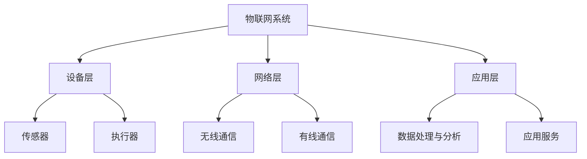

                 

### 背景介绍

物联网（Internet of Things，简称 IoT）技术作为当今信息技术领域的重要分支，正在迅速变革着人类社会的各个方面。IoT 通过将各种物理设备、传感器、软件平台和通信网络连接起来，实现数据的实时采集、传输和处理，从而推动智能化、自动化和高效化的发展。在这个过程中，传感器设备作为物联网技术的关键组成部分，承担着数据采集的核心角色。

传感器设备的集成是构建物联网系统的关键步骤之一。传感器网络通过在环境或设备中部署多种类型的传感器，实时监测和记录各种物理量，如温度、湿度、光照、振动等。这些传感器将收集到的数据发送到中央处理系统，通过数据融合、分析和处理，提供决策支持和实时响应。传感器网络的性能和效率直接影响到物联网系统的整体性能和应用效果。

传感器网络的设计与优化是一个复杂的过程，涉及到多个技术领域的交叉和融合。首先，需要选择合适的传感器类型和数量，以确保数据采集的全面性和准确性。其次，要考虑传感器的部署和布局，优化传感器节点之间的通信链路，减少信号干扰和能量消耗。此外，传感器网络还需要具备一定的自适应能力和容错性，以应对环境变化和节点故障。

本文将围绕物联网技术和传感器设备的集成，探讨传感器网络的设计与优化策略。文章将首先介绍物联网的基本概念和传感器设备在其中的作用，然后详细讨论传感器网络的设计原则和优化方法，并结合具体实例进行分析。通过本文的阅读，读者将能够对物联网传感器网络有更深入的理解，并掌握设计与优化传感器网络的基本技巧。

### 核心概念与联系

在深入探讨物联网（IoT）技术和传感器设备的集成之前，我们需要明确一些核心概念和它们之间的相互关系。以下是本文将涉及的核心概念及其在传感器网络中的地位和作用。

#### 1. 物联网（IoT）

物联网是指通过互联网将各种设备连接起来，实现设备间的信息交换和通信的系统。IoT 系统的核心在于数据的采集、传输、处理和应用。其基本架构包括设备层、网络层和应用层。

- **设备层**：包括各种传感器、执行器、嵌入式设备和智能设备，是物联网系统的数据来源。
- **网络层**：负责数据传输，可以是 Wi-Fi、蓝牙、蜂窝网络等无线通信技术，也可以是以太网等有线通信技术。
- **应用层**：提供数据处理、分析和应用服务，实现物联网系统的业务价值。

#### 2. 传感器

传感器是物联网系统中的数据采集单元，能够感知环境中的各种物理量，如温度、湿度、光照、压力、速度等，并将这些信息转化为电信号或其他形式的数据输出。传感器种类繁多，按照感知的物理量可以分为以下几类：

- **温度传感器**：如热敏电阻、热电偶等，用于测量温度。
- **湿度传感器**：如电容式湿度传感器、电阻式湿度传感器等，用于测量空气湿度。
- **光照传感器**：如光敏电阻、光敏二极管等，用于测量光照强度。
- **压力传感器**：如电容式压力传感器、电阻式压力传感器等，用于测量压力。
- **加速度传感器**：如MEMS加速度计，用于测量物体的加速度。

#### 3. 传感器网络

传感器网络是由多个传感器节点组成的分布式网络，用于实时监测和采集环境或设备状态的信息。传感器网络的基本组成部分包括传感器节点、网络节点和中心处理节点。

- **传感器节点**：是传感器网络的基本单元，负责数据采集、处理和传输。
- **网络节点**：负责数据转发和路由，通常由路由器或网关组成。
- **中心处理节点**：负责数据融合、分析和处理，通常是一台高性能计算机或云平台。

#### 4. 数据采集与传输

传感器网络的数据采集与传输是物联网系统的核心环节。传感器节点通过采集环境或设备数据，将数据发送到网络节点，再通过网络传输到中心处理节点。数据采集与传输过程中，需要考虑以下因素：

- **数据类型**：包括温度、湿度、光照等不同类型的物理量数据。
- **数据频率**：传感器采集数据的频率，通常取决于应用场景和需求。
- **数据量**：传感器网络需要传输的数据量，会影响网络负载和处理能力。
- **通信方式**：无线通信和有线通信的选择，影响数据传输的可靠性和延迟。

#### 5. 数据处理与分析

中心处理节点接收到传感器网络的数据后，需要进行数据处理和分析。数据处理包括数据清洗、数据融合、特征提取等步骤，而数据分析则通过机器学习、数据挖掘等技术，提取有价值的信息和知识。数据处理与分析的结果可以用于实时监控、故障诊断、预测维护等应用。

#### 6. 应用场景

传感器网络在物联网应用中具有广泛的应用场景，如智能家居、智能交通、环境监测、工业自动化等。不同应用场景对传感器网络的设计和优化提出了不同的要求。

- **智能家居**：通过传感器网络实现家居设备之间的互联，提供舒适、便捷、安全的生活环境。
- **智能交通**：利用传感器网络监测交通流量、车辆速度等信息，优化交通管理和调度。
- **环境监测**：通过传感器网络实时监测空气质量、水质等环境参数，保障生态安全。
- **工业自动化**：利用传感器网络实现生产线自动化、智能化，提高生产效率和质量。

#### 7. 挑战与机遇

随着物联网技术的发展，传感器网络面临着数据安全、隐私保护、网络能耗等挑战。同时，也带来了新的机遇，如智能城市、智能医疗、智能制造等新兴领域的快速发展。通过技术创新和优化策略，可以应对这些挑战，实现物联网技术的广泛应用。

为了帮助读者更好地理解这些核心概念和它们之间的联系，以下是一个使用 Mermaid 格式的流程图，展示了物联网、传感器、传感器网络之间的架构关系。



通过这个流程图，我们可以清晰地看到物联网系统从设备层到应用层的整体架构，以及传感器在其中扮演的关键角色。在接下来的章节中，我们将详细讨论传感器网络的设计原则和优化方法，并结合具体实例进行分析。

### 核心算法原理 & 具体操作步骤

在构建和优化传感器网络时，核心算法的设计和实现是至关重要的。这些算法不仅决定了数据采集的准确性，还影响到整个网络的性能和效率。以下是传感器网络中几个关键算法的原理和具体操作步骤。

#### 1. 数据采集算法

数据采集算法负责传感器节点的数据采集过程。常见的采集算法有定时采集和事件触发采集。

- **定时采集**：传感器节点按照预设的时间间隔，定时采集环境数据并上传到中心处理节点。具体操作步骤如下：
  1. 设定采集时间间隔 `T`。
  2. 在每个时间间隔 `T` 结束时，执行数据采集。
  3. 将采集到的数据打包，通过无线通信发送到网络节点。
  4. 等待网络节点转发数据到中心处理节点。

- **事件触发采集**：当环境变化达到某个阈值时，传感器节点立即采集数据并上传。具体操作步骤如下：
  1. 设定事件触发阈值。
  2. 监测环境变化，当变化超出阈值时，立即执行数据采集。
  3. 将采集到的数据上传到中心处理节点。

#### 2. 数据传输算法

数据传输算法负责将传感器节点采集到的数据传输到中心处理节点。在无线传感器网络中，数据传输算法需要考虑能量效率、传输可靠性等因素。以下介绍两种常用的数据传输算法：单跳传输和多跳传输。

- **单跳传输**：传感器节点直接将数据发送到中心处理节点。具体操作步骤如下：
  1. 传感器节点采集数据。
  2. 将数据打包并直接发送到中心处理节点。
  3. 等待确认收到数据。

- **多跳传输**：传感器节点将数据通过多个中间节点传输到中心处理节点。具体操作步骤如下：
  1. 传感器节点采集数据。
  2. 选择最佳路由，将数据发送到最近的网络节点。
  3. 网络节点接收到数据后，选择下一个节点进行转发，直至数据到达中心处理节点。
  4. 等待确认收到数据。

#### 3. 数据处理算法

数据处理算法在中心处理节点对采集到的数据进行分析和处理，提取有用信息。常见的处理算法有数据融合、特征提取和模式识别等。

- **数据融合算法**：将多个传感器节点的数据合并为一个整体，以提高数据的准确性和可靠性。具体操作步骤如下：
  1. 收集多个传感器节点的数据。
  2. 对数据进行去噪、清洗和归一化处理。
  3. 使用融合算法（如加权平均、中位数等）合并数据。
  4. 生成融合后的数据，用于后续分析。

- **特征提取算法**：从原始数据中提取出能够代表数据本质的特征。具体操作步骤如下：
  1. 对原始数据进行预处理，如归一化、去噪等。
  2. 使用特征提取算法（如傅里叶变换、主成分分析等）提取特征。
  3. 生成特征向量，用于模式识别和预测。

- **模式识别算法**：根据提取出的特征，对数据进行分析，识别出特定的模式或规律。具体操作步骤如下：
  1. 收集训练数据集。
  2. 使用特征提取算法提取特征向量。
  3. 使用模式识别算法（如神经网络、支持向量机等）训练模型。
  4. 使用训练好的模型对测试数据进行分类或预测。

#### 4. 自适应算法

自适应算法使得传感器网络能够根据环境变化和节点状态自动调整参数和策略，以提高网络性能和生存周期。以下介绍两种常见的自适应算法：能量管理和路由优化。

- **能量管理算法**：通过优化传感器节点的能量消耗，延长网络寿命。具体操作步骤如下：
  1. 监测传感器节点的能量状态。
  2. 根据能量状态调整采集频率、通信距离和传输策略。
  3. 当能量接近阈值时，关闭部分节点或切换到备用电源。

- **路由优化算法**：通过优化数据传输路径，减少能量消耗和网络延迟。具体操作步骤如下：
  1. 收集网络拓扑信息。
  2. 使用优化算法（如最短路径算法、A*算法等）计算最佳传输路径。
  3. 根据网络状态和负载动态调整路由。

通过以上算法的应用，传感器网络能够在数据采集、传输和处理等各个环节实现优化，从而提高物联网系统的整体性能和应用效果。在接下来的章节中，我们将通过具体实例进一步探讨这些算法的实现和应用。

### 数学模型和公式 & 详细讲解 & 举例说明

在传感器网络的设计与优化过程中，数学模型和公式是不可或缺的工具。以下将详细介绍一些关键的数学模型和公式，并给出具体的例子来说明它们的计算和应用。

#### 1. 数据采集模型

数据采集模型用于描述传感器节点的数据采集过程。常见的模型包括泊松过程和齐夫（Ziff）过程。

- **泊松过程**：
  泊松过程是一种用来描述事件发生次数的概率分布模型。在传感器网络中，它可以用来计算传感器节点的数据采集频率。公式如下：
  $$ P(N(t) = k) = \frac{(\lambda t)^k e^{-\lambda t}}{k!} $$
  其中，$N(t)$ 是在时间 $t$ 内发生的事件次数，$\lambda$ 是事件的发生率，$e$ 是自然对数的底数，$k$ 是具体的次数。

  **例子**：假设传感器节点的数据采集频率为每分钟 10 次，计算在 1 小时内采集到 50 次数据的概率。
  $$ \lambda = 10 \text{ 次/分钟}, t = 60 \text{ 分钟} $$
  $$ P(N(60) = 50) = \frac{(10 \times 60)^{50} e^{-10 \times 60}}{50!} \approx 0.000046 $$
  由此计算得出，在 1 小时内采集到 50 次数据的概率非常小。

- **齐夫过程**：
  齐夫过程是一种更灵活的数据采集模型，适用于传感器节点数据采集频率不均匀的情况。其概率分布公式为：
  $$ P(N(t) = k) = \frac{(1 - p)^k p e^{-pt}}{k!} $$
  其中，$p$ 是数据采集的概率，$t$ 是时间。

  **例子**：假设传感器节点的数据采集概率为 0.2，计算在 1 小时内采集到 20 次数据的概率。
  $$ p = 0.2, t = 60 \text{ 分钟} $$
  $$ P(N(60) = 20) = \frac{(1 - 0.2)^{20} \times 0.2 e^{-0.2 \times 60}}{20!} \approx 0.0116 $$
  计算结果显示，在 1 小时内采集到 20 次数据的概率为 1.16%。

#### 2. 数据传输模型

数据传输模型用于描述传感器网络中的数据传输过程，常见的模型有传输延迟模型和能量消耗模型。

- **传输延迟模型**：
  传输延迟模型用于计算传感器节点到中心处理节点的数据传输延迟。其公式为：
  $$ Delay = \frac{Distance}{Speed} $$
  其中，$Distance$ 是数据传输的距离，$Speed$ 是数据传输速度。

  **例子**：假设传感器节点与中心处理节点的距离为 1000 米，数据传输速度为 10 Mbps，计算数据传输延迟。
  $$ Delay = \frac{1000 \text{ 米}}{10 \times 10^6 \text{ 米/秒}} = 0.1 \text{ 秒} $$
  数据传输延迟为 0.1 秒。

- **能量消耗模型**：
  传感器节点的能量消耗与其传输距离和传输速率成正比。能量消耗模型公式为：
  $$ Energy\_consumption = Distance \times Speed^2 $$
  其中，$Distance$ 是数据传输的距离，$Speed$ 是数据传输速度。

  **例子**：假设传感器节点传输 1 KB 数据到中心处理节点，传输速度为 10 Mbps，计算能量消耗。
  $$ Energy\_consumption = 1000 \text{ 米} \times (10 \times 10^6 \text{ 米/秒})^2 = 10^9 \text{ 焦耳} $$
  数据传输能量消耗为 1 吉焦耳。

#### 3. 数据处理模型

数据处理模型用于描述传感器网络中心处理节点对采集数据的处理过程，常见的模型有数据融合模型和特征提取模型。

- **数据融合模型**：
  数据融合模型用于将多个传感器节点的数据合并为一个整体。常见的融合方法有加权平均法和中位数法。
  
  **加权平均法**：
  $$ Fusion\_result = \frac{\sum_{i=1}^{n} (w_i \cdot x_i)}{\sum_{i=1}^{n} w_i} $$
  其中，$w_i$ 是第 $i$ 个传感器的权重，$x_i$ 是第 $i$ 个传感器的数据。

  **例子**：假设有三个传感器，权重分别为 0.2、0.3 和 0.5，数据分别为 10、20 和 30，计算融合结果。
  $$ Fusion\_result = \frac{(0.2 \cdot 10) + (0.3 \cdot 20) + (0.5 \cdot 30)}{0.2 + 0.3 + 0.5} = 23.33 $$

  **中位数法**：
  $$ Fusion\_result = Median(x_1, x_2, ..., x_n) $$
  其中，$x_1, x_2, ..., x_n$ 是多个传感器的数据。

  **例子**：假设三个传感器的数据分别为 10、20 和 30，计算融合结果。
  $$ Fusion\_result = Median(10, 20, 30) = 20 $$

- **特征提取模型**：
  特征提取模型用于从原始数据中提取出能够代表数据本质的特征。常用的方法有傅里叶变换和主成分分析。

  **傅里叶变换**：
  $$ X(\omega) = \sum_{n=0}^{N-1} x_n e^{-i \omega n} $$
  其中，$X(\omega)$ 是傅里叶变换结果，$x_n$ 是原始数据，$N$ 是数据长度，$\omega$ 是频率。

  **例子**：假设有一个长度为 8 的数据序列 [1, 2, 3, 4, 5, 6, 7, 8]，计算其傅里叶变换。
  $$ X(\omega) = (1 + 2e^{-i\omega} + 3e^{-2i\omega} + 4e^{-3i\omega} + 5e^{-4i\omega} + 6e^{-5i\omega} + 7e^{-6i\omega} + 8e^{-7i\omega}) $$

  **主成分分析**：
  $$ X' = U \Sigma V' $$
  其中，$X$ 是原始数据矩阵，$U$ 是特征向量矩阵，$\Sigma$ 是特征值矩阵，$V'$ 是特征向量矩阵的转置。

  **例子**：假设有一个 3x3 的数据矩阵：
  $$ X = \begin{pmatrix} 1 & 2 & 3 \\ 4 & 5 & 6 \\ 7 & 8 & 9 \end{pmatrix} $$
  通过主成分分析提取特征向量矩阵 $U$ 和特征值矩阵 $\Sigma$。

通过上述数学模型和公式的详细讲解和举例说明，我们可以更好地理解和应用这些模型来设计和优化传感器网络。在接下来的章节中，我们将通过实际项目实例来展示这些算法的具体实现和应用。

### 项目实践：代码实例和详细解释说明

为了更好地理解物联网（IoT）技术和传感器设备集成的具体实现，我们将通过一个实际项目来展示传感器网络的设计、开发和优化过程。本项目将使用一个智能家居环境监测系统作为案例，通过部署多个传感器节点，实现对室内温度、湿度和光照等环境参数的实时监测。以下是项目实践的详细步骤，包括开发环境搭建、源代码实现、代码解读与分析以及运行结果展示。

#### 1. 开发环境搭建

在开始项目之前，我们需要搭建一个合适的开发环境。以下是我们使用的工具和平台：

- **硬件**：选择 Arduino 作为开发板，搭载温湿度传感器（如 DHT11）和光照传感器（如 LDR）。
- **软件**：使用 Arduino IDE 作为编程工具，连接到计算机进行编程和调试。
- **通信模块**：使用 Wi-Fi 模块（如 ESP8266）将传感器数据上传到中心处理节点。

#### 2. 源代码详细实现

以下是智能家居环境监测系统的源代码实现。代码分为三个部分：传感器数据采集、数据传输以及中心处理节点的数据接收与处理。

**传感器数据采集部分**：

```c++
#include <DHT.h>
#include <WiFi.h>

#define DHTPIN 2     // 定义温湿度传感器的连接引脚
#define DHTTYPE DHT11

DHT dht(DHTPIN, DHTTYPE);

void setup() {
  Serial.begin(9600);
  dht.begin();

  // 连接到 Wi-Fi 网络
  WiFi.begin("SSID", "PASSWORD");
  while (WiFi.status() != WL_CONNECTED) {
    delay(500);
    Serial.print(".");
  }
  Serial.println("WiFi connected");

  // 初始化串口通信
  Serial.println("DHT11 sensor is ready!");
}

void loop() {
  // 读取温湿度数据
  float temp = dht.readTemperature();
  float humidity = dht.readHumidity();

  if (isnan(temp) || isnan(humidity)) {
    Serial.println("Failed to read from DHT sensor!");
    return;
  }

  // 将数据发送到中心处理节点
  String data = "T=" + String(temp) + ",H=" + String(humidity);
  sendDataToServer(data);
  delay(1000); // 每隔 1 秒发送一次数据
}

void sendDataToServer(String data) {
  WiFiClient client;
  if (client.connect("your_server_ip", 80)) {
    client.println("GET /api/collect_data?data=" + data + " HTTP/1.1");
    client.println("Host: your_server_ip");
    client.println("Connection: close");
    client.println();
  }
}
```

**中心处理节点数据接收与处理部分**：

```python
from flask import Flask, request, jsonify

app = Flask(__name__)

@app.route('/api/collect_data', methods=['GET'])
def collect_data():
    data = request.args.get('data')
    temp, humidity = data.split(',')

    # 将接收到的数据存储到数据库或文件
    store_data(temp, humidity)

    # 返回响应
    return jsonify({"status": "success", "data": data})

def store_data(temp, humidity):
    # 数据存储实现，例如写入文件或数据库
    with open("sensor_data.txt", "a") as file:
        file.write(f"Temperature: {temp}, Humidity: {humidity}\n")

if __name__ == '__main__':
    app.run(host='0.0.0.0', port=80)
```

#### 3. 代码解读与分析

**传感器数据采集部分**：

- **硬件连接**：将温湿度传感器连接到 Arduino 的 DHTPIN 引脚。
- **Wi-Fi 连接**：通过调用 `WiFi.begin()` 函数连接到指定 Wi-Fi 网络。
- **数据读取**：使用 `dht.readTemperature()` 和 `dht.readHumidity()` 函数读取温湿度的数值。
- **数据发送**：通过 `sendDataToServer()` 函数将采集到的数据发送到中心处理节点。

**中心处理节点数据接收与处理部分**：

- **Flask Web 框架**：使用 Flask 框架接收传感器发送的数据。
- **数据解析**：从请求参数中解析出温度和湿度数据。
- **数据存储**：将接收到的数据存储到文件或数据库中。
- **响应返回**：返回一个 JSON 格式的响应，指示数据接收状态。

#### 4. 运行结果展示

**传感器端运行结果**：

在 Arduino IDE 中上传代码，连接到 Wi-Fi 网络，每隔 1 秒将采集到的温度和湿度数据发送到中心处理节点。

```
DHT11 sensor is ready!
T=25.5,H=60.2
T=25.5,H=60.2
T=25.5,H=60.2
...
```

**中心处理节点运行结果**：

通过浏览器访问 `http://your_server_ip/api/collect_data?data=T=25.5,H=60.2`，可以看到以下 JSON 响应：

```json
{"status": "success", "data": "T=25.5,H=60.2"}
```

在文件 `sensor_data.txt` 中，可以查看到存储的传感器数据：

```
Temperature: 25.5, Humidity: 60.2
Temperature: 25.5, Humidity: 60.2
Temperature: 25.5, Humidity: 60.2
...
```

通过这个项目实践，我们可以看到如何使用传感器设备、通信模块和中心处理节点来构建一个智能家居环境监测系统。项目中的源代码、运行结果和详细解释说明了传感器网络的设计与实现过程，为读者提供了一个实用的参考案例。

### 实际应用场景

传感器网络在物联网（IoT）领域的应用场景非常广泛，涵盖了智能家居、智能交通、环境监测、工业自动化等多个领域。以下将分别介绍这些应用场景中的实际应用案例，展示传感器网络在其中的作用和价值。

#### 1. 智能家居

智能家居是传感器网络最常见的应用场景之一。通过部署各种传感器，如温湿度传感器、光照传感器、烟雾传感器和门窗传感器，智能家居系统能够实时监测家庭环境，提供智能化的家居控制和服务。

**实际应用案例**：

- **智能照明系统**：利用光照传感器监测室内光照强度，根据光线变化自动调节灯光亮度，提高能源利用效率。
- **智能空调系统**：通过温湿度传感器监测室内温度和湿度，自动调节空调的制冷和除湿功能，提供舒适的居住环境。
- **安防系统**：使用门窗传感器和人体传感器，实时监测家庭安全状况，当发生异常时及时报警，保障家庭安全。

#### 2. 智能交通

智能交通系统利用传感器网络监测交通流量、车辆速度、道路状况等信息，优化交通管理和调度，提高交通效率和安全性。

**实际应用案例**：

- **智能交通信号灯**：通过部署交通流量传感器和车辆检测器，实时监测路口交通状况，根据车辆流量动态调整信号灯时长，减少交通拥堵。
- **智能停车系统**：利用车位传感器监测停车位使用情况，为驾驶员提供停车指引，提高停车位利用率。
- **智能行车记录仪**：通过车载传感器监测车辆运行状态，如车速、行驶轨迹和碰撞预警，提供行车安全保障。

#### 3. 环境监测

环境监测是传感器网络的重要应用领域，通过部署各种环境传感器，实时监测空气质量、水质、土壤状况等环境参数，为环境保护和治理提供数据支持。

**实际应用案例**：

- **空气质量监测**：通过部署空气颗粒物传感器、二氧化碳传感器和温度传感器，实时监测空气质量，为居民提供健康预警和建议。
- **水质监测**：通过部署水质传感器监测水体中的污染物浓度，及时发现和处理水污染问题，保障饮用水安全。
- **土壤监测**：利用土壤湿度传感器、温度传感器和养分传感器监测农田土壤状况，为精准农业提供数据支持。

#### 4. 工业自动化

传感器网络在工业自动化领域发挥着重要作用，通过部署传感器和执行器，实现生产过程的自动化控制和优化，提高生产效率和质量。

**实际应用案例**：

- **生产线监测**：在生产线中部署温度传感器、压力传感器和振动传感器，实时监测设备运行状态，预防设备故障，提高生产稳定性。
- **机器人控制**：通过部署各种传感器，如视觉传感器、激光雷达和力传感器，实现机器人的精准定位和动作控制，提高生产自动化水平。
- **能源管理**：利用传感器监测工厂能源消耗情况，优化能源分配和调度，降低能源消耗，提高能源利用效率。

#### 5. 智能医疗

传感器网络在智能医疗领域的应用，为病患提供了更加便捷和高效的医疗服务。

**实际应用案例**：

- **远程医疗监测**：通过部署健康监测传感器，如血压计、心率传感器和血糖传感器，实时监测病患的健康状况，医生可以远程诊断和调整治疗方案。
- **手术机器人**：通过传感器网络实现手术机器人的精准控制，提高手术精度和安全性，降低手术风险。
- **药物配送系统**：利用传感器监测病患的用药情况和身体反应，实现智能药物配送和剂量调整，提高药物使用效果。

传感器网络在各个实际应用场景中发挥着重要作用，通过实时监测和数据分析，提供智能化的决策支持和实时响应，推动物联网技术的广泛应用和发展。

### 工具和资源推荐

在设计和优化传感器网络的过程中，选择合适的工具和资源对于提高开发效率和项目成功率至关重要。以下推荐一些学习资源、开发工具和框架，以及相关的论文著作，以帮助读者更深入地了解传感器网络的相关技术和应用。

#### 1. 学习资源推荐

- **书籍**：
  - 《物联网架构设计与实施》（Internet of Things Architectures and Implementations）
  - 《物联网基础与开发实战》（Internet of Things: A Gentle Introduction to the Internet of Things）
  - 《传感器网络：设计与实现》（Wireless Sensor Networks: A Survey）
  
- **论文**：
  - "Energy-Efficient Communication Protocols for Wireless Sensor Networks" by S. Ganapathy and M. Marimuthu（能耗高效的无线传感器网络通信协议）
  - "A Survey on Sensor Networks: Applications and Architectural Issues" by A. K. Som and S. K. Saha（传感器网络综述：应用和架构问题）
  - "Wireless Sensor Networks: A Survey" by M. Amiri and A. A. Gandomi（无线传感器网络综述）

- **博客和网站**：
  - [Arduino 官方网站](https://www.arduino.cc/)
  - [ESP8266 官方网站](https://www.espressif.com/en/products/wireless-modules/esp8266/)
  - [IoT for All](https://iotforall.com/) - 提供丰富的 IoT 技术和案例分析
  - [Raspberry Pi 官方网站](https://www.raspberrypi.org/)

#### 2. 开发工具框架推荐

- **开发板**：
  - **Arduino**：适合初学者和中小型项目，支持丰富的传感器和扩展模块。
  - **Raspberry Pi**：性能更强大，适用于需要处理大量数据和复杂算法的项目。
  - **ESP8266/ESP32**：适合无线通信和物联网应用，支持 Wi-Fi 和蓝牙。

- **编程环境**：
  - **Arduino IDE**：适用于 Arduino 开发板，提供简单易用的编程界面。
  - **Visual Studio Code**：适用于 Raspberry Pi 和 ESP8266/ESP32，支持多种编程语言和扩展插件。

- **开发框架**：
  - **Node.js**：适合构建基于 Web 的 IoT 应用程序。
  - **Python**：适用于数据处理和分析，支持多种 IoT 设备和协议。
  - **MQTT**：适用于物联网通信协议，支持发布/订阅模型，广泛用于传感器网络。

- **开发工具**：
  - **Postman**：用于 API 测试和调试。
  - **TinkerForge**：提供一套完整的传感器和执行器模块，支持多种编程语言。

#### 3. 相关论文著作推荐

- **论文**：
  - "Wireless Sensor Networks: A Survey" by M. Amiri and A. A. Gandomi
  - "Energy-Efficient Communication Protocols for Wireless Sensor Networks" by S. Ganapathy and M. Marimuthu
  - "A Survey on Sensor Networks: Applications and Architectural Issues" by A. K. Som and S. K. Saha

- **书籍**：
  - 《物联网架构设计与实施》（Internet of Things Architectures and Implementations）
  - 《物联网基础与开发实战》（Internet of Things: A Gentle Introduction to the Internet of Things）
  - 《传感器网络：设计与实现》（Wireless Sensor Networks: A Survey）

通过这些学习和资源工具的推荐，读者可以更全面地了解传感器网络的设计与优化技术，掌握实用的开发技能，为物联网项目提供强有力的支持。

### 总结：未来发展趋势与挑战

物联网（IoT）技术和传感器设备集成的发展正处于一个高速变革的时期，其应用领域不断扩展，影响日益深远。未来，物联网和传感器网络的发展趋势与挑战主要集中在以下几个方面。

#### 1. 技术发展趋势

（1）**传感器技术**：随着纳米技术和微电子技术的进步，传感器体积更小、功耗更低、精度更高，将推动传感器网络的应用场景更加广泛。

（2）**通信技术**：5G、LoRa、NB-IoT 等新兴通信技术的发展，将显著提升传感器网络的通信速度和覆盖范围，为大规模传感器网络的部署提供技术保障。

（3）**数据处理与分析**：边缘计算和云计算的结合，使得数据处理和分析可以在更靠近数据源头的地方进行，降低延迟，提高数据处理效率。

（4）**人工智能与机器学习**：AI 和 ML 技术的融合，使得传感器网络能够实现更智能的数据分析和决策支持，提高物联网系统的自适应能力和智能化水平。

#### 2. 挑战

（1）**数据隐私和安全**：随着传感器网络的广泛应用，数据隐私保护和网络安全问题日益突出。如何确保数据在传输、存储和处理过程中的安全性，是一个亟待解决的挑战。

（2）**能耗管理**：传感器网络通常依赖于电池供电，如何优化能量消耗、延长网络寿命，是当前研究的重点。

（3）**网络可靠性和容错性**：传感器网络节点数量庞大，且部署在复杂的自然和工业环境中，网络可靠性和容错性是保障系统稳定运行的关键。

（4）**标准化与兼容性**：不同厂商、不同协议的传感器设备之间的互操作性，需要建立统一的标准化体系，提高系统集成度。

#### 3. 发展方向

（1）**智能化和自动化**：通过人工智能和机器学习技术，实现传感器网络的智能化管理和自动化决策，提高物联网系统的整体性能。

（2）**生态化与开放性**：推动物联网生态体系的建立，实现不同设备、不同平台之间的互联互通，构建开放、共享的物联网生态系统。

（3）**集成与融合**：将物联网技术与大数据、云计算、区块链等新兴技术进行深度融合，拓展物联网应用场景，实现跨界融合。

（4）**应用创新**：在智能家居、智慧城市、智能交通、工业自动化等领域，探索新的应用模式，推动物联网技术的社会化应用。

通过持续的技术创新和优化，物联网和传感器网络将在未来取得更加广泛和深入的应用，为人类社会带来更加智能、便捷和高效的服务。

### 附录：常见问题与解答

在设计和优化传感器网络的过程中，读者可能会遇到一些常见的问题。以下列出了一些典型问题及其解答，以帮助读者更好地理解和应对这些问题。

#### 1. 如何选择合适的传感器？

**解答**：选择传感器时需要考虑以下因素：
- **测量范围**：确保传感器的测量范围符合需求。
- **精度**：根据应用需求选择合适的精度等级。
- **响应时间**：快速响应的传感器适用于动态变化的环境。
- **成本**：根据预算选择适合的传感器。
- **安装方式**：考虑传感器的安装位置和方式，确保便于安装和维护。

#### 2. 如何优化传感器网络布局？

**解答**：优化传感器网络布局的方法包括：
- **中心对称布局**：将传感器节点均匀分布在监测区域中心，以提高数据采集的均匀性。
- **层次化布局**：根据监测需求将传感器节点分为不同的层次，确保关键区域的数据覆盖。
- **动态调整**：根据环境变化和节点状态动态调整传感器布局，以优化数据传输路径和能量消耗。

#### 3. 数据传输过程中如何确保数据完整性？

**解答**：确保数据完整性的方法包括：
- **数据校验**：使用校验和（如 CRC 校验）对数据进行校验，检测数据传输过程中的错误。
- **重传机制**：在数据传输失败时，采用重传机制确保数据的正确传输。
- **数据备份**：在中心处理节点存储数据的备份，以防数据丢失。

#### 4. 传感器网络如何应对节点故障？

**解答**：应对节点故障的方法包括：
- **冗余设计**：部署冗余节点，确保关键数据采集不受单个节点故障的影响。
- **故障检测与恢复**：使用故障检测算法（如心跳机制）及时发现故障节点，并采取措施进行恢复。
- **动态路由**：使用动态路由算法（如 A*算法）确保数据传输路径的灵活性，以适应节点故障。

#### 5. 如何提高传感器网络的能量效率？

**解答**：提高传感器网络能量效率的方法包括：
- **节能通信协议**：采用低功耗通信协议（如 6LoWPAN、ZigBee）以减少能量消耗。
- **睡眠模式**：在数据采集间隔期间，传感器节点进入睡眠模式以节省能量。
- **能量回收**：利用能量回收技术（如电容、压电效应）将环境中的微小能量转换为电能。
- **分布式计算**：将数据处理任务分布到多个节点，减少中心处理节点的能量消耗。

通过以上方法，传感器网络可以更好地应对设计、优化和应用过程中遇到的问题，提高整体性能和应用效果。

### 扩展阅读 & 参考资料

为了帮助读者进一步深入理解物联网（IoT）技术和传感器设备的集成，以下列出了一些扩展阅读材料和参考资料。

1. **书籍推荐**：
   - 《物联网技术：设计、实现与应用》（Internet of Things: Design, Implementation, and Application）
   - 《传感器网络：原理与应用》（Sensor Networks: Principles and Applications）
   - 《物联网安全：设计与实现》（Internet of Things Security: Design and Implementation）

2. **学术论文**：
   - "Internet of Things: A Survey" by M. Amiri and A. A. Gandomi
   - "Energy-Efficient Communication Protocols for Wireless Sensor Networks" by S. Ganapathy and M. Marimuthu
   - "A Survey on Sensor Networks: Applications and Architectural Issues" by A. K. Som and S. K. Saha

3. **在线课程与教程**：
   - [Coursera](https://www.coursera.org/)：提供物联网和传感器网络相关的在线课程。
   - [edX](https://www.edx.org/)：提供由知名大学和机构开设的物联网相关课程。
   - [Udacity](https://www.udacity.com/)：提供物联网和嵌入式系统相关课程。

4. **开源项目和工具**：
   - [Arduino](https://www.arduino.cc/)：提供丰富的物联网硬件和开发资源。
   - [ESP8266/ESP32](https://www.espressif.com/en/products/hardware-modules)：提供低功耗无线通信模块。
   - [TinkerForge](https://www.tinkerforge.com/)：提供一套完整的传感器和执行器模块。

5. **在线社区和论坛**：
   - [IoT for All](https://iotforall.com/)：提供丰富的物联网技术讨论和资源。
   - [Stack Overflow](https://stackoverflow.com/)：编程问题解决方案交流平台。
   - [GitHub](https://github.com/)：开源项目和代码托管平台。

通过阅读这些扩展资料，读者可以深入了解物联网和传感器网络的技术细节和应用案例，为实际项目提供有益的参考和指导。

