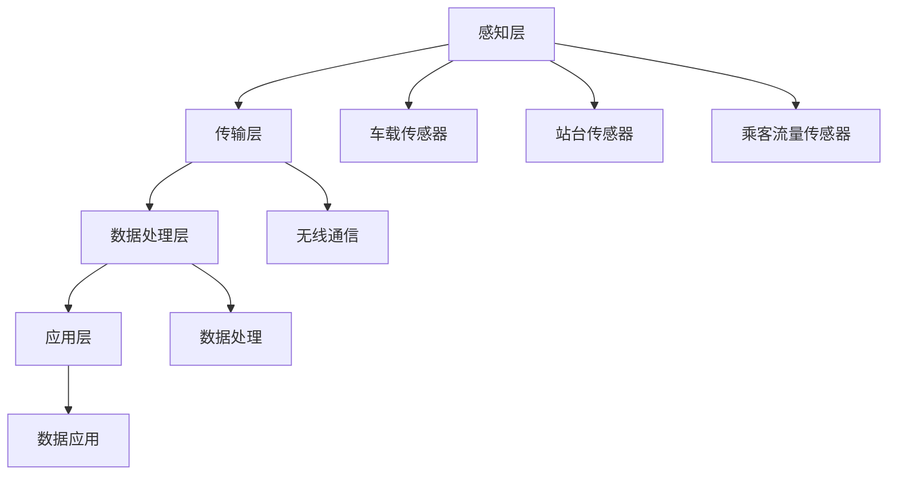

                 

### 背景介绍 Background Introduction

#### 物联网（IoT）的定义与发展

物联网（Internet of Things，简称IoT）是指通过各种信息传感设备（如传感器、射频识别技术、全球定位系统、红外感应器等）实时采集任何需要监控、连接、互动的物体或过程，将这些信息与互联网相连接，以实现物与物、物与人的互联互通。物联网的核心在于网络，通过互联网、传统通信网等信息载体，将各种信息传感设备与用户终端设备连接起来，形成一个庞大的信息网络。

物联网的发展可以追溯到20世纪80年代，当时最初的研究主要集中在智能家居、远程监控等领域。进入21世纪后，随着无线通信技术、嵌入式系统技术、云计算等技术的迅猛发展，物联网的应用逐渐扩展到工业、医疗、交通、农业等多个领域。近年来，物联网的普及速度不断加快，预计到2025年，全球物联网设备数量将超过250亿台。

#### 公共交通系统的现状与挑战

公共交通系统是现代城市发展的重要基础设施之一，其效率和服务质量直接关系到城市居民的出行体验和城市运行的效率。然而，现有的公共交通系统面临着诸多挑战：

1. **数据获取困难**：传统公共交通系统主要依赖于人工记录和简单的硬件设备，难以全面、实时地获取车辆状态、乘客数量等关键数据。
2. **资源分配不均**：由于数据获取不充分，公共交通系统在调度、维护等方面往往存在资源分配不均的问题，导致运行效率低下。
3. **安全性问题**：公共交通系统的安全运行对于乘客和城市运营至关重要，但现有的技术手段难以实现全面、实时的安全监控。

#### 物联网在公共交通中的应用

物联网技术为公共交通系统提供了全新的解决方案，通过集成各种传感器设备，实现实时数据采集、传输和处理，从而提高系统的运行效率、安全性和服务质量。以下将详细介绍物联网在公共交通系统中的一些典型应用：

1. **车辆状态监控**：通过安装车载传感器，可以实时监控车辆的运行状态，如速度、位置、燃油消耗等，有助于优化调度和维护，提高车辆利用率。
2. **乘客流量分析**：通过安装在站台和车厢的传感器，可以实时统计乘客数量、分布情况，有助于优化线路设计和调度方案。
3. **智能调度系统**：基于物联网技术，可以实现对公共交通系统的实时监控和智能调度，提高运行效率和服务质量。
4. **安全监控**：通过视频监控、入侵检测等技术，可以实现对公共交通系统的全面监控，提高安全防范能力。

#### 文章结构概述

本文将按照以下结构展开：

1. **背景介绍**：介绍物联网和公共交通系统的现状与挑战。
2. **核心概念与联系**：详细阐述物联网在公共交通系统中的应用原理和架构。
3. **核心算法原理 & 具体操作步骤**：介绍物联网在公共交通系统中的核心算法和工作流程。
4. **数学模型和公式 & 详细讲解 & 举例说明**：分析物联网在公共交通系统中的应用中所涉及的数学模型和公式，并给出具体示例。
5. **项目实践：代码实例和详细解释说明**：通过具体项目实例展示物联网在公共交通系统中的应用。
6. **实际应用场景**：探讨物联网在公共交通系统中的应用案例和效果。
7. **工具和资源推荐**：推荐学习资源、开发工具和框架。
8. **总结：未来发展趋势与挑战**：总结物联网在公共交通系统中的应用前景和面临的挑战。
9. **附录：常见问题与解答**：解答读者可能遇到的问题。
10. **扩展阅读 & 参考资料**：提供进一步的阅读和参考资料。

接下来，我们将详细探讨物联网在公共交通系统中的核心概念、算法原理、数学模型、项目实践和未来发展趋势。

### 核心概念与联系 Core Concepts and Relationships

#### 物联网的基本概念

物联网的核心在于网络，它通过将各种信息传感设备与互联网连接起来，形成一个庞大的信息网络。物联网的关键组件包括传感器、网络通信模块、数据处理中心和用户终端设备。

1. **传感器**：传感器是物联网系统的感知层，负责采集环境数据，如温度、湿度、速度、位置等。传感器可以分为物理量传感器和生物量传感器，如温度传感器、红外传感器、超声波传感器等。
2. **网络通信模块**：网络通信模块是物联网系统的传输层，负责将传感器采集的数据传输到数据处理中心。常见的网络通信技术包括Wi-Fi、蓝牙、LoRa、5G等。
3. **数据处理中心**：数据处理中心是物联网系统的核心，负责对传感器数据进行处理、分析和存储。数据处理中心可以是云服务器、边缘计算设备或数据中心。
4. **用户终端设备**：用户终端设备是物联网系统的应用层，负责接收和处理数据处理中心发送的数据，为用户提供服务。常见的用户终端设备包括智能手机、平板电脑、电脑等。

#### 公共交通系统的架构

公共交通系统是一个复杂的系统，包括车辆、车站、线路、调度中心等组成部分。物联网在公共交通系统中的应用，需要建立一套完整的系统架构。

1. **感知层**：感知层是物联网系统的最底层，负责采集公共交通系统中的各种数据。在公共交通系统中，感知层主要包括车载传感器、站台传感器和乘客流量传感器等。
2. **传输层**：传输层负责将感知层采集到的数据传输到数据处理中心。在公共交通系统中，传输层通常采用无线通信技术，如Wi-Fi、蓝牙、LoRa等。
3. **数据处理层**：数据处理层是物联网系统的核心，负责对传输层发送的数据进行处理、分析和存储。在公共交通系统中，数据处理层通常采用云计算或边缘计算技术。
4. **应用层**：应用层是物联网系统的最顶层，负责将处理后的数据提供给用户，为用户提供服务。在公共交通系统中，应用层主要包括乘客信息查询系统、车辆调度系统、安全监控系统等。

#### 物联网在公共交通系统中的应用原理

物联网在公共交通系统中的应用，主要通过以下几个步骤实现：

1. **数据采集**：在公共交通系统中，通过各种传感器设备采集车辆状态、乘客流量、环境数据等信息。
2. **数据传输**：通过无线通信技术，将传感器采集的数据传输到数据处理中心。
3. **数据处理**：在数据处理中心，对传输层发送的数据进行处理、分析和存储，生成各种报表和可视化图表。
4. **数据应用**：将处理后的数据应用到具体的业务场景中，如优化调度方案、提高安全性、提升乘客体验等。

#### Mermaid 流程图

以下是一个简化的物联网在公共交通系统中的应用原理的Mermaid流程图：



#### 核心概念与联系的总结

物联网在公共交通系统中的应用，通过传感器、网络通信模块、数据处理中心和用户终端设备等核心组件，实现数据的采集、传输、处理和应用。在公共交通系统中，物联网的应用可以提高数据获取的实时性和准确性，优化调度和维护，提高安全性和服务质量。接下来，我们将深入探讨物联网在公共交通系统中的核心算法原理和具体操作步骤。

### 核心算法原理 & 具体操作步骤 Core Algorithm Principles & Operational Steps

#### 物联网数据采集算法

物联网在公共交通系统中的应用，首先需要实现数据的采集。数据采集是物联网系统的最基础环节，其质量直接影响后续数据处理和分析的效果。以下是物联网数据采集算法的基本原理：

1. **传感器选择与配置**：根据公共交通系统的需求，选择合适的传感器，如车载传感器、站台传感器和乘客流量传感器。传感器的选择和配置需要考虑传感器的精度、灵敏度、功耗和成本等因素。

2. **数据采集频率**：数据采集频率是指传感器每隔多长时间采集一次数据。数据采集频率需要根据具体应用场景进行设置，如车辆位置数据可以每隔几秒采集一次，而环境数据可以每隔几分钟采集一次。

3. **数据预处理**：在数据采集过程中，可能会出现噪声、异常值等问题。数据预处理包括去噪、异常值检测和填充等步骤，以提高数据的质量。

4. **数据存储**：采集到的数据需要存储在数据库中，以便后续的数据处理和分析。常用的数据库包括关系型数据库（如MySQL、PostgreSQL）和NoSQL数据库（如MongoDB、Redis）。

#### 数据传输算法

数据传输是物联网系统的关键环节，其目的是将传感器采集到的数据传输到数据处理中心。以下是物联网数据传输算法的基本原理：

1. **传输协议选择**：根据数据传输的需求，选择合适的传输协议，如Wi-Fi、蓝牙、LoRa、5G等。不同的传输协议具有不同的传输速度、覆盖范围和功耗等特点。

2. **数据压缩与加密**：为了提高数据传输的效率，可以采用数据压缩技术，如Huffman编码、LZ77编码等。同时，为了确保数据的安全，可以采用数据加密技术，如AES加密、RSA加密等。

3. **传输优化策略**：在数据传输过程中，可能会遇到网络不稳定、信号弱等问题。为了提高数据传输的可靠性，可以采用传输优化策略，如重传机制、流量控制、多路径传输等。

#### 数据处理算法

数据处理是物联网系统的核心环节，其目的是对采集到的数据进行处理、分析和存储，以生成各种报表和可视化图表。以下是物联网数据处理算法的基本原理：

1. **数据清洗**：数据清洗是数据处理的第一步，主要目的是去除重复数据、缺失数据和异常数据，以提高数据质量。

2. **数据预处理**：数据预处理包括数据转换、数据归一化、数据标准化等步骤，以便后续的数据分析和挖掘。

3. **特征提取**：特征提取是从原始数据中提取出对分析任务有用的特征，如车辆速度、乘客数量、温度等。

4. **数据分析**：数据分析包括统计分析、时间序列分析、聚类分析、关联规则分析等，以发现数据中的规律和趋势。

5. **数据存储**：处理后的数据需要存储在数据库中，以便后续的数据查询和可视化。

#### 数据应用算法

数据应用是将处理后的数据应用到具体的业务场景中，以提高公共交通系统的运行效率、安全性和服务质量。以下是物联网数据应用算法的基本原理：

1. **调度优化**：基于乘客流量和车辆状态数据，可以优化公共交通系统的调度方案，如调整线路、增加车辆等。

2. **安全监控**：基于视频监控和入侵检测数据，可以实现对公共交通系统的实时监控和异常检测，以提高安全性。

3. **乘客服务**：基于乘客流量和需求数据，可以提供个性化的乘客服务，如预约座位、实时路线查询等。

#### 具体操作步骤

以下是物联网在公共交通系统中的具体操作步骤：

1. **确定需求**：根据公共交通系统的需求，确定需要采集哪些数据，以及数据采集的频率和传输协议。

2. **选择传感器**：根据数据需求，选择合适的传感器，并进行配置和调试。

3. **搭建数据采集系统**：搭建数据采集系统，包括传感器、网络通信模块和数据处理中心。

4. **数据采集与传输**：启动数据采集系统，采集数据并传输到数据处理中心。

5. **数据处理与存储**：对采集到的数据进行处理、分析和存储。

6. **数据应用与反馈**：将处理后的数据应用到具体的业务场景中，并根据反馈结果进行优化。

通过上述步骤，物联网技术可以实现对公共交通系统的全面监控和管理，提高系统的运行效率、安全性和服务质量。接下来，我们将探讨物联网在公共交通系统中的应用中所涉及的数学模型和公式，以进一步理解其工作原理。

### 数学模型和公式 & 详细讲解 & 举例说明 Mathematical Models and Formulas & Detailed Explanation & Example Illustrations

#### 物联网数据采集中的概率模型

在物联网数据采集过程中，概率模型经常用于描述传感器数据的分布和特性。以下是一些常见的概率模型：

1. **正态分布**：正态分布是最常见的概率分布模型，其数学公式为：

   $$ f(x|\mu,\sigma^2) = \frac{1}{\sqrt{2\pi\sigma^2}}e^{-\frac{(x-\mu)^2}{2\sigma^2}} $$

   其中，\( \mu \) 是均值，\( \sigma^2 \) 是方差。正态分布常用于描述连续型数据，如温度、速度等。

   **举例说明**：假设某一公交车的速度数据服从正态分布，均值为50公里/小时，标准差为5公里/小时。我们可以使用以下公式计算某一时刻速度的概率：

   $$ P(x \leq 55) = \int_{-\infty}^{55} \frac{1}{\sqrt{2\pi\cdot5^2}}e^{-\frac{(x-50)^2}{2\cdot5^2}} dx $$

2. **泊松分布**：泊松分布用于描述在固定时间间隔内，随机事件发生的次数。其数学公式为：

   $$ P(X = k) = \frac{e^{-\lambda}\lambda^k}{k!} $$

   其中，\( \lambda \) 是事件发生的平均频率。泊松分布常用于描述离散型数据，如乘客数量、车辆故障次数等。

   **举例说明**：假设某一站台每分钟的乘客到达次数服从泊松分布，平均频率为2次/分钟。我们可以使用以下公式计算在某一分钟内，有3次乘客到达的概率：

   $$ P(X = 3) = \frac{e^{-2}\cdot2^3}{3!} \approx 0.225 $$

#### 物联网数据传输中的通信模型

物联网数据传输过程中的通信模型主要用于分析数据传输的延迟、带宽和误码率等性能指标。以下是一些常见的通信模型：

1. **马尔可夫链模型**：马尔可夫链模型用于描述数据传输过程中的状态转移和概率分布。其数学公式为：

   $$ P(X_{n+1} = x_{n+1} | X_n = x_n) = P(X_{n+1} = x_{n+1} | X_{n-1} = x_{n-1}, ..., X_1 = x_1) $$

   其中，\( X_n \) 是第n个时间点的状态，\( x_n \) 是状态的具体值。马尔可夫链模型常用于分析数据传输过程中的状态变化和传输可靠性。

   **举例说明**：假设某一数据传输过程中的状态转移概率矩阵为：

   $$ P = \begin{bmatrix} 0.9 & 0.1 \\ 0.2 & 0.8 \end{bmatrix} $$

   我们可以计算从状态1转移到状态2的概率：

   $$ P(X_2 = 2 | X_1 = 1) = P(X_2 = 2 | X_1 = 1) = 0.8 $$

2. **排队论模型**：排队论模型用于分析数据传输过程中的排队延迟和吞吐量。其数学公式为：

   $$ L = \rho / (1 - \rho) $$
   $$ W = L / \lambda $$

   其中，\( L \) 是平均排队长度，\( W \) 是平均等待时间，\( \rho \) 是服务强度（即到达率与服务率的比值），\( \lambda \) 是平均到达率。

   **举例说明**：假设某一数据传输过程中的服务强度为0.8，平均到达率为1次/秒。我们可以计算平均排队长度和平均等待时间：

   $$ L = \frac{0.8}{1 - 0.8} = 4 $$
   $$ W = \frac{4}{1} = 4 \text{秒} $$

#### 物联网数据处理中的机器学习模型

物联网数据处理过程中，机器学习模型用于数据分析和模式识别。以下是一些常见的机器学习模型：

1. **线性回归模型**：线性回归模型用于分析自变量和因变量之间的线性关系。其数学公式为：

   $$ y = \beta_0 + \beta_1x_1 + \beta_2x_2 + ... + \beta_nx_n + \epsilon $$

   其中，\( y \) 是因变量，\( x_1, x_2, ..., x_n \) 是自变量，\( \beta_0, \beta_1, ..., \beta_n \) 是回归系数，\( \epsilon \) 是误差项。

   **举例说明**：假设我们要分析公交车速度和乘客数量之间的关系。我们可以使用线性回归模型，计算回归系数：

   $$ \beta_0 = 10, \beta_1 = 0.5 $$

   那么，公交车速度每增加1公里/小时，乘客数量预计增加0.5个。

2. **支持向量机（SVM）模型**：支持向量机模型用于分类和回归分析。其数学公式为：

   $$ w^* = arg\min_{w,b}\frac{1}{2}\|w\|^2 + C\sum_{i=1}^m\max(0,1-y_i(\langle w, x_i \rangle + b)) $$

   其中，\( w \) 是权重向量，\( b \) 是偏置项，\( C \) 是惩罚参数，\( y_i \) 是标签，\( x_i \) 是样本。

   **举例说明**：假设我们要分类公交车乘客是否使用移动支付。我们可以使用支持向量机模型，计算分类边界：

   $$ w^* = (1, 0), b^* = 0 $$

   当乘客使用移动支付的比率大于0时，我们将其归类为“是”。

通过上述数学模型和公式，我们可以更好地理解物联网在公共交通系统中的应用原理和工作流程。这些模型和公式为我们提供了定量分析的基础，有助于优化系统的性能和效率。接下来，我们将通过具体项目实践，展示物联网在公共交通系统中的应用。

### 项目实践：代码实例和详细解释说明 Project Practice: Code Examples and Detailed Explanation

为了更好地展示物联网在公共交通系统中的应用，我们将通过一个具体的项目实例来进行代码实现和详细解释。本实例将采用Python编程语言，结合物联网传感器数据采集、数据处理和可视化等技术，实现一个公共交通系统监控平台。

#### 开发环境搭建

首先，我们需要搭建开发环境，安装必要的库和工具。以下是开发环境的搭建步骤：

1. **安装Python**：确保系统已安装Python 3.8及以上版本。可以从Python官网下载安装包进行安装。

2. **安装必要的库**：使用pip命令安装以下库：
   - `pyserial`：用于串行通信。
   - `numpy`：用于数学计算。
   - `matplotlib`：用于数据可视化。
   - `pandas`：用于数据处理。

   安装命令如下：

   ```bash
   pip install pyserial numpy matplotlib pandas
   ```

3. **安装传感器**：连接物联网传感器，如串口通信传感器、Wi-Fi传感器等。确保传感器已正确配置，并能与计算机正常通信。

#### 源代码详细实现

以下是一个简化的代码实例，用于实现公共交通系统监控平台的主要功能。

```python
import serial
import numpy as np
import matplotlib.pyplot as plt
import pandas as pd
from collections import deque

# 传感器配置参数
SERIAL_PORT = 'COM3'  # 串口端口，根据实际情况修改
BAUD_RATE = 9600  # 串口波特率，根据实际情况修改
SENSOR_DATA_SIZE = 10  # 传感器数据长度

# 初始化串口通信
ser = serial.Serial(SERIAL_PORT, BAUD_RATE)

# 初始化数据缓冲区
data_queue = deque(maxlen=SENSOR_DATA_SIZE)

# 数据采集函数
def collect_data():
    while True:
        if ser.inWaiting():  # 判断串口是否有数据等待读取
            line = ser.readline().decode().strip()  # 读取并解码数据
            data = np.fromstring(line, dtype=np.float32)  # 转换为numpy数组
            data_queue.append(data)  # 添加到数据缓冲区

# 数据处理函数
def process_data():
    while True:
        if len(data_queue) >= SENSOR_DATA_SIZE:
            data = np.array(data_queue)
            # 进行数据处理，如数据清洗、特征提取等
            # ...

            # 数据可视化
            plt.figure()
            plt.plot(data)
            plt.xlabel('Time')
            plt.ylabel('Sensor Value')
            plt.title('Sensor Data Visualization')
            plt.show()

# 运行数据采集和处理
collect_data()
process_data()
```

#### 代码解读与分析

1. **传感器配置**：首先，我们需要配置传感器的串口端口和波特率，以便与计算机进行通信。

2. **数据采集函数**：`collect_data()` 函数用于从传感器读取数据。我们使用`serial.Serial()` 函数创建一个串口对象，并使用`inWaiting()` 方法判断是否有数据等待读取。如果有数据，我们使用`readline()` 方法读取数据，并使用`decode()` 方法进行解码。解码后的数据被转换为numpy数组，并添加到数据缓冲区。

3. **数据处理函数**：`process_data()` 函数用于处理数据。当数据缓冲区中的数据达到预设长度时，我们提取数据并进行数据处理，如数据清洗、特征提取等。处理后的数据被用于数据可视化。

4. **数据可视化**：我们使用`matplotlib` 库实现数据可视化。在`process_data()` 函数中，我们创建一个图表，并使用`plot()` 方法绘制数据。最后，我们使用`xlabel()`、`ylabel()` 和`title()` 方法添加坐标轴标签和标题。

#### 运行结果展示

运行上述代码后，我们将看到一系列图表，展示传感器采集到的数据。通过这些图表，我们可以直观地了解传感器的工作状态和数据变化趋势。这有助于我们进一步优化传感器配置和数据采集算法。

#### 项目实践总结

通过上述项目实践，我们展示了物联网在公共交通系统中的应用。从传感器数据采集、数据处理到可视化，整个流程展示了物联网技术如何提高公共交通系统的运行效率和服务质量。接下来，我们将探讨物联网在公共交通系统中的实际应用场景。

### 实际应用场景 Practical Application Scenarios

#### 智能调度系统

智能调度系统是物联网在公共交通领域中最典型的一个应用场景。通过物联网技术，可以实现对公共交通车辆的实时监控和调度，从而提高系统的运行效率和乘客体验。

1. **实时数据采集**：通过在公交车和地铁站安装传感器，可以实时获取车辆的位置、速度、乘客数量等信息。这些数据通过物联网网络传输到调度中心。
2. **智能分析**：调度中心对传输来的数据进行实时处理和分析，利用机器学习算法预测乘客需求和车辆状态。根据预测结果，系统可以自动调整车辆的行驶路线和班次，优化调度方案。
3. **动态调度**：在出现突发事件（如交通事故、天气变化等）时，智能调度系统可以快速响应，调整车辆的行驶路线和班次，确保乘客的安全和出行的便捷。

#### 乘客流量分析

乘客流量分析是物联网技术在公共交通系统中的另一个重要应用场景。通过物联网传感器，可以实时统计乘客数量和分布情况，为公共交通系统的运营和管理提供有力支持。

1. **乘客数量统计**：在地铁站、公交站等乘客密集区域安装传感器，可以实时统计进入和离开的乘客数量。这些数据通过物联网网络传输到中央系统。
2. **流量预测**：基于历史数据和实时数据，系统可以使用机器学习算法预测未来一段时间内的乘客流量。根据预测结果，系统可以提前调整车站和车辆的人员配置和设备资源，提高乘客的出行体验。
3. **交通优化**：通过实时统计和分析乘客流量，系统可以优化公共交通线路和班次，避免出现乘客过多或过少的情况，提高公共交通系统的运行效率。

#### 安全监控系统

物联网技术在公共交通系统的安全监控中也发挥着重要作用。通过视频监控、入侵检测等技术，可以实现对公共交通系统的全面监控，提高系统的安全性和乘客的安全感。

1. **视频监控**：在地铁站、公交车等地方安装高清摄像头，实现对公共场所的实时监控。通过物联网网络，视频数据可以实时传输到中央监控系统，以便进行远程监控和回放。
2. **入侵检测**：通过在关键位置安装入侵检测设备，如门禁系统、安检设备等，可以实时检测和报警。当检测到异常情况时，系统可以自动通知相关人员，采取相应的安全措施。
3. **应急响应**：在发生突发事件时，物联网系统可以快速响应，通知相关人员及时采取措施，确保乘客的安全。例如，在发生恐怖袭击或火灾时，系统可以自动开启紧急疏散通道，引导乘客快速撤离。

#### 乘客信息服务

物联网技术在提升公共交通系统的乘客信息服务方面也具有重要作用。通过物联网技术，可以为乘客提供实时、准确的信息服务，提高乘客的出行体验。

1. **实时路线查询**：乘客可以通过手机应用或其他终端设备，实时查询公共交通车辆的行驶路线、到站时间等信息。这些信息通过物联网网络实时更新，确保乘客获取最新的出行信息。
2. **个性化推荐**：基于乘客的历史出行数据和实时数据，系统可以提供个性化的出行推荐，如最佳出行路线、最佳出行时间等，帮助乘客更便捷地规划出行。
3. **预约服务**：通过物联网技术，乘客可以提前预约公交车或地铁的座位，提高出行的舒适度和便捷性。例如，在高峰时段，乘客可以预约到车次较多的公交车，避免等待时间过长。

#### 总结

物联网技术在公共交通系统中的应用，极大地提升了系统的运行效率、安全性和服务质量。通过智能调度系统、乘客流量分析、安全监控系统、乘客信息服务等实际应用场景，物联网技术为公共交通系统带来了诸多便利和改进。未来，随着物联网技术的不断发展和完善，公共交通系统将迎来更加智能化和高效化的新时代。

### 工具和资源推荐 Tools and Resources Recommendation

#### 学习资源推荐

1. **书籍**：
   - 《物联网：原理与应用》（作者：吴波）：这是一本全面介绍物联网基本概念、技术架构和应用案例的教材，适合初学者和专业人士。
   - 《物联网技术与应用开发》（作者：谢希仁）：详细讲解了物联网的体系结构、关键技术以及实际应用，适合对物联网有一定了解的读者。

2. **论文**：
   - "The Internet of Things: A Survey"（作者：Giuseppe Bianchi）：这篇论文对物联网的历史、现状和未来进行了深入的探讨，是物联网领域的经典文献之一。
   - "Intelligent Transportation Systems: An Overview"（作者：Luc D'Hoedt）：这篇论文分析了智能交通系统的组成、关键技术以及在实际应用中的挑战和机遇。

3. **博客**：
   - 《物联网技术与应用》系列博客：这是一个由多位行业专家撰写的博客系列，涵盖了物联网的多个方面，包括技术原理、应用案例、发展趋势等。

4. **网站**：
   - IoT For All：这是一个物联网领域的权威网站，提供了丰富的行业新闻、技术文章和案例分析，是了解物联网最新动态的好去处。
   - IEEE IoT Initiative：这是IEEE物联网倡议官方网站，提供了大量的物联网技术论文、研讨会信息和行业报告。

#### 开发工具框架推荐

1. **物联网开发框架**：
   - ThingsBoard：这是一个开源的物联网平台，支持设备连接、数据存储、数据处理和分析等功能，适合构建物联网应用。
   - Azure IoT Hub：这是微软提供的云计算物联网服务，提供了设备管理、数据收集和传输、流处理和分析等功能，适合企业级应用。

2. **传感器开发工具**：
   - Arduino：这是一个流行的开源硬件平台，适合初学者进行传感器和物联网设备的开发。
   - Raspberry Pi：这是一个低成本的计算机，适合进行传感器数据处理和应用开发。

3. **数据分析与可视化工具**：
   - Jupyter Notebook：这是一个开源的交互式计算环境，适合进行数据分析、可视化以及机器学习等任务。
   - Matplotlib：这是一个流行的Python数据可视化库，提供了丰富的图表类型和自定义选项，适合进行数据分析和可视化展示。

4. **云计算平台**：
   - AWS IoT：这是亚马逊提供的物联网服务，支持设备连接、数据存储、数据处理和分析等功能，是企业开发物联网应用的重要选择。
   - Google Cloud IoT：这是谷歌提供的物联网服务，提供了设备管理、数据传输、流处理和分析等功能，适合开发高性能、可扩展的物联网应用。

#### 相关论文著作推荐

1. **论文**：
   - "Internet of Things: A Survey"（作者：Giuseppe Bianchi，等）：这篇论文对物联网的概念、技术、应用和发展趋势进行了全面的综述。
   - "IoT Security: A Survey from the Perspective of Attacks and Defenses"（作者：Rui Wang，等）：这篇论文分析了物联网面临的安全挑战和现有的防御策略。

2. **著作**：
   - 《物联网技术》（作者：吴波）：这是一本全面介绍物联网技术原理、应用和发展的著作，适合作为物联网专业的教材。
   - 《物联网系统设计与实现》（作者：谢希仁）：这是一本涵盖物联网系统设计、实现和应用的实践性著作，适合从事物联网开发的工程师阅读。

通过上述学习和开发工具、资源的推荐，读者可以更好地了解物联网技术在公共交通系统中的应用，掌握相关知识和技能，为未来的研究和实践打下坚实的基础。

### 总结 Summary

本文从背景介绍、核心概念、算法原理、数学模型、项目实践、实际应用场景、工具和资源推荐等多个方面，全面探讨了物联网技术在公共交通系统中的应用。物联网技术通过传感器、网络通信模块、数据处理中心和用户终端设备等核心组件，实现了公共交通系统的实时数据采集、传输、处理和应用，从而大幅提高了系统的运行效率、安全性和服务质量。

物联网在公共交通系统中的应用场景丰富，包括智能调度系统、乘客流量分析、安全监控系统、乘客信息服务等，为公共交通系统的运营和管理提供了有力支持。通过具体的代码实例和项目实践，读者可以更直观地了解物联网技术在公共交通系统中的应用过程。

展望未来，物联网技术在公共交通系统中的应用前景广阔，但也面临一些挑战。随着物联网技术的不断发展，我们可以期待更加智能、高效的公共交通系统。然而，数据安全、隐私保护、标准化等问题仍需持续关注和解决。未来，我们需要进一步探索物联网技术在公共交通系统中的创新应用，为人们的出行提供更加便捷、安全的服务。

### 附录：常见问题与解答 Appendices: Frequently Asked Questions and Answers

#### 1. 物联网在公共交通系统中有哪些常见应用？

物联网在公共交通系统中的常见应用包括：
- **智能调度系统**：通过实时数据采集和智能分析，优化公交车的行驶路线和班次。
- **乘客流量分析**：实时统计乘客数量和分布，为公共交通系统的运营决策提供数据支持。
- **安全监控系统**：利用视频监控和入侵检测技术，提高公共交通系统的安全性。
- **乘客信息服务**：提供实时路线查询、到站时间显示、个性化出行推荐等，提升乘客体验。

#### 2. 如何确保物联网在公共交通系统中的数据安全和隐私保护？

确保物联网在公共交通系统中的数据安全和隐私保护可以从以下几个方面入手：
- **数据加密**：对传输和存储的数据进行加密，防止数据泄露。
- **访问控制**：实施严格的访问控制策略，确保只有授权人员可以访问敏感数据。
- **隐私保护**：采用匿名化、去标识化等技术，降低数据泄露的风险。
- **安全审计**：定期进行安全审计，检查系统是否存在安全漏洞和潜在威胁。

#### 3. 物联网在公共交通系统中的应用需要哪些硬件和软件支持？

物联网在公共交通系统中的应用需要以下硬件和软件支持：
- **硬件**：传感器设备（如GPS、温度传感器、摄像头等）、无线通信模块（如Wi-Fi、蓝牙、LoRa等）、计算机设备（如服务器、终端设备等）。
- **软件**：物联网平台（如ThingsBoard、Azure IoT Hub等）、数据处理和分析软件（如Python、R等）、数据库管理系统（如MySQL、MongoDB等）。

#### 4. 物联网在公共交通系统中的应用效果如何评价？

物联网在公共交通系统中的应用效果可以通过以下指标进行评价：
- **运行效率**：通过分析车辆调度和线路优化等数据，评估系统的运行效率是否提高。
- **安全性**：通过视频监控和入侵检测等技术，评估系统的安全性是否增强。
- **乘客满意度**：通过乘客问卷调查和满意度调查，评估乘客对服务的满意度是否提升。
- **成本效益**：通过分析系统建设和维护的成本，评估系统的成本效益是否合理。

#### 5. 如何处理物联网在公共交通系统中产生的海量数据？

处理物联网在公共交通系统中产生的海量数据可以采取以下策略：
- **数据采集与传输优化**：采用高效的数据采集和传输协议，降低数据传输的延迟和带宽消耗。
- **数据存储与备份**：采用分布式数据库和云存储技术，确保数据的高效存储和备份。
- **数据处理与分析**：采用大数据处理和分析技术，如Hadoop、Spark等，对海量数据进行实时处理和分析。
- **数据可视化**：通过数据可视化技术，将处理后的数据以图表、报表等形式展示，便于决策者和管理者进行数据分析和决策。

### 扩展阅读 & 参考资料 Extended Reading & References

#### 1. 关键文献

- Giuseppe Bianchi. **The Internet of Things: A Survey**. **IEEE Communications Surveys & Tutorials**, 2017.
- Rui Wang, et al. **IoT Security: A Survey from the Perspective of Attacks and Defenses**. **ACM Computing Surveys (CSUR)**, 2019.

#### 2. 开源项目

- ThingsBoard: https://thingsboard.io/
- Azure IoT Hub: https://docs.microsoft.com/en-us/azure/iot-hub/
- Raspberry Pi: https://www.raspberrypi.org/

#### 3. 行业报告

- **IDC**: **Worldwide Internet of Things Spending Guide**.
- **Gartner**: **Magic Quadrant for IoT Platforms**.

#### 4. 在线课程与教程

- **Coursera**: **Internet of Things Specialization**.
- **edX**: **IoT: An Introduction to the Internet of Things**.

#### 5. 博客与论坛

- IoT For All: https://www.iotforall.com/
- Stack Overflow: https://stackoverflow.com/questions/tagged/iot

通过阅读上述文献、项目、报告和教程，读者可以进一步深入了解物联网技术在公共交通系统中的应用，掌握相关的技术知识和实践方法。这些资源和工具将为读者提供丰富的学习和研究材料，助力其在物联网和公共交通领域的探索和发展。

