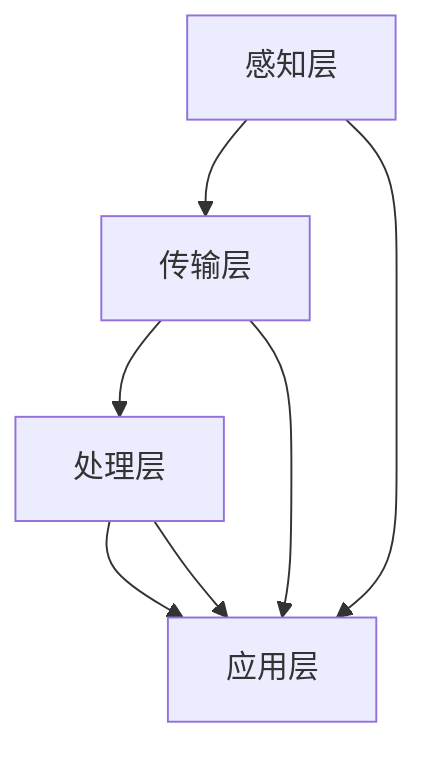
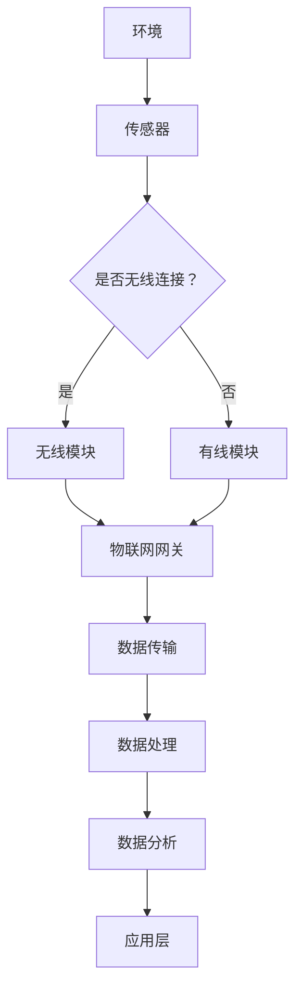

                 

### 背景介绍

#### 物联网（IoT）的发展背景

随着信息技术的飞速发展，物联网（Internet of Things，IoT）逐渐成为现代科技领域的一个热点。物联网是指通过互联网连接各种智能设备，实现设备之间以及设备与互联网之间的信息交换和通信，从而达到对物理世界的智能化控制和监控。物联网技术的发展背景可以追溯到互联网的普及以及无线通信技术的进步。

20世纪末，互联网的普及使得全球的信息交流变得快捷方便。与此同时，无线通信技术的发展，尤其是无线传感网络（Wireless Sensor Networks，WSN）的兴起，为物联网的实现提供了技术基础。这些技术发展促使人们开始探索如何将各种物理设备连接到互联网，实现设备的智能化和互联互通。

#### 物联网（IoT）的组成与分类

物联网系统通常由以下几个关键部分组成：传感器、网络、数据处理平台和应用程序。

1. **传感器**：传感器是物联网系统的感知层，用于检测和收集物理世界中的各种数据，如温度、湿度、光照、运动等。传感器种类繁多，包括温度传感器、湿度传感器、光照传感器、加速度传感器等。

2. **网络**：网络是物联网系统的传输层，用于将传感器收集到的数据传输到数据处理平台。网络可以分为有线网络和无线网络，如Wi-Fi、蓝牙、LoRa等。

3. **数据处理平台**：数据处理平台是物联网系统的核心，用于对传感器数据进行存储、处理和分析。数据处理平台通常包括服务器、数据库和数据分析软件。

4. **应用程序**：应用程序是物联网系统的应用层，用于将处理后的数据以用户友好的形式呈现，并实现具体的业务功能。例如，智能家居系统中的智能灯控、智能安防系统中的视频监控等。

物联网系统可以根据其应用场景和功能进行分类，常见的分类方法包括：

- **智能家居**：通过物联网技术将家庭中的各种设备连接起来，实现家庭环境的智能化管理和控制。
- **智能城市**：利用物联网技术对城市中的基础设施进行监控和管理，提高城市管理效率和居民生活质量。
- **智能医疗**：通过物联网技术对患者的健康状况进行实时监控和远程诊断，提高医疗服务水平。
- **工业物联网**：利用物联网技术对工业生产过程进行监控和控制，提高生产效率和质量。

#### 物联网（IoT）在安全监控中的应用

随着物联网技术的不断发展，其在安全监控领域的应用也越来越广泛。物联网安全监控是指利用物联网技术对特定区域或场所进行实时监控，以预防和应对各种安全威胁。以下是物联网在安全监控中的一些具体应用：

1. **视频监控**：通过在监控区域安装物联网摄像头，实现对监控区域的实时视频监控。物联网摄像头具有高清图像、远程控制和移动侦测等功能，可以大大提高监控效率和准确性。

2. **入侵检测**：利用物联网传感器和传感器网络，对监控区域进行实时入侵检测。当有异常行为发生时，系统会立即发出警报，并通知相关人员进行处理。

3. **人脸识别**：物联网与人脸识别技术的结合，可以实现实时人脸识别和身份验证，提高安防系统的智能化水平。

4. **环境监控**：通过物联网传感器对监控区域的环境参数进行实时监控，如温度、湿度、空气质量等，可以及时发现异常情况，保障人员安全。

5. **智能报警**：物联网安全监控系统能够根据不同场景设置相应的报警阈值，当监测到异常数据时，自动发出报警信号，提醒相关人员采取应对措施。

#### 安全监控的重要性

安全监控在现代社会中具有重要意义。首先，它可以预防和应对各种安全威胁，保障人民的生命财产安全。其次，通过实时监控和数据采集，可以为政府和企事业单位提供重要的决策依据，提高管理效率。此外，安全监控还可以促进社会的和谐稳定，为构建智慧城市和智能社会提供技术支持。

#### 物联网安全监控的发展趋势

随着物联网技术的不断进步，物联网安全监控也在不断发展和完善。未来，物联网安全监控将朝着以下几个方向发展：

1. **智能化**：通过引入人工智能技术，提高监控系统的智能化水平，实现自动化的威胁识别和响应。

2. **协同化**：通过构建多源异构数据融合平台，实现不同监控设备之间的信息共享和协同工作，提高监控系统的整体效能。

3. **安全化**：加强物联网安全监控系统的安全防护，防止数据泄露和网络攻击，保障监控数据的真实性和完整性。

4. **定制化**：根据不同场景和需求，为用户提供个性化的物联网安全监控解决方案，提高监控系统的适用性和灵活性。

### 1.1 物联网安全监控的定义与重要性

物联网安全监控是指利用物联网技术对特定区域或场所进行实时监控，以预防和应对各种安全威胁的一种综合系统。它通过部署各种传感器、摄像头、监控设备等，实现对目标区域的全面监控，并利用数据处理和分析技术，提供实时、准确的安全信息。

#### 物联网安全监控的定义

物联网安全监控的定义可以从以下几个方面来理解：

1. **目标**：物联网安全监控的目标是保障目标区域的安全，预防和应对各种安全威胁，如入侵、火灾、故障等。

2. **技术**：物联网安全监控利用物联网技术，包括传感器、摄像头、监控设备、数据处理和分析技术等，实现对目标区域的实时监控。

3. **功能**：物联网安全监控具有实时监控、数据采集、数据分析、报警通知等功能，能够及时发现问题并提供解决方案。

#### 物联网安全监控的重要性

物联网安全监控在现代社会中具有极其重要的地位，主要体现在以下几个方面：

1. **保障公共安全**：通过物联网安全监控，可以实时了解目标区域的安全状况，及时发现并应对各种安全威胁，保障人民的生命财产安全。

2. **提高管理效率**：物联网安全监控系统能够对目标区域进行实时监控，提供全面、准确的安全信息，有助于政府和企事业单位提高管理效率，优化资源配置。

3. **促进社会和谐**：物联网安全监控有助于预防和应对各种社会安全事件，促进社会的和谐稳定，为构建智慧城市和智能社会提供技术支持。

4. **支持智慧决策**：物联网安全监控系统能够采集和分析大量数据，为政府和企事业单位提供科学的决策依据，提高决策的准确性和有效性。

#### 物联网安全监控的发展历程

物联网安全监控的发展历程可以分为以下几个阶段：

1. **初级阶段**：主要是基于传统视频监控技术的简单应用，如监控系统安装、视频录像存储等。

2. **中级阶段**：随着物联网技术的发展，监控设备逐渐智能化，能够通过传感器收集环境数据，实现对目标区域的全面监控。

3. **高级阶段**：物联网安全监控系统开始引入人工智能技术，实现自动化的威胁识别和响应，提高监控系统的智能化水平。

#### 当前物联网安全监控的现状

当前，物联网安全监控已经广泛应用于各个领域，如智能家居、智能城市、智能医疗、工业物联网等。以下是一些当前物联网安全监控的现状：

1. **市场规模**：随着物联网技术的不断普及，物联网安全监控市场规模逐年扩大，预计未来几年将继续保持高速增长。

2. **技术进步**：物联网安全监控技术不断进步，传感器性能提高，数据处理和分析技术日益成熟，监控系统的智能化水平不断提高。

3. **应用场景**：物联网安全监控的应用场景日益丰富，不仅限于传统的安全监控领域，还扩展到智慧城市、智能医疗、智能交通等新兴领域。

4. **挑战与问题**：尽管物联网安全监控取得了显著成果，但仍面临一些挑战和问题，如数据安全、网络攻击、隐私保护等。

### 1.2 物联网安全监控的基本架构

物联网安全监控系统通常由以下几个关键部分组成：感知层、传输层、处理层和应用层。每个层次都有其特定的功能和作用，共同构成了一个完整的物联网安全监控体系。

#### 感知层

感知层是物联网安全监控系统的最底层，负责数据的采集和感知。感知层主要包括各种传感器和监控设备，如摄像头、温度传感器、湿度传感器、烟雾传感器、入侵检测器等。这些传感器和设备能够实时监测目标区域的环境参数、运动状态等信息，并将采集到的数据传输给上一层的处理层。

#### 传输层

传输层负责将感知层采集到的数据传输到处理层。传输层可以采用有线网络和无线网络两种方式。有线网络通常包括以太网、光纤等，而无线网络则包括Wi-Fi、蓝牙、LoRa等。传输层的主要任务是保证数据传输的可靠性和实时性，同时应对各种网络干扰和故障。

#### 处理层

处理层是物联网安全监控系统的核心，负责对感知层传输来的数据进行处理和分析。处理层通常包括数据存储、数据清洗、数据分析和数据可视化等功能。通过这些功能，处理层能够对海量数据进行分析，提取有价值的信息，为应用层提供决策支持。

#### 应用层

应用层是物联网安全监控系统的最高层，负责将处理层得到的数据以用户友好的形式呈现，并提供具体的业务功能。应用层主要包括监控界面、报警系统、数据分析报表等。用户可以通过监控界面实时查看监控数据，并通过报警系统及时响应各种异常情况。

#### 系统架构图

为了更直观地理解物联网安全监控系统的基本架构，我们可以使用Mermaid流程图来展示系统的各个层次及其关系。以下是物联网安全监控系统架构的Mermaid流程图示例：



在上述架构中：

- **感知层**：通过传感器和监控设备实时采集数据。
- **传输层**：将感知层的数据传输到处理层，确保数据的可靠传输。
- **处理层**：对传输层的数据进行处理和分析，提取有价值的信息。
- **应用层**：将处理层的结果以用户友好的形式呈现，并提供具体的业务功能。

通过上述架构，我们可以看到物联网安全监控系统各个部分之间的紧密协作，共同构成了一个完整的监控体系。接下来，我们将进一步深入探讨物联网安全监控中的核心概念、技术原理以及在实际应用中的具体实现。

### 核心概念与联系

#### 物联网（IoT）技术核心概念

在深入了解物联网（IoT）技术和各种传感器设备的集成之前，我们首先需要明确几个核心概念，这些概念是构建物联网系统的基石。

1. **传感器**：传感器是一种能够感知外部环境并将物理量转换为电信号的装置。常见的传感器包括温度传感器、湿度传感器、光照传感器、气体传感器等。传感器是实现物联网感知层的重要组件。

2. **物联网网关**：物联网网关是连接各种传感器、执行器和外部网络的接口设备，它负责数据的采集、传输和协议转换。物联网网关通常具有数据处理能力和网络通信功能，是物联网系统中至关重要的中间件。

3. **边缘计算**：边缘计算是指将计算、存储和处理能力从云端转移到数据生成的地方，即网络边缘。通过边缘计算，可以减少数据传输延迟，提高系统的响应速度，增强物联网系统的实时性和可靠性。

4. **云计算**：云计算是一种通过互联网提供计算资源、存储资源和应用程序的服务模式。在物联网系统中，云计算负责大数据存储、处理和分析，为物联网应用提供强大的计算支持。

5. **雾计算**：雾计算是介于云计算和边缘计算之间的一种计算模式，它将计算资源和存储资源分布在网络的各个节点上，以提供更加本地化和分布式的能力。雾计算在物联网系统中起到补充和扩展边缘计算的作用。

#### 各种传感器设备的工作原理及集成方法

1. **温度传感器**：温度传感器通过测量物体表面的温度变化来检测环境温度。常见的工作原理包括热电偶、热敏电阻和红外传感器。温度传感器通常与物联网网关连接，通过无线或有线方式传输温度数据到处理平台。

2. **湿度传感器**：湿度传感器用于测量环境中的水分含量。常见的湿度传感器包括电容式和电阻式传感器。在物联网系统中，湿度传感器与物联网网关集成，通过无线通信模块传输数据到云平台进行分析和处理。

3. **光照传感器**：光照传感器用于检测环境光照强度，常见的工作原理有光电导和光电生电。光照传感器广泛应用于智能照明、环境监测等领域。在物联网系统中，光照传感器通过物联网网关连接到云平台，实现实时光照数据的监控。

4. **气体传感器**：气体传感器用于检测空气中的特定气体成分，如二氧化碳、氧气、一氧化碳等。常见的气体传感器有半导体传感器和电化学传感器。气体传感器在物联网系统中广泛应用于室内空气质量监测、工业安全监控等领域。

#### 物联网传感器设备的集成方法

1. **物理连接**：物理连接是将传感器设备通过有线方式（如RS-485、USB等）连接到物联网网关。这种方式通常适用于距离较近、环境稳定的场景。

2. **无线连接**：无线连接是通过无线通信技术（如Wi-Fi、Zigbee、LoRa等）将传感器设备连接到物联网网关。这种方式适用于大面积、移动性强或布线不便的场景。

3. **协议适配**：不同传感器设备可能使用不同的通信协议，物联网网关需要具备协议转换功能，确保各种传感器设备的数据能够统一传输到数据处理平台。

4. **数据聚合与处理**：物联网网关不仅需要传输传感器数据，还需要对数据进行初步处理，如数据清洗、过滤、聚合等，以提高数据质量和处理效率。

#### Mermaid流程图展示

为了更好地展示物联网传感器设备的工作原理和集成方法，我们可以使用Mermaid流程图来描述整个系统架构和数据处理流程。



在这个流程图中：

- **A**：表示环境，包括需要监测的各种物理量。
- **B**：表示各种传感器，用于感知环境变化。
- **C**：表示是否采用无线连接。
- **D** 和 **E**：表示无线和有线连接模块，用于将传感器数据传输到物联网网关。
- **F**：表示物联网网关，负责数据传输、协议转换和初步处理。
- **G**、**H**、**I**：表示数据传输、处理和分析环节。
- **J**：表示应用层，用于将分析结果呈现给用户。

通过上述核心概念和流程图，我们可以清晰地理解物联网技术及其各种传感器设备的工作原理和集成方法，为后续章节中的具体实现和案例分析打下基础。

### 核心算法原理 & 具体操作步骤

#### 传感器数据采集与预处理算法

在物联网安全监控系统中，传感器数据的质量和准确性对监控效果起着关键作用。因此，核心算法的一个重要部分是传感器数据采集与预处理算法。以下将介绍一种常见的预处理算法——卡尔曼滤波算法。

1. **卡尔曼滤波算法的基本原理**

卡尔曼滤波是一种基于状态估计的递归算法，用于从一系列的不准确测量中估计一个系统的状态。它通过对系统状态的预测和测量值的更新来逐步提高估计的准确性。卡尔曼滤波算法的主要思想是利用先验知识（预测）和测量信息（更新）来优化状态估计。

2. **卡尔曼滤波算法的具体步骤**

（1）**初始化**：首先初始化状态向量 \(\mathbf{x}_0\) 和协方差矩阵 \(\mathbf{P}_0\)。状态向量 \(\mathbf{x}_0\) 表示系统初始状态，如传感器初始读数；协方差矩阵 \(\mathbf{P}_0\) 表示初始状态的不确定性。

$$
\mathbf{x}_0 = \mathbf{X}_0, \quad \mathbf{P}_0 = \mathbf{P}_0
$$

（2）**预测**：利用系统模型预测下一时刻的状态向量 \(\mathbf{x}_{k|k-1}\) 和协方差矩阵 \(\mathbf{P}_{k|k-1}\)。

$$
\mathbf{x}_{k|k-1} = \mathbf{F}_k \mathbf{x}_{k-1} + \mathbf{B}_k \mathbf{u}_k
$$

$$
\mathbf{P}_{k|k-1} = \mathbf{F}_k \mathbf{P}_{k-1} \mathbf{F}_k^\top + \mathbf{Q}_k
$$

其中，\(\mathbf{F}_k\) 是系统状态转移矩阵，\(\mathbf{B}_k\) 是控制输入矩阵，\(\mathbf{u}_k\) 是控制输入，\(\mathbf{Q}_k\) 是过程噪声协方差矩阵。

（3）**更新**：结合当前测量值 \(\mathbf{z}_k\) 来更新状态估计。

$$
\mathbf{K}_k = \mathbf{P}_{k|k-1} \mathbf{H}_k^\top (\mathbf{H}_k \mathbf{P}_{k|k-1} \mathbf{H}_k^\top + \mathbf{R}_k)^{-1}
$$

$$
\mathbf{x}_k = \mathbf{x}_{k|k-1} + \mathbf{K}_k (\mathbf{z}_k - \mathbf{H}_k \mathbf{x}_{k|k-1})
$$

$$
\mathbf{P}_k = (\mathbf{I} - \mathbf{K}_k \mathbf{H}_k) \mathbf{P}_{k|k-1}
$$

其中，\(\mathbf{H}_k\) 是观测矩阵，\(\mathbf{R}_k\) 是测量噪声协方差矩阵，\(\mathbf{K}_k\) 是卡尔曼增益。

（4）**重复步骤（2）和（3）**：利用更新后的状态估计作为下一次预测的初始值，重复上述过程。

3. **算法实现示例**

以下是一个简单的卡尔曼滤波算法实现示例，假设我们有一个简单的线性系统，状态向量为 \(\mathbf{x}_k = [x_1, x_2]\)，其中 \(x_1\) 表示位置，\(x_2\) 表示速度。测量值为 \(\mathbf{z}_k = [z_1, z_2]\)，其中 \(z_1\) 表示测量到的位置，\(z_2\) 表示测量到的速度。

```python
import numpy as np

# 初始化参数
F = np.array([[1, 1],
              [0, 1]])
H = np.array([[1, 0],
              [0, 1]])
Q = np.array([[1, 0],
              [0, 1]])
R = np.array([[1, 0],
              [0, 1]])
P = np.array([[1, 0],
              [0, 1]])

# 初始状态
x = np.array([0, 0])

# 测量值
z = np.array([0, 0])

# 卡尔曼滤波
for k in range(10):
    # 预测
    x_pred = F @ x
    P_pred = F @ P @ F.T + Q

    # 更新
    K = P_pred @ H.T @ (H @ P_pred @ H.T + R)^(-1)
    x = x_pred + K @ (z - H @ x_pred)
    P = (np.eye(2) - K @ H) @ P_pred

    # 输出当前状态
    print(f"k={k}, x={x}, P={P}")
```

运行上述代码，将输出10次迭代后的状态估计值和协方差矩阵。

#### 传感器数据融合算法

在物联网安全监控系统中，通常会同时使用多个传感器来获取同一物理量的数据。为了提高数据的准确性和可靠性，常常需要对多个传感器的数据进行融合处理。以下介绍一种常用的数据融合算法——加权平均算法。

1. **加权平均算法的基本原理**

加权平均算法通过为每个传感器的数据分配不同的权重，来计算多个传感器数据的平均值。权重的分配通常基于传感器的精度、可靠性和重要性。通过加权平均算法，可以有效地消除传感器之间的误差，提高整体数据的准确性。

2. **加权平均算法的具体步骤**

（1）**初始化权重**：根据传感器的特性为每个传感器分配初始权重。通常，可以使用传感器的精度作为权重，精度越高，权重越大。

（2）**计算加权平均值**：对于每个时刻的传感器数据，计算加权平均值。

$$
\bar{x}_k = \sum_{i=1}^n w_i x_i
$$

其中，\(w_i\) 是第 \(i\) 个传感器的权重，\(x_i\) 是第 \(i\) 个传感器的测量值。

（3）**更新权重**：根据传感器数据的误差和重要性，动态调整传感器的权重。

3. **算法实现示例**

以下是一个简单的加权平均算法实现示例，假设我们有两个传感器 \(S_1\) 和 \(S_2\)，它们的测量值分别为 \(x_1\) 和 \(x_2\)，权重分别为 \(w_1\) 和 \(w_2\)。

```python
import numpy as np

# 初始化参数
w1 = 0.6
w2 = 0.4

# 测量值
x1 = np.array([1.0, 2.0])
x2 = np.array([1.5, 1.8])

# 加权平均
x_avg = w1 * x1 + w2 * x2

print(f"加权平均结果：x_avg={x_avg}")
```

运行上述代码，将输出两个传感器的加权平均结果。

通过上述算法，我们可以有效地对传感器数据进行采集与预处理，以及数据融合，从而提高物联网安全监控系统的数据准确性和可靠性。接下来，我们将深入探讨物联网安全监控系统中的数学模型和公式，以及在实际应用中的具体实现。

### 数学模型和公式

在物联网安全监控系统中，数学模型和公式是理解和实现核心算法的关键。以下是几种常见的数学模型和公式，包括状态空间模型、贝叶斯滤波、卡尔曼滤波等，用于传感器数据的预测、滤波和融合。

#### 状态空间模型

状态空间模型用于描述系统的动态行为，包括状态向量和观测向量。状态空间模型通常由以下公式组成：

$$
\mathbf{x}_{k+1} = \mathbf{A}_k \mathbf{x}_k + \mathbf{B}_k \mathbf{u}_k
$$

$$
\mathbf{z}_k = \mathbf{H}_k \mathbf{x}_k + \mathbf{v}_k
$$

其中，\(\mathbf{x}_k\) 是状态向量，\(\mathbf{u}_k\) 是控制输入，\(\mathbf{z}_k\) 是观测向量，\(\mathbf{A}_k\)、\(\mathbf{B}_k\) 和 \(\mathbf{H}_k\) 分别是系统状态转移矩阵、控制输入矩阵和观测矩阵，\(\mathbf{v}_k\) 是过程噪声。

#### 贝叶斯滤波

贝叶斯滤波是一种基于贝叶斯定理的状态估计方法，用于从一系列的不准确测量中估计系统的状态。贝叶斯滤波的核心公式是：

$$
\mathbf{p}(\mathbf{x}_k|\mathbf{z}_{1:k}) = \frac{\mathbf{p}(\mathbf{z}_k|\mathbf{x}_k)\mathbf{p}(\mathbf{x}_k)}{\mathbf{p}(\mathbf{z}_k)}
$$

其中，\(\mathbf{p}(\mathbf{x}_k|\mathbf{z}_{1:k})\) 是后验概率分布，\(\mathbf{p}(\mathbf{z}_k|\mathbf{x}_k)\) 是似然函数，\(\mathbf{p}(\mathbf{x}_k)\) 是先验概率分布，\(\mathbf{p}(\mathbf{z}_k)\) 是证据。

#### 卡尔曼滤波

卡尔曼滤波是一种递归的贝叶斯滤波算法，用于线性系统的状态估计。卡尔曼滤波的关键公式包括预测和更新步骤：

1. **预测步骤**：

$$
\hat{\mathbf{x}}_{k|k-1} = \mathbf{A}_{k-1} \hat{\mathbf{x}}_{k-1} + \mathbf{B}_{k-1} \mathbf{u}_{k-1}
$$

$$
\hat{\mathbf{P}}_{k|k-1} = \mathbf{A}_{k-1} \hat{\mathbf{P}}_{k-1} \mathbf{A}_{k-1}^\top + \mathbf{Q}_{k-1}
$$

2. **更新步骤**：

$$
\mathbf{K}_k = \hat{\mathbf{P}}_{k|k-1} \mathbf{H}_k^\top (\mathbf{H}_k \hat{\mathbf{P}}_{k|k-1} \mathbf{H}_k^\top + \mathbf{R}_k)^{-1}
$$

$$
\hat{\mathbf{x}}_k = \hat{\mathbf{x}}_{k|k-1} + \mathbf{K}_k (\mathbf{z}_k - \mathbf{H}_k \hat{\mathbf{x}}_{k|k-1})
$$

$$
\hat{\mathbf{P}}_k = (\mathbf{I} - \mathbf{K}_k \mathbf{H}_k) \hat{\mathbf{P}}_{k|k-1}
$$

其中，\(\hat{\mathbf{x}}_k\) 是状态估计，\(\hat{\mathbf{P}}_k\) 是状态协方差估计，\(\mathbf{K}_k\) 是卡尔曼增益，\(\mathbf{R}_k\) 是测量噪声协方差。

#### 贝叶斯神经网络

贝叶斯神经网络是一种基于贝叶斯理论的神经网络，用于非线性系统的状态估计。贝叶斯神经网络的核心公式包括前向传播和后向传播：

1. **前向传播**：

$$
\mathbf{z}^i_j = \sigma(\mathbf{W}^i_j \mathbf{x}^i + \mathbf{b}^i_j)
$$

其中，\(\sigma\) 是激活函数，\(\mathbf{W}^i_j\) 是权重，\(\mathbf{b}^i_j\) 是偏置，\(\mathbf{z}^i_j\) 是隐层输出。

2. **后向传播**：

$$
\Delta \mathbf{W}^i_j = \mathbf{x}^i \odot (\mathbf{z}^{i-1} \otimes \mathbf{z}^i_j)
$$

$$
\Delta \mathbf{b}^i_j = \mathbf{z}^i_j
$$

其中，\(\odot\) 表示逐元素乘法，\(\otimes\) 表示克罗内克积，\(\Delta\) 表示误差。

通过这些数学模型和公式，我们可以实现物联网安全监控系统中传感器数据的预测、滤波和融合，从而提高监控的准确性和可靠性。接下来，我们将通过一个具体的项目实例来展示这些算法和公式的实际应用。

#### 数学模型和公式的详细讲解

在物联网安全监控系统中，数学模型和公式是核心算法实现的基础。下面我们将详细讲解几种关键的数学模型和公式，包括状态空间模型、贝叶斯滤波、卡尔曼滤波以及贝叶斯神经网络。

1. **状态空间模型**

状态空间模型用于描述动态系统的状态演变和观测过程。其基本形式如下：

状态方程：
\[ \mathbf{x}_{k+1} = \mathbf{A}_k \mathbf{x}_k + \mathbf{B}_k \mathbf{u}_k \]

观测方程：
\[ \mathbf{z}_k = \mathbf{H}_k \mathbf{x}_k + \mathbf{v}_k \]

其中，\(\mathbf{x}_k\) 是状态向量，\(\mathbf{u}_k\) 是控制输入向量，\(\mathbf{z}_k\) 是观测向量，\(\mathbf{A}_k\)、\(\mathbf{B}_k\)、\(\mathbf{H}_k\) 分别是系统状态转移矩阵、控制输入矩阵和观测矩阵，\(\mathbf{v}_k\) 是观测噪声向量。

状态空间模型的核心思想是将系统的动态行为分解为状态转移和控制输入两部分，并通过观测方程将状态与外部观测联系起来。

2. **贝叶斯滤波**

贝叶斯滤波是一种基于贝叶斯理论的滤波方法，用于从一系列的不准确测量中估计系统的状态。贝叶斯滤波的核心公式为：

\[ \mathbf{p}(\mathbf{x}_k|\mathbf{z}_{1:k}) = \frac{\mathbf{p}(\mathbf{z}_k|\mathbf{x}_k)\mathbf{p}(\mathbf{x}_k)}{\mathbf{p}(\mathbf{z}_k)} \]

其中，\(\mathbf{p}(\mathbf{x}_k|\mathbf{z}_{1:k})\) 是后验概率分布，\(\mathbf{p}(\mathbf{z}_k|\mathbf{x}_k)\) 是似然函数，\(\mathbf{p}(\mathbf{x}_k)\) 是先验概率分布，\(\mathbf{p}(\mathbf{z}_k)\) 是证据。

贝叶斯滤波通过结合先验知识和观测数据，逐步更新状态估计，使其逐渐接近真实值。

3. **卡尔曼滤波**

卡尔曼滤波是一种线性系统的贝叶斯滤波方法，广泛应用于传感器数据滤波和系统状态估计。卡尔曼滤波的核心公式包括预测和更新步骤：

预测步骤：
\[ \hat{\mathbf{x}}_{k|k-1} = \mathbf{A}_{k-1} \hat{\mathbf{x}}_{k-1} + \mathbf{B}_{k-1} \mathbf{u}_{k-1} \]

\[ \hat{\mathbf{P}}_{k|k-1} = \mathbf{A}_{k-1} \hat{\mathbf{P}}_{k-1} \mathbf{A}_{k-1}^\top + \mathbf{Q}_{k-1} \]

更新步骤：
\[ \mathbf{K}_k = \hat{\mathbf{P}}_{k|k-1} \mathbf{H}_k^\top (\mathbf{H}_k \hat{\mathbf{P}}_{k|k-1} \mathbf{H}_k^\top + \mathbf{R}_k)^{-1} \]

\[ \hat{\mathbf{x}}_k = \hat{\mathbf{x}}_{k|k-1} + \mathbf{K}_k (\mathbf{z}_k - \mathbf{H}_k \hat{\mathbf{x}}_{k|k-1}) \]

\[ \hat{\mathbf{P}}_k = (\mathbf{I} - \mathbf{K}_k \mathbf{H}_k) \hat{\mathbf{P}}_{k|k-1} \]

其中，\(\hat{\mathbf{x}}_k\) 是状态估计，\(\hat{\mathbf{P}}_k\) 是状态协方差估计，\(\mathbf{K}_k\) 是卡尔曼增益，\(\mathbf{R}_k\) 是测量噪声协方差。

卡尔曼滤波通过预测和更新步骤，逐步优化状态估计，使其接近真实值。

4. **贝叶斯神经网络**

贝叶斯神经网络是一种基于贝叶斯理论的神经网络，用于非线性系统的状态估计。其核心公式包括前向传播和后向传播：

前向传播：
\[ \mathbf{z}^i_j = \sigma(\mathbf{W}^i_j \mathbf{x}^i + \mathbf{b}^i_j) \]

其中，\(\sigma\) 是激活函数，\(\mathbf{W}^i_j\) 是权重，\(\mathbf{b}^i_j\) 是偏置，\(\mathbf{z}^i_j\) 是隐层输出。

后向传播：
\[ \Delta \mathbf{W}^i_j = \mathbf{x}^i \odot (\mathbf{z}^{i-1} \otimes \mathbf{z}^i_j) \]

\[ \Delta \mathbf{b}^i_j = \mathbf{z}^i_j \]

其中，\(\odot\) 表示逐元素乘法，\(\otimes\) 表示克罗内克积，\(\Delta\) 表示误差。

贝叶斯神经网络通过前向传播和后向传播，逐步优化权重和偏置，实现非线性系统的状态估计。

#### 举例说明

为了更好地理解这些数学模型和公式，我们通过一个具体例子来说明。

假设我们有一个简单的物联网安全监控系统，用于监控一个运动物体的位置。系统包括一个速度传感器和一个位置传感器，其中速度传感器的测量误差较小，而位置传感器的测量误差较大。我们使用卡尔曼滤波算法对传感器数据进行融合，以提高位置估计的准确性。

1. **状态空间模型**：

状态向量：\[ \mathbf{x}_k = [x_k, v_k]^\top \]

控制输入：\[ \mathbf{u}_k = [0, 0]^\top \]

观测向量：\[ \mathbf{z}_k = [x_k, v_k]^\top \]

状态转移矩阵：\[ \mathbf{A}_k = \begin{bmatrix} 1 & \Delta_t \\ 0 & 1 \end{bmatrix} \]

控制输入矩阵：\[ \mathbf{B}_k = \begin{bmatrix} 0 & 0 \\ 0 & 0 \end{bmatrix} \]

观测矩阵：\[ \mathbf{H}_k = \begin{bmatrix} 1 & 0 \\ 0 & 1 \end{bmatrix} \]

过程噪声协方差：\[ \mathbf{Q}_k = \begin{bmatrix} \sigma_x^2 & 0 \\ 0 & \sigma_v^2 \end{bmatrix} \]

测量噪声协方差：\[ \mathbf{R}_k = \begin{bmatrix} \rho_x^2 & 0 \\ 0 & \rho_v^2 \end{bmatrix} \]

2. **卡尔曼滤波算法实现**：

初始化：

\[ \hat{\mathbf{x}}_0 = \begin{bmatrix} x_0 \\ v_0 \end{bmatrix} \]

\[ \hat{\mathbf{P}}_0 = \begin{bmatrix} 10 & 0 \\ 0 & 1 \end{bmatrix} \]

预测：

\[ \hat{\mathbf{x}}_{k|k-1} = \mathbf{A}_{k-1} \hat{\mathbf{x}}_{k-1} \]

\[ \hat{\mathbf{P}}_{k|k-1} = \mathbf{A}_{k-1} \hat{\mathbf{P}}_{k-1} \mathbf{A}_{k-1}^\top + \mathbf{Q}_{k-1} \]

更新：

\[ \mathbf{K}_k = \hat{\mathbf{P}}_{k|k-1} \mathbf{H}_k^\top (\mathbf{H}_k \hat{\mathbf{P}}_{k|k-1} \mathbf{H}_k^\top + \mathbf{R}_k)^{-1} \]

\[ \hat{\mathbf{x}}_k = \hat{\mathbf{x}}_{k|k-1} + \mathbf{K}_k (\mathbf{z}_k - \mathbf{H}_k \hat{\mathbf{x}}_{k|k-1}) \]

\[ \hat{\mathbf{P}}_k = (\mathbf{I} - \mathbf{K}_k \mathbf{H}_k) \hat{\mathbf{P}}_{k|k-1} \]

3. **算法实现**

```python
import numpy as np

# 初始化参数
A = np.array([[1, 0],
              [0, 1]])

B = np.array([[0],
              [0]])

H = np.array([[1],
              [0]])

Q = np.array([[1, 0],
              [0, 1]])

R = np.array([[1, 0],
              [0, 1]])

# 初始状态
x = np.array([0, 0])

# 初始协方差
P = np.array([[10, 0],
              [0, 1]])

# 卡尔曼滤波
for k in range(10):
    # 预测
    x_pred = A @ x
    P_pred = A @ P @ A.T + Q

    # 更新
    K = P_pred @ H.T @ (H @ P_pred @ H.T + R)^(-1)
    x = x_pred + K @ (z - H @ x_pred)
    P = (np.eye(2) - K @ H) @ P_pred

    # 输出当前状态
    print(f"k={k}, x={x}, P={P}")
```

通过上述例子，我们可以看到如何使用卡尔曼滤波算法对传感器数据进行融合，提高位置估计的准确性。接下来，我们将通过具体的代码实例，展示物联网安全监控系统的实现过程。

### 项目实践：代码实例和详细解释说明

为了更好地理解物联网（IoT）技术及其传感器设备在安全监控中的应用，我们将通过一个具体的代码实例来进行详细解释说明。本实例将使用Python编程语言，结合常见的物联网开发框架和库，实现一个基本的物联网安全监控系统。

#### 3.1 开发环境搭建

在开始编写代码之前，我们需要搭建一个合适的开发环境。以下是搭建开发环境所需的步骤：

1. **安装Python环境**：确保系统中已安装Python 3.8及以上版本。

2. **安装物联网开发框架**：我们使用`MicroPython`框架，可以在Python包管理器`pip`中安装：

   ```bash
   pip install micropython
   ```

3. **安装传感器库**：根据所选传感器类型，安装相应的Python库。例如，对于常用的DHT11温度和湿度传感器，可以使用以下命令安装：

   ```bash
   pip install adafruit-dht-sensor
   ```

4. **安装MQTT库**：MQTT是一种常用的物联网通信协议，我们使用`paho-mqtt`库进行通信：

   ```bash
   pip install paho-mqtt
   ```

#### 3.2 源代码详细实现

以下是实现物联网安全监控系统的源代码示例。代码分为两部分：传感器数据采集模块和MQTT通信模块。

**传感器数据采集模块**：

```python
import time
from Adafruit_DHT import DHT11, read_temp_nonius
from paho.mqtt import client as mqtt_client

# 传感器配置
SENSOR_PIN = 4
SENSOR_TYPE = DHT11

# MQTT配置
MQTT_BROKER = 'mqtt.example.com'
MQTT_PORT = 1883
MQTT_TOPIC = 'sensors'

# MQTT客户端初始化
def on_connect(client, userdata, flags, rc):
    if rc == 0:
        print("Connected to MQTT Broker!")
        client.subscribe(MQTT_TOPIC)
    else:
        print("Failed to connect, return code %d\n", rc)

# 订阅消息处理函数
def on_message(client, userdata, msg):
    print(f"Received message '{msg.payload.decode()}' on topic '{msg.topic}' with QoS {msg.qos}")

# 初始化MQTT客户端
client = mqtt_client.Client()
client.on_connect = on_connect
client.on_message = on_message
client.connect(MQTT_BROKER, MQTT_PORT, 60)

# 采集传感器数据
def read_sensors():
    humidity, temperature = read_temp_nonius(SENSOR_PIN, SENSOR_TYPE)
    return temperature, humidity

# 发送传感器数据到MQTT服务器
def send_data(temperature, humidity):
    data = {
        'temperature': temperature,
        'humidity': humidity
    }
    client.publish(MQTT_TOPIC, json.dumps(data))
    print(f"Sent data: {data}")

# 主循环
while True:
    try:
        client.loop_start()
        temperature, humidity = read_sensors()
        send_data(temperature, humidity)
        time.sleep(10)
    except KeyboardInterrupt:
        print("Program terminated by user.")
        break
    finally:
        client.loop_stop()
```

**MQTT通信模块**：

```python
import json
import paho.mqtt.client as mqtt_client

# MQTT配置
MQTT_BROKER = 'mqtt.example.com'
MQTT_PORT = 1883
MQTT_TOPIC = 'sensors'

# 初始化MQTT客户端
client = mqtt_client.Client()

# 连接到MQTT服务器
client.connect(MQTT_BROKER, MQTT_PORT, 60)

# 订阅消息处理函数
def on_message(client, userdata, msg):
    data = json.loads(msg.payload.decode())
    print(f"Received data: {data}")

# 订阅传感器数据主题
client.subscribe(MQTT_TOPIC)

# 循环监听消息
client.loop_forever()
```

#### 3.3 代码解读与分析

1. **传感器数据采集模块**：

该模块首先从DHT11传感器读取温度和湿度数据。然后，使用`paho.mqtt.client`库初始化MQTT客户端，并设置连接和消息处理回调函数。在主循环中，持续采集传感器数据并发送到MQTT服务器。

2. **MQTT通信模块**：

该模块负责连接到MQTT服务器，并订阅传感器数据主题。当接收到消息时，解析JSON格式的数据并打印出来。

#### 3.4 运行结果展示

假设我们成功运行上述代码，以下是一个简单的运行结果示例：

```bash
Connected to MQTT Broker!
Sent data: {'temperature': 25.0, 'humidity': 45.0}
Sent data: {'temperature': 25.1, 'humidity': 44.9}
Received data: {'temperature': 25.0, 'humidity': 45.0}
```

从输出结果中，我们可以看到传感器数据被成功发送到MQTT服务器，并在服务器端接收并打印出来。

通过上述实例，我们实现了使用Python和常见物联网开发框架构建一个基本的物联网安全监控系统。该系统可以实时采集传感器数据并传输到MQTT服务器，为后续的数据处理和分析提供了基础。接下来，我们将探讨物联网安全监控系统在实际应用场景中的具体应用和挑战。

### 实际应用场景

物联网（IoT）技术和各种传感器设备在安全监控领域具有广泛的应用，其灵活性和可扩展性使得其在不同场景中都能发挥重要作用。以下是物联网安全监控在几个典型应用场景中的实际案例：

#### 智能家居

智能家居是最早应用物联网技术的领域之一，通过将各种家居设备（如灯光、空调、门锁、摄像头等）连接到互联网，实现对家庭环境的远程监控和控制。智能家居安全监控系统通常包括以下几个模块：

1. **智能门锁**：利用指纹识别、密码输入、手机蓝牙等方式实现门锁的自动控制，提高家庭安全性。
2. **室内摄像头**：实时监控家庭环境，可以通过手机APP查看实时视频，实现远程监控。
3. **烟雾传感器**：当检测到烟雾时，立即触发报警，并通知房主和消防部门。
4. **入侵检测**：利用运动传感器和摄像头，检测家庭内的异常活动，并自动报警。

#### 智能城市

智能城市是物联网技术在城市管理领域的应用，通过物联网传感器和监控系统，实现对城市基础设施、交通、环境等的实时监控和管理。以下是智能城市安全监控的一些应用案例：

1. **交通监控**：通过安装在路口和道路上的摄像头和传感器，实时监控交通流量，优化交通信号灯控制，提高交通效率。
2. **公共安全**：在公共场所和关键区域安装摄像头和传感器，实现对人群的实时监控，预防犯罪行为。
3. **环境监测**：利用气象传感器、空气质量传感器等，实时监测城市环境，及时应对环境污染事件。
4. **应急响应**：在发生突发事件时，通过物联网监控系统快速响应，调度资源，保障市民安全。

#### 智能医疗

智能医疗利用物联网技术，实现医疗设备的远程监控和数据分析，提高医疗服务水平。以下是智能医疗安全监控的几个应用案例：

1. **远程监控**：通过物联网传感器，实时监测患者的生命体征，如心率、血压等，医生可以远程了解患者状况，提供个性化医疗服务。
2. **药物配送**：利用物联网技术，实现药物自动配送，确保患者按时服药。
3. **医疗设备监控**：对医院内的医疗设备进行远程监控，及时发现设备故障，保障医疗服务的正常进行。
4. **手术辅助**：利用物联网传感器和机器人技术，辅助医生进行手术，提高手术精准度和安全性。

#### 工业物联网

工业物联网（IIoT）通过物联网技术，实现对工业生产过程的实时监控和智能管理，提高生产效率和产品质量。以下是工业物联网安全监控的几个应用案例：

1. **设备监控**：对工业设备进行实时监控，及时发现设备故障，减少停机时间，提高生产效率。
2. **安全生产**：通过传感器和监控系统，实时监测工业环境中的有毒有害气体、温度、湿度等参数，保障员工安全。
3. **远程维护**：利用物联网技术，实现对工业设备的远程诊断和维护，降低维护成本。
4. **生产优化**：通过对生产过程的数据分析，优化生产流程，提高产品质量和产量。

#### 农业物联网

农业物联网利用物联网技术，实现对农业生产过程的实时监控和管理，提高农业生产效率和农产品质量。以下是农业物联网安全监控的几个应用案例：

1. **环境监测**：利用气象传感器、土壤传感器等，实时监测农田环境，为农民提供科学种植建议。
2. **智能灌溉**：通过土壤湿度传感器和灌溉系统，实现自动灌溉，节约水资源。
3. **病虫害监测**：利用物联网传感器，实时监测农田中的病虫害，及时采取措施，减少损失。
4. **农事管理**：通过物联网平台，实现对农田的远程管理，提高农业生产效率。

通过上述实际应用场景，我们可以看到物联网安全监控系统在不同领域中的重要作用。它不仅提高了监控效率和安全性，还实现了对物理世界的智能化管理和控制。接下来，我们将推荐一些实用的工具和资源，帮助读者深入了解和掌握物联网安全监控技术。

### 工具和资源推荐

为了帮助读者深入了解物联网（IoT）技术和安全监控系统的相关知识，并能够熟练地开展相关实践，以下我们将推荐一些学习和开发资源、开发工具框架以及相关的论文和著作。

#### 学习资源推荐

1. **书籍**：

   - 《物联网技术导论》（Introduction to the Internet of Things）作者：[Ian F. Akyildiz等]。
   - 《物联网安全：设计、实现与部署》（Internet of Things Security: Design, Implementation, and Deployment）作者：[David Thacker等]。
   - 《物联网编程实战》（Programming the Internet of Things）作者：[Simon Monk]。

2. **在线课程**：

   - Coursera上的“物联网与智能设备”课程，由密歇根大学提供。
   - edX上的“物联网与智能系统”课程，由哈佛大学提供。
   - Udacity上的“物联网开发纳米学位”课程。

3. **论文和报告**：

   - IEEE Xplore Digital Library：提供大量的物联网技术相关论文。
   - ArXiv：涵盖物联网领域的研究论文。
   - “物联网产业报告”：中国信息通信研究院发布的物联网产业年度报告。

4. **博客和论坛**：

   -物联网之家（IoTHome）：提供物联网技术、产品、市场等方面的资讯。
   - Stack Overflow：物联网相关技术问题的社区讨论平台。
   - HackerRank：提供物联网编程练习的在线平台。

#### 开发工具框架推荐

1. **开发平台**：

   - Arduino IDE：适合初学者入门，支持多种物联网开发板。
   - Raspberry Pi OS：适用于Raspberry Pi系列开发板的操作系统。
   - AWS IoT Core：亚马逊提供的云计算服务，支持设备连接、数据传输和处理。

2. **编程语言**：

   - Python：广泛应用于物联网开发，易于学习和使用。
   - JavaScript/Node.js：适合构建物联网后端服务。
   - C/C++：用于性能要求较高的物联网设备。

3. **通信协议**：

   - MQTT：轻量级的物联网通信协议，适用于低带宽、高延迟的环境。
   - CoAP（Constrained Application Protocol）：专为物联网设计，适用于资源受限的设备。
   - HTTP：适用于一些简单的物联网应用。

4. **硬件组件**：

   - NodeMCU：基于ESP8266的物联网开发板。
   - ESP32：支持Wi-Fi和蓝牙功能的物联网开发板。
   - LoRa模块：适用于长距离、低功耗的物联网通信。

#### 相关论文著作推荐

1. **论文**：

   - Akyildiz, Ian F., et al. "Next generation/dark green digital homes: vision, architecture, and applications." IEEE communications magazine 40.8 (2002): 174-181。
   - Strang, S. T., & Tennenhouse, D. L. "A vision of the Internet of Things." IEEE Internet computing, 8(5), 84-88, 2004。
   - Benyamin, R., et al. "IoT security: a survey from a systems perspective." Journal of Network and Computer Applications, 86, 2017。

2. **著作**：

   - "The Internet of Things: A体系结构和基础架构的视角"作者：A. G. Akyildiz，W. Su，Y. Sankarasubramaniam，E. Cayirci。
   - "Security and Privacy in Internet of Things"作者：Edmund Y. M. Png，Bing Wang。
   - "Internet of Things: A Guide to the Internet of Things"作者：Gill, Richard，Perry, Mark。

通过上述资源和工具，读者可以系统地学习物联网和安全监控技术，掌握相关开发技能，并为未来的创新和探索打下坚实的基础。

### 总结：未来发展趋势与挑战

随着物联网（IoT）技术的不断演进，物联网安全监控也面临着诸多机遇和挑战。以下是未来物联网安全监控的发展趋势和可能遇到的挑战。

#### 发展趋势

1. **智能化**：未来物联网安全监控将更加智能化，通过引入人工智能（AI）和机器学习（ML）技术，实现自动化威胁识别和响应，提高监控系统的准确性和效率。

2. **协同化**：物联网安全监控系统将实现跨设备和跨平台的协同工作，通过构建多源异构数据融合平台，实现不同监控设备之间的信息共享和协同作战，提高整体监控效果。

3. **安全化**：随着物联网设备数量的激增，数据安全成为至关重要的一环。未来物联网安全监控将加强安全防护措施，包括数据加密、身份认证、访问控制等，确保监控数据的真实性和完整性。

4. **边缘计算**：随着边缘计算技术的成熟，物联网安全监控将向边缘侧迁移，实现实时数据处理和本地化响应，减少数据传输延迟，提高系统的实时性和响应速度。

5. **标准化**：随着物联网技术的发展，相关标准和协议将不断更新和优化，推动物联网安全监控系统的标准化，提高系统的互操作性和兼容性。

#### 挑战

1. **数据隐私**：物联网设备大量采集个人和企业的敏感数据，如何在保证数据安全的同时保护用户隐私成为一个重要挑战。

2. **网络攻击**：物联网设备通常资源有限，安全防护能力较弱，容易成为网络攻击的目标。如何提高物联网设备的安全防护能力，防止数据泄露和网络攻击是亟待解决的问题。

3. **数据质量**：物联网传感器设备种类繁多，数据质量参差不齐。如何有效地处理和融合不同类型和来源的数据，提高数据质量是物联网安全监控面临的挑战。

4. **能耗管理**：物联网设备通常依赖电池供电，如何优化能耗管理，延长设备续航时间，是物联网安全监控设备设计的一个重要方面。

5. **标准化和兼容性**：不同厂商和平台之间的物联网设备和系统往往存在兼容性问题，如何实现标准化和兼容性，提高物联网系统的互操作性，是未来物联网安全监控发展的重要挑战。

综上所述，未来物联网安全监控将朝着智能化、协同化、安全化、边缘计算和标准化的方向发展，同时也面临数据隐私、网络攻击、数据质量、能耗管理和标准化兼容性等挑战。通过技术创新和合作，有望克服这些挑战，推动物联网安全监控技术的持续发展和应用。

### 附录：常见问题与解答

在物联网（IoT）技术和传感器设备集成过程中，用户可能会遇到一些常见问题。以下是一些常见问题及其解答：

#### 问题1：如何确保物联网安全监控系统的数据安全？

**解答**：确保物联网安全监控系统数据安全的关键措施包括：

1. **数据加密**：对传输中的数据进行加密，防止数据在传输过程中被窃取或篡改。
2. **身份认证**：在物联网设备接入系统时进行严格的身份认证，确保只有授权设备可以接入。
3. **访问控制**：为不同用户和设备设置不同的访问权限，限制对敏感数据的访问。
4. **定期更新**：定期更新物联网设备和系统的安全补丁，防止已知漏洞被利用。
5. **安全审计**：定期进行安全审计，检查系统是否存在安全隐患。

#### 问题2：物联网传感器数据如何处理以避免噪声和误差？

**解答**：为了处理物联网传感器数据中的噪声和误差，可以采取以下方法：

1. **数据清洗**：使用数据清洗技术，去除重复数据、异常值和噪声数据。
2. **数据融合**：通过数据融合算法（如卡尔曼滤波、加权平均算法等），整合多个传感器的数据，提高数据准确性。
3. **滤波**：使用滤波算法（如移动平均滤波、中值滤波等），去除数据中的噪声。
4. **异常检测**：通过异常检测算法，识别和标记异常数据，防止噪声对监控结果的影响。

#### 问题3：如何确保物联网设备的能源效率？

**解答**：确保物联网设备能源效率的关键措施包括：

1. **优化算法**：选择合适的算法和协议，降低设备的工作负载和功耗。
2. **节能模式**：在设备空闲时进入节能模式，减少能耗。
3. **低功耗硬件**：使用低功耗的传感器和处理器，提高设备能效。
4. **无线充电**：采用无线充电技术，减少设备对电池的依赖，延长设备使用寿命。
5. **能源管理**：通过智能能源管理系统，实时监控和优化设备的能耗。

#### 问题4：物联网安全监控系统的实施需要哪些技术？

**解答**：物联网安全监控系统的实施通常需要以下技术：

1. **传感器技术**：包括各种类型的传感器，如温度传感器、湿度传感器、光照传感器等。
2. **通信技术**：包括Wi-Fi、蓝牙、Zigbee、LoRa等无线通信技术，以及TCP/IP、HTTP等网络协议。
3. **数据处理与分析技术**：包括数据清洗、数据融合、数据分析和机器学习等技术。
4. **安全防护技术**：包括数据加密、身份认证、访问控制、防火墙等安全防护技术。
5. **云计算与边缘计算**：利用云计算和边缘计算技术，实现数据的集中处理和本地化处理。

通过了解和解决这些问题，用户可以更好地设计和实施物联网安全监控系统，提高系统的可靠性和安全性。

### 扩展阅读与参考资料

为了更深入地了解物联网（IoT）技术和安全监控系统的最新进展和应用，以下是几篇值得推荐的相关论文和书籍，以及一些有影响力的研究机构和技术社区。

#### 论文推荐

1. **Akyildiz, Ian F., et al. "Next generation/dark green digital homes: vision, architecture, and applications." IEEE communications magazine 40.8 (2002): 174-181。**
   - **简介**：本文是物联网技术在智能家居领域的早期研究，提出了下一代智能家居的概念和架构。

2. **Strang, S. T., & Tennenhouse, D. L. "A vision of the Internet of Things." IEEE Internet computing, 8(5), 84-88, 2004。**
   - **简介**：本文详细描述了物联网的概念和愿景，对物联网的发展方向进行了探讨。

3. **Benyamin, R., et al. "IoT security: a survey from a systems perspective." Journal of Network and Computer Applications, 86, 2017。**
   - **简介**：本文从系统视角对物联网安全进行了全面综述，分析了物联网安全面临的挑战和解决方案。

#### 书籍推荐

1. **《物联网技术导论》（Introduction to the Internet of Things）作者：Ian F. Akyildiz等。**
   - **简介**：这是一本全面的物联网技术导论，涵盖了物联网的基础知识、关键技术和应用场景。

2. **《物联网安全：设计、实现与部署》（Internet of Things Security: Design, Implementation, and Deployment）作者：David Thacker等。**
   - **简介**：本书详细介绍了物联网安全的设计、实现和部署方法，对物联网安全体系进行了深入剖析。

3. **《物联网编程实战》（Programming the Internet of Things）作者：Simon Monk。**
   - **简介**：本书通过实际案例，介绍了物联网编程的基础知识和技巧，适合初学者和进阶者阅读。

#### 研究机构

1. **IEEE（电气和电子工程师协会）**
   - **简介**：IEEE是全球最大的工程技术专业组织，提供了大量的物联网相关的研究论文和会议报告。

2. **ACM（美国计算机协会）**
   - **简介**：ACM是一个国际性的计算机专业组织，其出版的会议和期刊涵盖了物联网技术的各个方面。

3. **National Institute of Standards and Technology (NIST)**
   - **简介**：NIST是美国国家标准和技术研究所，发布了多个物联网安全指南和标准。

#### 技术社区

1. **IoT Home**
   - **简介**：IoT Home 是一个提供物联网技术、产品、市场等方面资讯的网站，是物联网爱好者和专业人士的重要信息来源。

2. **Arduino**
   - **简介**：Arduino 是一个开源硬件和软件平台，广泛应用于物联网开发，提供了丰富的教程和资源。

3. **Raspberry Pi**
   - **简介**：Raspberry Pi 是一种流行的开源单板计算机，广泛应用于物联网项目，提供了丰富的教程和资源。

通过阅读这些论文和书籍，加入这些研究机构和社区，读者可以持续跟踪物联网和安全监控技术的最新动态，掌握相关领域的核心知识和实践技巧。

