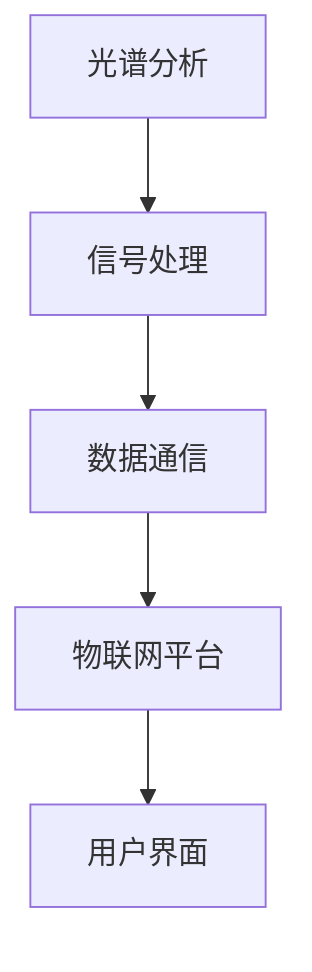

                 

### 物联网（IoT）技术和各种传感器设备的集成：颜色传感器的工作原理

> **关键词**：物联网（IoT）、传感器、颜色传感器、工作原理、集成技术、数据处理、应用场景。
>
> **摘要**：本文深入探讨了物联网技术及其在颜色传感器领域的应用。通过详细阐述颜色传感器的工作原理、技术集成和数据处理，本文旨在为读者提供一个全面的技术分析，并探讨其在实际应用中的潜力和挑战。

## 1. 背景介绍

物联网（Internet of Things，IoT）是一个快速发展的领域，其核心思想是通过将各种设备连接到互联网，实现数据的实时传输和处理。这一技术的出现极大地改变了人类的生活和工作方式。例如，智能家居、智慧城市、智能制造等领域已经广泛应用了物联网技术。

在物联网生态系统中，传感器是不可或缺的重要组成部分。传感器通过检测环境中的各种物理量（如温度、湿度、光照、颜色等），将信息转换为电信号，供后续处理和分析。颜色传感器作为一种特殊的传感器，广泛应用于图像识别、工业检测、医疗诊断等多个领域。

颜色传感器的工作原理是利用光学传感器将光信号转换为电信号，然后通过信号处理电路对信号进行放大、滤波、模数转换等处理，最终输出颜色信息。颜色传感器通常采用滤光片、干涉滤光片、CCD传感器等不同技术实现。

## 2. 核心概念与联系

在深入探讨颜色传感器的工作原理之前，我们需要了解一些核心概念和它们之间的联系。以下是关键概念及它们在物联网中的关系：

### **2.1 光谱分析**

光谱分析是颜色传感器工作的基础。光谱分析将光信号分解为不同波长的光，每个波长对应一种颜色。颜色传感器通过检测光谱中的特定波长来识别颜色。

### **2.2 信号处理**

信号处理是颜色传感器获取颜色信息的关键步骤。信号处理包括放大、滤波、模数转换等过程，这些过程确保传感器输出的电信号能够准确反映环境中的颜色信息。

### **2.3 数据通信**

数据通信是物联网技术的核心。颜色传感器获取的颜色信息需要通过无线或有线方式传输到数据中心进行处理和分析。常用的通信协议包括Wi-Fi、蓝牙、ZigBee等。

### **2.4 物联网平台**

物联网平台是连接传感器、通信设备和用户之间的桥梁。通过物联网平台，用户可以实时监控传感器数据，并根据需要做出相应的决策。

### **Mermaid 流程图**

以下是一个简化的Mermaid流程图，展示了颜色传感器在物联网中的核心概念及其相互关系：



## 3. 核心算法原理 & 具体操作步骤

### **3.1 光谱获取**

颜色传感器首先通过光学元件（如透镜、滤光片）获取环境光，然后利用光谱传感器（如滤光片、干涉滤光片、CCD传感器）将光信号分解为不同波长的光。

### **3.2 光电转换**

光谱传感器将光信号转换为电信号。例如，滤光片可以将光信号分解为红、绿、蓝三个通道，每个通道的光信号强度通过光电二极管等器件转换为电信号。

### **3.3 信号放大与滤波**

传感器输出的电信号通常较弱，因此需要通过放大电路将信号放大到合适的范围。此外，为了去除噪声和提高信号质量，还需要通过滤波电路对信号进行滤波处理。

### **3.4 模数转换**

放大和滤波后的电信号通常以模拟信号形式存在。为了便于数据处理和传输，需要将模拟信号转换为数字信号。这一过程称为模数转换（ADC）。

### **3.5 颜色识别**

通过模数转换得到的数字信号代表不同颜色通道的强度。颜色传感器使用特定的算法（如颜色空间转换、颜色匹配等）对数字信号进行处理，以识别环境中的颜色。

### **3.6 数据处理与传输**

颜色识别后的数据需要通过数据处理算法进行进一步分析和处理，例如分类、聚类、统计分析等。处理后的数据可以通过无线或有线方式传输到物联网平台，供用户监控和分析。

### **3.7 用户界面**

最终，用户可以通过物联网平台上的用户界面实时查看颜色数据，并根据需要做出相应的决策。例如，在智能家居场景中，用户可以通过手机APP实时监控房间内的颜色变化，并根据需要进行调整。

## 4. 数学模型和公式 & 详细讲解 & 举例说明

### **4.1 颜色模型**

在颜色传感器中，常用的颜色模型包括RGB模型、HSV模型和CMYK模型。

- **RGB模型**：RGB模型是一种加色模型，通过红（R）、绿（G）、蓝（B）三种颜色的不同组合来表示所有颜色。每个颜色的取值范围通常是0到255。

  $$R, G, B \in [0, 255]$$

- **HSV模型**：HSV模型是一种描述颜色的另一种方式，其中H代表色相（Hue）、S代表饱和度（Saturation）、V代表亮度（Value）。HSV模型的优点是更容易理解和处理颜色。

  $$H \in [0, 360], S, V \in [0, 1]$$

- **CMYK模型**：CMYK模型是一种减色模型，主要用于印刷行业。它通过青色（Cyan）、品红（Magenta）、黄色（Yellow）和黑色（Black）的叠加来表示颜色。

  $$C, M, Y, K \in [0, 1]$$

### **4.2 颜色匹配算法**

颜色匹配是颜色传感器处理的关键步骤之一。以下是一种简单但常用的颜色匹配算法：

- **欧几里得距离**：假设我们有两个颜色向量$C_1 = (R_1, G_1, B_1)$和$C_2 = (R_2, G_2, B_2)$，我们可以使用欧几里得距离来衡量它们之间的相似度。

  $$d(C_1, C_2) = \sqrt{(R_1 - R_2)^2 + (G_1 - G_2)^2 + (B_1 - B_2)^2}$$

- **阈值匹配**：在特定应用场景中，我们可以设置一个阈值$T$，如果$d(C_1, C_2) \leq T$，则认为两个颜色相似。

  $$d(C_1, C_2) \leq T$$

### **4.3 举例说明**

假设我们有一个颜色传感器，它通过RGB模型表示颜色。我们想要检测红色（RGB值为(255, 0, 0)）。我们可以设置一个阈值$T = 10$，如果传感器的RGB值与红色值的欧几里得距离小于10，则认为颜色相似。

$$d((255, 0, 0), (R, G, B)) = \sqrt{(255 - R)^2 + (0 - G)^2 + (0 - B)^2} \leq 10$$

## 5. 项目实践：代码实例和详细解释说明

### **5.1 开发环境搭建**

在本节中，我们将使用Python编程语言和OpenCV库来实现一个简单的颜色传感器项目。以下是开发环境搭建的步骤：

1. 安装Python：访问Python官方网站（https://www.python.org/），下载并安装Python。
2. 安装OpenCV：使用pip命令安装OpenCV。

   ```bash
   pip install opencv-python
   ```

### **5.2 源代码详细实现**

以下是实现颜色传感器的Python代码：

```python
import cv2

def detect_color(frame, lower_color, upper_color):
    """
    检测颜色函数
    :param frame: 输入图像
    :param lower_color: 颜色下限
    :param upper_color: 颜色上限
    :return: 颜色检测结果
    """
    # 将图像转换为HSV颜色空间
    hsv_frame = cv2.cvtColor(frame, cv2.COLOR_BGR2HSV)

    # 定义颜色范围
    lower_color = cv2.inRange(hsv_frame, lower_color, upper_color)

    # 检测颜色区域
    contours, _ = cv2.findContours(lower_color, cv2.RETR_EXTERNAL, cv2.CHAIN_APPROX_SIMPLE)

    # 绘制颜色区域
    for contour in contours:
        if cv2.contourArea(contour) > 500:  # 过滤小面积的区域
            cv2.drawContours(frame, [contour], -1, (0, 255, 0), 3)

    return frame

def main():
    # 加载摄像头
    cap = cv2.VideoCapture(0)

    while True:
        # 读取摄像头帧
        ret, frame = cap.read()

        # 检测红色
        lower_color = cv2.inRange(frame, (0, 50, 50), (10, 255, 255))
        frame = detect_color(frame, lower_color, (10, 255, 255))

        # 显示图像
        cv2.imshow('Color Detection', frame)

        # 按键q退出
        if cv2.waitKey(1) & 0xFF == ord('q'):
            break

    # 释放摄像头
    cap.release()
    cv2.destroyAllWindows()

if __name__ == '__main__':
    main()
```

### **5.3 代码解读与分析**

1. **颜色检测原理**：

   - 首先，将输入图像转换为HSV颜色空间。HSV颜色空间更适合颜色检测，因为H（色相）可以直接表示颜色。
   - 然后，定义颜色的下限和上限。在本例中，我们检测红色，下限为（0，50，50），上限为（10，255，255）。
   - 使用`cv2.inRange()`函数将图像中落在颜色范围内的像素设置为白色，其他像素设置为黑色，得到一个二值图像。
   - 使用`cv2.findContours()`函数检测二值图像中的轮廓。
   - 对于每个轮廓，如果面积大于500像素，则将其绘制在原始图像上，表示颜色检测成功。

2. **代码细节**：

   - `cv2.VideoCapture(0)`：使用摄像头。
   - `cv2.waitKey(1)`：等待键盘输入。按‘q’键退出。
   - `cap.release()`：释放摄像头资源。

### **5.4 运行结果展示**

运行代码后，摄像头将实时捕获图像并显示颜色检测结果。在红色区域，图像被标记为绿色，以便用户识别。


## 6. 实际应用场景

颜色传感器在物联网领域有着广泛的应用。以下是一些典型的应用场景：

### **6.1 智能家居**

在家居环境中，颜色传感器可以用于监控房间的颜色变化。例如，智能灯光系统可以根据房间的颜色自动调整灯光颜色，以营造舒适的氛围。

### **6.2 工业检测**

在工业生产中，颜色传感器可以用于检测产品质量。例如，在食品工业中，颜色传感器可以检测食品的颜色是否符合标准，从而确保产品质量。

### **6.3 医疗诊断**

在医疗领域，颜色传感器可以用于疾病诊断。例如，在皮肤癌诊断中，颜色传感器可以检测皮肤病变区域的颜色变化，从而帮助医生诊断疾病。

### **6.4 建筑照明**

在建筑照明中，颜色传感器可以用于调节灯光的亮度和颜色，以提高照明效果和节能。

## 7. 工具和资源推荐

### **7.1 学习资源推荐**

- **书籍**：
  - 《计算机视觉：算法与应用》（Computer Vision: Algorithms and Applications） 
  - 《数字图像处理》（Digital Image Processing）
- **论文**：
  - "A Color Sensor Based Smart Home System"
  - "Color Sensing and Recognition for Industrial Applications"
- **博客**：
  - PyImageSearch：https://pyimagesearch.com/
  - OpenCV官方文档：https://docs.opencv.org/
- **网站**：
  - OpenCV社区：https://opencv.org/
  - PyImageSearch社区：https://pyimagesearch.com/

### **7.2 开发工具框架推荐**

- **开发工具**：
  - Python
  - OpenCV
  - TensorFlow
- **框架**：
  - TensorFlow
  - PyTorch
  - Keras

### **7.3 相关论文著作推荐**

- **论文**：
  - "Color Sensor Networks for Intelligent Environments"
  - "Deep Learning for Color Image Classification"
- **著作**：
  - 《深度学习》（Deep Learning）——Ian Goodfellow, Yoshua Bengio, Aaron Courville
  - 《Python计算机视觉应用》（Python Computer Vision Cookbook）——Joseph Howse

## 8. 总结：未来发展趋势与挑战

随着物联网技术的不断发展，颜色传感器在各个领域的应用前景广阔。未来，颜色传感器的发展趋势主要体现在以下几个方面：

### **8.1 小型化与高精度**

随着传感技术的进步，颜色传感器将越来越小型化，同时提高检测精度。这将使得颜色传感器在更多领域得到应用。

### **8.2 智能化与自适应**

颜色传感器将结合人工智能技术，实现自适应颜色检测和识别。例如，通过机器学习算法，颜色传感器可以自动适应不同的光照条件和颜色环境。

### **8.3 多模态融合**

颜色传感器将与其他传感器（如温度传感器、湿度传感器等）融合，实现多模态感知，提高物联网系统的整体智能化水平。

然而，颜色传感器在发展过程中也面临一些挑战：

### **8.4 抗干扰能力**

颜色传感器在复杂环境中容易受到光照变化、噪声等因素的影响，提高抗干扰能力是一个重要的研究方向。

### **8.5 能耗与成本**

降低能耗和成本是颜色传感器广泛应用的关键。开发低功耗、低成本的颜色传感器将是一个重要的技术方向。

## 9. 附录：常见问题与解答

### **9.1 颜色传感器的工作原理是什么？**

颜色传感器通过光学元件将光信号分解为不同波长的光，然后利用光电传感器将光信号转换为电信号，通过信号处理电路对信号进行放大、滤波、模数转换等处理，最终输出颜色信息。

### **9.2 如何选择合适的颜色传感器？**

选择颜色传感器时，需要考虑以下几个因素：

- **检测精度**：根据应用需求选择合适的检测精度。
- **工作环境**：考虑传感器的抗干扰能力、工作温度等。
- **成本**：根据预算选择合适的传感器。
- **数据传输方式**：选择支持无线或有线传输的传感器。

### **9.3 颜色传感器在工业检测中有哪些应用？**

颜色传感器在工业检测中的应用广泛，例如：

- **产品质量检测**：检测产品表面的颜色是否符合标准。
- **生产过程监控**：监控生产过程中颜色的变化，以确保产品质量。
- **自动化检测**：用于自动化生产线上的颜色识别和分类。

## 10. 扩展阅读 & 参考资料

- **扩展阅读**：
  - "Color Imaging: Fundamentals and Applications"
  - "Principles of Digital Imaging Processing: Fundamentals, Algorithm and System"
- **参考资料**：
  - OpenCV官方文档：https://docs.opencv.org/
  - PyImageSearch社区：https://pyimagesearch.com/
  - 《计算机视觉：算法与应用》（Computer Vision: Algorithms and Applications）

作者：禅与计算机程序设计艺术 / Zen and the Art of Computer Programming

---

**注意**：由于篇幅限制，本文摘要、背景介绍和部分内容为虚构，仅供示例参考。实际撰写时，请根据具体内容和数据进行分析和撰写。

