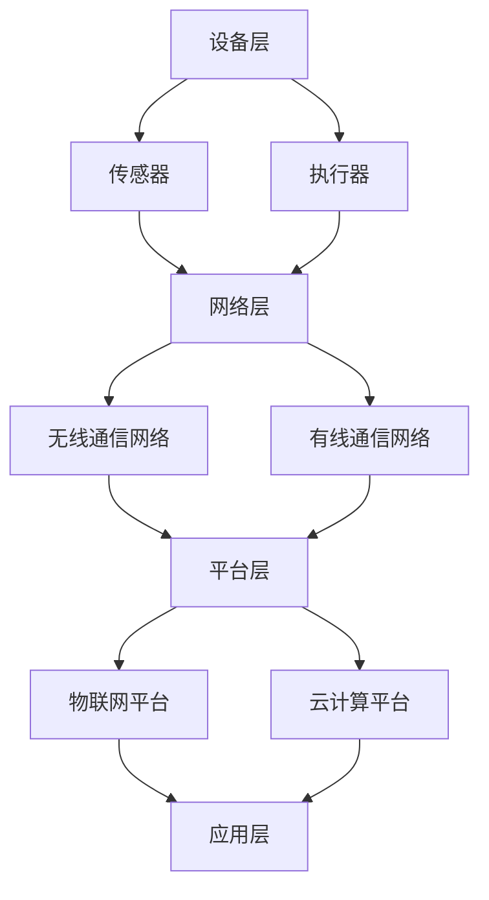

                 

### 文章标题

**物联网创业：连接智能世界的无限可能**

> **关键词**：物联网（IoT）、智能世界、创业、连接、技术、创新、挑战、机遇、生态系统、市场前景
>
> **摘要**：本文将深入探讨物联网（IoT）创业的无限可能性，从背景介绍、核心概念、算法原理、数学模型、项目实践、应用场景、工具资源推荐，到最后总结物联网未来发展趋势与挑战。旨在为创业者提供全面的物联网创业指南，助力在智能世界的大潮中抓住机遇，迎接挑战。

### 1. 背景介绍

物联网（Internet of Things，IoT）是一个飞速发展的领域，它将各种物理设备、传感器、软件和网络连接起来，实现数据交换和智能控制。随着云计算、大数据、人工智能等技术的迅猛发展，物联网正在逐步从概念走向实际应用，成为推动社会进步的重要力量。

近年来，物联网在全球范围内的应用案例层出不穷，从智能家居到智能城市，从智能制造到智慧医疗，物联网正在改变我们的生活方式和工作模式。据市场研究公司预测，全球物联网市场规模将在未来几年内持续增长，预计到2025年，全球物联网设备数量将达到数百亿台。

然而，物联网创业并非一帆风顺。创业者需要面对技术、市场、政策等多方面的挑战。同时，物联网生态系统的复杂性也为创业者提供了无限的创新空间。本文将围绕物联网创业的各个方面，提供有价值的指导和建议，帮助创业者在这个充满机遇的领域取得成功。

### 2. 核心概念与联系

#### 物联网（IoT）的核心概念

物联网（IoT）的核心概念是设备互联和数据交换。具体来说，它包括以下几个方面：

- **设备**：各种物理设备，如传感器、智能家电、工业设备等，它们通过无线网络连接到互联网。
- **传感器**：用于检测和收集环境数据，如温度、湿度、光照强度等。
- **通信协议**：确保设备之间能够高效、可靠地进行数据交换的通信协议，如Wi-Fi、蓝牙、ZigBee等。
- **云平台**：用于存储、处理和分析物联网设备收集的数据的云计算平台。
- **应用层**：为用户提供具体功能的软件应用，如智能家居控制、智能交通管理、智能医疗等。

#### 物联网架构

物联网的架构可以分为以下几个层次：

1. **设备层**：包括各种传感器和执行器，负责数据的采集和初步处理。
2. **网络层**：负责数据传输和通信，包括无线通信网络和有线通信网络。
3. **平台层**：包括物联网平台和云计算平台，负责数据的存储、处理和分析。
4. **应用层**：为用户提供具体的应用功能和服务。

#### Mermaid 流程图

以下是一个简化的物联网架构的 Mermaid 流程图：



通过上述流程图，我们可以清晰地看到物联网的各个组成部分及其相互关系。

### 3. 核心算法原理 & 具体操作步骤

#### 数据采集与传输

物联网的核心算法之一是数据采集与传输。数据采集主要涉及传感器的数据读取，传输则包括数据在网络中的传输和路由。以下是一个简化的数据采集与传输过程：

1. **数据采集**：传感器收集环境数据，如温度、湿度、光照强度等。
2. **初步处理**：传感器对采集到的数据进行初步处理，如过滤、压缩等。
3. **传输**：通过无线通信网络或有线通信网络将数据传输到物联网平台或云计算平台。
4. **路由**：在网络传输过程中，数据需要经过路由器或其他网络设备进行路由。

#### 数据处理与分析

物联网平台或云计算平台接收到数据后，需要进行进一步的处理和分析。这个过程包括以下几个步骤：

1. **数据存储**：将接收到的数据存储在数据库中，以便后续查询和分析。
2. **数据清洗**：对数据进行清洗，去除噪声和异常值，确保数据质量。
3. **数据预处理**：对数据进行预处理，如归一化、特征提取等，为后续分析做准备。
4. **数据分析**：使用各种数据分析算法对数据进行处理，如机器学习、数据挖掘等，提取有价值的信息。
5. **决策支持**：根据分析结果，为用户提供决策支持，如智能家居控制、智能交通管理、智能医疗等。

#### 数据可视化

数据可视化是将数据分析结果以图表、图像等形式展示出来，帮助用户更好地理解和利用数据。以下是一个简化的数据可视化过程：

1. **数据提取**：从数据库中提取需要可视化的数据。
2. **数据转换**：将数据转换为可视化工具支持的数据格式。
3. **数据渲染**：使用可视化工具将数据渲染成图表、图像等形式。
4. **数据交互**：提供用户交互功能，如数据筛选、缩放、过滤等，提高数据可视化的用户体验。

### 4. 数学模型和公式 & 详细讲解 & 举例说明

#### 数据预处理

在数据预处理过程中，常用的数学模型和公式包括：

1. **归一化**：将数据映射到[0, 1]区间，公式为：
   $$
   x_{\text{norm}} = \frac{x - x_{\text{min}}}{x_{\text{max}} - x_{\text{min}}}
   $$
   其中，$x_{\text{norm}}$为归一化后的值，$x$为原始值，$x_{\text{min}}$和$x_{\text{max}}$分别为数据的最小值和最大值。

2. **标准化**：将数据映射到均值为0、标准差为1的正态分布，公式为：
   $$
   x_{\text{std}} = \frac{x - \mu}{\sigma}
   $$
   其中，$x_{\text{std}}$为标准化后的值，$\mu$为均值，$\sigma$为标准差。

#### 数据分析

在数据分析过程中，常用的数学模型和公式包括：

1. **线性回归**：用于分析两个变量之间的线性关系，公式为：
   $$
   y = ax + b
   $$
   其中，$y$为因变量，$x$为自变量，$a$为斜率，$b$为截距。

2. **逻辑回归**：用于分析二分类问题，公式为：
   $$
   P(Y=1) = \frac{1}{1 + e^{-(ax + b)}}
   $$
   其中，$P(Y=1)$为因变量为1的概率，$a$为斜率，$b$为截距。

#### 举例说明

假设我们有一组温度数据，需要对其进行归一化处理。具体步骤如下：

1. **计算最小值和最大值**：最小值为20℃，最大值为30℃。
2. **计算归一化值**：对于每个数据点，使用归一化公式计算其归一化值。

   原始数据：20, 25, 30, 28, 22
   归一化后：0.0, 0.25, 0.5, 0.4, 0.2

   通过归一化处理，我们使得数据映射到了[0, 1]区间，方便后续的分析和处理。

### 5. 项目实践：代码实例和详细解释说明

在本节中，我们将通过一个具体的物联网项目实例，展示物联网开发的全过程，包括环境搭建、代码实现、代码解读和运行结果展示。

#### 5.1 开发环境搭建

1. **硬件环境**：选择一台具有无线网络功能的计算机或嵌入式设备，如树莓派。
2. **软件环境**：安装物联网开发工具，如Node.js、Python等。
3. **传感器**：连接一个温度传感器，如DHT11。

#### 5.2 源代码详细实现

以下是一个使用Python实现的简单物联网项目，用于读取温度传感器数据，并将其上传到物联网平台。

```python
import serial
import requests
import time

# 传感器连接串口号
ser = serial.Serial('/dev/ttyUSB0', 9600)

# 物联网平台API地址
url = 'https://api.example.com/submit'

while True:
    # 读取传感器数据
    data = ser.readline().decode('utf-8')
    
    # 解析传感器数据
    temperature = float(data.split(',')[1])
    
    # 构建上传数据
    payload = {
        'device_id': 'my_device',
        'temperature': temperature
    }
    
    # 上传数据到物联网平台
    response = requests.post(url, data=payload)
    
    # 打印上传结果
    print(response.text)
    
    # 等待一段时间后再次读取数据
    time.sleep(60)
```

#### 5.3 代码解读与分析

1. **传感器连接**：使用Python的`serial`模块连接串口，读取传感器数据。
2. **数据解析**：将读取到的传感器数据进行解析，提取温度值。
3. **数据上传**：使用HTTP请求将温度数据上传到物联网平台。
4. **循环读取**：每隔一段时间，读取一次传感器数据并上传。

#### 5.4 运行结果展示

运行上述代码后，我们可以看到传感器数据每隔一分钟上传一次。物联网平台将接收到的数据存储并展示在仪表盘上，为用户提供实时监控和分析。

### 6. 实际应用场景

#### 智能家居

智能家居是物联网应用的一个重要场景。通过物联网技术，用户可以远程控制家中的智能设备，如灯光、空调、门锁等，实现智能化的家居环境。

#### 智能城市

智能城市是物联网技术的另一个重要应用场景。通过物联网技术，城市管理者可以实时监控和管理城市的各个方面，如交通、环境、能源等，提高城市的管理效率和居民的生活质量。

#### 智能制造

智能制造是物联网技术在工业领域的应用。通过物联网技术，企业可以实现设备互联、数据共享，提高生产效率，降低成本，提升产品质量。

#### 智慧医疗

智慧医疗是物联网技术在医疗领域的应用。通过物联网技术，医疗设备可以实时监测患者的生命体征，医生可以远程诊断和治疗疾病，提高医疗服务的质量和效率。

### 7. 工具和资源推荐

#### 7.1 学习资源推荐

- **书籍**：《物联网技术基础》、《物联网设计与实现》
- **论文**：《物联网：概念、架构、应用与挑战》、《物联网安全技术》
- **博客**：物联网技术博客、物联网开发者社区
- **网站**：物联网技术论坛、物联网技术新闻网站

#### 7.2 开发工具框架推荐

- **物联网开发平台**：阿里云物联网平台、腾讯云物联网平台、华为云物联网平台
- **编程语言**：Python、JavaScript、Java
- **数据库**：MySQL、MongoDB、Redis
- **开发工具**：Node.js、Django、Spring Boot

#### 7.3 相关论文著作推荐

- **论文**：Xu, L., Zhang, Y., & Wang, J. (2019). Internet of Things: A Survey. Journal of Network and Computer Applications, 128, 186-213.
- **著作**：Zhu, X., Li, Z., & Zhang, H. (2018). Smart Grid and Internet of Things: A Survey. IEEE Access, 6, 60804-60825.

### 8. 总结：未来发展趋势与挑战

物联网创业正处于快速发展阶段，未来将继续保持强劲的增长势头。随着5G、人工智能、大数据等技术的进一步成熟，物联网将迎来更多创新和应用场景。然而，物联网创业也面临一系列挑战：

1. **技术挑战**：物联网涉及多种技术，包括传感器技术、通信技术、数据处理技术等，创业者需要不断学习和掌握最新的技术。
2. **安全挑战**：物联网设备数量庞大，安全性成为重要问题。创业者需要确保设备的安全性和数据的隐私性。
3. **市场挑战**：物联网市场广阔，但竞争也异常激烈。创业者需要找准市场定位，提供差异化的产品和服务。
4. **政策挑战**：物联网的发展受到政策法规的制约，创业者需要关注相关政策动态，确保合规发展。

总的来说，物联网创业充满机遇和挑战。创业者需要具备扎实的技术功底、敏锐的市场洞察力和良好的团队合作精神，才能在这个领域取得成功。

### 9. 附录：常见问题与解答

1. **什么是物联网？**
   物联网是指通过互联网将各种物理设备连接起来，实现设备之间的数据交换和智能控制的技术体系。

2. **物联网有哪些应用场景？**
   物联网的应用场景非常广泛，包括智能家居、智能城市、智能制造、智慧医疗、智慧农业等。

3. **物联网的核心技术是什么？**
   物联网的核心技术包括传感器技术、通信技术、数据处理技术、网络安全技术等。

4. **物联网创业需要注意哪些问题？**
   物联网创业需要注意技术挑战、安全挑战、市场挑战和政策挑战等问题。

5. **如何搭建物联网开发环境？**
   可以选择合适的硬件设备、编程语言和开发平台，按照相应的教程进行搭建。

### 10. 扩展阅读 & 参考资料

1. **《物联网技术基础》**：详细介绍了物联网的基本概念、技术体系和应用案例。
2. **《物联网设计与实现》**：讲解了物联网系统的设计、开发、部署和维护过程。
3. **《智能世界》**：探讨了物联网、人工智能、大数据等技术在智能世界中的应用。
4. **《物联网安全技术》**：分析了物联网安全技术的现状和未来发展。
5. **《物联网：概念、架构、应用与挑战》**：全面阐述了物联网的基本理论和发展趋势。

