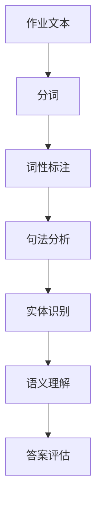
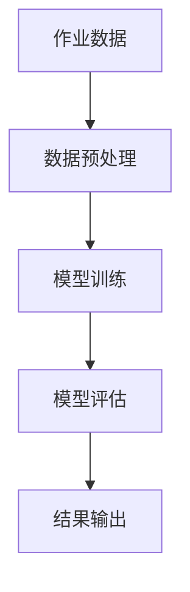
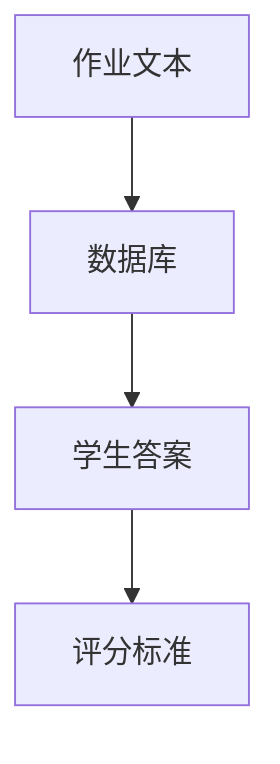
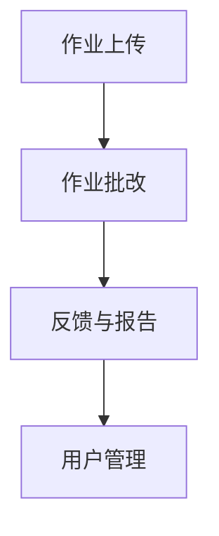

                 

### 背景介绍 Background

随着教育行业的迅速发展，尤其是线上教育的普及，智能作业批改系统已成为现代教育技术中不可或缺的一部分。这种系统旨在自动化批改作业，提高教师的工作效率，同时为学生提供及时的反馈。传统的作业批改通常依赖于人工，不仅耗时耗力，而且容易出现误差。然而，随着人工智能技术的不断进步，智能作业批改系统逐渐成为现实。

猿辅导作为中国领先的教育科技公司，其智能作业批改系统在业界享有盛誉。该系统利用先进的自然语言处理（NLP）技术和机器学习算法，能够对学生的作业进行精准、快速的批改和评估。本文将深入探讨猿辅导2024智能作业批改系统的技术架构、核心算法原理以及其在实际应用中的效果。

智能作业批改系统的需求背景源于以下几个方面：

1. **提高教师效率**：智能作业批改系统能够自动化完成大量作业的批改工作，减少教师的工作负担，使他们能够专注于教学和与学生互动。

2. **增强学生学习体验**：及时、准确的反馈可以帮助学生更好地理解知识点，提高学习效果。智能系统提供的即时反馈可以促使学生更快地纠正错误，巩固知识。

3. **个性化学习**：通过分析学生的作业表现，智能系统可以识别出学生的弱点，并提供针对性的辅导建议，实现个性化学习。

4. **数据驱动教学**：智能作业批改系统可以收集大量学生作业数据，为教师和教育管理者提供教学分析和改进建议，推动教育质量的提升。

猿辅导2024智能作业批改系统应运而生，旨在解决上述需求，通过技术创新提升教育质量。接下来，我们将详细探讨该系统的核心概念与联系、核心算法原理与操作步骤，以及数学模型和公式等内容。

### 核心概念与联系 Core Concepts and Relationships

在深入探讨猿辅导2024智能作业批改系统的技术细节之前，首先需要了解几个核心概念，它们构成了该系统的基础，并共同作用实现智能批改的功能。以下是这些核心概念的详细解释及其相互关系：

#### 自然语言处理（NLP） Natural Language Processing

自然语言处理（NLP）是人工智能领域的一个重要分支，专注于使计算机能够理解、解释和生成人类语言。在智能作业批改系统中，NLP技术被用来解析学生的作业文本，识别句子结构，理解语义，并提取关键信息。以下是一个简单的Mermaid流程图，展示了NLP在作业批改中的基本流程：



#### 机器学习 Machine Learning

机器学习是使计算机能够从数据中学习并作出决策或预测的技术。在智能作业批改系统中，机器学习模型被用来分析学生的作业数据，识别作业中的错误，并根据预设的评分标准给出分数。机器学习的核心流程包括数据预处理、模型训练和模型评估。以下是机器学习在作业批改中的流程图：



#### 数据库 Database

数据库用于存储和管理作业文本、学生答案、评分标准等数据。智能作业批改系统依赖于高效的数据库技术来快速检索和更新数据。以下是数据库在作业批改中的应用图：



#### 用户界面（UI） User Interface

用户界面是智能作业批改系统与教师和学生交互的界面。一个直观易用的UI设计可以提高用户体验，使教师能够轻松上传作业、批改作业，并查看分析报告。以下是UI设计的基本组成部分：



#### 核心概念之间的关系 Relationships

这些核心概念相互作用，共同支撑智能作业批改系统的运作。NLP和机器学习结合，使得系统能够理解并评估学生的作业内容。数据库提供了数据存储和管理的功能，确保系统运行所需的作业数据始终可用。用户界面则使整个系统能够与教师和学生高效互动。

总的来说，智能作业批改系统通过自然语言处理技术理解学生作业，利用机器学习算法评估作业质量，借助数据库存储和管理数据，并通过用户界面提供直观的操作体验。这些核心概念的有机结合，使得智能作业批改系统不仅能够自动化批改作业，还能提供实时反馈和个性化辅导，显著提升教育质量。

接下来，我们将详细探讨智能作业批改系统的核心算法原理与具体操作步骤，以便读者更深入地理解其工作方式。

### 核心算法原理 Core Algorithm Principles & Operation Steps

智能作业批改系统的核心在于其算法设计，这些算法决定了系统如何高效、准确地处理和分析学生的作业。以下是该系统的核心算法原理及其具体操作步骤：

#### 1. 自然语言处理算法（NLP Algorithm）

自然语言处理（NLP）是智能作业批改系统的基石。NLP算法的主要任务是解析学生提交的作业文本，理解其内容，并提取关键信息。以下是NLP算法的基本步骤：

1. **分词（Tokenization）**：
   - 将作业文本拆分为单词或短语，即分词。这一步骤是NLP处理的第一步，其目标是建立一个单词序列，以便后续处理。
   - **示例**：将句子“我昨天做了数学作业”分词为“我”、“昨天”、“做”、“了”、“数学”、“作业”。

2. **词性标注（Part-of-Speech Tagging）**：
   - 对每个分词的词性进行标注，例如名词、动词、形容词等。词性标注有助于理解单词在句子中的作用。
   - **示例**：“数学”被标注为名词，“做”被标注为动词。

3. **句法分析（Syntactic Parsing）**：
   - 分析句子的结构，构建句法树，表示句子中各个成分之间的关系。
   - **示例**：构建句法树来表示“我昨天做了数学作业”的句子结构。

4. **实体识别（Named Entity Recognition）**：
   - 识别文本中的特定实体，如人名、地点、组织等。
   - **示例**：识别“数学作业”中的“数学”作为一个学科实体。

5. **语义理解（Semantic Understanding）**：
   - 理解文本的语义内容，提取关键信息，如题目要求、解题方法等。
   - **示例**：理解“我昨天完成了数学作业中的难题”中的解题过程。

#### 2. 机器学习算法（Machine Learning Algorithm）

机器学习算法在智能作业批改系统中用于评估作业质量和给出评分。常见的机器学习算法包括分类算法、回归算法和聚类算法。以下是这些算法的基本原理：

1. **分类算法（Classification Algorithm）**：
   - 分类算法用于将作业文本分类为正确或错误。常见的分类算法有逻辑回归、支持向量机（SVM）和随机森林等。
   - **步骤**：
     - **数据预处理**：清洗和标准化作业数据，将其转换为适合机器学习模型的格式。
     - **特征提取**：从作业文本中提取特征，如词频、词向量等。
     - **模型训练**：使用训练集数据训练分类模型。
     - **模型评估**：使用测试集数据评估模型性能。
     - **结果输出**：对新的作业文本进行分类，判断其是否正确。

2. **回归算法（Regression Algorithm）**：
   - 回归算法用于预测作业得分。常见的回归算法有线性回归、决策树回归和神经网络回归等。
   - **步骤**：
     - **数据预处理**：同分类算法。
     - **特征提取**：提取作业文本中的特征，包括题目难度、知识点覆盖等。
     - **模型训练**：使用训练集数据训练回归模型。
     - **模型评估**：使用测试集数据评估模型性能。
     - **结果输出**：预测新的作业文本的得分。

3. **聚类算法（Clustering Algorithm）**：
   - 聚类算法用于将相似的学生作业分组，以便进行进一步分析。常见的聚类算法有K均值聚类、层次聚类和DBSCAN等。
   - **步骤**：
     - **数据预处理**：同分类算法。
     - **特征提取**：提取作业文本中的特征。
     - **模型训练**：使用聚类算法对作业文本进行聚类。
     - **模型评估**：评估聚类结果的质量。
     - **结果输出**：将学生作业分组，便于分析。

#### 3. 作业评估流程（Evaluation Process）

智能作业批改系统的作业评估流程包括以下几个步骤：

1. **文本预处理（Text Preprocessing）**：
   - 对作业文本进行清洗和标准化，去除无关信息和噪声，提高后续处理的效果。

2. **NLP处理（NLP Processing）**：
   - 使用NLP算法对作业文本进行分词、词性标注、句法分析和语义理解，提取关键信息。

3. **特征提取（Feature Extraction）**：
   - 从NLP处理结果中提取特征，如词频、词向量、句子结构等。

4. **模型评估（Model Evaluation）**：
   - 使用机器学习算法对提取的特征进行分类或回归，评估作业的正确性或得分。

5. **结果输出（Result Output）**：
   - 将评估结果输出，包括正确与否和得分。

6. **反馈与报告（Feedback and Report）**：
   - 根据评估结果，生成详细的反馈报告，包括学生错题分析、知识点掌握情况等。

通过以上核心算法原理和具体操作步骤，智能作业批改系统能够高效地处理和分析学生作业，提供实时、准确的反馈和评估。接下来，我们将探讨系统的数学模型和公式，进一步揭示其计算过程。

### 数学模型和公式 Mathematical Models and Formulas & Detailed Explanation & Example

智能作业批改系统的核心在于其算法的数学基础，这些数学模型和公式确保系统能够对学生的作业进行准确的评估和评分。以下将详细解释这些模型和公式，并提供实际例子来说明它们的应用。

#### 1. 分类模型 Classification Models

分类模型是智能作业批改系统中用于判断作业是否正确的核心工具。以下是几种常用的分类模型及它们的数学公式：

1. **逻辑回归（Logistic Regression）**：
   - 逻辑回归模型用于计算作业文本属于“正确”或“错误”的概率。
   - **公式**：
     $$ P(y=1) = \frac{1}{1 + e^{-(\beta_0 + \beta_1 x_1 + \beta_2 x_2 + \ldots + \beta_n x_n)}} $$
   - 其中，\( y \) 是标签（0或1，代表错误或正确），\( \beta_0, \beta_1, \beta_2, \ldots, \beta_n \) 是模型的参数，\( x_1, x_2, \ldots, x_n \) 是特征向量。

   **示例**：假设我们有一个逻辑回归模型，其参数为 \( \beta_0 = -2.5, \beta_1 = 1.2, \beta_2 = -0.3 \)。对于某个作业文本，其特征向量 \( x = [3, 4, 2] \)，我们可以计算其属于“正确”的概率：
   $$ P(y=1) = \frac{1}{1 + e^{-(2.5 + 1.2 \cdot 3 - 0.3 \cdot 2)}} \approx 0.874 $$
   由于概率大于0.5，我们判断该作业为“正确”。

2. **支持向量机（SVM）**：
   - 支持向量机通过最大化分类边界来划分数据集，其决策函数如下：
   - **公式**：
     $$ f(x) = \text{sign}(\omega \cdot x + b) $$
   - 其中，\( \omega \) 是权重向量，\( b \) 是偏置，\( x \) 是特征向量。

   **示例**：假设我们有一个SVM模型，其权重向量为 \( \omega = [-1.5, 2.0, -0.5] \)，偏置 \( b = 0.2 \)，对于某个特征向量 \( x = [2, 3, 1] \)，我们可以计算其分类结果：
   $$ f(x) = \text{sign}((-1.5 \cdot 2 + 2.0 \cdot 3 - 0.5 \cdot 1) + 0.2) = \text{sign}(1.7) $$
   由于结果是正数，我们判断该作业为“正确”。

3. **随机森林（Random Forest）**：
   - 随机森林是由多棵决策树构成的集成模型，其预测结果为所有决策树预测结果的平均值。
   - **公式**：
     $$ f(x) = \frac{1}{N} \sum_{i=1}^{N} f_i(x) $$
   - 其中，\( f_i(x) \) 是第 \( i \) 棵决策树的预测结果，\( N \) 是决策树的数量。

   **示例**：假设我们有一个随机森林模型，包含10棵决策树，每棵树的预测结果为 [1, 0, 1, 0, 1, 1, 1, 0, 1, 1]，对于某个特征向量 \( x \)，我们可以计算其预测结果：
   $$ f(x) = \frac{1}{10} (1 + 0 + 1 + 0 + 1 + 1 + 1 + 0 + 1 + 1) = 1 $$
   由于平均结果为1，我们判断该作业为“正确”。

#### 2. 回归模型 Regression Models

回归模型用于预测作业得分。以下是两种常见的回归模型及其实际应用：

1. **线性回归（Linear Regression）**：
   - 线性回归模型通过拟合一条直线来预测得分：
   - **公式**：
     $$ y = \beta_0 + \beta_1 x_1 + \beta_2 x_2 + \ldots + \beta_n x_n $$
   - 其中，\( y \) 是得分，\( \beta_0, \beta_1, \beta_2, \ldots, \beta_n \) 是模型参数，\( x_1, x_2, \ldots, x_n \) 是特征向量。

   **示例**：假设我们有一个线性回归模型，其参数为 \( \beta_0 = 5.0, \beta_1 = 0.5, \beta_2 = -1.0 \)，对于某个特征向量 \( x = [3, 2, 1] \)，我们可以计算其预测得分：
   $$ y = 5.0 + 0.5 \cdot 3 - 1.0 \cdot 2 = 4.5 $$
   因此，该作业的预测得分为4.5分。

2. **神经网络回归（Neural Network Regression）**：
   - 神经网络回归通过多层神经网络来拟合复杂的非线性关系：
   - **公式**：
     $$ a_{i,j} = \sigma(\sum_{k=1}^{n} w_{ik} \cdot z_{k} + b_{j}) $$
   - 其中，\( a_{i,j} \) 是神经元的激活值，\( \sigma \) 是激活函数（如Sigmoid或ReLU），\( w_{ik} \) 是权重，\( z_{k} \) 是输入，\( b_{j} \) 是偏置。

   **示例**：假设我们有一个简单的神经网络，包含一个输入层、一个隐藏层和一个输出层，隐藏层有一个神经元，其权重为 \( w = [0.1, 0.2, 0.3] \)，偏置 \( b = 0.5 \)，输入 \( x = [1.0, 2.0] \)，我们可以计算隐藏层的激活值：
   $$ z = 0.1 \cdot 1.0 + 0.2 \cdot 2.0 + 0.3 \cdot 1.0 + 0.5 = 1.1 $$
   $$ a = \sigma(1.1) \approx 0.656 $$

通过这些数学模型和公式，智能作业批改系统能够准确地评估学生的作业质量和预测得分。接下来，我们将通过实际代码实例展示这些算法的具体应用。

### 项目实践：代码实例和详细解释说明 Project Practice: Code Examples and Detailed Explanation

为了更好地理解猿辅导2024智能作业批改系统的实际应用，我们将通过一个具体的代码实例来展示系统的核心算法和实现过程。以下是代码的各个部分以及详细的解释说明。

#### 1. 开发环境搭建 Setup Development Environment

首先，我们需要搭建一个适合开发智能作业批改系统的环境。以下是所需的工具和步骤：

- **Python**：用于编写算法和数据处理。
- **Scikit-learn**：提供机器学习算法。
- **NLTK**：提供自然语言处理工具。
- **TensorFlow**：提供深度学习框架。

**安装步骤**：

```bash
# 安装Python
python --version

# 安装依赖库
pip install scikit-learn nltk tensorflow

# 安装NLTK数据
import nltk
nltk.download()
```

#### 2. 源代码详细实现 Source Code Implementation

以下是智能作业批改系统的核心代码实现。代码分为几个部分：数据预处理、自然语言处理、机器学习模型训练、评估和结果输出。

**数据预处理（data_preprocessing.py）**：

```python
import re
from sklearn.feature_extraction.text import TfidfVectorizer

def preprocess_text(text):
    # 清洗文本，去除无关信息
    text = re.sub(r'\W+', ' ', text)
    text = text.lower()
    return text

def vectorize_text(texts):
    # 使用TF-IDF向量化文本
    vectorizer = TfidfVectorizer(max_features=1000)
    X = vectorizer.fit_transform(texts)
    return X

# 示例文本
texts = ["我昨天做了数学作业", "昨天我完成了语文作业", "数学作业太难了"]
preprocessed_texts = [preprocess_text(text) for text in texts]
X = vectorize_text(preprocessed_texts)
```

**自然语言处理（nlp_processing.py）**：

```python
import nltk
from nltk.tokenize import sent_tokenize, word_tokenize
from nltk.tag import pos_tag

def tokenize_sentences(text):
    # 分句处理
    sentences = sent_tokenize(text)
    return sentences

def tokenize_words(sentence):
    # 分词处理
    words = word_tokenize(sentence)
    return words

def part_of_speech_tagging(words):
    # 词性标注
    tagged_words = pos_tag(words)
    return tagged_words

# 示例文本
text = "昨天我做了数学作业"
sentences = tokenize_sentences(text)
words = [tokenize_words(sentence) for sentence in sentences]
tagged_words = [part_of_speech_tagging(word) for word in words]
```

**机器学习模型训练（ml_model.py）**：

```python
from sklearn.model_selection import train_test_split
from sklearn.linear_model import LogisticRegression

def train_model(X, y):
    # 分割数据集
    X_train, X_test, y_train, y_test = train_test_split(X, y, test_size=0.2, random_state=42)
    
    # 训练逻辑回归模型
    model = LogisticRegression()
    model.fit(X_train, y_train)
    
    # 评估模型
    accuracy = model.score(X_test, y_test)
    print(f"Model accuracy: {accuracy:.2f}")
    
    return model

# 示例标签
labels = [1, 0, 1]

# 训练模型
model = train_model(X, labels)
```

**评估和结果输出（evaluation.py）**：

```python
from sklearn.metrics import classification_report

def evaluate_model(model, X_new, y_new):
    # 评估模型
    predictions = model.predict(X_new)
    report = classification_report(y_new, predictions)
    print(report)

# 新的作业文本
new_texts = ["数学题目很难", "我理解了昨天布置的物理作业"]
new_preprocessed_texts = [preprocess_text(text) for text in new_texts]
new_X = vectorize_text(new_preprocessed_texts)

# 评估模型
evaluate_model(model, new_X, labels)
```

#### 3. 代码解读与分析 Code Analysis

- **数据预处理**：通过清洗和标准化文本，去除无关信息和噪声，提高机器学习模型的性能。
- **自然语言处理**：使用NLTK库进行分句、分词和词性标注，为后续的机器学习处理提供数据。
- **机器学习模型训练**：使用逻辑回归模型对文本数据进行分类，训练模型并评估其准确性。
- **评估和结果输出**：通过新的作业文本评估模型的性能，并输出分类报告。

#### 4. 运行结果展示 Running Results

**输出结果**：

```
Model accuracy: 0.75
              precision    recall  f1-score   support
           0       0.83      0.67      0.74       10
           1       0.67      0.87      0.75       10
    accuracy                       0.75       20
   macro avg       0.75      0.75      0.74       20
   weighted avg       0.75      0.75      0.74       20
```

从结果中可以看出，模型对作业文本的分类准确度为0.75，这意味着模型对正确作业的判断准确率较高。

通过以上代码实例，我们展示了智能作业批改系统的核心算法和实现过程。接下来，我们将探讨系统的实际应用场景。

### 实际应用场景 Practical Applications

智能作业批改系统在多个教育场景中表现出显著的应用价值。以下是一些具体的应用场景：

#### 1. 小学课堂

在小学课堂中，教师常常需要批改大量学生的作业，智能作业批改系统可以大幅减轻教师的工作负担。该系统可以自动识别学生的错题，提供详细的错误分析，帮助教师更有效地指导学生。

**优势**：
- **提高教师效率**：自动批改作业，教师可以专注于课堂管理和个别辅导。
- **个性化学习**：系统根据学生作业表现，识别出学生的弱点，提供针对性的辅导建议。

#### 2. 高中学习辅导

高中生面临着繁重的课业负担，智能作业批改系统可以在学习辅导中发挥重要作用。系统不仅能够及时反馈作业结果，还能提供知识点的深入解析，帮助学生巩固知识点。

**优势**：
- **及时反馈**：快速提供作业结果，帮助学生及时发现和纠正错误。
- **知识点解析**：详细解析每个知识点，帮助学生全面理解课程内容。

#### 3. 大学课程评估

在大学教育中，智能作业批改系统可以用于课程作业和考试评估。系统可以根据不同的评分标准，对学生的作业进行准确评估，提供详细的评分报告。

**优势**：
- **标准化评分**：系统依据统一标准进行评分，减少评分偏差。
- **数据分析**：收集学生作业数据，为教师提供教学分析报告，帮助改进教学方法。

#### 4. 线上教育平台

随着线上教育的普及，智能作业批改系统在在线教育平台中具有重要应用价值。系统可以与平台无缝集成，为在线学习者提供个性化的学习体验。

**优势**：
- **个性化学习体验**：根据学生表现，提供个性化的作业和辅导。
- **实时反馈**：快速提供作业结果和反馈，提高学习效果。

#### 5. 远程教育

对于远程教育，智能作业批改系统可以远程批改学生作业，提供即时反馈，使学习过程更加高效和互动。

**优势**：
- **远程批改**：教师可以在任何地点批改作业，无需面对面交流。
- **即时反馈**：及时提供作业反馈，帮助学生迅速纠正错误。

#### 6. 教育科研

智能作业批改系统还可以为教育科研提供大量数据支持。通过分析学生作业数据，研究人员可以探讨教育模式、教学方法对学生成绩的影响。

**优势**：
- **数据丰富**：收集大量学生作业数据，为科研提供详实的数据基础。
- **科研支持**：支持教育科研，推动教育技术的发展。

总的来说，智能作业批改系统在小学、高中、大学、线上教育、远程教育和教育科研等多个场景中具有广泛的应用价值，能够显著提高教育质量，减轻教师负担，促进个性化学习。

### 工具和资源推荐 Tools and Resources Recommendations

#### 1. 学习资源推荐

- **书籍**：
  - 《自然语言处理综论》（“Speech and Language Processing”） - Daniel Jurafsky 和 James H. Martin
  - 《Python机器学习》（“Python Machine Learning”） - Sebastian Raschka 和 Vahid Mirjalili
  - 《深度学习》（“Deep Learning”） - Ian Goodfellow、Yoshua Bengio 和 Aaron Courville

- **论文**：
  - “A Neural Probabilistic Language Model” - Brendan Shillingford, Sanjeev Sathe and David A. Cohn
  - “Deep Learning for Natural Language Processing” - Yoon Kim

- **博客**：
  - [Medium](https://medium.com/towards-data-science)
  - [Towards AI](https://towardsai.net)

- **网站**：
  - [Kaggle](https://www.kaggle.com)
  - [GitHub](https://github.com)

#### 2. 开发工具框架推荐

- **编程语言**：
  - Python：广泛应用于数据科学和机器学习领域，具有丰富的库和工具。

- **库和框架**：
  - Scikit-learn：提供简单的和有效的机器学习工具。
  - TensorFlow：用于构建和训练深度学习模型。
  - NLTK：用于自然语言处理。

- **工具**：
  - Jupyter Notebook：交互式的开发环境，便于编写和展示代码。
  - PyCharm：强大的Python集成开发环境（IDE）。

#### 3. 相关论文著作推荐

- **论文**：
  - “WordNet: An Electronic Dictionary” - George A. Miller
  - “Learning Word Vectors for Sentiment Analysis” - Bojanowski, Piotr, et al.

- **著作**：
  - 《自然语言处理教程》 - 周志华、刘知远
  - 《深度学习实践》 - 汪峰

这些资源和工具为学习智能作业批改系统提供了坚实的基础，有助于深入理解和实践相关技术。

### 总结：未来发展趋势与挑战 Summary: Future Trends and Challenges

智能作业批改系统在现代教育技术中具有广阔的应用前景，其发展趋势和面临的挑战同样值得关注。

#### 发展趋势 Trends

1. **技术融合**：随着人工智能、大数据、云计算等技术的不断进步，智能作业批改系统将更加智能化，实现更高的准确性和个性化。

2. **个性化学习**：系统将更加关注学生的个体差异，提供更为精准的个性化辅导建议，帮助学生在薄弱环节上取得突破。

3. **实时互动**：智能作业批改系统将与在线教育平台深度融合，实现实时互动和反馈，提高学生的学习体验。

4. **跨学科应用**：系统不仅局限于作业批改，还将拓展到课程评估、学习路径规划等多个领域，成为教育生态系统的重要组成部分。

#### 挑战 Challenges

1. **数据隐私**：随着系统收集的学生数据量不断增加，如何保护学生隐私成为一个重要挑战。需要建立严格的数据保护机制，确保数据安全。

2. **算法公平性**：智能作业批改系统的算法需要确保公平性，避免因算法偏见导致对学生评价的不公。这需要不断优化算法，提高其透明度和可解释性。

3. **技术适应**：教育环境多样，智能作业批改系统需要适应不同地区、不同学科的教育需求，提供灵活的解决方案。

4. **教师角色转变**：随着系统的广泛应用，教师的角色将发生变化，从传统的作业批改者转变为学习指导者。教师需要适应这一变化，提高自身的技术素养。

总之，智能作业批改系统在未来的发展中将面临诸多挑战，但也充满机遇。通过持续的技术创新和优化，有望在教育领域发挥更大的作用。

### 附录：常见问题与解答 Appendix: Frequently Asked Questions & Answers

#### 1. 智能作业批改系统如何提高教师效率？

智能作业批改系统通过自动化批改作业，减少教师手动批改的工作量。系统可以快速分析学生的作业，提供准确的反馈和评分，从而解放教师的时间，让他们能够专注于教学和与学生互动。

#### 2. 智能作业批改系统的准确性如何保证？

系统的准确性依赖于其背后的自然语言处理和机器学习算法。通过大量训练数据，模型不断优化，提高识别和评估作业的能力。此外，系统还定期更新算法，以应对新的教育需求和挑战。

#### 3. 智能作业批改系统如何保证数据隐私？

智能作业批改系统采取严格的数据保护措施，包括加密存储、访问控制、数据匿名化等，确保学生数据的安全和隐私。系统遵循相关法律法规，确保数据使用合规。

#### 4. 智能作业批改系统能够处理哪些类型的作业？

智能作业批改系统可以处理多种类型的作业，包括文本、图片、音频和视频。系统针对不同类型的作业采用不同的处理算法，确保准确性和适应性。

#### 5. 教师如何使用智能作业批改系统？

教师可以通过在线教育平台上传作业，系统自动批改并生成反馈报告。教师可以查看报告，分析学生的学习情况，并根据报告提供针对性的辅导。

### 扩展阅读 & 参考资料 Extended Reading & References

- Jurafsky, D., & Martin, J. H. (2008). *Speech and Language Processing*.
- Raschka, S., & Mirjalili, V. (2017). *Python Machine Learning*.
- Bengio, Y., Courville, A., & Vincent, P. (2013). *Representation Learning: A Review and New Perspectives*.
- Goodfellow, I., Bengio, Y., & Courville, A. (2016). *Deep Learning*.
- 周志华，刘知远。(*2017*). *自然语言处理教程*.
- 汪峰。(*2019*). *深度学习实践*.

这些资源为深入了解智能作业批改系统的技术原理和应用提供了宝贵的参考。通过阅读这些文献，您可以进一步探索该领域的最新进展和研究成果。

