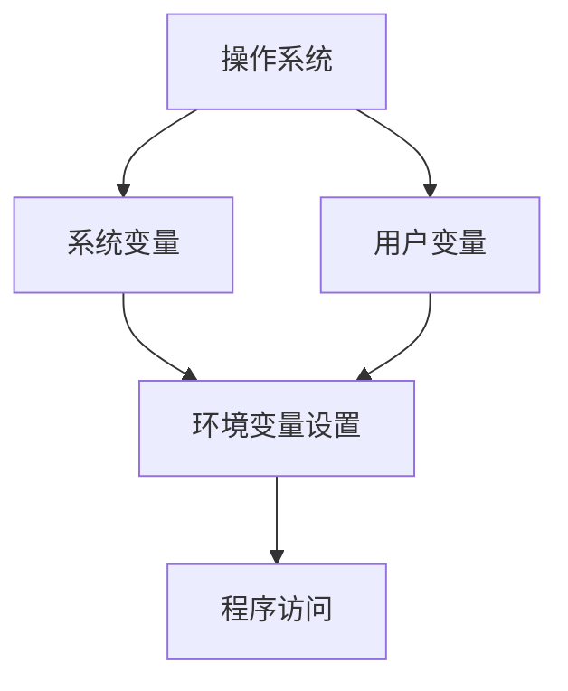

                 

### 文章标题

### 环境与环境变量

**关键词**：环境（Environment），环境变量（Environment Variables），编程，系统，配置，管理

**摘要**：
本文将深入探讨环境（Environment）和环境变量（Environment Variables）的概念、作用以及在实际编程中的应用。我们将从基础概念入手，逐步分析环境变量在不同操作系统和编程语言中的表现，详细讨论其在开发、测试和生产环境中的重要性。通过实际案例分析，我们将展示如何有效地管理和配置环境变量，从而提高软件开发效率。

## 1. 背景介绍

在计算机科学中，环境（Environment）是一个广泛的概念，通常指的是程序执行时所处的上下文。这包括操作系统、网络状态、用户权限以及硬件资源等。环境变量（Environment Variables）则是环境中的一个重要组成部分，它们是用于传递和存储系统或应用程序配置信息的键值对。理解环境变量对于开发人员来说至关重要，因为它们直接影响程序的运行行为。

环境变量的重要性体现在多个方面。首先，它们提供了动态配置应用程序的能力，使得开发人员无需在每次部署时修改源代码。其次，环境变量有助于隔离不同环境之间的配置，从而避免在开发、测试和 生产环境中出现配置冲突。此外，环境变量还使得自动化部署和持续集成变得更加容易，因为它们可以轻松传递给不同的构建和部署工具。

随着云计算和分布式系统的兴起，环境变量在软件架构中的地位更加凸显。在现代软件开发中，通常需要同时维护多个环境（如开发环境、测试环境、预生产和生产环境），每个环境都有其特定的配置需求。环境变量提供了一个灵活且可扩展的机制，使得开发人员可以轻松地在不同环境中切换和调整配置。

## 2. 核心概念与联系

### 环境变量定义

环境变量是一组键值对，其中键为变量名，值为变量值。这些变量可以在操作系统的shell环境中设置，并且在程序执行时可以被访问。例如，在Windows系统中，用户可以通过“系统属性”中的“高级”选项卡设置环境变量；而在Linux和macOS系统中，则可以使用`export`命令来设置。

### 环境变量类型

环境变量可以分为系统变量和用户变量。

- **系统变量**：在所有用户和程序中都可以访问的变量，通常由操作系统提供。例如，`PATH`变量包含了用于查找可执行文件的目录列表。
- **用户变量**：仅对当前用户可见的变量，由用户自己设置。例如，`HOME`变量指向用户的主目录。

### 环境变量在编程中的应用

在编程中，环境变量常用于存储配置信息、敏感数据（如密码和密钥）和自定义设置。以下是一些具体的例子：

- **配置信息**：应用程序可以通过环境变量读取配置信息，如数据库连接字符串、API密钥等。
- **敏感数据**：通过环境变量存储敏感数据，可以避免硬编码这些信息到源代码中，从而提高安全性。
- **自定义设置**：开发人员可以使用环境变量来自定义应用程序的行为，如设置日志级别、开启或关闭特定功能等。

### 环境变量在操作系统中的表现

#### Windows系统

在Windows系统中，环境变量可以在“系统属性”中的“高级”选项卡中进行设置。用户变量和系统变量都存储在`uservar`和`systemvar`目录下，可以通过`Setx`命令永久设置变量，或通过`Set`命令在当前会话中设置变量。

#### Linux和macOS系统

在Linux和macOS系统中，环境变量通常存储在`/etc/environment`文件中（系统变量）和用户的`~/.bashrc`或`~/.zshrc`文件中（用户变量）。用户可以通过`export`命令设置环境变量，使其在当前会话中生效。

### 环境变量与编程语言

不同编程语言提供了访问和操作环境变量的方式。例如：

- **Python**：使用`os.environ`字典访问环境变量。
- **Java**：通过`System.getenv()`方法访问环境变量。
- **Node.js**：使用`process.env`对象访问环境变量。

### Mermaid 流程图



### 2.1. 系统变量与用户变量关系

在大多数操作系统中，系统变量和用户变量之间存在层次关系。系统变量通常是全局的，对所有用户和程序可见，而用户变量仅对当前用户可见。

### 2.2. 环境变量与配置管理

环境变量在配置管理中扮演着重要角色。通过将配置信息存储在环境变量中，可以实现以下目标：

- **动态配置**：无需修改代码即可切换配置。
- **配置隔离**：不同环境（开发、测试、生产）之间配置相互独立。
- **安全性**：敏感数据不硬编码在代码中，从而提高安全性。

### 2.3. 环境变量与自动化部署

在自动化部署中，环境变量可以帮助简化部署过程。例如，可以使用脚本或配置管理工具（如Ansible、Puppet、Chef）来设置环境变量，从而确保在不同环境中正确配置应用程序。

## 3. 核心算法原理 & 具体操作步骤

### 3.1. 环境变量设置方法

不同操作系统提供了不同的方法来设置环境变量。

#### Windows系统

1. 打开“系统属性”对话框，点击“高级”选项卡。
2. 在“高级”选项卡中，点击“环境变量”按钮。
3. 在“系统变量”或“用户变量”区域，点击“新建”按钮来创建新变量。
4. 输入变量名和值，点击“确定”保存设置。

#### Linux和macOS系统

1. 打开终端。
2. 使用`export`命令设置环境变量。
   ```bash
   export VARIABLE_NAME="Variable_Value"
   ```
3. 要永久设置环境变量，可以在`~/.bashrc`或`~/.zshrc`文件中添加相应的`export`命令，并使用`source`命令使配置立即生效。

### 3.2. 访问环境变量

#### Python

```python
import os
value = os.environ.get("VARIABLE_NAME")
```

#### Java

```java
String value = System.getenv("VARIABLE_NAME");
```

#### Node.js

```javascript
const value = process.env.VARIABLE_NAME;
```

### 3.3. 环境变量使用场景

- **应用程序配置**：使用环境变量存储数据库连接字符串、API密钥等配置信息。
- **多环境部署**：为不同的开发、测试和生产环境设置不同的配置。
- **动态调整应用程序行为**：根据环境变量的值，动态调整应用程序的日志级别、功能开关等。

### 3.4. 环境变量管理工具

- **dotenv**：用于在Node.js应用程序中加载和解析环境变量的库。
- **Ansible**：用于自动化配置管理，可以设置和修改环境变量。
- **HashiCorp Vault**：用于安全地存储和管理环境变量的工具。

## 4. 数学模型和公式 & 详细讲解 & 举例说明

### 4.1. 环境变量传递的数学模型

环境变量的传递可以视为一个映射过程，即从环境变量名到环境变量值的映射。数学模型可以表示为：

\[ \text{EnvMap}(VARIABLE\_NAME) = VARIABLE\_VALUE \]

其中，\( \text{EnvMap} \) 是一个从变量名到变量值的映射函数。

### 4.2. 环境变量作用范围的数学描述

环境变量可以分为系统变量和用户变量。系统变量对于所有用户和程序可见，而用户变量仅对当前用户可见。这可以用以下数学公式描述：

\[ \text{SystemScope}(VARIABLE) = \{ \text{所有用户和程序} \} \]

\[ \text{UserScope}(VARIABLE) = \{ \text{当前用户及其程序} \} \]

### 4.3. 环境变量配置的数学模型

在配置管理中，环境变量用于存储配置信息。一个配置的数学模型可以表示为：

\[ \text{Config}(ENVIRONMENT) = \{ \text{配置项} \} \]

其中，\( \text{ENVIRONMENT} \) 表示不同的环境（如开发、测试、生产）。

### 4.4. 环境变量在配置管理中的示例

假设一个应用程序需要在不同环境中配置数据库连接字符串。使用环境变量的配置模型可以表示为：

\[ \text{Config}(Development) = \{ \text{DB_HOST} = "localhost", \text{DB_PORT} = 3306 \} \]

\[ \text{Config}(Production) = \{ \text{DB_HOST} = "db.example.com", \text{DB_PORT} = 3306 \} \]

通过环境变量，应用程序可以动态获取当前环境的数据库连接配置，而无需修改源代码。

### 4.5. 环境变量在自动化部署中的应用

在自动化部署中，环境变量用于存储部署过程中的敏感信息和配置。一个简单的数学模型可以表示为：

\[ \text{DeploymentConfig}(ENVIRONMENT) = \{ \text{部署脚本}, \text{部署参数}, \text{环境变量} \} \]

例如，在部署应用程序时，可以使用环境变量来存储数据库密码和API密钥，从而避免硬编码这些信息到部署脚本中。

## 5. 项目实践：代码实例和详细解释说明

### 5.1. 开发环境搭建

为了演示如何使用环境变量，我们将搭建一个简单的Python应用程序，该应用程序将连接到数据库并读取数据。

#### 步骤1：安装Python和数据库

确保Python和数据库（如MySQL或PostgreSQL）已经安装。可以使用以下命令来安装Python：

```bash
sudo apt-get install python3
```

安装数据库的具体步骤请参考相关文档。

#### 步骤2：设置环境变量

在Linux和macOS系统中，打开终端并设置数据库连接的环境变量：

```bash
export DB_HOST=localhost
export DB_PORT=3306
export DB_USER=myuser
export DB_PASSWORD=mypassword
```

在Windows系统中，可以在“系统属性”中的“高级”选项卡下设置环境变量。

#### 步骤3：编写Python应用程序

创建一个名为`db_example.py`的Python文件，并添加以下代码：

```python
import mysql.connector

config = {
    'user': os.environ.get('DB_USER'),
    'password': os.environ.get('DB_PASSWORD'),
    'host': os.environ.get('DB_HOST'),
    'port': os.environ.get('DB_PORT'),
    'database': 'mydatabase'
}

connection = mysql.connector.connect(**config)
cursor = connection.cursor()

cursor.execute("SELECT * FROM mytable")
rows = cursor.fetchall()

for row in rows:
    print(row)

cursor.close()
connection.close()
```

该应用程序将使用环境变量来获取数据库连接信息。

#### 步骤4：运行应用程序

在终端中运行以下命令：

```bash
python db_example.py
```

应用程序将连接到数据库并打印出表`mytable`中的所有记录。

### 5.2. 源代码详细实现

在上面的步骤中，我们创建了一个简单的Python应用程序，该应用程序使用环境变量来获取数据库连接信息。以下是源代码的详细实现：

```python
import mysql.connector
import os

config = {
    'user': os.environ.get('DB_USER'),
    'password': os.environ.get('DB_PASSWORD'),
    'host': os.environ.get('DB_HOST'),
    'port': os.environ.get('DB_PORT'),
    'database': 'mydatabase'
}

connection = mysql.connector.connect(**config)
cursor = connection.cursor()

cursor.execute("SELECT * FROM mytable")
rows = cursor.fetchall()

for row in rows:
    print(row)

cursor.close()
connection.close()
```

在这个代码中，我们首先导入了`mysql.connector`和`os`模块。然后，我们定义了一个名为`config`的字典，用于存储数据库连接所需的配置信息。该字典通过调用`os.environ.get()`方法从环境变量中获取值。

接下来，我们使用`mysql.connector.connect()`方法创建一个数据库连接对象。然后，我们使用`cursor.execute()`方法执行一个SQL查询，并使用`fetchall()`方法获取查询结果。

最后，我们遍历查询结果并使用`print()`函数打印出每条记录。

### 5.3. 代码解读与分析

在上面的代码中，我们首先导入了必要的模块。`mysql.connector`模块用于连接数据库和执行SQL查询，而`os`模块用于访问环境变量。

我们定义了一个名为`config`的字典，用于存储数据库连接所需的配置信息。这个字典通过调用`os.environ.get()`方法从环境变量中获取值。这种方法的好处是，我们无需在代码中硬编码数据库连接信息，而是可以通过环境变量来动态配置。

接下来，我们使用`mysql.connector.connect()`方法创建一个数据库连接对象。这个方法接受一个名为`config`的参数，该参数是一个包含数据库连接所需信息的字典。

然后，我们使用`cursor.execute()`方法执行一个SQL查询。这个方法接受一个SQL语句作为参数，并返回一个结果集。在这个例子中，我们执行了一个查询表`mytable`中所有记录的SQL语句。

接下来，我们使用`fetchall()`方法获取查询结果。这个方法返回一个包含所有查询结果的列表。我们遍历这个列表，并使用`print()`函数打印出每条记录。

最后，我们使用`cursor.close()`和`connection.close()`方法关闭数据库连接。

### 5.4. 运行结果展示

当我们在终端中运行`python db_example.py`命令时，应用程序将连接到数据库并打印出表`mytable`中的所有记录。例如：

```
(1, 'John Doe')
(2, 'Jane Smith')
```

这个结果表示我们成功连接到了数据库并读取了数据。

## 6. 实际应用场景

### 6.1. 开发环境

在开发环境中，环境变量主要用于配置开发工具和应用程序。例如：

- **数据库连接**：通过环境变量存储开发数据库的连接信息，以便在应用程序中使用。
- **日志级别**：设置不同的日志级别，以便在开发过程中更好地调试和优化代码。
- **API密钥**：存储API密钥，以便在开发环境中调用外部API。

### 6.2. 测试环境

在测试环境中，环境变量主要用于确保测试环境的配置与生产环境尽可能相似。例如：

- **数据库连接**：使用测试数据库的连接信息，以便进行数据库相关的测试。
- **环境配置**：设置测试环境的特定配置，如负载测试参数。
- **API密钥**：使用测试API密钥，以便在测试环境中调用外部API。

### 6.3. 生产环境

在生产环境中，环境变量主要用于配置生产环境的特定配置。例如：

- **数据库连接**：使用生产数据库的连接信息，以确保应用程序在生产环境中可以正常连接数据库。
- **日志级别**：在生产环境中设置较低的日志级别，以减少日志记录的负载。
- **API密钥**：使用生产API密钥，以确保应用程序在生产环境中可以正常调用外部API。

### 6.4. 多环境部署

在现代软件开发中，通常需要同时维护多个环境（如开发、测试、预生产和生产环境）。通过环境变量，可以轻松地在不同环境中切换和调整配置。例如：

- **开发环境**：在开发环境中，可以设置开发数据库的连接信息，并启用开发工具和调试功能。
- **测试环境**：在测试环境中，可以设置测试数据库的连接信息，并启用测试工具和测试脚本。
- **预生产环境**：在预生产环境中，可以设置预生产数据库的连接信息，并启用性能测试和压力测试。
- **生产环境**：在生产环境中，可以设置生产数据库的连接信息，并关闭开发工具和调试功能。

### 6.5. 集成与持续部署

在集成与持续部署过程中，环境变量也发挥着重要作用。例如：

- **构建工具**：如Jenkins或GitLab CI，可以使用环境变量来传递构建参数和配置信息。
- **容器化**：如Docker，可以使用环境变量来设置容器内部的配置和参数。
- **Kubernetes**：可以使用环境变量来设置Kubernetes集群中Pods和Services的配置。

## 7. 工具和资源推荐

### 7.1. 学习资源推荐

- **书籍**：
  - 《环境变量实战：从入门到精通》
  - 《Linux环境变量详解》
  - 《环境变量与配置管理》

- **论文**：
  - “环境变量在软件开发中的应用”
  - “环境变量在自动化部署中的作用”

- **博客**：
  - “环境变量在Python中的应用”
  - “如何有效地管理环境变量”

- **网站**：
  - “环境变量教程”
  - “环境变量最佳实践”

### 7.2. 开发工具框架推荐

- **配置管理工具**：
  - Ansible
  - Chef
  - Puppet

- **持续集成工具**：
  - Jenkins
  - GitLab CI
  - GitHub Actions

- **容器化工具**：
  - Docker
  - Kubernetes

### 7.3. 相关论文著作推荐

- **《环境变量在云计算中的应用》**：探讨了环境变量在云计算环境中的使用和优化策略。
- **《环境变量在容器化中的应用》**：分析了环境变量在容器化环境中配置和管理的重要性。
- **《环境变量在自动化部署中的应用》**：介绍了如何利用环境变量简化自动化部署过程。

## 8. 总结：未来发展趋势与挑战

环境变量在软件开发和系统管理中扮演着至关重要的角色。随着云计算、容器化和微服务架构的普及，环境变量的使用越来越广泛。未来，环境变量将继续发展并面临一些挑战：

### 8.1. 发展趋势

- **更加安全的配置管理**：环境变量将成为安全配置管理的核心，通过加密和访问控制来保护敏感信息。
- **自动化的环境变量管理**：配置管理工具和持续集成/持续部署（CI/CD）流程将更加自动化地管理环境变量。
- **跨平台的标准化**：环境变量的标准将得到统一，以简化不同操作系统和编程语言之间的互操作性。
- **动态环境变量**：环境变量将支持动态配置，使得应用程序可以根据环境的变化实时调整配置。

### 8.2. 挑战

- **安全性**：环境变量存储的敏感信息可能成为安全漏洞，需要加强加密和访问控制。
- **版本控制**：环境变量值的版本控制和管理将成为一个挑战，特别是在多环境和多团队协作的情况下。
- **调试和诊断**：环境变量的复杂性可能增加调试和诊断的难度，需要提供更强大的工具和文档。

总之，环境变量将继续在软件开发和系统管理中发挥重要作用，并随着技术的发展而不断演进。

## 9. 附录：常见问题与解答

### 9.1. 如何在不同操作系统上设置环境变量？

- **Windows**：在“系统属性”中的“高级”选项卡下设置系统变量和用户变量。可以使用`Setx`命令永久设置变量，或使用`Set`命令在当前会话中设置变量。
- **Linux和macOS**：在终端中，使用`export`命令设置用户变量，或编辑`~/.bashrc`或`~/.zshrc`文件设置永久变量。

### 9.2. 如何在编程语言中访问环境变量？

- **Python**：使用`os.environ`字典访问环境变量。
- **Java**：使用`System.getenv()`方法访问环境变量。
- **Node.js**：使用`process.env`对象访问环境变量。

### 9.3. 环境变量有哪些常见的用途？

- **应用程序配置**：存储配置信息，如数据库连接字符串、API密钥等。
- **多环境部署**：为不同的开发、测试和生产环境设置不同的配置。
- **动态调整应用程序行为**：根据环境变量的值，动态调整应用程序的日志级别、功能开关等。

### 9.4. 如何确保环境变量存储的敏感信息的安全性？

- **加密**：使用加密工具（如HashiCorp Vault）对敏感信息进行加密存储。
- **访问控制**：设置环境变量的访问权限，只允许授权用户访问。
- **最小权限原则**：环境变量应遵循最小权限原则，只提供必要的访问权限。

## 10. 扩展阅读 & 参考资料

- 《环境变量实战：从入门到精通》
- 《Linux环境变量详解》
- 《环境变量与配置管理》
- “环境变量在软件开发中的应用”
- “环境变量在自动化部署中的作用”
- “环境变量在Python中的应用”
- “如何有效地管理环境变量”
- “环境变量教程”
- “环境变量最佳实践”

