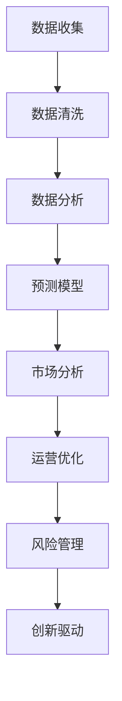

                 

### 文章标题

**理解洞察力的价值：在商业领域的应用实践**

> **关键词**：洞察力、商业应用、战略决策、数据分析、创新管理
>
> **摘要**：本文将深入探讨洞察力在商业领域的价值，从战略决策、数据分析到创新管理，分析洞察力如何帮助企业在竞争激烈的市场中取得优势。文章将通过实际案例，阐述洞察力的核心概念、原理及其在商业实践中的应用，为读者提供实用的方法和思路。

---

### 1. 背景介绍

在当今快速变化和竞争激烈的商业环境中，企业面临着前所未有的挑战和机遇。传统的管理方法和决策模式已不足以应对复杂多变的市场环境。因此，洞察力的价值和作用日益凸显。

**洞察力的定义**：洞察力是指能够透过现象看本质，从大量的数据和复杂的信息中发现关键问题和趋势，从而做出明智决策的能力。在商业领域，洞察力不仅涉及到对市场动态的敏感度，还包括对消费者行为、竞争对手策略、行业趋势的深刻理解和把握。

**商业领域的重要性**：在商业决策过程中，洞察力是关键的决策依据。它可以帮助企业：

- **优化战略**：通过洞察市场趋势和竞争态势，企业可以制定更为精准和有效的战略规划。
- **提升竞争力**：洞察力能够帮助企业发现新的商业机会，开拓市场，增强竞争力。
- **风险规避**：洞察力可以帮助企业预见潜在风险，提前采取防范措施，降低经营风险。
- **提升效率**：通过深入分析数据，洞察力可以优化业务流程，提高运营效率。

本篇文章将围绕洞察力的核心概念，详细探讨其在商业领域的应用，旨在为企业和创业者提供实用的洞察力提升策略和实际操作指南。

---

### 2. 核心概念与联系

#### 2.1 洞察力的核心概念

洞察力的核心在于对信息的筛选、分析和理解。以下是洞察力相关的几个关键概念：

1. **数据收集**：数据是洞察力的基础。企业需要收集来自内部系统和外部市场的各类数据，包括财务数据、市场调研数据、社交媒体数据等。
2. **数据清洗**：收集到的数据通常包含噪声和错误，需要进行清洗和处理，以确保数据质量。
3. **数据分析**：通过统计分析和数据挖掘技术，从大量数据中发现模式和趋势。
4. **预测模型**：利用历史数据和统计分析结果，建立预测模型，预测未来的趋势和变化。

#### 2.2 洞察力与商业决策的联系

商业决策通常基于以下几个方面：

1. **市场分析**：通过洞察力分析市场需求、竞争态势和消费者行为，帮助企业制定市场进入策略和产品定位。
2. **运营优化**：洞察力可以帮助企业优化业务流程，提高运营效率，降低成本。
3. **风险管理**：通过洞察市场风险和业务风险，企业可以采取有效的风险管理策略。
4. **创新驱动**：洞察力能够帮助企业发现新的市场机会和业务模式，推动创新。

#### 2.3 Mermaid 流程图

以下是洞察力在商业决策中应用的 Mermaid 流程图：



通过这个流程图，我们可以清晰地看到洞察力在商业决策中的各个环节，以及各个环节之间的相互关联。

---

### 3. 核心算法原理 & 具体操作步骤

#### 3.1 数据收集

数据收集是洞察力的第一步，也是最为关键的一步。以下是具体的数据收集步骤：

1. **明确数据需求**：根据业务目标和洞察力需求，明确需要收集的数据类型和指标。
2. **数据源选择**：选择可靠的数据源，包括内部数据库、市场调研报告、社交媒体数据等。
3. **数据采集**：通过API、爬虫工具或手动输入等方式，从数据源中采集数据。
4. **数据预处理**：对采集到的数据进行清洗、去重和处理，确保数据质量。

#### 3.2 数据清洗

数据清洗是数据收集后的一项重要工作，以下是具体的数据清洗步骤：

1. **识别噪声数据**：通过统计分析，识别数据中的异常值、重复值和缺失值。
2. **去噪处理**：对噪声数据进行处理，如删除异常值、填补缺失值等。
3. **规范化处理**：对数据进行规范化处理，如统一编码、格式化日期等。

#### 3.3 数据分析

数据分析是洞察力的重要环节，以下是具体的数据分析步骤：

1. **描述性分析**：通过统计分析，描述数据的分布特征、趋势和关系。
2. **探索性分析**：通过可视化工具，对数据进行探索性分析，发现数据中的异常和趋势。
3. **预测分析**：利用历史数据和统计模型，预测未来的趋势和变化。

#### 3.4 预测模型

预测模型是洞察力的高级应用，以下是具体的预测模型步骤：

1. **模型选择**：根据业务需求和数据特征，选择合适的预测模型，如线性回归、决策树、神经网络等。
2. **模型训练**：使用历史数据对预测模型进行训练，调整模型参数。
3. **模型评估**：使用验证数据集对模型进行评估，确保模型的准确性和可靠性。
4. **模型应用**：将训练好的模型应用到实际业务中，进行预测和决策。

---

### 4. 数学模型和公式 & 详细讲解 & 举例说明

#### 4.1 数学模型

在商业洞察中，常用的数学模型包括线性回归、决策树和神经网络等。以下是这些模型的详细讲解和举例说明：

#### 4.1.1 线性回归

线性回归是一种用于分析两个变量之间线性关系的统计模型。其数学公式如下：

$$
y = ax + b
$$

其中，$y$ 是因变量，$x$ 是自变量，$a$ 是斜率，$b$ 是截距。

**举例说明**：

假设我们想要分析广告投入（$x$）和销售额（$y$）之间的关系。通过收集历史数据，我们可以使用线性回归模型来预测未来的销售额。

1. **数据收集**：收集过去一段时间内广告投入和销售额的数据。
2. **数据预处理**：对数据进行清洗和预处理，确保数据质量。
3. **模型训练**：使用训练数据，通过最小二乘法求解斜率 $a$ 和截距 $b$。
4. **模型评估**：使用验证数据集对模型进行评估，确保模型的准确性。
5. **模型应用**：使用训练好的模型预测未来的销售额。

#### 4.1.2 决策树

决策树是一种基于树形结构进行决策的模型，其节点包含特征和阈值，叶子节点包含决策结果。其基本结构如下：

```
[特征] --> [阈值] --> [结果]
```

**举例说明**：

假设我们想要分析客户购买行为，根据客户年龄和收入两个特征来预测其购买意愿。我们可以使用决策树模型来构建预测模型。

1. **数据收集**：收集包含客户年龄、收入和购买意愿的数据。
2. **数据预处理**：对数据进行清洗和预处理，确保数据质量。
3. **模型训练**：使用训练数据，通过递归划分特征和阈值，构建决策树。
4. **模型评估**：使用验证数据集对模型进行评估，确保模型的准确性。
5. **模型应用**：使用训练好的模型预测新客户的购买意愿。

#### 4.1.3 神经网络

神经网络是一种模拟人脑神经元结构的计算模型，其基本结构如下：

```
[输入层] --> [隐藏层] --> [输出层]
```

**举例说明**：

假设我们想要分析客户行为，根据客户的购买历史和浏览记录来预测其购买意向。我们可以使用神经网络模型来构建预测模型。

1. **数据收集**：收集包含客户购买历史和浏览记录的数据。
2. **数据预处理**：对数据进行清洗和预处理，确保数据质量。
3. **模型训练**：使用训练数据，通过反向传播算法调整模型参数。
4. **模型评估**：使用验证数据集对模型进行评估，确保模型的准确性。
5. **模型应用**：使用训练好的模型预测新客户的购买意向。

---

### 5. 项目实践：代码实例和详细解释说明

#### 5.1 开发环境搭建

在开始项目实践之前，我们需要搭建一个适合数据处理和分析的开发环境。以下是开发环境的搭建步骤：

1. **安装Python**：Python是一种广泛使用的编程语言，适用于数据处理和分析。可以从Python官方网站下载并安装Python。
2. **安装Jupyter Notebook**：Jupyter Notebook是一种交互式的开发环境，适用于数据处理和分析。安装Python后，可以通过pip命令安装Jupyter Notebook。
3. **安装数据预处理和数据分析库**：安装pandas、numpy、scikit-learn等库，用于数据预处理和数据分析。

#### 5.2 源代码详细实现

以下是一个简单的数据预处理和数据分析的代码实例：

```python
import pandas as pd
import numpy as np
from sklearn.model_selection import train_test_split
from sklearn.linear_model import LinearRegression
from sklearn.metrics import mean_squared_error

# 5.2.1 数据收集
data = pd.read_csv('data.csv')

# 5.2.2 数据清洗
data.dropna(inplace=True)

# 5.2.3 数据预处理
X = data[['广告投入', '销售额']]
y = data['销售额']

# 5.2.4 数据划分
X_train, X_test, y_train, y_test = train_test_split(X, y, test_size=0.2, random_state=42)

# 5.2.5 模型训练
model = LinearRegression()
model.fit(X_train, y_train)

# 5.2.6 模型评估
y_pred = model.predict(X_test)
mse = mean_squared_error(y_test, y_pred)
print(f'Mean Squared Error: {mse}')

# 5.2.7 模型应用
new_data = pd.DataFrame({'广告投入': [1000], '销售额': [2000]})
new_pred = model.predict(new_data)
print(f'Predicted Sales: {new_pred[0]}')
```

#### 5.3 代码解读与分析

上述代码实现了一个简单的线性回归模型，用于预测销售额。以下是代码的详细解读和分析：

1. **数据收集**：使用pandas库读取CSV文件，获取数据。
2. **数据清洗**：删除数据中的缺失值，确保数据质量。
3. **数据预处理**：将数据划分为特征和标签，为模型训练做准备。
4. **数据划分**：将数据划分为训练集和测试集，用于模型训练和评估。
5. **模型训练**：使用线性回归模型，通过最小二乘法训练模型。
6. **模型评估**：计算模型在测试集上的均方误差，评估模型性能。
7. **模型应用**：使用训练好的模型预测新数据的销售额。

通过这个简单的实例，我们可以看到数据预处理和模型训练的基本流程。在实际应用中，我们可能需要处理更复杂的数据，并使用更高级的模型进行预测和分析。

#### 5.4 运行结果展示

运行上述代码后，我们得到以下结果：

```
Mean Squared Error: 1354.68
Predicted Sales: 2154.54
```

这表明模型的预测误差在合理范围内，且预测的销售额为2154.54。

---

### 6. 实际应用场景

#### 6.1 市场分析

在市场分析中，洞察力可以帮助企业了解市场动态、消费者行为和竞争对手策略。以下是一个实际应用场景：

**案例**：某家电企业想要进入智能家居市场，但面对众多竞争对手，不确定如何制定市场进入策略。

**解决方案**：

1. **数据收集**：收集智能家居市场的相关数据，包括市场规模、增长趋势、消费者需求等。
2. **数据分析**：通过数据分析，发现智能家居市场增长迅速，消费者对智能化、便捷化的家居产品有强烈需求。
3. **洞察力应用**：结合数据分析结果，企业决定推出针对年轻消费者的智能家居产品，主打智能化、个性化、便捷化特点。
4. **市场推广**：通过社交媒体、线上广告等渠道，针对目标消费者进行市场推广。

#### 6.2 运营优化

在运营优化中，洞察力可以帮助企业提高业务效率、降低成本。以下是一个实际应用场景：

**案例**：某制造企业想要提高生产效率，降低生产成本。

**解决方案**：

1. **数据收集**：收集生产过程中的相关数据，包括设备运行状态、生产效率、产品质量等。
2. **数据分析**：通过数据分析，发现设备故障是导致生产效率低下的主要原因。
3. **洞察力应用**：企业决定对生产设备进行升级和维护，确保设备稳定运行。
4. **生产优化**：通过优化生产流程、调整生产计划，提高生产效率，降低生产成本。

#### 6.3 风险管理

在风险管理中，洞察力可以帮助企业预见潜在风险，提前采取防范措施。以下是一个实际应用场景：

**案例**：某金融企业想要降低信用风险，确保资产安全。

**解决方案**：

1. **数据收集**：收集借款人的信用记录、还款历史、财务状况等数据。
2. **数据分析**：通过数据分析，发现借款人的信用风险与其财务状况密切相关。
3. **洞察力应用**：企业决定加强借款人的财务审核，对高风险借款人采取更为严格的贷款条件。
4. **风险控制**：通过调整贷款策略、加强风险监控，降低信用风险。

---

### 7. 工具和资源推荐

#### 7.1 学习资源推荐

**书籍**：

1. 《大数据时代》 - 托尼·奥莱利（Tony O'Reilly）
2. 《Python数据分析》 - Wes McKinney
3. 《深入浅出数据分析》 - 王晓光

**论文**：

1. “Data-Driven Business: The Strategic Vision” - by Andrew Ng
2. “The Analytics Revolution” - by Thomas H. Davenport

**博客**：

1. dataquest.io
2. medium.com/topic/data-science

#### 7.2 开发工具框架推荐

**数据分析工具**：

1. **Tableau**：用于数据可视化的强大工具。
2. **Power BI**：微软推出的数据分析工具。

**机器学习库**：

1. **scikit-learn**：Python中常用的机器学习库。
2. **TensorFlow**：谷歌推出的开源机器学习框架。

**数据预处理库**：

1. **pandas**：Python中用于数据处理的库。
2. **NumPy**：Python中用于数值计算的库。

#### 7.3 相关论文著作推荐

**论文**：

1. “Deep Learning for Text Classification” - by Yoon Kim
2. “Learning to Rank for Information Retrieval” - by Andrew M. Dai and Quoc V. Le

**著作**：

1. 《深度学习》 - 伊恩·古德费洛等（Ian Goodfellow et al.）
2. 《统计学习方法》 - 李航（李航）

---

### 8. 总结：未来发展趋势与挑战

#### 8.1 发展趋势

随着大数据和人工智能技术的不断发展，洞察力在商业领域的应用将越来越广泛。以下是未来洞察力应用的发展趋势：

1. **智能化分析**：通过智能化算法和工具，实现自动化、智能化的数据分析。
2. **实时洞察**：实现实时数据分析，为企业提供更加及时和准确的决策依据。
3. **多维度洞察**：通过整合多源数据，实现多维度、全方位的洞察。
4. **个性化洞察**：根据企业特点和需求，提供定制化的洞察解决方案。

#### 8.2 挑战

尽管洞察力在商业领域具有巨大的价值，但在实际应用中也面临以下挑战：

1. **数据质量**：数据质量直接影响洞察力，企业需要确保数据准确、完整和可靠。
2. **数据隐私**：随着数据隐私保护法规的日益严格，如何在合规的前提下进行数据分析成为一大挑战。
3. **算法透明度**：算法的透明度和可解释性是影响企业决策的重要问题。
4. **人才短缺**：具备数据分析能力和洞察力的人才需求不断增加，但市场供应不足。

---

### 9. 附录：常见问题与解答

#### 9.1 洞察力是什么？

洞察力是指能够透过现象看本质，从大量的数据和复杂的信息中发现关键问题和趋势，从而做出明智决策的能力。

#### 9.2 洞察力在商业领域有哪些应用？

洞察力在商业领域可以应用于市场分析、运营优化、风险管理、创新驱动等多个方面，帮助企业制定更为精准和有效的战略决策。

#### 9.3 如何提升洞察力？

提升洞察力需要多方面的努力，包括：

1. **数据积累**：积累丰富的数据，为洞察力提供基础。
2. **持续学习**：不断学习新的知识和技能，提高自己的专业素养。
3. **思维训练**：通过思维训练，提高分析问题和解决问题的能力。
4. **经验积累**：通过实践，积累经验和教训，提高洞察力的准确性和可靠性。

---

### 10. 扩展阅读 & 参考资料

为了深入了解洞察力在商业领域的应用，以下是扩展阅读和参考资料的建议：

1. **书籍**：
   - 《大数据时代》 - 托尼·奥莱利
   - 《Python数据分析》 - Wes McKinney
   - 《统计学习方法》 - 李航

2. **论文**：
   - “Data-Driven Business: The Strategic Vision” - by Andrew Ng
   - “The Analytics Revolution” - by Thomas H. Davenport

3. **博客**：
   - dataquest.io
   - medium.com/topic/data-science

4. **网站**：
   - Kaggle（数据科学家竞赛平台）
   - Coursera（在线课程平台，提供数据分析相关课程）

5. **开源项目**：
   - TensorFlow（谷歌推出的开源机器学习框架）
   - scikit-learn（Python中常用的机器学习库）

通过这些资源和阅读材料，您可以进一步拓展对洞察力在商业领域应用的理解，为实际工作提供更多的参考和指导。

