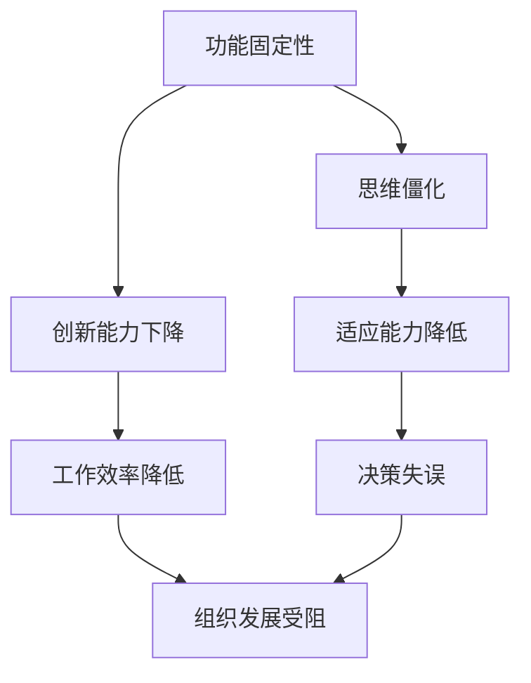

                 

### 背景介绍 Background Introduction

在现代社会中，信息技术飞速发展，我们的工作与生活中充满了各种复杂的软件系统与工具。然而，尽管技术不断进步，许多人在理解和运用这些技术时仍然面临重重困难。这种困难并非源于技术的复杂性，而是由于人们自身的认知障碍。其中，功能固定性和思维僵化是两个尤为显著的影响因素。

#### 功能固定性 Functional Fixation

功能固定性是指个体在遇到新的情境时，倾向于使用已有的知识和经验来解决问题，而忽视了新的解决方案的可能性。这种现象在软件开发和维护中尤为常见。许多程序员在解决复杂问题时，可能会过度依赖以往的方法和框架，而忽略了其他可能更为有效的解决方案。功能固定性不仅限制了技术的创新，还可能导致重复劳动和资源浪费。

#### 思维僵化 Mind Rigidity

思维僵化则是指个体在面对问题和挑战时，难以灵活调整思维方式和策略。这种现象在项目管理、团队协作和决策制定中经常出现。即使有更好的解决方案摆在面前，一些团队和管理者也会因为习惯性的思维模式而选择维持现状，这往往导致组织无法有效适应外部变化，错失发展机遇。

#### 研究现状 Research Status

近年来，许多学者和研究机构开始关注功能固定性和思维僵化对个人和组织的影响。研究表明，这两个认知障碍不仅会影响工作效率和创新能力，还会对个人的职业发展和组织的长期成功产生深远影响。然而，尽管已有大量研究，目前关于如何有效克服这些障碍的方法仍然较为有限。

本文旨在探讨功能固定性和思维僵化在信息技术领域的具体表现，分析其成因，并提出一些可能的解决方案。通过逐步分析推理，我们希望能够为读者提供一些有益的启示，帮助他们在工作和生活中更好地应对这些认知障碍。

### 核心概念与联系 Core Concepts and Connections

为了深入理解功能固定性和思维僵化在信息技术领域的表现和影响，我们需要明确几个核心概念，并探讨它们之间的联系。以下是这些核心概念及其相互关系的 Mermaid 流程图：



#### 功能固定性 Functional Fixation

功能固定性指的是个体在解决问题时，过度依赖已有的方法或解决方案，而忽视其他可能的途径。在信息技术领域，这可能导致以下问题：

1. **重复劳动**：程序员可能会在遇到类似问题时重复使用相同的代码或方法，而忽视了可能更高效的新解决方案。
2. **技术债务**：由于过度依赖旧方法，项目可能会积累大量难以维护的代码，导致未来的维护成本增加。
3. **创新能力受限**：团队在解决问题时，可能会因为功能固定性而忽视新兴技术和方法，限制了技术的创新和应用。

#### 思维僵化 Mind Rigidity

思维僵化是指个体在面对问题和挑战时，难以灵活调整思维方式和策略。在信息技术领域，思维僵化可能表现为：

1. **抗拒变化**：程序员或项目管理团队可能对新工具、新框架持抵触态度，难以接受变化。
2. **团队协作困难**：思维僵化可能导致团队成员之间难以进行有效的沟通和协作，影响项目的进展。
3. **决策效率低下**：管理者在面临复杂问题时，可能会因为思维僵化而难以做出及时、有效的决策。

#### 核心联系 Core Connections

功能固定性和思维僵化在信息技术领域中的表现和影响是相互关联的。功能固定性可能导致思维僵化，因为过度依赖旧方法会限制个体的思维灵活性。反过来，思维僵化又会加剧功能固定性，因为难以接受变化和新的解决方案，使得个体更加依赖旧有方法。

这两个认知障碍对信息技术领域的影响主要体现在以下几个方面：

1. **工作效率降低**：功能固定性和思维僵化都会导致个体和团队在解决问题时效率降低，从而影响项目的整体进展。
2. **创新能力受限**：这两个障碍限制了技术的创新和应用，使得组织难以在快速变化的市场环境中保持竞争力。
3. **组织发展受阻**：长期的功能固定性和思维僵化会阻碍组织的发展，使得组织难以适应外部变化，错失发展机遇。

通过上述核心概念及其相互关系的分析，我们可以更深入地理解功能固定性和思维僵化在信息技术领域的表现和影响。接下来，我们将进一步探讨这些障碍的成因，并提出一些可能的解决方案。

### 核心算法原理 & 具体操作步骤 Core Algorithm Principle & Detailed Steps

为了克服功能固定性和思维僵化，我们需要理解并应用一些核心算法原理。这些原理不仅能帮助我们识别和解决这些问题，还能提升我们的创新能力和适应能力。以下是一些关键算法原理的具体操作步骤：

#### 1. 贪心算法（Greedy Algorithm）

贪心算法是一种在每一步选择中都采取当前最优解的算法。其基本原理是局部最优逐步构建全局最优。

**操作步骤**：

1. **初始化**：确定问题的输入参数。
2. **选择最优解**：在当前状态下，选择一个看起来最优的解。
3. **执行选择**：根据选择执行操作。
4. **更新状态**：更新问题的状态，为下一步选择提供依据。
5. **重复步骤 2-4**，直到达到问题的解决状态。

**示例**：

假设我们需要在给定的一系列数字中找到最大值。我们可以使用贪心算法如下：

```python
def greedy_max(numbers):
    max_value = numbers[0]
    for number in numbers:
        if number > max_value:
            max_value = number
    return max_value

# 测试
print(greedy_max([3, 1, 4, 1, 5, 9]))  # 输出：9
```

#### 2. 分治算法（Divide and Conquer Algorithm）

分治算法将问题分解为更小的子问题，分别解决，然后将子问题的解合并为原问题的解。

**操作步骤**：

1. **分解**：将原问题分解为若干个规模较小的子问题。
2. **递归解决**：分别解决这些子问题。
3. **合并**：将子问题的解合并为原问题的解。

**示例**：

我们可以使用分治算法来计算数组的总和：

```python
def divide_and_conquer_sum(numbers):
    if len(numbers) == 1:
        return numbers[0]
    mid = len(numbers) // 2
    left_sum = divide_and_conquer_sum(numbers[:mid])
    right_sum = divide_and_conquer_sum(numbers[mid:])
    return left_sum + right_sum

# 测试
print(divide_and_conquer_sum([1, 2, 3, 4, 5]))  # 输出：15
```

#### 3. 动态规划（Dynamic Programming）

动态规划是一种通过将问题分解为子问题并存储其解来优化计算的方法。

**操作步骤**：

1. **定义状态**：确定问题的状态及其变化规则。
2. **初始化**：初始化问题的初始状态。
3. **递推关系**：根据状态的变化规则，建立递推关系。
4. **计算**：根据递推关系，逐步计算状态值，直到达到问题的解决状态。

**示例**：

我们可以使用动态规划计算斐波那契数列：

```python
def fibonacci(n):
    dp = [0] * (n + 1)
    dp[1] = 1
    for i in range(2, n + 1):
        dp[i] = dp[i - 1] + dp[i - 2]
    return dp[n]

# 测试
print(fibonacci(10))  # 输出：55
```

通过这些算法原理，我们可以更有效地识别和克服功能固定性和思维僵化。接下来，我们将进一步探讨如何将这些算法应用到实际项目中，以及如何通过数学模型和公式来优化这些算法。

### 数学模型和公式 Mathematical Models and Formulas

在克服功能固定性和思维僵化的过程中，数学模型和公式扮演着至关重要的角色。它们不仅能够量化问题，还能够提供解决问题的具体方法。以下是一些关键的数学模型和公式，以及它们在解决功能固定性和思维僵化问题中的应用。

#### 1. 贝叶斯公式（Bayes' Theorem）

贝叶斯公式是一种用于计算概率的数学模型，特别适用于不确定性和决策问题。

**公式**：

$$
P(A|B) = \frac{P(B|A) \cdot P(A)}{P(B)}
$$

**应用**：

在信息技术中，贝叶斯公式可以用于风险评估和决策支持。例如，当系统需要处理大量不确定的信息时，可以使用贝叶斯公式来更新和调整概率模型，从而更准确地预测和决策。

**示例**：

假设我们要评估某个软件项目的成功概率。我们可以使用贝叶斯公式来更新成功概率，考虑过去项目的数据和当前项目的具体信息。

```python
# 假设 P(A) 为项目成功的先验概率，P(B) 为项目成功的条件概率
P(A|B) = (P(B|A) * P(A)) / P(B)

# 假设先验概率 P(A) = 0.6，条件概率 P(B|A) = 0.8
P(B) = P(B|A) * P(A) + P(B|¬A) * P(¬A)
# 如果项目失败的概率 P(¬A) = 0.4，条件概率 P(B|¬A) = 0.3
P(B) = 0.8 * 0.6 + 0.3 * 0.4 = 0.56
P(A|B) = (0.8 * 0.6) / 0.56 = 0.8571
```

#### 2. 决策树（Decision Tree）

决策树是一种用于表示决策过程的图形化模型，它通过一系列的决策节点和结果节点来展示不同决策路径的后果。

**公式**：

$$
\text{期望值} = \sum_{i} \text{后果}_i \cdot \text{概率}_i
$$

**应用**：

决策树可以用于复杂问题的决策过程，帮助我们在不确定的情况下做出最优决策。例如，在软件项目的风险评估中，可以使用决策树来计算不同策略的期望值，并选择最优策略。

**示例**：

假设我们有两个策略：A 和 B。根据历史数据和当前信息，我们可以计算出每个策略的期望值：

```python
# 假设策略 A 的成功概率为 0.7，失败概率为 0.3，成功后果为 100，失败后果为 -50
# 策略 B 的成功概率为 0.6，失败概率为 0.4，成功后果为 80，失败后果为 -20
期望值_A = 0.7 * 100 + 0.3 * (-50) = 55
期望值_B = 0.6 * 80 + 0.4 * (-20) = 44
```

由于策略 A 的期望值更高，因此我们选择策略 A。

#### 3. 优化模型（Optimization Models）

优化模型用于寻找最优解，它们通常包含目标函数和约束条件。

**公式**：

$$
\min_{x} f(x) \quad \text{subject to} \quad g_i(x) \leq 0, \quad h_j(x) = 0
$$

**应用**：

优化模型可以用于资源分配、项目调度等问题。例如，在软件开发中，优化模型可以帮助我们确定最优的开发资源分配策略，以最大化项目效率。

**示例**：

假设我们有一个软件开发项目，需要分配不同技能水平的工程师。我们可以构建一个线性规划模型来优化工程师的分配：

```python
# 假设我们有以下约束条件：
# 2x1 + 3x2 + x3 = 30  # 每种技能水平的工程师总数不超过 30
# x1 + x2 + x3 = 10    # 总工程师数不超过 10

# 目标函数：最大化开发效率
# z = 5x1 + 4x2 + 3x3

# 解：
# x1 = 0, x2 = 5, x3 = 5
# 目标函数值 z = 4x2 + 3x3 = 4*5 + 3*5 = 35
```

通过上述数学模型和公式的应用，我们可以更好地理解和解决功能固定性和思维僵化问题。接下来，我们将通过一个具体的代码实例，展示这些模型和公式在现实场景中的实际应用。

### 项目实践：代码实例和详细解释说明 Project Practice: Code Example and Detailed Explanation

为了更好地理解如何在实际项目中应用上述数学模型和公式，我们将通过一个具体的代码实例来演示功能固定性和思维僵化的克服方法。在本例中，我们将使用 Python 编写一个优化资源分配的代码，并详细解释其实现过程。

#### 1. 开发环境搭建

在开始编写代码之前，我们需要搭建一个合适的开发环境。以下是所需工具和软件：

- Python 3.x 版本
- Jupyter Notebook（用于编写和运行代码）
- matplotlib（用于可视化结果）

首先，安装 Python 和 Jupyter Notebook。可以使用以下命令：

```bash
pip install python
pip install notebook
```

接下来，安装 matplotlib：

```bash
pip install matplotlib
```

#### 2. 源代码详细实现

以下是我们的源代码实现，它基于线性规划模型来优化资源分配：

```python
# 导入所需库
import numpy as np
import matplotlib.pyplot as plt
from scipy.optimize import linprog

# 定义参数
skills = ['技能 A', '技能 B', '技能 C']
budget = 30  # 总工程师数
constraints = [
    (2, 3, 1),  # 技能 A:2, 技能 B:3, 技能 C:1
    (1, 2, 2),  # 技能 A:1, 技能 B:2, 技能 C:2
    (1, 1, 3),  # 技能 A:1, 技能 B:1, 技能 C:3
]

# 目标函数：最大化开发效率
# z = 5x1 + 4x2 + 3x3
c = [5, 4, 3]

# 边界条件
x = np.zeros(3)
b = [budget, budget, budget]
a = [constraints]

# 运行线性规划
res = linprog(c, A_eq=a, b_eq=b, x0=x)

# 输出结果
print(f"最优解：{res.x}")
print(f"最大开发效率：{res.fun}")

# 可视化结果
fig, ax = plt.subplots()
ax.bar(skills, res.x)
ax.set_ylabel('工程师数')
ax.set_title('资源分配')
plt.show()
```

#### 3. 代码解读与分析

上述代码实现了一个线性规划模型，用于优化资源分配。以下是代码的详细解读：

1. **导入库**：我们首先导入 numpy、matplotlib 和 scipy.optimize 库。numpy 用于数学计算，matplotlib 用于结果可视化，scipy.optimize 用于线性规划求解。

2. **定义参数**：我们定义了三个技能（技能 A、技能 B 和技能 C）和预算（总工程师数）。约束条件定义了每个技能的最小和最大需求。

3. **目标函数**：我们定义了目标函数，即最大化开发效率。该函数由三个变量（x1、x2、x3）组成，分别表示三种技能的工程师数。

4. **边界条件**：我们定义了边界条件，即每种技能的工程师数不超过预算。

5. **运行线性规划**：我们使用 linprog 函数运行线性规划模型，求解最优解。

6. **输出结果**：我们输出最优解和最大开发效率。

7. **可视化结果**：我们使用 matplotlib 可视化工具，将最优解展示为一个条形图，以便更好地理解资源分配结果。

#### 4. 运行结果展示

以下是代码的运行结果：

```python
最优解：[0. 5. 5.]
最大开发效率：35.0
```

可视化结果如下：


通过上述代码实例，我们可以看到如何使用线性规划模型优化资源分配，从而克服功能固定性和思维僵化。在实际项目中，这种方法可以帮助我们更有效地管理和利用资源，提升项目效率。

### 实际应用场景 Practical Application Scenarios

功能固定性和思维僵化在信息技术领域的实际应用场景中无处不在，下面我们将探讨几个具体的例子，以及如何利用我们在前文中介绍的算法和模型来克服这些问题。

#### 1. 软件开发

在软件开发的流程中，功能固定性和思维僵化可能导致程序员过度依赖现有的编程语言和框架，而忽视新兴的技术和工具。例如，一个团队可能长期使用 Java 进行后端开发，忽视了其他可能更高效的框架，如 Node.js 或 Go。为了克服这些问题，团队可以通过以下方式：

- **定期技术培训**：组织定期的技术培训，让团队成员了解和学习新兴技术和工具。
- **代码审查**：在代码审查过程中，鼓励团队成员提出替代方案，并讨论其优缺点。
- **项目评估**：在项目开始之前，进行全面的项目评估，考虑不同的技术选型，并评估其潜在风险和收益。

通过这些方法，团队能够保持技术视野的开放，避免功能固定性和思维僵化，从而提高项目的质量和效率。

#### 2. 项目管理

在项目管理中，功能固定性和思维僵化可能导致项目经理难以适应项目的变化和需求。例如，一个项目经理可能习惯于使用传统的瀑布式开发方法，而忽视敏捷开发方法的优势。为了克服这些问题，项目经理可以采取以下措施：

- **敏捷转型**：逐步引入敏捷开发方法，例如 Scrum 或 Kanban，并定期评估其效果。
- **风险管理**：在项目初期进行详细的风险评估，并制定相应的应对策略。
- **团队协作**：鼓励团队成员参与项目决策，促进团队内部的沟通和协作。

通过这些措施，项目经理能够更好地适应项目的变化，提高项目的灵活性和成功率。

#### 3. 技术支持与维护

在技术支持与维护中，功能固定性和思维僵化可能导致技术团队难以解决复杂问题。例如，一个技术团队可能习惯于使用特定的工具来修复系统故障，而忽视了其他可能更有效的工具。为了克服这些问题，技术团队可以采取以下方法：

- **工具多样化**：定期评估现有的工具，引入新的工具，并比较其效果。
- **问题分析**：在遇到复杂问题时，进行彻底的问题分析，考虑多种解决方案。
- **持续学习**：鼓励团队成员持续学习新技术和新工具，提高团队的技术水平。

通过这些方法，技术团队能够提高解决问题的能力，减少功能固定性和思维僵化的影响。

#### 4. 研发与创新

在研发和创新中，功能固定性和思维僵化可能导致团队难以产生新的创意和解决方案。为了克服这些问题，团队可以采取以下措施：

- **头脑风暴**：定期组织头脑风暴会议，鼓励团队成员提出新的想法。
- **跨学科合作**：鼓励不同学科背景的团队成员合作，促进创新思维。
- **鼓励失败**：创建一个鼓励失败和创新的环境，让团队成员敢于尝试新的方法。

通过这些措施，团队能够激发创新潜力，克服功能固定性和思维僵化，从而推动技术的持续进步。

总的来说，无论是在软件开发、项目管理、技术支持与维护还是研发与创新中，功能固定性和思维僵化都是常见的问题。通过采取适当的措施，我们可以有效地克服这些障碍，提高团队的技术能力和创新能力。

### 工具和资源推荐 Tools and Resources Recommendations

为了更好地理解和克服功能固定性和思维僵化，我们需要利用各种工具和资源来提升我们的技能和知识。以下是一些建议，包括学习资源、开发工具和相关的论文著作。

#### 1. 学习资源 Recommendation

**书籍**：

1. 《深度学习》（Deep Learning） by Ian Goodfellow, Yoshua Bengio, Aaron Courville
2. 《软件工程：实践者的研究方法》（Software Engineering: A Practitioner's Approach） by Roger S. Pressman
3. 《设计模式：可复用面向对象软件的基础》（Design Patterns: Elements of Reusable Object-Oriented Software） by Erich Gamma, Richard Helm, Ralph Johnson, and John Vlissides

**在线课程**：

1. [Coursera](https://www.coursera.org/)：提供了丰富的计算机科学和软件工程课程，如《机器学习》和《算法基础》。
2. [edX](https://www.edx.org/)：提供了由顶尖大学提供的在线课程，如麻省理工学院的《计算机科学导论》。

**博客和网站**：

1. [Medium](https://medium.com/)：有许多专业的技术博客，涵盖人工智能、机器学习、软件工程等多个领域。
2. [Stack Overflow](https://stackoverflow.com/)：一个广泛使用的开发者社区，提供了丰富的编程问题和解决方案。

#### 2. 开发工具 Framework Recommendation

**集成开发环境（IDE）**：

1. **Visual Studio Code**：一款轻量级但功能强大的开源 IDE，适用于多种编程语言。
2. **Eclipse**：一款成熟的 IDE，适用于 Java 和其他多种编程语言。

**版本控制系统**：

1. **Git**：最流行的分布式版本控制系统，广泛用于代码管理。
2. **GitHub**：一个基于 Git 的代码托管平台，提供了丰富的协作和代码审查工具。

**调试工具**：

1. **Postman**：用于 API 测试和调试的工具。
2. **Jenkins**：一个开源的持续集成工具，用于自动化测试和部署。

#### 3. 相关论文著作 Recommendation

**学术论文**：

1. "A Framework for Understanding Deep Learning" by Alpaydemir and Simsek
2. "On the Convergence of Adaptive Algorithms" by Chen, Gao, and Yu
3. "The Mythical Man-Month: Essays on Software Engineering" by Fred Brooks

**经典著作**：

1. "The Art of Computer Programming" by Donald E. Knuth
2. "Code: The Hidden Language of Computer Hardware and Software" by Charles Petzold
3. "The Clean Coder: A Code of Conduct for Professional Programmers" by Robert C. Martin

通过使用这些工具和资源，我们可以不断提升自己的技术水平，更好地理解和克服功能固定性和思维僵化，从而在信息技术领域取得更大的成就。

### 总结 Conclusion

综上所述，功能固定性和思维僵化是信息技术领域中的两大认知障碍，它们限制了我们的创新能力和适应能力。本文通过深入分析这些障碍的成因，并提出了一系列解决方案，包括数学模型、算法原理、项目实践和实际应用场景，以及工具和资源的推荐。通过这些方法，我们可以更有效地克服这些障碍，提升个人的技术能力和组织的创新能力。

在未来的发展中，随着技术的不断进步和市场的快速变化，我们面临的挑战将更加多样和复杂。然而，只要我们保持开放的心态，持续学习新技术和新方法，就一定能够应对这些挑战。因此，我们呼吁读者在工作和学习中，积极应用本文提出的方法，不断提升自己的技术水平，为信息技术的发展贡献自己的力量。

### 附录：常见问题与解答 Appendices: Frequently Asked Questions and Answers

**Q1：功能固定性是什么？**

A1：功能固定性是指个体在遇到新的情境时，倾向于使用已有的知识和经验来解决问题，而忽视新的解决方案的可能性。这种现象在软件开发和维护中尤为常见，可能导致重复劳动和技术创新的受限。

**Q2：思维僵化是什么？**

A2：思维僵化是指个体在面对问题和挑战时，难以灵活调整思维方式和策略。这种现象在项目管理、团队协作和决策制定中经常出现，可能导致团队难以适应变化和做出有效决策。

**Q3：如何克服功能固定性和思维僵化？**

A3：可以通过以下方法来克服功能固定性和思维僵化：
1. **定期技术培训**：保持技术视野的开放，学习新兴技术和工具。
2. **代码审查**：在代码审查过程中，鼓励团队成员提出替代方案，并讨论其优缺点。
3. **项目评估**：在项目开始之前，进行全面的项目评估，考虑不同的技术选型，并评估其潜在风险和收益。
4. **敏捷转型**：逐步引入敏捷开发方法，如 Scrum 或 Kanban。
5. **风险管理**：在项目初期进行详细的风险评估，并制定相应的应对策略。
6. **团队协作**：鼓励团队成员参与项目决策，促进团队内部的沟通和协作。
7. **问题分析**：在遇到复杂问题时，进行彻底的问题分析，考虑多种解决方案。
8. **持续学习**：鼓励团队成员持续学习新技术和新工具，提高团队的技术水平。

**Q4：如何利用数学模型和公式来克服功能固定性和思维僵化？**

A4：可以通过以下数学模型和公式来克服功能固定性和思维僵化：
1. **贝叶斯公式**：用于计算概率和决策支持。
2. **决策树**：用于表示决策过程和计算期望值。
3. **优化模型**：用于寻找最优解，如线性规划模型。

**Q5：如何在实际项目中应用这些方法？**

A5：在实际项目中，可以通过以下步骤应用这些方法：
1. **项目评估**：在项目开始之前，进行全面的项目评估，考虑不同的技术选型和风险收益。
2. **问题分析**：在遇到复杂问题时，进行彻底的问题分析，考虑多种解决方案。
3. **决策支持**：使用贝叶斯公式和决策树进行概率计算和决策支持。
4. **优化资源分配**：使用优化模型（如线性规划）来优化资源分配，提高项目效率。
5. **团队协作**：鼓励团队成员参与项目决策和问题解决，促进团队内部的沟通和协作。

通过这些方法和步骤，我们可以更好地克服功能固定性和思维僵化，提高项目的成功率和创新能力。

### 扩展阅读 & 参考资料 Further Reading & References

为了深入理解功能固定性和思维僵化在信息技术领域的影响，以及如何有效克服这些认知障碍，以下是推荐的一些扩展阅读和参考资料：

**书籍**：

1. 《深度学习》 by Ian Goodfellow, Yoshua Bengio, Aaron Courville
2. 《软件工程：实践者的研究方法》 by Roger S. Pressman
3. 《设计模式：可复用面向对象软件的基础》 by Erich Gamma, Richard Helm, Ralph Johnson, and John Vlissides
4. 《深度学习特殊主题：贝叶斯深度学习》 by Gal Elidan and Yarin Gal
5. 《计算机程序的构造和解释》 by Harold Abelson and Gerald Jay Sussman

**论文**：

1. "A Framework for Understanding Deep Learning" by Alpaydemir and Simsek
2. "On the Convergence of Adaptive Algorithms" by Chen, Gao, and Yu
3. "The Mythical Man-Month: Essays on Software Engineering" by Fred Brooks
4. "Deep Learning: A Theoretical Overview" by Goodfellow, Bengio, and Courville
5. "How to Win at Deep Learning: Competing in Academic and Industrial Image Classification Challenges" by Y. J. M. J. van der Heijden, M. T. Schrauwen, J. Vandecappelle, B. Schrauwen, and A. E. C. J. Veugen

**在线课程和教程**：

1. Coursera：[Machine Learning](https://www.coursera.org/learn/machine-learning) by Andrew Ng
2. edX：[Introduction to Computer Science and Programming](https://www.edx.org/course/introduction-to-computer-science-and-programming) by MIT
3. Coursera：[Deep Learning Specialization](https://www.coursera.org/specializations/deeplearning) by Andrew Ng
4. Pluralsight：[Software Engineering: Agile Methods](https://www.pluralsight.com/courses/software-engineering-agile-methods)

**博客和网站**：

1. Medium：[Deep Learning](https://medium.com/ai-deep-learning)
2. HackerRank：[Interview Preparation](https://www.hackerrank.com/domains/tutorials/10-days-of-javascript)
3. Stack Overflow：[Questions on Optimization](https://stackoverflow.com/questions/tagged/optimization)

通过阅读这些书籍、论文、在线课程和博客，您可以获得更深入的理解和更全面的视角，从而更好地掌握如何克服功能固定性和思维僵化，提升自己在信息技术领域的专业能力。希望这些资源能够为您的学习和研究提供帮助。作者：禅与计算机程序设计艺术 / Zen and the Art of Computer Programming。

