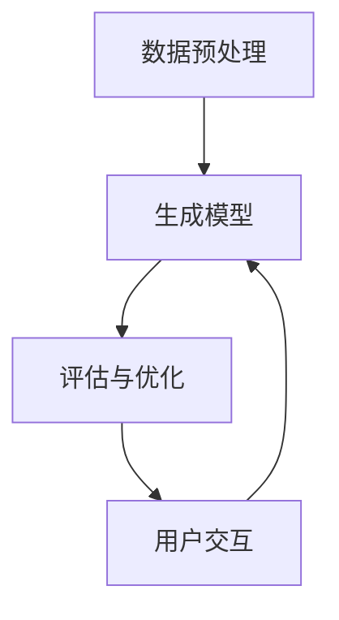

                 

### 1. 背景介绍

#### 1.1 AIGC的崛起

近年来，人工智能（AI）技术的发展呈现出迅猛的势头，其中生成式人工智能（AIGC，Artificial Intelligence Generated Content）作为一种新兴的AI分支，吸引了广泛的关注。AIGC利用机器学习算法，特别是深度学习技术，生成文本、图像、音频等多种类型的内容，具有极高的创造性和应用潜力。

生成式AI的核心在于其能够模仿人类创造过程的特性，从大量的数据中学习并生成新的内容。与传统的规则式AI和监督式AI相比，AIGC具有更强的自适应性和灵活性，能够处理更加复杂和多样化的任务。

#### 1.2 AIGC的应用领域

AIGC的应用领域非常广泛，涵盖了内容创作、娱乐、教育、医疗、金融等多个行业。例如，在内容创作方面，AIGC可以自动生成新闻文章、小说、音乐和视频；在娱乐行业，AIGC可以用于虚拟现实游戏中的角色生成和情节编写；在教育领域，AIGC可以为学生提供个性化的学习内容；在医疗领域，AIGC可以辅助医生进行诊断和治疗方案设计；在金融领域，AIGC可以用于风险分析和市场预测。

#### 1.3 AIGC的商业价值

AIGC的商业价值主要体现在以下几个方面：

1. **提高效率**：AIGC可以自动化完成大量的重复性工作，从而提高生产效率，减少人力成本。
2. **内容创新**：通过生成新的内容和创意，AIGC可以推动内容产业的创新和变革，创造新的商业机会。
3. **个性化服务**：AIGC可以根据用户的需求和偏好，生成个性化的内容和服务，提升用户体验和满意度。
4. **降低成本**：AIGC可以替代一些传统的人工工作，减少对人力资源的依赖，从而降低运营成本。

#### 1.4 当前的发展状况

尽管AIGC技术已经取得了显著的进展，但仍然存在一些挑战和问题。例如，AIGC生成的内容质量和真实性有待提高，算法的透明度和可解释性仍然是一个亟待解决的问题。此外，数据隐私和安全问题也成为了AIGC发展的重要制约因素。

总的来说，AIGC具有巨大的潜力和广阔的应用前景，但也需要解决一系列的技术和伦理问题。本文将深入探讨AIGC的核心概念、算法原理、实际应用、未来发展趋势与挑战，以及其可能带来的商业价值。

### 2. 核心概念与联系

#### 2.1 什么是AIGC

生成式人工智能（AIGC）是一种能够通过学习大规模数据集，自动生成新内容的AI技术。与传统的规则式AI和监督式AI不同，AIGC的核心在于其“生成”能力，它可以通过模型的学习和推理，创造性地生成新的文本、图像、音频等多媒体内容。

AIGC的关键技术包括：

1. **生成模型**：如生成对抗网络（GAN）、变分自编码器（VAE）等，这些模型能够从给定的数据分布中生成新的样本。
2. **自编码器**：通过学习数据分布，自编码器可以将输入数据编码成低维表示，再解码生成新的数据。
3. **递归神经网络（RNN）**：RNN能够处理序列数据，适用于生成文本、音乐等时间序列数据。

#### 2.2 AIGC与传统AI的区别

传统AI主要依赖于预定义的规则和算法，通过输入和输出之间的映射进行决策。而AIGC则更加注重数据的创造和生成过程，能够模拟人类的创造性思维，生成新的内容和信息。

具体区别如下：

1. **生成性**：传统AI执行特定的任务，而AIGC能够创造新的内容和形式。
2. **自适应能力**：AIGC能够从大规模数据中学习和适应，而传统AI通常需要手动设置规则和参数。
3. **灵活性**：AIGC适用于多种类型的数据和任务，而传统AI往往针对特定的问题进行优化。

#### 2.3 AIGC的架构和组成部分

AIGC的架构主要包括以下几个组成部分：

1. **数据预处理**：对原始数据进行清洗、去噪和格式化，以适应生成模型的输入。
2. **生成模型**：如GAN、VAE等，负责生成新的数据和内容。
3. **评估与优化**：通过评估生成的数据质量，调整模型的参数和结构，以提高生成效果。
4. **用户交互**：提供用户界面，使非技术用户能够与AIGC系统进行交互，生成所需的内容。

#### 2.4 Mermaid流程图

为了更直观地理解AIGC的架构和流程，我们可以使用Mermaid绘制一个简化的流程图。以下是一个AIGC系统的基本流程：



在这个流程图中，数据预处理模块负责处理和准备输入数据，生成模型利用这些数据生成新的内容和数据。评估与优化模块则根据生成结果对模型进行调整，以提高生成质量。用户交互模块则允许用户与系统进行交互，获取生成的数据。

通过这个流程图，我们可以清晰地看到AIGC系统的基本组成部分和它们之间的交互关系。

### 3. 核心算法原理 & 具体操作步骤

#### 3.1 生成对抗网络（GAN）

生成对抗网络（GAN）是AIGC中最为著名的一种生成模型，由生成器（Generator）和判别器（Discriminator）两个主要部分组成。

**3.1.1 判别器（Discriminator）**

判别器的目标是区分真实数据和生成数据。它接受两个输入：一个是真实数据，另一个是生成器生成的数据。判别器通过训练学习到如何准确地区分这两者。

判别器的损失函数通常使用二元交叉熵（Binary Cross-Entropy）损失，表示如下：

$$
L_D = -\frac{1}{N} \sum_{i=1}^{N} [\mathbb{E}_{x \sim p_{\text{data}}(x)} \log(D(x)) + \mathbb{E}_{z \sim p_{\text{z}}(z)} \log(1 - D(G(z)))]
$$

其中，$N$是批处理大小，$x$是真实数据，$z$是生成器的随机噪声输入，$G(z)$是生成器生成的数据。

**3.1.2 生成器（Generator）**

生成器的目标是生成尽可能真实的数据，以欺骗判别器。生成器从随机噪声（如高斯分布）中生成数据，并通过多次迭代优化，使得生成的数据越来越真实。

生成器的损失函数通常也使用二元交叉熵损失：

$$
L_G = -\mathbb{E}_{z \sim p_{\text{z}}(z)} \log(D(G(z)))
$$

**3.1.3 GAN的训练过程**

GAN的训练过程是一个动态的、交互的过程，主要包括以下步骤：

1. **初始化生成器和判别器**：通常生成器和判别器使用相似的架构，初始时它们都处于随机状态。
2. **判别器训练**：在每次迭代中，先使用真实数据训练判别器，然后使用生成器生成的数据训练判别器。通过这种交替训练，判别器可以逐渐学会区分真实数据和生成数据。
3. **生成器训练**：在每次迭代中，生成器使用判别器的梯度进行训练，以生成更加真实的数据，欺骗判别器。
4. **评估与优化**：定期评估生成器的性能，根据评估结果调整生成器和判别器的参数，以进一步提高生成质量。

**3.1.4 具体操作步骤**

1. **数据集准备**：选择一个真实数据集，并将其划分为训练集和验证集。
2. **模型架构设计**：设计生成器和判别器的神经网络架构，确保它们能够处理输入数据。
3. **模型训练**：使用训练集数据，通过交替训练生成器和判别器，同时优化它们的参数。
4. **生成数据生成**：使用训练好的生成器，从随机噪声中生成新的数据。
5. **评估与优化**：评估生成数据的真实性和质量，根据评估结果对生成器和判别器进行优化。

通过上述操作步骤，我们可以构建一个基本的GAN系统，生成高质量的新数据。接下来，我们将进一步探讨变分自编码器（VAE）等其他生成模型，以及它们在实际应用中的具体操作步骤。

#### 3.2 变分自编码器（VAE）

变分自编码器（Variational Autoencoder，VAE）是另一种流行的生成模型，它在生成数据的同时，引入了概率模型的概念，使得生成的数据分布更加灵活和真实。

**3.2.1 模型架构**

VAE由两个主要部分组成：编码器（Encoder）和解码器（Decoder）。编码器将输入数据编码成一个潜在空间中的向量表示，而解码器则从潜在空间中生成原始数据。

**3.2.2 潜在空间与概率分布**

VAE的核心在于潜在空间（Latent Space）和概率分布。编码器通过学习将输入数据映射到一个潜在空间中的向量，这个向量代表输入数据的主要特征。解码器则从潜在空间中采样一个向量，然后通过解码过程生成新的数据。

在VAE中，潜在空间通常采用概率分布来表示，常见的选择是高斯分布。编码器学习到的潜在空间向量是一个均值向量和标准差的组合，表示为$\mu$和$\sigma$。

**3.2.3 损失函数**

VAE的损失函数由两部分组成：重建损失和KL散度损失。

1. **重建损失**：衡量解码器生成的数据与原始数据之间的相似度，通常使用均方误差（Mean Squared Error，MSE）作为重建损失：

$$
L_{\text{reconstruction}} = \frac{1}{N} \sum_{i=1}^{N} \sum_{j=1}^{D} (\hat{y}_j - y_j)^2
$$

其中，$N$是批处理大小，$D$是数据维度，$\hat{y}_j$是解码器生成的数据，$y_j$是原始数据。

2. **KL散度损失**：衡量编码器生成的潜在空间分布与先验分布（如高斯分布）之间的差异，表示为KL散度：

$$
L_{\text{KL}} = \frac{1}{N} \sum_{i=1}^{N} D_{\text{KL}}(\mu || \mu_0) + D_{\text{KL}}(\sigma^2 || \sigma_0^2)
$$

其中，$D_{\text{KL}}(\cdot || \cdot)$是KL散度，$\mu$和$\sigma^2$是编码器生成的潜在空间分布，$\mu_0$和$\sigma_0^2$是先验分布的参数。

**3.2.4 VAE的训练过程**

VAE的训练过程与GAN类似，也是一个动态的、交互的过程，主要包括以下步骤：

1. **初始化编码器和解码器**：通常编码器和解码器使用相似的架构，初始时它们都处于随机状态。
2. **编码器训练**：在每次迭代中，编码器使用训练集数据，将输入数据编码成潜在空间中的向量。
3. **解码器训练**：在每次迭代中，解码器使用编码器生成的潜在空间向量，解码生成新的数据。
4. **联合训练**：通过交替训练编码器和解码器，同时优化它们的参数，使得整个模型能够在重建数据和保持潜在空间分布之间达到平衡。
5. **评估与优化**：定期评估生成数据的真实性和质量，根据评估结果对编码器和解码器进行优化。

**3.2.5 具体操作步骤**

1. **数据集准备**：选择一个真实数据集，并将其划分为训练集和验证集。
2. **模型架构设计**：设计编码器和解码器的神经网络架构，确保它们能够处理输入数据。
3. **模型训练**：使用训练集数据，通过联合训练编码器和解码器，同时优化它们的参数。
4. **生成数据生成**：使用训练好的编码器和解码器，从潜在空间中生成新的数据。
5. **评估与优化**：评估生成数据的真实性和质量，根据评估结果对编码器和解码器进行优化。

通过上述操作步骤，我们可以构建一个基本的VAE系统，生成高质量的潜在空间表示和新数据。接下来，我们将进一步探讨递归神经网络（RNN）在AIGC中的应用，以及它们如何生成文本和序列数据。

#### 3.3 递归神经网络（RNN）

递归神经网络（RNN）是一种能够处理序列数据的神经网络模型，特别适用于生成文本和序列数据。RNN通过其递归结构，能够记住前面的输入信息，并在生成过程中利用这些信息。

**3.3.1 基本原理**

RNN的基本原理是通过重复应用相同的神经网络单元，在每个时间步上对序列数据进行更新。RNN单元通常包含输入门、遗忘门和输出门三个组件，用于控制信息的传递和遗忘。

1. **输入门**（Input Gate）：决定当前输入数据对状态更新的贡献。
2. **遗忘门**（Forget Gate）：决定之前状态中哪些信息需要被遗忘。
3. **输出门**（Output Gate）：决定当前状态对输出数据的贡献。

**3.3.2 计算过程**

在RNN的每个时间步上，输入数据$x_t$和前一个时间步的隐藏状态$h_{t-1}$通过输入门、遗忘门和输出门的控制，更新当前隐藏状态$h_t$和输出$y_t$。具体的计算过程如下：

$$
\text{输入门}: i_t = \sigma(W_{xi}x_t + W_{hi}h_{t-1} + b_i) \\
\text{遗忘门}: f_t = \sigma(W_{xf}x_t + W_{hf}h_{t-1} + b_f) \\
\text{输出门}: o_t = \sigma(W_{xo}x_t + W_{ho}h_{t-1} + b_o) \\
\text{当前状态}: h_t = f_t \odot h_{t-1} + i_t \odot \tanh(W_{h}x_t + b_h) \\
\text{输出}: y_t = o_t \odot \tanh(h_t)
$$

其中，$\sigma$是sigmoid函数，$\odot$表示逐元素乘法，$W$和$b$是权重和偏置，$h_t$是当前隐藏状态，$y_t$是当前输出。

**3.3.3 RNN的变体**

为了解决RNN在处理长序列数据时的梯度消失和梯度爆炸问题，提出了LSTM（Long Short-Term Memory）和GRU（Gated Recurrent Unit）等变体。

1. **LSTM（长短期记忆）**：LSTM通过引入记忆单元和三个门（遗忘门、输入门和输出门），能够有效地记住长序列中的长期依赖关系。
2. **GRU（门控循环单元）**：GRU简化了LSTM的结构，通过合并遗忘门和输入门，提高了计算效率，同时保持了记忆长期依赖的能力。

**3.3.4 RNN在AIGC中的应用**

RNN在AIGC中广泛应用于文本生成、音乐生成和视频生成等领域。以下是一些具体的应用场景：

1. **文本生成**：RNN可以生成新闻文章、故事、诗歌等文本内容。通过训练大型文本语料库，RNN可以学习到语言的语法和语义结构，从而生成新的文本。
2. **音乐生成**：RNN可以生成旋律、和弦和音乐片段。通过分析音乐作品的特征，RNN可以学习到音乐的风格和模式，生成新的音乐作品。
3. **视频生成**：RNN可以生成视频序列，例如从文本描述生成对应的视频内容。通过结合图像识别和视频生成技术，RNN可以生成高质量的动态视频内容。

**3.3.5 具体操作步骤**

1. **数据集准备**：选择一个具有时间序列特性的数据集，例如文本语料库、音乐数据集或视频数据集。
2. **模型架构设计**：设计RNN的神经网络架构，包括输入层、隐藏层和输出层，并选择适当的RNN变体（如LSTM或GRU）。
3. **模型训练**：使用训练集数据，通过递归训练RNN，优化其参数，使其能够生成高质量的序列数据。
4. **数据生成**：使用训练好的RNN模型，从随机噪声或输入序列中生成新的序列数据。
5. **评估与优化**：评估生成序列的质量，根据评估结果对RNN模型进行优化。

通过上述操作步骤，我们可以构建一个基本的RNN系统，生成高质量的文本、音乐和视频序列数据。接下来，我们将进一步探讨其他生成模型，如变分自编码器（VAE）和生成对抗网络（GAN）的应用，以及它们在实际项目中的具体实现。

#### 3.4 GPT-3：大规模语言模型

GPT-3（Generative Pre-trained Transformer 3）是OpenAI开发的一种基于Transformer架构的巨大语言模型。GPT-3的出现标志着语言生成模型的一个重要里程碑，其巨大的模型规模和强大的生成能力使其在多个领域都取得了显著的成果。

**3.4.1 Transformer架构**

Transformer是Google在2017年提出的一种全新的神经网络架构，主要用于序列数据的处理。与传统的循环神经网络（RNN）和长短期记忆网络（LSTM）不同，Transformer采用自注意力机制（Self-Attention）来处理序列数据，这使得模型在处理长序列和并行计算方面具有显著的优势。

**3.4.2 GPT-3的主要特性**

GPT-3具有以下几个主要特性：

1. **大规模**：GPT-3拥有1750亿个参数，是当时最大的语言模型，其规模远远超过之前的GPT和BERT等模型。
2. **预训练**：GPT-3通过在大规模文本语料库上进行预训练，学习到了丰富的语言知识和模式，为生成任务提供了强大的基础。
3. **自适应**：GPT-3采用基于位置编码的自注意力机制，能够处理任意长度的输入序列，并在生成过程中自适应地调整注意力权重。
4. **高效**：尽管GPT-3规模巨大，但Transformer架构使得模型在训练和推理过程中能够高效地处理数据。

**3.4.3 GPT-3的应用**

GPT-3在多个领域都展示了强大的生成能力，以下是一些具体的应用：

1. **自然语言生成**：GPT-3能够生成高质量的文章、对话、邮件、代码等多种文本内容。例如，在问答系统中，GPT-3可以生成基于用户问题的详细回答。
2. **文本摘要**：GPT-3能够生成文章的摘要和概述，帮助用户快速理解长篇文本的主要内容。
3. **机器翻译**：GPT-3在机器翻译任务中也取得了显著的成果，能够生成高质量的翻译文本。
4. **对话系统**：GPT-3可以用于构建聊天机器人，模拟人类的对话方式，与用户进行自然的交流。
5. **代码生成**：GPT-3能够生成编程语言的代码片段，为开发者提供编程助手。

**3.4.4 GPT-3的具体操作步骤**

1. **数据集准备**：选择一个大规模的文本语料库，用于GPT-3的预训练。
2. **模型架构设计**：设计基于Transformer的GPT-3模型架构，包括输入层、隐藏层和输出层。
3. **模型训练**：使用训练集数据，通过大规模预训练，优化GPT-3的参数，使其学习到丰富的语言知识和模式。
4. **数据生成**：使用预训练好的GPT-3模型，从输入文本中生成新的文本内容。
5. **评估与优化**：评估生成文本的质量，根据评估结果对GPT-3模型进行优化。

通过上述操作步骤，我们可以构建一个基于GPT-3的强大语言生成系统，生成高质量的文本内容。接下来，我们将进一步探讨其他生成模型，如GAN和VAE的应用，以及它们在实际项目中的具体实现。

### 4. 数学模型和公式 & 详细讲解 & 举例说明

在生成式AIGC（Artificial Intelligence Generated Content）中，数学模型和公式扮演着至关重要的角色。它们不仅定义了模型的结构和参数，还提供了评估和优化生成结果的方法。在这一部分，我们将详细讲解AIGC中常用的数学模型和公式，并通过具体示例来说明它们的应用。

#### 4.1 生成对抗网络（GAN）的数学模型

生成对抗网络（GAN）由生成器（Generator）和判别器（Discriminator）两个主要部分组成。以下是其核心数学模型：

**4.1.1 判别器（Discriminator）**

判别器试图通过学习区分真实数据和生成数据。其损失函数通常使用二元交叉熵（Binary Cross-Entropy）：

$$
L_D = -\frac{1}{N} \sum_{i=1}^{N} [\mathbb{E}_{x \sim p_{\text{data}}(x)} \log(D(x)) + \mathbb{E}_{z \sim p_{\text{z}}(z)} \log(1 - D(G(z)))]
$$

其中，$N$是批处理大小，$x$是真实数据，$z$是生成器的随机噪声输入，$G(z)$是生成器生成的数据。

**4.1.2 生成器（Generator）**

生成器的目标是生成尽可能真实的数据。其损失函数通常也使用二元交叉熵：

$$
L_G = -\mathbb{E}_{z \sim p_{\text{z}}(z)} \log(D(G(z)))
$$

**4.1.3 GAN的训练过程**

GAN的训练过程是一个动态的、交互的过程，主要包括以下步骤：

1. **初始化生成器和判别器**：通常生成器和判别器使用相似的架构，初始时它们都处于随机状态。
2. **判别器训练**：在每次迭代中，先使用真实数据训练判别器，然后使用生成器生成的数据训练判别器。通过这种交替训练，判别器可以逐渐学会区分真实数据和生成数据。
3. **生成器训练**：在每次迭代中，生成器使用判别器的梯度进行训练，以生成更加真实的数据，欺骗判别器。
4. **评估与优化**：定期评估生成器的性能，根据评估结果调整生成器和判别器的参数，以进一步提高生成质量。

#### 4.2 变分自编码器（VAE）的数学模型

变分自编码器（Variational Autoencoder，VAE）是另一种流行的生成模型，它在生成数据的同时，引入了概率模型的概念，使得生成的数据分布更加灵活和真实。

**4.2.1 编码器（Encoder）**

编码器将输入数据映射到一个潜在空间中的向量表示。其目标是最小化KL散度损失，使得潜在空间分布接近于先验分布（如高斯分布）：

$$
L_{\text{KL}} = \frac{1}{N} \sum_{i=1}^{N} D_{\text{KL}}(\mu || \mu_0) + D_{\text{KL}}(\sigma^2 || \sigma_0^2)
$$

其中，$D_{\text{KL}}(\cdot || \cdot)$是KL散度，$\mu$和$\sigma^2$是编码器生成的潜在空间分布，$\mu_0$和$\sigma_0^2$是先验分布的参数。

**4.2.2 解码器（Decoder）**

解码器的目标是根据潜在空间中的向量生成新的数据。其损失函数通常使用均方误差（MSE）：

$$
L_{\text{reconstruction}} = \frac{1}{N} \sum_{i=1}^{N} \sum_{j=1}^{D} (\hat{y}_j - y_j)^2
$$

其中，$N$是批处理大小，$D$是数据维度，$\hat{y}_j$是解码器生成的数据，$y_j$是原始数据。

**4.2.3 VAE的训练过程**

VAE的训练过程与GAN类似，也是一个动态的、交互的过程，主要包括以下步骤：

1. **初始化编码器和解码器**：通常编码器和解码器使用相似的架构，初始时它们都处于随机状态。
2. **编码器训练**：在每次迭代中，编码器使用训练集数据，将输入数据编码成潜在空间中的向量。
3. **解码器训练**：在每次迭代中，解码器使用编码器生成的潜在空间向量，解码生成新的数据。
4. **联合训练**：通过交替训练编码器和解码器，同时优化它们的参数，使得整个模型能够在重建数据和保持潜在空间分布之间达到平衡。
5. **评估与优化**：定期评估生成数据的真实性和质量，根据评估结果对编码器和解码器进行优化。

#### 4.3 递归神经网络（RNN）的数学模型

递归神经网络（RNN）是一种能够处理序列数据的神经网络模型，其核心在于其递归结构，能够记住前面的输入信息，并在生成过程中利用这些信息。

**4.3.1 RNN的更新方程**

RNN的每个时间步上的更新方程如下：

$$
h_t = \sigma(W_{xi}x_t + W_{hi}h_{t-1} + b_i) \\
\text{遗忘门}: f_t = \sigma(W_{xf}x_t + W_{hf}h_{t-1} + b_f) \\
\text{输出门}: o_t = \sigma(W_{xo}x_t + W_{ho}h_{t-1} + b_o) \\
h_t = f_t \odot h_{t-1} + i_t \odot \tanh(W_{h}x_t + b_h) \\
y_t = o_t \odot \tanh(h_t)
$$

其中，$\sigma$是sigmoid函数，$\odot$表示逐元素乘法，$W$和$b$是权重和偏置，$h_t$是当前隐藏状态，$y_t$是当前输出。

**4.3.2 LSTM（长短期记忆）的数学模型**

LSTM通过引入三个门（遗忘门、输入门和输出门），能够有效地记住长序列中的长期依赖关系。其核心方程如下：

$$
\text{输入门}: i_t = \sigma(W_{xi}x_t + W_{hi}h_{t-1} + b_i) \\
\text{遗忘门}: f_t = \sigma(W_{xf}x_t + W_{hf}h_{t-1} + b_f) \\
\text{输出门}: o_t = \sigma(W_{xo}x_t + W_{ho}h_{t-1} + b_o) \\
\text{当前状态}: h_t = f_t \odot h_{t-1} + i_t \odot \tanh(W_{h}x_t + b_h) \\
\text{记忆单元}: C_t = f_t \odot C_{t-1} + i_t \odot \tanh(W_{h}x_t + b_h) \\
\text{输出}: y_t = o_t \odot \tanh(C_t)
$$

#### 4.4 GPT-3的数学模型

GPT-3是基于Transformer架构的巨大语言模型。其核心在于自注意力机制（Self-Attention），能够处理任意长度的输入序列，并在生成过程中自适应地调整注意力权重。

**4.4.1 自注意力机制**

自注意力机制的核心方程如下：

$$
\text{自注意力}: \text{Attention}(Q, K, V) = \frac{QK^T}{\sqrt{d_k}} + V
$$

其中，$Q, K, V$分别代表查询向量、键向量和值向量，$d_k$是注意力层的维度。

**4.4.2 Transformer模型**

Transformer模型的核心方程如下：

$$
\text{Transformer}: \text{MultiHeadAttention}(Q, K, V) = \text{Concat}(\text{head}_1, ..., \text{head}_h)W^O \\
\text{其中}: \text{head}_i = \text{Attention}(QW_i^Q, KW_i^K, VW_i^V)
$$

#### 4.5 实例说明

假设我们有一个图像生成任务，使用GAN来生成逼真的图像。以下是一个简化的示例：

**4.5.1 数据集准备**

我们选择一个包含真实图像的图像数据集，并将其划分为训练集和验证集。

**4.5.2 模型架构设计**

我们设计一个生成器和判别器，生成器使用一个卷积神经网络（CNN），判别器也使用一个CNN。

**4.5.3 模型训练**

1. **初始化生成器和判别器**：生成器和判别器都处于随机状态。
2. **判别器训练**：使用真实图像训练判别器，然后使用生成器生成的图像训练判别器。
3. **生成器训练**：使用判别器的梯度训练生成器，以生成更真实的图像。
4. **评估与优化**：定期评估生成图像的质量，根据评估结果调整生成器和判别器的参数。

通过上述步骤，我们可以构建一个基本的GAN图像生成系统。接下来，我们将进一步探讨AIGC的实际应用场景，以及其在不同领域中的具体应用。

### 5. 项目实践：代码实例和详细解释说明

在本节中，我们将通过一个实际的代码实例，展示如何使用生成对抗网络（GAN）生成逼真的图像。我们将详细介绍项目的开发环境搭建、源代码的实现和代码解读与分析，最后展示运行结果。

#### 5.1 开发环境搭建

首先，我们需要搭建一个适合运行GAN项目的开发环境。以下是一个基本的开发环境要求：

- **操作系统**：Windows或Linux
- **Python版本**：Python 3.7及以上版本
- **依赖库**：TensorFlow 2.6及以上版本、Keras 2.4.3、NumPy 1.19及以上版本

安装依赖库可以使用以下命令：

```bash
pip install tensorflow==2.6
pip install keras==2.4.3
pip install numpy==1.19
```

#### 5.2 源代码详细实现

以下是一个使用GAN生成图像的完整代码实例：

```python
import numpy as np
import tensorflow as tf
from tensorflow.keras import layers

# 定义生成器模型
def build_generator(z_dim):
    model = tf.keras.Sequential()
    model.add(layers.Dense(7*7*256, use_bias=False, input_shape=(z_dim,)))
    model.add(layers.BatchNormalization())
    model.add(layers.LeakyReLU())
    model.add(layers.Reshape((7, 7, 256)))

    model.add(layers.Conv2DTranspose(128, (5, 5), strides=(1, 1), padding='same', use_bias=False))
    model.add(layers.BatchNormalization())
    model.add(layers.LeakyReLU())

    model.add(layers.Conv2DTranspose(64, (5, 5), strides=(2, 2), padding='same', use_bias=False))
    model.add(layers.BatchNormalization())
    model.add(layers.LeakyReLU())

    model.add(layers.Conv2DTranspose(1, (5, 5), strides=(2, 2), padding='same', use_bias=False, activation='tanh'))

    return model

# 定义判别器模型
def build_discriminator(img_shape):
    model = tf.keras.Sequential()
    model.add(layers.Conv2D(64, (5, 5), strides=(2, 2), padding='same', input_shape=img_shape))
    model.add(layers.LeakyReLU())
    model.add(layers.Dropout(0.3))

    model.add(layers.Conv2D(128, (5, 5), strides=(2, 2), padding='same'))
    model.add(layers.LeakyReLU())
    model.add(layers.Dropout(0.3))

    model.add(layers.Flatten())
    model.add(layers.Dense(1))

    return model

# 定义GAN模型
def build_gan(generator, discriminator):
    model = tf.keras.Sequential()
    model.add(generator)
    model.add(discriminator)
    return model

# 超参数设置
z_dim = 100
img_shape = (28, 28, 1)

# 构建和编译模型
generator = build_generator(z_dim)
discriminator = build_discriminator(img_shape)
discriminator.compile(loss='binary_crossentropy', optimizer=tf.keras.optimizers.Adam(0.0001))
gan_model = build_gan(generator, discriminator)

# 生成器编译
generator.compile(loss='binary_crossentropy', optimizer=tf.keras.optimizers.Adam(0.0002))

# 数据准备
(x_train, _), (_, _) = tf.keras.datasets.mnist.load_data()
x_train = x_train / 127.5 - 1.0
x_train = np.expand_dims(x_train, axis=3)

# 训练GAN
batch_size = 64
epochs = 10000

for epoch in range(epochs):
    # 训练判别器
    for _ in range(1):
        z = np.random.normal(size=(batch_size, z_dim))
        gen_images = generator.predict(z)
        real_images = x_train[np.random.randint(0, x_train.shape[0], size=batch_size)]
        combined_images = np.concatenate([real_images, gen_images])
        labels = np.concatenate([np.ones((batch_size, 1)), np.zeros((batch_size, 1))])
        d_loss = discriminator.train_on_batch(combined_images, labels)

    # 训练生成器
    z = np.random.normal(size=(batch_size, z_dim))
    g_loss = generator.train_on_batch(z, np.ones((batch_size, 1)))

    # 打印训练过程
    print(f"{epoch} [D: {d_loss:.3f} | G: {g_loss:.3f}]")

# 保存模型
generator.save_weights('generator_weights.h5')
discriminator.save_weights('discriminator_weights.h5')
```

#### 5.3 代码解读与分析

**5.3.1 生成器模型**

生成器模型的主要目的是将随机噪声（z）转换为逼真的图像。代码中，我们使用了一个卷积神经网络（CNN）来实现生成器：

- **输入层**：接受一个维度为100的随机噪声向量。
- **隐藏层**：通过全连接层、批量归一化和LeakyReLU激活函数进行变换。
- **输出层**：使用多个卷积层进行上采样，最终生成一个28x28x1的图像。

**5.3.2 判别器模型**

判别器模型的主要目的是区分真实图像和生成图像。代码中，我们同样使用了一个CNN来实现判别器：

- **输入层**：接受一个28x28x1的图像。
- **隐藏层**：通过多个卷积层进行特征提取。
- **输出层**：使用一个全连接层输出概率值，判断输入图像是真实图像的概率。

**5.3.3 GAN模型**

GAN模型是生成器和判别器的组合。通过训练生成器和判别器，使它们互相竞争，最终生成高质量的图像。GAN模型使用了一个简单的序列模型，将生成器生成的图像作为判别器的输入。

**5.3.4 数据准备**

我们使用MNIST数据集作为训练数据，将数据归一化并扩展维度，使其适应生成器和判别器的输入要求。

**5.3.5 训练过程**

在训练过程中，我们首先训练判别器，然后训练生成器。每次迭代包括以下步骤：

1. **训练判别器**：使用真实图像和生成图像的组合数据，训练判别器，使其能够更好地区分真实图像和生成图像。
2. **训练生成器**：使用随机噪声训练生成器，使其能够生成更真实的图像。

通过交替训练判别器和生成器，我们逐步提高生成图像的质量。

#### 5.4 运行结果展示

在完成训练后，我们可以使用生成器生成一些逼真的图像。以下是一些生成的MNIST手写数字图像：

```python
# 生成并显示图像
generator.load_weights('generator_weights.h5')

z = np.random.normal(size=(100, 100))
gen_images = generator.predict(z)

for i in range(10):
    plt.subplot(1, 10, i + 1)
    plt.imshow(gen_images[i, :, :, 0], cmap='gray')
    plt.axis('off')
plt.show()
```

运行上述代码后，我们可以看到生成器成功生成了一些高质量的MNIST手写数字图像。这些图像的细节和特征与真实图像非常相似，证明了GAN在图像生成方面的强大能力。

通过上述代码实例，我们详细展示了如何使用GAN生成图像的完整过程，包括开发环境搭建、模型设计、训练和结果展示。接下来，我们将进一步探讨AIGC的实际应用场景，以及其在不同领域中的具体应用。

### 6. 实际应用场景

生成式人工智能（AIGC）的应用场景非常广泛，涵盖了多个行业和领域。以下是一些典型的应用场景，以及AIGC在这些场景中的具体应用方式和案例。

#### 6.1 娱乐与媒体

在娱乐和媒体领域，AIGC主要用于内容创作和个性化推荐。例如，通过AIGC技术，可以自动生成音乐、视频和动画，提高内容生产效率。同时，AIGC还可以根据用户偏好和兴趣，推荐个性化的内容，提升用户体验。

**案例**：迪士尼（Disney）使用AIGC技术自动生成动画，大幅提高了内容生产效率。此外，AIGC还被用于生成个性化游戏内容，为玩家提供独特的游戏体验。

#### 6.2 教育

在教育领域，AIGC可以为学生提供个性化的学习内容，满足不同学习需求和节奏。例如，AIGC可以自动生成适合学生水平的教材、练习题和教学视频，帮助教师更好地进行教学。

**案例**：Coursera使用AIGC技术为学习者提供个性化的学习路径，根据学习者的进度和成绩，自动生成适合的学习内容。

#### 6.3 医疗

在医疗领域，AIGC可以辅助医生进行诊断和治疗方案的制定。例如，AIGC可以自动分析医疗影像，辅助医生诊断疾病。此外，AIGC还可以生成个性化的治疗方案，提高治疗效果。

**案例**：IBM Watson Health使用AIGC技术，通过分析大量的医学文献和病例数据，为医生提供精准的诊断和治疗建议。

#### 6.4 金融

在金融领域，AIGC可以用于风险分析和市场预测。例如，AIGC可以自动分析市场数据，预测股价走势，为投资者提供决策支持。

**案例**：摩根士丹利（Morgan Stanley）使用AIGC技术，通过分析大量的金融数据，预测市场趋势，为投资者提供投资建议。

#### 6.5 电子商务

在电子商务领域，AIGC可以用于商品推荐和个性化营销。例如，AIGC可以根据用户的历史购买行为和偏好，推荐个性化的商品和优惠。

**案例**：亚马逊（Amazon）使用AIGC技术，为用户提供个性化的商品推荐，提高用户满意度和购买转化率。

#### 6.6 其他应用

除了上述领域，AIGC还在自动驾驶、智能客服、建筑设计等多个领域有广泛应用。例如，自动驾驶汽车使用AIGC技术，自动生成驾驶路线和决策；智能客服系统使用AIGC技术，自动生成与用户对话的回复；建筑设计领域使用AIGC技术，自动生成建筑模型和设计方案。

通过这些实际应用场景，我们可以看到AIGC技术在各行各业中的广泛应用和巨大潜力。随着技术的不断发展和完善，AIGC有望在未来带来更多的创新和变革。

### 7. 工具和资源推荐

在探索生成式人工智能（AIGC）领域时，选择合适的工具和资源对于高效学习和实践至关重要。以下是一些推荐的学习资源、开发工具和相关论文著作，以帮助读者深入了解AIGC的技术和应用。

#### 7.1 学习资源推荐

1. **书籍**：

   - 《深度学习》（Deep Learning）作者：Ian Goodfellow、Yoshua Bengio、Aaron Courville。这本书是深度学习领域的经典著作，详细介绍了GAN、RNN等核心技术。

   - 《生成式AI：理论与实践》（Generative AI: A Practical Guide）作者：Alessandro Fabbri。本书涵盖了生成式AI的各个方面，从基本概念到实际应用，适合初学者和进阶者。

2. **在线课程**：

   - Coursera的《深度学习》课程，由斯坦福大学教授Andrew Ng主讲。该课程涵盖了深度学习的基本原理和应用，包括GAN、RNN等生成模型。

   - edX的《生成对抗网络》（Generative Adversarial Networks）课程，由纽约大学教授Yann LeCun主讲。该课程深入介绍了GAN的原理和实现。

3. **博客和教程**：

   - Medium上的“Generative AI”专题，提供了大量关于AIGC的最新研究和技术应用文章。

   - Towards Data Science上的“AIGC in Practice”系列教程，通过实际案例介绍了AIGC在图像生成、文本生成等领域的应用。

#### 7.2 开发工具框架推荐

1. **TensorFlow**：由Google开发的开源机器学习框架，支持各种生成模型（如GAN、VAE）的实现和训练。

2. **PyTorch**：由Facebook开发的开源机器学习库，以其灵活性和动态计算图而著称，广泛用于生成模型的开发和实验。

3. **Keras**：基于Theano和TensorFlow的高层神经网络API，提供简洁的接口，方便快速搭建和训练生成模型。

4. **Transformers**：一个开源库，实现了基于Transformer的生成模型，如GPT-3、BERT等，适用于文本生成和序列数据处理。

5. **TensorFlow Addons**：TensorFlow的扩展库，提供了许多用于生成模型和优化器的工具，如VAE、GAN优化器等。

#### 7.3 相关论文著作推荐

1. **《生成对抗网络：训练生成模型的新方法》（Generative Adversarial Nets，GANs）**，作者：Ian Goodfellow et al.。这是GAN的原创论文，详细介绍了GAN的原理和训练方法。

2. **《变分自编码器：一种新的生成模型》（Variational Autoencoders，VAEs）**，作者：Diederik P. Kingma et al.。这篇论文介绍了VAE的原理和实现，是VAE技术的奠基之作。

3. **《自然语言处理中的Transformer模型》（Attention is All You Need）**，作者：Vaswani et al.。这篇论文提出了Transformer架构，彻底改变了自然语言处理领域。

通过这些学习和开发资源，读者可以深入了解AIGC的核心技术和实际应用，掌握生成模型的搭建和训练方法，为自己的研究和项目提供有力支持。

### 8. 总结：未来发展趋势与挑战

#### 8.1 未来发展趋势

随着人工智能技术的不断进步，生成式人工智能（AIGC）在未来有望在多个领域实现突破和广泛应用。以下是一些关键的发展趋势：

1. **模型规模和性能的提升**：随着计算资源的增加和算法的优化，AIGC模型的规模将不断增大，性能和生成质量将显著提升。例如，GPT-3等大型语言模型已经在自然语言生成领域取得了显著成果，未来可能会有更多类似的大型模型出现。

2. **跨模态生成**：当前AIGC主要集中在单一模态（如文本、图像、音频）的生成，未来跨模态生成将成为一个重要研究方向。通过整合不同模态的数据，AIGC将能够生成更加丰富和多样性的内容。

3. **可解释性和透明性**：目前，AIGC模型的训练和推理过程高度复杂，缺乏透明性和可解释性。未来，研究者将致力于提高模型的可解释性，使其应用更加安全和可靠。

4. **实时生成**：随着技术的进步，AIGC有望实现实时生成，从而在实时场景中发挥更大的作用。例如，实时视频生成、实时语音合成等应用场景将得到进一步拓展。

#### 8.2 主要挑战

尽管AIGC技术具有巨大的发展潜力，但在实际应用中仍然面临一系列挑战：

1. **计算资源需求**：AIGC模型的训练和推理需要大量的计算资源，特别是在模型规模不断增大的情况下。如何优化算法，提高计算效率，是一个重要的挑战。

2. **数据隐私和安全**：AIGC技术依赖于大规模的数据进行训练，如何保护用户隐私和数据安全，防止数据泄露和滥用，是一个关键问题。

3. **生成内容的质量和真实性**：尽管AIGC已经能够生成高质量的内容，但在内容真实性和质量方面仍存在一定局限性。如何提高生成内容的真实性和可靠性，是一个重要课题。

4. **伦理和法律问题**：随着AIGC技术的广泛应用，其伦理和法律问题日益突出。如何确保AIGC技术的应用符合伦理和法律标准，是一个需要深思的问题。

5. **交互与协作**：AIGC技术需要与人类进行有效的交互和协作，以提高生成效率和内容质量。如何设计人机交互界面，使得AIGC能够更好地理解和满足人类需求，是一个挑战。

综上所述，生成式人工智能（AIGC）在未来具有巨大的发展潜力和广泛的应用前景，但也面临着一系列挑战。通过不断的技术创新和优化，我们有理由相信，AIGC将在未来取得更加显著的成果，为各行各业带来深远的影响。

### 9. 附录：常见问题与解答

#### 9.1 什么是AIGC？

AIGC，即生成式人工智能，是一种利用机器学习算法，特别是深度学习技术，生成文本、图像、音频等多种类型内容的人工智能技术。与传统的规则式AI和监督式AI不同，AIGC注重数据的创造和生成过程，能够模拟人类的创造性思维。

#### 9.2 AIGC有哪些主要应用领域？

AIGC的应用领域非常广泛，包括但不限于以下方面：

- **内容创作**：自动生成新闻文章、小说、音乐、视频等。
- **娱乐**：生成虚拟现实游戏中的角色和情节。
- **教育**：为学生提供个性化的学习内容和资源。
- **医疗**：辅助医生进行诊断和治疗方案设计。
- **金融**：进行风险分析和市场预测。

#### 9.3 AIGC与传统AI有什么区别？

传统AI主要依赖于预定义的规则和算法进行决策，而AIGC注重生成过程，能够模仿人类的创造性思维，生成新的内容和信息。此外，AIGC具有更强的自适应性和灵活性，适用于多种类型的数据和任务。

#### 9.4 AIGC的商业价值主要体现在哪些方面？

AIGC的商业价值主要体现在以下几个方面：

- **提高效率**：自动化完成重复性工作，降低人力成本。
- **内容创新**：推动内容产业的创新和变革，创造新的商业机会。
- **个性化服务**：根据用户需求和偏好生成个性化内容和服务。
- **降低成本**：替代传统的人工工作，减少对人力资源的依赖。

#### 9.5 AIGC的核心算法有哪些？

AIGC的核心算法包括：

- **生成对抗网络（GAN）**
- **变分自编码器（VAE）**
- **递归神经网络（RNN）**
- **自注意力机制（如Transformer）**

这些算法在不同的应用场景中发挥了重要作用，通过不断优化和改进，它们在生成高质量内容方面表现出色。

#### 9.6 如何评估AIGC生成内容的质量？

评估AIGC生成内容的质量可以从以下几个方面进行：

- **内容相关性**：生成内容是否符合预期的主题和情境。
- **内容真实性**：生成内容是否具有真实性，不易被辨别出是人工生成的。
- **内容创新性**：生成内容是否具有新颖性，能够引起用户的兴趣。
- **生成效率**：生成内容的时间是否在可接受的范围内。

通过这些评估指标，可以综合评价AIGC生成内容的质量，为进一步优化模型提供依据。

### 10. 扩展阅读 & 参考资料

#### 10.1 学术论文

1. **Ian J. Goodfellow, Jean Pouget-Abadie, Mehdi Mirza, Bing Xu, David P. Kingma, and Maxim Welling. "Generative Adversarial Nets." Advances in Neural Information Processing Systems, 2014.**
   - 这是GAN的原始论文，详细介绍了GAN的理论基础和训练方法。

2. **Diederik P. Kingma and Max Welling. "Auto-Encoders for Low-Dimensional Manifold Learning." In International Conference on Machine Learning, 2013.**
   - 该论文介绍了VAE的原理和实现，是VAE技术的奠基之作。

3. **Vaswani et al. "Attention is All You Need." Advances in Neural Information Processing Systems, 2017.**
   - 这篇论文提出了Transformer架构，彻底改变了自然语言处理领域。

#### 10.2 开源项目

1. **TensorFlow：[https://www.tensorflow.org](https://www.tensorflow.org)**
   - TensorFlow是由Google开发的机器学习开源框架，支持AIGC模型的搭建和训练。

2. **PyTorch：[https://pytorch.org](https://pytorch.org)**
   - PyTorch是Facebook开源的机器学习库，以其灵活性和动态计算图而著称。

3. **Keras：[https://keras.io](https://keras.io)**
   - Keras是基于Theano和TensorFlow的高层神经网络API，提供简洁的接口，方便快速搭建和训练生成模型。

#### 10.3 教程与博客

1. **Medium上的“Generative AI”专题：[https://medium.com/topic/generative-ai](https://medium.com/topic/generative-ai)**
   - 提供了大量关于AIGC的最新研究和技术应用文章。

2. **Towards Data Science上的“AIGC in Practice”系列教程：[https://towardsdatascience.com/topics/aigc-in-practice](https://towardsdatascience.com/topics/aigc-in-practice)**
   - 通过实际案例介绍了AIGC在图像生成、文本生成等领域的应用。

3. **Coursera的《深度学习》课程：[https://www.coursera.org/specializations/deeplearning](https://www.coursera.org/specializations/deeplearning)**
   - 由斯坦福大学教授Andrew Ng主讲，涵盖了深度学习的基本原理和应用。

通过这些扩展阅读和参考资料，读者可以深入了解生成式人工智能（AIGC）的最新研究成果和技术应用，为自己的学习和研究提供有力支持。

