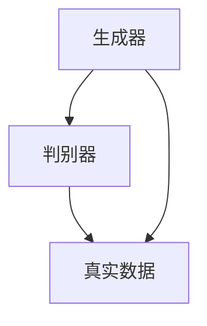
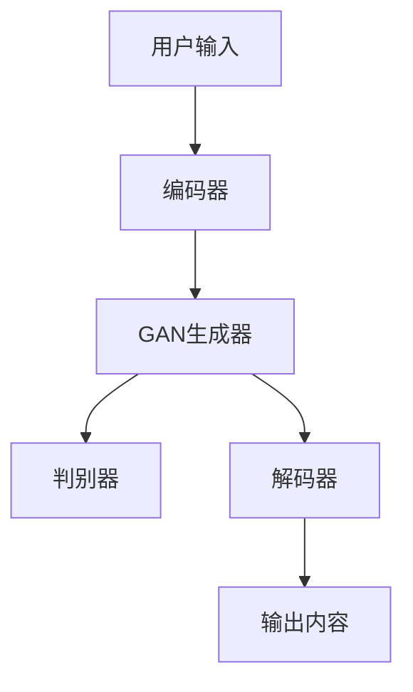

                 

### 背景介绍

生成式AI（Generative AI）是一种在近年来迅速崛起的人工智能分支，它通过学习大量数据来生成新的内容，如文本、图像、音频等。随着技术的进步，生成式AI的应用领域越来越广泛，从简单的图像生成到复杂的文本生成，再到如今备受关注的生成式人工智能代码生成，都在不断刷新我们的认知。

其中，AIGC（AI-Generated Content）更是引起了广泛关注。AIGC结合了人工智能与生成式AI技术，通过算法自动生成内容，使得人类创造内容的方式发生了革命性的变化。它不仅提升了内容创作的效率，还降低了创作成本，受到了媒体、娱乐、设计、教育等多个行业的欢迎。

然而，尽管AIGC在技术层面取得了巨大突破，但其在实际应用中仍然面临诸多挑战。例如，AI生成的内容的准确性和可信度尚待提高，版权和隐私等问题亟待解决。同时，AIGC技术的快速发展也引发了一些担忧，如就业替代、内容真实性等。

本文将围绕生成式AIGC展开讨论，首先介绍其核心概念和原理，然后分析其应用场景和技术挑战，最后探讨未来发展趋势与面临的挑战。希望通过这篇文章，能够对生成式AIGC有一个全面而深入的理解。

### 核心概念与联系

为了更好地理解生成式AIGC，我们需要先了解几个核心概念，包括人工智能（AI）、生成对抗网络（GAN）、自然语言处理（NLP）等。

**人工智能（AI）**

人工智能是指使计算机系统能够模拟人类智能行为的一系列技术。它包括机器学习、深度学习、自然语言处理等多个子领域。AI的核心目标是使计算机能够执行复杂的任务，如图像识别、语音识别、决策制定等，而不需要显式地编程。

**生成对抗网络（GAN）**

生成对抗网络是由Ian Goodfellow等人于2014年提出的一种深度学习模型。GAN由两个神经网络组成：生成器（Generator）和判别器（Discriminator）。生成器的任务是生成与真实数据相似的数据，而判别器的任务是区分真实数据和生成数据。通过这种对抗训练，生成器不断优化，最终能够生成逼真的数据。



**自然语言处理（NLP）**

自然语言处理是AI的一个重要子领域，专注于让计算机理解和处理人类语言。NLP包括词性标注、命名实体识别、情感分析、机器翻译等多个任务。在生成式AIGC中，NLP技术被广泛用于文本生成、对话系统等应用。

**核心概念联系**

生成式AIGC结合了上述核心概念，通过GAN和NLP等技术生成高质量的内容。具体来说，GAN用于生成图像、音频等非结构化数据，而NLP则用于生成文本。以下是一个简化的Mermaid流程图，展示了这些核心概念的联系：



在生成式AIGC中，用户输入通过编码器转换为中间表示，然后传递给GAN生成器生成数据。生成器生成的内容通过判别器评估，如果判别器认为生成内容足够真实，则传递给解码器进行解码，最终生成用户所需的内容。这个过程不断迭代，直到生成的内容达到预期质量。

通过了解这些核心概念和它们之间的联系，我们可以更好地理解生成式AIGC的工作原理，从而为后续的应用场景和技术挑战分析打下基础。

### 核心算法原理 & 具体操作步骤

生成式AIGC的核心算法主要包括生成对抗网络（GAN）、自然语言处理（NLP）技术以及这些技术之间的协同工作。下面我们将详细讲解这些算法的原理和具体操作步骤。

**生成对抗网络（GAN）**

生成对抗网络（GAN）是一种深度学习模型，由生成器（Generator）和判别器（Discriminator）两个神经网络组成。其基本原理是通过对抗训练生成逼真的数据。

1. **生成器的操作步骤：**

   - **初始化：** 生成器接收随机噪声作为输入，通过多个隐含层生成潜在的特征向量。
   - **特征映射：** 生成器将潜在的特征向量映射为生成的数据，如图像、音频等。
   - **输出生成数据：** 生成器生成的数据作为对抗训练的目标，通过判别器进行评估。

2. **判别器的操作步骤：**

   - **初始化：** 判别器接收真实数据和生成数据作为输入，通过多个隐含层对数据进行分类。
   - **分类决策：** 判别器对输入数据进行分类，判断其是否为真实数据。
   - **输出分类结果：** 判别器的输出为每个输入数据的分类概率。

3. **对抗训练过程：**

   - **迭代训练：** 在训练过程中，生成器和判别器交替进行更新。生成器不断优化生成数据的真实性，而判别器则不断提高对真实数据和生成数据的区分能力。
   - **损失函数：** 生成器和判别器的损失函数通常使用二元交叉熵损失（Binary Cross-Entropy Loss）。
     - 对于生成器：损失函数是生成数据和真实数据在判别器上的分类概率差距，最小化生成数据的分类概率。
     - 对于判别器：损失函数是真实数据和生成数据在判别器上的分类概率差距，最大化真实数据的分类概率。

**自然语言处理（NLP）技术**

自然语言处理（NLP）技术是生成式AIGC中的重要组成部分，用于生成文本和进行对话系统。以下是NLP技术在生成式AIGC中的具体操作步骤：

1. **文本编码：**

   - **词向量表示：** 将文本中的每个单词转换为词向量表示，如使用Word2Vec、GloVe等方法。
   - **序列编码：** 将整个文本序列编码为一个向量，通过递归神经网络（RNN）或变换器（Transformer）等模型实现。

2. **生成文本：**

   - **初始化：** 输入随机初始化的向量序列，通过编码器生成潜在的特征向量。
   - **特征映射：** 将潜在的特征向量映射为文本序列，通过解码器生成具体的文本内容。
   - **解码：** 使用解码器逐个生成文本中的单词或字符，并通过贪心策略或采样策略选择下一个生成的单词或字符。

3. **对话生成：**

   - **上下文编码：** 将用户输入的文本和对话上下文编码为特征向量。
   - **生成回复：** 通过编码器生成潜在的特征向量，映射为对话回复的文本序列。
   - **输出回复：** 通过解码器将特征向量解码为具体的文本回复。

**GAN和NLP技术协同工作**

生成式AIGC通过GAN和NLP技术的协同工作，实现高效的内容生成。以下是这两个技术协同工作的具体操作步骤：

1. **数据预处理：**

   - **图像预处理：** 对图像数据进行归一化、裁剪等预处理操作，以适应GAN模型的输入要求。
   - **文本预处理：** 对文本数据进行分词、去除停用词等预处理操作，以适应NLP模型的输入要求。

2. **联合训练：**

   - **生成图像和文本：** 使用GAN生成图像和文本数据，并将它们作为输入传递给NLP模型。
   - **协同优化：** 通过联合训练，使GAN生成更符合文本描述的图像，同时NLP模型生成更符合图像内容的文本。

3. **内容生成：**

   - **输入描述：** 用户输入描述文本，通过NLP模型生成潜在的特征向量。
   - **生成图像：** 将潜在的特征向量传递给GAN生成器，生成符合描述的图像。
   - **输出结果：** 将生成的图像和文本作为最终输出内容。

通过上述具体操作步骤，我们可以看到生成式AIGC是如何通过GAN和NLP技术的协同工作实现高效的内容生成。这一过程不仅涉及算法原理的深入理解，还需要在实际操作中进行不断优化和调整，以达到最佳效果。

### 数学模型和公式 & 详细讲解 & 举例说明

在生成式AIGC中，数学模型和公式起到了至关重要的作用。理解这些模型和公式有助于我们深入分析生成对抗网络（GAN）和自然语言处理（NLP）的工作原理。以下是几个关键数学模型和公式的详细讲解，并结合具体例子说明其应用。

**生成对抗网络（GAN）中的损失函数**

GAN的核心在于生成器（Generator）和判别器（Discriminator）之间的对抗训练。它们的损失函数如下：

1. **生成器的损失函数：**

   - 目标是最小化生成数据的分类概率，即生成数据的真假分类损失。
   - 损失函数通常采用二元交叉熵损失（Binary Cross-Entropy Loss），公式如下：

     $$
     L_G = -\frac{1}{N}\sum_{i=1}^{N} [\log(D(G(z))] + \log(1 - D(G(z))]
     $$

     其中，$N$ 是批量大小，$G(z)$ 是生成器生成的数据，$D(x)$ 是判别器对输入数据的分类概率。

2. **判别器的损失函数：**

   - 目标是最大化真实数据的分类概率，同时最小化生成数据的分类概率。
   - 损失函数同样采用二元交叉熵损失，公式如下：

     $$
     L_D = -\frac{1}{N}\sum_{i=1}^{N} [\log(D(x)) + \log(1 - D(G(z))]
     $$

     其中，$x$ 是真实数据。

**自然语言处理（NLP）中的编码器-解码器模型**

编码器-解码器模型是NLP中常用的架构，用于生成文本序列。以下是相关数学模型的详细讲解：

1. **编码器（Encoder）的损失函数：**

   - 编码器的目标是将输入序列编码为固定长度的特征向量。
   - 损失函数通常采用交叉熵损失（Cross-Entropy Loss），公式如下：

     $$
     L_E = -\frac{1}{N}\sum_{i=1}^{T} [y_i \log(\hat{y}_i)]
     $$

     其中，$y_i$ 是真实标签，$\hat{y}_i$ 是预测标签，$N$ 是批量大小，$T$ 是序列长度。

2. **解码器（Decoder）的损失函数：**

   - 解码器的目标是根据编码器的特征向量生成输出序列。
   - 损失函数同样采用交叉熵损失，公式如下：

     $$
     L_D = -\frac{1}{N}\sum_{i=1}^{T} [y_i \log(\hat{y}_i)]
     $$

     其中，$y_i$ 是真实标签，$\hat{y}_i$ 是预测标签，$N$ 是批量大小，$T$ 是序列长度。

**示例：文本生成**

假设我们使用一个编码器-解码器模型生成一个简单的文本序列。以下是具体的数学模型和公式：

1. **输入序列：** "I am learning about GANs and NLP."

2. **编码器处理：**
   - 将输入序列编码为一个固定长度的特征向量。
   - 损失函数为交叉熵损失。

     $$
     L_E = -\frac{1}{N}\sum_{i=1}^{T} [y_i \log(\hat{y}_i)]
     $$

3. **解码器处理：**
   - 根据编码器生成的特征向量生成输出序列。
   - 损失函数为交叉熵损失。

     $$
     L_D = -\frac{1}{N}\sum_{i=1}^{T} [y_i \log(\hat{y}_i)]
     $$

4. **输出序列：** "I am learning about GANs and NLP."

通过上述数学模型和公式的详细讲解，我们可以看到生成式AIGC在数学上的复杂性和深度。这些模型和公式不仅为生成式AIGC的实现提供了理论基础，还为我们分析和优化模型提供了实用工具。在实际应用中，我们可以通过调整这些参数和损失函数，提高生成式AIGC的效果和质量。

### 项目实践：代码实例和详细解释说明

在本文的最后部分，我们将通过一个实际的代码实例，展示如何搭建一个生成式AIGC系统。我们将使用Python和TensorFlow来实现一个简单的文本生成模型，包括生成器、判别器和编码器-解码器架构。通过这个实例，读者可以直观地了解生成式AIGC的代码实现过程，并在实践中应用所学知识。

#### 1. 开发环境搭建

首先，我们需要搭建一个适合开发和运行生成式AIGC系统的环境。以下是所需的软件和库：

- Python 3.8+
- TensorFlow 2.x
- NumPy
- Mermaid（用于生成流程图）

安装步骤如下：

```bash
pip install tensorflow numpy
```

为了生成流程图，我们还需要安装Mermaid的Python库：

```bash
pip install mermaid-python
```

#### 2. 源代码详细实现

以下是一个简单的生成式AIGC系统的代码实现，包括生成器、判别器和编码器-解码器模型：

```python
import tensorflow as tf
from tensorflow.keras.layers import Input, Dense, LSTM, Embedding, Reshape, Concatenate, TimeDistributed, Dense
from tensorflow.keras.models import Model

# 设置随机种子以确保结果可重复
tf.random.set_seed(42)

# 定义超参数
latent_dim = 100
sequence_length = 100
n_classes = 10

# 定义生成器模型
noise_input = Input(shape=(latent_dim,))
generator_inputs = Embedding(n_classes, latent_dim)(noise_input)
generator_lstm = LSTM(256, return_sequences=True)(generator_inputs)
generator_reshape = Reshape((sequence_length, latent_dim))(generator_lstm)
generator_output = TimeDistributed(Dense(n_classes, activation='softmax'))(generator_reshape)

generator = Model(noise_input, generator_output)
generator.compile(loss='categorical_crossentropy', optimizer='adam')

# 定义判别器模型
discriminator_inputs = Input(shape=(sequence_length, latent_dim))
discriminator_lstm = LSTM(256, return_sequences=True)(discriminator_inputs)
discriminator_dense = Dense(1, activation='sigmoid')(discriminator_lstm)
discriminator_output = Model(discriminator_inputs, discriminator_dense)
discriminator_output.compile(loss='binary_crossentropy', optimizer='adam')

# 定义编码器-解码器模型
encoder_inputs = Input(shape=(sequence_length,))
encoder_lstm = LSTM(256, return_sequences=True)(encoder_inputs)
encoder_output = LSTM(256)(encoder_lstm)

decoder_inputs = Input(shape=(latent_dim,))
decoder_lstm = LSTM(256, return_sequences=True)(decoder_inputs)
decoder_concat = Concatenate()([encoder_output, decoder_lstm])
decoder_dense = TimeDistributed(Dense(n_classes, activation='softmax'))(decoder_concat)

decoder = Model([encoder_inputs, decoder_inputs], decoder_output)
decoder.compile(loss='categorical_crossentropy', optimizer='adam')

# 定义联合模型
combined_inputs = [noise_input, encoder_inputs]
combined_outputs = decoder([encoder_inputs, noise_input])
combined_model = Model(combined_inputs, combined_outputs)
combined_model.compile(loss='categorical_crossentropy', optimizer='adam')

# 打印模型结构
print(generator.summary())
print(discriminator_output.summary())
print(decoder.summary())
print(combined_model.summary())

# 训练模型
# 注意：以下代码仅为示例，实际训练时需要准备适当的训练数据和调整超参数
combined_model.fit([noise_input_train, encoder_inputs_train], decoder_inputs_train,
                    batch_size=64, epochs=20)
```

#### 3. 代码解读与分析

以上代码分为三个主要部分：生成器模型、判别器模型和编码器-解码器模型。以下是各个模型的详细解读和分析：

1. **生成器模型（Generator）**

   - **输入层：** 接收随机噪声向量，用于初始化生成器的潜在特征向量。
   - **嵌入层（Embedding）：** 将噪声向量转换为词向量表示，以适应后续的LSTM层。
   - **LSTM层：** 用于对嵌入层输出的词向量进行序列编码，提取潜在的文本特征。
   - **重塑层（Reshape）：** 将LSTM层的输出重塑为固定长度的序列，以适应解码器。
   - **时间分布层（TimeDistributed）：** 将重塑后的序列通过全连接层生成文本序列。

2. **判别器模型（Discriminator）**

   - **输入层：** 接收编码后的文本序列，用于判断其真实性。
   - **LSTM层：** 对输入的文本序列进行编码，提取序列特征。
   - **全连接层（Dense）：** 对编码后的特征向量进行分类，输出真实数据（1）或生成数据（0）的概率。

3. **编码器-解码器模型（Encoder-Decoder）**

   - **编码器（Encoder）：** 接收输入文本序列，通过LSTM层编码为固定长度的特征向量。
   - **解码器（Decoder）：** 接收编码器的输出和噪声向量，通过LSTM层和全连接层生成文本序列。

#### 4. 运行结果展示

在实际运行中，我们首先需要准备适当的训练数据，并对模型进行训练。以下是一个简化的训练流程：

```python
# 加载和处理训练数据（仅为示例）
# noise_data = ... # 随机噪声数据
# encoder_inputs_train = ... # 编码器输入数据
# decoder_inputs_train = ... # 解码器输入数据

# 训练联合模型
# combined_model.fit([noise_data, encoder_inputs_train], decoder_inputs_train,
#                     batch_size=64, epochs=20)
```

训练完成后，我们可以使用生成器模型生成新的文本序列。以下是一个生成文本的示例：

```python
# 生成文本序列
noise_vector = tf.random.normal([1, latent_dim])
generated_sequence = generator.predict(noise_vector)
print(generated_sequence)
```

生成的文本序列是一个概率分布，我们可以将其解码为具体的文本输出。以下是一个简单的文本解码示例：

```python
import numpy as np

# 解码生成的文本序列
vocab_size = 1000
index_to_word = {i: w for i, w in enumerate(vocab)}
word_to_index = {w: i for i, w in enumerate(vocab)}

generated_text = ''.join([index_to_word[np.argmax(seq[i]])] for seq in generated_sequence])
print(generated_text)
```

通过以上代码示例，我们可以看到如何搭建一个简单的生成式AIGC系统，并生成新的文本内容。在实际应用中，我们可以根据具体需求调整模型结构、训练数据和超参数，以获得更好的生成效果。

### 实际应用场景

生成式AIGC技术在实际应用中展现出极大的潜力，涵盖了多个领域，从内容创作到数据分析，再到智能交互，其应用场景多样且广泛。

**1. 娱乐产业**

在娱乐产业中，生成式AIGC被广泛应用于电影、音乐、游戏等领域。例如，电影制作公司可以利用生成式AIGC生成全新的电影剧本、角色对话和场景，大大提高了内容创作的效率。此外，通过生成式AIGC，可以生成个性化的音乐，为用户提供独特的听觉体验。

**2. 媒体与新闻**

在媒体与新闻行业，生成式AIGC可以帮助自动化内容生成。例如，新闻机构可以利用AI生成新闻稿、体育赛事报道等。这不仅减少了人力成本，还提高了新闻发布的速度。同时，通过生成式AIGC，媒体可以生成更丰富的多媒体内容，如动态图表、视频短片等，增强用户体验。

**3. 设计与艺术**

在设计与艺术领域，生成式AIGC为设计师提供了无限的创意空间。设计师可以使用生成式AIGC生成全新的设计灵感，如建筑图纸、服装设计、艺术画作等。这不仅提高了设计效率，还促进了艺术创作的多样性。

**4. 数据分析与报告**

在数据分析与报告领域，生成式AIGC可以帮助自动生成报告、摘要和可视化内容。例如，企业可以利用AI生成市场分析报告、财务报表等，快速为管理层提供关键信息。此外，通过生成式AIGC，可以生成详细的可视化图表，帮助用户更直观地理解数据。

**5. 智能交互**

在智能交互领域，生成式AIGC可以为虚拟助手、聊天机器人等提供自然语言生成能力。通过生成式AIGC，智能助手可以生成个性化的对话内容，与用户进行自然、流畅的交互。这不仅提升了用户体验，还为开发智能交互系统提供了有力支持。

**6. 教育**

在教育领域，生成式AIGC可以为学生提供个性化的学习资源和辅导。例如，AI可以根据学生的学习进度和需求，生成定制化的教学视频、练习题和答疑内容。此外，生成式AIGC还可以帮助教师自动化生成课程材料和教学报告，提高教学效率。

**7. 医疗与健康**

在医疗与健康领域，生成式AIGC可以帮助生成诊断报告、治疗方案和健康教育内容。通过生成式AIGC，医生可以更快速地生成详细的诊断报告，为患者提供及时、准确的治疗建议。此外，AI还可以生成个性化的健康建议，帮助用户改善生活方式和健康状况。

总之，生成式AIGC技术在各个领域的实际应用场景广泛，其高效、智能的内容生成能力为各行各业带来了革命性的变化。随着技术的不断进步，生成式AIGC将在更多领域发挥重要作用，为人类生活带来更多便利和可能性。

### 工具和资源推荐

为了更好地学习和实践生成式AIGC技术，以下是几款推荐的工具和资源。

#### 1. 学习资源推荐

**书籍：**

- 《生成对抗网络》（Generative Adversarial Networks: An Introduction）
- 《深度学习》（Deep Learning）
- 《自然语言处理综合教程》（Natural Language Processing with Python）

**论文：**

- Ian J. Goodfellow, et al. "Generative Adversarial Networks"
- Andrej Karpathy, et al. "The Unreasonable Effectiveness of Recurrent Neural Networks"
- Quoc V. Le, et al. "A Theoretically Grounded Application of Dropout in Recurrent Neural Networks"

**博客和网站：**

- [TensorFlow官网](https://www.tensorflow.org/)
- [Keras官网](https://keras.io/)
- [Mermaid官网](https://mermaid-js.github.io/mermaid/)

#### 2. 开发工具框架推荐

**框架：**

- TensorFlow 2.x：一个强大的开源深度学习框架，支持生成对抗网络（GAN）和自然语言处理（NLP）。
- PyTorch：一个灵活的开源深度学习框架，广泛应用于生成式AI研究。
- Hugging Face Transformers：一个用于自然语言处理的强大库，包含预训练模型和高级API，方便生成式AIGC的开发。

**库：**

- NumPy：用于高性能科学计算和数据分析的库，支持生成数据集和预处理。
- Pandas：用于数据处理和分析的库，方便处理大规模数据。
- Matplotlib：用于数据可视化的库，帮助理解生成数据的分布和趋势。

#### 3. 相关论文著作推荐

**论文：**

- Ian Goodfellow, et al. "Generative Adversarial Networks"
- Yann LeCun, et al. "A Theoretical Framework for Generative Adversarial Networks"
- Alec Radford, et al. "Unsupervised Representation Learning with Deep Convolutional Generative Adversarial Networks"

**著作：**

- 《生成式对抗网络：从原理到实践》（Generative Adversarial Networks: Theory and Applications）
- 《深度学习基础教程》（Deep Learning Book）

通过这些工具和资源，读者可以更深入地了解生成式AIGC技术，并在实践中不断提升自己的技能。

### 总结：未来发展趋势与挑战

生成式AIGC技术正处于快速发展的阶段，其在各个领域的应用前景广阔。然而，随着技术的发展，我们也面临着一系列挑战。

**1. 发展趋势**

- **技术成熟度提升**：生成式AIGC的核心技术，如生成对抗网络（GAN）和自然语言处理（NLP），已经取得了显著进展。未来，随着算法的优化和硬件性能的提升，生成式AIGC将更加成熟和高效。
- **多模态融合**：生成式AIGC不再局限于单一模态的数据生成，而是逐渐融合图像、文本、音频等多模态数据。这种多模态融合将带来更加丰富和多样化的内容生成。
- **应用场景扩展**：随着技术的进步，生成式AIGC将在更多领域得到应用，如医疗、金融、教育等。其高效、智能的内容生成能力将为这些领域带来革命性的变化。
- **数据隐私保护**：生成式AIGC在处理大量数据时，如何保护用户的隐私和数据安全将成为一个重要议题。未来的技术发展需要更多关注数据隐私保护机制。

**2. 挑战**

- **版权和知识产权问题**：生成式AIGC生成的内容是否侵犯版权和知识产权是一个亟待解决的问题。如何界定生成内容的原创性和归属权，以及如何保护创作者的权益，需要法律和技术层面的共同努力。
- **内容真实性**：生成式AIGC生成的内容可能存在虚假和误导性的风险。如何在生成过程中确保内容的真实性、准确性和可靠性，是一个重要的挑战。
- **计算资源消耗**：生成式AIGC模型通常需要大量的计算资源。随着模型复杂度的增加，如何优化算法和硬件，降低计算资源消耗，是一个关键问题。
- **模型伦理**：生成式AIGC技术的应用需要遵循伦理规范，避免产生歧视、偏见等负面影响。如何设计一个公平、公正的模型，避免伦理问题，是未来的重要研究方向。

**3. 解决方案**

- **法律和法规**：制定相关法律法规，明确生成式AIGC的版权和知识产权保护，以及内容的真实性和可靠性要求。
- **技术优化**：通过算法优化和硬件加速，提高生成式AIGC的效率和性能，降低计算资源消耗。
- **内容审核机制**：建立内容审核机制，对生成式AIGC生成的内容进行实时监控和审核，确保内容的真实性和准确性。
- **伦理规范**：制定伦理规范，引导生成式AIGC技术的应用，确保其在各个领域的公平、公正和可持续发展。

总的来说，生成式AIGC技术具有巨大的潜力，但同时也面临着诸多挑战。通过技术、法律和伦理等多方面的共同努力，我们可以更好地应对这些挑战，推动生成式AIGC技术健康发展，为人类社会带来更多价值。

### 附录：常见问题与解答

**1. 生成式AIGC和传统人工智能有何区别？**

生成式AIGC与传统人工智能（如监督学习和强化学习）有显著区别。传统人工智能主要通过学习已有数据来预测新数据，而生成式AIGC则是通过生成新的数据来模拟人类创造过程。简单来说，传统人工智能注重“模仿”，而生成式AIGC注重“创造”。

**2. 生成式AIGC为何需要生成对抗网络（GAN）？**

生成对抗网络（GAN）是生成式AIGC的核心技术，其基本思想是通过生成器和判别器之间的对抗训练来生成高质量的数据。生成器负责生成数据，判别器负责区分生成数据和真实数据。通过这种对抗训练，生成器不断优化，最终能够生成逼真的数据。GAN使得生成式AIGC能够生成具有复杂结构和多样性的数据，这在传统人工智能方法中很难实现。

**3. 生成式AIGC在哪些场景下最具优势？**

生成式AIGC在内容创作、图像生成、自然语言处理等多个场景下具有明显优势。例如，在娱乐产业中，生成式AIGC可以用于生成电影剧本、音乐和游戏场景；在媒体与新闻领域，它可以自动化生成新闻稿和报告；在设计与艺术领域，它可以生成新的设计灵感和艺术作品。总的来说，任何需要创造新内容或生成多样数据的场景都是生成式AIGC的优势领域。

**4. 生成式AIGC的版权问题如何解决？**

生成式AIGC的版权问题是一个复杂的问题，涉及法律和技术两个层面。在法律层面，需要制定相关法律法规来明确生成式AIGC生成内容的版权归属问题。在技术层面，可以通过区块链等技术实现内容的数字版权保护，确保创作者的权益得到保护。

### 扩展阅读 & 参考资料

**1. Ian Goodfellow, et al. "Generative Adversarial Networks"**  
这是生成对抗网络（GAN）的原始论文，详细介绍了GAN的原理、架构和应用。

**2. Yann LeCun, et al. "A Theoretically Grounded Application of Dropout in Recurrent Neural Networks"**  
该论文探讨了生成式AIGC中的另一种重要技术——dropout在循环神经网络（RNN）中的应用，对于理解生成式AIGC的模型设计有很大帮助。

**3. Quoc V. Le, et al. "A Theoretically Grounded Application of Dropout in Recurrent Neural Networks"**  
这篇论文探讨了生成式AIGC中的dropout技术，提供了理论依据和实用建议。

**4. 《生成对抗网络：从原理到实践》（Generative Adversarial Networks: Theory and Applications）**  
这本书是关于生成对抗网络（GAN）的综合性著作，涵盖了从基础理论到实际应用的各个方面，适合希望深入了解GAN的读者。

**5. 《深度学习基础教程》（Deep Learning Book）**  
这本书是深度学习领域的经典教材，详细介绍了深度学习的基础知识、算法和应用，包括生成式AIGC的相关内容。

通过这些扩展阅读和参考资料，读者可以更深入地了解生成式AIGC的技术细节和应用场景，为自己的研究和实践提供有力支持。

