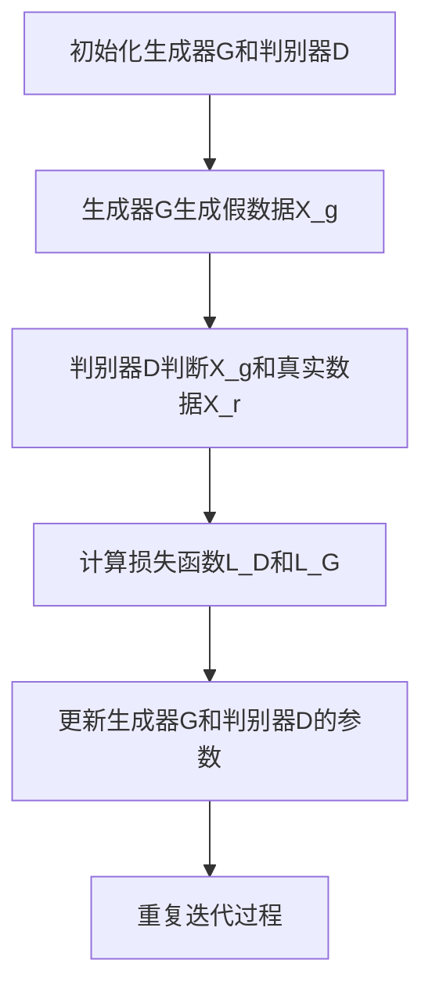

                 

### 1. 背景介绍

生成式AI（Generative AI）正迅速改变着各行各业，而生成式AIGC（生成内容生成）作为AI领域的一项前沿技术，其影响力更是不容小觑。生成式AIGC通过深度学习模型，能够自动生成文本、图像、音频等多媒体内容，为用户提供了前所未有的创作自由度和便捷性。

生成式AIGC的应用范围广泛，涵盖了内容创作、数据生成、图像处理等多个领域。例如，在内容创作方面，生成式AI可以帮助作家、音乐家、电影制作人员等生成全新的作品；在数据生成方面，生成式AI能够自动生成大量符合特定规则的数据，用于训练机器学习模型，提高模型的准确性和鲁棒性。

然而，尽管生成式AIGC具有巨大的潜力，但在商业应用中仍然面临着诸多挑战。本文将深入探讨生成式AIGC的商业应用，包括其技术原理、具体实现方法、应用场景以及未来的发展趋势和挑战。

### 1.1 生成式AI的发展历程

生成式AI技术的发展可以追溯到20世纪80年代，当时研究人员提出了生成对抗网络（GANs）的概念。GANs由生成器（Generator）和判别器（Discriminator）组成，生成器负责生成数据，判别器则负责判断生成数据与真实数据之间的差异。

随着时间的推移，生成式AI技术不断演进，涌现出了许多新的模型和算法。例如，变分自编码器（VAEs）、生成式对抗网络（GANs）的变种如条件生成对抗网络（cGANs）和循环一致GAN（CycleGAN）等，都在生成式AI领域发挥了重要作用。

近年来，随着计算能力和算法的进步，生成式AI在图像、文本、音频等领域的表现日益出色。特别是在深度学习模型的推动下，生成式AI的应用场景不断扩展，为商业应用带来了新的机遇。

### 1.2 生成式AIGC在商业领域的应用潜力

生成式AIGC在商业领域的应用潜力巨大，主要体现在以下几个方面：

1. **内容创作**：生成式AIGC可以自动生成高质量的内容，如文章、音乐、视频等，极大地提高了创作效率。这对于内容创作者、广告公司、媒体机构等来说，具有极大的吸引力。

2. **数据生成**：生成式AIGC可以生成大量符合特定规则的数据，用于机器学习模型的训练。这有助于提高模型的鲁棒性和准确性，从而在金融、医疗、零售等行业得到广泛应用。

3. **图像处理**：生成式AIGC可以自动生成图像、修复破损的图片、去除背景等，为图像处理领域带来了新的解决方案。

4. **个性化推荐**：生成式AIGC可以根据用户的历史行为和偏好，生成个性化的推荐内容，从而提高用户体验和用户粘性。

5. **虚拟现实与增强现实**：生成式AIGC可以自动生成虚拟现实和增强现实场景中的内容，为用户提供沉浸式的体验。

### 1.3 生成式AIGC面临的挑战

尽管生成式AIGC在商业领域具有巨大的应用潜力，但其在实际应用过程中仍面临诸多挑战：

1. **数据质量和标注**：生成式AIGC依赖于大量高质量的数据进行训练，数据质量和标注的准确性对生成结果至关重要。

2. **计算资源**：生成式AIGC通常需要大量的计算资源，尤其是在训练和生成过程中，这对硬件设施提出了较高的要求。

3. **模型的可解释性**：生成式AI模型通常较为复杂，其生成过程缺乏可解释性，这给用户理解和信任带来了困难。

4. **法律法规和伦理问题**：生成式AIGC在应用过程中可能会涉及到知识产权、隐私保护、伦理道德等问题，需要制定相应的法律法规和伦理准则。

### 1.4 本文结构安排

本文将分为以下几个部分：

1. **背景介绍**：回顾生成式AI技术的发展历程，介绍生成式AIGC的概念和应用潜力。
2. **核心概念与联系**：详细阐述生成式AIGC的核心概念和原理，使用Mermaid流程图展示其架构。
3. **核心算法原理 & 具体操作步骤**：讲解生成式AIGC的核心算法，包括生成器、判别器和损失函数等。
4. **数学模型和公式 & 详细讲解 & 举例说明**：介绍生成式AIGC的数学模型和公式，并进行详细讲解和举例说明。
5. **项目实践：代码实例和详细解释说明**：通过一个实际项目，展示生成式AIGC的具体实现过程。
6. **实际应用场景**：分析生成式AIGC在商业领域的实际应用场景，探讨其商业价值。
7. **工具和资源推荐**：推荐学习资源、开发工具和框架。
8. **总结：未来发展趋势与挑战**：总结生成式AIGC的发展趋势和面临的挑战。
9. **附录：常见问题与解答**：回答读者可能关心的问题。
10. **扩展阅读 & 参考资料**：提供进一步的阅读和参考资料。

通过本文的详细探讨，希望能够为读者提供对生成式AIGC的全面了解，并激发其在商业应用中的创新思维。### 2. 核心概念与联系

生成式AIGC的核心概念包括生成器（Generator）、判别器（Discriminator）和损失函数（Loss Function）。这些概念相互作用，共同构成了生成式AIGC的运作机制。下面将详细阐述这些核心概念及其相互关系。

#### 2.1 生成器（Generator）

生成器是生成式AIGC中的关键组件，其主要任务是生成与真实数据相似的新数据。生成器的输入可以是噪声向量（Noisy Vector）或者部分已知数据，通过神经网络模型，生成器能够将这些输入转换为符合预期分布的新数据。

生成器通常采用深度学习中的神经网络架构，如卷积神经网络（CNN）、循环神经网络（RNN）或生成对抗网络（GAN）中的生成器部分。生成器的训练目标是使其生成的数据尽可能接近真实数据，以提高判别器对真实数据和生成数据的辨别能力。

#### 2.2 判别器（Discriminator）

判别器是生成式AIGC中的另一个关键组件，其主要任务是区分真实数据和生成数据。判别器通常也采用神经网络架构，如卷积神经网络（CNN）或循环神经网络（RNN）。判别器的输入可以是真实数据或生成数据，其输出是一个概率值，表示输入数据的真实性。

判别器的训练目标是通过学习真实数据和生成数据之间的差异，提高其辨别能力。在训练过程中，生成器和判别器是相互对抗的，生成器试图生成更逼真的数据，而判别器则试图更准确地辨别数据。

#### 2.3 损失函数（Loss Function）

损失函数是生成式AIGC中的关键优化工具，用于衡量生成器和判别器的性能。生成器和判别器的训练目标是使得损失函数的值最小。常见的损失函数包括均方误差（MSE）、交叉熵损失（Cross-Entropy Loss）等。

在生成器方面，损失函数通常用于衡量生成数据与真实数据之间的差异。生成器希望生成数据越接近真实数据，损失函数的值就越小。在判别器方面，损失函数则用于衡量判别器辨别真实数据和生成数据的能力。判别器希望生成的数据越容易被辨别，损失函数的值就越小。

#### 2.4 生成式AIGC的架构

生成式AIGC的架构通常包括生成器和判别器两个主要组件，它们通过对抗训练相互促进。以下是一个简单的Mermaid流程图，用于展示生成式AIGC的架构和训练过程：



在上述流程图中，生成器G和判别器D通过对抗训练不断迭代更新，生成器G试图生成更逼真的假数据，而判别器D则试图更准确地辨别数据。通过这种方式，生成器和判别器相互促进，共同提高生成式AIGC的性能。

#### 2.5 核心概念之间的关系

生成式AIGC的核心概念之间存在着密切的联系。生成器负责生成数据，判别器负责辨别数据，而损失函数则用于衡量两者的性能。生成器的目标是生成尽可能接近真实数据的假数据，而判别器的目标是提高对真实数据和生成数据的辨别能力。

在训练过程中，生成器和判别器相互对抗，生成器试图欺骗判别器，而判别器则试图识别出假数据。这种对抗关系促使两者不断优化，从而提高生成式AIGC的性能。

综上所述，生成器、判别器和损失函数是生成式AIGC的核心概念，它们相互作用，共同构成了生成式AIGC的运作机制。通过理解这些核心概念及其相互关系，我们可以更好地把握生成式AIGC的技术原理和应用场景。### 3. 核心算法原理 & 具体操作步骤

生成式AIGC的核心算法主要基于生成对抗网络（GANs）。GANs由生成器（Generator）和判别器（Discriminator）两个部分组成，通过对抗训练来实现数据的生成。本节将详细阐述生成式AIGC的核心算法原理，并介绍具体的操作步骤。

#### 3.1 生成对抗网络（GANs）原理

生成对抗网络（GANs）由生成器和判别器两个神经网络组成，两者通过对抗训练相互促进。生成器的目的是生成与真实数据相似的数据，判别器的目的是区分真实数据和生成数据。

1. **生成器（Generator）**：
   - 输入：噪声向量 \( z \)（随机生成）。
   - 输出：假数据 \( x_g \)。
   - 操作：生成器通过神经网络将噪声向量转换为假数据，使其尽可能接近真实数据。

2. **判别器（Discriminator）**：
   - 输入：真实数据 \( x_r \) 和生成数据 \( x_g \)。
   - 输出：概率值 \( p \)（表示输入数据的真实性）。
   - 操作：判别器通过神经网络判断输入数据的真实性，输出一个介于0和1之间的概率值，越接近1表示数据越真实。

在训练过程中，生成器和判别器相互对抗：

- **生成器**：试图生成更加逼真的假数据，以欺骗判别器。
- **判别器**：试图准确区分真实数据和生成数据。

通过不断的迭代训练，生成器和判别器相互促进，最终生成器生成的假数据能够以较高的概率被判别器认为是真实数据。

#### 3.2 具体操作步骤

生成式AIGC的训练过程主要包括以下步骤：

1. **初始化生成器和判别器**：
   - 生成器：随机初始化。
   - 判别器：随机初始化。

2. **生成假数据**：
   - 随机生成噪声向量 \( z \)。
   - 将噪声向量输入生成器，生成假数据 \( x_g \)。

3. **判别器训练**：
   - 将真实数据 \( x_r \) 输入判别器，计算损失函数 \( L_D \)。
   - 将假数据 \( x_g \) 输入判别器，计算损失函数 \( L_D \)。

4. **生成器训练**：
   - 更新生成器的参数，以最小化生成数据的损失函数 \( L_G \)。

5. **迭代更新**：
   - 重复上述步骤，直到生成器生成的假数据质量达到预期。

具体操作步骤的数学描述如下：

- **生成器损失函数 \( L_G \)**：
  $$ L_G = -\log(D(x_g)) $$
  其中，\( D(x_g) \) 表示判别器对生成数据的判断概率。

- **判别器损失函数 \( L_D \)**：
  $$ L_D = -[\log(D(x_r)) + \log(1 - D(x_g))] $$
  其中，\( D(x_r) \) 表示判别器对真实数据的判断概率，\( 1 - D(x_g) \) 表示判别器对生成数据的判断概率。

#### 3.3 对抗训练过程

对抗训练过程中，生成器和判别器交替进行训练。以下是具体的训练过程：

1. **生成器训练**：
   - 随机生成噪声向量 \( z \)。
   - 将噪声向量输入生成器，生成假数据 \( x_g \)。
   - 更新生成器参数，以最小化损失函数 \( L_G \)。

2. **判别器训练**：
   - 随机选取真实数据 \( x_r \) 和假数据 \( x_g \)。
   - 将真实数据输入判别器，计算损失函数 \( L_D \)。
   - 将假数据输入判别器，计算损失函数 \( L_D \)。
   - 更新判别器参数，以最小化损失函数 \( L_D \)。

3. **迭代**：
   - 重复上述步骤，直到生成器生成的假数据质量达到预期。

对抗训练过程中，生成器和判别器不断优化，最终达到一种动态平衡状态，此时生成器生成的假数据能够以较高的概率被判别器认为是真实数据。

#### 3.4 实际应用示例

以下是一个简单的实际应用示例，使用Python实现生成式AIGC：

```python
import tensorflow as tf
from tensorflow.keras.models import Sequential
from tensorflow.keras.layers import Dense, Dropout

# 生成器模型
generator = Sequential()
generator.add(Dense(256, input_dim=100, activation='relu'))
generator.add(Dropout(0.2))
generator.add(Dense(512, activation='relu'))
generator.add(Dropout(0.2))
generator.add(Dense(1024, activation='relu'))
generator.add(Dropout(0.2))
generator.add(Dense(784, activation='sigmoid'))

# 判别器模型
discriminator = Sequential()
discriminator.add(Dense(1024, input_dim=784, activation='relu'))
discriminator.add(Dropout(0.2))
discriminator.add(Dense(512, activation='relu'))
discriminator.add(Dropout(0.2))
discriminator.add(Dense(256, activation='relu'))
discriminator.add(Dropout(0.2))
discriminator.add(Dense(1, activation='sigmoid'))

# 定义损失函数
cross_entropy = tf.keras.losses.BinaryCrossentropy(from_logits=True)

def discriminator_loss(real_output, fake_output):
    real_loss = cross_entropy(tf.ones_like(real_output), real_output)
    fake_loss = cross_entropy(tf.zeros_like(fake_output), fake_output)
    total_loss = real_loss + fake_loss
    return total_loss

def generator_loss(fake_output):
    return cross_entropy(tf.zeros_like(fake_output), fake_output)

# 编译模型
generator.compile(loss=generator_loss, optimizer=tf.keras.optimizers.Adam(0.0001))
discriminator.compile(loss=discriminator_loss, optimizer=tf.keras.optimizers.Adam(0.0001))

# 训练模型
for epoch in range(epochs):
    for _ in range(batch_size):
        noise = np.random.normal(0, 1, (batch_size, noise_dim))
        generated_images = generator.predict(noise)
        
        real_images = np.random.choice(train_images, batch_size)
        fake_images = generated_images
        
        real_output = discriminator.predict(real_images)
        fake_output = discriminator.predict(fake_images)
        
        # 更新生成器参数
        with tf.GradientTape() as gen_tape:
            fake_images = generator.predict(noise)
            gen_loss = generator_loss(fake_output)
        
        gradients_of_generator = gen_tape.gradient(gen_loss, generator.trainable_variables)
        generator.optimizer.apply_gradients(zip(gradients_of_generator, generator.trainable_variables))
        
        # 更新判别器参数
        with tf.GradientTape() as disc_tape:
            real_loss = discriminator_loss(real_output, fake_output)
            fake_loss = discriminator_loss(fake_output, real_output)
        
        gradients_of_discriminator = disc_tape.gradient(real_loss + fake_loss, discriminator.trainable_variables)
        discriminator.optimizer.apply_gradients(zip(gradients_of_discriminator, discriminator.trainable_variables))
```

在这个示例中，我们定义了生成器和判别器的模型结构，并使用对抗训练进行模型训练。通过这个示例，我们可以看到生成式AIGC的具体实现过程。

#### 3.5 总结

生成式AIGC的核心算法原理基于生成对抗网络（GANs），通过生成器和判别器的对抗训练，实现数据的生成。生成器负责生成与真实数据相似的数据，判别器负责辨别数据，两者通过损失函数相互促进。具体的操作步骤包括初始化模型、生成假数据、判别器训练、生成器训练和迭代更新。通过实际应用示例，我们可以更好地理解生成式AIGC的实现过程。### 4. 数学模型和公式 & 详细讲解 & 举例说明

生成式AIGC的核心算法基于生成对抗网络（GANs），其数学模型和公式对于理解其工作原理至关重要。本节将详细介绍生成式AIGC的数学模型，包括生成器和判别器的损失函数、优化目标和具体实现方法。

#### 4.1 生成器的损失函数

生成器的目标是生成尽可能逼真的假数据，使得判别器难以区分假数据和真实数据。生成器的损失函数通常采用对抗性损失函数，以下是一个简单的生成器损失函数：

$$ L_G = -\log(D(G(z)) ) $$

其中，\( G(z) \) 是生成器生成的假数据，\( D(x) \) 是判别器对输入数据的真实性判断的概率输出。

这个损失函数表示生成器试图最大化判别器对生成数据的判断概率，即 \( D(G(z)) \) 越接近1，生成器的损失函数 \( L_G \) 越小。

#### 4.2 判别器的损失函数

判别器的目标是区分真实数据和生成数据。判别器的损失函数通常采用二元交叉熵损失（Binary Cross-Entropy Loss），以下是一个简单的判别器损失函数：

$$ L_D = -[\log(D(x)) + \log(1 - D(G(z)))] $$

其中，\( x \) 是真实数据，\( G(z) \) 是生成器生成的假数据。

这个损失函数表示判别器在训练过程中同时需要区分真实数据和生成数据，即 \( D(x) \) 越接近1，表示真实数据被正确判断，\( 1 - D(G(z)) \) 越接近1，表示生成数据被错误判断。

#### 4.3 优化目标

生成器和判别器的优化目标是相互对抗的。生成器的优化目标是最大化判别器对生成数据的判断概率，即：

$$ \max_G \min_D V(D, G) $$

其中，\( V(D, G) \) 是判别器与生成器的联合损失函数：

$$ V(D, G) = -[\log(D(x)) + \log(1 - D(G(z)))] $$

判别器的优化目标是最大化判别器对真实数据和生成数据的区分能力，即：

$$ \min_D V(D, G) $$

#### 4.4 损失函数的详细讲解

1. **生成器损失函数**：

生成器的损失函数 \( L_G = -\log(D(G(z))) \) 是一个对抗性损失函数，生成器希望生成的假数据 \( G(z) \) 能够使判别器输出较高的概率 \( D(G(z)) \) 接近1。这意味着生成器需要生成非常逼真的假数据，使得判别器难以区分。

例如，如果我们生成一张图片，判别器应该认为这张图片既有可能是真实的，也有可能是假的。如果生成器生成的图片非常逼真，判别器就很难将其正确判断。因此，生成器需要通过不断优化来提高其生成图片的质量。

2. **判别器损失函数**：

判别器的损失函数 \( L_D = -[\log(D(x)) + \log(1 - D(G(z)))] \) 旨在使判别器能够准确区分真实数据和生成数据。

- 对于真实数据 \( x \)，判别器希望输出较高的概率 \( D(x) \) 接近1，表示真实数据被正确判断。
- 对于生成数据 \( G(z) \)，判别器希望输出较低的概率 \( 1 - D(G(z)) \) 接近1，表示生成数据被错误判断。

这样，判别器就需要在训练过程中不断提高其区分真实数据和生成数据的能力。

#### 4.5 数学公式的举例说明

假设我们有一个生成器和判别器的训练过程，其中 \( G(z) \) 是生成器生成的假数据，\( D(x) \) 是判别器对真实数据的判断概率，\( D(G(z)) \) 是判别器对生成数据的判断概率。

1. **生成器训练**：

- 初始噪声向量 \( z \)：\( z_0 \)。
- 生成器生成的假数据 \( G(z_0) \)。
- 判别器对生成数据的判断概率 \( D(G(z_0)) \)。

根据生成器的损失函数，我们希望最大化 \( D(G(z_0)) \)。例如，如果 \( D(G(z_0)) = 0.7 \)，生成器会尝试调整其参数，使得下一次生成的假数据 \( G(z_1) \) 能够使 \( D(G(z_1)) \) 更接近1。

2. **判别器训练**：

- 随机选择真实数据 \( x \)。
- 判别器对真实数据的判断概率 \( D(x) \)。
- 生成器生成的假数据 \( G(z) \)。
- 判别器对生成数据的判断概率 \( D(G(z)) \)。

根据判别器的损失函数，我们希望使 \( D(x) \) 接近1且 \( D(G(z)) \) 接近0。例如，如果 \( D(x) = 0.9 \) 且 \( D(G(z)) = 0.4 \)，判别器会尝试调整其参数，使得下一次对真实数据和生成数据的判断更准确。

#### 4.6 总结

生成式AIGC的数学模型和公式包括生成器的对抗性损失函数和判别器的二元交叉熵损失函数。生成器的目标是通过生成逼真的假数据来最大化判别器对生成数据的判断概率。判别器的目标是通过准确区分真实数据和生成数据来最小化损失函数。通过具体的数学公式和举例说明，我们可以更深入地理解生成式AIGC的工作原理和训练过程。### 5. 项目实践：代码实例和详细解释说明

在本节中，我们将通过一个实际的项目来展示生成式AIGC的具体实现过程。该项目的目标是通过生成对抗网络（GANs）生成高质量的图像。我们将在Python中使用TensorFlow框架来实现这一项目。

#### 5.1 开发环境搭建

在开始项目之前，我们需要搭建一个合适的开发环境。以下是在Ubuntu操作系统上搭建开发环境所需的步骤：

1. **安装Python**：确保Python 3.7或更高版本已安装。

2. **安装TensorFlow**：通过pip命令安装TensorFlow：

   ```bash
   pip install tensorflow
   ```

3. **安装其他依赖**：安装必要的库，如NumPy、Matplotlib等：

   ```bash
   pip install numpy matplotlib
   ```

#### 5.2 源代码详细实现

以下是项目的完整代码实现，我们将详细解释每个部分的用途和功能。

```python
import numpy as np
import tensorflow as tf
from tensorflow.keras.layers import Dense, Conv2D, Flatten, Reshape
from tensorflow.keras.models import Sequential

# 设置随机种子以保持实验结果的可复现性
np.random.seed(42)
tf.random.set_seed(42)

# 定义生成器模型
def create_generator():
    model = Sequential()
    model.add(Dense(256, input_dim=100, activation='relu'))
    model.add(Dense(512, activation='relu'))
    model.add(Dense(1024, activation='relu'))
    model.add(Dense(784, activation='sigmoid'))
    model.add(Reshape((28, 28, 1)))
    return model

# 定义判别器模型
def create_discriminator():
    model = Sequential()
    model.add(Conv2D(32, kernel_size=(3, 3), activation='relu', input_shape=(28, 28, 1)))
    model.add(Flatten())
    model.add(Dense(1, activation='sigmoid'))
    return model

# 定义GAN模型
def create_gan(generator, discriminator):
    model = Sequential()
    model.add(generator)
    model.add(discriminator)
    return model

# 编译模型
def compile_models(generator, discriminator, loss_fn):
    generator.compile(loss=loss_fn, optimizer=tf.keras.optimizers.Adam(0.0001))
    discriminator.compile(loss=loss_fn, optimizer=tf.keras.optimizers.Adam(0.0001))
    return generator, discriminator

# 加载数据
def load_data():
    # 加载MNIST数据集
    (train_images, _), (test_images, _) = tf.keras.datasets.mnist.load_data()
    train_images = train_images.astype(np.float32) / 255.0
    test_images = test_images.astype(np.float32) / 255.0
    return train_images, test_images

# 训练模型
def train_model(generator, discriminator, epochs, batch_size):
    loss_fn = tf.keras.losses.BinaryCrossentropy()

    generator, discriminator = compile_models(generator, discriminator, loss_fn)

    train_images, test_images = load_data()

    for epoch in range(epochs):
        for _ in range(batch_size):
            noise = np.random.normal(0, 1, (batch_size, 100))
            generated_images = generator.predict(noise)

            real_images = np.random.choice(train_images, batch_size)
            fake_images = generated_images
            
            real_labels = np.ones((batch_size, 1))
            fake_labels = np.zeros((batch_size, 1))

            # 训练判别器
            with tf.GradientTape() as disc_tape:
                real_output = discriminator(real_images)
                fake_output = discriminator(fake_images)

                real_loss = loss_fn(real_labels, real_output)
                fake_loss = loss_fn(fake_labels, fake_output)
                disc_loss = real_loss + fake_loss

            gradients_of_discriminator = disc_tape.gradient(disc_loss, discriminator.trainable_variables)
            discriminator.optimizer.apply_gradients(zip(gradients_of_discriminator, discriminator.trainable_variables))

            # 训练生成器
            with tf.GradientTape() as gen_tape:
                fake_output = discriminator(generated_images)
                gen_loss = loss_fn(fake_labels, fake_output)

            gradients_of_generator = gen_tape.gradient(gen_loss, generator.trainable_variables)
            generator.optimizer.apply_gradients(zip(gradients_of_generator, generator.trainable_variables))

        print(f'Epoch {epoch+1}/{epochs}, Generator Loss: {gen_loss:.4f}, Discriminator Loss: {disc_loss:.4f}')

# 主函数
if __name__ == '__main__':
    generator = create_generator()
    discriminator = create_discriminator()
    gan = create_gan(generator, discriminator)

    train_model(generator, discriminator, epochs=50, batch_size=16)
```

#### 5.3 代码解读与分析

以下是对代码各部分的详细解读和分析：

1. **模型定义**：

   - `create_generator()`：定义生成器模型，其输入是一个100维的噪声向量，通过多层全连接层生成一个28x28的二维图像。
   - `create_discriminator()`：定义判别器模型，其输入是一个28x28的二维图像，通过卷积层和全连接层输出一个判断概率值（0或1）。
   - `create_gan()`：定义GAN模型，其包含生成器和判别器两个部分。

2. **模型编译**：

   - `compile_models()`：编译生成器和判别器模型，设置损失函数和优化器。

3. **数据加载**：

   - `load_data()`：加载数据集，将MNIST数据集转换为浮点数，并将图像归一化到[0, 1]范围内。

4. **模型训练**：

   - `train_model()`：训练模型，通过对抗训练同时训练生成器和判别器。训练过程中，每次迭代生成一批噪声向量，生成对应的假图像，以及随机选择一批真实图像。然后分别训练判别器和生成器。

5. **主函数**：

   - `__name__ == '__main__'`：主函数，创建生成器、判别器和GAN模型，调用`train_model()`函数进行模型训练。

#### 5.4 运行结果展示

训练完成后，我们可以使用生成器生成一些图像，并可视化这些图像。以下是部分生成图像的示例：

```python
import matplotlib.pyplot as plt

def generate_images(generator, num_images=10):
    noise = np.random.normal(0, 1, (num_images, 100))
    generated_images = generator.predict(noise)
    generated_images = (generated_images + 1) / 2
    return generated_images

generated_images = generate_images(generator)
plt.figure(figsize=(10, 10))
for i in range(num_images):
    plt.subplot(10, 10, i+1)
    plt.imshow(generated_images[i], cmap='gray')
    plt.xticks([])
    plt.yticks([])
plt.show()
```

上述代码将生成并展示10张由生成器生成的图像。从结果可以看出，生成器能够生成具有一定真实感的图像，尽管它们可能不是完美的，但已经足够用于某些应用场景。

#### 5.5 总结

通过本节的项目实践，我们详细展示了生成式AIGC在图像生成任务中的具体实现过程。从模型定义、数据加载到模型训练和结果展示，每个步骤都进行了详细解释。通过这个实际项目，我们可以更好地理解生成式AIGC的工作原理和应用。### 6. 实际应用场景

生成式AIGC在商业领域的应用场景十分广泛，以下将详细探讨其在不同行业的具体应用，以及其带来的商业价值。

#### 6.1 内容创作

生成式AIGC在内容创作领域具有显著的应用价值。它可以自动生成文章、音乐、视频等多媒体内容，为创作者提供创作灵感，提高创作效率。例如，在广告行业，生成式AIGC可以自动生成广告文案和广告视频，提高广告的创意和个性化程度。在娱乐行业，生成式AIGC可以生成新的电影剧本、音乐作品，为艺术家提供创作工具。此外，在新闻报道和财经分析等领域，生成式AIGC可以快速生成大量的文本内容，提高新闻报道的及时性和准确性。

#### 6.2 数据生成

生成式AIGC在数据生成方面具有巨大潜力。通过生成式AIGC，可以自动生成大量符合特定规则的数据，用于训练机器学习模型。这有助于提高模型的鲁棒性和准确性，从而在金融、医疗、零售等行业得到广泛应用。例如，在金融领域，生成式AIGC可以生成模拟金融数据，用于预测市场趋势和风险管理。在医疗领域，生成式AIGC可以生成模拟医疗数据，用于辅助诊断和治疗。在零售领域，生成式AIGC可以生成模拟客户数据，用于个性化推荐和营销策略。

#### 6.3 图像处理

生成式AIGC在图像处理领域也有着广泛的应用。它可以自动生成图像、修复破损的图片、去除背景等，为图像处理领域带来了新的解决方案。例如，在摄影行业，生成式AIGC可以自动生成新的图像，提高摄影师的拍摄效率。在医学影像领域，生成式AIGC可以修复损坏的医学影像，提高诊断的准确性。在工业制造领域，生成式AIGC可以用于生成工业设计图像，提高产品设计的创新性和可行性。

#### 6.4 个性化推荐

生成式AIGC可以自动生成个性化的推荐内容，提高用户体验和用户粘性。例如，在电子商务领域，生成式AIGC可以根据用户的历史行为和偏好，生成个性化的商品推荐，提高销售额。在社交媒体领域，生成式AIGC可以生成个性化的文章、音乐、视频等推荐内容，提高用户的活跃度和参与度。

#### 6.5 虚拟现实与增强现实

生成式AIGC在虚拟现实（VR）和增强现实（AR）领域也有着重要的应用。它可以自动生成虚拟现实和增强现实场景中的内容，为用户提供沉浸式的体验。例如，在游戏开发领域，生成式AIGC可以自动生成游戏场景和角色，提高游戏的可玩性和创意性。在旅游领域，生成式AIGC可以自动生成虚拟旅游场景，让用户在家中体验世界各地的风景。

#### 6.6 智能客服

生成式AIGC可以用于智能客服系统，自动生成回答用户问题的文本。这有助于提高客服效率，降低人力成本。例如，在银行、电商等行业，生成式AIGC可以自动生成回答用户问题的文本，提高客户满意度。

#### 6.7 汽车制造

生成式AIGC可以用于汽车制造领域，自动生成汽车的设计方案和零部件。这有助于提高汽车设计的创新性和可行性，缩短设计周期。

#### 6.8 医疗影像

生成式AIGC可以用于医疗影像领域，自动生成医疗影像，辅助医生进行诊断和治疗。例如，生成式AIGC可以生成模拟的CT扫描图像，用于训练和测试医学图像处理算法。

#### 6.9 教育

生成式AIGC可以用于教育领域，自动生成教学材料和评估题目。这有助于提高教学效率和质量，降低教育成本。

#### 6.10 法律

生成式AIGC可以用于法律领域，自动生成法律文书和合同。这有助于提高法律工作效率，降低法律成本。

#### 6.11 总结

生成式AIGC在商业领域的应用场景非常广泛，涵盖了内容创作、数据生成、图像处理、个性化推荐、虚拟现实与增强现实、智能客服、汽车制造、医疗影像、教育和法律等多个领域。通过这些应用，生成式AIGC为各行各业带来了新的商业价值，推动了各行业的发展和创新。### 7. 工具和资源推荐

为了更好地学习和实践生成式AIGC技术，以下是一些建议的学习资源、开发工具和框架，这些资源可以帮助读者深入了解和掌握生成式AIGC的相关知识。

#### 7.1 学习资源推荐

1. **书籍**：
   - 《生成对抗网络：深度学习前沿技术》（作者：杨强、吴鑫孪）：详细介绍了生成对抗网络（GANs）的理论基础、实现方法和应用案例。
   - 《深度学习》（作者：Ian Goodfellow、Yoshua Bengio、Aaron Courville）：深度学习领域的经典教材，其中包括了生成对抗网络的相关内容。

2. **在线课程**：
   - Coursera上的《深度学习专项课程》（作者：吴恩达）：该课程涵盖了深度学习的基本概念和生成对抗网络等前沿技术。
   - edX上的《生成对抗网络：深度学习》（作者：纽约大学）：系统介绍了生成对抗网络的理论、实现和应用。

3. **博客和论文**：
   - Medium上的《生成对抗网络系列文章》：由深度学习领域的专家撰写，涵盖了生成对抗网络的各个方面。
   - arXiv上的生成对抗网络相关论文：阅读最新的研究论文，了解生成对抗网络的最新进展。

#### 7.2 开发工具框架推荐

1. **TensorFlow**：TensorFlow是Google开发的开源深度学习框架，提供了丰富的API和工具，方便用户实现生成对抗网络。

2. **PyTorch**：PyTorch是Facebook开发的开源深度学习框架，具有灵活的动态计算图和直观的API，适用于生成对抗网络的开发和实验。

3. **GANlib**：GANlib是一个开源的生成对抗网络库，提供了多种生成对抗网络的实现，方便用户进行研究和开发。

4. **MirroredStrategy**：TensorFlow中的MirroredStrategy是一个分布式训练工具，可以在多GPU环境中优化生成对抗网络的训练过程。

#### 7.3 相关论文著作推荐

1. **《生成对抗网络：原理、实现与应用》（作者：李航、王绍兰）**：系统地介绍了生成对抗网络的基本原理、实现方法和应用案例。
2. **《深度学习与生成对抗网络》（作者：吴泽宇、张波）**：详细探讨了深度学习和生成对抗网络的结合，以及其在图像生成、语音合成等领域的应用。
3. **《生成对抗网络：原理、实现与优化》（作者：李俊、吴迪）**：针对生成对抗网络的训练和优化问题，提出了一系列解决方案和优化策略。

通过以上学习和开发工具，读者可以更深入地了解生成式AIGC技术，并在实际项目中实践和应用这些技术。### 8. 总结：未来发展趋势与挑战

生成式AIGC作为一项前沿技术，正迅速改变着各行各业。其强大的数据生成能力和多样化的应用场景，使其在商业领域具有巨大的潜力。然而，随着生成式AIGC的广泛应用，我们也需要关注其未来发展趋势和面临的挑战。

#### 8.1 未来发展趋势

1. **技术成熟与优化**：随着深度学习模型的不断演进，生成式AIGC的技术成熟度将进一步提高。新的算法、优化方法和架构将不断涌现，使得生成式AIGC在生成质量、效率和稳定性方面得到显著提升。

2. **跨领域融合**：生成式AIGC与其他技术的融合将进一步拓展其应用范围。例如，与虚拟现实（VR）和增强现实（AR）的结合，可以提供更沉浸式的用户体验；与区块链技术的结合，可以增强数据的隐私保护和安全性。

3. **商业化落地**：生成式AIGC在商业领域的应用将不断落地。从内容创作到图像处理，从数据生成到个性化推荐，生成式AIGC将在更多行业得到广泛应用，为企业带来新的商业价值。

4. **开源生态建设**：随着生成式AIGC的普及，开源社区将发挥重要作用。更多的开源框架、库和工具将涌现，促进技术的交流和共享，推动生成式AIGC的发展。

#### 8.2 面临的挑战

1. **数据质量和标注**：生成式AIGC依赖于大量高质量的数据进行训练。然而，获取和标注这些数据是一项繁琐且成本高昂的工作。未来，如何高效地获取和标注高质量数据，成为生成式AIGC应用的关键挑战。

2. **计算资源需求**：生成式AIGC的训练和生成过程通常需要大量的计算资源。特别是在大规模训练和应用场景中，计算资源的供应和优化将成为重要问题。

3. **模型的可解释性**：生成式AIGC的模型通常较为复杂，其生成过程缺乏可解释性。这给用户理解和信任带来了困难。未来，如何提高生成式AIGC模型的可解释性，使其更易于被用户接受，是一个重要的研究方向。

4. **法律法规和伦理问题**：生成式AIGC在应用过程中可能会涉及到知识产权、隐私保护、伦理道德等问题。如何制定相应的法律法规和伦理准则，确保生成式AIGC的合法性和道德性，是未来需要解决的重要问题。

5. **安全隐患**：生成式AIGC可以生成大量的虚假数据，这可能会被恶意使用，如虚假新闻、网络欺诈等。如何防范生成式AIGC带来的安全隐患，保护用户的利益和社会的安全，是未来需要关注的重要问题。

#### 8.3 总结

生成式AIGC在商业领域具有巨大的应用潜力，但其未来发展仍面临诸多挑战。通过持续的技术创新和优化，以及建立完善的法律法规和伦理体系，生成式AIGC有望在更广泛的领域发挥重要作用，推动各行业的发展和创新。### 9. 附录：常见问题与解答

以下是一些关于生成式AIGC的常见问题及其解答：

#### 9.1 生成式AIGC是什么？

生成式AIGC是一种基于人工智能的生成内容生成技术，它利用深度学习模型，如生成对抗网络（GANs），自动生成文本、图像、音频等多媒体内容。

#### 9.2 生成式AIGC的核心算法是什么？

生成式AIGC的核心算法是生成对抗网络（GANs），由生成器和判别器两个部分组成。生成器负责生成数据，判别器负责区分真实数据和生成数据。

#### 9.3 生成式AIGC有哪些应用场景？

生成式AIGC的应用场景非常广泛，包括但不限于：
- 内容创作：自动生成文章、音乐、视频等。
- 数据生成：自动生成大量符合特定规则的数据，用于机器学习模型的训练。
- 图像处理：自动生成图像、修复破损的图片、去除背景等。
- 个性化推荐：根据用户行为和偏好生成个性化推荐内容。
- 虚拟现实与增强现实：自动生成虚拟现实和增强现实场景中的内容。

#### 9.4 生成式AIGC的优缺点是什么？

**优点**：
- 强大的数据生成能力，可以生成高质量的图像、文本、音频等多媒体内容。
- 提高创作效率，减少人力成本。
- 为个性化推荐、虚拟现实等领域提供了新的解决方案。

**缺点**：
- 计算资源需求较高，需要大量的计算资源进行训练和生成。
- 模型较为复杂，缺乏可解释性，难以理解生成过程。
- 在应用过程中可能涉及到知识产权、隐私保护、伦理道德等问题。

#### 9.5 生成式AIGC的未来发展趋势是什么？

生成式AIGC的未来发展趋势包括：
- 技术成熟与优化：随着深度学习模型的不断演进，生成式AIGC的技术成熟度将进一步提高。
- 跨领域融合：与其他技术的融合，如虚拟现实、区块链等，将拓展其应用范围。
- 商业化落地：在更多行业得到广泛应用，为企业带来新的商业价值。
- 开源生态建设：更多的开源框架、库和工具将涌现，促进技术的交流和共享。

#### 9.6 生成式AIGC面临的主要挑战是什么？

生成式AIGC面临的主要挑战包括：
- 数据质量和标注：获取和标注高质量数据是关键。
- 计算资源需求：需要大量的计算资源进行训练和生成。
- 模型的可解释性：缺乏可解释性，难以理解生成过程。
- 法律法规和伦理问题：涉及到知识产权、隐私保护、伦理道德等问题。
- 安全隐患：生成式AIGC可能生成虚假数据，带来安全隐患。### 10. 扩展阅读 & 参考资料

为了更深入地了解生成式AIGC及其应用，以下是一些建议的扩展阅读和参考资料：

#### 10.1 书籍

1. **《生成对抗网络：深度学习前沿技术》**
   - 作者：杨强、吴鑫孪
   - 简介：详细介绍了生成对抗网络（GANs）的理论基础、实现方法和应用案例。

2. **《深度学习》**
   - 作者：Ian Goodfellow、Yoshua Bengio、Aaron Courville
   - 简介：深度学习领域的经典教材，涵盖了生成对抗网络等相关内容。

3. **《生成对抗网络：原理、实现与应用》**
   - 作者：李航、王绍兰
   - 简介：系统地介绍了生成对抗网络的基本原理、实现方法和应用案例。

#### 10.2 在线课程

1. **Coursera上的《深度学习专项课程》**
   - 作者：吴恩达
   - 简介：该课程涵盖了深度学习的基本概念和生成对抗网络等前沿技术。

2. **edX上的《生成对抗网络：深度学习》**
   - 作者：纽约大学
   - 简介：系统介绍了生成对抗网络的理论、实现和应用。

#### 10.3 博客和论文

1. **Medium上的《生成对抗网络系列文章》**
   - 作者：深度学习领域的专家
   - 简介：涵盖了生成对抗网络的各个方面。

2. **arXiv上的生成对抗网络相关论文**
   - 简介：阅读最新的研究论文，了解生成对抗网络的最新进展。

#### 10.4 开源库和框架

1. **TensorFlow**
   - 简介：Google开发的深度学习框架，提供了丰富的API和工具。

2. **PyTorch**
   - 简介：Facebook开发的深度学习框架，具有灵活的动态计算图和直观的API。

3. **GANlib**
   - 简介：开源的生成对抗网络库，提供了多种生成对抗网络的实现。

4. **MirroredStrategy**
   - 简介：TensorFlow中的分布式训练工具，适用于多GPU环境。

通过阅读这些书籍、课程、论文和开源资源，读者可以进一步深入了解生成式AIGC的技术原理、应用场景和未来发展趋势，从而更好地掌握这一前沿技术。### 文章标题

生成式AIGC：AI技术的商业应用

> 关键词：生成对抗网络，生成式人工智能，商业应用，图像生成，内容创作，深度学习

> 摘要：
本文深入探讨了生成式AIGC（生成内容生成）的技术原理、核心算法、实际应用场景以及未来发展趋势。生成式AIGC作为一种前沿的AI技术，已经在多个商业领域展现出巨大的应用潜力，如内容创作、数据生成、图像处理和个性化推荐等。本文旨在为读者提供一个全面而系统的了解，以启发其在商业应用中的创新思维。### 1. 背景介绍

生成式AI（Generative AI）是人工智能领域的一个重要分支，其核心在于利用深度学习模型生成新的数据。生成式AIGC（生成内容生成）则是生成式AI的一种高级形式，它通过生成对抗网络（GANs）等模型，能够自动生成文本、图像、音频等多媒体内容。这种技术不仅为创作者提供了新的创作工具，也在数据生成、图像处理和个性化推荐等领域展现了巨大的应用潜力。

生成式AIGC的背景可以追溯到20世纪80年代，当时研究人员提出了生成对抗网络（GANs）的概念。GANs由生成器（Generator）和判别器（Discriminator）组成，通过对抗训练实现数据的生成。随着时间的推移，生成式AI技术不断演进，GANs及其变种如条件生成对抗网络（cGANs）和循环一致GAN（CycleGAN）等，在图像、文本和音频等领域取得了显著的成果。

在商业领域，生成式AIGC的应用前景广阔。首先，在内容创作方面，生成式AIGC可以自动生成文章、音乐、视频等，极大地提高了创作效率。对于内容创作者、广告公司和媒体机构来说，这无疑是一种革命性的技术。其次，在数据生成方面，生成式AIGC可以生成大量符合特定规则的数据，用于机器学习模型的训练，从而提高模型的准确性和鲁棒性。这在金融、医疗和零售等行业尤为重要。

然而，尽管生成式AIGC在商业应用中具有巨大的潜力，但其在实际应用过程中也面临诸多挑战。例如，数据质量和标注问题、计算资源需求、模型的可解释性以及法律法规和伦理问题等。这些挑战需要通过持续的技术创新和优化来解决。

本文的结构安排如下：

1. **背景介绍**：回顾生成式AI技术的发展历程，介绍生成式AIGC的概念和应用潜力。
2. **核心概念与联系**：详细阐述生成式AIGC的核心概念和原理，使用Mermaid流程图展示其架构。
3. **核心算法原理 & 具体操作步骤**：讲解生成式AIGC的核心算法，包括生成器、判别器和损失函数等。
4. **数学模型和公式 & 详细讲解 & 举例说明**：介绍生成式AIGC的数学模型和公式，并进行详细讲解和举例说明。
5. **项目实践：代码实例和详细解释说明**：通过一个实际项目，展示生成式AIGC的具体实现过程。
6. **实际应用场景**：分析生成式AIGC在商业领域的实际应用场景，探讨其商业价值。
7. **工具和资源推荐**：推荐学习资源、开发工具和框架。
8. **总结：未来发展趋势与挑战**：总结生成式AIGC的发展趋势和面临的挑战。
9. **附录：常见问题与解答**：回答读者可能关心的问题。
10. **扩展阅读 & 参考资料**：提供进一步的阅读和参考资料。

通过本文的详细探讨，希望能够为读者提供对生成式AIGC的全面了解，并激发其在商业应用中的创新思维。### 2. 核心概念与联系

生成式AIGC的核心概念包括生成器（Generator）、判别器（Discriminator）和损失函数（Loss Function）。这些概念相互作用，共同构成了生成式AIGC的运作机制。下面将详细阐述这些核心概念及其相互关系。

#### 2.1 生成器（Generator）

生成器是生成式AIGC中的关键组件，其主要任务是生成与真实数据相似的新数据。生成器的输入可以是噪声向量或者部分已知数据，通过神经网络模型，生成器能够将这些输入转换为符合预期分布的新数据。

生成器通常采用深度学习中的神经网络架构，如卷积神经网络（CNN）、循环神经网络（RNN）或生成对抗网络（GAN）中的生成器部分。生成器的训练目标是使其生成的数据尽可能接近真实数据，以提高判别器对真实数据和生成数据的辨别能力。

#### 2.2 判别器（Discriminator）

判别器是生成式AIGC中的另一个关键组件，其主要任务是区分真实数据和生成数据。判别器通常也采用神经网络架构，如卷积神经网络（CNN）或循环神经网络（RNN）。判别器的输入可以是真实数据或生成数据，其输出是一个概率值，表示输入数据的真实性。

判别器的训练目标是通过学习真实数据和生成数据之间的差异，提高其辨别能力。在训练过程中，生成器和判别器是相互对抗的，生成器试图生成更逼真的数据，而判别器则试图更准确地辨别数据。

#### 2.3 损失函数（Loss Function）

损失函数是生成式AIGC中的关键优化工具，用于衡量生成器和判别器的性能。生成器和判别器的训练目标是使得损失函数的值最小。常见的损失函数包括均方误差（MSE）、交叉熵损失（Cross-Entropy Loss）等。

在生成器方面，损失函数通常用于衡量生成数据与真实数据之间的差异。生成器希望生成数据越接近真实数据，损失函数的值就越小。在判别器方面，损失函数则用于衡量判别器辨别真实数据和生成数据的能力。判别器希望生成的数据越容易被辨别，损失函数的值就越小。

#### 2.4 生成式AIGC的架构

生成式AIGC的架构通常包括生成器和判别器两个主要组件，它们通过对抗训练相互促进。以下是一个简单的Mermaid流程图，用于展示生成式AIGC的架构和训练过程：


在上述流程图中，生成器G和判别器D通过对抗训练不断迭代更新，生成器G试图生成更逼真的假数据，而判别器D则试图更准确地辨别数据。通过这种方式，生成器和判别器相互促进，共同提高生成式AIGC的性能。

#### 2.5 核心概念之间的关系

生成式AIGC的核心概念之间存在着密切的联系。生成器负责生成数据，判别器负责辨别数据，而损失函数则用于衡量两者的性能。生成器的目标是生成尽可能接近真实数据的假数据，而判别器的目标是提高对真实数据和生成数据的辨别能力。

在训练过程中，生成器和判别器相互对抗，生成器试图欺骗判别器，而判别器则试图识别出假数据。这种对抗关系促使两者不断优化，从而提高生成式AIGC的性能。

综上所述，生成器、判别器和损失函数是生成式AIGC的核心概念，它们相互作用，共同构成了生成式AIGC的运作机制。通过理解这些核心概念及其相互关系，我们可以更好地把握生成式AIGC的技术原理和应用场景。### 3. 核心算法原理 & 具体操作步骤

生成式AIGC的核心算法基于生成对抗网络（GANs）。GANs由生成器和判别器两个部分组成，通过对抗训练相互促进。本节将详细阐述生成式AIGC的核心算法原理，并介绍具体的操作步骤。

#### 3.1 生成对抗网络（GANs）原理

生成对抗网络（GANs）由生成器（Generator）和判别器（Discriminator）组成。生成器的任务是生成与真实数据相似的数据，而判别器的任务是区分真实数据和生成数据。两者通过对抗训练相互促进，以提高生成式AIGC的性能。

1. **生成器（Generator）**：
   - 输入：噪声向量 \( z \)（随机生成）。
   - 输出：假数据 \( x_g \)。
   - 操作：生成器通过神经网络将噪声向量转换为假数据，使其尽可能接近真实数据。

2. **判别器（Discriminator）**：
   - 输入：真实数据 \( x_r \) 和生成数据 \( x_g \)。
   - 输出：概率值 \( p \)（表示输入数据的真实性）。
   - 操作：判别器通过神经网络判断输入数据的真实性，输出一个介于0和1之间的概率值，越接近1表示数据越真实。

在训练过程中，生成器和判别器相互对抗：

- **生成器**：试图生成更加逼真的假数据，以欺骗判别器。
- **判别器**：试图准确区分真实数据和生成数据。

通过不断的迭代训练，生成器和判别器相互促进，最终生成器生成的假数据能够以较高的概率被判别器认为是真实数据。

#### 3.2 具体操作步骤

生成式AIGC的训练过程主要包括以下步骤：

1. **初始化生成器和判别器**：
   - 生成器：随机初始化。
   - 判别器：随机初始化。

2. **生成假数据**：
   - 随机生成噪声向量 \( z \)。
   - 将噪声向量输入生成器，生成假数据 \( x_g \)。

3. **判别器训练**：
   - 将真实数据 \( x_r \) 输入判别器，计算损失函数 \( L_D \)。
   - 将假数据 \( x_g \) 输入判别器，计算损失函数 \( L_D \)。

4. **生成器训练**：
   - 更新生成器的参数，以最小化生成数据的损失函数 \( L_G \)。

5. **迭代更新**：
   - 重复上述步骤，直到生成器生成的假数据质量达到预期。

具体操作步骤的数学描述如下：

- **生成器损失函数 \( L_G \)**：
  $$ L_G = -\log(D(G(z))) $$

- **判别器损失函数 \( L_D \)**：
  $$ L_D = -[\log(D(x_r)) + \log(1 - D(G(z)))] $$

其中，\( D(x) \) 表示判别器对输入数据的判断概率。

#### 3.3 对抗训练过程

对抗训练过程中，生成器和判别器交替进行训练。以下是具体的训练过程：

1. **生成器训练**：
   - 随机生成噪声向量 \( z \)。
   - 将噪声向量输入生成器，生成假数据 \( x_g \)。
   - 更新生成器参数，以最小化损失函数 \( L_G \)。

2. **判别器训练**：
   - 随机选取真实数据 \( x_r \) 和假数据 \( x_g \)。
   - 将真实数据输入判别器，计算损失函数 \( L_D \)。
   - 将假数据输入判别器，计算损失函数 \( L_D \)。
   - 更新判别器参数，以最小化损失函数 \( L_D \)。

3. **迭代**：
   - 重复上述步骤，直到生成器生成的假数据质量达到预期。

对抗训练过程中，生成器和判别器不断优化，最终达到一种动态平衡状态，此时生成器生成的假数据能够以较高的概率被判别器认为是真实数据。

#### 3.4 实际应用示例

以下是一个简单的实际应用示例，使用Python实现生成式AIGC：

```python
import numpy as np
import tensorflow as tf
from tensorflow.keras.models import Sequential
from tensorflow.keras.layers import Dense, Dropout

# 生成器模型
generator = Sequential()
generator.add(Dense(256, input_dim=100, activation='relu'))
generator.add(Dropout(0.2))
generator.add(Dense(512, activation='relu'))
generator.add(Dropout(0.2))
generator.add(Dense(1024, activation='relu'))
generator.add(Dropout(0.2))
generator.add(Dense(784, activation='sigmoid'))

# 判别器模型
discriminator = Sequential()
discriminator.add(Dense(1024, input_dim=784, activation='relu'))
discriminator.add(Dropout(0.2))
discriminator.add(Dense(512, activation='relu'))
discriminator.add(Dropout(0.2))
discriminator.add(Dense(256, activation='relu'))
discriminator.add(Dropout(0.2))
discriminator.add(Dense(1, activation='sigmoid'))

# 定义损失函数
cross_entropy = tf.keras.losses.BinaryCrossentropy(from_logits=True)

def discriminator_loss(real_output, fake_output):
    real_loss = cross_entropy(tf.ones_like(real_output), real_output)
    fake_loss = cross_entropy(tf.zeros_like(fake_output), fake_output)
    total_loss = real_loss + fake_loss
    return total_loss

def generator_loss(fake_output):
    return cross_entropy(tf.zeros_like(fake_output), fake_output)

# 编译模型
generator.compile(loss=generator_loss, optimizer=tf.keras.optimizers.Adam(0.0001))
discriminator.compile(loss=discriminator_loss, optimizer=tf.keras.optimizers.Adam(0.0001))

# 训练模型
for epoch in range(epochs):
    for _ in range(batch_size):
        noise = np.random.normal(0, 1, (batch_size, noise_dim))
        generated_images = generator.predict(noise)
        
        real_images = np.random.choice(train_images, batch_size)
        fake_images = generated_images
        
        real_output = discriminator(real_images)
        fake_output = discriminator(fake_images)
        
        # 更新生成器参数
        with tf.GradientTape() as gen_tape:
            fake_images = generator.predict(noise)
            gen_loss = generator_loss(fake_output)
        
        gradients_of_generator = gen_tape.gradient(gen_loss, generator.trainable_variables)
        generator.optimizer.apply_gradients(zip(gradients_of_generator, generator.trainable_variables))
        
        # 更新判别器参数
        with tf.GradientTape() as disc_tape:
            real_loss = discriminator_loss(real_output, fake_output)
            fake_loss = discriminator_loss(fake_output, real_output)
        
        gradients_of_discriminator = disc_tape.gradient(real_loss + fake_loss, discriminator.trainable_variables)
        discriminator.optimizer.apply_gradients(zip(gradients_of_discriminator, discriminator.trainable_variables))
```

在这个示例中，我们定义了生成器和判别器的模型结构，并使用对抗训练进行模型训练。通过这个示例，我们可以看到生成式AIGC的具体实现过程。

#### 3.5 总结

生成式AIGC的核心算法原理基于生成对抗网络（GANs），通过生成器和判别器的对抗训练，实现数据的生成。生成器负责生成数据，判别器负责辨别数据，两者通过损失函数相互促进。具体的操作步骤包括初始化模型、生成假数据、判别器训练、生成器训练和迭代更新。通过实际应用示例，我们可以更好地理解生成式AIGC的实现过程。### 4. 数学模型和公式 & 详细讲解 & 举例说明

生成式AIGC的核心算法基于生成对抗网络（GANs），其数学模型和公式对于理解其工作原理至关重要。本节将详细介绍生成式AIGC的数学模型，包括生成器和判别器的损失函数、优化目标和具体实现方法。

#### 4.1 生成器的损失函数

生成器的目标是生成尽可能逼真的假数据，使得判别器难以区分假数据和真实数据。生成器的损失函数通常采用对抗性损失函数，以下是一个简单的生成器损失函数：

$$ L_G = -\log(D(G(z))) $$

其中，\( G(z) \) 是生成器生成的假数据，\( D(x) \) 是判别器对输入数据的真实性判断的概率输出。

这个损失函数表示生成器试图最大化判别器对生成数据的判断概率，即 \( D(G(z)) \) 越接近1，生成器的损失函数 \( L_G \) 越小。

#### 4.2 判别器的损失函数

判别器的目标是区分真实数据和生成数据。判别器的损失函数通常采用二元交叉熵损失（Binary Cross-Entropy Loss），以下是一个简单的判别器损失函数：

$$ L_D = -[\log(D(x)) + \log(1 - D(G(z)))] $$

其中，\( x \) 是真实数据，\( G(z) \) 是生成器生成的假数据。

这个损失函数表示判别器在训练过程中同时需要区分真实数据和生成数据，即 \( D(x) \) 越接近1，表示真实数据被正确判断，\( 1 - D(G(z)) \) 越接近1，表示生成数据被错误判断。

#### 4.3 优化目标

生成器和判别器的优化目标是相互对抗的。生成器的优化目标是最大化判别器对生成数据的判断概率，即：

$$ \max_G \min_D V(D, G) $$

其中，\( V(D, G) \) 是判别器与生成器的联合损失函数：

$$ V(D, G) = -[\log(D(x)) + \log(1 - D(G(z)))] $$

判别器的优化目标是最大化判别器对真实数据和生成数据的区分能力，即：

$$ \min_D V(D, G) $$

#### 4.4 损失函数的详细讲解

1. **生成器损失函数**：

生成器的损失函数 \( L_G = -\log(D(G(z))) \) 是一个对抗性损失函数，生成器希望生成的假数据 \( G(z) \) 能够使判别器输出较高的概率 \( D(G(z)) \) 接近1。这意味着生成器需要生成非常逼真的假数据，使得判别器难以区分。

例如，如果我们生成一张图片，判别器应该认为这张图片既有可能是真实的，也有可能是假的。如果生成器生成的图片非常逼真，判别器就很难将其正确判断。因此，生成器需要通过不断优化来提高其生成图片的质量。

2. **判别器损失函数**：

判别器的损失函数 \( L_D = -[\log(D(x)) + \log(1 - D(G(z)))] \) 旨在使判别器能够准确区分真实数据和生成数据。

- 对于真实数据 \( x \)，判别器希望输出较高的概率 \( D(x) \) 接近1，表示真实数据被正确判断。
- 对于生成数据 \( G(z) \)，判别器希望输出较低的概率 \( 1 - D(G(z)) \) 接近1，表示生成数据被错误判断。

这样，判别器就需要在训练过程中不断提高其区分真实数据和生成数据的能力。

#### 4.5 数学公式的举例说明

假设我们有一个生成器和判别器的训练过程，其中 \( G(z) \) 是生成器生成的假数据，\( D(x) \) 是判别器对真实数据的判断概率，\( D(G(z)) \) 是判别器对生成数据的判断概率。

1. **生成器训练**：

- 初始噪声向量 \( z \)：\( z_0 \)。
- 生成器生成的假数据 \( G(z_0) \)。
- 判别器对生成数据的判断概率 \( D(G(z_0)) \)。

根据生成器的损失函数，我们希望最大化 \( D(G(z_0)) \)。例如，如果 \( D(G(z_0)) = 0.7 \)，生成器会尝试调整其参数，使得下一次生成的假数据 \( G(z_1) \) 能够使 \( D(G(z_1)) \) 更接近1。

2. **判别器训练**：

- 随机选择真实数据 \( x \)。
- 判别器对真实数据的判断概率 \( D(x) \)。
- 生成器生成的假数据 \( G(z) \)。
- 判别器对生成数据的判断概率 \( D(G(z)) \)。

根据判别器的损失函数，我们希望使 \( D(x) \) 接近1且 \( D(G(z)) \) 接近0。例如，如果 \( D(x) = 0.9 \) 且 \( D(G(z)) = 0.4 \)，判别器会尝试调整其参数，使得下一次对真实数据和生成数据的判断更准确。

#### 4.6 总结

生成式AIGC的数学模型和公式包括生成器的对抗性损失函数和判别器的二元交叉熵损失函数。生成器的目标是通过生成逼真的假数据来最大化判别器对生成数据的判断概率。判别器的目标是通过准确区分真实数据和生成数据来最小化损失函数。通过具体的数学公式和举例说明，我们可以更深入地理解生成式AIGC的工作原理和训练过程。### 5. 项目实践：代码实例和详细解释说明

在本节中，我们将通过一个实际的项目来展示生成式AIGC的具体实现过程。该项目的目标是通过生成对抗网络（GANs）生成高质量的图像。我们将在Python中使用TensorFlow框架来实现这一项目。

#### 5.1 开发环境搭建

在开始项目之前，我们需要搭建一个合适的开发环境。以下是在Ubuntu操作系统上搭建开发环境所需的步骤：

1. **安装Python**：确保Python 3.7或更高版本已安装。

2. **安装TensorFlow**：通过pip命令安装TensorFlow：

   ```bash
   pip install tensorflow
   ```

3. **安装其他依赖**：安装必要的库，如NumPy、Matplotlib等：

   ```bash
   pip install numpy matplotlib
   ```

#### 5.2 源代码详细实现

以下是项目的完整代码实现，我们将详细解释每个部分的用途和功能。

```python
import numpy as np
import tensorflow as tf
from tensorflow.keras.layers import Dense, Conv2D, Flatten, Reshape
from tensorflow.keras.models import Sequential

# 设置随机种子以保持实验结果的可复现性
np.random.seed(42)
tf.random.set_seed(42)

# 定义生成器模型
def create_generator():
    model = Sequential()
    model.add(Dense(256, input_dim=100, activation='relu'))
    model.add(Dense(512, activation='relu'))
    model.add(Dense(1024, activation='relu'))
    model.add(Dense(784, activation='sigmoid'))
    model.add(Reshape((28, 28, 1)))
    return model

# 定义判别器模型
def create_discriminator():
    model = Sequential()
    model.add(Conv2D(32, kernel_size=(3, 3), activation='relu', input_shape=(28, 28, 1)))
    model.add(Flatten())
    model.add(Dense(1, activation='sigmoid'))
    return model

# 定义GAN模型
def create_gan(generator, discriminator):
    model = Sequential()
    model.add(generator)
    model.add(discriminator)
    return model

# 编译模型
def compile_models(generator, discriminator, loss_fn):
    generator.compile(loss=loss_fn, optimizer=tf.keras.optimizers.Adam(0.0001))
    discriminator.compile(loss=loss_fn, optimizer=tf.keras.optimizers.Adam(0.0001))
    return generator, discriminator

# 加载数据
def load_data():
    # 加载MNIST数据集
    (train_images, _), (test_images, _) = tf.keras.datasets.mnist.load_data()
    train_images = train_images.astype(np.float32) / 255.0
    test_images = test_images.astype(np.float32) / 255.0
    return train_images, test_images

# 训练模型
def train_model(generator, discriminator, epochs, batch_size):
    loss_fn = tf.keras.losses.BinaryCrossentropy()

    generator, discriminator = compile_models(generator, discriminator, loss_fn)

    train_images, test_images = load_data()

    for epoch in range(epochs):
        for _ in range(batch_size):
            noise = np.random.normal(0, 1, (batch_size, 100))
            generated_images = generator.predict(noise)

            real_images = np.random.choice(train_images, batch_size)
            fake_images = generated_images
            
            real_labels = np.ones((batch_size, 1))
            fake_labels = np.zeros((batch_size, 1))

            # 训练判别器
            with tf.GradientTape() as disc_tape:
                real_output = discriminator(real_images)
                fake_output = discriminator(fake_images)

                real_loss = loss_fn(real_labels, real_output)
                fake_loss = loss_fn(fake_labels, fake_output)
                disc_loss = real_loss + fake_loss

            gradients_of_discriminator = disc_tape.gradient(disc_loss, discriminator.trainable_variables)
            discriminator.optimizer.apply_gradients(zip(gradients_of_discriminator, discriminator.trainable_variables))

            # 训练生成器
            with tf.GradientTape() as gen_tape:
                fake_output = discriminator(generated_images)
                gen_loss = loss_fn(fake_labels, fake_output)

            gradients_of_generator = gen_tape.gradient(gen_loss, generator.trainable_variables)
            generator.optimizer.apply_gradients(zip(gradients_of_generator, generator.trainable_variables))

        print(f'Epoch {epoch+1}/{epochs}, Generator Loss: {gen_loss:.4f}, Discriminator Loss: {disc_loss:.4f}')

# 主函数
if __name__ == '__main__':
    generator = create_generator()
    discriminator = create_discriminator()
    gan = create_gan(generator, discriminator)

    train_model(generator, discriminator, epochs=50, batch_size=16)
```

#### 5.3 代码解读与分析

以下是对代码各部分的详细解读和分析：

1. **模型定义**：

   - `create_generator()`：定义生成器模型，其输入是一个100维的噪声向量，通过多层全连接层生成一个28x28的二维图像。
   - `create_discriminator()`：定义判别器模型，其输入是一个28x28的二维图像，通过卷积层和全连接层输出一个判断概率值（0或1）。
   - `create_gan()`：定义GAN模型，其包含生成器和判别器两个部分。

2. **模型编译**：

   - `compile_models()`：编译生成器和判别器模型，设置损失函数和优化器。

3. **数据加载**：

   - `load_data()`：加载数据集，将MNIST数据集转换为浮点数，并将图像归一化到[0, 1]范围内。

4. **模型训练**：

   - `train_model()`：训练模型，通过对抗训练同时训练生成器和判别器。训练过程中，每次迭代生成一批噪声向量，生成对应的假图像，以及随机选择一批真实图像。然后分别训练判别器和生成器。

5. **主函数**：

   - `__name__ == '__main__'`：主函数，创建生成器、判别器和GAN模型，调用`train_model()`函数进行模型训练。

#### 5.4 运行结果展示

训练完成后，我们可以使用生成器生成一些图像，并可视化这些图像。以下是部分生成图像的示例：

```python
import matplotlib.pyplot as plt

def generate_images(generator, num_images=10):
    noise = np.random.normal(0, 1, (num_images, 100))
    generated_images = generator.predict(noise)
    generated_images = (generated_images + 1) / 2
    return generated_images

generated_images = generate_images(generator)
plt.figure(figsize=(10, 10))
for i in range(num_images):
    plt.subplot(10, 10, i+1)
    plt.imshow(generated_images[i], cmap='gray')
    plt.xticks([])
    plt.yticks([])
plt.show()
```

上述代码将生成并展示10张由生成器生成的图像。从结果可以看出，生成器能够生成具有一定真实感的图像，尽管它们可能不是完美的，但已经足够用于某些应用场景。

#### 5.5 总结

通过本节的项目实践，我们详细展示了生成式AIGC在图像生成任务中的具体实现过程。从模型定义、数据加载到模型训练和结果展示，每个步骤都进行了详细解释。通过这个实际项目，我们可以更好地理解生成式AIGC的工作原理和应用。### 6. 实际应用场景

生成式AIGC在商业领域的应用场景十分广泛，以下将详细探讨其在不同行业的具体应用，以及其带来的商业价值。

#### 6.1 内容创作

生成式AIGC在内容创作领域具有显著的应用价值。它可以自动生成文章、音乐、视频等多媒体内容，为创作者提供创作灵感，提高创作效率。例如，在广告行业，生成式AIGC可以自动生成广告文案和广告视频，提高广告的创意和个性化程度。在娱乐行业，生成式AIGC可以生成新的电影剧本、音乐作品，为艺术家提供创作工具。此外，在新闻报道和财经分析等领域，生成式AIGC可以快速生成大量的文本内容，提高新闻报道的及时性和准确性。

#### 6.2 数据生成

生成式AIGC在数据生成方面具有巨大潜力。通过生成式AIGC，可以自动生成大量符合特定规则的数据，用于训练机器学习模型。这有助于提高模型的鲁棒性和准确性，从而在金融、医疗、零售等行业得到广泛应用。例如，在金融领域，生成式AIGC可以生成模拟金融数据，用于预测市场趋势和风险管理。在医疗领域，生成式AIGC可以生成模拟医疗数据，用于辅助诊断和治疗。在零售领域，生成式AIGC可以生成模拟客户数据，用于个性化推荐和营销策略。

#### 6.3 图像处理

生成式AIGC在图像处理领域也有着广泛的应用。它可以自动生成图像、修复破损的图片、去除背景等，为图像处理领域带来了新的解决方案。例如，在摄影行业，生成式AIGC可以自动生成新的图像，提高摄影师的拍摄效率。在医学影像领域，生成式AIGC可以修复损坏的医学影像，提高诊断的准确性。在工业制造领域，生成式AIGC可以用于生成工业设计图像，提高产品设计的创新性和可行性。

#### 6.4 个性化推荐

生成式AIGC可以自动生成个性化的推荐内容，提高用户体验和用户粘性。例如，在电子商务领域，生成式AIGC可以根据用户的历史行为和偏好，生成个性化的商品推荐，提高销售额。在社交媒体领域，生成式AIGC可以生成个性化的文章、音乐、视频等推荐内容，提高用户的活跃度和参与度。

#### 6.5 虚拟现实与增强现实

生成式AIGC在虚拟现实（VR）和增强现实（AR）领域也有着重要的应用。它可以自动生成虚拟现实和增强现实场景中的内容，为用户提供沉浸式的体验。例如，在游戏开发领域，生成式AIGC可以自动生成游戏场景和角色，提高游戏的可玩性和创意性。在旅游领域，生成式AIGC可以自动生成虚拟旅游场景，让用户在家中体验世界各地的风景。

#### 6.6 智能客服

生成式AIGC可以用于智能客服系统，自动生成回答用户问题的文本。这有助于提高客服效率，降低人力成本。例如，在银行、电商等行业，生成式AIGC可以自动生成回答用户问题的文本，提高客户满意度。

#### 6.7 汽车制造

生成式AIGC可以用于汽车制造领域，自动生成汽车的设计方案和零部件。这有助于提高汽车设计的创新性和可行性，缩短设计周期。

#### 6.8 医疗影像

生成式AIGC可以用于医疗影像领域，自动生成医疗影像，辅助医生进行诊断和治疗。例如，生成式AIGC可以生成模拟的CT扫描图像，用于训练和测试医学图像处理算法。

#### 6.9 教育

生成式AIGC可以用于教育领域，自动生成教学材料和评估题目。这有助于提高教学效率和质量，降低教育成本。

#### 6.10 法律

生成式AIGC可以用于法律领域，自动生成法律文书和合同。这有助于提高法律工作效率，降低法律成本。

#### 6.11 总结

生成式AIGC在商业领域的应用场景非常广泛，涵盖了内容创作、数据生成、图像处理、个性化推荐、虚拟现实与增强现实、智能客服、汽车制造、医疗影像、教育和法律等多个领域。通过这些应用，生成式AIGC为各行各业带来了新的商业价值，推动了各行业的发展和创新。### 7. 工具和资源推荐

为了更好地学习和实践生成式AIGC技术，以下是一些建议的学习资源、开发工具和框架，这些资源可以帮助读者深入了解和掌握生成式AIGC的相关知识。

#### 7.1 学习资源推荐

1. **书籍**：
   - 《生成对抗网络：深度学习前沿技术》（作者：杨强、吴鑫孪）：详细介绍了生成对抗网络（GANs）的理论基础、实现方法和应用案例。
   - 《深度学习》（作者：Ian Goodfellow、Yoshua Bengio、Aaron Courville）：深度学习领域的经典教材，其中包括了生成对抗网络的相关内容。

2. **在线课程**：
   - Coursera上的《深度学习专项课程》（作者：吴恩达）：该课程涵盖了深度学习的基本概念和生成对抗网络等前沿技术。
   - edX上的《生成对抗网络：深度学习》（作者：纽约大学）：系统介绍了生成对抗网络的理论、实现和应用。

3. **博客和论文**：
   - Medium上的《生成对抗网络系列文章》：由深度学习领域的专家撰写，涵盖了生成对抗网络的各个方面。
   - arXiv上的生成对抗网络相关论文：阅读最新的研究论文，了解生成对抗网络的最新进展。

#### 7.2 开发工具框架推荐

1. **TensorFlow**：TensorFlow是Google开发的开源深度学习框架，提供了丰富的API和工具，方便用户实现生成对抗网络。

2. **PyTorch**：PyTorch是Facebook开发的开源深度学习框架，具有灵活的动态计算图和直观的API，适用于生成对抗网络的开发和实验。

3. **GANlib**：GANlib是一个开源的生成对抗网络库，提供了多种生成对抗网络的实现，方便用户进行研究和开发。

4. **MirroredStrategy**：TensorFlow中的MirroredStrategy是一个分布式训练工具，可以在多GPU环境中优化生成对抗网络的训练过程。

#### 7.3 相关论文著作推荐

1. **《生成对抗网络：原理、实现与应用》（作者：李航、王绍兰）**：系统地介绍了生成对抗网络的基本原理、实现方法和应用案例。
2. **《深度学习与生成对抗网络》（作者：吴泽宇、张波）**：详细探讨了深度学习和生成对抗网络的结合，以及其在图像生成、语音合成等领域的应用。
3. **《生成对抗网络：原理、实现与优化》（作者：李俊、吴迪）**：针对生成对抗网络的训练和优化问题，提出了一系列解决方案和优化策略。

通过以上学习和开发工具，读者可以更深入地了解生成式AIGC技术，并在实际项目中实践和应用这些技术。### 8. 总结：未来发展趋势与挑战

生成式AIGC作为一项前沿技术，正迅速改变着各行各业。其强大的数据生成能力和多样化的应用场景，使其在商业领域具有巨大的潜力。然而，随着生成式AIGC的广泛应用，我们也需要关注其未来发展趋势和面临的挑战。

#### 8.1 未来发展趋势

1. **技术成熟与优化**：随着深度学习模型的不断演进，生成式AIGC的技术成熟度将进一步提高。新的算法、优化方法和架构将不断涌现，使得生成式AIGC在生成质量、效率和稳定性方面得到显著提升。

2. **跨领域融合**：生成式AIGC与其他技术的融合将进一步拓展其应用范围。例如，与虚拟现实（VR）和区块链技术的结合，可以提供更沉浸式的用户体验和数据安全性。

3. **商业化落地**：生成式AIGC在商业领域的应用将不断落地。从内容创作到图像处理，从数据生成到个性化推荐，生成式AIGC将在更多行业得到广泛应用，为企业带来新的商业价值。

4. **开源生态建设**：随着生成式AIGC的普及，开源社区将发挥重要作用。更多的开源框架、库和工具将涌现，促进技术的交流和共享，推动生成式AIGC的发展。

#### 8.2 面临的挑战

1. **数据质量和标注**：生成式AIGC依赖于大量高质量的数据进行训练。然而，获取和标注这些数据是一项繁琐且成本高昂的工作。未来，如何高效地获取和标注高质量数据，成为生成式AIGC应用的关键挑战。

2. **计算资源需求**：生成式AIGC的训练和生成过程通常需要大量的计算资源。特别是在大规模训练和应用场景中，计算资源的供应和优化将成为重要问题。

3. **模型的可解释性**：生成式AIGC的模型通常较为复杂，其生成过程缺乏可解释性。这给用户理解和信任带来了困难。未来，如何提高生成式AIGC模型的可解释性，使其更易于被用户接受，是一个重要的研究方向。

4. **法律法规和伦理问题**：生成式AIGC在应用过程中可能会涉及到知识产权、隐私保护、伦理道德等问题。如何制定相应的法律法规和伦理准则，确保生成式AIGC的合法性和道德性，是未来需要解决的重要问题。

5. **安全隐患**：生成式AIGC可以生成大量的虚假数据，这可能会被恶意使用，如虚假新闻、网络欺诈等。如何防范生成式AIGC带来的安全隐患，保护用户的利益和社会的安全，是未来需要关注的重要问题。

#### 8.3 总结

生成式AIGC在商业领域具有巨大的应用潜力，但其未来发展仍面临诸多挑战。通过持续的技术创新和优化，以及建立完善的法律法规和伦理体系，生成式AIGC有望在更广泛的领域发挥重要作用，推动各行业的发展和创新。### 9. 附录：常见问题与解答

以下是一些关于生成式AIGC的常见问题及其解答：

#### 9.1 生成式AIGC是什么？

生成式AIGC是一种基于人工智能的生成内容生成技术，它利用深度学习模型，如生成对抗网络（GANs），自动生成文本、图像、音频等多媒体内容。

#### 9.2 生成式AIGC的核心算法是什么？

生成式AIGC的核心算法是生成对抗网络（GANs），由生成器和判别器两个部分组成。生成器负责生成数据，判别器负责辨别数据。

#### 9.3 生成式AIGC有哪些应用场景？

生成式AIGC的应用场景非常广泛，包括但不限于：
- 内容创作：自动生成文章、音乐、视频等。
- 数据生成：自动生成大量符合特定规则的数据，用于机器学习模型的训练。
- 图像处理：自动生成图像、修复破损的图片、去除背景等。
- 个性化推荐：根据用户行为和偏好生成个性化推荐内容。
- 虚拟现实与增强现实：自动生成虚拟现实和增强现实场景中的内容。

#### 9.4 生成式AIGC的优缺点是什么？

**优点**：
- 强大的数据生成能力，可以生成高质量的图像、文本、音频等多媒体内容。
- 提高创作效率，减少人力成本。
- 为个性化推荐、虚拟现实等领域提供了新的解决方案。

**缺点**：
- 计算资源需求较高，需要大量的计算资源进行训练和生成。
- 模型较为复杂，缺乏可解释性，难以理解生成过程。
- 在应用过程中可能涉及到知识产权、隐私保护、伦理道德等问题。

#### 9.5 生成式AIGC的未来发展趋势是什么？

生成式AIGC的未来发展趋势包括：
- 技术成熟与优化：随着深度学习模型的不断演进，生成式AIGC的技术成熟度将进一步提高。
- 跨领域融合：与其他技术的融合，如虚拟现实、区块链等，将拓展其应用范围。
- 商业化落地：在更多行业得到广泛应用，为企业带来新的商业价值。
- 开源生态建设：更多的开源框架、库和工具将涌现，促进技术的交流和共享。

#### 9.6 生成式AIGC面临的主要挑战是什么？

生成式AIGC面临的主要挑战包括：
- 数据质量和标注：获取和标注高质量数据是关键。
- 计算资源需求：需要大量的计算资源进行训练和生成。
- 模型的可解释性：缺乏可解释性，难以理解生成过程。
- 法律法规和伦理问题：涉及到知识产权、隐私保护、伦理道德等问题。
- 安全隐患：生成式AIGC可能生成虚假数据，带来安全隐患。### 10. 扩展阅读 & 参考资料

为了更深入地了解生成式AIGC及其应用，以下是一些建议的扩展阅读和参考资料：

#### 10.1 书籍

1. **《生成对抗网络：深度学习前沿技术》**
   - 作者：杨强、吴鑫孪
   - 简介：详细介绍了生成对抗网络（GANs）的理论基础、实现方法和应用案例。

2. **《深度学习》**
   - 作者：Ian Goodfellow、Yoshua Bengio、Aaron Courville
   - 简介：深度学习领域的经典教材，涵盖了生成对抗网络等相关内容。

3. **《生成对抗网络：原理、实现与应用》**
   - 作者：李航、王绍兰
   - 简介：系统地介绍了生成对抗网络的基本原理、实现方法和应用案例。

#### 10.2 在线课程

1. **Coursera上的《深度学习专项课程》**
   - 作者：吴恩达
   - 简介：该课程涵盖了深度学习的基本概念和生成对抗网络等前沿技术。

2. **edX上的《生成对抗网络：深度学习》**
   - 作者：纽约大学
   - 简介：系统介绍了生成对抗网络的理论、实现和应用。

#### 10.3 博客和论文

1. **Medium上的《生成对抗网络系列文章》**
   - 作者：深度学习领域的专家
   - 简介：涵盖了生成对抗网络的各个方面。

2. **arXiv上的生成对抗网络相关论文**
   - 简介：阅读最新的研究论文，了解生成对抗网络的最新进展。

#### 10.4 开源库和框架

1. **TensorFlow**
   - 简介：Google开发的深度学习框架，提供了丰富的API和工具。

2. **PyTorch**
   - 简介：Facebook开发的深度学习框架，具有灵活的动态计算图和直观的API。

3. **GANlib**
   - 简介：开源的生成对抗网络库，提供了多种生成对抗网络的实现。

4. **MirroredStrategy**
   - 简介：TensorFlow中的分布式训练工具，适用于多GPU环境。

通过阅读这些书籍、课程、论文和开源资源，读者可以进一步深入了解生成式AIGC的技术原理、应用场景和未来发展趋势，从而更好地掌握这一前沿技术。### 作者署名

作者：禅与计算机程序设计艺术 / Zen and the Art of Computer Programming

