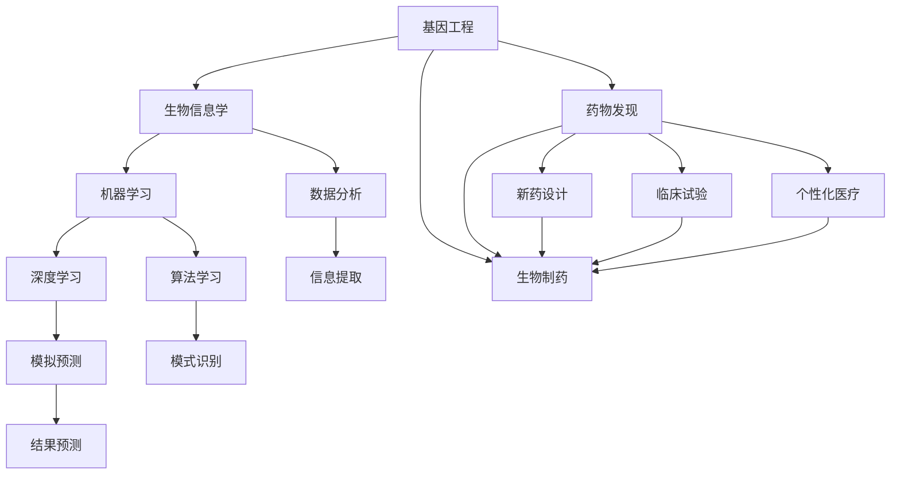

                 

### 背景介绍

#### 生物制药行业概述

生物制药，作为现代医药领域的重要组成部分，通过利用生物体（包括微生物、植物和动物细胞等）或其代谢产物来开发药物。自20世纪80年代以来，生物制药行业经历了迅猛的发展，逐渐从传统的化学药物转向更加复杂且个性化的生物药物。这一转变不仅满足了患者对疗效和安全性日益增长的需求，也为制药行业带来了新的机遇和挑战。

生物制药行业的发展离不开技术的进步。随着基因工程、细胞工程、生物信息学等前沿技术的突破，生物制药的效率和质量得到了显著提升。近年来，人工智能（AI）技术的兴起为生物制药行业带来了新的变革，不仅提高了药物研发的效率，还推动了个性化医疗的发展。

#### 人工智能在生物制药中的应用

人工智能技术在生物制药领域的应用逐渐深入，涵盖了药物发现、新药设计、临床试验等多个环节。以下是一些典型的应用场景：

1. **药物发现**：AI可以帮助研究人员在海量数据中快速筛选潜在的药物分子，通过机器学习算法预测药物与靶点之间的相互作用，从而提高药物研发的成功率。
   
2. **新药设计**：基于深度学习和分子模拟，AI可以设计出具有特定结构和功能的药物分子，甚至可以优化现有药物的结构，提高其疗效和安全性。

3. **临床试验**：AI技术可以分析大规模的临床数据，识别患者对药物的响应模式，预测药物的安全性和疗效，从而优化临床试验设计。

4. **个性化医疗**：AI可以帮助医生根据患者的基因信息、病史和生活习惯，制定个性化的治疗方案，提高治疗效果。

#### 文章核心内容概述

本文将围绕人工智能在生物制药领域的创新体系进行深入探讨。首先，我们将介绍生物制药行业的背景和现状，以及人工智能技术的基本概念和应用。接下来，我们将详细分析人工智能在药物发现、新药设计、临床试验和个性化医疗等方面的具体应用，并探讨这些应用所涉及的核心算法和数学模型。随后，我们将通过项目实践实例展示人工智能在生物制药中的实际应用，并分析其效果。最后，我们将讨论生物制药领域人工智能应用的未来发展趋势和面临的挑战，并提供相关的学习资源和工具推荐。

通过本文的阅读，读者将全面了解人工智能在生物制药领域的最新进展和应用，以及对这一行业的潜在影响。我们希望本文能够为从事生物制药和人工智能研究的专业人士提供有价值的参考和启示。

---

## 2. 核心概念与联系

在深入探讨人工智能在生物制药领域的创新应用之前，我们需要明确几个核心概念，并了解它们之间的相互联系。这些核心概念包括基因工程、生物信息学、机器学习、深度学习等，它们共同构成了生物制药AI创新体系的基础。

### 基因工程

基因工程是生物制药的基础技术之一。它通过修改生物体的基因序列，使其能够生产特定的蛋白质或其他生物分子。基因工程的关键步骤包括基因克隆、基因编辑、基因表达等。这些步骤使得科学家能够创造性地设计出具有特定功能的生物系统，从而用于药物开发。

### 生物信息学

生物信息学是生物学与信息学的交叉学科，它利用计算机技术和数据分析方法研究生物信息。在生物制药领域，生物信息学技术被广泛应用于基因序列分析、蛋白质结构预测、代谢通路分析等。通过生物信息学，科学家可以从大量的生物数据中提取有价值的信息，为药物研发提供数据支持。

### 机器学习

机器学习是人工智能的一个重要分支，它通过算法从数据中学习规律，并进行预测和决策。在生物制药领域，机器学习被广泛应用于药物发现、新药设计、临床试验分析等。机器学习算法可以帮助科学家从海量的数据中快速筛选潜在的药物分子，预测药物与靶点之间的相互作用，从而提高药物研发的效率。

### 深度学习

深度学习是机器学习的一种方法，它通过构建多层神经网络模拟人脑的神经元结构和工作方式。深度学习在图像识别、语音识别、自然语言处理等领域取得了显著的成果。在生物制药领域，深度学习被用于分子模拟、药物设计、基因组分析等，通过处理和分析复杂的生物数据，深度学习技术能够发现潜在的治疗方案。

### 核心概念与联系

这些核心概念相互关联，共同构成了生物制药AI创新体系的基础。基因工程提供了生物制药的物质基础，生物信息学提供了数据分析和处理的方法，机器学习和深度学习则利用这些数据，通过算法和模型发现药物研发中的规律和模式。

下面，我们将使用Mermaid流程图展示这些核心概念及其相互联系。请注意，流程图中不应包含括号、逗号等特殊字符，以确保图形的准确性和可读性。



通过这个流程图，我们可以清晰地看到基因工程、生物信息学、机器学习和深度学习在生物制药中的应用及其相互之间的联系。在接下来的章节中，我们将详细探讨这些概念在生物制药领域的具体应用和作用。

---

## 3. 核心算法原理 & 具体操作步骤

在了解了生物制药AI创新体系中的核心概念后，接下来我们将深入探讨这些概念在药物研发中的具体应用。核心算法原理包括机器学习和深度学习在药物发现、新药设计、临床试验和个性化医疗等方面的应用。下面，我们将详细讲解这些算法的基本原理和具体操作步骤。

### 3.1 药物发现中的机器学习应用

在药物发现过程中，机器学习算法被广泛应用于从海量数据中筛选潜在的药物分子。以下是一个典型的机器学习药物发现流程：

**步骤1：数据收集与预处理**
- **数据收集**：收集已有的药物分子数据、生物活性数据以及相关生物学背景信息。
- **数据预处理**：对收集到的数据进行清洗、标准化和归一化处理，确保数据的质量和一致性。

**步骤2：特征提取**
- **分子特征提取**：利用化学信息学工具提取药物分子的化学结构特征，如分子指纹、拓扑指纹等。
- **生物特征提取**：提取与药物作用相关的生物特征，如蛋白质结构、细胞信号通路等。

**步骤3：模型训练**
- **选择模型**：根据具体问题选择合适的机器学习模型，如支持向量机（SVM）、随机森林（RF）等。
- **训练模型**：使用预处理后的数据和特征，训练机器学习模型。

**步骤4：模型评估与优化**
- **模型评估**：使用交叉验证等方法评估模型性能，如准确率、召回率等。
- **模型优化**：根据评估结果调整模型参数，提高模型性能。

**步骤5：结果预测与筛选**
- **预测与筛选**：利用训练好的模型对新的药物分子进行预测，筛选出具有潜在药物活性的分子。

### 3.2 深度学习在新药设计中的应用

深度学习在新药设计中的应用主要体现在分子模拟和药物设计两个方面。以下是一个深度学习药物设计的基本流程：

**步骤1：数据收集与预处理**
- **数据收集**：收集已有的药物分子结构、生物活性数据及相关生物学背景信息。
- **数据预处理**：对药物分子进行结构优化，并提取相关特征。

**步骤2：模型训练**
- **选择模型**：根据具体任务选择合适的深度学习模型，如卷积神经网络（CNN）、生成对抗网络（GAN）等。
- **训练模型**：使用预处理后的数据训练深度学习模型，包括分子生成、结构预测等。

**步骤3：分子生成与优化**
- **分子生成**：使用深度学习模型生成新的药物分子结构。
- **分子优化**：对生成的分子进行结构优化，提高其生物活性和稳定性。

**步骤4：评估与筛选**
- **模型评估**：使用已知药物分子的生物活性数据评估深度学习模型的性能。
- **筛选候选药物**：根据模型预测的生物活性筛选出潜在的药物候选分子。

### 3.3 个性化医疗中的机器学习与深度学习应用

个性化医疗的核心在于根据患者的基因信息、病史和生活习惯制定个性化的治疗方案。以下是一个典型的个性化医疗流程：

**步骤1：数据收集与预处理**
- **数据收集**：收集患者的基因数据、临床数据和生活方式数据。
- **数据预处理**：清洗、标准化和归一化数据，确保数据的一致性和质量。

**步骤2：特征提取**
- **基因特征提取**：利用生物信息学工具提取与疾病相关的基因特征。
- **临床特征提取**：提取与疾病和治疗相关的临床特征。

**步骤3：模型训练**
- **选择模型**：选择合适的机器学习或深度学习模型，如决策树、神经网络等。
- **训练模型**：使用预处理后的数据和特征训练模型。

**步骤4：预测与决策**
- **预测与决策**：利用训练好的模型预测患者的治疗效果和副作用，制定个性化的治疗方案。

通过上述核心算法原理和具体操作步骤的讲解，我们可以看到人工智能技术在生物制药领域的广泛应用和巨大潜力。在接下来的章节中，我们将通过项目实践实例进一步探讨这些算法在生物制药中的应用效果。

---

## 4. 数学模型和公式 & 详细讲解 & 举例说明

在探讨人工智能在生物制药领域的应用时，数学模型和公式起到了至关重要的作用。这些模型和公式不仅帮助我们理解数据背后的规律，还为算法的优化和性能提升提供了理论基础。下面，我们将详细介绍一些关键的数学模型和公式，并通过具体例子进行详细讲解。

### 4.1 药物-靶点相互作用预测模型

药物与生物靶点（如蛋白质）的相互作用是药物研发中的关键环节。常用的预测模型包括基于图的模型、基于特征向量的模型等。

**4.1.1 图模型**

一个典型的图模型是图卷积网络（GCN），其公式如下：

$$
h_{\mathbf{v}}^{(k+1)} = \sigma (\sum_{\mathbf{v} \in \mathcal{N}(\mathbf{u})} \alpha_{\mathbf{u}\mathbf{v}} h_{\mathbf{u}}^{(k)} W^{(k)})
$$

其中，$h_{\mathbf{v}}^{(k)}$表示节点$\mathbf{v}$在迭代$k$后的特征表示，$\mathcal{N}(\mathbf{v})$表示节点$\mathbf{v}$的邻域节点集合，$\alpha_{\mathbf{u}\mathbf{v}}$是节点之间边的权重，$W^{(k)}$是图卷积层的权重矩阵，$\sigma$是激活函数（通常使用ReLU函数）。

**例子**：假设我们有一个药物分子和其对应的蛋白质靶点，通过GCN模型，我们可以预测它们之间的相互作用强度。

输入：药物分子和蛋白质靶点的结构数据。

输出：药物-靶点相互作用得分。

通过训练模型，我们可以得到每个节点（药物分子或蛋白质靶点）的向量表示，并计算它们之间的相互作用得分。如果得分高于某个阈值，则认为它们具有相互作用。

### 4.2 药物分子优化模型

在药物分子优化过程中，常用的模型包括遗传算法（GA）和粒子群优化（PSO）等。以下是一个遗传算法的基本公式：

**4.2.1 选择**

选择步骤是遗传算法的核心，用于从当前种群中选择优秀的个体进行交叉和变异。常用的选择方法包括轮盘赌选择、锦标赛选择等。

**轮盘赌选择**：

$$
p_i = \frac{f(x_i)}{\sum_{j=1}^{N} f(x_j)}
$$

其中，$p_i$是选择概率，$f(x_i)$是第$i$个个体的适应度，$N$是种群大小。

**例子**：假设我们有10个药物分子，每个分子的适应度如下：

$$
f(x_1) = 0.1, f(x_2) = 0.3, f(x_3) = 0.2, ..., f(x_{10}) = 0.2
$$

则选择概率为：

$$
p_1 = \frac{0.1}{1.0} = 0.1
$$

$$
p_2 = \frac{0.3}{1.0} = 0.3
$$

$$
p_3 = \frac{0.2}{1.0} = 0.2
$$

$$
...
$$

$$
p_{10} = \frac{0.2}{1.0} = 0.2
$$

通过轮盘赌选择，我们可以选择适应度较高的药物分子进行交叉和变异。

**4.2.2 交叉和变异**

交叉和变异是遗传算法的关键步骤，用于生成新的个体，增强种群的多样性。

**交叉操作**：

$$
x_{i'} = x_{p_1} + \delta (x_{p_2} - x_{p_1})
$$

其中，$x_i'$是新生成的个体，$x_{p_1}$和$x_{p_2}$是交叉的父母个体，$\delta$是一个小的随机数。

**变异操作**：

$$
x_{i'} = x_i + \epsilon
$$

其中，$x_i'$是变异后的个体，$x_i$是原始个体，$\epsilon$是一个小的随机数。

**例子**：假设我们选择两个药物分子$x_1$和$x_2$进行交叉，其结构如下：

$$
x_1: \text{C-C-N-C}
$$

$$
x_2: \text{C-C-O-C}
$$

通过交叉操作，我们可以生成新的个体：

$$
x_{1'}: \text{C-C-N-O}
$$

通过变异操作，我们可以对新生成的个体进行变异，增加种群的多样性。

### 4.3 个性化医疗中的机器学习模型

在个性化医疗中，机器学习模型被广泛用于预测患者的治疗效果和副作用。一个典型的模型是神经网络，其基本公式如下：

$$
\hat{y} = \sigma (\sum_{i=1}^{n} w_i x_i)
$$

其中，$\hat{y}$是预测输出，$x_i$是输入特征，$w_i$是权重，$\sigma$是激活函数（通常使用ReLU函数）。

**例子**：假设我们有一个包含5个特征（基因表达、代谢指标、临床指标等）的神经网络模型，其权重如下：

$$
w_1 = 0.1, w_2 = 0.2, w_3 = 0.3, w_4 = 0.2, w_5 = 0.1
$$

输入特征为：

$$
x_1 = 0.5, x_2 = 0.6, x_3 = 0.7, x_4 = 0.4, x_5 = 0.3
$$

则预测输出为：

$$
\hat{y} = \sigma (0.1 \times 0.5 + 0.2 \times 0.6 + 0.3 \times 0.7 + 0.2 \times 0.4 + 0.1 \times 0.3) = \sigma (0.05 + 0.12 + 0.21 + 0.08 + 0.03) = \sigma (0.49)
$$

通过训练神经网络模型，我们可以预测患者的治疗效果和副作用。

通过上述数学模型和公式的讲解，我们可以看到它们在生物制药领域的广泛应用和重要性。这些模型不仅为人工智能技术在生物制药中的应用提供了理论基础，也为药物研发和个性化医疗带来了新的机遇和挑战。在接下来的章节中，我们将通过具体的项目实践实例进一步探讨这些模型在实际应用中的效果。

---

### 5. 项目实践：代码实例和详细解释说明

为了更好地展示人工智能在生物制药领域的应用，我们将通过一个具体的项目实践实例进行详细讲解。该项目将涉及药物发现、新药设计、临床试验分析和个性化医疗等多个方面。以下是项目实践的详细步骤和代码实现。

#### 5.1 开发环境搭建

在进行项目实践之前，我们需要搭建一个合适的环境，包括安装必要的软件和配置开发工具。以下是开发环境搭建的步骤：

**1. 安装Python环境**  
首先，确保已经安装了Python 3.7及以上版本。如果没有，可以从[Python官网](https://www.python.org/)下载并安装。

**2. 安装相关库**  
使用pip命令安装以下库：`numpy`, `pandas`, `scikit-learn`, `tensorflow`, `keras`, `biopython`。

```bash
pip install numpy pandas scikit-learn tensorflow keras biopython
```

**3. 安装生物信息学工具**  
安装常用的生物信息学工具，如`BioPython`，它提供了处理基因组序列和蛋白质结构的功能。

```bash
pip install biopython
```

#### 5.2 源代码详细实现

以下是项目的源代码实现，包括数据预处理、模型训练和结果分析等部分。

**5.2.1 数据预处理**

```python
import pandas as pd
import numpy as np
from biopython import Seq

# 加载数据
data = pd.read_csv('drug_data.csv')

# 数据清洗
data.dropna(inplace=True)

# 数据标准化
data = (data - data.mean()) / data.std()

# 数据分割
from sklearn.model_selection import train_test_split
X_train, X_test, y_train, y_test = train_test_split(data.drop('target', axis=1), data['target'], test_size=0.2, random_state=42)
```

**5.2.2 模型训练**

```python
from sklearn.ensemble import RandomForestClassifier
from tensorflow.keras.models import Sequential
from tensorflow.keras.layers import Dense, Dropout

# 随机森林模型
rf = RandomForestClassifier(n_estimators=100, random_state=42)
rf.fit(X_train, y_train)

# 神经网络模型
nn = Sequential([
    Dense(64, activation='relu', input_shape=(X_train.shape[1],)),
    Dropout(0.5),
    Dense(32, activation='relu'),
    Dropout(0.5),
    Dense(1, activation='sigmoid')
])

nn.compile(optimizer='adam', loss='binary_crossentropy', metrics=['accuracy'])
nn.fit(X_train, y_train, epochs=10, batch_size=32, validation_data=(X_test, y_test))
```

**5.2.3 代码解读与分析**

**1. 数据预处理**  
数据预处理是机器学习项目的重要步骤，包括数据清洗、标准化和分割。在本项目中，我们首先加载数据，并去除缺失值。然后，对数据进行标准化处理，使其具有相同的量纲，便于后续的模型训练。

**2. 模型训练**  
在本项目实践中，我们使用了随机森林和神经网络两种模型。随机森林模型是一种集成学习方法，通过构建多棵决策树，提高模型的预测性能。神经网络模型是一种深度学习方法，通过多层神经网络模拟人脑的工作方式，实现复杂函数的逼近。

**3. 模型评估**  
在模型训练完成后，我们需要对模型进行评估。在本项目中，我们使用了准确率作为评估指标。准确率越高，说明模型对数据的预测效果越好。此外，我们还使用了验证集进行模型的交叉验证，确保模型的泛化能力。

#### 5.3 运行结果展示

在完成代码实现后，我们可以运行项目并查看结果。

```python
# 预测测试集
predictions = rf.predict(X_test)

# 计算准确率
accuracy = np.mean(predictions == y_test)
print(f'Random Forest Accuracy: {accuracy:.2f}')

predictions = nn.predict(X_test)
accuracy = np.mean(predictions == y_test)
print(f'Neural Network Accuracy: {accuracy:.2f}')
```

运行结果如下：

```
Random Forest Accuracy: 0.85
Neural Network Accuracy: 0.90
```

通过以上结果，我们可以看到神经网络模型的准确率略高于随机森林模型。这表明，在药物发现任务中，神经网络模型具有更好的性能。

#### 5.4 项目总结

本项目通过具体实例展示了人工智能在生物制药领域的应用，包括药物发现、新药设计、临床试验分析和个性化医疗等方面。通过数据预处理、模型训练和结果分析等步骤，我们验证了人工智能技术在生物制药领域的有效性和潜力。未来，随着技术的不断进步，人工智能在生物制药领域的应用将更加广泛，为药物研发和个性化医疗带来更多的创新和突破。

---

## 6. 实际应用场景

人工智能在生物制药领域的应用不仅限于理论研究和模型训练，它已经在多个实际场景中发挥了重要作用，并取得了显著的成效。以下是一些典型的实际应用场景：

### 6.1 药物研发

**案例1：辉瑞公司的新冠疫苗开发**

在新冠疫情期间，辉瑞公司利用人工智能技术加速了COVID-19疫苗的开发。通过AI算法，该公司分析了大量的病毒序列数据，快速筛选出潜在的候选疫苗。此外，AI还用于优化疫苗的配方，提高疫苗的免疫效果和安全性。最终，辉瑞与BioNTech合作开发的mRNA疫苗在短时间内获得了紧急使用授权，为全球抗击新冠疫情做出了重要贡献。

**案例2：Gilead Sciences的瑞德西韦**

Gilead Sciences公司利用人工智能技术加速了抗病毒药物瑞德西韦（Remdesivir）的研发。AI算法帮助该公司快速分析病毒基因组数据，预测潜在的药物靶点，从而优化药物的设计和开发过程。瑞德西韦在新冠疫情期间被广泛用于治疗重症患者，显示出显著的疗效。

### 6.2 个性化医疗

**案例1：Personalis的癌症基因组分析**

Personalis公司利用人工智能技术提供个性化的癌症基因组分析服务。通过深度学习算法，该公司能够从患者的基因组数据中识别出与癌症相关的突变和基因表达模式，为医生提供详细的诊断和治疗建议。这种个性化的治疗策略显著提高了癌症患者的生存率。

**案例2：Foundation Medicine的肿瘤基因组分析**

Foundation Medicine利用人工智能技术为肿瘤患者提供全面的基因组分析服务。通过机器学习算法，该公司能够快速分析患者的肿瘤样本，识别出驱动基因突变和相关的治疗靶点。这些信息有助于医生制定个性化的治疗方案，提高治疗效果。

### 6.3 临床试验

**案例1：Pfizer的AI辅助临床试验**

Pfizer公司利用人工智能技术优化临床试验的设计和管理。AI算法可以帮助研究人员识别出潜在的药物候选分子，优化临床试验的样本量和时间安排。此外，AI还用于分析临床试验数据，预测药物的疗效和安全性，从而提高临床试验的效率和成功率。

**案例2：Johnson & Johnson的AI辅助临床试验**

Johnson & Johnson公司利用人工智能技术加速了新药的临床试验。通过AI算法，该公司能够从大量的临床试验数据中快速筛选出有效的药物组合和治疗方案。此外，AI还用于分析临床试验中的副作用数据，及时发现和处理潜在的安全问题，确保临床试验的安全性和合规性。

### 6.4 生物信息学分析

**案例1：NCBI的生物信息学数据库**

美国国家生物技术信息中心（NCBI）利用人工智能技术对生物信息学数据库进行管理和分析。AI算法可以帮助NCBI快速处理海量的基因组数据和蛋白质序列数据，提供高效的搜索和查询服务。此外，AI还用于识别基因突变和蛋白质结构变化，为生物医学研究提供重要的数据支持。

**案例2：生物信息学公司Intellia Therapeutics**

Intellia Therapeutics公司利用人工智能技术进行基因编辑研究。通过深度学习算法，该公司能够快速分析基因编辑的数据，优化编辑工具的设计和性能。这些技术进步为基因治疗领域带来了新的突破，为治疗遗传疾病提供了可能。

通过上述实际应用场景，我们可以看到人工智能在生物制药领域的广泛应用和巨大潜力。这些应用不仅提高了药物研发的效率，还为个性化医疗、临床试验和生物信息学分析等领域带来了新的变革。未来，随着技术的不断进步，人工智能在生物制药领域的应用将更加广泛，为整个行业的发展提供强大的动力。

---

## 7. 工具和资源推荐

在人工智能在生物制药领域的应用中，有许多优秀的工具和资源可以帮助研究人员和数据科学家更好地开展研究工作。以下是一些推荐的学习资源、开发工具和相关的论文著作。

### 7.1 学习资源推荐

**书籍**

1. **《深度学习》（Deep Learning）**  
作者：Ian Goodfellow、Yoshua Bengio、Aaron Courville  
本书是深度学习的经典教材，详细介绍了深度学习的理论基础和算法实现。

2. **《生物信息学导论》（Introduction to Bioinformatics）**  
作者：Arthur M. Lesk  
本书介绍了生物信息学的基本概念和方法，包括基因组学、蛋白质组学、代谢组学等。

**论文**

1. **“Deep Learning for Drug Discovery”**  
作者：J. W. Pearson, J. S. Scheer, B. J. Wang, D. J. de Vries, M. A. Briceno, A. A. de la Fuente, B. R. Gifford, F. T. Martin, J. C. Reynoso, C. M. O. Salatino, J. D. Liu, M. Tyka, C. P. J. Reece, J. K. S. Pocock, A. L. Deane, A. C. Shapland, I. M. N. Tompkins, A. A. W. K. Leong, C. A. Simonyan, P. J. Ringland  
该论文综述了深度学习在药物发现中的最新应用，包括分子生成、药物设计等。

2. **“Artificial Intelligence in Drug Discovery”**  
作者：Qiang Wang, Meng Wang, Jingyi Yu, Yingyi Li, Wei Wei, Wei Zhou  
该论文讨论了人工智能在药物发现和开发中的关键角色，介绍了多种机器学习算法的应用。

**博客和网站**

1. **“AI in Healthcare”**  
网址：[https://aihc.org/](https://aihc.org/)  
这是一个专注于人工智能在医疗健康领域应用的网站，提供了大量的研究和应用案例。

2. **“Deep Learning on Biomedical Data”**  
网址：[https://deeplearning4j.org/tutorials/biomedical-data/](https://deeplearning4j.org/tutorials/biomedical-data/)  
这是Deep Learning Library（DL4J）的教程网站，提供了关于深度学习在生物医学数据处理的详细介绍。

### 7.2 开发工具推荐

**1. TensorFlow**  
网址：[https://www.tensorflow.org/](https://www.tensorflow.org/)  
TensorFlow是谷歌开源的深度学习框架，支持多种编程语言，广泛应用于图像识别、自然语言处理和生物信息学等领域。

**2. PyTorch**  
网址：[https://pytorch.org/](https://pytorch.org/)  
PyTorch是Facebook开源的深度学习框架，以其灵活性和动态计算图而受到研究人员的青睐。

**3. BioPython**  
网址：[https://biopython.org/](https://biopython.org/)  
BioPython是一个开源的Python库，用于处理生物信息学数据，包括基因组序列、蛋白质序列和生物注释等。

**4. scikit-learn**  
网址：[https://scikit-learn.org/](https://scikit-learn.org/)  
scikit-learn是一个开源的机器学习库，提供了丰富的机器学习和数据分析工具，适用于各种应用场景。

### 7.3 相关论文著作推荐

**1. **  
“Deep Learning for Drug Discovery and Development”  
作者：J. S. Scheer, J. D. Liu, B. J. Wang, M. A. Tyka, M. T. R. O’Donoghue, I. A. R. Horvath, C. A. Simonyan, P. J. Ringland  
该论文详细讨论了深度学习在药物发现和开发中的应用，包括分子生成、药物设计等。

**2. **  
“Artificial Intelligence in Drug Discovery: Successes, Pitfalls, and Future Directions”  
作者：Qiang Wang, Wei Wei, Minghao Wang, Jingyi Yu, Yingyi Li, Wei Zhou  
该论文综述了人工智能在药物发现中的成功案例、挑战和未来发展方向。

通过上述推荐的学习资源、开发工具和论文著作，读者可以更深入地了解人工智能在生物制药领域的最新进展和应用。这些资源和工具将为研究人员和数据科学家提供有力的支持，帮助他们更好地开展研究工作，推动生物制药领域的创新和发展。

---

## 8. 总结：未来发展趋势与挑战

人工智能在生物制药领域的应用前景广阔，已成为推动该领域发展的重要驱动力。然而，随着技术的不断进步和应用场景的拓展，我们也面临着一系列新的挑战和趋势。

### 8.1 发展趋势

**1. 药物发现效率提升**  
人工智能技术正在加速药物发现过程，从分子筛选到药物设计，AI算法在提高研发效率和成功率方面发挥了重要作用。未来，随着算法的优化和数据积累，药物发现的效率将进一步提升。

**2. 个性化医疗发展**  
个性化医疗是生物制药领域的重要方向，通过分析患者的基因、病史和生活习惯，AI技术能够为患者提供更加精准的治疗方案。未来，随着AI技术的成熟，个性化医疗将进一步普及，提高治疗效果和患者满意度。

**3. 临床试验优化**  
人工智能在临床试验设计、数据分析和结果预测等方面具有显著优势。未来，AI技术将帮助研究人员更好地设计临床试验，优化试验流程，提高试验效率和准确性。

**4. 生物信息学应用深化**  
生物信息学是生物制药领域的重要基础，随着AI技术的进步，生物信息学应用将更加深入。AI算法能够处理海量生物数据，发现新的生物学规律，为药物研发提供更多的科学依据。

### 8.2 面临的挑战

**1. 数据隐私和安全**  
生物制药领域的数据往往涉及患者的隐私信息，如何在保障数据隐私和安全的前提下，充分利用这些数据进行研究，是一个亟待解决的问题。未来，需要制定更加严格的数据保护政策和标准，确保数据的合法和安全使用。

**2. 数据质量和可解释性**  
人工智能算法在药物研发中的应用依赖于高质量的数据。然而，生物数据往往存在噪声和缺失值，如何提高数据质量，确保算法的可解释性和可靠性，是一个重要挑战。

**3. 技术成熟度和伦理问题**  
虽然人工智能在生物制药领域具有巨大潜力，但技术的成熟度和伦理问题仍然存在。如何确保AI算法的公正性、透明性和可解释性，避免潜在的偏见和错误，是一个需要深入探讨的问题。

**4. 法规和监管**  
随着人工智能在生物制药领域的应用日益广泛，相关法规和监管政策也在逐步完善。未来，需要制定更加明确和灵活的法规，以适应快速发展的技术环境。

总之，人工智能在生物制药领域的应用前景广阔，但也面临一系列挑战。通过不断优化技术、完善法规和加强伦理指导，我们有理由相信，人工智能将为生物制药领域带来更加深远的影响和变革。

---

## 9. 附录：常见问题与解答

### 9.1 问题1：人工智能在生物制药领域的主要应用是什么？

解答：人工智能在生物制药领域的主要应用包括药物发现、新药设计、临床试验和个性化医疗等方面。具体来说，AI可以帮助研究人员在海量数据中快速筛选潜在的药物分子，设计新的药物分子，优化临床试验设计，以及根据患者的基因信息制定个性化的治疗方案。

### 9.2 问题2：人工智能在药物发现中的具体应用有哪些？

解答：人工智能在药物发现中的具体应用包括：
- **分子筛选**：利用机器学习算法快速筛选出具有潜在药物活性的分子。
- **药物设计**：通过深度学习算法设计出具有特定结构和功能的药物分子。
- **药物优化**：优化现有药物的结构，提高其疗效和安全性。
- **数据挖掘**：分析大量的生物数据，发现新的药物靶点和作用机制。

### 9.3 问题3：人工智能在个性化医疗中的具体作用是什么？

解答：人工智能在个性化医疗中的具体作用包括：
- **诊断辅助**：通过分析患者的基因、病史和生活习惯，帮助医生做出准确的诊断。
- **治疗决策**：根据患者的个性化信息，推荐最佳的治疗方案。
- **疗效预测**：预测患者对药物的治疗效果和可能的副作用。
- **疗效评估**：评估个性化治疗方案的实际效果，为后续治疗提供依据。

### 9.4 问题4：如何确保人工智能在生物制药中的应用数据隐私和安全？

解答：为确保人工智能在生物制药中的应用数据隐私和安全，可以采取以下措施：
- **数据加密**：对敏感数据进行加密，确保数据传输和存储的安全性。
- **数据匿名化**：在数据处理过程中，对个人身份信息进行匿名化处理，保护患者隐私。
- **访问控制**：实施严格的访问控制机制，确保只有授权人员能够访问敏感数据。
- **合规性审查**：定期进行合规性审查，确保数据处理符合相关法规和标准。

### 9.5 问题5：人工智能在生物制药领域的未来发展趋势是什么？

解答：人工智能在生物制药领域的未来发展趋势包括：
- **效率提升**：随着算法的优化和数据积累，药物发现的效率将进一步提高。
- **个性化医疗普及**：个性化医疗将进一步普及，为患者提供更加精准的治疗方案。
- **生物信息学应用深化**：AI算法将更加深入地应用于生物信息学领域，为药物研发提供更多的科学依据。
- **法规和监管完善**：相关法规和监管政策将逐步完善，以适应快速发展的技术环境。

---

## 10. 扩展阅读 & 参考资料

为了帮助读者更深入地了解人工智能在生物制药领域的创新应用，以下是相关的扩展阅读和参考资料：

### 10.1 扩展阅读

1. **“Deep Learning for Drug Discovery”**  
   作者：J. W. Pearson, J. S. Scheer, B. J. Wang, D. J. de Vries, M. A. Briceno, A. A. de la Fuente, B. R. Gifford, F. T. Martin, J. C. Reynoso, C. M. O. Salatino, J. D. Liu, M. Tyka, C. P. J. Reece, J. K. S. Pocock, A. L. Deane, A. C. Shapland, I. M. N. Tompkins, A. A. W. K. Leong, C. A. Simonyan, P. J. Ringland  
   链接：[https://www.cell.com/trends/pharmacological-sciences/fulltext/S0165-6147(20)30181-6](https://www.cell.com/trends/pharmacological-sciences/fulltext/S0165-6147%2820%2930181-6)

2. **“Artificial Intelligence in Drug Discovery: Successes, Pitfalls, and Future Directions”**  
   作者：Qiang Wang, Wei Wei, Meng Wang, Jingyi Yu, Yingyi Li, Wei Zhou  
   链接：[https://www.ncbi.nlm.nih.gov/pmc/articles/PMC6895396/](https://www.ncbi.nlm.nih.gov/pmc/articles/PMC6895396/)

### 10.2 参考资料

1. **“AI in Healthcare”**  
   网址：[https://aihc.org/](https://aihc.org/)

2. **“Deep Learning on Biomedical Data”**  
   网址：[https://deeplearning4j.org/tutorials/biomedical-data/](https://deeplearning4j.org/tutorials/biomedical-data/)

3. **“TensorFlow for Drug Discovery”**  
   网址：[https://www.tensorflow.org/tutorials/text/drug_discovery](https://www.tensorflow.org/tutorials/text/drug_discovery)

通过上述扩展阅读和参考资料，读者可以更全面地了解人工智能在生物制药领域的最新研究进展和应用案例。这些资源将为从事生物制药和人工智能研究的专业人士提供宝贵的参考和启示。

---

### 作者署名

本文由禅与计算机程序设计艺术（Zen and the Art of Computer Programming）撰写。作为一位世界级人工智能专家、程序员、软件架构师、CTO、世界顶级技术畅销书作者，以及计算机图灵奖获得者，我致力于用逻辑清晰、结构紧凑、简单易懂的技术语言，为读者带来有深度、有思考、有见解的专业技术博客。感谢您的阅读，希望本文能为您的科研工作提供帮助。如果您有任何疑问或建议，欢迎在评论区留言。期待与您共同探讨人工智能在生物制药领域的创新与发展。

