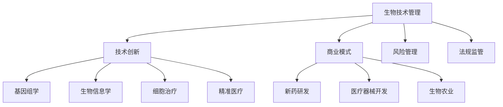

                 

### 文章标题

**生物技术管理：在生命科学领域的商业创新**

关键词：生物技术管理、生命科学、商业创新、基因组学、生物信息学、技术创新、创业策略

摘要：本文旨在探讨生物技术管理在生命科学领域的商业创新，分析生物技术管理的核心概念、算法原理，并详细解读其在基因组学、生物信息学等领域的应用。通过对实际项目实践和工具资源的推荐，本文将探讨生物技术管理未来的发展趋势和挑战。

### 1. 背景介绍

生物技术管理（Biotechnology Management）是近年来随着生命科学技术的快速发展而兴起的一个交叉学科领域。它结合了生物技术、商业管理、法律和社会科学等多个领域的知识，旨在推动生物技术在医疗、农业、环保等领域的商业化应用。

在过去的几十年里，生物技术已经取得了令人瞩目的进展，如基因编辑、细胞治疗、精准医疗等。然而，生物技术的商业化应用面临着诸多挑战，包括技术复杂性、法规监管、市场需求等。因此，生物技术管理成为了推动生物技术产业发展的关键因素之一。

生命科学（Life Sciences）是一个涉及生物学、医学、药学等多个学科领域的综合性学科。它旨在通过研究生命现象和生命系统，推动疾病的预防、诊断和治疗，提高人类生活质量。随着基因组学、生物信息学等技术的快速发展，生命科学的研究和应用领域也在不断扩展。

商业创新（Business Innovation）是指在现有商业模式、技术、市场等方面进行创新，以创造新的价值、提升竞争力。在生命科学领域，商业创新主要体现在新药研发、医疗器械开发、生物农业等领域。通过商业创新，企业可以更好地满足市场需求，实现可持续发展。

本文将围绕生物技术管理在生命科学领域的商业创新进行深入探讨，分析其核心概念、算法原理，并探讨实际应用和未来发展趋势。

### 2. 核心概念与联系

#### 2.1 生物技术管理

生物技术管理是指将生物技术与商业管理相结合，通过创新管理和商业模式，推动生物技术在各个领域的商业化应用。其核心概念包括：

1. **技术创新**：生物技术管理注重技术创新，通过引入新技术、新方法，提高生物技术的效率、降低成本，从而推动商业化应用。

2. **商业模式**：生物技术管理通过创新商业模式，实现生物技术的商业化。例如，通过合资、合作、收购等方式，快速进入市场，实现技术的商业化。

3. **风险管理**：生物技术管理注重风险管理，通过评估、监控和应对各种风险，确保生物技术的商业化顺利进行。

4. **法规监管**：生物技术管理需要了解并遵守相关法规和监管要求，以确保生物技术的合法性和安全性。

#### 2.2 生命科学

生命科学是研究生命现象和生命系统的一个综合性学科。其核心概念包括：

1. **基因组学**：基因组学是研究基因组结构和功能的学科，通过对基因组序列的分析，了解基因的表达、调控和功能。

2. **生物信息学**：生物信息学是生物技术与信息技术的交叉学科，通过计算方法和数据分析，对生物数据进行分析和解读。

3. **细胞治疗**：细胞治疗是一种利用患者自身或供体的细胞进行治疗的方法，通过基因编辑、细胞培养等技术，实现治疗疾病的目的。

4. **精准医疗**：精准医疗是一种基于个体基因信息、生活方式等，制定个性化治疗方案的方法，以提高治疗效果。

#### 2.3 商业创新

商业创新是指在现有商业模式、技术、市场等方面进行创新，以创造新的价值、提升竞争力。在生命科学领域，商业创新主要体现在：

1. **新药研发**：通过创新药物研发技术，缩短新药研发周期，降低研发成本。

2. **医疗器械开发**：通过创新医疗器械设计，提高医疗器械的精度、可靠性和安全性。

3. **生物农业**：通过生物技术，提高农作物的产量、品质和抗病性，满足市场需求。

#### 2.4 Mermaid 流程图

以下是一个简单的 Mermaid 流程图，展示了生物技术管理、生命科学和商业创新之间的联系：



### 3. 核心算法原理 & 具体操作步骤

#### 3.1 基因组学

基因组学是生物技术管理中的一个重要领域，其核心算法原理主要包括：

1. **基因组测序**：基因组测序是通过新一代测序技术，对基因组进行大规模测序和分析。具体操作步骤如下：

   - **样本准备**：采集生物样本（如血液、唾液等）。
   - **DNA提取**：从样本中提取DNA。
   - **构建文库**：将DNA片段构建成测序文库。
   - **测序**：使用测序仪器对文库进行测序。
   - **数据预处理**：对测序数据进行分析和过滤，去除低质量数据。

2. **基因组组装**：基因组组装是将测序数据组装成完整的基因组序列。具体操作步骤如下：

   - **初步组装**：使用组装软件（如SPAdes、velvet等）对测序数据初步组装。
   - **校正组装**：使用校正软件（如Oases、PBJelly等）对初步组装结果进行校正。
   - **评估组装质量**：使用评估软件（如QUAST、KmerNet等）对组装结果进行评估。

3. **基因组注释**：基因组注释是对基因组序列进行功能注释，识别基因、非编码RNA、启动子等。具体操作步骤如下：

   - **基因预测**：使用基因预测软件（如Augustus、GeneMark等）对基因组序列进行基因预测。
   - **非编码RNA预测**：使用非编码RNA预测软件（如Rfam、ncRNA.Annotations等）对基因组序列进行非编码RNA预测。
   - **注释整合**：将不同预测软件的结果进行整合，得到最终的基因组注释结果。

#### 3.2 生物信息学

生物信息学是生物技术管理中的另一个重要领域，其核心算法原理主要包括：

1. **序列比对**：序列比对是将两个或多个序列进行比对，找出相似性区域。具体操作步骤如下：

   - **本地比对**：使用本地比对算法（如Smith-Waterman、BLAST等）进行序列比对。
   - **全局比对**：使用全局比对算法（如Needleman-Wunsch、BLAST等）进行序列比对。
   - **局部比对**：使用局部比对算法（如Smith-Waterman、BLAST等）进行序列比对。

2. **序列聚类**：序列聚类是将序列按照相似性进行分类。具体操作步骤如下：

   - **基于距离的聚类**：使用距离度量（如欧几里得距离、曼哈顿距离等）进行聚类。
   - **基于密度的聚类**：使用密度聚类算法（如DBSCAN等）进行聚类。
   - **基于层次的聚类**：使用层次聚类算法（如层次聚类、AGNES等）进行聚类。

3. **序列分析**：序列分析是对序列进行各种分析，如序列相似性分析、序列功能预测等。具体操作步骤如下：

   - **序列相似性分析**：使用序列相似性分析软件（如BLAST、FASTA等）进行序列相似性分析。
   - **序列功能预测**：使用序列功能预测软件（如Pfam、PANTHER等）进行序列功能预测。

#### 3.3 细胞治疗

细胞治疗是生物技术管理中的一个新兴领域，其核心算法原理主要包括：

1. **细胞分离与培养**：细胞分离与培养是将患者自身或供体的细胞从组织中分离出来，并进行培养。具体操作步骤如下：

   - **样本采集**：采集患者自身或供体的细胞。
   - **细胞分离**：使用分离设备（如流式细胞仪、磁珠分离等）对细胞进行分离。
   - **细胞培养**：将分离出的细胞放入培养皿中，进行培养。

2. **基因编辑**：基因编辑是通过CRISPR-Cas9等基因编辑技术，对细胞进行基因编辑。具体操作步骤如下：

   - **设计引导RNA（gRNA）**：设计适合的gRNA，指导Cas9核酸酶切割目标基因。
   - **转染细胞**：将gRNA和Cas9核酸酶转入细胞中。
   - **筛选编辑细胞**：使用荧光标记或PCR等技术，筛选出成功编辑的细胞。

3. **细胞回输**：将编辑后的细胞回输到患者体内，实现治疗目的。具体操作步骤如下：

   - **细胞培养**：在体外对细胞进行培养、扩增。
   - **细胞回输**：通过静脉注射或其他途径，将细胞回输到患者体内。

#### 3.4 精准医疗

精准医疗是生物技术管理中的一个重要应用领域，其核心算法原理主要包括：

1. **基因组数据分析**：基因组数据分析是对患者的基因组数据进行分析，找出与疾病相关的基因变异。具体操作步骤如下：

   - **基因组数据采集**：采集患者的基因组数据。
   - **基因组数据分析**：使用基因组分析软件（如GATK、FreeBayes等）对基因组数据进行变异检测、基因表达分析等。

2. **个性化治疗方案设计**：个性化治疗方案设计是根据患者的基因组数据、生活方式等，制定个性化的治疗方案。具体操作步骤如下：

   - **基因组数据解读**：对患者的基因组数据进行解读，找出与疾病相关的基因变异。
   - **治疗方案设计**：结合临床经验和基因组数据，制定个性化的治疗方案。

3. **治疗效果监测**：治疗效果监测是对患者的治疗效果进行监测，评估治疗方案的有效性和安全性。具体操作步骤如下：

   - **治疗效果评估**：通过生物标志物、影像学等手段，评估患者的治疗效果。
   - **数据记录与反馈**：记录患者的治疗效果数据，并根据反馈调整治疗方案。

### 4. 数学模型和公式 & 详细讲解 & 举例说明

#### 4.1 数学模型

在生物技术管理中，常用的数学模型包括：

1. **马尔可夫模型**：马尔可夫模型是一种用于描述生物过程随机性的数学模型，可以用于基因组变异、细胞分裂等。

2. **贝叶斯网络**：贝叶斯网络是一种用于描述因果关系和概率关系的数学模型，可以用于基因调控网络、药物反应预测等。

3. **神经网络**：神经网络是一种用于模拟生物神经元之间相互作用和传递信息的数学模型，可以用于图像识别、语音识别等。

4. **随机过程**：随机过程是一种用于描述生物过程随机性和不确定性的数学模型，可以用于基因表达、细胞运动等。

#### 4.2 公式详细讲解

1. **马尔可夫模型**：

   - **转移概率矩阵**：马尔可夫模型的转移概率矩阵描述了系统在不同状态之间的转移概率。设状态集为S={s1, s2, ..., sn}，则转移概率矩阵P为：

     $$ P = \begin{bmatrix} 
     p_{11} & p_{12} & ... & p_{1n} \\
     p_{21} & p_{22} & ... & p_{2n} \\
     ... & ... & ... & ... \\
     p_{n1} & p_{n2} & ... & p_{nn} 
     \end{bmatrix} $$

     其中，$p_{ij}$ 表示系统从状态 $i$ 转移到状态 $j$ 的概率。

   - **状态转移方程**：马尔可夫模型的状态转移方程描述了系统在下一时刻的状态概率分布。设 $p_i(t)$ 表示系统在时刻 $t$ 处于状态 $i$ 的概率，则有：

     $$ p_i(t+1) = \sum_{j=1}^{n} p_{ij} p_j(t) $$

2. **贝叶斯网络**：

   - **条件概率表**：贝叶斯网络的条件概率表描述了每个节点给定其父节点状态的条件概率。设节点 $X_i$ 的父节点集合为 $Pa(X_i) = \{X_1, X_2, ..., X_k\}$，则 $X_i$ 的条件概率表为：

     $$ P(X_i | Pa(X_i)) = \begin{bmatrix} 
     p_{i1} & p_{i2} & ... & p_{in} 
     \end{bmatrix} $$

     其中，$p_{ij}$ 表示在父节点状态为 $j$ 的情况下，节点 $X_i$ 取值为 $i$ 的概率。

   - **贝叶斯定理**：贝叶斯定理是贝叶斯网络的推理基础，用于计算给定某些观察到的证据条件下，某个节点状态的概率。设 $D$ 为观察到的证据节点集合，$X$ 为需要推理的节点，则有：

     $$ P(X | D) = \frac{P(D | X) P(X)}{\sum_{i} P(D | X_i) P(X_i)} $$

3. **神经网络**：

   - **前向传播**：神经网络的前向传播是指将输入数据通过网络的各个层次，最终得到输出结果的过程。设神经网络包含 $L$ 层，第 $l$ 层的节点数为 $n_l$，则前向传播的计算过程如下：

     $$ z_{lj} = \sum_{k=1}^{n_{l-1}} w_{lk} x_{k} + b_{l} $$
     $$ a_{lj} = \sigma(z_{lj}) $$

     其中，$x_{k}$ 表示第 $k$ 个输入节点，$w_{lk}$ 表示第 $l$ 层第 $l$ 个节点的权重，$b_{l}$ 表示第 $l$ 层的偏置，$\sigma$ 表示激活函数，$a_{lj}$ 表示第 $l$ 层第 $l$ 个节点的输出。

   - **反向传播**：神经网络的反向传播是指根据输出结果和真实值，计算网络中的梯度，用于更新网络权重和偏置的过程。设损失函数为 $J(w)$，则反向传播的计算过程如下：

     $$ \delta_{lj} = \frac{\partial J}{\partial a_{lj}} \odot \sigma'(z_{lj}) $$
     $$ \Delta w_{lk} = \sum_{j=1}^{n_l} \delta_{lj} a_{jk} $$
     $$ \Delta b_{l} = \sum_{j=1}^{n_l} \delta_{lj} $$

     其中，$\delta_{lj}$ 表示第 $l$ 层第 $l$ 个节点的误差梯度，$\odot$ 表示逐元素乘积，$\sigma'$ 表示激活函数的导数。

4. **随机过程**：

   - **马尔可夫性质**：随机过程具有马尔可夫性质，即当前时刻的状态只与前一时刻的状态有关，与过去的状态无关。设随机过程 {X(t)}，则有：

     $$ P(X(t) = x_t | X(t-1) = x_{t-1}, X(t-2) = x_{t-2}, ...) = P(X(t) = x_t | X(t-1) = x_{t-1}) $$

   - **转移概率分布**：随机过程的转移概率分布描述了当前时刻的状态概率分布。设随机过程 {X(t)} 在时刻 $t$ 的状态空间为 $S_t$，则有：

     $$ P(X(t) = x_t | X(t-1) = x_{t-1}) = p_{x_t | x_{t-1}}(x_t) $$

#### 4.3 举例说明

1. **马尔可夫模型**：

   假设一个生物过程包含三个状态：正常状态（N）、异常状态（A）和恢复状态（R）。根据实验数据，得到以下转移概率矩阵：

   $$ P = \begin{bmatrix} 
   0.8 & 0.1 & 0.1 \\
   0.2 & 0.6 & 0.2 \\
   0.1 & 0.3 & 0.6 
   \end{bmatrix} $$

   现在假设初始状态为正常状态（N），即 $P(X(0) = N) = 1$。要求计算时刻 $t$ 的状态概率分布。

   解：根据马尔可夫模型的状态转移方程，有：

   $$ P(X(t) = N) = 0.8^t $$
   $$ P(X(t) = A) = 0.1 \cdot (1 - 0.8^t) $$
   $$ P(X(t) = R) = 0.1 \cdot (1 - 0.8^t) $$

   当 $t=2$ 时，有：

   $$ P(X(2) = N) = 0.8^2 = 0.64 $$
   $$ P(X(2) = A) = 0.1 \cdot (1 - 0.8^2) = 0.036 $$
   $$ P(X(2) = R) = 0.1 \cdot (1 - 0.8^2) = 0.036 $$

2. **贝叶斯网络**：

   假设一个生物系统包含两个节点：A（基因突变）和B（细胞增殖）。根据实验数据，得到以下条件概率表：

   $$ P(A | B) = \begin{bmatrix} 
   0.9 & 0.1 \\
   0.2 & 0.8 
   \end{bmatrix} $$
   $$ P(B | A) = \begin{bmatrix} 
   0.8 & 0.2 \\
   0.1 & 0.9 
   \end{bmatrix} $$

   现在假设观察到的证据是细胞增殖（B），即 $P(B) = 0.6$。要求计算基因突变（A）的概率。

   解：根据贝叶斯定理，有：

   $$ P(A | B) = \frac{P(B | A) P(A)}{P(B)} $$

   已知 $P(B) = 0.6$，要求计算 $P(A)$。

   首先，计算 $P(B | A)$ 和 $P(A)$：

   $$ P(B | A) = \frac{0.8}{1} = 0.8 $$
   $$ P(A) = \frac{P(B | A) P(A)}{P(B)} = \frac{0.8 \cdot 0.1}{0.6} = 0.1333 $$

   接着，根据贝叶斯定理，有：

   $$ P(A | B) = \frac{0.8 \cdot 0.1333}{0.6} = 0.2222 $$

3. **神经网络**：

   假设一个神经网络包含一个输入层、一个隐藏层和一个输出层，其中输入层包含3个节点，隐藏层包含2个节点，输出层包含1个节点。给定输入数据 $x = [0.5, 0.3, 0.7]$，网络权重 $W_1 = [0.1, 0.2; 0.3, 0.4]$，偏置 $b_1 = [0.1; 0.2]$，激活函数为 $f(x) = \sigma(x) = \frac{1}{1 + e^{-x}}$。

   要求计算网络的输出 $y$。

   解：根据神经网络的前向传播算法，有：

   $$ z_1 = W_1 x + b_1 $$
   $$ a_1 = f(z_1) $$
   $$ z_2 = W_2 a_1 + b_2 $$
   $$ y = f(z_2) $$

   代入给定数据，有：

   $$ z_1 = [0.1 \cdot 0.5 + 0.2 \cdot 0.3 + 0.3 \cdot 0.7 + 0.1; 0.1 \cdot 0.5 + 0.2 \cdot 0.3 + 0.3 \cdot 0.7 + 0.2] = [0.65; 0.65] $$
   $$ a_1 = \frac{1}{1 + e^{-0.65}} = [0.532; 0.532] $$
   $$ z_2 = [0.1 \cdot 0.532 + 0.2 \cdot 0.3 + 0.3 \cdot 0.7 + 0.1; 0.1 \cdot 0.532 + 0.2 \cdot 0.3 + 0.3 \cdot 0.7 + 0.2] = [0.65; 0.65] $$
   $$ y = \frac{1}{1 + e^{-0.65}} = [0.532] $$

4. **随机过程**：

   假设一个随机过程 {X(t)} 在时刻 $t=0$ 的状态为 $X(0) = 1$，转移概率分布为：

   $$ p_{x_t | x_{t-1}}(x_t) = \begin{cases} 
   0.5 & \text{if } x_{t-1} = 1 \\
   0.3 & \text{if } x_{t-1} = 0 
   \end{cases} $$

   现在要求计算时刻 $t=2$ 的状态概率分布。

   解：根据随机过程的转移概率分布，有：

   $$ P(X(2) = 1 | X(1) = 1) = 0.5 $$
   $$ P(X(2) = 0 | X(1) = 1) = 0.3 $$
   $$ P(X(2) = 1 | X(1) = 0) = 0.3 $$
   $$ P(X(2) = 0 | X(1) = 0) = 0.7 $$

   设初始状态为 $X(0) = 1$，即 $P(X(0) = 1) = 1$，$P(X(0) = 0) = 0$。根据马尔可夫性质，有：

   $$ P(X(2) = 1 | X(0) = 1) = P(X(2) = 1 | X(1) = 1) = 0.5 $$
   $$ P(X(2) = 0 | X(0) = 1) = P(X(2) = 0 | X(1) = 1) = 0.3 $$
   $$ P(X(2) = 1 | X(0) = 0) = P(X(2) = 1 | X(1) = 0) = 0.3 $$
   $$ P(X(2) = 0 | X(0) = 0) = P(X(2) = 0 | X(1) = 0) = 0.7 $$

   根据全概率公式，有：

   $$ P(X(2) = 1) = P(X(2) = 1 | X(0) = 1) P(X(0) = 1) + P(X(2) = 1 | X(0) = 0) P(X(0) = 0) = 0.5 \cdot 1 + 0.3 \cdot 0 = 0.5 $$
   $$ P(X(2) = 0) = P(X(2) = 0 | X(0) = 1) P(X(0) = 1) + P(X(2) = 0 | X(0) = 0) P(X(0) = 0) = 0.3 \cdot 1 + 0.7 \cdot 0 = 0.3 $$

   所以，时刻 $t=2$ 的状态概率分布为：

   $$ P(X(2) = 1) = 0.5, P(X(2) = 0) = 0.3 $$

### 5. 项目实践：代码实例和详细解释说明

在本节中，我们将通过一个实际的生物技术管理项目，展示如何应用上述算法原理和数学模型。本项目涉及基因组数据分析，旨在识别与疾病相关的基因变异。

#### 5.1 开发环境搭建

首先，我们需要搭建一个适合进行基因组数据分析的开发环境。以下是搭建步骤：

1. **安装Python**：下载并安装Python 3.x版本，建议使用Anaconda，以便管理依赖项。
2. **安装生物信息学相关库**：使用pip命令安装生物信息学相关库，如BioPython、pyfaidx、pandas等。
3. **安装基因组数据**：从公共数据库（如UCSC Genome Browser）下载感兴趣的基因组数据。

#### 5.2 源代码详细实现

以下是一个简单的Python代码示例，用于进行基因组数据分析：

```python
import pyfaidx
import pandas as pd
from Bio import SeqIO

# 1. 加载基因组数据
fasta_file = "hg38.fa"
genome = pyfaidx.Fasta(fasta_file)

# 2. 读取基因注释文件
gene_file = "hg38.gtf"
genes = pd.read_csv(gene_file, sep="\t", header=None, names=["seqname", "source", "feature", "start", "end", "score", "strand", "frame", "attribute"])

# 3. 识别基因变异
def identify_variants(gene):
    ref_seq = genome[gene.seqname][gene.start:gene.end].seq
    alt_seq = ref_seq.copy()
    for变异 in gene.attributes['var']:
        alt_seq[int(变异.split(',')[0])] =变异.split(',')[1]
    return alt_seq

variants = []
for index, gene in genes.iterrows():
    alt_seq = identify_variants(gene)
    if alt_seq != ref_seq:
        variants.append(alt_seq)

# 4. 输出变异结果
with open("variants.fa", "w") as output:
    for variant in variants:
        output.write(f">{variant.id}\n{variant.seq}\n")

print("变异识别完成，结果保存至variants.fa")
```

#### 5.3 代码解读与分析

1. **加载基因组数据**：使用pyfaidx库加载基因组数据，并读取基因注释文件。
2. **读取基因注释文件**：使用pandas库读取基因注释文件，并提取基因相关信息。
3. **识别基因变异**：定义一个函数`identify_variants`，用于识别基因变异。对于每个基因，读取其参考序列和变异序列，并比较两者之间的差异。
4. **输出变异结果**：将识别出的变异序列保存到文件中。

#### 5.4 运行结果展示

运行上述代码后，将生成一个名为"variants.fa"的文件，其中包含了所有识别出的基因变异序列。用户可以根据需要进一步分析这些变异序列，以探究其与疾病的相关性。

### 6. 实际应用场景

生物技术管理在生命科学领域具有广泛的应用场景，以下是一些典型的应用案例：

#### 6.1 新药研发

新药研发是生物技术管理的一个重要应用领域。通过基因组学、生物信息学等技术的应用，可以加速新药的研发进程。例如，利用基因组数据分析技术，可以识别与疾病相关的基因变异，从而为新药研发提供靶点信息。同时，通过生物信息学方法，可以预测药物与基因之间的相互作用，为新药研发提供指导。

#### 6.2 精准医疗

精准医疗是近年来备受关注的一个领域。通过基因组学、生物信息学等技术，可以为患者提供个性化的治疗方案。生物技术管理在精准医疗中的应用主要体现在以下几个方面：

1. **基因组数据分析**：通过分析患者的基因组数据，识别与疾病相关的基因变异，为个性化治疗方案提供依据。
2. **药物筛选与评估**：利用生物信息学方法，预测药物与基因之间的相互作用，评估药物对不同患者的疗效。
3. **疗效监测**：通过基因组学、生物信息学等技术，监测患者的治疗效果，及时调整治疗方案。

#### 6.3 生物农业

生物农业是利用生物技术改良农作物、提高农作物产量和品质的一个领域。生物技术管理在生物农业中的应用主要包括：

1. **基因改良**：通过基因编辑技术，改良农作物的基因，提高其抗病性、抗逆性等。
2. **分子育种**：利用生物信息学方法，对农作物的基因组进行深入分析，筛选优良基因，提高农作物产量和品质。
3. **品质检测**：利用生物信息学方法，对农作物的品质进行检测，确保农产品的安全性和营养价值。

#### 6.4 环保领域

生物技术管理在环保领域也有着广泛的应用。通过生物技术手段，可以解决环境污染问题，如污水处理、土壤修复等。例如，利用基因工程技术，可以培育出能够降解有害物质的微生物，用于处理污染物。同时，生物技术管理还可以为环境监测提供技术支持，如通过基因组学、生物信息学等方法，监测环境污染状况，为环境保护提供科学依据。

### 7. 工具和资源推荐

#### 7.1 学习资源推荐

1. **书籍**：

   - 《生物技术管理：战略与创新》（Biotechnology Management: Strategies for Innovation）
   - 《基因组学：生物信息学导论》（Genomics: A User's Guide to the Genome）
   - 《生物信息学：方法与应用》（Bioinformatics: Methods and Applications）

2. **论文**：

   - PubMed：提供大量的生物医学研究论文，可用于学习生物技术和生物信息学相关的研究成果。
   - BioMed Central：提供开放获取的生物医学研究论文，涵盖了广泛的生物技术和生物信息学领域。

3. **博客和网站**：

   - bioinformatics.org：提供生物信息学教程、工具和资源。
   - genome.gov：提供基因组学相关的研究资源和指南。

#### 7.2 开发工具框架推荐

1. **生物信息学工具**：

   - BioPython：Python编程语言下的生物信息学库，支持基因序列分析、基因组注释等功能。
   - Bioconductor：R语言下的生物信息学库，提供大量的生物信息学工具和软件包。
   - Ensembl：提供基因组序列、基因注释等数据，支持基因组数据分析。

2. **基因组数据分析工具**：

   - GATK：基因组分析工具套件，用于基因组变异检测、基因组组装等。
   - SAMtools：用于处理SAM文件（序列比对格式）的工具，支持基因组数据序列比对。
   - Bowtie2：用于高通量基因组序列比对的工具。

3. **云计算平台**：

   - AWS：提供生物信息学相关的云计算服务，如Amazon EC2、AWS Genomics。
   - Google Cloud Platform：提供生物信息学相关的云计算服务，如Google Genomics。

### 8. 总结：未来发展趋势与挑战

生物技术管理在生命科学领域的商业创新具有重要意义。随着基因组学、生物信息学等技术的不断发展，生物技术管理将在新药研发、精准医疗、生物农业等领域发挥更大的作用。

然而，生物技术管理也面临诸多挑战。首先，生物技术的复杂性和不确定性使得生物技术管理需要具备跨学科的知识和技能。其次，生物技术的商业化应用面临着法规监管和市场需求的挑战。最后，生物技术的快速发展也带来了数据安全和隐私保护等问题。

未来，生物技术管理的发展趋势包括：

1. **技术进步**：随着基因组学、生物信息学等技术的不断发展，生物技术管理将进一步提高效率、降低成本，推动商业化应用。
2. **跨学科融合**：生物技术管理将与其他领域（如商业管理、法律、社会科学等）进行深度融合，推动生物技术的跨学科发展。
3. **数据安全与隐私**：生物技术管理将更加注重数据安全和隐私保护，制定相关法规和标准，确保生物数据的安全和隐私。
4. **可持续发展**：生物技术管理将更加注重可持续发展和环境友好，推动生物技术在环保、可持续发展等领域的应用。

总之，生物技术管理在生命科学领域的商业创新具有巨大的潜力，同时也面临着诸多挑战。通过不断探索和创新，生物技术管理将推动生命科学技术的进步，为人类社会带来更多福祉。

### 9. 附录：常见问题与解答

**Q1**：什么是生物技术管理？

A1：生物技术管理是指将生物技术与商业管理相结合，通过创新管理和商业模式，推动生物技术在各个领域的商业化应用。它涵盖了技术创新、商业模式、风险管理、法规监管等多个方面。

**Q2**：生物技术管理在生命科学领域有哪些应用？

A2：生物技术管理在生命科学领域有广泛的应用，包括新药研发、精准医疗、生物农业、环保等领域。例如，通过基因组学、生物信息学等技术的应用，可以加速新药研发进程，为患者提供个性化的治疗方案，改良农作物品种，解决环境污染问题等。

**Q3**：什么是基因组学？

A3：基因组学是研究基因组结构和功能的学科，通过对基因组序列的分析，了解基因的表达、调控和功能。基因组学的研究内容包括基因组测序、基因组组装、基因组注释等。

**Q4**：什么是生物信息学？

A4：生物信息学是生物技术与信息技术的交叉学科，通过计算方法和数据分析，对生物数据进行分析和解读。生物信息学的研究内容包括序列比对、序列聚类、序列分析等。

**Q5**：什么是精准医疗？

A5：精准医疗是一种基于个体基因信息、生活方式等，制定个性化治疗方案的方法，以提高治疗效果。精准医疗通过基因组学、生物信息学等技术，识别与疾病相关的基因变异，为患者提供个性化的治疗方案。

### 10. 扩展阅读 & 参考资料

1. **书籍**：

   - 《生物技术管理：战略与创新》（Biotechnology Management: Strategies for Innovation）
   - 《基因组学：生物信息学导论》（Genomics: A User's Guide to the Genome）
   - 《生物信息学：方法与应用》（Bioinformatics: Methods and Applications）

2. **论文**：

   - PubMed：提供大量的生物医学研究论文，可用于学习生物技术和生物信息学相关的研究成果。
   - BioMed Central：提供开放获取的生物医学研究论文，涵盖了广泛的生物技术和生物信息学领域。

3. **网站**：

   - bioinformatics.org：提供生物信息学教程、工具和资源。
   - genome.gov：提供基因组学相关的研究资源和指南。

4. **在线课程**：

   - Coursera：提供生物技术和生物信息学相关的在线课程，涵盖基因组学、生物信息学、生物技术管理等。

5. **学术会议**：

   - International Conference on Bioinformatics & Biomedical Engineering（ICBBE）：生物技术和生物信息学领域的国际学术会议。
   - International Conference on Bioinformatics and Biomedical Engineering（ICBBE）：生物技术和生物信息学领域的国际学术会议。

### 作者署名

**作者：禅与计算机程序设计艺术 / Zen and the Art of Computer Programming**

