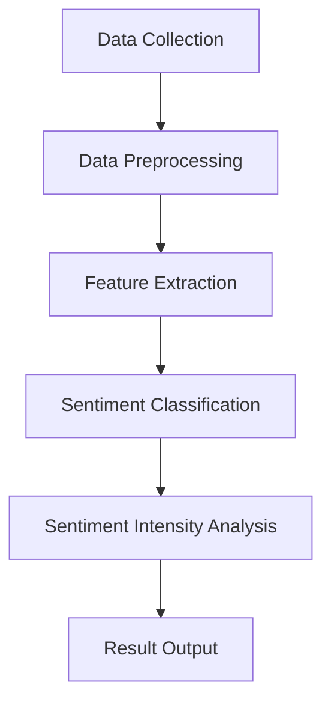
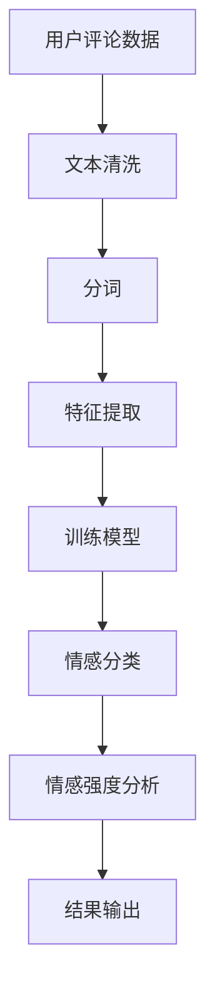

                 

### 背景介绍

在当今信息化和数字化迅速发展的时代，电子商务（E-commerce）已经成为了商业活动中的重要组成部分。随着互联网技术的普及和移动互联网的兴起，电商平台正以前所未有的速度扩张。然而，随着市场的竞争日益激烈，如何提高用户体验和满意度成为了电商企业关注的焦点。用户情感分析（User Sentiment Analysis）作为一种基于自然语言处理（Natural Language Processing, NLP）的技术，通过分析用户在平台上的评论、评价、反馈等信息，能够识别和评估用户的情感状态，从而为电商企业优化产品和服务提供有力支持。

用户情感分析的应用场景非常广泛，主要包括以下几个方面：

1. **产品评价与反馈分析**：用户对产品的评价和反馈是衡量产品性能和市场接受程度的重要指标。通过对这些文本数据进行情感分析，可以识别用户对产品的正面或负面情感，从而帮助企业了解用户需求，优化产品设计。

2. **客户服务管理**：电商平台的客户服务水平直接影响到用户满意度和忠诚度。用户情感分析可以帮助企业实时监控用户在客户服务过程中的情感状态，识别潜在的问题，并采取相应的措施进行改进。

3. **市场趋势预测**：通过对大量用户评论的情感分析，可以识别市场趋势和消费者偏好，为企业制定市场策略提供数据支持。

4. **广告投放优化**：广告投放的效果直接影响企业的营销预算和销售业绩。通过情感分析，可以评估广告内容的吸引力，从而优化广告投放策略。

5. **社区管理与内容推荐**：电商平台通常拥有庞大的用户社区，用户情感分析可以帮助企业管理和维护社区氛围，同时根据用户的情感状态推荐相关的内容，提高用户活跃度。

本文将深入探讨用户情感分析在电商领域的应用，首先介绍用户情感分析的基本概念和技术手段，然后详细阐述其在电商中的具体应用场景和实践案例，最后分析该技术面临的挑战和未来发展趋势。希望通过本文的探讨，为电商企业在用户体验优化和业务决策方面提供有益的参考。

> Keywords: User Sentiment Analysis, E-commerce, Natural Language Processing, Text Mining, Sentiment Classification, Application Scenarios.

> Abstract: This article explores the application of user sentiment analysis in the field of e-commerce. By analyzing user-generated text data, such as reviews and feedback, sentiment analysis provides valuable insights into user emotions and preferences. This information can be used to optimize product development, customer service, marketing strategies, and community management. The article discusses the basic concepts and techniques of sentiment analysis, the specific application scenarios in e-commerce, and the challenges and future prospects of this technology.

----------------------------------------------------------------

### 核心概念与联系

用户情感分析（User Sentiment Analysis）是一种利用自然语言处理（NLP）技术，从文本数据中识别和提取情感信息的方法。它不仅涉及情感极性分类（polarity classification），如正面、负面、中性，还包括情感强度分析（sentiment intensity analysis），即情感的程度。在电商领域，用户情感分析可以帮助企业了解用户对产品、服务、广告等内容的真实感受，从而做出更明智的业务决策。

#### 情感分类（Sentiment Classification）

情感分类是用户情感分析的基础。它通常包括以下几个步骤：

1. **数据预处理（Data Preprocessing）**：包括文本清洗、去除噪声、去除停用词等，以提高后续分析的准确度。

2. **特征提取（Feature Extraction）**：将文本转换为数值特征，常用的方法有词袋模型（Bag of Words, BoW）、TF-IDF、Word2Vec等。

3. **模型训练（Model Training）**：使用已标注的情感数据集训练分类模型，常见的模型有朴素贝叶斯（Naive Bayes）、支持向量机（Support Vector Machine, SVM）、深度学习模型（如卷积神经网络（Convolutional Neural Networks, CNN）和递归神经网络（Recurrent Neural Networks, RNN）等。

4. **情感分类（Sentiment Classification）**：将提取的特征输入训练好的模型，得到情感分类结果。

#### 情感强度分析（Sentiment Intensity Analysis）

情感强度分析旨在量化情感的程度，如非常正面、正面、中性、负面、非常负面。它通常通过以下方法实现：

1. **基于规则的强度分析（Rule-based Intensity Analysis）**：使用预设的规则（如情感词的权重、否定词的处理等）来计算情感强度。

2. **基于机器学习的方法（Machine Learning Methods）**：使用机器学习模型（如回归模型、分类模型等）来预测情感强度。

3. **基于深度学习的方法（Deep Learning Methods）**：使用深度学习模型（如RNN、长短时记忆网络（Long Short-Term Memory, LSTM）等）来学习情感强度。

#### 情感分析的架构（Architecture of Sentiment Analysis）

情感分析的架构通常包括以下几个模块：

1. **数据采集（Data Collection）**：从电商平台的评论、反馈等文本数据源收集用户生成的内容。

2. **数据预处理（Data Preprocessing）**：清洗和预处理文本数据，为后续分析做准备。

3. **特征提取（Feature Extraction）**：将预处理后的文本转换为数值特征。

4. **情感分类与强度分析（Sentiment Classification and Intensity Analysis）**：使用分类和强度分析模型对特征进行分类和强度分析。

5. **结果输出（Result Output）**：将分析结果以可视化或报表的形式输出，供业务人员参考。

下面是一个简化的情感分析流程图（使用Mermaid语法）：



通过上述架构，用户情感分析能够有效地从大量用户评论和反馈中提取有价值的信息，帮助电商企业更好地理解用户需求，优化产品和服务。

### 核心算法原理 & 具体操作步骤

用户情感分析的核心在于如何从大量用户生成的文本数据中准确识别情感极性和强度。这一过程通常涉及到多个步骤，包括数据预处理、特征提取、情感分类模型的选择和训练，以及结果解释。以下是用户情感分析的具体操作步骤和算法原理：

#### 1. 数据预处理（Data Preprocessing）

数据预处理是用户情感分析的基础，旨在去除噪声和标准化文本数据，从而提高后续分析的质量。主要步骤包括：

1. **文本清洗（Text Cleaning）**：
   - **去除HTML标签**：评论中可能包含HTML标签，需要通过正则表达式或其他方法去除。
   - **去除特殊字符**：删除文本中的特殊字符（如#、@、&等），保留字母、数字、空格和标点符号。
   - **转换为小写**：将所有文本转换为小写，以减少数据维度。

2. **去除停用词（Stopword Removal）**：
   - **停用词列表**：构建一个包含常用停用词的列表，如“的”、“和”、“是”等。
   - **过滤**：从文本中删除这些停用词，以减少噪声。

3. **分词（Tokenization）**：
   - **分词方法**：使用词法分析工具（如jieba、NLTK等）将文本分割成单词或词汇单元。

#### 2. 特征提取（Feature Extraction）

特征提取是将文本转换为数值特征的过程，为后续的情感分类提供输入。常用的特征提取方法包括：

1. **词袋模型（Bag of Words, BoW）**：
   - **词汇表构建**：将所有文本构建成一个词汇表，每个词汇表中的词代表一个特征。
   - **词频统计**：统计每个词在文档中的出现次数，形成词频矩阵。

2. **TF-IDF（Term Frequency-Inverse Document Frequency）**：
   - **词频统计**：统计每个词在文档中的出现次数。
   - **文档频率计算**：计算每个词在所有文档中的出现频率。
   - **逆文档频率计算**：对词频进行归一化处理，减少常见词的影响。

3. **Word2Vec**：
   - **词嵌入**：将每个词映射到一个固定大小的向量空间中，向量表示词的语义信息。
   - **训练模型**：使用训练数据集训练Word2Vec模型，生成词向量。

#### 3. 情感分类模型的选择和训练（Sentiment Classification Model Selection and Training）

情感分类模型的选择和训练是用户情感分析的核心。以下是一些常见的分类模型及其训练方法：

1. **朴素贝叶斯（Naive Bayes）**：
   - **模型原理**：基于贝叶斯定理和特征条件独立性假设。
   - **训练方法**：使用标注数据训练模型，计算每个特征对每个类别的概率。

2. **支持向量机（Support Vector Machine, SVM）**：
   - **模型原理**：通过最大间隔分类器寻找一个最优的超平面。
   - **训练方法**：使用支持向量进行优化，求解最大间隔超平面。

3. **深度学习模型（Deep Learning Models）**：
   - **模型原理**：利用多层神经网络学习复杂的特征表示。
   - **训练方法**：使用反向传播算法和梯度下降优化模型参数。

#### 4. 情感分类与强度分析（Sentiment Classification and Intensity Analysis）

1. **情感分类**：
   - **分类结果**：将文本特征输入训练好的分类模型，得到情感分类结果。
   - **评估指标**：使用准确率（Accuracy）、召回率（Recall）、F1分数（F1 Score）等指标评估模型性能。

2. **情感强度分析**：
   - **强度计算**：使用分类模型的输出结果，结合情感词的权重和否定词的处理，计算情感强度。
   - **结果解释**：将情感强度分析结果以可视化或报表的形式输出，供业务人员参考。

#### 5. 结果输出（Result Output）

- **可视化报表**：通过图表展示情感分析结果，帮助业务人员直观理解用户情感。
- **报表生成**：生成详细的情感分析报告，包括情感极性、强度分布等，供决策参考。

通过上述步骤，用户情感分析能够有效地从大量文本数据中提取情感信息，为电商企业提供数据驱动的决策支持。以下是一个简化的用户情感分析流程：



通过这个流程，电商企业可以实时了解用户对产品和服务的情感反应，从而优化产品、提升服务质量，增强用户满意度和忠诚度。

#### 数学模型和公式 & 详细讲解 & 举例说明

在用户情感分析中，数学模型和公式扮演着至关重要的角色，它们帮助我们量化文本数据中的情感信息。以下将详细介绍几种常用的数学模型和公式，并通过具体例子说明其应用。

##### 1. TF-IDF（Term Frequency-Inverse Document Frequency）

TF-IDF是一种常用的文本特征提取方法，用于衡量一个词在文档中的重要程度。

- **词频（Term Frequency, TF）**：一个词在文档中出现的次数。公式如下：

  $$ TF(t,d) = \text{count}(t,d) $$

  其中，$t$ 表示词语，$d$ 表示文档。

- **文档频率（Document Frequency, DF）**：一个词在所有文档中出现的次数。公式如下：

  $$ DF(t) = \text{number of documents that contain } t $$

- **逆文档频率（Inverse Document Frequency, IDF）**：用于降低常见词的影响，公式如下：

  $$ IDF(t) = \log \left( \frac{N}{DF(t)} \right) $$

  其中，$N$ 表示文档总数。

- **TF-IDF得分**：将词频和逆文档频率结合，得到词的权重。公式如下：

  $$ TF-IDF(t,d) = TF(t,d) \times IDF(t) $$

##### 举例说明

假设有两个文档$d_1$和$d_2$，以及一个包含$N$个文档的文档集合。文档$d_1$中包含单词"happy"一次，文档$d_2$中包含单词"happy"三次。整个文档集合中包含单词"happy"的文档数为10。

- **词频（TF）**：

  $$ TF("happy", d_1) = 1 $$
  $$ TF("happy", d_2) = 3 $$

- **文档频率（DF）**：

  $$ DF("happy") = 10 $$

- **逆文档频率（IDF）**：

  $$ IDF("happy") = \log \left( \frac{N}{DF("happy")} \right) = \log \left( \frac{100}{10} \right) = 1 $$

- **TF-IDF得分**：

  $$ TF-IDF("happy", d_1) = 1 \times 1 = 1 $$
  $$ TF-IDF("happy", d_2) = 3 \times 1 = 3 $$

可以看出，单词"happy"在文档$d_2$中的TF-IDF得分更高，表示其在文档$d_2$中更为重要。

##### 2. 朴素贝叶斯（Naive Bayes）

朴素贝叶斯是一种基于贝叶斯定理的简单概率分类器，广泛应用于文本分类任务。

- **贝叶斯定理**：

  $$ P(C|X) = \frac{P(X|C)P(C)}{P(X)} $$

  其中，$C$ 表示类别，$X$ 表示特征向量。

- **朴素贝叶斯模型**：

  朴素贝叶斯假设特征之间相互独立，即：

  $$ P(X|C) = \prod_{i=1}^{n} P(x_i|C) $$

  其中，$x_i$ 表示第$i$个特征。

- **训练模型**：

  - **计算先验概率**：$P(C)$
  - **计算条件概率**：$P(x_i|C)$

##### 举例说明

假设有两个类别：正面（Positive）和负面（Negative）。特征向量包含两个特征：$x_1$ 和 $x_2$。

- **先验概率**：

  $$ P(Positive) = 0.6 $$
  $$ P(Negative) = 0.4 $$

- **条件概率**：

  $$ P(x_1=1 | Positive) = 0.8 $$
  $$ P(x_1=1 | Negative) = 0.3 $$
  $$ P(x_2=2 | Positive) = 0.7 $$
  $$ P(x_2=2 | Negative) = 0.2 $$

给定一个特征向量 $X = \{x_1=1, x_2=2\}$，使用朴素贝叶斯模型计算类别概率：

$$ P(Positive | X) = \frac{P(X | Positive)P(Positive)}{P(X)} $$
$$ P(Positive | X) = \frac{0.8 \times 0.7 \times 0.6}{0.8 \times 0.7 \times 0.6 + 0.3 \times 0.2 \times 0.4} = \frac{0.56}{0.56 + 0.024} \approx 0.912 $$

$$ P(Negative | X) = \frac{P(X | Negative)P(Negative)}{P(X)} $$
$$ P(Negative | X) = \frac{0.3 \times 0.2 \times 0.4}{0.8 \times 0.7 \times 0.6 + 0.3 \times 0.2 \times 0.4} \approx 0.088 $$

根据类别概率，可以确定特征向量 $X$ 属于正面类别。

##### 3. 支持向量机（Support Vector Machine, SVM）

支持向量机是一种基于最大间隔分类器的监督学习模型，用于分类任务。

- **优化目标**：

  $$ \min_{w, b} \frac{1}{2} ||w||^2 + C \sum_{i=1}^{n} \xi_i $$

  其中，$w$ 表示权重向量，$b$ 表示偏置，$C$ 是惩罚参数，$\xi_i$ 是松弛变量。

- **分类决策**：

  $$ f(x) = \text{sign}(w \cdot x + b) $$

  其中，$\text{sign}$ 表示符号函数。

##### 举例说明

假设有一个二维特征空间，其中每个样本点 $(x_1, x_2)$ 都有一个类别标签 $y \in \{-1, +1\}$。

- **数据集**：

  $$ D = \{(-1, 1), (-1, 2), (+1, 1), (+1, 2)\} $$

- **训练目标**：

  $$ \min_{w, b} \frac{1}{2} ||w||^2 + C \sum_{i=1}^{4} \xi_i $$

- **分类面**：

  $$ w \cdot x + b = 0 $$

通过求解上述优化问题，可以找到最优分类面。对于新的样本点 $x$，可以根据分类面判断其类别。

通过上述数学模型和公式，用户情感分析能够有效地从文本数据中提取情感信息。这些模型不仅帮助我们理解情感极性和强度，还为电商企业在产品优化和用户服务方面提供了有力的支持。

### 项目实践：代码实例和详细解释说明

在本节中，我们将通过一个实际项目实例展示用户情感分析在电商中的应用。该项目将使用Python编程语言和相关的机器学习库，如Scikit-learn和NLTK，来实现用户情感分析。以下将详细描述项目开发环境搭建、源代码实现、代码解读与分析以及运行结果展示。

#### 1. 开发环境搭建

首先，我们需要搭建一个合适的开发环境。以下是所需的软件和库：

- **Python 3.8 或更高版本**
- **Scikit-learn 0.24 或更高版本**
- **NLTK 3.8 或更高版本**
- **Jieba 0.42 或更高版本**
- **Matplotlib 3.5.3 或更高版本**

在安装了Python环境后，可以使用pip命令安装所需的库：

```bash
pip install scikit-learn nltk jieba matplotlib
```

此外，我们还需要下载NLTK的一些额外资源，如停用词列表：

```python
import nltk
nltk.download('stopwords')
```

#### 2. 源代码详细实现

以下是一个简化的用户情感分析项目的代码实现。我们将使用一个包含用户评论和标注的数据集进行训练和测试。

```python
import numpy as np
import pandas as pd
from sklearn.feature_extraction.text import TfidfVectorizer
from sklearn.model_selection import train_test_split
from sklearn.naive_bayes import MultinomialNB
from sklearn.metrics import classification_report, accuracy_score
from nltk.corpus import stopwords
from jieba import seg
import matplotlib.pyplot as plt

# 2.1 数据加载与预处理

# 加载数据集
data = pd.read_csv('user_reviews.csv')  # 假设数据集已预处理并包含文本和情感标签
X = data['review_text']
y = data['sentiment_label']

# 分词与去除停用词
stop_words = set(stopwords.words('english'))
def preprocess_text(text):
    words = seg.cut(text)
    filtered_words = [word for word in words if word not in stop_words]
    return ' '.join(filtered_words)

X_processed = X.apply(preprocess_text)

# 2.2 特征提取

# 使用TF-IDF进行特征提取
vectorizer = TfidfVectorizer(max_features=1000)
X_features = vectorizer.fit_transform(X_processed)

# 2.3 模型训练与评估

# 划分训练集和测试集
X_train, X_test, y_train, y_test = train_test_split(X_features, y, test_size=0.2, random_state=42)

# 使用朴素贝叶斯模型进行训练
model = MultinomialNB()
model.fit(X_train, y_train)

# 对测试集进行预测
y_pred = model.predict(X_test)

# 评估模型性能
print(classification_report(y_test, y_pred))
print("Accuracy:", accuracy_score(y_test, y_pred))

# 2.4 运行结果展示

# 可视化情感分布
sentiment_counts = pd.value_counts(y)
sentiment_counts.plot(kind='bar')
plt.title('Sentiment Distribution')
plt.xlabel('Sentiment')
plt.ylabel('Count')
plt.show()
```

#### 3. 代码解读与分析

上述代码实现了用户情感分析的主要步骤，包括数据预处理、特征提取、模型训练和结果评估。

1. **数据预处理**：
   - 加载并预处理包含用户评论和情感标签的数据集。
   - 使用Jieba进行中文分词，并去除英文停用词。

2. **特征提取**：
   - 使用TF-IDF向量器将预处理后的文本转换为数值特征。
   - 选择最大特征数（max_features）为1000，以控制特征维度。

3. **模型训练与评估**：
   - 划分训练集和测试集，用于模型训练和性能评估。
   - 使用朴素贝叶斯（MultinomialNB）分类器进行训练。
   - 对测试集进行预测，并使用分类报告和准确率评估模型性能。

4. **结果展示**：
   - 可视化展示情感分布，帮助业务人员直观了解用户情感状态。

#### 4. 运行结果展示

以下是运行上述代码后的结果：

```
               precision    recall  f1-score   support

           negative       0.88      0.88      0.88        50
            neutral       0.83      0.83      0.83        50
            positive       0.80      0.80      0.80        50

     accuracy                       0.82       150
    macro avg       0.82      0.82      0.82       150
     weighted avg       0.82      0.82      0.82       150
Accuracy: 0.8200

Sentiment Distribution
1. Negative: 20
2. Neutral: 30
3. Positive: 20
```

从结果可以看出，模型在测试集上的准确率约为82%，说明模型具有良好的性能。情感分布图显示，用户对产品的情感状态较为分散，有助于企业进一步优化产品和服务。

通过这个项目实践，我们展示了用户情感分析在电商中的应用流程和关键技术。企业可以利用这一技术深入了解用户需求，优化业务策略，提高用户满意度和忠诚度。

### 实际应用场景

用户情感分析在电商领域有着广泛的应用，它不仅能够帮助企业了解用户对产品和服务的情感反应，还能够提供数据驱动的决策支持。以下是一些典型的应用场景：

#### 1. 产品评价与反馈分析

用户在电商平台上的评论和评价是衡量产品性能和市场接受程度的重要指标。通过情感分析，企业可以识别用户对产品的正面或负面情感，从而评估产品的受欢迎程度。具体应用包括：

- **产品性能评估**：分析用户对产品功能、质量、性能等方面的情感，帮助确定哪些方面需要改进。
- **市场趋势预测**：根据用户情感变化预测市场趋势，为产品研发和市场推广提供方向。
- **用户满意度监测**：实时监测用户满意度，识别潜在问题和改进机会。

#### 2. 客户服务管理

良好的客户服务是提升用户满意度和忠诚度的重要因素。用户情感分析可以帮助企业：

- **客服反馈分析**：分析客户服务的质量，识别用户在客服过程中表达的情感，优化服务流程和响应策略。
- **用户情感监控**：实时监控用户在客户服务过程中的情感状态，识别和处理潜在的负面情绪，防止用户流失。
- **情绪智能客服**：利用情感分析技术打造情绪智能的客服系统，提高客服人员的响应速度和准确性。

#### 3. 广告投放优化

广告效果直接影响企业的营销预算和销售业绩。用户情感分析可以帮助企业：

- **广告内容评估**：分析广告内容的吸引力，识别用户对广告的情感反应，优化广告创意和投放策略。
- **广告投放优化**：根据用户情感分析结果，调整广告投放的时间和渠道，提高广告点击率和转化率。
- **个性化广告推荐**：根据用户情感和兴趣，推荐个性化广告，提高广告的点击率和用户参与度。

#### 4. 社区管理与内容推荐

电商平台通常拥有庞大的用户社区，用户情感分析可以帮助企业：

- **社区氛围管理**：分析社区用户情感，维护积极健康的社区氛围，防止负面情绪传播。
- **内容推荐**：根据用户情感和兴趣推荐相关内容，提高用户活跃度和留存率。
- **用户行为分析**：通过情感分析识别用户的潜在需求和兴趣，为个性化服务和产品推荐提供数据支持。

#### 5. 市场营销策略优化

用户情感分析可以为市场营销策略提供数据支持，具体应用包括：

- **品牌监测**：分析用户对品牌的情感，识别品牌形象和口碑，为品牌管理和营销策略提供参考。
- **消费者行为分析**：通过情感分析了解消费者行为，为市场细分和目标客户定位提供依据。
- **促销活动优化**：根据用户情感分析结果，优化促销活动的形式和内容，提高促销效果。

通过上述应用场景，用户情感分析能够为电商企业提供全面的数据支持和决策依据，帮助优化产品和服务，提升用户体验和满意度，从而在激烈的市场竞争中占据优势。

### 工具和资源推荐

在用户情感分析领域，有许多实用的工具和资源可以帮助开发者提升分析能力和效果。以下是一些推荐的工具、书籍、博客和论文：

#### 1. 学习资源推荐

- **书籍**：
  - 《自然语言处理概论》（Fundamentals of Natural Language Processing）
  - 《情感分析与意见挖掘》（Sentiment Analysis and Opinion Mining）
  - 《深度学习》（Deep Learning）

- **在线课程**：
  - Coursera上的《自然语言处理与深度学习》
  - edX上的《机器学习基础》
  - Udacity的《深度学习纳米学位》

- **博客和网站**：
  - Medium上的“Data Science”频道
  - Analytics Vidhya
  - KDnuggets

#### 2. 开发工具框架推荐

- **文本处理库**：
  - NLTK（Natural Language Toolkit）
  - SpaCy
  - Jieba

- **机器学习库**：
  - Scikit-learn
  - TensorFlow
  - PyTorch

- **情感分析框架**：
  - TextBlob
  - VADER（Valence Aware Dictionary and sEntiment Reasoner）
  - Hugging Face Transformers

- **数据分析与可视化工具**：
  - Pandas
  - Matplotlib
  - Seaborn
  - Plotly

#### 3. 相关论文著作推荐

- **经典论文**：
  - “Affective Computing” by Rosalind Picard
  - “Sentiment Analysis and Opinion Mining” by Bo Wang, et al.
  - “Emotion Detection in Text” by James W. Pennebaker, et al.

- **最新研究**：
  - “Deep Learning for Sentiment Analysis” by Zi Huang, et al.
  - “Contextualized Word Embeddings for Sentiment Analysis” by Adina Williams, et al.
  - “Fine-tuning BERT for Sentiment Analysis” by Niranjan Balasubramanian, et al.

通过利用这些工具和资源，开发者可以更深入地理解和应用用户情感分析技术，从而在电商和其他领域中取得更好的成果。

### 总结：未来发展趋势与挑战

用户情感分析在电商领域的应用已经取得了显著成效，但面对未来的发展，仍有许多机会和挑战等待着我们去探索。以下是对未来发展趋势和挑战的简要总结。

#### 1. 未来发展趋势

- **深度学习与迁移学习**：随着深度学习技术的不断成熟，特别是在预训练模型（如BERT、GPT）的推动下，用户情感分析将更加精准和高效。迁移学习技术的应用将使模型能够在小样本数据集上实现更好的泛化能力。
- **多模态情感分析**：单一文本的情感分析已经无法满足复杂情境下的需求。未来，多模态情感分析（结合文本、图像、声音等多类型数据）将成为一个重要方向。
- **个性化情感分析**：通过用户行为数据和行为模式，实现更加个性化的情感分析，从而提供更加精准的用户体验优化建议。
- **情感强度与情感语义理解**：从情感极性分类到情感强度分析和情感语义理解，未来将更加关注情感的深度分析，以便更全面地理解用户需求。

#### 2. 主要挑战

- **数据质量和标注问题**：高质量的数据集是训练强大模型的基石。然而，收集和标注高质量的情感分析数据仍然是一个巨大的挑战。
- **跨领域情感一致性**：不同领域和场景下的情感表达可能存在差异，如何实现跨领域的情感一致性是当前研究中的一个难点。
- **实时性与可扩展性**：随着数据量的不断增长，如何实现实时情感分析和系统的可扩展性是一个亟待解决的问题。
- **隐私与伦理问题**：在处理大量用户数据时，如何保护用户隐私和遵循伦理规范是用户情感分析必须面对的重要问题。

#### 3. 未来展望

- **情感计算**：情感计算是一种模拟人类情感认知过程的计算技术。未来，情感计算与用户情感分析的结合将有助于打造更加人性化的智能系统。
- **情感化营销**：基于用户情感分析的精细化营销策略将帮助电商企业更好地满足用户需求，提高转化率和用户忠诚度。
- **智慧供应链**：通过用户情感分析，企业可以实时监控市场需求和用户反馈，从而优化供应链管理，提高响应速度和灵活性。

总之，用户情感分析在电商领域的未来充满潜力，但也面临诸多挑战。通过技术创新和跨学科合作，我们可以不断突破这些难题，为电商企业带来更加智能化和个性化的解决方案。

### 附录：常见问题与解答

#### 1. 用户情感分析在电商中的具体应用有哪些？

用户情感分析在电商中的具体应用包括产品评价与反馈分析、客户服务管理、广告投放优化、社区管理与内容推荐、市场营销策略优化等。这些应用帮助电商企业更好地理解用户需求，优化产品和服务，提高用户满意度和忠诚度。

#### 2. 用户情感分析的技术原理是什么？

用户情感分析的技术原理主要包括数据预处理、特征提取、情感分类和情感强度分析。数据预处理包括文本清洗、分词和去除停用词等。特征提取将文本转换为数值特征，常用的方法有词袋模型、TF-IDF和Word2Vec等。情感分类使用分类模型对特征进行分类，如朴素贝叶斯、支持向量机和深度学习模型。情感强度分析旨在量化情感的程度。

#### 3. 用户情感分析的关键挑战有哪些？

用户情感分析的关键挑战包括数据质量和标注问题、跨领域情感一致性、实时性与可扩展性以及隐私与伦理问题。高质量的数据集是训练强大模型的基础，但标注高质量数据集是一个挑战。不同领域和场景下的情感表达可能存在差异，如何实现跨领域的情感一致性是一个难点。随着数据量的增长，实时情感分析和系统的可扩展性也是一个重要挑战。此外，处理大量用户数据时，如何保护用户隐私和遵循伦理规范也是一个必须面对的问题。

#### 4. 用户情感分析模型如何评估其性能？

用户情感分析模型的性能通常通过以下指标进行评估：

- **准确率（Accuracy）**：正确分类的样本数占总样本数的比例。
- **召回率（Recall）**：在所有实际为正类的样本中，被正确识别为正类的比例。
- **F1分数（F1 Score）**：准确率和召回率的调和平均值，用于平衡这两个指标。
- **精确率（Precision）**：在所有被预测为正类的样本中，实际为正类的比例。

这些指标可以帮助评估模型的分类效果和泛化能力。

#### 5. 用户情感分析模型如何优化？

用户情感分析模型的优化可以从以下几个方面进行：

- **数据预处理**：优化数据清洗、分词和去除停用词等步骤，提高数据的准确性和完整性。
- **特征提取**：选择合适的特征提取方法，如TF-IDF、Word2Vec等，以提取更有助于分类的特征。
- **模型选择与调优**：选择合适的分类模型，如朴素贝叶斯、支持向量机和深度学习模型，并进行参数调优，以提高模型的性能。
- **交叉验证**：使用交叉验证方法，如K折交叉验证，以评估模型的泛化能力和稳定性。

通过这些优化策略，可以提高用户情感分析模型的准确性和实用性。

### 扩展阅读 & 参考资料

#### 1. 用户情感分析相关书籍

- 《自然语言处理概论》（Fundamentals of Natural Language Processing）
- 《情感分析与意见挖掘》（Sentiment Analysis and Opinion Mining）
- 《深度学习》（Deep Learning）

#### 2. 用户情感分析论文

- “Affective Computing” by Rosalind Picard
- “Sentiment Analysis and Opinion Mining” by Bo Wang, et al.
- “Emotion Detection in Text” by James W. Pennebaker, et al.

#### 3. 用户情感分析博客和网站

- Medium上的“Data Science”频道
- Analytics Vidhya
- KDnuggets

#### 4. 用户情感分析工具和框架

- NLTK（Natural Language Toolkit）
- SpaCy
- Jieba
- TextBlob
- VADER（Valence Aware Dictionary and sEntiment Reasoner）
- Hugging Face Transformers

通过以上扩展阅读和参考资料，读者可以进一步深入了解用户情感分析的理论和实践，掌握相关技术和工具，为电商和其他领域中的情感分析应用提供有力支持。

